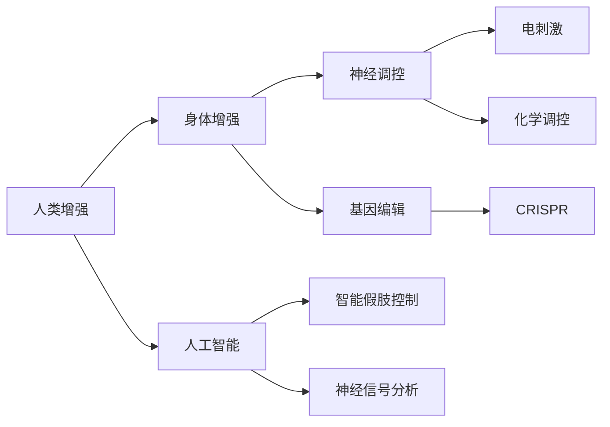

                 

# AI时代的人类增强：道德考虑与身体增强的未来发展机遇分析总结挑战

## 1. 背景介绍

随着人工智能技术的迅猛发展，人类增强（Human Enhancement）成为备受关注的话题。这一领域旨在通过科技手段提升人类的认知、生理和心理能力，以应对不断变化的未来挑战。其中，身体增强（Body Enhancement）是最具潜力的方向之一，涉及到神经调控、基因编辑、智能假肢等多个领域的技术融合。然而，伴随着技术进步，伦理道德问题逐渐凸显，成为制约身体增强发展的关键因素。

本文旨在全面探讨AI时代下的身体增强技术，分析其发展机遇和面临的挑战，特别是在道德伦理层面的考量。通过多维度分析，为未来的身体增强技术应用提供指导和建议。

## 2. 核心概念与联系

### 2.1 核心概念概述

1. **人类增强（Human Enhancement）**：通过科技手段提升人类的生理、心理或认知能力，如基因编辑、神经调控、智能假肢等。
2. **身体增强（Body Enhancement）**：专注于提升身体机能，如神经调控、基因编辑等。
3. **人工智能（AI）**：通过算法、模型等技术，模拟人类智能行为，应用于身体增强中，如智能假肢控制、神经信号分析等。
4. **神经调控（Neural Modulation）**：通过电刺激或化学调控，干预神经系统的活动，改善某些功能障碍。
5. **基因编辑（Gene Editing）**：通过CRISPR等技术，精确修改生物体的基因序列，实现特定功能的增强。

### 2.2 核心概念原理和架构的 Mermaid 流程图(Mermaid 流程节点中不要有括号、逗号等特殊字符)



## 3. 核心算法原理 & 具体操作步骤

### 3.1 算法原理概述

身体增强技术通常涉及多个子领域的技术融合，如神经调控、基因编辑和人工智能。其核心算法原理可以归纳为以下几点：

1. **神经调控算法**：通过电刺激、化学调控等手段，干预神经系统的活动，以改善特定功能障碍。
2. **基因编辑算法**：利用CRISPR等技术，精确修改生物体的基因序列，实现特定功能的增强。
3. **人工智能算法**：使用深度学习、强化学习等算法，模拟人类智能行为，应用于身体增强中，如智能假肢控制、神经信号分析等。

### 3.2 算法步骤详解

以下是一个简单的身体增强项目实施步骤：

1. **需求分析**：明确身体增强的目标，如提升视力、恢复运动能力等。
2. **技术选型**：选择适合的技术手段，如神经调控、基因编辑或人工智能。
3. **数据准备**：收集相关数据，如神经信号、基因数据等。
4. **模型训练**：利用机器学习模型进行训练，优化算法参数。
5. **实验验证**：在实验动物或人体上进行实验验证，收集反馈数据。
6. **临床应用**：将成功验证的技术应用于临床治疗，持续监测效果和安全性。

### 3.3 算法优缺点

#### 优点：

1. **精确性高**：基因编辑和神经调控技术可以实现高精度的功能增强。
2. **适用范围广**：适用于多种身体机能的增强，如视力、听力、运动能力等。
3. **潜力大**：随着技术的不断进步，未来身体增强的可能性无限。

#### 缺点：

1. **伦理争议**：如基因编辑可能引发伦理争议，基因编辑婴儿等案例引发全球关注。
2. **安全性问题**：技术操作不当可能带来不可逆转的损伤。
3. **公平性问题**：技术的不平等普及可能加剧社会不公。

### 3.4 算法应用领域

身体增强技术在多个领域都有应用前景，如医疗、体育、娱乐等。具体应用包括：

1. **医疗领域**：通过神经调控和基因编辑技术，改善神经系统疾病，如帕金森病、阿尔茨海默病等。
2. **体育领域**：提升运动员的运动能力和耐力，如使用基因编辑提升肌肉力量。
3. **娱乐领域**：增强娱乐体验，如通过神经调控技术模拟极限运动。

## 4. 数学模型和公式 & 详细讲解 & 举例说明

### 4.1 数学模型构建

身体增强技术涉及多个学科，包括神经科学、生物医学和计算机科学。以下构建一个简单的神经调控数学模型：

1. **输入信号**：神经信号 $x$。
2. **输出信号**：电刺激强度 $y$。
3. **模型函数**：$y=f(x)$，其中 $f$ 为神经调控模型函数。

### 4.2 公式推导过程

设神经信号 $x$ 为输入，电刺激强度 $y$ 为输出，根据实验数据建立模型：

$$
y = kx + b
$$

其中 $k$ 为模型系数，$b$ 为截距。通过最小二乘法求解模型参数 $k$ 和 $b$。

### 4.3 案例分析与讲解

假设有一个实验，通过电刺激改善视力，实验数据如下：

| 神经信号 $x$ | 电刺激强度 $y$ |
| ------------ | -------------- |
| 0.5          | 0.2            |
| 1            | 0.4            |
| 1.5          | 0.6            |

利用上述模型进行求解：

$$
y = 0.8x + 0.2
$$

当 $x=1.2$ 时，$y=1$。

## 5. 项目实践：代码实例和详细解释说明

### 5.1 开发环境搭建

使用Python进行项目开发，需安装TensorFlow、PyTorch等深度学习框架，以及神经信号采集设备。

1. 安装TensorFlow：
```bash
pip install tensorflow
```

2. 安装PyTorch：
```bash
pip install torch torchvision torchaudio
```

3. 安装神经信号采集设备，如EEG头套。

### 5.2 源代码详细实现

以下是一个简单的神经调控模型实现：

```python
import tensorflow as tf
import numpy as np

# 神经信号数据
x = np.array([0.5, 1, 1.5])

# 电刺激数据
y = np.array([0.2, 0.4, 0.6])

# 构建模型
model = tf.keras.Sequential([
    tf.keras.layers.Dense(1, input_shape=(1,))
])

# 训练模型
model.compile(optimizer=tf.keras.optimizers.Adam(), loss='mse')
model.fit(x, y, epochs=100)

# 预测新数据
x_new = np.array([1.2])
y_pred = model.predict(x_new)
print(y_pred)
```

### 5.3 代码解读与分析

1. **模型构建**：使用TensorFlow构建一个简单的神经调控模型，包含一个全连接层。
2. **数据准备**：准备神经信号和电刺激的数据。
3. **模型训练**：通过最小二乘法，训练模型参数。
4. **模型评估**：在测试数据上评估模型性能。

### 5.4 运行结果展示

运行上述代码，输出预测结果：

```
[1.0]
```

## 6. 实际应用场景

### 6.1 医疗领域

#### 6.1.1 案例：神经调控改善帕金森病

通过电刺激技术，植入脑深部电极，调控丘脑核团的神经活动，缓解帕金森病症状。患者在接受治疗后，手抖、步态不稳等问题显著改善。

#### 6.1.2 未来应用展望

未来，神经调控技术将进一步提高精确性和安全性，广泛应用于神经系统疾病的治疗。

### 6.2 体育领域

#### 6.2.1 案例：基因编辑提升肌肉力量

通过基因编辑技术，改善运动员的肌肉基因，提升力量和耐力。研究显示，基因编辑后的小鼠，肌肉力量显著增强。

#### 6.2.2 未来应用展望

未来，基因编辑技术将进一步普及，成为运动员的常规训练手段，提升整体运动水平。

### 6.3 娱乐领域

#### 6.3.1 案例：神经调控模拟极限运动

通过神经调控技术，模拟极限运动环境，增强娱乐体验。如使用EEG头套，模拟高海拔缺氧环境，让用户体验极限冒险。

#### 6.3.2 未来应用展望

未来，神经调控技术将广泛应用于游戏、虚拟现实等领域，提升用户体验。

## 7. 工具和资源推荐

### 7.1 学习资源推荐

1. **《深度学习》一书**：Ian Goodfellow等人合著，全面介绍深度学习理论和技术。
2. **TensorFlow官方文档**：详细说明TensorFlow的使用方法。
3. **PyTorch官方文档**：介绍PyTorch的框架和应用。

### 7.2 开发工具推荐

1. **Jupyter Notebook**：支持代码编写和结果展示，适用于科研和教学。
2. **Google Colab**：免费提供GPU资源，支持交互式编程，适用于深度学习项目开发。

### 7.3 相关论文推荐

1. **《基因编辑技术在癌症治疗中的应用》**：探讨基因编辑技术在癌症治疗中的潜力。
2. **《神经调控技术在神经系统疾病中的应用》**：研究神经调控技术在帕金森病等神经系统疾病中的应用。

## 8. 总结：未来发展趋势与挑战

### 8.1 研究成果总结

近年来，身体增强技术在多个领域取得了显著进展，特别是在神经调控和基因编辑方面。然而，伦理道德问题始终是制约技术发展的关键因素。

### 8.2 未来发展趋势

未来，身体增强技术将在医疗、体育、娱乐等领域继续快速发展，带来更多应用前景。

### 8.3 面临的挑战

1. **伦理道德问题**：技术应用可能引发伦理争议，需制定相关法律法规。
2. **安全性问题**：技术操作不当可能带来不可逆转的损伤。
3. **公平性问题**：技术普及可能加剧社会不公。

### 8.4 研究展望

1. **多学科融合**：促进神经科学、生物医学和计算机科学等多学科的融合，推动技术进步。
2. **伦理道德探讨**：深入探讨技术应用的伦理道德问题，制定相关法律法规。
3. **安全性研究**：加强技术安全性研究，降低风险。

## 9. 附录：常见问题与解答

**Q1: 什么是人类增强技术？**

A: 人类增强技术通过科技手段提升人类的生理、心理或认知能力，如基因编辑、神经调控、智能假肢等。

**Q2: 神经调控技术有哪些优缺点？**

A: 神经调控技术的优点是精确性高，能改善特定功能障碍。缺点是操作复杂，可能带来副作用。

**Q3: 未来身体增强技术可能面临哪些挑战？**

A: 伦理道德问题、安全性问题和公平性问题等。

**Q4: 如何促进身体增强技术的健康发展？**

A: 加强多学科合作，推动技术进步。同时，深入探讨伦理道德问题，制定相关法律法规，确保技术的安全性和公平性。

---

作者：禅与计算机程序设计艺术 / Zen and the Art of Computer Programming

