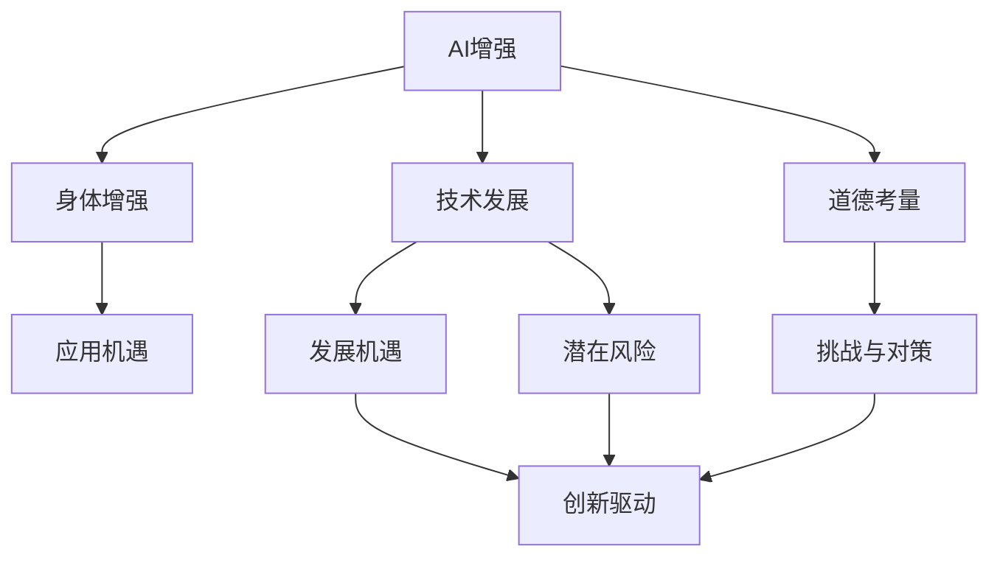

                 

# AI时代的人类增强：道德考虑与身体增强的未来发展机遇分析挑战

> 关键词：AI增强, 道德考量, 身体增强, 技术发展, 应用机遇, 挑战与对策

## 1. 背景介绍

随着人工智能(AI)技术的飞速发展，特别是AI在各个领域的应用深化，"人类增强"成为了一个备受关注的热点话题。所谓人类增强，是指通过技术手段，提升人类的认知能力、物理能力和心理素质，从而实现个体和社会的全面提升。其中，身体增强是最直观和显著的一类增强方式，包括通过药物、手术、机械外骨骼、脑机接口等方式，拓展人体的生理功能。

在AI时代，身体增强不仅限于传统的医疗康复、运动训练等领域，还扩展到了提升工作效率、探索未知极限等多个领域。例如，通过增强现实(AR)、虚拟现实(VR)等技术，结合AI算法，可以在提高人类视觉、听觉等感官能力的同时，实现空间信息处理和认知推理能力的提升。然而，在享受身体增强带来的便利和优势的同时，也必须对其可能带来的道德伦理问题进行深入思考和探讨。

## 2. 核心概念与联系

### 2.1 核心概念概述

为了更好地理解身体增强在AI时代的机遇与挑战，本文将介绍几个核心概念及其相互之间的联系：

- **AI增强**：通过AI技术，增强人类的感知、认知和执行能力。例如，通过AI辅助医疗手术、AI辅助驾驶、AI辅助训练等。
- **身体增强**：通过物理或心理手段，提升人类的物理机能或心智水平。例如，通过手术植入假肢、使用脑机接口、采用机械外骨骼等。
- **技术发展**：AI和身体增强技术的进步为人类带来了前所未有的发展机遇，但也带来了诸多挑战。
- **道德考量**：在享受技术带来便利的同时，必须考虑技术的伦理问题，如隐私保护、安全性、公平性等。
- **应用机遇**：AI和身体增强技术在医疗、教育、工业、军事等多个领域有着广泛的应用前景。
- **挑战与对策**：如何在技术发展和伦理考量之间找到平衡，是未来必须面对的挑战。

这些概念之间的关系可以通过以下Mermaid流程图来展示：



这个流程图展示了AI增强、身体增强技术的发展，及其在带来应用机遇的同时，也伴随着道德挑战和风险。通过平衡发展机遇与道德考量，可以更好地推动技术应用。

## 3. 核心算法原理 & 具体操作步骤

### 3.1 算法原理概述

AI时代的人类增强，主要涉及两个关键领域的算法：AI增强和身体增强。AI增强通过机器学习、深度学习等技术，提升人类的认知能力和执行效率。身体增强则通过生物技术、机械工程等手段，拓展人类的物理机能。

对于AI增强，核心算法包括但不限于：
- 机器学习算法：用于数据分析、模式识别、决策支持等。
- 深度学习算法：用于图像识别、语音识别、自然语言处理等。
- 强化学习算法：用于智能决策、自动控制等。

对于身体增强，核心算法包括但不限于：
- 生物传感器技术：用于监测人体生理状态，如心率、血压等。
- 机械设计原理：用于设计轻便、高强度、可穿戴的机械外骨骼。
- 脑机接口技术：用于实现人机交互，如读取大脑信号控制机械。

### 3.2 算法步骤详解

**AI增强的算法步骤**：

1. **数据采集**：收集相关的生理数据、环境数据、行为数据等，为AI模型训练提供素材。
2. **模型训练**：选择合适的AI算法模型，使用大量标注数据进行训练，优化模型参数。
3. **模型部署**：将训练好的模型部署到实际应用场景中，进行实时推理。
4. **模型优化**：根据反馈数据，持续优化模型，提升性能。

**身体增强的算法步骤**：

1. **需求分析**：明确身体增强的目标，如增强某一特定功能，提高某一特定能力。
2. **技术方案设计**：根据需求分析，设计实现方案，选择适合的物理技术或生物技术。
3. **技术实现**：进行技术研发，实现身体增强功能。
4. **安全测试**：进行严格的测试，确保身体增强功能的安全性和可靠性。
5. **临床试验**：进行小规模的临床试验，验证身体增强功能的效果和副作用。

### 3.3 算法优缺点

**AI增强的算法优点**：
- **高效率**：AI算法能够快速处理和分析大量数据，提升决策效率。
- **高精度**：深度学习等算法在特定任务上可以达到极高的精度。
- **高扩展性**：AI算法可以应用于各种场景，具有广泛的应用前景。

**AI增强的算法缺点**：
- **数据依赖**：AI算法依赖大量高质量数据进行训练，数据采集成本较高。
- **过拟合风险**：AI算法在特定场景下容易过拟合，泛化能力有限。
- **隐私安全**：AI算法需要处理大量个人隐私数据，存在数据泄露风险。

**身体增强的算法优点**：
- **物理干预**：身体增强可以直接提升人类的物理机能，效果显著。
- **直接感知**：身体增强可以通过直接的感官反馈，提升用户的体验。

**身体增强的算法缺点**：
- **技术难度高**：身体增强涉及多个技术领域，实现难度较大。
- **成本高昂**：身体增强技术成本较高，普通用户难以承担。
- **风险大**：身体增强可能带来健康风险，如肌肉萎缩、神经损伤等。

### 3.4 算法应用领域

**AI增强的应用领域**：

- **医疗领域**：AI辅助诊断、AI手术导航、AI健康管理等。
- **教育领域**：AI个性化教学、AI教育资源推荐、AI教育评估等。
- **工业领域**：AI智能制造、AI质量检测、AI设备维护等。
- **军事领域**：AI军事决策、AI侦察监控、AI模拟训练等。

**身体增强的应用领域**：

- **医疗康复**：使用机械外骨骼辅助行走、使用假肢替代残肢等。
- **运动训练**：使用AR/VR技术进行虚拟训练、使用机械外骨骼提高运动能力等。
- **工作辅助**：使用机械臂代替手臂劳动、使用脑机接口控制机械等。
- **娱乐体验**：使用VR设备增强娱乐体验、使用增强现实技术进行互动等。

## 4. 数学模型和公式 & 详细讲解 & 举例说明

### 4.1 数学模型构建

为了更好地理解AI增强和身体增强技术的数学基础，我们首先介绍一些基本的数学模型：

**AI增强的数学模型**：

1. **监督学习模型**：
   - 输入：生理数据、环境数据、行为数据等。
   - 输出：预测结果，如疾病诊断、行为预测等。
   - 损失函数：用于衡量模型预测结果与实际结果之间的差异。
   - 优化目标：最小化损失函数，优化模型参数。

2. **强化学习模型**：
   - 输入：环境状态、当前策略、历史数据等。
   - 输出：最优策略，如自动化控制、决策支持等。
   - 奖励函数：用于评估策略的效果。
   - 优化目标：最大化长期奖励，优化策略参数。

**身体增强的数学模型**：

1. **生物传感器模型**：
   - 输入：生物信号，如心率、血压、脑电波等。
   - 输出：生理状态，如运动能力、认知水平等。
   - 信号处理模型：用于提取生物信号特征。
   - 参数优化模型：用于优化传感器参数。

2. **机械设计模型**：
   - 输入：机械参数、物理属性等。
   - 输出：机械性能，如强度、稳定性等。
   - 优化模型：用于优化机械设计参数。

3. **脑机接口模型**：
   - 输入：大脑信号、机械指令等。
   - 输出：机械控制信号，如机械手臂运动、机械外骨骼控制等。
   - 信号转换模型：用于将大脑信号转换为控制信号。

### 4.2 公式推导过程

**AI增强的公式推导**：

1. **监督学习公式**：
   - 损失函数：$\mathcal{L}=\frac{1}{n}\sum_{i=1}^{n}(y_i-\hat{y_i})^2$
   - 优化目标：$\min_\theta \mathcal{L}(\theta)$
   - 参数更新：$\theta=\theta-\eta\nabla_\theta\mathcal{L}(\theta)$

2. **强化学习公式**：
   - 奖励函数：$R_i$
   - 动作选择：$a_t=\pi(a_t|s_t,\theta)$
   - 状态转移：$s_{t+1}=f(s_t,a_t)$
   - 优化目标：$\max_\theta \sum_{t=0}^{\infty}\gamma^t R_t$
   - 策略更新：$\pi_{\theta}(a|s)=\frac{\exp(Q_\theta(s,a))}{\sum_a \exp(Q_\theta(s,a))}$

**身体增强的公式推导**：

1. **生物传感器公式**：
   - 信号处理模型：$y=f(x)$
   - 参数优化模型：$\theta=\arg\min_\theta\mathcal{L}(\theta)$
   - 数据拟合模型：$x\sim p(x),y\sim p(y|x,\theta)$

2. **机械设计公式**：
   - 优化模型：$\min_\theta\mathcal{L}(\theta)=\min_\theta\int L(x,\theta)P(x)dx$
   - 约束条件：$\{g_i(x,\theta)=0,i=1,2,...,m\}$

3. **脑机接口公式**：
   - 信号转换模型：$z=f(x)$
   - 控制信号模型：$y=g(z)$
   - 控制优化模型：$\min_\theta\mathcal{L}(\theta)=\min_\theta\int L(y,\theta)P(y)dy$

### 4.3 案例分析与讲解

**AI增强的案例**：

- **AI辅助医疗手术**：使用深度学习算法，根据手术图像数据，生成最优手术路径。
  - **数据采集**：手术图像、患者生理参数等。
  - **模型训练**：卷积神经网络，用于图像处理和分析。
  - **模型部署**：手术室内的实时图像处理和反馈系统。
  - **模型优化**：根据反馈数据，优化手术路径算法。

**身体增强的案例**：

- **机械外骨骼**：使用机械外骨骼辅助肢体受伤者行走。
  - **需求分析**：辅助行走，提高生活质量。
  - **技术方案设计**：使用轻质材料、高强度结构、可穿戴设计。
  - **技术实现**：机械设计和制造，软件控制和交互设计。
  - **安全测试**：确保机械性能和用户安全性。
  - **临床试验**：验证机械外骨骼的效果和副作用。

## 5. 项目实践：代码实例和详细解释说明

### 5.1 开发环境搭建

在进行AI增强和身体增强的实践前，我们需要准备好开发环境。以下是使用Python进行AI和身体增强项目开发的常见环境配置流程：

1. **安装Python**：从官网下载并安装Python，选择对应的Python版本。
   - `sudo apt-get install python3.8`

2. **安装相关库**：安装用于AI增强和身体增强开发的常用Python库。
   - `pip install numpy scipy scikit-learn torch`

3. **安装物理传感器设备**：购买并安装生物传感器设备，如心率监测器、脑电波采集器等。
4. **安装机械设计软件**：购买并安装机械设计软件，如SolidWorks、AutoCAD等。

完成上述步骤后，即可在本地环境中开始开发。

### 5.2 源代码详细实现

**AI增强的代码实现**：

1. **数据采集模块**：
   ```python
   import numpy as np
   
   class DataCollector:
       def __init__(self, filename):
           self.filename = filename
           self.data = []
           
       def collect_data(self):
           with open(self.filename, 'r') as f:
               lines = f.readlines()
               for line in lines:
                   self.data.append(line.strip())
   ```

2. **模型训练模块**：
   ```python
   import torch
   from torch import nn, optim
   
   class Model(nn.Module):
       def __init__(self, input_size, output_size):
           super(Model, self).__init__()
           self.fc1 = nn.Linear(input_size, 128)
           self.fc2 = nn.Linear(128, output_size)
           
       def forward(self, x):
           x = self.fc1(x)
           x = self.fc2(x)
           return x
   
   def train_model(model, data, batch_size, epochs):
       criterion = nn.MSELoss()
       optimizer = optim.SGD(model.parameters(), lr=0.01)
   
       for epoch in range(epochs):
           for i in range(0, len(data), batch_size):
               x = data[i:i+batch_size]
               y = data[i+batch_size:i+2*batch_size]
               output = model(x)
               loss = criterion(output, y)
               optimizer.zero_grad()
               loss.backward()
               optimizer.step()
               
       return model
   ```

3. **模型部署模块**：
   ```python
   import torch
   
   def deploy_model(model, x):
       output = model(x)
       return output
   ```

**身体增强的代码实现**：

1. **需求分析模块**：
   ```python
   import sympy
   
   class Requirement:
       def __init__(self, goal):
           self.goal = goal
           self.tasks = []
           
       def add_task(self, task):
           self.tasks.append(task)
   
       def calculate_requirements(self):
           requirements = {}
           for task in self.tasks:
               requirements[task] = task.calculate_requirements()
           return requirements
   ```

2. **技术方案设计模块**：
   ```python
   class Design:
       def __init__(self, requirements):
           self.requirements = requirements
           
       def design_solution(self):
           solution = {}
           for requirement in self.requirements:
               solution[requirement] = requirement.design_solution()
           return solution
   ```

3. **技术实现模块**：
   ```python
   class Implementation:
       def __init__(self, design):
           self.design = design
           
       def implement_solution(self):
           implementation = {}
           for requirement in self.design:
               implementation[requirement] = requirement.implement_solution()
           return implementation
   ```

4. **安全测试模块**：
   ```python
   class SafetyTest:
       def __init__(self, implementation):
           self.implementation = implementation
           
       def test_safety(self):
           results = {}
           for component in self.implementation:
               results[component] = component.test_safety()
           return results
   ```

5. **临床试验模块**：
   ```python
   class ClinicalTrial:
       def __init__(self, implementation):
           self.implementation = implementation
           
       def run_trial(self):
           results = {}
           for component in self.implementation:
               results[component] = component.run_trial()
           return results
   ```

### 5.3 代码解读与分析

**AI增强的代码解读**：

1. **数据采集模块**：用于从文件中读取数据，并进行初步处理。
2. **模型训练模块**：使用Sympy和PyTorch构建深度学习模型，并进行训练。
3. **模型部署模块**：使用PyTorch进行模型推理，得到预测结果。

**身体增强的代码解读**：

1. **需求分析模块**：用于描述身体增强的目标和任务，如辅助行走、提高认知能力等。
2. **技术方案设计模块**：根据需求分析，设计实现方案，如使用机械外骨骼、使用脑机接口等。
3. **技术实现模块**：具体实现技术方案，如机械设计、软件控制等。
4. **安全测试模块**：对实现的技术进行安全性测试，确保其可靠性和安全性。
5. **临床试验模块**：在实际环境中进行小规模试验，验证技术效果和副作用。

## 6. 实际应用场景

### 6.1 智能医疗

**智能医疗**：

- **AI增强**：使用AI进行疾病诊断、治疗方案推荐、手术辅助等。
- **身体增强**：使用机械外骨骼辅助行动不便的病患、使用虚拟现实技术进行康复训练等。

**实际应用案例**：

1. **AI辅助诊断**：使用深度学习算法，通过医学影像数据进行疾病诊断，提高诊断准确率和效率。
2. **AI手术辅助**：使用机器人辅助手术，提高手术精度和安全性。
3. **机械外骨骼辅助**：使用机械外骨骼，帮助行动不便的病患进行日常活动和康复训练。
4. **虚拟现实康复**：使用VR技术进行康复训练，提高康复效果和患者体验。

### 6.2 智能教育

**智能教育**：

- **AI增强**：使用AI进行个性化教学、作业批改、学习分析等。
- **身体增强**：使用增强现实技术进行互动式学习、使用脑机接口进行远程教育等。

**实际应用案例**：

1. **个性化教学**：使用AI分析学生的学习情况，制定个性化学习计划。
2. **作业批改**：使用AI批改作业，提高批改效率和准确率。
3. **虚拟教室**：使用增强现实技术构建虚拟教室，提高教学互动性。
4. **远程教育**：使用脑机接口进行远程教育，提升教育效果和体验。

### 6.3 智能工业

**智能工业**：

- **AI增强**：使用AI进行智能制造、质量检测、设备维护等。
- **身体增强**：使用机械外骨骼进行高强度作业、使用增强现实技术进行现场操作指导等。

**实际应用案例**：

1. **智能制造**：使用AI优化生产流程，提高生产效率和质量。
2. **质量检测**：使用AI进行产品缺陷检测，提高检测效率和准确率。
3. **设备维护**：使用AI进行设备故障诊断和维护预测，提高设备可靠性。
4. **机械外骨骼作业**：使用机械外骨骼，帮助工人进行高强度作业，提高工作效率。

## 7. 工具和资源推荐

### 7.1 学习资源推荐

为了帮助开发者系统掌握AI增强和身体增强的理论基础和实践技巧，这里推荐一些优质的学习资源：

1. **《深度学习》书籍**：Ian Goodfellow、Yoshua Bengio、Aaron Courville所著，全面介绍了深度学习的基本概念、算法和应用。
2. **《强化学习》书籍**：Richard Sutton、Andrew Barton所著，深入介绍了强化学习的基本原理、算法和应用。
3. **Coursera《深度学习专项课程》**：由Coursera和DeepLearning.ai联合开设，涵盖深度学习、神经网络、自然语言处理等多个领域的课程。
4. **Udacity《AI增强现实》课程**：Udacity推出的AR开发课程，涵盖AR技术的基本原理、开发工具和实践技巧。
5. **Kaggle竞赛平台**：提供各类AI增强和身体增强竞赛，帮助开发者在实践中提升技能。

通过对这些资源的学习实践，相信你一定能够快速掌握AI增强和身体增强的精髓，并用于解决实际的AI问题。

### 7.2 开发工具推荐

高效的开发离不开优秀的工具支持。以下是几款用于AI增强和身体增强开发的常用工具：

1. **TensorFlow**：Google开源的深度学习框架，灵活的计算图设计，支持分布式训练。
2. **PyTorch**：Facebook开源的深度学习框架，易于使用，支持动态计算图。
3. **OpenAI Gym**：用于测试和比较强化学习算法的开源平台，包含大量环境数据集。
4. **Unity**：用于AR、VR开发的游戏引擎，支持强大的图形渲染和交互设计。
5. **AutoCAD**：Autodesk公司开发的机械设计软件，支持复杂几何设计和模拟。
6. **SolidWorks**：达索系统公司开发的机械设计软件，支持实体建模和仿真。

合理利用这些工具，可以显著提升AI增强和身体增强的开发效率，加快创新迭代的步伐。

### 7.3 相关论文推荐

AI增强和身体增强技术的不断发展源于学界的持续研究。以下是几篇奠基性的相关论文，推荐阅读：

1. **《深度学习》书籍**：Ian Goodfellow、Yoshua Bengio、Aaron Courville所著，全面介绍了深度学习的基本概念、算法和应用。
2. **《强化学习》书籍**：Richard Sutton、Andrew Barton所著，深入介绍了强化学习的基本原理、算法和应用。
3. **《深度学习与医疗影像分析》论文**：该论文展示了AI在医疗影像分析中的应用，提高了诊断准确率和效率。
4. **《机械外骨骼设计》论文**：该论文介绍了机械外骨骼的原理和设计方法，提升了辅助行走的效果。
5. **《脑机接口技术》论文**：该论文介绍了脑机接口的基本原理和技术应用，为远程教育和智能控制提供了新的思路。

这些论文代表了大语言模型微调技术的发展脉络。通过学习这些前沿成果，可以帮助研究者把握学科前进方向，激发更多的创新灵感。

## 8. 总结：未来发展趋势与挑战

### 8.1 总结

本文对AI增强和身体增强技术进行了全面系统的介绍。首先阐述了AI增强和身体增强技术的背景和发展趋势，明确了技术在各个领域的应用前景和潜力。其次，从原理到实践，详细讲解了AI增强和身体增强的数学模型和算法实现，给出了具体的代码实例和详细解读。同时，本文还广泛探讨了AI增强和身体增强在智能医疗、智能教育、智能工业等多个行业领域的应用场景，展示了技术的广泛应用价值。最后，本文精选了AI增强和身体增强技术的各类学习资源，力求为读者提供全方位的技术指引。

通过本文的系统梳理，可以看到，AI增强和身体增强技术正在成为各个行业的重要工具，为人类认知智能的进化带来深远影响。未来，伴随AI和身体增强技术的持续演进，相信AI增强和身体增强技术必将在构建人机协同的智能时代中扮演越来越重要的角色。

### 8.2 未来发展趋势

展望未来，AI增强和身体增强技术将呈现以下几个发展趋势：

1. **技术融合**：AI增强和身体增强技术将与其他前沿技术进行深度融合，如量子计算、基因编辑等，进一步拓展应用场景和提升性能。
2. **跨领域应用**：AI增强和身体增强技术将在更多领域得到应用，如军事、金融、娱乐等，为各个行业带来变革性影响。
3. **个性化定制**：通过大数据和AI技术，实现对身体增强和AI增强的个性化定制，满足不同用户的独特需求。
4. **伦理和法规**：随着技术的应用深入，伦理和法规问题将逐渐凸显，各方需共同探讨，制定合理的标准和规范。

以上趋势凸显了AI增强和身体增强技术的广阔前景。这些方向的探索发展，必将进一步推动技术应用，为人类社会带来更大的价值。

### 8.3 面临的挑战

尽管AI增强和身体增强技术已经取得了瞩目成就，但在迈向更加智能化、普适化应用的过程中，它仍面临着诸多挑战：

1. **技术瓶颈**：当前技术在某些领域还存在局限，如机械外骨骼的舒适性和可靠性，AI增强的通用性和安全性等。需要进一步优化技术，提升用户体验。
2. **伦理问题**：AI增强和身体增强技术可能带来隐私、安全性、公平性等伦理问题，需要制定相应的法规和规范。
3. **数据隐私**：AI增强和身体增强技术需要大量的数据支持，数据隐私保护成为重要问题。需要合理利用数据，保护用户隐私。
4. **成本问题**：AI增强和身体增强技术的实现成本较高，普通用户难以承担。需要降低技术成本，推广技术应用。
5. **安全性**：AI增强和身体增强技术可能带来安全隐患，如AI决策错误、身体增强副作用等。需要加强安全性保障。

正视技术发展中面临的这些挑战，积极应对并寻求突破，将是大语言模型微调技术走向成熟的必由之路。相信随着学界和产业界的共同努力，这些挑战终将一一被克服，AI增强和身体增强技术必将在构建人机协同的智能时代中扮演越来越重要的角色。

### 8.4 研究展望

面对AI增强和身体增强技术面临的种种挑战，未来的研究需要在以下几个方面寻求新的突破：

1. **技术融合**：探索AI增强和身体增强技术与其他前沿技术进行深度融合，如量子计算、基因编辑等，进一步拓展应用场景和提升性能。
2. **跨领域应用**：拓展AI增强和身体增强技术在更多领域的应用，如军事、金融、娱乐等，为各个行业带来变革性影响。
3. **个性化定制**：通过大数据和AI技术，实现对身体增强和AI增强的个性化定制，满足不同用户的独特需求。
4. **伦理和法规**：制定合理的伦理和法规标准，保护用户隐私和安全，推动技术健康发展。
5. **成本问题**：降低技术成本，推广技术应用，使更多人受益于AI增强和身体增强技术。

这些研究方向的探索，必将引领AI增强和身体增强技术迈向更高的台阶，为构建安全、可靠、可解释、可控的智能系统铺平道路。面向未来，AI增强和身体增强技术还需要与其他人工智能技术进行更深入的融合，如知识表示、因果推理、强化学习等，多路径协同发力，共同推动自然语言理解和智能交互系统的进步。只有勇于创新、敢于突破，才能不断拓展身体增强和AI增强的边界，让智能技术更好地造福人类社会。

## 9. 附录：常见问题与解答

**Q1：AI增强和身体增强是否会对人类就业造成影响？**

A: AI增强和身体增强技术在提高工作效率和生产效率的同时，确实可能对某些职业产生影响。例如，机械外骨骼在提升高强度作业效率的同时，可能会影响部分体力劳动岗位的就业。然而，新的技术和工具也会创造新的就业机会，如AI和身体增强设备的维护、设计、制造等。因此，需要综合考虑技术对就业的影响，通过政策引导和培训等方式，推动就业转型和技能升级。

**Q2：AI增强和身体增强技术是否会导致隐私泄露？**

A: 在使用AI增强和身体增强技术时，确实可能涉及大量的个人生理和行为数据，存在隐私泄露的风险。为应对这一问题，可以采取以下措施：
1. 数据匿名化：对数据进行匿名化处理，保护用户隐私。
2. 数据加密：对数据进行加密存储和传输，防止数据泄露。
3. 数据访问控制：限制数据访问权限，确保只有授权人员才能访问数据。

**Q3：AI增强和身体增强技术是否会带来安全隐患？**

A: AI增强和身体增强技术在提升工作效率和性能的同时，也可能带来安全隐患。例如，AI决策错误可能导致严重后果，机械外骨骼的故障可能导致人身伤害。为应对这一问题，可以采取以下措施：
1. 严格测试：在正式部署前进行严格的安全测试，确保技术和设备的可靠性。
2. 实时监控：在应用过程中进行实时监控，及时发现并处理潜在问题。
3. 应急预案：制定应急预案，一旦发生故障或安全事件，能够迅速响应和处理。

**Q4：AI增强和身体增强技术是否会引发道德伦理问题？**

A: AI增强和身体增强技术在提升工作效率和性能的同时，也可能引发道德伦理问题。例如，脑机接口可能涉及用户隐私和自由意志的问题，机械外骨骼可能影响人体自然形态和功能。为应对这一问题，可以采取以下措施：
1. 制定伦理规范：制定相应的伦理规范和指导原则，确保技术应用符合道德标准。
2. 公众参与：通过公众参与和讨论，广泛听取各方意见，制定合理的规范和政策。
3. 透明公开：公开技术原理和应用场景，确保透明性和公开性，增加公众信任。

总之，AI增强和身体增强技术在带来便利和高效的同时，也伴随着伦理和道德问题。需要在技术发展的同时，持续关注和解决这些问题，确保技术的健康发展。

---

作者：禅与计算机程序设计艺术 / Zen and the Art of Computer Programming

