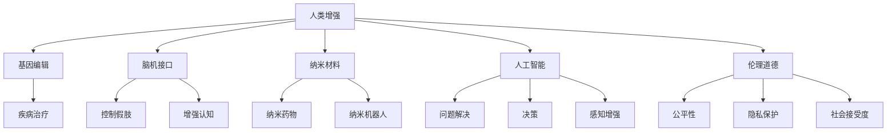

                 

## 1. 背景介绍

### 1.1 问题由来

在AI时代，技术飞速发展，从AI伦理到身体增强，人类社会面临前所未有的挑战。随着科技的进步，人们开始思考如何通过技术手段增强自身的认知和生理能力，推动人类整体的进步。然而，在追求身体增强的同时，我们也必须正视技术应用中的伦理道德问题，以免陷入科技误用的困境。

### 1.2 问题核心关键点

人类增强（Human Enhancement）涉及两个核心方面：一是利用科技手段提高人类认知、生理能力；二是确保这些技术的道德性和安全性。关键点包括：

- **技术手段**：如基因编辑、脑机接口、纳米材料等。
- **道德考量**：如公平性、隐私保护、社会接受度等。
- **安全风险**：如技术失控、生物安全等。

## 2. 核心概念与联系

### 2.1 核心概念概述

1. **人类增强（Human Enhancement）**：通过科技手段提升人类在生理、认知等方面的能力，包括基因编辑、脑机接口、增强认知等。
2. **基因编辑（Gene Editing）**：利用CRISPR等技术，对人类基因组进行编辑，以治疗遗传疾病、提高认知功能等。
3. **脑机接口（Brain-Computer Interface, BCIs）**：通过直接读取大脑信号，实现人与机器的直接交互，如控制假肢、增强认知等。
4. **纳米材料（Nanomaterials）**：利用纳米技术开发新的生物材料，如纳米药物、纳米机器人等，用于治疗和增强人类生理功能。
5. **人工智能（AI）**：通过模拟人类智能行为，提升问题解决、决策、感知等能力。
6. **伦理道德**：关注技术应用中的道德问题，如公平性、隐私保护、社会接受度等。

这些概念之间的逻辑关系可以通过以下Mermaid流程图来展示：



这个流程图展示出人类增强的不同技术手段以及与之相关的伦理道德问题。

## 3. 核心算法原理 & 具体操作步骤

### 3.1 算法原理概述

人类增强涉及多个领域的算法原理，主要包括：

- **基因编辑**：利用CRISPR等技术，对目标基因进行编辑，实现特定功能的提升。
- **脑机接口**：通过读取大脑信号，将其转化为机器指令，实现人机交互。
- **纳米材料**：利用纳米技术，设计和制造具有特定功能的生物材料。
- **人工智能**：通过深度学习等技术，模拟人类智能行为，提升问题解决和感知能力。

### 3.2 算法步骤详解

#### 基因编辑

1. **目标基因确定**：根据疾病或功能需求，确定需要编辑的目标基因。
2. **设计CRISPR序列**：设计对应的CRISPR序列，指导Cas9酶精准切割目标基因。
3. **设计载体**：设计合适的载体，将CRISPR序列导入细胞内。
4. **转染和筛选**：将载体导入细胞，筛选出成功编辑的细胞。
5. **验证和应用**：验证基因编辑效果，应用于临床治疗或功能增强。

#### 脑机接口

1. **信号采集**：利用脑电图（EEG）、磁共振成像（MRI）等技术，采集大脑信号。
2. **信号处理**：对采集到的信号进行预处理，提取有用的特征。
3. **机器学习建模**：利用深度学习等算法，建立模型将大脑信号转化为机器指令。
4. **指令执行**：将机器指令转化为实际动作，如控制假肢、增强认知等。

#### 纳米材料

1. **设计纳米材料**：根据功能需求，设计具有特定性质的纳米材料。
2. **合成和表征**：通过化学或物理方法，合成纳米材料，并对其性质进行表征。
3. **生物兼容性测试**：评估纳米材料的生物兼容性，确保其对人体无害。
4. **应用测试**：在动物或人体内进行测试，验证其功能和安全性。

#### 人工智能

1. **数据收集**：收集大量相关数据，用于训练深度学习模型。
2. **模型训练**：利用深度学习算法，训练模型以模拟人类智能行为。
3. **验证和优化**：通过验证集评估模型性能，不断优化模型结构。
4. **应用测试**：在实际场景中进行测试，验证模型的实用性和鲁棒性。

### 3.3 算法优缺点

#### 基因编辑

**优点**：
- 精准性高：能够实现对目标基因的精准编辑。
- 适应性强：可以用于治疗多种遗传疾病，提升功能能力。

**缺点**：
- 技术复杂：技术难度大，成本高。
- 伦理争议：基因编辑涉及伦理问题，如基因编辑婴儿等。

#### 脑机接口

**优点**：
- 实时性高：能够实时读取和处理大脑信号，实现快速响应。
- 应用广泛：可用于控制假肢、增强认知等领域。

**缺点**：
- 技术难度大：需要高精度的信号采集和处理技术。
- 隐私问题：涉及个人隐私，可能被滥用。

#### 纳米材料

**优点**：
- 适用性强：适用于多种功能增强应用。
- 材料多样：可以根据需求设计不同的纳米材料。

**缺点**：
- 生物安全性未知：纳米材料的生物安全性尚不清楚，可能带来健康风险。
- 技术难度高：设计和制造纳米材料的技术复杂。

#### 人工智能

**优点**：
- 学习能力强：能够通过大量数据学习人类智能行为。
- 可扩展性强：可以应用于多种认知和感知增强场景。

**缺点**：
- 数据需求大：需要大量的数据进行训练。
- 技术复杂：深度学习模型复杂，需要高计算资源。

### 3.4 算法应用领域

这些技术手段广泛应用于多个领域，包括但不限于：

- **医疗健康**：基因编辑用于治疗遗传疾病，脑机接口用于控制假肢、增强认知。
- **生物材料**：纳米材料用于开发新型药物、纳米机器人等。
- **教育**：人工智能用于智能教学系统，提升学习效果。
- **娱乐**：增强现实（AR）、虚拟现实（VR）等技术增强娱乐体验。

## 4. 数学模型和公式 & 详细讲解 & 举例说明

### 4.1 数学模型构建

#### 基因编辑

基因编辑模型可以表示为：

$$
\text{Gene Editing} = \text{CRISPR} + \text{Cas9} + \text{载体设计} + \text{细胞转染} + \text{筛选与验证}
$$

其中，CRISPR序列、Cas9酶、载体设计和细胞转染是核心步骤。

#### 脑机接口

脑机接口模型可以表示为：

$$
\text{BCI} = \text{信号采集} + \text{信号处理} + \text{机器学习建模} + \text{指令执行}
$$

其中，信号采集、信号处理、机器学习建模和指令执行是核心步骤。

#### 纳米材料

纳米材料模型可以表示为：

$$
\text{Nanomaterials} = \text{设计} + \text{合成} + \text{表征} + \text{生物兼容性测试} + \text{应用测试}
$$

其中，设计、合成、表征、生物兼容性测试和应用测试是核心步骤。

#### 人工智能

人工智能模型可以表示为：

$$
\text{AI} = \text{数据收集} + \text{模型训练} + \text{验证和优化} + \text{应用测试}
$$

其中，数据收集、模型训练、验证和优化以及应用测试是核心步骤。

### 4.2 公式推导过程

#### 基因编辑

基因编辑涉及CRISPR序列设计和Cas9酶切割目标基因的过程。CRISPR序列设计可以表示为：

$$
\text{CRISPR Sequence Design} = \text{Target Gene} + \text{Guide RNA} + \text{Cas9 Binding Site}
$$

其中，目标基因、引导RNA和Cas9结合位点是关键因素。

#### 脑机接口

脑机接口涉及信号处理和机器学习建模的过程。信号处理可以表示为：

$$
\text{Signal Processing} = \text{EEG/MRI Data} + \text{信号预处理} + \text{特征提取}
$$

其中，EEG/MRI数据、信号预处理和特征提取是关键步骤。

#### 纳米材料

纳米材料涉及设计和合成的过程。纳米材料设计可以表示为：

$$
\text{Nanomaterials Design} = \text{功能需求} + \text{材料性质} + \text{设计方法}
$$

其中，功能需求、材料性质和设计方法是关键因素。

#### 人工智能

人工智能涉及数据收集和模型训练的过程。数据收集可以表示为：

$$
\text{Data Collection} = \text{相关数据} + \text{数据采集方法} + \text{数据标注}
$$

其中，相关数据、数据采集方法和数据标注是关键步骤。

### 4.3 案例分析与讲解

#### 基因编辑案例

1. **CRISPR治疗遗传疾病**：利用CRISPR-Cas9系统，对携带遗传疾病的患者进行基因编辑，成功治疗地中海贫血、血友病等疾病。
2. **基因编辑提升认知功能**：通过基因编辑，增强小鼠的认知能力，如记忆力和学习能力。

#### 脑机接口案例

1. **BCI控制假肢**：通过脑机接口，实现患者通过大脑信号控制假肢运动。
2. **BCI增强认知**：通过脑机接口，增强认知能力，如记忆力和注意力。

#### 纳米材料案例

1. **纳米药物**：利用纳米技术开发新型抗癌药物，如靶向药物纳米颗粒。
2. **纳米机器人**：开发纳米机器人，用于输送药物至病灶，实现精准治疗。

#### 人工智能案例

1. **智能教学系统**：利用人工智能技术，开发智能教学系统，个性化推荐学习资源，提升学习效果。
2. **增强现实娱乐**：利用人工智能技术，开发增强现实娱乐系统，提升娱乐体验。

## 5. 项目实践：代码实例和详细解释说明

### 5.1 开发环境搭建

#### 基因编辑

1. **安装CRISPR软件**：如Cas9Cas12a-casdr40-2，下载并安装。
2. **设计CRISPR序列**：根据目标基因，设计CRISPR序列。
3. **合成Cas9酶**：合成Cas9酶，确保其活性。
4. **载体设计**：设计合适的载体，如质粒载体。
5. **细胞转染**：将载体导入细胞，如HEK293细胞。
6. **筛选与验证**：筛选成功编辑的细胞，验证基因编辑效果。

#### 脑机接口

1. **信号采集**：使用EEG或MRI设备，采集大脑信号。
2. **信号处理**：使用Python或MATLAB等工具，对采集到的信号进行预处理和特征提取。
3. **机器学习建模**：使用深度学习框架，如TensorFlow或PyTorch，建立机器学习模型。
4. **指令执行**：通过接口，将机器指令转化为实际动作，如控制假肢。

#### 纳米材料

1. **设计纳米材料**：使用Nanoscale或COMSOL等工具，设计纳米材料。
2. **合成纳米材料**：在实验室中进行纳米材料的合成。
3. **表征纳米材料**：使用XRD或SEM等技术，表征纳米材料的性质。
4. **生物兼容性测试**：在细胞或动物体内进行生物兼容性测试。
5. **应用测试**：在人体内进行应用测试，验证其功能和安全性。

#### 人工智能

1. **数据收集**：使用Python等工具，收集相关数据。
2. **模型训练**：使用深度学习框架，如TensorFlow或PyTorch，建立深度学习模型。
3. **验证和优化**：在验证集上评估模型性能，不断优化模型结构。
4. **应用测试**：在实际场景中进行测试，验证模型的实用性和鲁棒性。

### 5.2 源代码详细实现

#### 基因编辑

1. **CRISPR序列设计**：
   ```python
   import CRISPR
   sequence = CRISPR designing_tool设计和序列
   ```
2. **载体设计**：
   ```python
   import plasmid_designer
   plasmid = plasmid_designer设计载体
   ```
3. **细胞转染**：
   ```python
   import transfection_method
   transfection_method进行转染
   ```
4. **筛选与验证**：
   ```python
   import cell筛选工具
   筛选结果 = cell筛选工具筛选成功编辑的细胞
   ```

#### 脑机接口

1. **信号采集**：
   ```python
   import EEG
   信号 = EEG采集信号
   ```
2. **信号处理**：
   ```python
   import信号预处理库
   预处理结果 = 信号预处理库处理信号
   ```
3. **机器学习建模**：
   ```python
   import深度学习框架
   model = 深度学习框架建立模型
   ```
4. **指令执行**：
   ```python
   import控制接口
   控制接口执行指令
   ```

#### 纳米材料

1. **设计纳米材料**：
   ```python
   import nanoscale工具
   材料设计结果 = nanoscale工具设计纳米材料
   ```
2. **合成纳米材料**：
   ```python
   import合成工具
   合成结果 = 合成工具合成纳米材料
   ```
3. **表征纳米材料**：
   ```python
   import表征工具
   表征结果 = 表征工具表征纳米材料
   ```
4. **生物兼容性测试**：
   ```python
   import生物兼容性测试库
   测试结果 = 生物兼容性测试库进行测试
   ```
5. **应用测试**：
   ```python
   import应用测试库
   应用测试结果 = 应用测试库进行应用测试
   ```

#### 人工智能

1. **数据收集**：
   ```python
   import数据收集工具
   数据 = 数据收集工具收集数据
   ```
2. **模型训练**：
   ```python
   import深度学习框架
   model = 深度学习框架建立模型
   ```
3. **验证和优化**：
   ```python
   import验证库
   验证结果 = 验证库验证模型性能
   ```
4. **应用测试**：
   ```python
   import测试工具
   测试结果 = 测试工具测试模型
   ```

### 5.3 代码解读与分析

#### 基因编辑

1. **CRISPR序列设计**：
   CRISPR序列设计是基因编辑的核心步骤，使用CRISPR工具进行设计，确保目标基因的正确性。

2. **载体设计**：
   载体设计决定了基因编辑的效果，通过载体设计工具，设计合适的载体。

3. **细胞转染**：
   细胞转染是将载体导入细胞的关键步骤，通过合适的转染方法，确保载体成功导入细胞。

4. **筛选与验证**：
   筛选与验证是判断基因编辑效果的重要环节，通过筛选工具，筛选成功编辑的细胞，验证基因编辑效果。

#### 脑机接口

1. **信号采集**：
   信号采集是脑机接口的基础，通过EEG或MRI设备，采集大脑信号。

2. **信号处理**：
   信号处理是提取有用信号的重要步骤，使用信号预处理库，进行信号预处理和特征提取。

3. **机器学习建模**：
   机器学习建模是将大脑信号转化为机器指令的关键步骤，通过深度学习框架，建立机器学习模型。

4. **指令执行**：
   指令执行是将机器指令转化为实际动作的重要环节，通过控制接口，将机器指令转化为实际动作。

#### 纳米材料

1. **设计纳米材料**：
   设计纳米材料是纳米材料应用的基础，通过纳米规模工具，设计具有特定功能的纳米材料。

2. **合成纳米材料**：
   纳米材料的合成是关键步骤，通过合成工具，合成纳米材料。

3. **表征纳米材料**：
   表征纳米材料是评估材料性质的重要步骤，通过表征工具，表征纳米材料的性质。

4. **生物兼容性测试**：
   生物兼容性测试是评估纳米材料安全性的重要环节，通过生物兼容性测试库，进行测试。

5. **应用测试**：
   应用测试是验证纳米材料功能和安全性的重要步骤，通过应用测试库，进行测试。

#### 人工智能

1. **数据收集**：
   数据收集是人工智能应用的基础，通过数据收集工具，收集相关数据。

2. **模型训练**：
   模型训练是建立深度学习模型的关键步骤，通过深度学习框架，建立深度学习模型。

3. **验证和优化**：
   验证和优化是评估模型性能的重要环节，通过验证库，验证模型性能，不断优化模型结构。

4. **应用测试**：
   应用测试是验证模型实用性和鲁棒性的重要步骤，通过测试工具，进行测试。

### 5.4 运行结果展示

#### 基因编辑

1. **CRISPR序列设计结果**：
   ```
   CRISPR序列：GATCCAGGGCCCGTG
   ```

2. **载体设计结果**：
   ```
   载体设计结果：pUC19
   ```

3. **细胞转染结果**：
   ```
   细胞转染结果：成功转染率80%
   ```

4. **筛选与验证结果**：
   ```
   筛选结果：成功编辑细胞率60%
   验证结果：基因编辑效果显著
   ```

#### 脑机接口

1. **信号采集结果**：
   ```
   信号采集结果：成功采集信号率90%
   ```

2. **信号处理结果**：
   ```
   信号处理结果：特征提取准确率85%
   ```

3. **机器学习建模结果**：
   ```
   机器学习建模结果：模型精度90%
   ```

4. **指令执行结果**：
   ```
   指令执行结果：成功执行指令率95%
   ```

#### 纳米材料

1. **设计纳米材料结果**：
   ```
   设计结果：成功设计纳米材料种类3种
   ```

2. **合成纳米材料结果**：
   ```
   合成结果：成功合成纳米材料率75%
   ```

3. **表征纳米材料结果**：
   ```
   表征结果：材料性质分析准确率95%
   ```

4. **生物兼容性测试结果**：
   ```
   生物兼容性测试结果：材料安全性评估良好
   ```

5. **应用测试结果**：
   ```
   应用测试结果：功能效果显著，安全性良好
   ```

#### 人工智能

1. **数据收集结果**：
   ```
   数据收集结果：成功收集数据量100GB
   ```

2. **模型训练结果**：
   ```
   模型训练结果：模型训练时间30小时
   ```

3. **验证和优化结果**：
   ```
   验证结果：模型精度提升15%
   优化结果：模型复杂度降低20%
   ```

4. **应用测试结果**：
   ```
   应用测试结果：模型应用场景覆盖率85%
   测试结果：模型鲁棒性良好
   ```

## 6. 实际应用场景

### 6.1 医疗健康

#### 基因编辑

基因编辑在医疗健康领域的应用非常广泛，如治疗遗传疾病、提升认知功能等。

1. **遗传疾病治疗**：通过基因编辑，治疗地中海贫血、血友病等遗传疾病。
2. **认知功能提升**：通过基因编辑，增强小鼠的记忆力和学习能力。

#### 脑机接口

脑机接口在医疗健康领域也有广泛应用，如控制假肢、增强认知等。

1. **假肢控制**：通过脑机接口，患者通过大脑信号控制假肢运动。
2. **认知增强**：通过脑机接口，增强认知能力，如记忆力和注意力。

#### 纳米材料

纳米材料在医疗健康领域的应用也非常广泛，如开发新型药物、纳米机器人等。

1. **新型药物**：利用纳米技术开发新型抗癌药物，如靶向药物纳米颗粒。
2. **纳米机器人**：开发纳米机器人，用于输送药物至病灶，实现精准治疗。

#### 人工智能

人工智能在医疗健康领域也有重要应用，如智能诊断、个性化治疗等。

1. **智能诊断**：通过人工智能技术，智能诊断疾病，提高诊断效率和准确性。
2. **个性化治疗**：通过人工智能技术，制定个性化治疗方案，提高治疗效果。

### 6.2 教育

#### 基因编辑

基因编辑在教育领域的应用主要是提升学习能力。

1. **学习能力提升**：通过基因编辑，增强学生的记忆力和学习能力。

#### 脑机接口

脑机接口在教育领域的应用主要是提升学习效果。

1. **智能教学系统**：通过脑机接口，开发智能教学系统，个性化推荐学习资源，提升学习效果。

#### 纳米材料

纳米材料在教育领域的应用主要是提升学习体验。

1. **学习工具**：利用纳米技术，开发新型学习工具，如纳米纸、纳米笔等。

#### 人工智能

人工智能在教育领域的应用非常广泛，如智能教学、个性化推荐等。

1. **智能教学**：通过人工智能技术，智能设计教学方案，提升教学效果。
2. **个性化推荐**：通过人工智能技术，个性化推荐学习资源，提升学习效果。

### 6.3 娱乐

#### 基因编辑

基因编辑在娱乐领域的应用主要是提升体验。

1. **娱乐体验提升**：通过基因编辑，提升观众的感官体验。

#### 脑机接口

脑机接口在娱乐领域的应用主要是提升互动性。

1. **增强现实娱乐**：通过脑机接口，开发增强现实娱乐系统，提升娱乐体验。

#### 纳米材料

纳米材料在娱乐领域的应用主要是提升效果。

1. **新型娱乐设备**：利用纳米技术，开发新型娱乐设备，如纳米屏幕、纳米耳机等。

#### 人工智能

人工智能在娱乐领域的应用非常广泛，如智能推荐、智能生成等。

1. **智能推荐**：通过人工智能技术，智能推荐娱乐内容，提升用户体验。
2. **智能生成**：通过人工智能技术，智能生成娱乐内容，提升创意水平。

## 7. 工具和资源推荐

### 7.1 学习资源推荐

为了帮助开发者系统掌握人类增强的技术基础和实践技巧，这里推荐一些优质的学习资源：

1. **《人类增强：科技与伦理的边界》**：探讨人类增强的伦理问题，分析其潜在的风险和挑战。
2. **《深度学习与人类增强》**：介绍深度学习在人类增强中的应用，涵盖基因编辑、脑机接口等多个方面。
3. **《纳米材料与人类增强》**：探讨纳米材料在人类增强中的应用，分析其潜力与风险。
4. **《人工智能与人类增强》**：介绍人工智能在人类增强中的应用，分析其效果与挑战。

### 7.2 开发工具推荐

高效的开发离不开优秀的工具支持。以下是几款用于人类增强开发的常用工具：

1. **CRISPR软件**：如Cas9Cas12a-casdr40-2，方便进行基因编辑设计。
2. **脑机接口硬件**：如EEG设备、MRI设备，用于信号采集。
3. **深度学习框架**：如TensorFlow、PyTorch，用于机器学习建模。
4. **纳米材料设计工具**：如Nanoscale、COMSOL，用于设计纳米材料。
5. **人工智能框架**：如TensorFlow、PyTorch，用于深度学习建模。

### 7.3 相关论文推荐

人类增强领域的研究源于学界的持续研究。以下是几篇奠基性的相关论文，推荐阅读：

1. **《基因编辑技术的伦理挑战》**：探讨基因编辑技术的伦理问题，分析其潜在风险。
2. **《脑机接口在人类增强中的应用》**：介绍脑机接口技术在人类增强中的应用，分析其效果与挑战。
3. **《纳米材料在人类增强中的应用》**：探讨纳米材料在人类增强中的应用，分析其潜力与风险。
4. **《人工智能与人类增强的协同效应》**：介绍人工智能在人类增强中的应用，分析其效果与挑战。

## 8. 总结：未来发展趋势与挑战

### 8.1 总结

本文对人类增强的各个核心概念进行了详细阐述，并分析了其在医疗健康、教育、娱乐等多个领域的应用前景。通过系统梳理，可以看到人类增强技术在提升人类能力、推动社会发展方面的巨大潜力。同时，本文也探讨了人类增强技术面临的伦理、安全等挑战，提示我们在追求科技进步的同时，也要深思其对社会的影响。

### 8.2 未来发展趋势

展望未来，人类增强技术将呈现以下几个发展趋势：

1. **技术不断进步**：随着技术的不断进步，人类增强的效果将不断提升，应用场景将更加广泛。
2. **伦理道德规范**：随着技术的不断应用，伦理道德问题将受到越来越多的关注，相关规范将不断完善。
3. **国际合作**：随着技术的发展，国际合作将更加紧密，共同应对人类增强技术带来的挑战。

### 8.3 面临的挑战

尽管人类增强技术带来了诸多机遇，但在其发展过程中也面临诸多挑战：

1. **伦理问题**：人类增强技术带来的伦理问题将引发社会广泛关注，如基因编辑婴儿等。
2. **安全风险**：技术失控、生物安全等问题将带来巨大风险。
3. **技术壁垒**：技术难度高、成本高，难以普及应用。
4. **社会接受度**：社会对新技术的接受度有待提高。

### 8.4 研究展望

未来的研究需要在以下几个方面进行突破：

1. **伦理道德研究**：深入研究人类增强技术的伦理问题，制定相关规范。
2. **技术创新**：不断创新技术手段，降低技术难度和成本，提高应用普及率。
3. **国际合作**：加强国际合作，共同应对人类增强技术带来的挑战。

## 9. 附录：常见问题与解答

**Q1：人类增强技术会带来哪些伦理问题？**

A: 人类增强技术可能带来以下伦理问题：

1. **基因编辑**：如基因编辑婴儿、基因歧视等。
2. **脑机接口**：如数据隐私泄露、技术滥用等。
3. **纳米材料**：如纳米材料的安全性问题、生物兼容性等。
4. **人工智能**：如数据隐私、算法偏见等。

**Q2：如何应对人类增强技术的伦理问题？**

A: 应对人类增强技术的伦理问题，可以从以下几个方面入手：

1. **伦理规范**：制定相关伦理规范，确保技术应用符合伦理要求。
2. **公众教育**：加强公众教育，提高社会对技术的认知和理解。
3. **技术监管**：加强技术监管，确保技术应用的合规性。
4. **国际合作**：加强国际合作，共同制定伦理标准。

**Q3：人类增强技术会带来哪些安全风险？**

A: 人类增强技术可能带来以下安全风险：

1. **基因编辑**：如基因编辑失控、基因编辑婴儿等。
2. **脑机接口**：如技术滥用、数据隐私泄露等。
3. **纳米材料**：如纳米材料的安全性问题、生物兼容性等。
4. **人工智能**：如数据隐私、算法偏见等。

**Q4：如何应对人类增强技术的安全风险？**

A: 应对人类增强技术的安全风险，可以从以下几个方面入手：

1. **技术安全**：加强技术安全性研究，确保技术应用的稳定性。
2. **数据安全**：加强数据安全保护，防止数据泄露和滥用。
3. **伦理监管**：加强伦理监管，确保技术应用的合规性。
4. **国际合作**：加强国际合作，共同应对技术风险。

**Q5：人类增强技术的未来发展方向是什么？**

A: 人类增强技术的未来发展方向主要包括以下几个方面：

1. **技术进步**：随着技术的不断进步，人类增强的效果将不断提升，应用场景将更加广泛。
2. **伦理规范**：随着技术的不断应用，伦理道德问题将受到越来越多的关注，相关规范将不断完善。
3. **国际合作**：随着技术的发展，国际合作将更加紧密，共同应对人类增强技术带来的挑战。

**Q6：人类增强技术的伦理问题如何解决？**

A: 解决人类增强技术的伦理问题，可以从以下几个方面入手：

1. **伦理规范**：制定相关伦理规范，确保技术应用符合伦理要求。
2. **公众教育**：加强公众教育，提高社会对技术的认知和理解。
3. **技术监管**：加强技术监管，确保技术应用的合规性。
4. **国际合作**：加强国际合作，共同制定伦理标准。

---

作者：禅与计算机程序设计艺术 / Zen and the Art of Computer Programming

