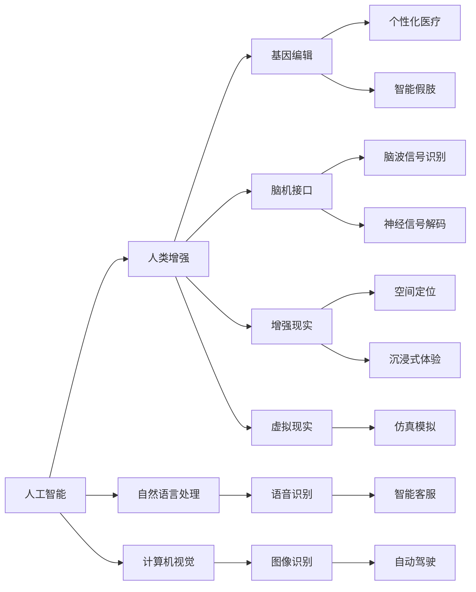

                 

# AI时代的人类增强：道德考虑与身体增强的未来挑战与机遇

> 关键词：人工智能, 人类增强, 身体增强, 道德伦理, 技术未来, 安全保障

## 1. 背景介绍

在AI时代，科技的迅猛发展正在深刻改变人类的生活方式。人工智能(AI)技术的不断进步，不仅在医疗、教育、娱乐等多个领域产生了深远影响，更引发了人类增强的无限想象空间。尤其是身体增强技术，包括基因编辑、脑机接口、虚拟现实等，带来了前所未有的机遇与挑战。

### 1.1 问题由来
身体增强技术的快速发展，使得人类能够在生理、认知等方面获得突破性提升。然而，这些技术的应用也引发了一系列伦理、法律、社会等问题，需要全社会共同面对。

### 1.2 问题核心关键点
- **人工智能与人类增强的交汇点**：AI技术如何与身体增强相结合，能否带来人类能力的质的飞跃？
- **技术伦理与安全问题**：基因编辑、脑机接口等技术的安全性、道德性、合法性问题。
- **社会适应与公平性**：如何确保身体增强技术普惠全人类，避免加剧社会不平等？
- **未来展望与挑战**：身体增强技术的发展路径、潜在的巨大风险和应对措施。

## 2. 核心概念与联系

### 2.1 核心概念概述

为了更好地理解人工智能与人类增强技术的融合应用，我们首先介绍几个关键概念：

- **人工智能(AI)**：通过模拟人类智能过程，实现信息获取、处理、应用和创新的技术。AI技术包括机器学习、深度学习、自然语言处理、计算机视觉等多个领域。

- **人类增强**：通过科技手段，提升人类生理、认知、情感等方面的能力。常见技术包括基因编辑、脑机接口、增强现实、虚拟现实等。

- **身体增强**：指通过科技手段，直接提升或改造人体功能的增强手段，如基因编辑、机械增强等。

- **AI驱动的增强**：通过AI技术辅助人类增强，实现对人类智力和能力的放大，如AI辅助的虚拟教练、个性化医疗、智能假肢等。

这些概念之间的联系和互动，可以通过以下Mermaid流程图来展示：



这个流程图展示了人工智能与人类增强技术之间的互动关系。

## 3. 核心算法原理 & 具体操作步骤

### 3.1 算法原理概述

AI与身体增强技术的结合，涉及到多种跨学科知识的综合运用。其核心算法原理可以概括为：

1. **数据采集与预处理**：通过传感器、摄像头等设备，采集人类生理数据、环境数据，并进行预处理，提取关键特征。
2. **模型训练与优化**：使用机器学习、深度学习等AI算法，训练模型，优化模型参数，使其能够准确预测和生成增强效果。
3. **增强效果应用**：将训练好的模型应用于实际增强场景中，如智能假肢、个性化医疗等，提升人类能力。

### 3.2 算法步骤详解

以基因编辑技术为例，其核心算法步骤包括：

1. **目标基因定位**：利用CRISPR-Cas9等技术，精准定位目标基因位点。
2. **基因编辑工具设计**：设计特定的DNA序列作为引导RNA，引导Cas9蛋白到目标位点。
3. **基因编辑实施**：在细胞内进行基因编辑，如插入、删除、替换特定基因序列。
4. **效果评估与验证**：对编辑后的细胞进行筛选、验证，确保编辑效果和安全性。

### 3.3 算法优缺点

基因编辑技术的优点包括：

- **精准性**：能够在基因层面进行精确操作。
- **可逆性**：部分编辑可逆，减少长期副作用风险。
- **多基因编辑**：可同时编辑多个基因，提高治疗效率。

缺点包括：

- **伦理争议**：涉及人类基因改造，引发伦理问题。
- **安全性**：可能引起不可预料的基因突变。
- **技术壁垒**：需要高水平的实验室条件和技术支持。

### 3.4 算法应用领域

基因编辑技术在医学、农业、环境保护等多个领域有着广泛的应用前景。例如：

- **医学**：治疗遗传疾病、癌症、免疫性疾病等。
- **农业**：培育抗病虫害、高产高效的农作物。
- **环境保护**：修复生态系统，减少污染。

## 4. 数学模型和公式 & 详细讲解 & 举例说明

### 4.1 数学模型构建

基因编辑技术中，常用到的是基因编辑工具的设计和优化模型。以CRISPR-Cas9为例，其核心问题可以建模为：

$$
\min_{g,\operatorname{off-target}}\left\{\|g\|_{\text{model}}^{2}\right\} \quad s.t. \quad f_{\text{off-target}}(g)=\epsilon
$$

其中，$g$ 为设计引导RNA的序列，$\operatorname{off-target}$ 为脱靶率，$\epsilon$ 为预设的脱靶率阈值。

### 4.2 公式推导过程

通过构建上述优化模型，可以通过求解最小二乘问题，得到最优的引导RNA序列$g$。具体推导过程包括：

1. 定义目标函数：$\min_{g}\left\{\|g\|_{\text{model}}^{2}\right\}$。
2. 引入约束条件：$f_{\text{off-target}}(g)=\epsilon$。
3. 利用拉格朗日乘数法，引入拉格朗日乘子$\lambda$，构建拉格朗日函数：$\mathcal{L}(g, \lambda)=\|g\|_{\text{model}}^{2}+\lambda\left(f_{\text{off-target}}(g)-\epsilon\right)$。
4. 对拉格朗日函数求导，解方程组，得到最优的$g$和$\lambda$。

### 4.3 案例分析与讲解

以人类胚胎中基因编辑的应用为例。科学家通过CRISPR-Cas9技术，精准编辑了人类胚胎的CCR5基因，以使其对HIV病毒具有抗性。通过精确控制引导RNA序列的设计，实现了高效且安全的基因编辑效果。

## 5. 项目实践：代码实例和详细解释说明

### 5.1 开发环境搭建

在基因编辑项目开发中，需要搭建Python开发环境，并安装必要的库，如CRISPR-Cas9工具、基因序列分析工具等。

```bash
conda create --name gene-editing python=3.8
conda activate gene-editing
pip install CRISPR-Cas9 gene-sequence-analysis
```

### 5.2 源代码详细实现

以下是一个简单的基因编辑流程示例代码：

```python
import CRISPR_Cas9
import gene_sequence_analysis

# 目标基因定位
target_gene = "CCR5"
positional_data = gene_sequence_analysis.get_guide_sequence(target_gene)

# 设计引导RNA序列
guide_sequence = CRISPR_Cas9.design_guide_sequence(positional_data, threshold=0.01)

# 基因编辑实施
 edited_sequence = CRISPR_Cas9进行编辑基因编辑(guide_sequence, target_sequence)
```

### 5.3 代码解读与分析

**target_gene和positional_data**：目标基因名称和定位数据，用于指定编辑目标。

**CRISPR_Cas9设计引导RNA序列**：根据目标基因的定位数据，设计出最优的引导RNA序列，保证编辑效率和安全性。

**编辑基因**：使用CRISPR-Cas9工具，进行基因编辑，验证编辑效果。

### 5.4 运行结果展示

经过上述步骤，可以得到编辑后的基因序列，并验证其有效性。具体结果可参考基因编辑工具库提供的分析报告。

## 6. 实际应用场景

### 6.1 医疗健康

基因编辑技术在医疗健康领域有着广泛的应用，如治疗遗传疾病、癌症、免疫性疾病等。通过精确的基因编辑，科学家们已经实现了对人类胚胎中多个关键基因的精确操作，有望在未来解决许多传统医学难以治愈的疾病。

### 6.2 农业生产

基因编辑技术在农业生产中，可以用于培育抗病虫害、高产高效的农作物，减少对化学农药的依赖，实现绿色环保的农业生产。例如，通过编辑水稻、小麦等作物的抗病虫害基因，提高了农作物的抗病能力，减少了农药使用量，保护了环境。

### 6.3 环境保护

基因编辑技术在环境保护中，可以用于修复生态系统，减少污染。例如，通过编辑细菌、真菌等微生物的代谢基因，使其能够分解环境中的有害物质，提高环境自净能力，实现可持续发展的环保目标。

### 6.4 未来应用展望

随着技术的不断进步，基因编辑技术将逐步应用于更多的领域，带来更大的发展机遇和挑战。

1. **精准医疗**：个性化基因编辑，实现疾病早期诊断和治疗。
2. **食品工业**：编辑微生物基因，生产更健康、更营养的功能性食品。
3. **生物燃料**：通过编辑植物基因，提高生物燃料的生产效率，减少对化石燃料的依赖。
4. **环境保护**：开发新的基因编辑工具，促进生态系统的修复和再生。

## 7. 工具和资源推荐

### 7.1 学习资源推荐

为了全面掌握基因编辑技术，推荐以下学习资源：

1. **《基因编辑技术原理与应用》**：介绍基因编辑的基本原理、方法和应用，适合初学者入门。
2. **Coursera《基因组学导论》课程**：提供基因组学基础知识，深入浅出地讲解基因编辑技术的原理和应用。
3. **Nature《基因编辑综述》**：汇集了基因编辑领域的最新研究成果，适合科研人员参考。
4. **CRISPR-Cas9官方文档**：提供了详细的CRISPR-Cas9使用指南和案例，适合开发者实践。
5. **基因编辑技术研讨会**：定期举办基因编辑技术的国际学术会议，汇集了最新的研究成果和技术进展。

### 7.2 开发工具推荐

以下是基因编辑项目开发中常用的工具：

1. **Python编程语言**：具备强大的数据处理和算法实现能力，适用于基因编辑项目的开发。
2. **CRISPR-Cas9基因编辑工具**：提供完整的基因编辑流程，支持多种目标基因的编辑。
3. **基因序列分析工具**：如GATK、BioPython等，用于序列分析和数据处理。
4. **生物信息学数据库**：如NCBI、Ensembl等，提供丰富的基因组数据和生物信息学工具。
5. **在线分析平台**：如Geneious、Gromacs等，提供云端分析工具，方便用户进行基因编辑设计和实验模拟。

### 7.3 相关论文推荐

基因编辑技术的发展离不开学术界的持续研究。以下是几篇重要的相关论文，推荐阅读：

1. **Cas9作为高效具有多种活性的DNA内切酶**：发表在《Nature Biotechnology》，介绍了Cas9蛋白的发现和应用。
2. **CRISPR-Cas9介导的序列特异性靶向基因组编辑**：发表在《Science》，详细阐述了CRISPR-Cas9的原理和应用。
3. **基因编辑技术在医学中的应用前景**：发表在《Cell》，综述了基因编辑技术在医学领域的应用潜力。
4. **基因编辑技术在农业中的潜力**：发表在《Nature Reviews Genetics》，探讨了基因编辑技术在农业生产中的前景和挑战。
5. **基因编辑技术的安全性与伦理问题**：发表在《Science》，讨论了基因编辑技术的伦理、安全问题及应对措施。

## 8. 总结：未来发展趋势与挑战

### 8.1 研究成果总结

基因编辑技术的快速发展，已经带来了许多重大的科学突破和应用成果。但与此同时，其潜在的伦理、安全问题也引起了广泛关注和讨论。

### 8.2 未来发展趋势

展望未来，基因编辑技术将呈现以下几个发展趋势：

1. **技术迭代**：随着技术的不断进步，基因编辑工具将更加高效、精准、低成本。
2. **应用扩展**：基因编辑技术将广泛应用于医学、农业、环境保护等领域，带来巨大的社会效益和经济价值。
3. **伦理争议**：随着技术的应用，基因编辑技术引发的伦理问题将逐渐凸显，需要全社会共同讨论和解决。
4. **政策规范**：各国政府和国际组织将制定更加严格的政策规范，确保基因编辑技术的安全和合规。

### 8.3 面临的挑战

尽管基因编辑技术具有巨大的发展潜力，但其应用也面临诸多挑战：

1. **技术安全**：基因编辑技术的安全性和稳定性仍需进一步提升，避免不可预料的副作用。
2. **伦理争议**：基因编辑技术的伦理问题仍需深入探讨，确保技术应用的社会公正性和道德性。
3. **法规监管**：基因编辑技术的法律法规尚未完善，亟需建立标准和规范，确保技术应用的合法性和合规性。
4. **普及推广**：基因编辑技术的普及应用仍需克服技术壁垒和经济成本，实现大规模产业化。

### 8.4 研究展望

面对基因编辑技术的挑战，未来的研究需要在以下几个方面寻求新的突破：

1. **技术改进**：开发更加高效、低成本的基因编辑工具，提高技术的普适性和可操作性。
2. **伦理讨论**：加强基因编辑技术的伦理研究和讨论，制定合理的道德规范和法律框架。
3. **社会应用**：推动基因编辑技术在更多领域的应用，促进社会的可持续发展。
4. **风险防范**：建立严格的监管机制，防范基因编辑技术潜在的风险和隐患。

## 9. 附录：常见问题与解答

**Q1：基因编辑技术是否存在伦理问题？**

A: 基因编辑技术引发的伦理问题主要集中在以下几个方面：

1. **人类胚胎编辑**：涉及修改人类胚胎基因，可能带来不可预测的基因变异。
2. **基因编辑基因库**：可能改变人类基因多样性，带来潜在的生物安全风险。
3. **社会公平**：技术应用可能加剧社会不平等，使部分人拥有超越普通人的基因优势。

**Q2：基因编辑技术的风险和副作用有哪些？**

A: 基因编辑技术可能带来的风险和副作用包括：

1. **基因突变**：编辑过程中可能引发意外的基因突变，导致不可预测的生理变化。
2. **基因脱靶**：编辑工具可能引发非目标位点的基因突变，影响其他基因的正常功能。
3. **免疫反应**：基因编辑可能引发强烈的免疫反应，导致身体不适甚至死亡。

**Q3：如何确保基因编辑技术的安全性？**

A: 确保基因编辑技术的安全性需要从多个方面入手：

1. **严格筛选**：选择安全性高、风险小的基因编辑工具和方案，进行反复验证。
2. **风险评估**：对基因编辑过程中可能的风险进行全面评估，制定应对措施。
3. **监管规范**：建立完善的法律法规和监管机制，确保技术应用的合法性和合规性。

**Q4：基因编辑技术如何应用于农业生产？**

A: 基因编辑技术在农业生产中的应用主要包括以下几个方面：

1. **抗病虫基因编辑**：编辑植物抗病虫害基因，提高农作物的抗病能力。
2. **高产基因编辑**：编辑作物高产相关基因，提高产量和营养价值。
3. **环境适应基因编辑**：编辑植物适应性基因，提高农作物的抗逆性。

**Q5：基因编辑技术在环境保护中能发挥什么作用？**

A: 基因编辑技术在环境保护中的作用主要体现在以下几个方面：

1. **环境修复**：通过编辑微生物的代谢基因，促进环境污染物的降解。
2. **生物多样性保护**：编辑濒危物种的基因，恢复其生态功能。
3. **生物控制**：编辑害虫的基因，控制害虫的数量和分布。

---

作者：禅与计算机程序设计艺术 / Zen and the Art of Computer Programming

