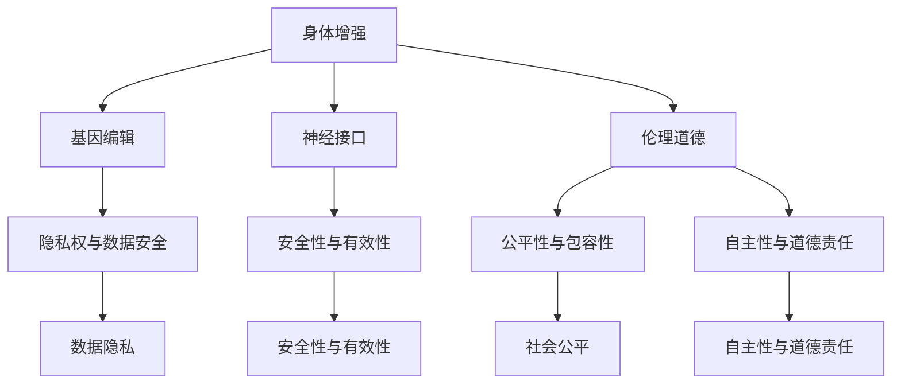

                 

# AI时代的人类增强：道德考虑和身体增强的未来

在AI时代，技术的飞速发展为人类带来了前所未有的变革与机遇。从虚拟现实到增强现实，从生物工程到脑机接口，各种新技术正深刻改变着人类的生存状态。然而，随着身体增强技术的兴起，我们不禁要问：在追求技术进步的同时，是否应妥善考虑其带来的伦理道德问题？本文将从核心概念、算法原理、具体案例与未来展望等方面，全面探讨AI时代人类增强的道德考量与身体增强的未来。

## 1. 背景介绍

### 1.1 问题由来

随着科技的不断进步，人类在健康、体能、认知等方面都获得了前所未有的提升。但与此同时，这些技术的发展也带来了诸多伦理问题，如数据隐私、安全性、社会公平性等。其中，身体增强技术的兴起尤其引发了广泛的社会讨论。

身体增强技术主要包括基因编辑、机械植入、神经接口等，旨在通过技术手段改善人类体质、增强认知能力、提升生命质量。这些技术在医疗、体育、军事等领域显示出巨大潜力，但也伴随着不可忽视的风险。如何平衡技术进步与社会责任，确保这些技术的公平性与安全性，成为摆在人类面前的重大课题。

### 1.2 问题核心关键点

身体增强技术的伦理问题主要集中在以下几个方面：

- **隐私权与数据安全**：如何保护被增强者的个人信息，防止数据滥用和隐私泄露？
- **安全性与有效性**：增强技术能否确保其安全性，避免对被增强者造成伤害？
- **公平性与包容性**：增强技术是否能够为所有人平等获取，避免技术鸿沟和社会不公？
- **自主性与道德责任**：被增强者应如何承担技术使用后的道德责任？

这些问题的妥善解决，是身体增强技术能否健康发展的关键。

## 2. 核心概念与联系

### 2.1 核心概念概述

要深入探讨AI时代人类增强的伦理问题，首先需要了解几个核心概念：

- **身体增强**：通过科技手段改善人体体质、认知能力或生命质量。
- **基因编辑**：利用CRISPR等技术修改生物体的遗传信息。
- **神经接口**：通过脑机接口等技术实现人脑与机器的信息交换。
- **伦理道德**：涉及技术的社会影响和道德规范，包括隐私、安全性、公平性等。
- **数据隐私**：涉及个人信息的保护，防止信息泄露和滥用。
- **社会公平**：涉及技术资源分配的合理性，避免社会不公和技术鸿沟。

这些概念之间的联系可以用以下的Mermaid流程图表示：



这个流程图展示了身体增强技术与其伦理道德问题之间的内在联系。从基因编辑到神经接口，每项技术的发展都需要在伦理道德的框架下慎重考虑。

## 3. 核心算法原理 & 具体操作步骤

### 3.1 算法原理概述

身体增强技术的伦理考量，涉及到多个方面的算法与技术原理。其中，隐私保护和数据安全是最核心的问题。如何保护被增强者的隐私，防止数据泄露和滥用，是所有身体增强技术面临的首要伦理挑战。

针对这个问题，现有的主要解决方案包括：

- **数据加密**：对被增强者的个人数据进行加密，防止未授权访问。
- **去标识化**：将数据中的个人标识信息去除，保护隐私。
- **访问控制**：建立严格的数据访问权限管理，确保数据仅由授权人员访问。
- **隐私设计**：在技术设计中融入隐私保护机制，从源头减少隐私泄露风险。

### 3.2 算法步骤详解

具体来说，隐私保护和数据安全的算法步骤如下：

1. **数据收集与处理**：收集被增强者的数据，如基因信息、生理参数等，并进行去标识化处理。
2. **加密与解密**：采用先进的加密算法对数据进行加密，确保只有授权人员才能解密并访问数据。
3. **访问控制**：建立严格的数据访问权限管理系统，控制谁可以访问数据，以及访问的具体权限。
4. **隐私设计**：在设计技术时，融入隐私保护机制，如匿名化、分布式存储等，确保数据在处理和传输过程中不会泄露。

### 3.3 算法优缺点

数据隐私保护的算法优点包括：

- **有效保护**：通过加密、去标识化等手段，可以显著减少数据泄露和滥用的风险。
- **灵活性**：不同的加密算法和访问控制策略可以根据实际需求进行调整和优化。

其主要缺点是：

- **资源消耗大**：加密和解密操作增加了计算和存储负担，可能影响系统性能。
- **复杂性高**：设计和管理复杂的权限控制机制，对技术和人力资源要求较高。

### 3.4 算法应用领域

隐私保护和数据安全的算法在以下领域具有广泛应用：

- **医疗健康**：保护患者隐私，防止医疗数据泄露。
- **体育运动**：保护运动员个人信息，避免数据滥用。
- **军事应用**：保护情报数据，防止敌对力量窃取。
- **科学研究**：保护研究数据，确保数据共享的安全性。

## 4. 数学模型和公式 & 详细讲解 & 举例说明

### 4.1 数学模型构建

在隐私保护和数据安全的算法中，信息论和密码学是重要的数学基础。以下介绍几个核心模型：

- **Shannon保密性**：用于衡量加密通信的保密性。
- **Diffie-Hellman密钥交换**：一种安全交换密钥的协议。
- **AES加密算法**：一种广泛使用的对称加密算法。

### 4.2 公式推导过程

以Shannon保密性公式为例，推导过程如下：

$$
I(X;Y|K) = H(X) - H(X|Y)
$$

其中，$I(X;Y|K)$ 表示在密钥$K$的保护下，源信息$X$对截获信息$Y$的信息量。$H(X)$和$H(X|Y)$分别为源信息和截获信息的信息熵。

### 4.3 案例分析与讲解

以下以基因编辑为例，分析如何通过加密和去标识化技术保护数据隐私。

- **基因数据加密**：采用AES加密算法，对基因数据进行加密处理。
- **去标识化处理**：将基因数据中的个人标识信息（如姓名、身份证号）去除，确保数据无法追溯到具体个体。
- **访问控制**：建立严格的权限管理系统，控制谁可以访问基因数据及其具体权限。

通过这些技术手段，可以有效保护基因编辑数据的安全性，防止数据滥用和隐私泄露。

## 5. 项目实践：代码实例和详细解释说明

### 5.1 开发环境搭建

要进行身体增强技术的隐私保护和数据安全实践，需要以下开发环境：

1. **Python**：作为主要的开发语言，Python的生态系统和丰富的库资源能够满足大部分需求。
2. **加密库**：如PyCrypto、cryptography等，用于实现数据加密和解密。
3. **访问控制库**：如Flask-Principal，用于实现用户权限管理。
4. **数据处理库**：如Pandas、NumPy，用于数据清洗和预处理。
5. **测试框架**：如unittest，用于测试加密和访问控制的正确性。

### 5.2 源代码详细实现

以下是一个简化的基因编辑数据加密与访问控制的Python代码实现：

```python
from cryptography.fernet import Fernet
from flask_principal import Principal, Permission

# 生成加密密钥
key = Fernet.generate_key()
cipher_suite = Fernet(key)

# 对基因数据进行加密
def encrypt_genes(genes):
    encoded_genes = genes.encode()
    encrypted_genes = cipher_suite.encrypt(encoded_genes)
    return encrypted_genes

# 对基因数据进行解密
def decrypt_genes(encrypted_genes):
    decrypted_genes = cipher_suite.decrypt(encrypted_genes)
    return decrypted_genes.decode()

# 定义权限管理
def check_permission(username, action):
    principal = Principal()
    permission = Permission(username)
    if permission.check():
        return True
    return False

# 对基因数据进行访问控制
def access_genes(username, genes):
    if check_permission(username, "read"):
        encrypted_genes = encrypt_genes(genes)
        return encrypted_genes
    else:
        return None
```

### 5.3 代码解读与分析

上述代码实现中，我们首先使用Fernet加密算法生成了一个随机密钥，并使用该密钥对基因数据进行了加密处理。加密后的基因数据无法直接解读，需要授权用户才能解密。同时，我们还定义了一个权限管理系统，只有具有"read"权限的用户才能访问和解密基因数据。

## 6. 实际应用场景

### 6.1 医疗健康

在医疗健康领域，隐私保护和数据安全至关重要。以下是几个具体的应用场景：

- **个性化医疗**：基因编辑和数据驱动的医疗方案设计，需要严格保护患者的基因数据。
- **公共卫生研究**：收集和分析流行病数据，防止数据泄露和滥用。
- **远程医疗**：通过加密技术保障患者和医生之间的数据安全，确保医疗服务的隐私性。

### 6.2 体育运动

在体育运动领域，数据隐私和安全也显得尤为重要：

- **运动员体能监控**：通过神经接口和传感器收集运动员的生理数据，防止数据泄露。
- **运动数据分析**：利用基因数据优化训练计划，确保数据的安全和隐私。
- **比赛监控**：通过神经接口获取运动员的实时数据，防止数据滥用。

### 6.3 军事应用

在军事应用中，数据隐私和安全同样不可忽视：

- **情报收集**：通过神经接口获取情报数据，防止数据泄露。
- **战术分析**：利用基因数据和生理参数，优化战术部署和训练。
- **人员监控**：通过传感器收集士兵的生理数据，确保数据的安全和隐私。

### 6.4 未来应用展望

随着技术的发展，未来身体增强技术将更加复杂和多样。隐私保护和数据安全的需求也将更加严峻。以下是一些未来应用展望：

- **分布式隐私保护**：在云计算和大数据环境下，如何实现分布式数据保护，防止跨站点数据泄露。
- **区块链技术**：利用区块链的不可篡改性和分布式特性，实现数据隐私和安全。
- **零知识证明**：在保护隐私的前提下，验证数据的安全性和真实性，确保数据交换的安全性。

## 7. 工具和资源推荐

### 7.1 学习资源推荐

为帮助开发者掌握身体增强技术的隐私保护和数据安全，以下是一些推荐的学习资源：

1. **《信息安全与隐私保护》**：介绍信息论和密码学的经典教材，涵盖了加密算法、访问控制等核心内容。
2. **《数据科学与隐私保护》**：涵盖数据隐私保护的全面教材，介绍隐私设计的原理和实践。
3. **Coursera《信息安全与网络安全》**：由斯坦福大学开设的在线课程，深入浅出地介绍信息安全和隐私保护。
4. **edX《数据科学与隐私保护》**：由麻省理工学院开设的在线课程，详细讲解数据隐私保护的最新技术和应用。
5. **Kaggle数据隐私挑战赛**：通过实际案例，提升对数据隐私保护的理解和应用能力。

### 7.2 开发工具推荐

以下是一些用于身体增强技术隐私保护和数据安全开发的常用工具：

1. **Python**：作为主要的开发语言，Python的生态系统和丰富的库资源能够满足大部分需求。
2. **cryptography库**：用于实现加密和解密，支持多种加密算法和协议。
3. **Flask-Principal库**：用于实现用户权限管理，支持基于角色的访问控制。
4. **TensorFlow库**：用于深度学习和神经网络，支持分布式训练和隐私保护。
5. **Keras库**：用于深度学习模型设计和训练，支持多种神经网络架构和优化算法。

### 7.3 相关论文推荐

以下是几篇关于身体增强技术隐私保护和数据安全的经典论文，推荐阅读：

1. **《A Survey of Privacy-Preserving Data Mining Techniques》**：综述隐私保护和数据安全技术的经典论文。
2. **《Secure Multi-Party Computation for Multi-Party Access Control》**：介绍安全多方计算和访问控制的最新研究进展。
3. **《Deep Learning Models for Privacy-Preserving Outcome Prediction》**：探讨利用深度学习模型进行隐私保护的研究论文。
4. **《Homomorphic Encryption: Concepts and Status》**：介绍同态加密技术的原理和应用现状。
5. **《Zero-Knowledge Proofs for Privacy-Preserving Outcome Prediction》**：介绍零知识证明技术在隐私保护中的应用。

## 8. 总结：未来发展趋势与挑战

### 8.1 研究成果总结

本文从隐私保护和数据安全的角度，探讨了身体增强技术的伦理考量。通过对密码学、信息论等技术手段的应用，提出了具体的解决方案和实现思路。

### 8.2 未来发展趋势

未来，身体增强技术的隐私保护和数据安全将面临以下发展趋势：

1. **隐私保护技术的多样化**：随着技术的发展，隐私保护和数据安全的手段将更加多样化，如区块链、同态加密等新技术将得到广泛应用。
2. **数据共享与隐私保护的双赢**：在数据共享过程中，如何实现隐私保护和数据利用的双赢，是未来的重要研究方向。
3. **隐私保护的智能化**：利用AI技术对数据进行智能分析，提高隐私保护的效率和精度。

### 8.3 面临的挑战

在隐私保护和数据安全的发展过程中，还面临着诸多挑战：

1. **资源消耗大**：加密和解密操作增加了计算和存储负担，可能影响系统性能。
2. **复杂性高**：设计和管理复杂的权限控制机制，对技术和人力资源要求较高。
3. **跨平台兼容性**：不同平台和环境下的隐私保护技术需要兼容，增加了实现难度。

### 8.4 研究展望

未来，隐私保护和数据安全的研究方向包括：

1. **分布式隐私保护**：在云计算和大数据环境下，如何实现分布式数据保护，防止跨站点数据泄露。
2. **区块链技术**：利用区块链的不可篡改性和分布式特性，实现数据隐私和安全。
3. **零知识证明**：在保护隐私的前提下，验证数据的安全性和真实性，确保数据交换的安全性。

## 9. 附录：常见问题与解答

**Q1：如何确保身体增强技术的隐私保护和数据安全？**

A: 隐私保护和数据安全的实现需要多种技术手段的综合应用，包括数据加密、去标识化、访问控制等。通过这些技术手段，可以有效降低数据泄露和滥用的风险，确保被增强者的隐私和数据安全。

**Q2：在身体增强技术中，如何平衡隐私保护和数据利用？**

A: 隐私保护和数据利用需要找到平衡点。可以通过差分隐私、联邦学习等技术，在不完全泄露数据的前提下，利用数据进行科学研究和实际应用。同时，也需要制定相应的政策和规范，确保数据利用的合理性和合法性。

**Q3：在身体增强技术中，如何应对资源消耗和复杂性高的问题？**

A: 可以通过分布式计算、异构存储等技术，减轻资源消耗和复杂性问题。同时，也可以采用模块化和组件化的设计思路，简化系统的复杂性，提高可维护性。

**Q4：在身体增强技术中，如何确保跨平台兼容性？**

A: 通过采用标准的接口和协议，如RESTful API、OAuth等，可以确保不同平台之间的兼容性。同时，也可以采用容器化和微服务架构，提高系统的可移植性和灵活性。

**Q5：在身体增强技术中，如何应对隐私保护和数据安全的新挑战？**

A: 未来，隐私保护和数据安全将面临更多的挑战，如人工智能、物联网等新技术的引入。需要不断跟踪最新的技术发展，及时更新隐私保护策略和数据安全措施，确保技术的持续进步和应用安全。

通过以上系统的介绍，我们不难看出，身体增强技术的隐私保护和数据安全是一项复杂而庞大的任务，需要跨学科和多领域的协同合作。只有在技术、伦理、政策等多方面全面考虑，才能确保身体增强技术健康、可持续的发展，为人类带来更多福祉。

---

作者：禅与计算机程序设计艺术 / Zen and the Art of Computer Programming

