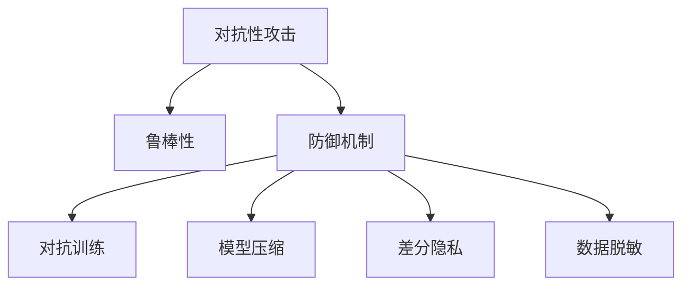

                 

# AI模型的安全性：防御对抗性攻击

> 关键词：对抗性攻击, 鲁棒性, 防御机制, 梯度攻击, 对抗训练, 模型压缩, 差分隐私, 数据脱敏

## 1. 背景介绍

在人工智能（AI）快速发展的背景下，AI模型的应用范围不断拓展，从图像识别、语音识别到自然语言处理，再到自动驾驶、医疗诊断等领域，AI模型已经成为许多核心技术的重要支撑。然而，随着模型复杂度的提升，AI模型也面临诸多安全威胁，其中最令人担忧的是对抗性攻击（Adversarial Attacks）问题。对抗性攻击指的是攻击者通过在输入数据中注入特定的扰动，使得AI模型输出错误或不可靠的预测结果。这对社会稳定、国家安全乃至个人隐私都构成了巨大威胁。因此，如何在模型设计和训练过程中有效防范对抗性攻击，提升模型的鲁棒性（Robustness），成为AI模型安全性的重要研究课题。

## 2. 核心概念与联系

### 2.1 核心概念概述

在AI模型安全性的研究中，涉及以下几个关键概念：

- **对抗性攻击**：通过在输入数据中注入特定扰动，使得AI模型产生错误输出。常见对抗性攻击方式包括L-BFGS攻击、深度梯度攻击（FGSM）等。
- **鲁棒性**：指AI模型在面对对抗性攻击时仍能保持稳定和正确性。鲁棒性是评价模型安全性的一个重要指标。
- **防御机制**：指在模型设计、训练过程中采取的一系列措施，以提升模型的鲁棒性，防止对抗性攻击。防御机制包括对抗训练、模型压缩、差分隐私等。
- **梯度攻击**：通过分析模型的梯度信息，推导对抗性攻击的扰动，使得模型输出错误结果。梯度攻击是对抗性攻击的基础和核心。
- **对抗训练**：一种通过引入对抗性样本训练模型的方法，使得模型能够对扰动具有一定的免疫力，提升鲁棒性。
- **模型压缩**：通过对模型参数和结构进行压缩，减小模型复杂度，提高计算效率和鲁棒性。
- **差分隐私**：一种保护用户隐私的隐私保护技术，通过在模型输出中添加噪声，使得攻击者无法恢复原始数据。
- **数据脱敏**：对输入数据进行预处理，减少模型对数据中敏感信息的学习，降低被攻击的风险。

这些概念之间的逻辑关系可以通过以下Mermaid流程图来展示：



这个流程图展示了大模型安全性研究的几个核心概念及其之间的关系：

1. 对抗性攻击是提升模型鲁棒性的重要挑战。
2. 防御机制是应对对抗性攻击的有效手段，包括对抗训练、模型压缩、差分隐私等。
3. 对抗训练和模型压缩通过优化模型参数，提升模型的鲁棒性。
4. 差分隐私和数据脱敏通过限制数据和模型的信息泄露，降低被攻击的风险。

## 3. 核心算法原理 & 具体操作步骤

### 3.1 算法原理概述

防御对抗性攻击的核心在于提升模型的鲁棒性。鲁棒性强的模型能够更好地抵抗对抗性攻击，确保在面对扰动数据时仍能产生正确的输出。本节将从对抗性攻击和鲁棒性的定义出发，阐述防御机制的基本原理。

对抗性攻击的本质是通过优化模型的损失函数，使得模型在面对扰动数据时产生错误输出。具体来说，对于给定输入 $x$，攻击者通过在 $x$ 上加入一个微小扰动 $\delta$，使得模型的预测结果与正确结果相反。例如，对于分类任务，攻击者可能会将原本属于猫的图片稍微修改，使得模型错误地将其分类为狗。

鲁棒性强的模型能够识别出扰动数据的非正常性，并对其进行过滤或修正，最终仍能产生正确的输出。鲁棒性可以通过以下公式进行定义：

$$
\text{Robustness} = \frac{1}{|\mathcal{X}|} \sum_{x \in \mathcal{X}} \mathbb{P}[\text{predict}(\text{defended}(x + \delta)) = \text{correct}] + \mathbb{P}[\text{predict}(\text{defended}(x + \delta)) \neq \text{correct}]
$$

其中，$\mathcal{X}$ 为输入数据空间，$\text{predict}(\cdot)$ 为模型预测函数，$\text{defended}(\cdot)$ 为防御机制后的模型，$\mathbb{P}[\cdot]$ 为概率。鲁棒性越高的模型，越能抵抗对抗性攻击。

### 3.2 算法步骤详解

防御对抗性攻击的具体操作步骤如下：

**Step 1: 数据预处理**

1. 收集并准备数据集。
2. 对数据进行预处理，包括数据增强、数据归一化等。

**Step 2: 构建对抗样本**

1. 使用对抗性攻击算法（如L-BFGS攻击、深度梯度攻击等）生成对抗性样本。
2. 将对抗性样本添加到训练集中，用于训练模型。

**Step 3: 对抗训练**

1. 使用对抗样本训练模型。
2. 通过调整模型参数，优化损失函数，提升模型的鲁棒性。

**Step 4: 模型压缩**

1. 对模型进行量化、剪枝、蒸馏等压缩操作，减小模型复杂度。
2. 通过参数共享、低秩分解等技术，提升模型的计算效率和鲁棒性。

**Step 5: 差分隐私**

1. 在模型输出中添加噪声，使得攻击者无法恢复原始数据。
2. 通过调整噪声的分布和大小，平衡隐私保护和模型性能。

**Step 6: 数据脱敏**

1. 对输入数据进行预处理，如去除敏感信息、添加噪声等。
2. 通过限制模型对数据的依赖，降低被攻击的风险。

### 3.3 算法优缺点

防御对抗性攻击的方法有以下优点：

1. 提高模型鲁棒性：通过对抗训练和模型压缩等方法，能够有效提升模型的鲁棒性，使其能够抵抗对抗性攻击。
2. 增强模型安全性：差分隐私和数据脱敏等方法能够有效保护用户隐私，降低模型被攻击的风险。
3. 适应性强：不同领域的模型和应用场景中，可以根据具体情况选择合适的防御机制。

然而，这些方法也存在一些缺点：

1. 计算资源消耗高：对抗训练和模型压缩等方法需要大量的计算资源，对硬件设备要求较高。
2. 性能损失：为了提升鲁棒性，可能需要对模型进行压缩和调整，这可能会导致模型性能的下降。
3. 防御效果有限：对抗训练等方法虽然能够提升鲁棒性，但仍然无法完全免疫对抗性攻击。

### 3.4 算法应用领域

防御对抗性攻击的方法在多个领域都有广泛的应用，以下是几个典型的应用场景：

1. **自动驾驶**：自动驾驶系统需要保证在面对各种复杂环境和对抗性攻击时仍能做出正确的决策。对抗训练和模型压缩等方法可以提升自动驾驶系统的鲁棒性。
2. **金融风控**：金融模型需要对欺诈行为进行识别和防范。差分隐私和数据脱敏等方法能够有效保护用户隐私，降低欺诈风险。
3. **医疗诊断**：医疗模型需要对异常数据进行识别和诊断。鲁棒性和差分隐私等方法能够提升医疗模型的准确性和安全性。
4. **安全监控**：安全监控系统需要对恶意攻击进行识别和防范。对抗训练和模型压缩等方法可以提升系统的鲁棒性。

## 4. 数学模型和公式 & 详细讲解 & 举例说明

### 4.1 数学模型构建

为了更好地理解防御对抗性攻击的方法，我们将使用数学语言对关键问题进行严格的刻画。

设模型 $M$ 的输入为 $x$，输出为 $y$。攻击者通过注入扰动 $\delta$，使得模型输出 $y'$，与正确输出 $y$ 不同。例如，对于分类任务，$\delta$ 可能导致模型将正确结果 $y$ 分类为错误结果 $y'$。

### 4.2 公式推导过程

假设攻击者采用深度梯度攻击（FGSM）生成对抗性样本。深度梯度攻击的公式为：

$$
\delta = \epsilon \cdot \text{sign}(\nabla_{x}L(M(x), y))
$$

其中，$\epsilon$ 为扰动强度，$\nabla_{x}L$ 为损失函数对输入 $x$ 的梯度。攻击者通过反向传播计算梯度，并将梯度正向传播，生成对抗性样本 $\delta$。

对抗训练的目标是通过调整模型参数，使得模型对扰动样本的输出与正常样本的输出一致。具体来说，设模型参数为 $\theta$，则对抗训练的优化目标为：

$$
\theta^* = \mathop{\arg\min}_{\theta} \mathcal{L}(\theta)
$$

其中，$\mathcal{L}$ 为对抗性损失函数，定义为：

$$
\mathcal{L}(\theta) = \frac{1}{N}\sum_{i=1}^N \mathbb{P}[\text{predict}(\text{defended}(x_i + \delta_i)) \neq y_i]
$$

其中，$N$ 为样本数量，$\delta_i$ 为第 $i$ 个样本的扰动，$\text{defended}(\cdot)$ 为防御机制后的模型。

### 4.3 案例分析与讲解

以图像分类任务为例，分析对抗训练的具体过程。

假设有一张图像 $x$，标签为 $y$。攻击者使用深度梯度攻击生成对抗性样本 $\delta$，使得模型对 $x+\delta$ 的预测结果与正确结果不同。在对抗训练中，将 $x+\delta$ 作为对抗性样本，加入训练集中。通过调整模型参数，最小化对抗性损失函数，使得模型对 $x+\delta$ 的输出与正确结果一致。

具体来说，设模型的输出为 $M(x)$，则对抗训练的目标为：

$$
\theta^* = \mathop{\arg\min}_{\theta} \mathcal{L}(\theta) = \mathop{\arg\min}_{\theta} \frac{1}{N}\sum_{i=1}^N \mathbb{P}[\text{predict}(\text{defended}(x_i + \delta_i)) \neq y_i]
$$

其中，$\delta_i$ 为第 $i$ 个样本的对抗性扰动。

## 5. 项目实践：代码实例和详细解释说明

### 5.1 开发环境搭建

在进行防御对抗性攻击的实践前，我们需要准备好开发环境。以下是使用Python进行TensorFlow开发的环境配置流程：

1. 安装Anaconda：从官网下载并安装Anaconda，用于创建独立的Python环境。

2. 创建并激活虚拟环境：
```bash
conda create -n tf-env python=3.8 
conda activate tf-env
```

3. 安装TensorFlow：根据CUDA版本，从官网获取对应的安装命令。例如：
```bash
conda install tensorflow-gpu=2.8.0 -c pytorch -c conda-forge
```

4. 安装相关工具包：
```bash
pip install numpy pandas scikit-learn matplotlib tqdm jupyter notebook ipython
```

完成上述步骤后，即可在`tf-env`环境中开始防御对抗性攻击的实践。

### 5.2 源代码详细实现

下面我们以图像分类任务为例，给出使用TensorFlow进行对抗训练的代码实现。

首先，定义图像分类任务的数据处理函数：

```python
import tensorflow as tf
from tensorflow.keras import layers

def load_data():
    # 加载数据集，并进行预处理
    # ...

def preprocess_data(data):
    # 对数据进行预处理，包括数据增强、数据归一化等
    # ...

def train_model(model, train_dataset, batch_size, optimizer):
    # 定义训练循环，包括前向传播、反向传播和参数更新
    # ...

def evaluate_model(model, test_dataset, batch_size):
    # 对模型进行评估，计算准确率和鲁棒性
    # ...
```

然后，定义模型和优化器：

```python
from tensorflow.keras import layers
from tensorflow.keras.optimizers import Adam

model = tf.keras.Sequential([
    layers.Conv2D(32, (3, 3), activation='relu', input_shape=(28, 28, 1)),
    layers.MaxPooling2D((2, 2)),
    layers.Flatten(),
    layers.Dense(10, activation='softmax')
])

optimizer = Adam(lr=0.001)
```

接着，定义对抗训练函数：

```python
def adversarial_train(model, train_dataset, batch_size, optimizer):
    for epoch in range(num_epochs):
        for batch in train_dataset:
            x, y = batch
            x_adv = x + delta * tf.random.normal(tf.shape(x))
            y_adv = y

            with tf.GradientTape() as tape:
                x_adv = x_adv.numpy() # 需要计算梯度
                y_adv = y_adv.numpy() # 需要计算梯度

                # 计算对抗样本的损失
                loss_adv = tf.keras.losses.categorical_crossentropy(y_adv, model(x_adv))
                loss = tf.reduce_mean(loss_adv)

            grads = tape.gradient(loss, model.trainable_variables)
            optimizer.apply_gradients(zip(grads, model.trainable_variables))
```

最后，启动对抗训练流程：

```python
def main():
    # 加载数据集，并进行预处理
    train_data, test_data = load_data()

    # 对数据进行预处理
    train_data = preprocess_data(train_data)
    test_data = preprocess_data(test_data)

    # 定义模型和优化器
    model = tf.keras.Sequential([
        layers.Conv2D(32, (3, 3), activation='relu', input_shape=(28, 28, 1)),
        layers.MaxPooling2D((2, 2)),
        layers.Flatten(),
        layers.Dense(10, activation='softmax')
    ])
    optimizer = Adam(lr=0.001)

    # 对抗训练
    adversarial_train(model, train_data, batch_size, optimizer)

    # 对模型进行评估
    evaluate_model(model, test_data, batch_size)

if __name__ == '__main__':
    main()
```

以上就是使用TensorFlow对图像分类模型进行对抗训练的完整代码实现。可以看到，通过定义对抗训练函数，能够在训练过程中引入对抗性样本，优化模型参数，提升模型的鲁棒性。

### 5.3 代码解读与分析

让我们再详细解读一下关键代码的实现细节：

**load_data函数**：
- 定义数据集加载和预处理函数，需要根据具体任务进行定制。

**preprocess_data函数**：
- 对输入数据进行预处理，包括数据增强、数据归一化等。

**train_model函数**：
- 定义训练循环，包括前向传播、反向传播和参数更新。

**adversarial_train函数**：
- 定义对抗训练函数，对模型进行迭代优化。

**evaluate_model函数**：
- 对模型进行评估，计算准确率和鲁棒性。

**main函数**：
- 启动训练流程，并在测试集上评估模型性能。

## 6. 实际应用场景

### 6.1 自动驾驶

自动驾驶系统需要面对各种复杂环境和对抗性攻击，例如摄像头被遮挡、物体被篡改等。通过对抗训练和模型压缩等方法，能够有效提升自动驾驶系统的鲁棒性，使其能够应对各种复杂环境和对抗性攻击。

### 6.2 金融风控

金融模型需要对欺诈行为进行识别和防范。差分隐私和数据脱敏等方法能够有效保护用户隐私，降低欺诈风险。

### 6.3 医疗诊断

医疗模型需要对异常数据进行识别和诊断。鲁棒性和差分隐私等方法能够提升医疗模型的准确性和安全性。

### 6.4 安全监控

安全监控系统需要对恶意攻击进行识别和防范。对抗训练和模型压缩等方法可以提升系统的鲁棒性，确保系统能够在面对各种恶意攻击时仍能正常运行。

## 7. 工具和资源推荐

### 7.1 学习资源推荐

为了帮助开发者系统掌握防御对抗性攻击的理论基础和实践技巧，这里推荐一些优质的学习资源：

1. 《深度学习入门：基于Python的理论与实现》系列博文：由深度学习专家撰写，深入浅出地介绍了深度学习的基本概念和应用。

2. 《TensorFlow实战》系列书籍：谷歌开发的深度学习框架TensorFlow的官方教程，涵盖从入门到精通的全部内容，是学习TensorFlow的重要资源。

3. 《机器学习实战》系列书籍：涵盖机器学习、深度学习等多个领域的经典教材，适合初学者和进阶者学习。

4. 《计算机视觉：现代方法》：计算机视觉领域的经典教材，涵盖图像分类、物体检测等多个方向的内容。

5. 《自然语言处理综论》：自然语言处理领域的经典教材，涵盖文本分类、序列标注等多个方向的内容。

6. 《安全与隐私保护》系列论文：研究如何保护用户隐私、防止对抗性攻击等问题的最新论文，提供前沿技术和理论支持。

通过对这些资源的学习实践，相信你一定能够快速掌握防御对抗性攻击的精髓，并用于解决实际的AI安全问题。

### 7.2 开发工具推荐

高效的开发离不开优秀的工具支持。以下是几款用于防御对抗性攻击开发的常用工具：

1. TensorFlow：由谷歌主导开发的深度学习框架，生产部署方便，适合大规模工程应用。支持对抗性样本生成和对抗训练。

2. Keras：一个高级神经网络API，基于TensorFlow，使用简单，适合初学者和快速迭代。

3. PyTorch：基于Python的开源深度学习框架，灵活动态的计算图，适合快速迭代研究。

4. Weights & Biases：模型训练的实验跟踪工具，可以记录和可视化模型训练过程中的各项指标，方便对比和调优。

5. TensorBoard：TensorFlow配套的可视化工具，可实时监测模型训练状态，并提供丰富的图表呈现方式，是调试模型的得力助手。

6. PySyft：联邦学习框架，支持差分隐私和联邦学习等隐私保护技术，适合保护用户隐私的场景。

合理利用这些工具，可以显著提升防御对抗性攻击的开发效率，加快创新迭代的步伐。

### 7.3 相关论文推荐

防御对抗性攻击的研究源于学界的持续研究。以下是几篇奠基性的相关论文，推荐阅读：

1. "Adversarial Examples in Deep Learning"（深度学习中的对抗性示例）：引入了对抗性样本的概念，提出了对抗性攻击的基本原理和防御机制。

2. "Towards Evaluating the Robustness of Neural Networks"（评估神经网络的鲁棒性）：提出了一系列评估鲁棒性的指标和方法，为后续研究提供了重要参考。

3. "Adversarial Training Methods for Semi-Supervised Text Classification"（半监督文本分类的对抗训练方法）：探讨了对抗训练在文本分类任务中的应用，提出了多种对抗训练方法。

4. "Differentiable Privacy"（可微差分隐私）：提出了一种基于差分隐私的隐私保护方法，能够在保护隐私的同时，保证模型性能。

5. "Advances in Adversarial Attacks and Defenses"（对抗攻击与防御的进展）：综述了近年来对抗性攻击和防御的研究进展，为未来研究提供了重要参考。

这些论文代表了大模型防御对抗性攻击的研究脉络。通过学习这些前沿成果，可以帮助研究者把握学科前进方向，激发更多的创新灵感。

## 8. 总结：未来发展趋势与挑战

### 8.1 研究成果总结

本文对防御对抗性攻击的方法进行了全面系统的介绍。首先阐述了对抗性攻击和鲁棒性的定义，明确了防御对抗性攻击的重要性。其次，从对抗性攻击和鲁棒性的定义出发，阐述了防御机制的基本原理。再次，通过具体的步骤和代码实例，详细讲解了防御对抗性攻击的方法。最后，讨论了防御对抗性攻击的方法在多个领域的应用前景，并展望了未来的发展方向。

通过本文的系统梳理，可以看到，防御对抗性攻击方法在AI安全性研究中占据重要地位。这些方法的不断优化和应用，将使得AI模型更加安全可靠，减少对抗性攻击的风险。

### 8.2 未来发展趋势

展望未来，防御对抗性攻击的方法将呈现以下几个发展趋势：

1. 鲁棒性提升：随着对抗训练和模型压缩等方法的不断优化，AI模型的鲁棒性将得到进一步提升，能够更好地应对各种对抗性攻击。

2. 隐私保护加强：差分隐私和联邦学习等隐私保护技术将得到更广泛的应用，确保用户数据的安全性。

3. 自动化防御机制：未来的防御机制将更加自动化和智能化，通过机器学习算法自动检测和防御对抗性攻击。

4. 跨领域应用拓展：防御对抗性攻击的方法将不再局限于图像、文本等特定领域，而是能够跨领域应用，提升AI模型在不同场景下的鲁棒性。

5. 多模态防御机制：未来的防御机制将更加注重多模态数据的整合，通过整合视觉、语音等多模态信息，提升AI模型的鲁棒性。

以上趋势凸显了防御对抗性攻击方法的广阔前景。这些方向的探索发展，必将进一步提升AI模型的安全性，为构建安全可靠的人工智能系统铺平道路。

### 8.3 面临的挑战

尽管防御对抗性攻击方法已经取得了瞩目成就，但在迈向更加智能化、普适化应用的过程中，它仍面临着诸多挑战：

1. 计算资源消耗高：对抗训练和模型压缩等方法需要大量的计算资源，对硬件设备要求较高。

2. 性能损失：为了提升鲁棒性，可能需要对模型进行压缩和调整，这可能会导致模型性能的下降。

3. 防御效果有限：对抗训练等方法虽然能够提升鲁棒性，但仍然无法完全免疫对抗性攻击。

4. 安全性和隐私保护：差分隐私和数据脱敏等方法能够在保护用户隐私的同时，保证模型性能，但仍然存在一定风险。

5. 防御机制的通用性：不同领域的模型和应用场景中，需要选择合适的防御机制，难以实现通用的防御策略。

这些挑战仍需进一步研究解决，才能实现防御对抗性攻击方法的广泛应用。

### 8.4 研究展望

面对防御对抗性攻击所面临的挑战，未来的研究需要在以下几个方面寻求新的突破：

1. 探索更高效的对抗训练方法：通过改进对抗性样本生成方法，优化损失函数，提高模型的鲁棒性。

2. 开发更智能的防御机制：利用机器学习算法自动检测和防御对抗性攻击，提升防御效果。

3. 引入更多先验知识：将符号化的先验知识，如知识图谱、逻辑规则等，与神经网络模型进行巧妙融合，引导防御过程学习更准确、合理的知识。

4. 结合因果分析和博弈论工具：将因果分析方法引入防御机制，识别出模型决策的关键特征，增强输出解释的因果性和逻辑性。

5. 纳入伦理道德约束：在模型训练目标中引入伦理导向的评估指标，过滤和惩罚有偏见、有害的输出倾向，确保输出的安全性。

这些研究方向的探索，必将引领防御对抗性攻击技术迈向更高的台阶，为构建安全可靠的人工智能系统铺平道路。面向未来，防御对抗性攻击技术还需要与其他人工智能技术进行更深入的融合，如知识表示、因果推理、强化学习等，多路径协同发力，共同推动人工智能技术的发展。

## 9. 附录：常见问题与解答

**Q1：对抗性攻击对AI模型的安全性有何影响？**

A: 对抗性攻击对AI模型的安全性构成了重大威胁。攻击者可以通过在输入数据中注入特定的扰动，使得模型输出错误或不可靠的预测结果，从而影响模型的决策和行为。

**Q2：如何有效防御对抗性攻击？**

A: 防御对抗性攻击的方法包括对抗训练、模型压缩、差分隐私等。通过对抗训练，可以在训练过程中引入对抗性样本，提升模型的鲁棒性。模型压缩和差分隐私等方法可以通过优化模型结构和保护用户隐私，提升模型的安全性。

**Q3：对抗训练有哪些具体实现方法？**

A: 对抗训练的具体实现方法包括深度梯度攻击、L-BFGS攻击等。通过反向传播计算梯度，生成对抗性样本，并将其加入训练集中，优化模型参数，提升模型的鲁棒性。

**Q4：对抗训练是否会影响模型的性能？**

A: 对抗训练可能会影响模型的性能，因为训练过程中引入了对抗性样本。然而，通过合理调整超参数和优化策略，可以在保证鲁棒性的同时，保持模型性能。

**Q5：防御对抗性攻击的方法是否适用于所有AI模型？**

A: 防御对抗性攻击的方法适用于大部分AI模型，特别是深度学习模型。然而，对于不同的模型和应用场景，可能需要选择不同的防御机制，并进行优化和调整。

**Q6：防御对抗性攻击的方法是否会导致计算资源的消耗？**

A: 是的，对抗训练和模型压缩等方法需要大量的计算资源，对硬件设备要求较高。合理使用这些方法，可以平衡鲁棒性和计算资源的消耗。

**Q7：差分隐私和数据脱敏方法能否保护用户隐私？**

A: 是的，差分隐私和数据脱敏方法能够有效保护用户隐私。通过在模型输出中添加噪声，攻击者无法恢复原始数据，保护用户隐私。

**Q8：防御对抗性攻击的方法是否具有通用性？**

A: 不同领域的模型和应用场景中，需要选择合适的防御机制，难以实现通用的防御策略。需要根据具体任务和数据特点进行优化和调整。

这些常见问题与解答能够帮助读者更好地理解防御对抗性攻击的方法，并在实际应用中灵活运用这些方法，确保AI模型的安全性。

---

作者：禅与计算机程序设计艺术 / Zen and the Art of Computer Programming

