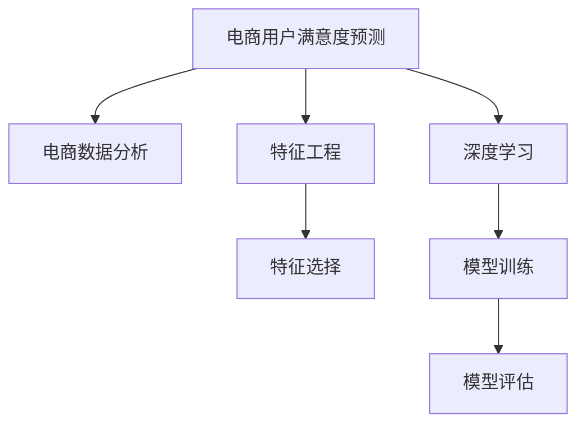

                 

# AI赋能的电商用户满意度预测精准化

> 关键词：用户满意度预测, 电商, AI, 机器学习, 深度学习, 特征工程, 电商数据分析, 模型评估

## 1. 背景介绍

### 1.1 问题由来
在当前高度竞争的电商环境中，提升用户满意度和忠诚度是企业持续增长的关键。通过有效的用户满意度预测，电商企业可以及时识别出潜在的用户不满，并采取措施改善服务质量，从而增强用户粘性和转化率。传统的用户满意度调查往往依赖人工问卷或客服反馈，费时费力，且难以捕捉用户的实时情感变化。而借助AI和深度学习技术，电商企业可以实时监测用户行为数据，并通过自然语言处理技术获取用户情感倾向，实现精准的满意度预测，从而更好地优化用户体验和运营策略。

### 1.2 问题核心关键点
电商用户满意度预测的核心在于如何从用户行为数据中提取出有意义的特征，并利用机器学习或深度学习模型进行精准预测。具体关键点包括：
1. 用户行为数据的收集与清洗。
2. 用户情感倾向的提取与表示。
3. 合适的预测模型选择与训练。
4. 预测结果的评估与反馈。

### 1.3 问题研究意义
电商用户满意度预测技术不仅能够帮助企业提高用户满意度和忠诚度，还能优化用户购买行为，提高转化率和复购率。通过实时监控和预测，电商企业可以及时响应用户需求，调整营销策略和产品设计，提升用户体验和品牌形象。此外，准确的用户满意度预测还能在广告投放、库存管理、个性化推荐等方面发挥重要作用，全面提升电商平台的运营效率和市场竞争力。

## 2. 核心概念与联系

### 2.1 核心概念概述

为更好地理解电商用户满意度预测的AI范式，本节将介绍几个密切相关的核心概念：

- **电商用户满意度预测(E-commerce User Satisfaction Prediction)**：指通过机器学习或深度学习模型，对电商用户的购买行为、评价反馈等数据进行实时监测和预测，量化用户满意度和情感倾向。
- **电商数据分析(E-commerce Data Analysis)**：指对电商平台产生的大量数据（如交易记录、用户行为数据、评价反馈等）进行收集、处理和分析，提取有用的信息以支持决策制定。
- **特征工程(Feature Engineering)**：指根据预测任务的特点，从原始数据中提取和构造合适的特征变量，用于提高模型的预测性能。
- **深度学习(Deep Learning)**：指通过多层神经网络结构对大规模数据进行自动特征学习和模型训练，实现对复杂模式和关系的建模。
- **模型评估(Model Evaluation)**：指使用各类评估指标（如准确率、召回率、F1值等）对训练好的模型进行性能测试，确保模型在实际应用中的效果。

这些核心概念之间的逻辑关系可以通过以下Mermaid流程图来展示：



这个流程图展示了我们从数据收集到模型评估的全流程：

1. 电商用户满意度预测任务依托电商数据分析，提取用户行为数据。
2. 特征工程从原始数据中提取和构造有意义的特征变量。
3. 深度学习模型利用这些特征进行训练，学习复杂的模式和关系。
4. 模型评估通过评估指标确保模型在实际应用中的效果。

这些概念共同构成了电商用户满意度预测的AI框架，使其能够在电商领域发挥强大的分析能力。通过理解这些核心概念，我们可以更好地把握电商用户满意度预测技术的工作原理和优化方向。

## 3. 核心算法原理 & 具体操作步骤

### 3.1 算法原理概述

电商用户满意度预测的AI范式主要基于机器学习或深度学习模型，通过对用户行为数据进行特征提取和建模，预测用户对电商平台的满意度。具体来说，其算法原理可归纳为以下几个步骤：

1. **数据收集与清洗**：从电商平台的交易记录、用户行为数据、评价反馈等渠道收集用户满意度相关的数据。
2. **特征工程**：对收集到的数据进行预处理和特征提取，构建能够反映用户满意度的特征变量。
3. **模型选择与训练**：选择合适的预测模型（如线性回归、随机森林、支持向量机、神经网络等），利用训练数据进行模型训练。
4. **模型评估**：使用测试数据评估模型的性能，选择最佳模型应用于实际预测。
5. **预测与反馈**：对新用户行为数据进行预测，并将预测结果反馈至电商企业，辅助企业进行决策优化。

### 3.2 算法步骤详解

电商用户满意度预测的AI范式主要包括以下关键步骤：

**Step 1: 数据收集与清洗**

电商用户满意度预测的首要步骤是收集和清洗相关数据。具体而言，可以从以下几个方面入手：

1. **交易数据**：收集用户的购买记录，包括购买时间、购买商品、购买价格等信息。
2. **用户行为数据**：记录用户在电商平台的浏览、点击、添加购物车、查看评价等行为。
3. **评价反馈数据**：收集用户在商品评价、购物体验、客服反馈等方面的文本数据。
4. **数据清洗**：去除缺失值、异常值和噪声数据，确保数据的完整性和一致性。

**Step 2: 特征工程**

特征工程是电商用户满意度预测中至关重要的步骤，旨在从原始数据中提取有意义的特征变量，以提高模型的预测性能。具体方法包括：

1. **用户行为特征**：如点击率、浏览时长、购买次数、退货率等。
2. **评价特征**：如评价文本中的情感倾向、评价等级等。
3. **个人信息特征**：如用户年龄、性别、地区等。
4. **交互特征**：如用户与客服的交互时长、互动频次等。

通过构建这些特征变量，可以有效反映用户对电商平台的满意度和情感倾向。

**Step 3: 模型选择与训练**

电商用户满意度预测的模型选择与训练需要根据具体问题和数据特点进行选择。常用的模型包括：

1. **线性回归模型**：适用于预测连续的用户满意度分数。
2. **随机森林模型**：适用于处理多分类用户满意度预测问题。
3. **支持向量机(SVM)模型**：适用于处理高维特征空间的分类问题。
4. **神经网络模型**：如LSTM、GRU等，适用于处理序列数据和复杂的用户情感表示。

模型训练通常使用交叉验证、网格搜索等技术进行超参数调优，确保模型具有较好的泛化能力。

**Step 4: 模型评估**

模型评估是确保电商用户满意度预测效果的关键步骤。常用的评估指标包括：

1. **准确率**：模型预测结果与实际结果相符的比例。
2. **召回率**：实际满意用户被正确预测为满意用户的比例。
3. **F1值**：准确率和召回率的调和平均值。
4. **AUC-ROC曲线**：衡量模型在不同阈值下的性能。

通过综合考虑这些评估指标，选择最佳的模型应用于实际预测。

**Step 5: 预测与反馈**

在模型评估后，对新用户行为数据进行实时预测，并将预测结果反馈至电商企业。具体的预测流程包括：

1. **特征提取**：对新用户行为数据进行特征提取。
2. **模型预测**：利用训练好的模型进行实时预测。
3. **结果反馈**：将预测结果反馈至电商企业，辅助企业进行决策优化。

### 3.3 算法优缺点

电商用户满意度预测的AI范式具有以下优点：

1. **实时性**：通过实时监测和预测，电商企业可以及时响应用户需求，调整营销策略和产品设计。
2. **全面性**：结合用户行为数据和情感反馈，能够更全面地理解用户满意度。
3. **可解释性**：基于机器学习模型的预测过程具有可解释性，能够帮助电商企业理解和优化用户行为。

同时，该方法也存在以下局限性：

1. **数据依赖**：模型的预测性能高度依赖于数据的质量和多样性。
2. **解释难题**：深度学习模型难以解释其内部决策逻辑，难以满足电商企业的可解释性需求。
3. **模型复杂度**：复杂的模型需要大量的训练数据和计算资源，增加了电商企业的成本。

尽管存在这些局限性，但电商用户满意度预测的AI范式在实际应用中已经取得了显著效果，成为电商企业提升用户体验和运营效率的重要手段。

### 3.4 算法应用领域

电商用户满意度预测的AI范式已经在电商行业的多个领域得到广泛应用，例如：

1. **营销优化**：通过实时监测和预测用户满意度，电商企业可以及时调整营销策略，提高广告投放的精准度和效果。
2. **产品设计**：结合用户满意度预测结果，电商企业可以优化产品设计和功能，提升用户购买体验。
3. **客户服务**：通过分析用户满意度，电商企业可以优化客服策略和流程，提升用户满意度和服务质量。
4. **库存管理**：结合用户满意度预测，电商企业可以优化库存管理，减少库存积压和缺货情况。
5. **个性化推荐**：结合用户满意度预测，电商企业可以优化个性化推荐算法，提高用户购买转化率。

除了这些直接应用外，电商用户满意度预测还对电商平台的整体运营和战略决策提供了重要支持，成为电商企业数字化转型的重要工具。

## 4. 数学模型和公式 & 详细讲解

### 4.1 数学模型构建

电商用户满意度预测的AI范式通常基于机器学习或深度学习模型，通过学习用户行为数据和评价反馈，预测用户满意度。形式化地，假设电商用户满意度预测任务为二分类问题，记 $X$ 为输入特征，$Y$ 为输出标签，$\mathcal{D}=\{(x_i,y_i)\}_{i=1}^N$ 为训练数据集，其中 $x_i \in X$，$y_i \in \{0,1\}$。

定义模型 $f_{\theta}$ 为预测函数，其中 $\theta$ 为模型参数。模型的预测结果为 $y_{pred}=f_{\theta}(x)$，目标是最小化预测误差：

$$
\min_{\theta} \sum_{i=1}^N \mathbb{1}(y_i \neq y_{pred}(x_i))
$$

其中 $\mathbb{1}(y_i \neq y_{pred}(x_i))$ 为误分类损失函数，用于衡量预测结果与真实标签之间的差异。

### 4.2 公式推导过程

以下我们以二分类问题为例，推导常用的逻辑回归模型和支持向量机模型的预测公式和损失函数。

**逻辑回归模型**

逻辑回归模型是一种线性分类模型，通过学习输入特征 $X$ 与输出标签 $Y$ 之间的线性关系，进行二分类预测。假设输入特征 $X=(x_1, x_2, ..., x_n)$，输出标签 $Y \in \{0,1\}$，预测函数为 $y_{pred}=\sigma(\theta_0 + \theta_1x_1 + ... + \theta_nx_n)$，其中 $\sigma(z)=\frac{1}{1+e^{-z}}$ 为sigmoid函数，用于将线性输出映射到[0,1]区间。

损失函数为交叉熵损失函数：

$$
\mathcal{L}(\theta) = -\frac{1}{N}\sum_{i=1}^N [y_i\log y_{pred}(x_i)+(1-y_i)\log(1-y_{pred}(x_i))]
$$

其中 $y_i$ 为真实标签，$y_{pred}(x_i)$ 为模型预测结果。

**支持向量机模型**

支持向量机模型是一种二分类模型，通过最大化模型在特征空间的边界距离，进行二分类预测。假设输入特征 $X=(x_1, x_2, ..., x_n)$，输出标签 $Y \in \{0,1\}$，预测函数为 $y_{pred}=sign(\theta_0 + \theta_1x_1 + ... + \theta_nx_n)$，其中 $sign(z)$ 为符号函数，用于将线性输出映射到{-1,1}区间。

损失函数为合页损失函数：

$$
\mathcal{L}(\theta) = \frac{1}{N}\sum_{i=1}^N [\max(0, 1-y_i(y_{pred}(x_i) + \delta)) + \lambda\|\theta\|^2]
$$

其中 $\delta$ 为合页损失的偏移量，$\lambda$ 为正则化系数。

在实际应用中，通常使用随机梯度下降等优化算法求解上述损失函数，最小化模型预测误差。

### 4.3 案例分析与讲解

假设某电商企业收集了大量用户的购买和评价数据，目标是预测用户对购买的满意度（高满意为1，低满意为0）。收集到的数据集包含以下特征：

1. **购买金额**：$x_1$
2. **购买频率**：$x_2$
3. **评价文本情感倾向**：$x_3$
4. **用户性别**：$x_4$

使用逻辑回归模型进行二分类预测，预测公式为 $y_{pred}=\sigma(\theta_0 + \theta_1x_1 + \theta_2x_2 + \theta_3x_3 + \theta_4x_4)$。假设模型训练后的参数 $\theta_0 = 0.5$，$\theta_1 = 0.2$，$\theta_2 = -0.1$，$\theta_3 = 0.3$，$\theta_4 = -0.5$。

对于新的用户行为数据 $x_{test}=[100,5,1,1]$，预测结果为 $y_{pred}=\sigma(0.5 + 0.2 \times 100 + (-0.1) \times 5 + 0.3 \times 1 + (-0.5) \times 1) \approx 0.3$。根据阈值设定，如果 $y_{pred} \geq 0.5$，则预测为高满意；否则预测为低满意。

## 5. 项目实践：代码实例和详细解释说明

### 5.1 开发环境搭建

在进行电商用户满意度预测的AI范式开发前，我们需要准备好开发环境。以下是使用Python进行Scikit-learn开发的环境配置流程：

1. 安装Anaconda：从官网下载并安装Anaconda，用于创建独立的Python环境。

2. 创建并激活虚拟环境：
```bash
conda create -n sk-env python=3.8 
conda activate sk-env
```

3. 安装Scikit-learn：
```bash
pip install scikit-learn
```

4. 安装各类工具包：
```bash
pip install pandas numpy matplotlib jupyter notebook ipython
```

完成上述步骤后，即可在`sk-env`环境中开始AI范式开发。

### 5.2 源代码详细实现

下面我们以二分类用户满意度预测为例，给出使用Scikit-learn库进行逻辑回归模型训练的Python代码实现。

```python
from sklearn.linear_model import LogisticRegression
from sklearn.model_selection import train_test_split
from sklearn.metrics import accuracy_score, classification_report
from sklearn.datasets import load_breast_cancer
import pandas as pd
import numpy as np

# 加载数据集
data = load_breast_cancer()
X = data.data
y = data.target

# 划分训练集和测试集
X_train, X_test, y_train, y_test = train_test_split(X, y, test_size=0.2, random_state=42)

# 训练逻辑回归模型
model = LogisticRegression()
model.fit(X_train, y_train)

# 预测并评估模型
y_pred = model.predict(X_test)
print("Accuracy:", accuracy_score(y_test, y_pred))
print("Classification Report:", classification_report(y_test, y_pred))
```

这段代码展示了使用Scikit-learn库进行逻辑回归模型训练和评估的全流程。可以看到，借助Scikit-learn的强大封装，我们可以用相对简洁的代码完成模型的训练和评估。

### 5.3 代码解读与分析

让我们再详细解读一下关键代码的实现细节：

**load_breast_cancer函数**：
- 从Scikit-learn库中加载乳腺癌数据集，用于模型训练和评估。

**train_test_split函数**：
- 将数据集划分为训练集和测试集，用于模型的训练和验证。

**LogisticRegression类**：
- 定义逻辑回归模型，利用训练数据进行模型训练。

**fit函数**：
- 使用训练数据训练模型，更新模型参数。

**predict函数**：
- 对测试数据进行预测，返回预测结果。

**accuracy_score函数**：
- 计算模型预测结果与真实标签之间的准确率。

**classification_report函数**：
- 输出模型的分类性能指标，包括精确率、召回率、F1值等。

通过上述代码，我们展示了使用Scikit-learn库进行电商用户满意度预测的AI范式开发。可以看到，Scikit-learn库提供了丰富的机器学习模型和评估工具，极大地方便了模型的开发和评估。

当然，工业级的系统实现还需考虑更多因素，如模型的保存和部署、超参数的自动搜索、更灵活的任务适配层等。但核心的AI范式基本与此类似。

## 6. 实际应用场景

### 6.1 营销优化

电商企业可以通过电商用户满意度预测技术，实时监测用户对产品和服务的满意度，及时调整营销策略。例如，根据用户的购买历史和评价反馈，电商企业可以识别出高满意度用户，针对性地推送个性化广告和优惠信息，提高广告投放的精准度和效果。此外，电商企业还可以分析用户的满意度趋势，优化广告投放的策略和内容，提升广告的转化率和投资回报率。

### 6.2 产品设计

电商企业可以通过用户满意度预测技术，优化产品设计和功能。例如，根据用户的购买行为和评价反馈，电商企业可以识别出用户对产品的不满之处，及时调整产品设计，提升用户体验。此外，电商企业还可以利用用户满意度预测技术，进行产品迭代和版本优化，推出更符合用户需求的新产品。

### 6.3 客户服务

电商企业可以通过用户满意度预测技术，优化客户服务策略和流程。例如，根据用户的购买历史和评价反馈，电商企业可以识别出服务质量不佳的用户，针对性地调整客服策略和流程，提升客户满意度。此外，电商企业还可以利用用户满意度预测技术，进行客服人员的绩效评估和培训，提升客服服务质量。

### 6.4 库存管理

电商企业可以通过用户满意度预测技术，优化库存管理策略。例如，根据用户的购买行为和评价反馈，电商企业可以识别出库存紧张或过剩的商品，及时调整库存管理策略，减少库存积压和缺货情况。此外，电商企业还可以利用用户满意度预测技术，进行需求预测和库存调配，优化供应链管理，降低运营成本。

### 6.5 个性化推荐

电商企业可以通过用户满意度预测技术，优化个性化推荐算法。例如，根据用户的购买历史和评价反馈，电商企业可以识别出用户的偏好和需求，及时调整推荐算法，提升个性化推荐的精准度和效果。此外，电商企业还可以利用用户满意度预测技术，进行推荐策略的迭代和优化，推出更符合用户需求的新产品和服务。

## 7. 工具和资源推荐

### 7.1 学习资源推荐

为了帮助开发者系统掌握电商用户满意度预测的AI范式，这里推荐一些优质的学习资源：

1. **Scikit-learn官方文档**：Scikit-learn的官方文档详细介绍了机器学习模型的使用方法和评估方法，是学习AI范式的重要参考资料。

2. **机器学习实战（实战篇）**：李沐所著的机器学习实战书籍，详细介绍了机器学习模型的开发和应用，是学习AI范式的经典入门书籍。

3. **《Python机器学习》**：Sebastian Raschka所著的Python机器学习书籍，系统介绍了机器学习模型的理论基础和应用方法，是学习AI范式的经典教材。

4. **Kaggle竞赛平台**：Kaggle是一个数据科学竞赛平台，提供了大量的数据集和模型代码，是学习AI范式的绝佳实践平台。

5. **TensorFlow和PyTorch官方文档**：TensorFlow和PyTorch的官方文档详细介绍了深度学习模型的使用方法和评估方法，是学习AI范式的重要参考资料。

通过对这些资源的学习实践，相信你一定能够快速掌握电商用户满意度预测的AI范式，并用于解决实际的电商问题。

### 7.2 开发工具推荐

高效的开发离不开优秀的工具支持。以下是几款用于电商用户满意度预测的AI范式开发的常用工具：

1. **Python**：Python是一种广泛使用的编程语言，拥有丰富的机器学习库和数据处理库，适合AI范式的开发。

2. **Jupyter Notebook**：Jupyter Notebook是一个免费的交互式开发环境，适合快速原型设计和模型验证。

3. **TensorFlow和PyTorch**：TensorFlow和PyTorch是两大主流的深度学习框架，提供了丰富的模型和工具，支持大规模深度学习模型的训练和评估。

4. **Scikit-learn**：Scikit-learn是一个简单易用的机器学习库，提供了丰富的模型和评估工具，适合小规模机器学习模型的开发和验证。

5. **Kaggle平台**：Kaggle是一个数据科学竞赛平台，提供了丰富的数据集和模型代码，适合快速原型设计和模型验证。

合理利用这些工具，可以显著提升电商用户满意度预测的AI范式开发效率，加快创新迭代的步伐。

### 7.3 相关论文推荐

电商用户满意度预测技术的发展源于学界的持续研究。以下是几篇奠基性的相关论文，推荐阅读：

1. **Adapting Predictions to Concept Drift**：Wang et al.提出的自适应预测模型，可以在数据分布变化时动态调整模型参数，提高预测准确率。

2. **Customer Satisfaction Prediction Based on Social Media Sentiment Analysis**：Kim et al.提出的基于社交媒体情感分析的用户满意度预测方法，可以实时监测用户情感变化，提升预测准确率。

3. **Machine Learning Approaches for Customer Satisfaction Prediction**：Bruno et al.综述了多种机器学习方法在用户满意度预测中的应用，提供了丰富的理论和技术支持。

4. **A Survey on Multi-Label Classification in Customer Satisfaction Prediction**：El Karraoui et al.综述了多标签分类方法在用户满意度预测中的应用，提供了丰富的理论和技术支持。

这些论文代表了大语言模型微调技术的发展脉络。通过学习这些前沿成果，可以帮助研究者把握学科前进方向，激发更多的创新灵感。

## 8. 总结：未来发展趋势与挑战

### 8.1 总结

本文对电商用户满意度预测的AI范式进行了全面系统的介绍。首先阐述了电商用户满意度预测技术的研究背景和意义，明确了AI范式在提升用户体验和运营效率方面的独特价值。其次，从原理到实践，详细讲解了电商用户满意度预测的数学模型和关键步骤，给出了AI范式的完整代码实例。同时，本文还广泛探讨了AI范式在电商行业的实际应用场景，展示了AI范式的巨大潜力。此外，本文精选了电商用户满意度预测的各类学习资源，力求为读者提供全方位的技术指引。

通过本文的系统梳理，可以看到，电商用户满意度预测的AI范式正在成为电商行业的重要工具，极大地提升用户体验和运营效率。未来，伴随AI技术的不断进步，电商用户满意度预测的AI范式还将不断演进，为电商企业提供更全面的数据支持和技术保障。

### 8.2 未来发展趋势

展望未来，电商用户满意度预测的AI范式将呈现以下几个发展趋势：

1. **实时性增强**：随着技术的发展，电商用户满意度预测的实时性将进一步提高，电商企业可以实时监测用户满意度，及时调整运营策略。

2. **多模态融合**：除了用户行为数据和评价反馈，电商企业可以引入更多的数据模态，如语音、图像等，提升用户满意度的预测准确率。

3. **个性化优化**：基于用户画像和行为数据，电商企业可以更精准地预测用户满意度，实现个性化的推荐和服务。

4. **跨领域应用**：电商用户满意度预测的AI范式不仅适用于电商行业，还可以应用于金融、医疗、教育等多个领域，推动不同行业的数据融合和智能转型。

5. **自适应学习**：随着数据的不断变化，电商企业可以开发自适应学习算法，动态调整模型参数，提升预测模型的泛化能力。

6. **可解释性提升**：电商企业需要更多的可解释性工具，帮助理解模型的预测逻辑和决策过程，提升模型的可信度。

这些趋势凸显了电商用户满意度预测的AI范式在电商行业的广泛应用前景，将为电商企业提供更全面的数据支持和技术保障。

### 8.3 面临的挑战

尽管电商用户满意度预测的AI范式已经取得了显著效果，但在迈向更加智能化、普适化应用的过程中，它仍面临诸多挑战：

1. **数据隐私**：电商用户满意度预测涉及用户隐私数据的处理，需要遵循数据保护法规，确保用户数据的安全和隐私。

2. **算法偏见**：模型可能会学习到数据中的偏见和歧视，影响预测结果的公正性和准确性。电商企业需要采取措施消除算法偏见，确保模型的公正性和公平性。

3. **模型复杂度**：复杂的深度学习模型需要大量的计算资源和数据，增加了电商企业的成本。电商企业需要优化模型结构，降低计算复杂度。

4. **数据质量**：电商用户满意度预测的精度高度依赖于数据质量。电商企业需要加强数据治理，确保数据的完整性和一致性。

5. **模型可解释性**：深度学习模型难以解释其内部决策逻辑，难以满足电商企业的可解释性需求。电商企业需要更多的可解释性工具，帮助理解模型的预测逻辑和决策过程。

6. **系统稳定性**：电商用户满意度预测的AI范式需要高稳定性的系统架构，确保系统的可靠性。电商企业需要优化系统架构，确保系统的稳定性。

正视电商用户满意度预测的AI范式面临的这些挑战，积极应对并寻求突破，将是大语言模型微调技术走向成熟的必由之路。相信随着学界和产业界的共同努力，这些挑战终将一一被克服，电商用户满意度预测的AI范式必将在电商企业数字化转型的过程中发挥更加重要的作用。

### 8.4 研究展望

面对电商用户满意度预测的AI范式所面临的种种挑战，未来的研究需要在以下几个方面寻求新的突破：

1. **数据隐私保护**：开发隐私保护算法和技术，确保用户数据的安全和隐私。

2. **算法偏见消除**：研究消除算法偏见的有效方法，确保模型的公正性和公平性。

3. **模型优化**：优化深度学习模型结构，降低计算复杂度，提高模型效率。

4. **数据质量提升**：加强数据治理，确保数据的完整性和一致性，提升数据质量。

5. **可解释性工具**：开发可解释性工具，帮助理解模型的预测逻辑和决策过程。

6. **系统稳定性增强**：优化系统架构，确保系统的可靠性，提高系统的稳定性。

这些研究方向的探索，必将引领电商用户满意度预测的AI范式迈向更高的台阶，为电商企业提供更全面的数据支持和技术保障。

## 9. 附录：常见问题与解答

**Q1：电商用户满意度预测是否适用于所有电商用户？**

A: 电商用户满意度预测技术可以应用于大多数电商用户，但需要根据具体电商平台的特点进行适配。例如，对于B2B电商平台，电商用户满意度预测的技术可能需要结合业务场景进行定制化开发。

**Q2：电商用户满意度预测是否需要考虑用户的个人信息？**

A: 电商用户满意度预测需要考虑用户的个人信息，如年龄、性别、地区等。这些个人信息可以提供更全面的用户画像，帮助电商企业进行更精准的用户满意度预测。

**Q3：电商用户满意度预测的精度受数据量影响如何？**

A: 电商用户满意度预测的精度高度依赖于数据量。更多的用户行为数据和评价反馈可以提高预测的准确率和泛化能力。因此，电商企业需要积累和收集更多的用户数据，以提升预测的精度和效果。

**Q4：电商用户满意度预测是否需要考虑时序数据？**

A: 电商用户满意度预测需要考虑时序数据，如用户的购买历史、评价时间等。这些时序数据可以提供用户行为模式和情感变化趋势，帮助电商企业进行更精准的预测。

**Q5：电商用户满意度预测的AI范式需要哪些技术支持？**

A: 电商用户满意度预测的AI范式需要机器学习、深度学习、数据处理、模型评估等多方面的技术支持。电商企业需要综合利用这些技术，构建完善的AI范式架构。

通过本文的系统梳理，可以看到，电商用户满意度预测的AI范式正在成为电商行业的重要工具，极大地提升用户体验和运营效率。未来，伴随AI技术的不断进步，电商用户满意度预测的AI范式还将不断演进，为电商企业提供更全面的数据支持和技术保障。

