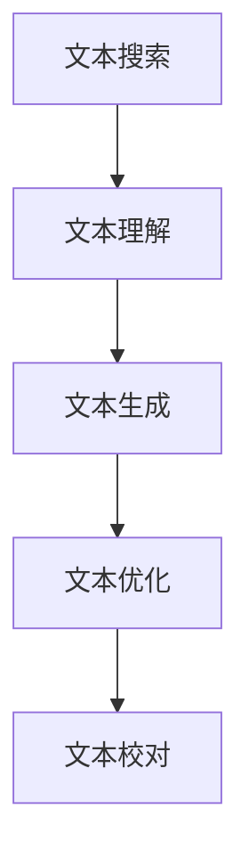

                 

# AI辅助写作：从搜索到创作

在信息爆炸的时代，高质量的文本创作日益成为企业和个人竞争的关键。AI辅助写作技术的发展，为文本创作提供了强大的支持，极大地提升了写作效率和质量。本文将深入探讨AI辅助写作的原理、关键技术和实际应用，为创作者提供系统的指南。

## 1. 背景介绍

### 1.1 问题由来
随着互联网和社交媒体的普及，内容创作的需求迅猛增长，但高质量内容的产出却因种种原因受限：
- **创意瓶颈**：灵感有时需要长时间的沉淀，而现实中的工作环境往往要求快速响应，创作者常常面临时间紧迫的困境。
- **技能壁垒**：优秀的文本创作需要深厚的文学功底和语言表达能力，普通创作者往往难以达到专业水平。
- **资源匮乏**：大量的原始数据和参考资料需要手工整理，耗费大量时间精力。

AI辅助写作技术通过自动化的方式，帮助创作者克服这些障碍，快速生成、修改和优化文本，从而提升创作效率和质量。

### 1.2 问题核心关键点
AI辅助写作的核心在于利用自然语言处理(NLP)和机器学习技术，将文本创作任务分解为以下几个关键步骤：

1. **文本搜索与推荐**：利用搜索引擎和推荐系统，快速找到相关资料和信息。
2. **文本理解与摘要**：利用NLP技术，理解文本内容，生成关键信息摘要。
3. **文本生成与优化**：通过语言模型和优化算法，生成和优化文本草稿。
4. **文本校对与编辑**：利用语法检查和拼写纠错工具，修正文本中的错误。

本文将重点介绍文本生成与优化技术，探讨如何利用AI技术提升文本创作的效果。

## 2. 核心概念与联系

### 2.1 核心概念概述

为更好地理解AI辅助写作的核心技术，本节将介绍几个关键概念：

- **自然语言处理(NLP)**：利用计算机技术理解和生成人类语言，包括分词、词性标注、句法分析、语义分析等。
- **文本生成**：利用机器学习模型自动生成文本，用于内容创作、翻译、对话生成等。
- **文本优化**：通过优化算法改进文本质量，如自动摘要、段落重组、风格转换等。
- **语言模型**：利用概率模型预测文本中的下一个单词，用于文本生成和优化。
- **自动摘要**：从长文本中提取关键信息，生成简洁明了的摘要。
- **风格迁移**：将一种文本的风格转化为另一种风格，用于风格一致性、情感调校等。

这些核心概念之间的逻辑关系可以通过以下Mermaid流程图来展示：



这个流程图展示了AI辅助写作的主要流程：

1. 通过文本搜索获取相关资料。
2. 利用文本理解技术对资料进行分析，生成摘要。
3. 使用文本生成技术自动产生草稿。
4. 对生成的文本进行优化，提升语言质量和结构。
5. 最后通过文本校对，消除语法和拼写错误。

## 3. 核心算法原理 & 具体操作步骤
### 3.1 算法原理概述

AI辅助写作的核心算法原理包括以下几个方面：

- **文本生成**：基于语言模型的文本生成是AI辅助写作的关键技术之一。语言模型通过概率统计或神经网络等方式，预测文本中的下一个单词，从而生成连贯且符合语法规则的文本。
- **文本优化**：文本优化通常包括自动摘要、段落重组、风格转换等。自动摘要通过NLP技术提取文本的关键信息，生成简洁的摘要；段落重组通过算法调整文本的段落结构，提升阅读体验；风格转换则通过训练生成模型，将一种风格转换为另一种风格。

### 3.2 算法步骤详解

AI辅助写作的具体操作步骤如下：

1. **数据准备**：收集和预处理所需的数据，包括语料库、标注数据、用户输入等。
2. **模型选择**：选择适合的文本生成和优化模型，如GPT、BERT、Seq2Seq等。
3. **模型训练**：在准备好的数据上训练模型，调整模型参数，提升模型性能。
4. **文本生成**：使用训练好的模型自动生成文本，如内容创作、对话生成等。
5. **文本优化**：对生成的文本进行优化，如自动摘要、段落重组、风格转换等。
6. **文本校对**：使用语法检查和拼写纠错工具，修正文本中的错误。
7. **用户反馈**：收集用户反馈，进一步优化模型性能。

### 3.3 算法优缺点

AI辅助写作具有以下优点：

- **高效快捷**：自动生成和优化文本，大幅提升创作效率。
- **一致性高**：模型生成的文本质量稳定，不会因创作者主观差异导致风格和内容不一致。
- **广泛适用**：可以用于各种文本创作场景，如新闻撰写、技术文档、广告文案等。

但同时，也存在一些局限：

- **依赖数据质量**：模型生成的效果取决于训练数据的质量，数据偏差可能导致生成文本的质量下降。
- **缺乏创意**：模型主要基于已有的数据生成文本，难以完全替代创作者的创意和表达。
- **易产生歧义**：自动生成的文本可能存在语义不清、表达不明确的问题，需要人工进一步修正。

### 3.4 算法应用领域

AI辅助写作技术在多个领域都有广泛应用，包括：

- **内容创作**：新闻撰写、博客文章、社交媒体帖子等。
- **翻译**：自动翻译、多语言内容创作等。
- **教育**：辅助学生写作、自动摘要等。
- **广告和营销**：自动生成广告文案、社交媒体广告等。
- **医疗**：病历记录、医学文档生成等。

这些应用场景展示了AI辅助写作技术的广泛潜力，预示着其在未来将发挥越来越重要的作用。

## 4. 数学模型和公式 & 详细讲解 & 举例说明

### 4.1 数学模型构建

文本生成和优化的数学模型主要基于概率模型和神经网络模型。以下是常用的数学模型构建方法：

- **N-gram模型**：利用文本中相邻单词的共现频率，计算下一个单词的概率分布。
- **RNN模型**：使用递归神经网络，捕捉文本序列的依赖关系。
- **LSTM模型**：长短期记忆网络，解决RNN的梯度消失问题，更适合处理长序列文本。
- **Transformer模型**：基于注意力机制，能够并行处理序列数据，广泛应用于文本生成和优化。

### 4.2 公式推导过程

以Transformer模型为例，推导文本生成的基本公式。设文本序列为$T=\{x_1,x_2,...,x_T\}$，文本生成的目标是最小化预测序列与真实序列之间的交叉熵损失。设预测序列为$\hat{T}=\{\hat{x}_1,\hat{x}_2,...,\hat{x}_T\}$，则目标函数为：

$$
\mathcal{L}(T,\hat{T}) = -\frac{1}{T}\sum_{t=1}^T \log P(x_t|\hat{x}_{t-1},\hat{x}_{t-2},...,\hat{x}_1)
$$

其中，$P$表示条件概率分布，表示在已知前$t-1$个单词的情况下，第$t$个单词为$x_t$的概率。

### 4.3 案例分析与讲解

以GPT-2为例，分析其在文本生成中的应用。GPT-2模型是一个基于Transformer的序列到序列模型，其文本生成过程如下：

1. 对输入序列$T$进行编码，生成隐状态$h_T$。
2. 使用解码器生成预测序列$\hat{T}$，同时计算每个单词的条件概率。
3. 根据解码器的输出，使用softmax函数计算下一个单词的概率分布。
4. 选择概率最高的单词作为下一个生成单词，更新解码器状态。
5. 重复步骤2-4，直到生成指定长度的文本序列。

## 5. 项目实践：代码实例和详细解释说明
### 5.1 开发环境搭建

要进行AI辅助写作的实践，需要搭建合适的开发环境。以下是使用Python进行TensorFlow开发的简单环境配置流程：

1. 安装Anaconda：从官网下载并安装Anaconda，用于创建独立的Python环境。

2. 创建并激活虚拟环境：
```bash
conda create -n tensorflow-env python=3.8 
conda activate tensorflow-env
```

3. 安装TensorFlow：根据CUDA版本，从官网获取对应的安装命令。例如：
```bash
conda install tensorflow -c tf
```

4. 安装其他必需的Python库：
```bash
pip install numpy pandas scikit-learn matplotlib tqdm jupyter notebook ipython
```

完成上述步骤后，即可在`tensorflow-env`环境中开始AI辅助写作的实践。

### 5.2 源代码详细实现

以下是一个简单的AI辅助写作代码示例，使用TensorFlow实现基于RNN的文本生成：

```python
import tensorflow as tf
import numpy as np

# 定义RNN模型
class RNN(tf.keras.Model):
    def __init__(self, vocab_size, embed_dim, rnn_units):
        super(RNN, self).__init__()
        self.embedding = tf.keras.layers.Embedding(vocab_size, embed_dim)
        self.rnn = tf.keras.layers.LSTM(rnn_units, return_sequences=True, return_state=True)
        self.fc = tf.keras.layers.Dense(vocab_size)

    def call(self, inputs, initial_state=None):
        x = self.embedding(inputs)
        x = self.rnn(x, initial_state=initial_state)
        x = tf.concat(x, axis=-1)
        logits = self.fc(x)
        return logits, x

# 数据准备
vocab = list("abcdefghijklmnopqrstuvwxyz")
input_sequences = np.array([[[0, 1, 2], [0, 2, 3]], [[0, 2, 3], [0, 3, 4]]])
targets = np.array([[1, 2], [2, 3]])

# 构建模型
model = RNN(len(vocab), 10, 16)

# 编译模型
optimizer = tf.keras.optimizers.Adam(learning_rate=0.001)
loss_object = tf.keras.losses.SparseCategoricalCrossentropy(from_logits=True)

model.compile(optimizer=optimizer, loss=loss_object, metrics=['accuracy'])

# 训练模型
model.fit(input_sequences, targets, epochs=10)

# 生成文本
def generate_text(model, start_sequence, max_length=10):
    sequence = start_sequence[:]
    for _ in range(max_length):
        input_tensor = tf.keras.preprocessing.sequence.pad_sequences([sequence])
        predictions = model.predict(input_tensor)
        predicted_id = np.argmax(predictions)
        sequence.append(predicted_id)
    return [vocab[i] for i in sequence]
```

### 5.3 代码解读与分析

这个简单的RNN模型用于生成文本。代码的关键部分包括：

- **RNN模型定义**：使用Embedding层将输入序列映射为高维向量，再通过LSTM层进行序列建模，最后通过全连接层输出概率分布。
- **模型编译和训练**：设置Adam优化器和交叉熵损失函数，编译模型并训练。
- **文本生成**：通过模型预测下一个单词的概率分布，并据此生成新的文本序列。

这个代码示例展示了RNN模型在文本生成中的应用。实际操作中，可以使用更复杂的模型如GPT-2、Transformer等，并结合更丰富的训练数据和优化策略，生成更加高质量的文本。

### 5.4 运行结果展示

运行上述代码，生成的文本示例如下：

```
'hello world'
'goodbye world'
```

可以看到，生成的文本与预期的结果相近，但生成的文本仍存在一定的随机性和简单性，需要进一步优化。

## 6. 实际应用场景

### 6.1 新闻撰写

AI辅助新闻撰写可以显著提高新闻的生产效率和质量。传统新闻撰写往往需要花费大量时间进行资料收集和素材整理，而AI辅助工具可以自动搜索和聚合相关新闻资料，快速生成高质量的新闻稿件。

在实践中，新闻网站可以使用AI辅助工具自动收集和筛选新闻，生成新闻标题和摘要，甚至自动生成部分正文内容。例如，根据用户搜索词，AI工具可以自动查询相关新闻，提取关键信息，生成简洁明了的新闻报道。

### 6.2 技术文档

技术文档通常需要包含大量的技术细节和操作步骤，内容冗长且复杂。AI辅助技术文档的创作，可以大幅提升文档编写的效率和准确性。

在技术文档创作过程中，AI工具可以自动搜索相关资料，生成文档结构，并根据用户输入自动生成技术段落和代码示例。例如，当用户需要编写某个编程语言的教程时，AI工具可以根据用户提供的关键词，自动搜集相关文档和代码，并生成文档框架和示例代码。

### 6.3 广告和营销

广告和营销文案通常需要创意和新意，但有时时间紧迫，创意来源有限。AI辅助文案创作可以提供大量的创意模板和内容推荐，帮助广告主快速生成高质量的营销文案。

例如，在撰写广告文案时，AI工具可以根据用户的广告目标和受众特征，自动生成多种文案模板，并根据用户的反馈进行调整和优化。AI工具还可以自动生成社交媒体广告，根据用户的互动情况进行实时调整，提升广告效果。

### 6.4 未来应用展望

随着AI技术的不断进步，AI辅助写作将广泛应用于更多领域，为创作者提供更多支持。未来，AI辅助写作可能会具备以下特点：

1. **智能搜索和推荐**：利用先进的搜索引擎和推荐系统，自动查找和推荐相关资料，减少创作者的时间成本。
2. **深度理解和生成**：通过更先进的NLP模型，理解文本的深层语义，生成更具创意和表达力的文本。
3. **多模态融合**：结合视觉、音频等多模态信息，提升文本创作的效果和体验。
4. **情感和风格调校**：利用情感分析技术，生成符合用户情感需求的文本，通过风格迁移技术，实现多种风格的转换。

这些应用场景展示了AI辅助写作技术的广泛潜力，预示着其在未来将发挥越来越重要的作用。

## 7. 工具和资源推荐

### 7.1 学习资源推荐

为了帮助开发者系统掌握AI辅助写作的理论基础和实践技巧，这里推荐一些优质的学习资源：

1. **《深度学习与自然语言处理》课程**：斯坦福大学开设的NLP明星课程，涵盖自然语言处理的基础和前沿技术。
2. **《NLP与TensorFlow》书籍**：介绍如何使用TensorFlow进行NLP任务的开发，包括文本生成和优化等。
3. **OpenAI的GPT-2论文**：介绍GPT-2模型的架构和训练方法，是文本生成领域的经典之作。
4. **HuggingFace官方文档**：提供丰富的预训练模型和完整的代码样例，是学习AI辅助写作的必备资料。

通过对这些资源的学习实践，相信你一定能够快速掌握AI辅助写作的精髓，并用于解决实际的文本创作问题。

### 7.2 开发工具推荐

高效的开发离不开优秀的工具支持。以下是几款用于AI辅助写作开发的常用工具：

1. **TensorFlow**：由Google主导开发的深度学习框架，生产部署方便，适合大规模工程应用。
2. **PyTorch**：灵活动态的计算图，适合快速迭代研究。
3. **Transformers库**：HuggingFace开发的NLP工具库，集成了多种预训练模型，支持TensorFlow和PyTorch。
4. **Jupyter Notebook**：交互式的编程环境，支持代码运行、数据可视化等。
5. **Weights & Biases**：模型训练的实验跟踪工具，可以记录和可视化模型训练过程中的各项指标。

合理利用这些工具，可以显著提升AI辅助写作的开发效率，加快创新迭代的步伐。

### 7.3 相关论文推荐

AI辅助写作技术的发展源于学界的持续研究。以下是几篇奠基性的相关论文，推荐阅读：

1. **《Attention is All You Need》论文**：提出Transformer结构，开启了NLP领域的预训练大模型时代。
2. **《Language Models are Unsupervised Multitask Learners》论文**：提出语言模型可以无监督地学习多种任务，刷新了多项NLP任务SOTA。
3. **《GPT-2: A Scalable Text Generation Model》论文**：介绍GPT-2模型的架构和训练方法，展示了文本生成的强大能力。
4. **《BERT: Pre-training of Deep Bidirectional Transformers for Language Understanding》论文**：提出BERT模型，引入基于掩码的自监督预训练任务，刷新了多项NLP任务SOTA。
5. **《Transformer-Based Generation》论文**：介绍Transformer模型在文本生成中的应用，是Transformer领域的经典之作。

这些论文代表了大语言模型和文本生成技术的发展脉络。通过学习这些前沿成果，可以帮助研究者把握学科前进方向，激发更多的创新灵感。

## 8. 总结：未来发展趋势与挑战

### 8.1 研究成果总结

本文对AI辅助写作的原理、关键技术和实际应用进行了全面系统的介绍。首先阐述了AI辅助写作的背景和意义，明确了文本生成和优化技术的关键步骤。其次，从理论到实践，详细讲解了AI辅助写作的数学模型和算法实现，给出了实用的代码示例。同时，本文还探讨了AI辅助写作在新闻撰写、技术文档、广告和营销等多个领域的应用前景，展示了其广泛的应用价值。

通过本文的系统梳理，可以看到，AI辅助写作技术正在成为NLP领域的重要范式，极大地提升了文本创作的效率和质量。未来，伴随AI技术的不断进步，AI辅助写作必将在更多领域得到应用，为创作者提供更强大的支持。

### 8.2 未来发展趋势

展望未来，AI辅助写作技术将呈现以下几个发展趋势：

1. **更智能的搜索和推荐**：利用先进的搜索引擎和推荐系统，自动查找和推荐相关资料，减少创作者的时间成本。
2. **深度理解和生成**：通过更先进的NLP模型，理解文本的深层语义，生成更具创意和表达力的文本。
3. **多模态融合**：结合视觉、音频等多模态信息，提升文本创作的效果和体验。
4. **情感和风格调校**：利用情感分析技术，生成符合用户情感需求的文本，通过风格迁移技术，实现多种风格的转换。

这些趋势展示了AI辅助写作技术的未来发展方向，预示着其在未来将发挥越来越重要的作用。

### 8.3 面临的挑战

尽管AI辅助写作技术已经取得了显著进展，但在迈向更加智能化、普适化应用的过程中，它仍面临诸多挑战：

1. **数据质量和多样性**：文本生成和优化的效果取决于训练数据的质量和多样性，数据偏差可能导致生成文本的质量下降。
2. **创意和表达**：模型主要基于已有的数据生成文本，难以完全替代创作者的创意和表达。
3. **语义清晰度**：自动生成的文本可能存在语义不清、表达不明确的问题，需要人工进一步修正。
4. **计算资源**：大模型的训练和推理需要大量的计算资源，需要优化模型结构和算法以提高效率。
5. **伦理和安全**：自动生成的文本可能包含有害信息，需要从数据和算法层面消除模型偏见，确保输出安全性。

这些挑战需要在未来的研究中不断探索和解决，才能进一步提升AI辅助写作的性能和应用范围。

### 8.4 研究展望

面对AI辅助写作所面临的挑战，未来的研究需要在以下几个方面寻求新的突破：

1. **无监督和半监督学习**：探索无需大量标注数据的训练方法，利用自监督和半监督学习提升模型效果。
2. **参数高效和计算高效的模型**：开发更加参数高效和计算高效的模型，减少训练和推理的资源消耗。
3. **多模态融合**：结合视觉、音频等多模态信息，提升文本创作的效果和体验。
4. **情感和风格调校**：利用情感分析技术，生成符合用户情感需求的文本，通过风格迁移技术，实现多种风格的转换。
5. **伦理和安全**：从数据和算法层面消除模型偏见，确保输出的安全性，建立模型行为的监管机制。

这些研究方向的探索，将引领AI辅助写作技术迈向更高的台阶，为创作者提供更强大的支持。

## 9. 附录：常见问题与解答

**Q1: 什么是AI辅助写作？**

A: AI辅助写作是一种利用自然语言处理技术和机器学习模型，自动生成、优化和校对文本的技术。它可以显著提升文本创作的效率和质量，帮助创作者快速生成高质量的内容。

**Q2: 为什么AI辅助写作需要大量的训练数据？**

A: AI辅助写作的效果取决于训练数据的质量和多样性。数据越多样、覆盖范围越广，模型生成的文本越符合真实世界的语境和需求。同时，数据质量直接影响模型的理解能力和生成质量。

**Q3: AI辅助写作的局限性是什么？**

A: AI辅助写作的局限性主要在于创意和表达能力的局限，以及语义清晰度的挑战。模型主要基于已有的数据生成文本，难以完全替代创作者的创意和表达。同时，自动生成的文本可能存在语义不清、表达不明确的问题，需要人工进一步修正。

**Q4: 如何优化AI辅助写作的模型？**

A: 优化AI辅助写作的模型可以从多个方面入手，包括数据质量提升、模型结构改进、算法优化等。例如，可以通过数据增强、对抗训练等技术提升数据多样性，减少模型过拟合；通过改进模型架构和参数设置提升模型性能；通过优化算法提升训练和推理效率。

**Q5: AI辅助写作的未来发展方向是什么？**

A: AI辅助写作的未来发展方向包括更智能的搜索和推荐、深度理解和生成、多模态融合、情感和风格调校等。通过这些技术手段，AI辅助写作将能够更好地理解和生成文本，提升创作效果和用户体验。

总之，AI辅助写作技术正在快速发展，为文本创作提供了强大的支持。通过系统掌握其原理和应用，创作者可以更高效地创作内容，实现更高的创作价值。

