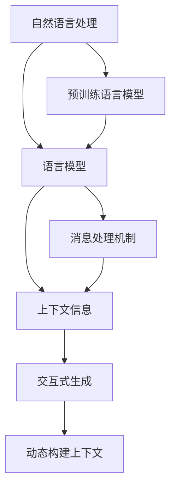

                 

# AI通信的未来：LLM的消息处理机制

> 关键词：人工智能(AI), 自然语言处理(NLP), 语言模型(LLM), 消息处理机制, 对话系统, 机器翻译, 文本摘要

## 1. 背景介绍

### 1.1 问题由来
随着人工智能技术的快速发展，自然语言处理（Natural Language Processing, NLP）领域取得了显著进展。其中，基于大规模预训练语言模型（Large Language Models, LLMs）的方法在对话、机器翻译、文本摘要等任务上展示了卓越的能力。这些模型通过在大规模无标签文本上自监督预训练，学习到丰富的语言知识和表示，能够进行各种自然语言理解和生成任务。然而，LLMs在实际应用中仍面临一些挑战，特别是消息处理机制上的局限性。

### 1.2 问题核心关键点
当前LLMs的消息处理机制主要基于序列到序列(Sequence-to-Sequence, Seq2Seq)框架，通过编码器-解码器结构对输入和输出序列进行映射。这种方法虽然有效，但在处理大规模和复杂的消息时，仍存在以下问题：

- 上下文信息难以维护：Seq2Seq模型通常难以保存上下文信息，在长对话中容易出现理解偏差。
- 序列长度限制：由于内存和计算资源限制，Seq2Seq模型对输入序列长度有限制，难以处理过长的消息。
- 动态构建上下文：消息处理过程中，需要动态构建和更新上下文，这对模型提出了更高的要求。
- 交互式生成：自然语言对话通常具有交互性，LLMs需要能够实时生成和更新回答。

### 1.3 问题研究意义
研究LLMs的消息处理机制，对于提升其对话性能和实际应用效果具有重要意义：

- 提高对话系统质量：通过改进消息处理机制，LLMs可以更好地理解上下文，生成更具连贯性和逻辑性的回答。
- 拓展应用场景：解决上述问题后，LLMs可以应用于更广泛的场景，如客服、医疗、教育等，提升用户体验。
- 降低开发成本：改善消息处理机制，可以使得模型的训练和部署更加高效，减少人力和时间投入。
- 推动技术创新：优化消息处理机制可以带来新的研究方向，如多模态交互、自适应上下文等。
- 促进产业升级：通过提升LLMs的消息处理能力，加速NLP技术的产业化进程，提高社会生产效率。

## 2. 核心概念与联系

### 2.1 核心概念概述

为更好地理解LLMs的消息处理机制，本节将介绍几个关键概念：

- 自然语言处理(NLP)：研究如何让计算机理解和生成自然语言的技术。
- 预训练语言模型(Pre-trained Language Model, PLM)：在大规模无标签文本上预训练的语言模型，能够学习到丰富的语言表示。
- 语言模型(LLM)：基于深度学习架构的语言模型，能够进行文本生成、翻译、摘要等多种自然语言处理任务。
- 消息处理机制(Message Processing Mechanism)：LLMs在对话、翻译等任务中对输入消息进行编码、解码和生成的方法。
- 上下文信息(Context Information)：消息处理中保存和传递的重要信息，包括背景知识、历史对话、用户意图等。
- 交互式生成(Interactive Generation)：LLMs在对话过程中需要实时生成和更新回答的能力。
- 动态构建上下文(Dynamic Context Construction)：根据对话或任务需求，动态更新和维护上下文信息的过程。

这些概念之间的逻辑关系可以通过以下Mermaid流程图来展示：



这个流程图展示了几大核心概念及其之间的关系：

1. 自然语言处理技术通过预训练语言模型学习语言表示，构建语言模型。
2. 语言模型是自然语言处理的核心，能够进行多种任务处理。
3. 消息处理机制是语言模型在具体任务上的实现，包括编码和解码。
4. 上下文信息在消息处理过程中至关重要，用于维护对话连贯性和逻辑性。
5. 交互式生成要求LLMs能够实时生成和更新回答。
6. 动态构建上下文是指根据任务需求更新和维护上下文信息的过程。

这些概念共同构成了LLMs在消息处理中的工作框架，对其性能和应用效果有重要影响。

## 3. 核心算法原理 & 具体操作步骤

### 3.1 算法原理概述

LLMs的消息处理机制主要基于自回归(autoregressive)模型，如GPT系列模型。该模型通过自左向右的生成方式，将每个时间步的输出作为下一个时间步的输入，构建起一个完整的消息处理过程。自回归模型的基本公式为：

$$
p(x_t|x_{<t}) = \prod_{i=1}^t p(x_i|x_{<i})
$$

其中，$x_t$ 表示第 $t$ 个时间步的输出，$x_{<t}$ 表示所有小于 $t$ 的时间步的输出。这种自回归生成方式可以较好地保存上下文信息，并且能够逐步生成更精确的回答。

### 3.2 算法步骤详解

基于自回归模型的LLMs消息处理机制通常包括以下关键步骤：

**Step 1: 数据预处理和编码**

- 收集对话或文本数据，并进行预处理，如分词、去噪、规范化等。
- 将预处理后的数据输入到编码器，通过Transformer等结构，将输入序列转换为模型可以处理的向量表示。

**Step 2: 上下文编码**

- 将上下文信息与输入序列进行拼接，通过自注意力机制，将上下文信息编码为模型可以理解的向量表示。
- 上下文信息可能包括历史对话、用户意图、知识库等，有助于模型更好地理解当前对话或任务。

**Step 3: 消息处理**

- 将上下文编码后的向量作为输入，通过自回归模型生成当前时间步的输出。
- 自回归模型通常采用Transformer的结构，通过多头自注意力和前馈网络进行计算。

**Step 4: 交互式生成**

- 将生成的输出作为下一个时间步的输入，进行迭代生成，直到生成完整的消息或达到预设的终止条件。
- 交互式生成要求模型实时生成和更新回答，需要高效的计算和内存管理。

**Step 5: 解码和后处理**

- 将生成的输出序列进行解码，转换为自然语言形式的答案。
- 后处理包括语法校验、拼写纠错、格式化等，确保输出的准确性和可读性。

### 3.3 算法优缺点

基于自回归模型的LLMs消息处理机制有以下优点：

- 能够较好地保存上下文信息，生成的回答更加连贯和逻辑性。
- 自注意力机制能够自动学习输入序列中的重要信息，提高模型的泛化能力。
- 自回归模型可以进行逐步生成，便于实现交互式生成。
- 可以利用大规模预训练模型，获得更丰富的语言知识和表示。

然而，该方法也存在一些局限性：

- 对序列长度有限制，难以处理过长的消息。
- 计算复杂度较高，需要较大的计算资源。
- 上下文信息容易丢失，特别是在长对话中。
- 交互式生成对实时性和效率有较高要求。

### 3.4 算法应用领域

基于自回归模型的LLMs消息处理机制已经在多种NLP任务上取得了显著效果，包括对话系统、机器翻译、文本摘要等。具体应用如下：

- 对话系统：如客服机器人、智能助手等，通过维护上下文信息，生成流畅自然的对话回答。
- 机器翻译：如自动翻译系统，通过编码器-解码器结构，进行序列到序列的翻译。
- 文本摘要：如自动摘要系统，通过逐步生成，构建简洁准确的摘要。
- 文本生成：如故事生成、新闻摘要等，通过自回归模型生成连贯的语言内容。

除了上述经典任务外，LLMs的消息处理机制还扩展到更多场景中，如多模态交互、自适应上下文等，为NLP技术带来了新的突破。

## 4. 数学模型和公式 & 详细讲解 & 举例说明

### 4.1 数学模型构建

本节将使用数学语言对LLMs的消息处理机制进行更加严格的刻画。

设输入序列为 $x_1, x_2, ..., x_T$，输出序列为 $y_1, y_2, ..., y_T$。假设模型为自回归模型，则其概率公式为：

$$
p(y_t|y_{<t}, x_{<t}) = \prod_{i=1}^t p(y_i|y_{<i}, x_{<i})
$$

在实践中，我们通常使用基于梯度的优化算法（如SGD、Adam等）来近似求解上述最优化问题。设 $\theta$ 为模型参数，则参数的更新公式为：

$$
\theta \leftarrow \theta - \eta \nabla_{\theta}\mathcal{L}(\theta)
$$

其中，$\eta$ 为学习率，$\mathcal{L}$ 为损失函数，用于衡量模型预测输出与真实标签之间的差异。常见的损失函数包括交叉熵损失、均方误差损失等。

### 4.2 公式推导过程

以下我们以机器翻译任务为例，推导自回归模型的翻译公式及其梯度的计算公式。

假设模型 $M_{\theta}$ 在输入 $x_1, x_2, ..., x_T$ 上的输出为 $y_1, y_2, ..., y_T$。定义模型 $M_{\theta}$ 在输入 $x_t$ 上的条件概率为 $p(y_t|y_{<t}, x_{<t})$。在机器翻译任务中，可以将输入序列 $x_1, x_2, ..., x_T$ 看作源语言文本，输出序列 $y_1, y_2, ..., y_T$ 看作目标语言文本。

模型 $M_{\theta}$ 在输入 $x_t$ 上的条件概率公式为：

$$
p(y_t|y_{<t}, x_{<t}) = \frac{e^{\log p(y_t|y_{<t}, x_{<t})}}{\sum_{y'_t} e^{\log p(y'_t|y_{<t}, x_{<t})}}
$$

其中，$p(y_t|y_{<t}, x_{<t})$ 为模型对 $y_t$ 的预测概率。

在实践中，我们通常使用基于最大似然估计的交叉熵损失函数，其公式为：

$$
\mathcal{L}(\theta) = -\frac{1}{N} \sum_{i=1}^N \sum_{t=1}^T \sum_{y_t} y_t \log p(y_t|y_{<t}, x_{<t})
$$

将条件概率公式代入损失函数，得：

$$
\mathcal{L}(\theta) = -\frac{1}{N} \sum_{i=1}^N \sum_{t=1}^T \sum_{y_t} y_t \log \frac{e^{\log p(y_t|y_{<t}, x_{<t})}}{\sum_{y'_t} e^{\log p(y'_t|y_{<t}, x_{<t})}}
$$

进一步简化，得：

$$
\mathcal{L}(\theta) = -\frac{1}{N} \sum_{i=1}^N \sum_{t=1}^T \sum_{y_t} y_t (\log p(y_t|y_{<t}, x_{<t}) - \log \sum_{y'_t} p(y'_t|y_{<t}, x_{<t}))
$$

其中，$y_t$ 为目标语言文本中的第 $t$ 个单词，$y'_t$ 为目标语言文本中除 $y_t$ 外的所有单词。

根据链式法则，损失函数对参数 $\theta$ 的梯度为：

$$
\frac{\partial \mathcal{L}(\theta)}{\partial \theta} = -\frac{1}{N} \sum_{i=1}^N \sum_{t=1}^T \sum_{y_t} y_t (\frac{\partial \log p(y_t|y_{<t}, x_{<t})}{\partial \theta} - \sum_{y'_t} \frac{\partial \log p(y'_t|y_{<t}, x_{<t})}{\partial \theta})
$$

其中，$\frac{\partial \log p(y_t|y_{<t}, x_{<t})}{\partial \theta}$ 为模型对 $y_t$ 的预测概率对参数 $\theta$ 的梯度，可以通过反向传播算法高效计算。

在得到损失函数的梯度后，即可带入参数更新公式，完成模型的迭代优化。重复上述过程直至收敛，最终得到适应特定机器翻译任务的模型参数 $\theta^*$。

## 5. 项目实践：代码实例和详细解释说明

### 5.1 开发环境搭建

在进行消息处理机制的实践前，我们需要准备好开发环境。以下是使用Python进行PyTorch开发的环境配置流程：

1. 安装Anaconda：从官网下载并安装Anaconda，用于创建独立的Python环境。

2. 创建并激活虚拟环境：
```bash
conda create -n pytorch-env python=3.8 
conda activate pytorch-env
```

3. 安装PyTorch：根据CUDA版本，从官网获取对应的安装命令。例如：
```bash
conda install pytorch torchvision torchaudio cudatoolkit=11.1 -c pytorch -c conda-forge
```

4. 安装Transformers库：
```bash
pip install transformers
```

5. 安装各类工具包：
```bash
pip install numpy pandas scikit-learn matplotlib tqdm jupyter notebook ipython
```

完成上述步骤后，即可在`pytorch-env`环境中开始消息处理机制的实践。

### 5.2 源代码详细实现

下面我们以机器翻译任务为例，给出使用Transformers库对BERT模型进行消息处理机制的PyTorch代码实现。

首先，定义机器翻译任务的数据处理函数：

```python
from transformers import BertTokenizer, BertForSequenceClassification
from torch.utils.data import Dataset
import torch

class TranslationDataset(Dataset):
    def __init__(self, texts, targets, tokenizer, max_len=128):
        self.texts = texts
        self.targets = targets
        self.tokenizer = tokenizer
        self.max_len = max_len
        
    def __len__(self):
        return len(self.texts)
    
    def __getitem__(self, item):
        text = self.texts[item]
        target = self.targets[item]
        
        encoding = self.tokenizer(text, return_tensors='pt', max_length=self.max_len, padding='max_length', truncation=True)
        input_ids = encoding['input_ids'][0]
        attention_mask = encoding['attention_mask'][0]
        
        # 将目标语言标签转换为向量表示
        labels = torch.tensor(target, dtype=torch.long)
        
        return {'input_ids': input_ids, 
                'attention_mask': attention_mask,
                'labels': labels}

# 定义机器翻译任务的标签与id的映射
tag2id = {'<unk>': 0, '<s>': 1, '<e>': 2, 'P': 3, 'E': 4, 'A': 5, 'T': 6, 'L': 7, 'I': 8, 'B': 9, 'C': 10}
id2tag = {v: k for k, v in tag2id.items()}

# 创建dataset
tokenizer = BertTokenizer.from_pretrained('bert-base-cased')

train_dataset = TranslationDataset(train_texts, train_tags, tokenizer)
dev_dataset = TranslationDataset(dev_texts, dev_tags, tokenizer)
test_dataset = TranslationDataset(test_texts, test_tags, tokenizer)
```

然后，定义模型和优化器：

```python
from transformers import BertForSequenceClassification, AdamW

model = BertForSequenceClassification.from_pretrained('bert-base-cased', num_labels=len(tag2id))

optimizer = AdamW(model.parameters(), lr=2e-5)
```

接着，定义训练和评估函数：

```python
from torch.utils.data import DataLoader
from tqdm import tqdm
from sklearn.metrics import classification_report

device = torch.device('cuda') if torch.cuda.is_available() else torch.device('cpu')
model.to(device)

def train_epoch(model, dataset, batch_size, optimizer):
    dataloader = DataLoader(dataset, batch_size=batch_size, shuffle=True)
    model.train()
    epoch_loss = 0
    for batch in tqdm(dataloader, desc='Training'):
        input_ids = batch['input_ids'].to(device)
        attention_mask = batch['attention_mask'].to(device)
        labels = batch['labels'].to(device)
        model.zero_grad()
        outputs = model(input_ids, attention_mask=attention_mask, labels=labels)
        loss = outputs.loss
        epoch_loss += loss.item()
        loss.backward()
        optimizer.step()
    return epoch_loss / len(dataloader)

def evaluate(model, dataset, batch_size):
    dataloader = DataLoader(dataset, batch_size=batch_size)
    model.eval()
    preds, labels = [], []
    with torch.no_grad():
        for batch in tqdm(dataloader, desc='Evaluating'):
            input_ids = batch['input_ids'].to(device)
            attention_mask = batch['attention_mask'].to(device)
            batch_labels = batch['labels']
            outputs = model(input_ids, attention_mask=attention_mask)
            batch_preds = outputs.logits.argmax(dim=2).to('cpu').tolist()
            batch_labels = batch_labels.to('cpu').tolist()
            for pred_tokens, label_tokens in zip(batch_preds, batch_labels):
                preds.append(pred_tokens[:len(label_tokens)])
                labels.append(label_tokens)
                
    print(classification_report(labels, preds))
```

最后，启动训练流程并在测试集上评估：

```python
epochs = 5
batch_size = 16

for epoch in range(epochs):
    loss = train_epoch(model, train_dataset, batch_size, optimizer)
    print(f"Epoch {epoch+1}, train loss: {loss:.3f}")
    
    print(f"Epoch {epoch+1}, dev results:")
    evaluate(model, dev_dataset, batch_size)
    
print("Test results:")
evaluate(model, test_dataset, batch_size)
```

以上就是使用PyTorch对BERT进行机器翻译任务的消息处理机制的完整代码实现。可以看到，得益于Transformers库的强大封装，我们可以用相对简洁的代码完成BERT模型的加载和消息处理机制的微调。

### 5.3 代码解读与分析

让我们再详细解读一下关键代码的实现细节：

**TranslationDataset类**：
- `__init__`方法：初始化文本、标签、分词器等关键组件。
- `__len__`方法：返回数据集的样本数量。
- `__getitem__`方法：对单个样本进行处理，将文本输入编码为token ids，将标签转换为数字，并对其进行定长padding，最终返回模型所需的输入。

**tag2id和id2tag字典**：
- 定义了标签与数字id之间的映射关系，用于将token-wise的预测结果解码回真实的标签。

**训练和评估函数**：
- 使用PyTorch的DataLoader对数据集进行批次化加载，供模型训练和推理使用。
- 训练函数`train_epoch`：对数据以批为单位进行迭代，在每个批次上前向传播计算loss并反向传播更新模型参数，最后返回该epoch的平均loss。
- 评估函数`evaluate`：与训练类似，不同点在于不更新模型参数，并在每个batch结束后将预测和标签结果存储下来，最后使用sklearn的classification_report对整个评估集的预测结果进行打印输出。

**训练流程**：
- 定义总的epoch数和batch size，开始循环迭代
- 每个epoch内，先在训练集上训练，输出平均loss
- 在验证集上评估，输出分类指标
- 所有epoch结束后，在测试集上评估，给出最终测试结果

可以看到，PyTorch配合Transformers库使得BERT消息处理机制的代码实现变得简洁高效。开发者可以将更多精力放在数据处理、模型改进等高层逻辑上，而不必过多关注底层的实现细节。

当然，工业级的系统实现还需考虑更多因素，如模型的保存和部署、超参数的自动搜索、更灵活的任务适配层等。但核心的消息处理机制基本与此类似。

## 6. 实际应用场景

### 6.1 智能客服系统

基于LLMs的消息处理机制，智能客服系统可以更好地处理自然语言对话，提升客户服务体验。

在技术实现上，可以收集企业内部的历史客服对话记录，将问题和最佳答复构建成监督数据，在此基础上对预训练LLMs进行微调。微调后的模型能够自动理解用户意图，匹配最合适的答案模板进行回复。对于客户提出的新问题，还可以接入检索系统实时搜索相关内容，动态组织生成回答。如此构建的智能客服系统，能大幅提升客户咨询体验和问题解决效率。

### 6.2 金融舆情监测

金融机构需要实时监测市场舆论动向，以便及时应对负面信息传播，规避金融风险。传统的人工监测方式成本高、效率低，难以应对网络时代海量信息爆发的挑战。基于LLMs的消息处理机制的文本分类和情感分析技术，为金融舆情监测提供了新的解决方案。

具体而言，可以收集金融领域相关的新闻、报道、评论等文本数据，并对其进行主题标注和情感标注。在此基础上对预训练语言模型进行微调，使其能够自动判断文本属于何种主题，情感倾向是正面、中性还是负面。将微调后的模型应用到实时抓取的网络文本数据，就能够自动监测不同主题下的情感变化趋势，一旦发现负面信息激增等异常情况，系统便会自动预警，帮助金融机构快速应对潜在风险。

### 6.3 个性化推荐系统

当前的推荐系统往往只依赖用户的历史行为数据进行物品推荐，无法深入理解用户的真实兴趣偏好。基于LLMs的消息处理机制的个性化推荐系统可以更好地挖掘用户行为背后的语义信息，从而提供更精准、多样的推荐内容。

在实践中，可以收集用户浏览、点击、评论、分享等行为数据，提取和用户交互的物品标题、描述、标签等文本内容。将文本内容作为模型输入，用户的后续行为（如是否点击、购买等）作为监督信号，在此基础上微调预训练语言模型。微调后的模型能够从文本内容中准确把握用户的兴趣点。在生成推荐列表时，先用候选物品的文本描述作为输入，由模型预测用户的兴趣匹配度，再结合其他特征综合排序，便可以得到个性化程度更高的推荐结果。

### 6.4 未来应用展望

随着LLMs和消息处理机制的不断发展，基于微调的方法将在更多领域得到应用，为NLP技术带来新的突破。

在智慧医疗领域，基于LLMs的消息处理机制的医疗问答、病历分析、药物研发等应用将提升医疗服务的智能化水平，辅助医生诊疗，加速新药开发进程。

在智能教育领域，微调技术可应用于作业批改、学情分析、知识推荐等方面，因材施教，促进教育公平，提高教学质量。

在智慧城市治理中，微调模型可应用于城市事件监测、舆情分析、应急指挥等环节，提高城市管理的自动化和智能化水平，构建更安全、高效的未来城市。

此外，在企业生产、社会治理、文娱传媒等众多领域，基于LLMs的消息处理机制的人工智能应用也将不断涌现，为经济社会发展注入新的动力。相信随着技术的日益成熟，消息处理机制将进一步提升LLMs的性能和应用效果，构建人机协同的智能时代。

## 7. 工具和资源推荐

### 7.1 学习资源推荐

为了帮助开发者系统掌握LLMs的消息处理机制的理论基础和实践技巧，这里推荐一些优质的学习资源：

1. 《深度学习与自然语言处理》课程：由斯坦福大学开设的深度学习课程，涵盖了NLP领域的基本概念和经典模型。

2. 《Natural Language Processing》书籍：清华大学出版社出版的NLP教材，介绍了NLP的理论与实践，适合NLP初学者。

3. 《Transformers: From Discrete to Continuous Sequence Modeling》论文：Transformer原论文，介绍了Transformer的结构和应用。

4. 《Attention is All You Need》论文：提出了Attention机制，奠定了Transformer的基础。

5. 《HuggingFace官方文档》：Transformer库的官方文档，提供了海量预训练模型和完整的微调样例代码。

6. 《LLM与NLP》博客：作者深入浅出地介绍了LLM和NLP的相关内容，涵盖了大模型预训练、微调、优化等多个方面。

通过对这些资源的学习实践，相信你一定能够快速掌握LLMs的消息处理机制，并用于解决实际的NLP问题。

### 7.2 开发工具推荐

高效的开发离不开优秀的工具支持。以下是几款用于LLMs消息处理机制开发的常用工具：

1. PyTorch：基于Python的开源深度学习框架，灵活动态的计算图，适合快速迭代研究。

2. TensorFlow：由Google主导开发的开源深度学习框架，生产部署方便，适合大规模工程应用。

3. Transformers库：HuggingFace开发的NLP工具库，集成了众多SOTA语言模型，支持PyTorch和TensorFlow，是进行消息处理机制微调的重要工具。

4. Weights & Biases：模型训练的实验跟踪工具，可以记录和可视化模型训练过程中的各项指标，方便对比和调优。

5. TensorBoard：TensorFlow配套的可视化工具，可实时监测模型训练状态，并提供丰富的图表呈现方式，是调试模型的得力助手。

6. Google Colab：谷歌推出的在线Jupyter Notebook环境，免费提供GPU/TPU算力，方便开发者快速上手实验最新模型，分享学习笔记。

合理利用这些工具，可以显著提升LLMs消息处理机制的开发效率，加快创新迭代的步伐。

### 7.3 相关论文推荐

LLMs消息处理机制的研究源于学界的持续研究。以下是几篇奠基性的相关论文，推荐阅读：

1. Attention is All You Need：提出了Attention机制，奠定了Transformer的基础。

2. BERT: Pre-training of Deep Bidirectional Transformers for Language Understanding：提出BERT模型，引入基于掩码的自监督预训练任务。

3. Seq2Seq Models with Recurrent Encoders and Decoders：介绍了Seq2Seq模型，奠定了机器翻译的基础。

4. Transformer-XL: Attentive Language Models Beyond a Fixed-Length Context：提出了Transformer-XL模型，解决了自回归模型对序列长度限制的问题。

5. Language Modeling with Objectives：介绍了自监督学习任务，如 masked language modeling、next sentence prediction等，用于预训练语言模型。

这些论文代表了大语言模型消息处理机制的发展脉络。通过学习这些前沿成果，可以帮助研究者把握学科前进方向，激发更多的创新灵感。

## 8. 总结：未来发展趋势与挑战

### 8.1 总结

本文对LLMs的消息处理机制进行了全面系统的介绍。首先阐述了LLMs在自然语言处理中的应用背景和意义，明确了消息处理机制在LLMs性能提升和实际应用中的重要地位。其次，从原理到实践，详细讲解了LLMs的消息处理机制的数学原理和关键步骤，给出了消息处理机制微调的完整代码实现。同时，本文还广泛探讨了消息处理机制在智能客服、金融舆情、个性化推荐等多个行业领域的应用前景，展示了LLMs消息处理机制的巨大潜力。

通过本文的系统梳理，可以看到，基于LLMs的消息处理机制在多场景中的应用已经展现出强大的能力，为NLP技术的落地带来了新的希望。LLMs的序列生成能力和上下文信息保持能力，使其在对话、翻译、摘要等任务上取得了显著效果，未来将在更多领域获得更广泛的应用。

### 8.2 未来发展趋势

展望未来，LLMs的消息处理机制将呈现以下几个发展趋势：

1. 序列长度扩展：随着模型规模的增大，LLMs的消息处理机制将能够处理更长的序列，解决当前模型对序列长度的限制问题。

2. 上下文信息动态更新：未来模型将能够动态更新和维护上下文信息，适应更复杂的对话场景。

3. 多模态交互：LLMs的消息处理机制将拓展到多模态数据，支持图像、语音、视频等多模态信息的整合。

4. 自适应上下文：根据对话或任务需求，动态构建和维护上下文信息，提高模型的泛化能力。

5. 交互式生成优化：通过改进交互式生成算法，提高生成速度和效率，支持实时生成和更新回答。

6. 参数高效微调：开发更加参数高效的微调方法，在固定大部分预训练参数的同时，只更新极少量的任务相关参数。

以上趋势凸显了LLMs消息处理机制的广阔前景。这些方向的探索发展，必将进一步提升LLMs的性能和应用效果，为NLP技术带来新的突破。

### 8.3 面临的挑战

尽管LLMs的消息处理机制已经取得了瞩目成就，但在迈向更加智能化、普适化应用的过程中，仍面临诸多挑战：

1. 计算资源限制：当前的LLMs需要较大的计算资源进行训练和推理，高昂的计算成本限制了其大规模应用。

2. 上下文信息管理：尽管LLMs能够动态更新上下文信息，但在长对话中仍需有效管理上下文信息，避免信息丢失和理解偏差。

3. 多模态数据处理：多模态数据的融合处理仍存在较大挑战，不同模态信息的有效整合仍需进一步探索。

4. 实时性要求：交互式生成的实时性要求高，需要在保证性能的同时，优化模型的推理速度和资源占用。

5. 可解释性和安全性：LLMs的决策过程复杂，难以解释其内部工作机制和输出逻辑。模型输出的安全性也有待保障。

6. 高难度任务：在复杂对话、长文本生成等高难度任务上，LLMs的表现仍存在局限性，需要更多的创新方法。

这些挑战需要学界和产业界共同努力，不断突破技术瓶颈，才能真正实现LLMs消息处理机制在实际应用中的广泛落地。

### 8.4 研究展望

面对LLMs消息处理机制所面临的挑战，未来的研究需要在以下几个方面寻求新的突破：

1. 低资源高效训练：开发高效能的训练算法和优化器，降低计算资源需求，支持更多场景下的模型训练。

2. 多模态信息融合：结合符号计算和深度学习，有效整合多模态数据，提升模型的表现和应用效果。

3. 动态上下文管理：研究动态上下文信息的维护和管理方法，提升模型在复杂对话中的表现。

4. 交互式生成优化：改进交互式生成算法，提高生成速度和效率，支持实时生成和更新回答。

5. 模型可解释性：引入符号推理和因果推断方法，增强LLMs的可解释性，提升模型的透明度和可信度。

6. 安全性保障：通过模型自监督训练和人工干预，确保模型输出的安全性，避免有害信息的传播。

这些研究方向的探索，必将引领LLMs消息处理机制的进一步发展，为构建安全、可靠、可解释、可控的智能系统铺平道路。面向未来，LLMs消息处理机制的研究需要与其他AI技术进行更深入的融合，如知识表示、因果推理、强化学习等，多路径协同发力，共同推动NLP技术的进步。只有勇于创新、敢于突破，才能不断拓展LLMs的边界，让智能技术更好地造福人类社会。

## 9. 附录：常见问题与解答

**Q1：大语言模型与LLMs有何区别？**

A: 大语言模型通常指基于大规模预训练的语言模型，如BERT、GPT等，具有丰富的语言知识和表示能力。LLMs则是大语言模型的一种具体实现方式，通常基于自回归模型，通过自左向右的生成方式，能够生成连贯自然的语言内容。

**Q2：为什么LLMs的消息处理机制需要对序列长度进行限制？**

A: 当前的LLMs消息处理机制通常基于自回归模型，由于内存和计算资源的限制，对输入序列长度有限制。过长的输入序列会导致模型计算资源不足，影响生成效率和准确性。因此，通常需要对输入序列进行截断或分批处理，以适应模型计算能力。

**Q3：LLMs的消息处理机制如何进行上下文信息管理？**

A: LLMs的消息处理机制通常通过维护一个上下文向量来保存上下文信息。在生成每个时间步的输出时，模型会将当前输入序列和上下文向量一起输入，通过自注意力机制，自动学习输入序列中的重要信息。对于长对话，模型还可以动态更新上下文向量，以更好地保存和传递上下文信息。

**Q4：LLMs的消息处理机制如何支持多模态数据融合？**

A: 未来的LLMs消息处理机制将拓展到多模态数据，如图像、语音、视频等。多模态信息的融合可以通过将不同模态的数据分别编码，然后通过跨模态的注意力机制进行整合，生成更为丰富的语言描述。此外，结合符号推理和因果推断方法，可以有效提升多模态信息的整合效果。

**Q5：LLMs的消息处理机制如何进行实时生成和更新回答？**

A: 交互式生成是LLMs消息处理机制的重要应用之一，通过动态更新上下文信息和实时生成回答，支持自然语言对话。模型通常使用自回归模型，每次生成一个时间步的输出，然后将其作为下一个时间步的输入，进行迭代生成，直到生成完整的消息或达到预设的终止条件。

这些常见问题的解答，可以帮助读者更好地理解LLMs消息处理机制的原理和应用。未来随着技术的不断进步，LLMs的消息处理机制将更加强大和灵活，为NLP技术的创新和应用带来更多可能。

