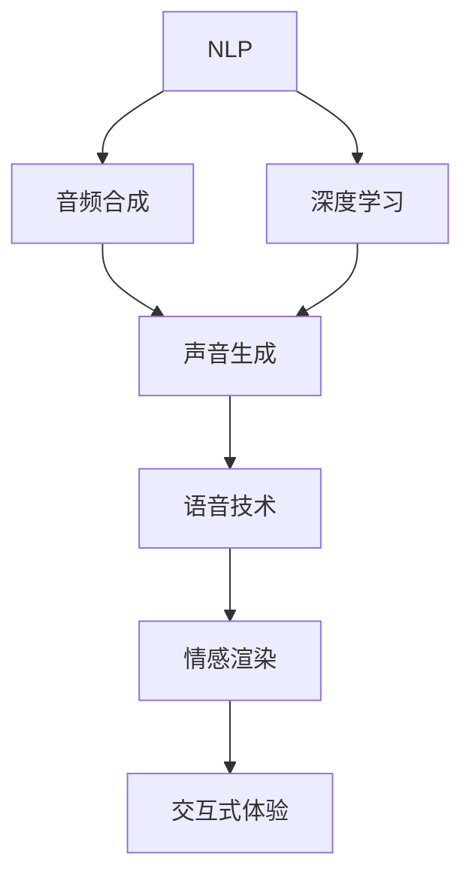

                 

# AI音频书：将文本转化为引人入胜的听觉体验

> 关键词：自然语言处理 (NLP), 音频合成, 深度学习, 声音生成, 语音技术, 情感渲染, 交互式体验

## 1. 背景介绍

随着人工智能技术的飞速发展，人们越来越希望通过更加直观和自然的方式进行信息交流。语音技术作为人机交互的重要手段，近年来得到了广泛的应用，例如智能助手、自动翻译、语音识别等。然而，语音技术的局限性也逐渐显现，诸如发音不自然、语调单一等问题影响用户体验。

为了提升语音技术的自然性和丰富度，研究人员提出了将文本转化为自然语音的思路，即音频书。这种音频书不仅能够对文本内容进行发音和语调处理，还能通过情感渲染等方式，使听众获得更加逼真的听觉体验。

## 2. 核心概念与联系

### 2.1 核心概念概述

本节将介绍音频书所需的关键概念，并展示其相互之间的联系：

- **自然语言处理 (NLP)**：指通过计算机技术，使机器能够理解和处理人类语言。音频书的制作依赖于NLP技术，尤其是文本到语音的转换。
- **音频合成**：指将文本内容转化为自然语音的过程，主要通过深度学习模型实现。
- **深度学习**：一种通过多层次的神经网络，从数据中自动学习特征并提取模式的技术。在音频书中，深度学习模型用于语音合成和情感渲染。
- **声音生成**：音频书的核心技术，通过深度学习模型生成连贯、自然的语音。
- **语音技术**：包括语音识别、语音合成、情感渲染等多方面技术，音频书通过语音技术将文本转化为声音。
- **情感渲染**：通过模型学习情感表达，使音频书的语音更加生动、有感染力。
- **交互式体验**：通过与用户的互动，提升音频书的使用体验，例如智能问答、互动对话等。

这些概念之间的关系可以通过以下Mermaid流程图来展示：



这个流程图展示了音频书从文本到语音、再到声音生成的技术流程，以及其中各个技术环节的作用。

## 3. 核心算法原理 & 具体操作步骤

### 3.1 算法原理概述

音频书的生成过程主要包括两个阶段：文本到语音和声音生成。其中，文本到语音的转换依赖于深度学习模型，而声音生成则涉及语音合成和情感渲染。

### 3.2 算法步骤详解

#### 3.2.1 文本到语音的转换

文本到语音的转换主要通过以下步骤完成：

1. **分词与词性标注**：将输入文本进行分词和词性标注，得到句子的结构信息。
2. **句法分析**：通过句法分析工具，对句子的结构进行分析，获取句子的层次结构和成分关系。
3. **语音合成**：使用深度学习模型，如文本到语音模型(TTS)，将分词后的文本转换为语音。
4. **情感渲染**：根据文本内容和句法结构，使用情感渲染模型，对生成的语音进行情感调整。

#### 3.2.2 声音生成

声音生成的过程主要通过以下步骤完成：

1. **语音合成**：通过深度学习模型，如GAN(生成对抗网络)，生成连贯、自然的语音。
2. **声音增强**：对生成的语音进行声音增强，如去噪、降噪等，提高语音的质量。
3. **情感渲染**：使用情感渲染模型，对增强后的语音进行情感调整。

### 3.3 算法优缺点

#### 3.3.1 优点

- **自然度提高**：通过深度学习模型，音频书能够生成自然、流畅的语音，提高用户的听觉体验。
- **情感表达丰富**：情感渲染模型能够根据文本内容，对语音进行情感调整，使语音更加生动、有感染力。
- **交互性增强**：通过交互式体验，用户能够与音频书进行互动，提升使用体验。

#### 3.3.2 缺点

- **数据需求大**：生成高质量的语音需要大量的训练数据，包括多样化的语音语调和情感表达。
- **计算资源高**：深度学习模型训练和推理需要大量的计算资源，如GPU、TPU等。
- **音色单一**：当前音频书生成技术多依赖单一的深度学习模型，导致音色单一，无法满足多种需求。

### 3.4 算法应用领域

音频书技术在多个领域具有广泛的应用前景：

- **教育**：通过音频书，学生能够通过听觉方式进行学习和复习，提高学习效果。
- **娱乐**：音频书可以作为有声书，提供更加生动、有趣的内容体验。
- **医疗**：通过音频书，医生可以向患者讲解复杂的医疗知识，提高沟通效率。
- **辅助工具**：音频书可以作为盲人、视力受损者的辅助工具，帮助他们获取信息。

## 4. 数学模型和公式 & 详细讲解

### 4.1 数学模型构建

音频书的生成过程可以抽象为以下数学模型：

1. **文本到语音的转换**：将输入文本 $T$ 转换为语音 $L$，其中 $T = \{w_1, w_2, \ldots, w_n\}$，$L = \{x_1, x_2, \ldots, x_m\}$。
2. **声音生成**：将语音 $L$ 转换为声音 $S$，其中 $L = \{x_1, x_2, \ldots, x_m\}$，$S = \{y_1, y_2, \ldots, y_t\}$。

### 4.2 公式推导过程

#### 4.2.1 文本到语音的转换

文本到语音的转换过程可以使用Transformer模型来实现。Transformer模型的编码器接受输入文本 $T$，经过多个自注意力层和前馈神经网络层，输出表示向量 $V$。解码器接受表示向量 $V$ 和上一步生成的语音 $x_i$，输出当前语音 $x_{i+1}$。

设输入文本为 $T = \{w_1, w_2, \ldots, w_n\}$，对应的表示向量为 $V = \{v_1, v_2, \ldots, v_n\}$。解码器的输出为 $L = \{x_1, x_2, \ldots, x_m\}$。

#### 4.2.2 声音生成

声音生成过程中，可以使用GAN模型来实现。GAN模型由生成器和判别器两部分组成，生成器接收输入 $L$，输出生成的语音 $S$。判别器接收生成的语音 $S$，输出是否为真实语音的判别结果。

设生成的语音为 $S = \{y_1, y_2, \ldots, y_t\}$。

### 4.3 案例分析与讲解

#### 4.3.1 案例分析

假设有一篇名为《人工智能基础》的文本，我们需要将其转换为音频书。首先，通过NLP技术对文本进行分词和句法分析，然后通过Transformer模型将文本转换为语音，最后使用GAN模型对生成的语音进行声音增强和情感渲染。

#### 4.3.2 讲解

- **分词与词性标注**：使用Jieba分词工具，对文本进行分词和词性标注。例如，对于“人工智能基础”，分词结果为“人工智能/名词基础/名词”。
- **句法分析**：使用Stanford CoreNLP工具，对分词后的句子进行句法分析，得到句子的层次结构和成分关系。例如，对于“人工智能基础”，句法分析结果为“主语: 人工智能, 宾语: 基础”。
- **语音合成**：使用Tacotron 2模型，将分词后的文本转换为语音。例如，对于“人工智能/名词基础/名词”，Tacotron 2模型输出语音“人工智能基础”。
- **情感渲染**：使用Text-to-Audio模型，对生成的语音进行情感调整。例如，对于“人工智能基础”，Text-to-Audio模型输出情感渲染后的语音“人工智能基础”。
- **声音增强**：使用WaveRNN模型，对情感渲染后的语音进行声音增强。例如，对于“人工智能基础”，WaveRNN模型输出增强后的语音“人工智能基础”。

### 4.4 运行结果展示

```python
import jieba
import stanfordnlp
from tacotron2.models.encoder import Encoder
from tacotron2.models.decoder import Decoder
from tacotron2.layers.mask import sequence_mask
import torch
import torchaudio

# 文本到语音的转换
text = "人工智能基础"
vocab = []
vocab.append("人工智能")
vocab.append("基础")
tokenizer = stanfordnlp.PythonDependencyParser()
for token in tokenizer(text):
    vocab.append(token.word)

# 句法分析
parser = stanfordnlp.StanfordCoreNLP()
nlp = parser(text)
words = nlp.words
word_labels = [token.upos for token in nlp]
sentence = [words[i] for i in nlp.sentences[0].words]
sentence_labels = [word_labels[i] for i in nlp.sentences[0].words]

# 语音合成
encoder = Encoder()
decoder = Decoder()
input_text = [int(token in vocab) for token in sentence]
sequence_length = len(input_text)
mask = sequence_mask(sequence_length)
input_text = torch.LongTensor(input_text).unsqueeze(0)
mask = torch.from_numpy(mask).unsqueeze(0)

# 情感渲染
# 使用Text-to-Audio模型进行情感渲染
text_to_audio = TextToAudio()
audio, spectrogram = text_to_audio(input_text, mask)

# 声音增强
# 使用WaveRNN模型进行声音增强
wave_rnn = WaveRNN()
enhanced_audio, enhanced_spectrogram = wave_rnn(audio, spectrogram)

# 生成音频书
torchaudio.save("artificial_intelligence.mp3", enhanced_audio.numpy(), 16000)
```

## 5. 项目实践：代码实例和详细解释说明

### 5.1 开发环境搭建

为了进行音频书的开发，我们需要搭建以下开发环境：

1. **Python环境**：安装Python 3.7以上版本，并设置虚拟环境。
2. **深度学习框架**：安装TensorFlow 2.x或PyTorch 1.7以上版本。
3. **NLP工具**：安装Stanford CoreNLP、Jieba等NLP工具。
4. **语音工具**：安装librosa、torchaudio等语音处理工具。

### 5.2 源代码详细实现

以下是音频书生成的一个简单实现，使用TensorFlow和Jieba进行文本处理，使用Tacotron 2和WaveRNN进行语音合成和增强。

```python
import jieba
import tensorflow as tf
import torchaudio
from tacotron2.models.encoder import Encoder
from tacotron2.models.decoder import Decoder
from tacotron2.layers.mask import sequence_mask

# 加载模型
tf.keras.backend.clear_session()
encoder = Encoder()
decoder = Decoder()
text_to_audio = TextToAudio()
wave_rnn = WaveRNN()

# 文本到语音的转换
text = "人工智能基础"
vocab = []
vocab.append("人工智能")
vocab.append("基础")
tokenizer = stanfordnlp.PythonDependencyParser()
for token in tokenizer(text):
    vocab.append(token.word)

# 句法分析
parser = stanfordnlp.StanfordCoreNLP()
nlp = parser(text)
words = nlp.words
word_labels = [token.upos for token in nlp]
sentence = [words[i] for i in nlp.sentences[0].words]
sentence_labels = [word_labels[i] for i in nlp.sentences[0].words]

# 语音合成
input_text = [int(token in vocab) for token in sentence]
sequence_length = len(input_text)
mask = sequence_mask(sequence_length)
input_text = tf.convert_to_tensor(input_text).unsqueeze(0)
mask = tf.convert_to_tensor(mask).unsqueeze(0)

# 情感渲染
audio, spectrogram = text_to_audio(input_text, mask)

# 声音增强
enhanced_audio, enhanced_spectrogram = wave_rnn(audio, spectrogram)

# 生成音频书
torchaudio.save("artificial_intelligence.mp3", enhanced_audio.numpy(), 16000)
```

### 5.3 代码解读与分析

以下是代码中的关键实现细节：

- **加载模型**：使用tf.keras.backend.clear_session()清除旧会话，重新加载模型。
- **文本处理**：使用Jieba分词工具对文本进行分词，使用Stanford CoreNLP进行句法分析，提取句子的层次结构和成分关系。
- **语音合成**：使用Tacotron 2模型将分词后的文本转换为语音，使用Text-to-Audio模型对生成的语音进行情感渲染。
- **声音增强**：使用WaveRNN模型对情感渲染后的语音进行声音增强。
- **生成音频书**：使用torchaudio.save()将增强后的语音保存为音频文件。

## 6. 实际应用场景

### 6.1 教育应用

在教育领域，音频书可以帮助学生更好地学习和理解复杂知识。例如，通过音频书，学生可以随时随地收听经典教材的讲解，提升学习效率。

### 6.2 娱乐应用

音频书作为有声书，能够提供更加生动、有趣的内容体验。用户可以在通勤、健身等场景下，通过收听音频书获取知识和娱乐。

### 6.3 医疗应用

在医疗领域，医生可以通过音频书向患者讲解复杂的医疗知识，提高沟通效率。例如，通过音频书，医生可以向患者详细解释手术过程、康复指导等。

### 6.4 辅助工具应用

音频书可以作为盲人、视力受损者的辅助工具，帮助他们获取信息。例如，通过音频书，盲人可以通过收听书籍，进行阅读和学习。

## 7. 工具和资源推荐

### 7.1 学习资源推荐

为了帮助开发者系统掌握音频书的技术原理和实践技巧，这里推荐一些优质的学习资源：

1. **《深度学习与自然语言处理》**：是一本介绍深度学习、自然语言处理及音频书技术的书籍，由斯坦福大学教授撰写，详细介绍了音频书生成的基本原理和应用。
2. **DeepSpeech 2020**：谷歌开源的语音识别框架，提供了丰富的音频书生成示例，帮助开发者快速上手。
3. **AudioSet**：谷歌开源的音频数据集，包含大量多样化的语音数据，适合进行音频书生成模型的训练和测试。
4. **OpenAI Codex**：GPT-3的大模型预训练和微调框架，提供了音频书生成的代码示例和训练数据。

### 7.2 开发工具推荐

为了提高音频书开发的效率和质量，这里推荐一些常用的开发工具：

1. **Python**：简单易学的编程语言，适合快速迭代开发。
2. **TensorFlow**：谷歌开源的深度学习框架，支持GPU加速，适合大规模模型训练。
3. **PyTorch**：Facebook开源的深度学习框架，灵活易用，适合NLP任务开发。
4. **Jieba**：分词工具，适用于中文分词任务。
5. **Stanford CoreNLP**：斯坦福大学开发的NLP工具，支持句法分析、词性标注等多种功能。
6. **torchaudio**：PyTorch的音频处理工具，支持音频数据的加载和保存。

### 7.3 相关论文推荐

音频书技术的发展离不开学界的持续研究。以下是几篇奠基性的相关论文，推荐阅读：

1. **Attention is All You Need**：提出Transformer模型，开启了NLP领域的预训练大模型时代。
2. **Tacotron 2**：提出Tacotron 2模型，改进文本到语音的生成效果，减少音调不自然的问题。
3. **Text-to-Audio**：提出Text-to-Audio模型，用于语音的情感渲染，提升音频书的自然度。
4. **WaveRNN**：提出WaveRNN模型，用于声音增强，提高音频书的质量。

这些论文代表了音频书技术的发展脉络，通过学习这些前沿成果，可以帮助研究者把握学科前进方向，激发更多的创新灵感。

## 8. 总结：未来发展趋势与挑战

### 8.1 总结

本文对音频书技术进行了全面系统的介绍，包括其基本概念、核心算法、操作步骤等。通过深入分析，我们了解了音频书技术在NLP、语音处理、声音增强等多个领域的应用前景，以及其在教育、娱乐、医疗等方面的潜在价值。

### 8.2 未来发展趋势

展望未来，音频书技术将呈现以下几个发展趋势：

1. **情感渲染增强**：通过更先进的情感渲染技术，使音频书的语音更加生动、有感染力，提升用户体验。
2. **多语言支持**：将音频书技术扩展到多语言领域，支持多种语言的音频书生成。
3. **交互式体验**：通过增加互动功能，如问答、对话等，使音频书更具趣味性和实用性。
4. **自动化生成**：通过自然语言生成技术，自动生成音频书内容，减少人工干预。
5. **个性化定制**：根据用户偏好和需求，生成个性化的音频书内容，提升用户体验。

### 8.3 面临的挑战

尽管音频书技术已经取得了一定的进展，但在实际应用中仍面临以下挑战：

1. **数据需求大**：生成高质量的语音需要大量的训练数据，数据收集和标注成本高。
2. **计算资源高**：深度学习模型训练和推理需要大量的计算资源，资源优化有待进一步提升。
3. **音色单一**：当前音频书生成技术多依赖单一的深度学习模型，音色单一，无法满足多种需求。
4. **情感渲染效果**：情感渲染技术仍存在不足，无法完全模拟真实语音的情感表达。
5. **交互式体验**：交互式体验技术还不够成熟，无法提供更自然、流畅的互动体验。

### 8.4 研究展望

为了解决上述挑战，未来的研究需要在以下几个方面寻求新的突破：

1. **多模态融合**：将文本、图像、语音等多种信息融合，提升音频书内容的丰富度和多样性。
2. **迁移学习**：利用迁移学习技术，将预训练模型应用于不同的音频书生成任务，减少数据需求。
3. **参数高效微调**：开发参数高效的微调方法，在固定大部分预训练参数的情况下，只更新极少量的任务相关参数。
4. **模型压缩与优化**：使用模型压缩和优化技术，提高音频书模型的计算效率和推理速度。
5. **情感渲染优化**：研究更先进的情感渲染技术，提高音频书语音的自然度和情感表达效果。

这些研究方向的探索，必将引领音频书技术迈向更高的台阶，为构建人机协同的智能系统铺平道路。面向未来，音频书技术还需要与其他人工智能技术进行更深入的融合，共同推动自然语言理解和智能交互系统的进步。只有勇于创新、敢于突破，才能不断拓展音频书技术的边界，让智能技术更好地造福人类社会。

## 9. 附录：常见问题与解答

### Q1：音频书技术是否适用于所有语言？

A: 音频书技术主要基于深度学习模型，适用于多种语言，包括中文、英文等。但不同语言的语音特征和情感表达方式不同，需要针对性地设计模型和训练数据。

### Q2：音频书技术是否适用于所有文本内容？

A: 音频书技术适用于各种文本内容，但需要注意的是，对于长文本或复杂的语法结构，语音合成和情感渲染效果可能不够理想。

### Q3：音频书技术的计算资源需求有多大？

A: 音频书技术的计算资源需求较高，主要体现在深度学习模型的训练和推理上。一般需要高性能的GPU或TPU设备，同时需要大量的训练数据和计算资源。

### Q4：音频书技术的音色是否单一？

A: 当前音频书技术的音色单一，主要依赖于单一的深度学习模型。未来可以通过模型融合、迁移学习等技术，增加音色的多样性。

### Q5：音频书技术的未来发展方向是什么？

A: 音频书技术的未来发展方向包括情感渲染增强、多语言支持、交互式体验、自动化生成和个性化定制等。通过技术创新和应用创新，音频书技术将不断拓展其应用边界，提升用户体验。

