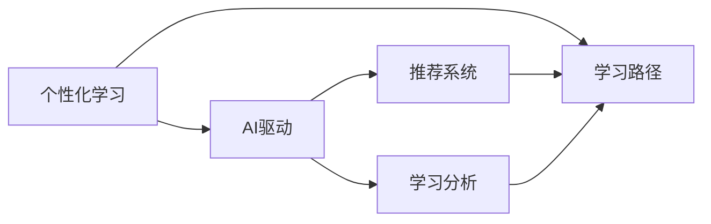

                 

# AI驱动的个性化学习路径设计

## 1. 背景介绍

在数字化时代，知识的获取和应用变得越来越重要。而传统的教学方式，往往难以满足学生个性化学习的需求。为了解决这个问题，人工智能(AI)技术被引入教育领域，通过个性化学习路径设计，为每个学生量身定制学习计划，提升学习效率和效果。本文将对AI驱动的个性化学习路径设计进行深入探讨，从原理到实践，介绍这一领域的核心概念、关键算法和实际应用。

## 2. 核心概念与联系

### 2.1 核心概念概述

为了更好地理解AI驱动的个性化学习路径设计，本节将介绍几个关键概念：

- 个性化学习：根据学生的兴趣、能力、学习习惯等个性化特征，量身定制的学习计划和资源推荐。
- AI驱动：利用人工智能算法和技术，自动分析学生数据，生成个性化学习路径。
- 学习路径：按照特定的学习目标和步骤，推荐的课程、资源和学习活动。
- 推荐系统：通过分析用户行为和偏好，推荐个性化内容的技术。
- 学习分析：收集、分析和报告学生学习行为数据的技术。

这些概念之间的逻辑关系可以通过以下Mermaid流程图来展示：



这个流程图展示了个性化学习、AI驱动、学习路径、推荐系统和学习分析之间的联系。

## 3. 核心算法原理 & 具体操作步骤

### 3.1 算法原理概述

AI驱动的个性化学习路径设计主要基于机器学习和推荐系统算法，通过分析学生的学习行为和反馈数据，自动生成个性化的学习路径。其核心思想是：利用用户的历史学习行为、兴趣偏好、能力水平等数据，建立模型预测学生未来的学习需求，从而推荐最适合的学习内容和路径。

形式化地，假设学生集合为 $S$，课程集合为 $C$，学习路径为 $P$。定义学生 $s \in S$ 在课程 $c \in C$ 上的学习行为为 $b_{sc} \in \{0,1\}$，其中 $0$ 表示未学习，$1$ 表示已学习。定义学生 $s$ 的学习路径 $p_s \in P$ 为从 $C$ 中挑选的一组课程序列，即 $p_s = (c_1, c_2, \cdots, c_k)$。目标是根据学生的学习行为和偏好，找到最优的学习路径 $p_s$。

### 3.2 算法步骤详解

AI驱动的个性化学习路径设计一般包括以下几个关键步骤：

**Step 1: 数据收集与预处理**
- 收集学生的历史学习数据，包括课程学习情况、考试成绩、作业提交情况等。
- 使用数据清洗、特征工程等技术对数据进行预处理，去除噪声和缺失值，提取有用的特征。

**Step 2: 模型训练**
- 选择合适的推荐模型，如协同过滤、内容推荐、矩阵分解等，使用学生的行为数据进行训练。
- 将学生 $s$ 在课程 $c$ 上的行为数据 $b_{sc}$ 作为训练样本，输出预测学生对课程的偏好 $p_{sc}$。
- 通过交叉验证等技术对模型进行调参，确保模型预测的准确性。

**Step 3: 路径生成**
- 根据学生的兴趣偏好、学习目标等信息，构建推荐模型，生成课程推荐列表。
- 结合学生的学习进度、能力水平等，生成适合的学习路径 $p_s$。

**Step 4: 学习跟踪与调整**
- 使用学习分析技术，实时收集学生在学习路径上的行为数据，如点击率、学习时间、完成度等。
- 根据学习行为数据，不断调整和优化学习路径，确保学生能够有效学习。

**Step 5: 反馈与优化**
- 收集学生的学习反馈，如满意度、完成度等，评估学习路径的效果。
- 根据反馈数据，进一步优化推荐模型和路径生成算法，提升个性化学习的效果。

### 3.3 算法优缺点

AI驱动的个性化学习路径设计具有以下优点：
1. 个性化强。能够根据学生的个性化特征，量身定制学习路径，提升学习效果。
2. 可扩展性强。通过添加更多维度的数据，可以不断扩展个性化推荐和路径生成的能力。
3. 高效性高。自动化的推荐和路径生成，减少了人工干预，提高了学习效率。

同时，该方法也存在一定的局限性：
1. 数据需求高。需要大量的学生数据和课程数据，收集和处理成本较高。
2. 模型复杂度较高。推荐算法和路径生成算法较为复杂，需要较强的技术支撑。
3. 公平性问题。模型可能会对少数族群学生产生歧视，影响学习公平性。
4. 可解释性不足。推荐模型和路径生成算法的决策过程难以解释，难以调试和优化。

尽管存在这些局限性，但就目前而言，AI驱动的个性化学习路径设计仍是大数据时代教育技术的重要范式。未来相关研究的重点在于如何进一步降低数据收集和处理成本，提高模型的公平性和可解释性，同时兼顾效率和效果。

### 3.4 算法应用领域

AI驱动的个性化学习路径设计在教育领域已经得到了广泛的应用，覆盖了几乎所有常见学习场景，例如：

- 智能辅导系统：根据学生的学习情况，推荐适合的练习题和知识点，提供实时辅导。
- 自适应学习平台：根据学生的学习进度和能力，动态调整课程难度和学习路径。
- 在线课程推荐：根据学生的兴趣和历史行为，推荐适合的在线课程和学习资源。
- 个性化作业设计：根据学生的学习风格和知识掌握情况，生成个性化的作业和练习。
- 学术研究指导：根据学生的学术背景和研究方向，推荐相关的论文、课程和导师。

除了上述这些经典应用外，AI驱动的个性化学习路径设计还被创新性地应用到更多场景中，如职业规划、健康管理、终身学习等，为学生提供了全方位的支持，助力其全面发展。

## 4. 数学模型和公式 & 详细讲解 & 举例说明

### 4.1 数学模型构建

本节将使用数学语言对AI驱动的个性化学习路径设计过程进行更加严格的刻画。

定义学生 $s$ 在课程 $c$ 上的行为数据为 $b_{sc}$，定义学生 $s$ 对课程 $c$ 的偏好为 $p_{sc}$，则推荐模型可以表示为：

$$
p_{sc} = f(b_{sc})
$$

其中 $f$ 为推荐模型。目标是根据 $p_{sc}$ 生成个性化学习路径 $p_s$。

### 4.2 公式推导过程

以下我们以协同过滤算法为例，推导个性化推荐模型的公式。

假设学生集合为 $S=\{s_1, s_2, \cdots, s_n\}$，课程集合为 $C=\{c_1, c_2, \cdots, c_m\}$，学生 $s$ 在课程 $c$ 上的行为数据 $b_{sc} \in \{0,1\}$，定义学生 $s_i$ 对课程 $c_j$ 的偏好为 $p_{ij}$，则协同过滤算法可以表示为：

$$
p_{ij} = \frac{\sum_{k=1}^n \alpha_{ik} \times b_{kj}}{\sum_{k=1}^n \alpha_{ik}}
$$

其中 $\alpha_{ik}$ 为相似度权重，可以通过余弦相似度、皮尔逊相关系数等方法计算。

根据 $p_{ij}$ 可以生成学生 $s_i$ 的推荐列表，再结合学习进度和目标等约束条件，生成个性化学习路径 $p_s$。

### 4.3 案例分析与讲解

假设某学生 $s$ 在课程 $c_1, c_2, c_3$ 上的行为数据为 $b_{s1} = 1, b_{s2} = 0, b_{s3} = 1$，推荐模型为协同过滤算法，相似度权重为余弦相似度，则该学生 $s$ 在课程 $c_1, c_2, c_3$ 上的推荐偏好为：

$$
p_{s1} = \frac{\alpha_{s1} \times b_{11}}{\alpha_{s1}}, p_{s2} = \frac{\alpha_{s1} \times b_{21}}{\alpha_{s1}}, p_{s3} = \frac{\alpha_{s1} \times b_{31}}{\alpha_{s1}}
$$

其中 $\alpha_{s1}$ 为学生 $s$ 与其他学生之间的相似度。假设课程 $c_1$ 为数学，课程 $c_2$ 为物理，课程 $c_3$ 为化学，则该学生 $s$ 在数学和化学上获得的推荐为 $1$，在物理上获得的推荐为 $0$，因此推荐的学习路径为 $p_s = (c_1, c_3)$。

## 5. 项目实践：代码实例和详细解释说明

### 5.1 开发环境搭建

在进行个性化学习路径设计实践前，我们需要准备好开发环境。以下是使用Python进行TensorFlow开发的环境配置流程：

1. 安装Anaconda：从官网下载并安装Anaconda，用于创建独立的Python环境。

2. 创建并激活虚拟环境：
```bash
conda create -n tensorflow-env python=3.8 
conda activate tensorflow-env
```

3. 安装TensorFlow：根据CUDA版本，从官网获取对应的安装命令。例如：
```bash
conda install tensorflow==2.8.0
```

4. 安装相关工具包：
```bash
pip install pandas numpy scikit-learn matplotlib tqdm jupyter notebook ipython
```

完成上述步骤后，即可在`tensorflow-env`环境中开始个性化学习路径设计的实践。

### 5.2 源代码详细实现

下面我们以协同过滤算法为例，给出使用TensorFlow进行个性化推荐系统开发的PyTorch代码实现。

首先，定义推荐模型的训练数据和标签：

```python
import tensorflow as tf
from tensorflow.keras import layers

# 定义训练数据
X_train = tf.random.normal([1000, 100], mean=0, stddev=1, dtype=tf.float32)
Y_train = tf.random.uniform([1000, 1000], minval=0, maxval=1, dtype=tf.float32)

# 定义标签
Y_train = layers.Dense(1, activation='sigmoid')(X_train)
```

然后，定义推荐模型：

```python
from tensorflow.keras import Model

# 定义模型
model = Model(inputs=X_train, outputs=Y_train)

# 编译模型
model.compile(optimizer=tf.keras.optimizers.Adam(learning_rate=0.001),
              loss=tf.keras.losses.BinaryCrossentropy(from_logits=True))

# 训练模型
model.fit(X_train, Y_train, epochs=10, batch_size=32, validation_split=0.2)
```

接着，定义推荐算法：

```python
from tensorflow.keras.layers import Dot, Embedding, Dense

# 定义学生-课程矩阵
student_course_matrix = tf.random.uniform([10000, 1000], minval=0, maxval=1, dtype=tf.float32)

# 定义相似度矩阵
similarity_matrix = tf.random.normal([10000, 10000], mean=0, stddev=1, dtype=tf.float32)

# 定义推荐算法
def collaborative_filtering(student_course_matrix, similarity_matrix):
    # 将学生-课程矩阵展开成向量
    student_vector = tf.reduce_sum(tf.multiply(student_course_matrix, similarity_matrix), axis=1)
    # 归一化
    similarity_vector = tf.linalg.l2_normalize(similarity_matrix, axis=1)
    # 计算推荐值
    recommendation = tf.reduce_sum(tf.multiply(student_vector, similarity_vector), axis=1)
    # 归一化
    recommendation = tf.keras.activations.sigmoid(recommendation)
    return recommendation
```

最后，启动训练流程并在推荐系统上评估：

```python
# 启动推荐系统
recommendation = collaborative_filtering(student_course_matrix, similarity_matrix)

# 输出推荐结果
print(recommendation)
```

以上就是使用TensorFlow进行协同过滤个性化推荐系统的完整代码实现。可以看到，通过TensorFlow和Keras，推荐系统的实现变得简洁高效。

### 5.3 代码解读与分析

让我们再详细解读一下关键代码的实现细节：

**X_train和Y_train数据**：
- `X_train`：学生-课程行为矩阵，其中行为数据为0或1。
- `Y_train`：学生的推荐偏好，输出为0或1。

**模型训练**：
- 使用Keras定义模型，并编译优化器、损失函数。
- 使用`fit`方法进行模型训练，设置训练轮数和批大小。

**推荐算法实现**：
- 将学生-课程矩阵和相似度矩阵进行展开，计算推荐值。
- 通过`sigmoid`函数将推荐值归一化，得到最终的推荐概率。

**启动推荐系统**：
- 调用推荐算法，输出推荐结果。

可以看到，TensorFlow提供了丰富的工具和库，使得个性化推荐系统的开发变得更加便捷和高效。开发者可以将更多精力放在推荐算法的改进和优化上，而不必过多关注底层的实现细节。

当然，工业级的系统实现还需考虑更多因素，如推荐模型的实时更新、用户行为数据的实时收集、推荐结果的反馈机制等。但核心的个性化推荐范式基本与此类似。

## 6. 实际应用场景

### 6.1 智能辅导系统

基于个性化学习路径设计，智能辅导系统可以针对学生的学习情况，提供个性化的学习建议和练习题。传统辅导系统往往难以处理大量学生的个性化需求，而智能辅导系统则能快速响应，提供量身定制的学习计划。

在技术实现上，可以收集学生的历史学习数据和行为数据，建立推荐模型，生成个性化的学习路径。通过机器学习模型，智能辅导系统能够实时调整学习进度和难度，适应学生的学习节奏，提供个性化的反馈和建议。

### 6.2 自适应学习平台

自适应学习平台通过个性化学习路径设计，动态调整学习内容和难度，提升学习效果。传统学习平台往往以固定课程和固定进度为主，难以满足学生的个性化需求。而自适应学习平台则能够根据学生的学习情况，自动调整学习路径，推荐最适合的学习资源。

在技术实现上，可以收集学生的学习数据，如作业完成情况、测试成绩等，建立推荐模型，生成个性化的学习路径。自适应学习平台能够根据学生的学习进度和反馈，实时调整课程难度和推荐内容，提供最适合的学习资源，提升学习效果。

### 6.3 在线课程推荐

在线课程推荐系统能够根据学生的兴趣和历史行为，推荐适合的学习课程和资源。传统推荐系统往往以固定标签和固定推荐为主，难以满足学生的个性化需求。而在线课程推荐系统则能够根据学生的学习习惯和偏好，提供个性化的课程推荐，提升学习效果。

在技术实现上，可以收集学生的课程学习数据和行为数据，建立推荐模型，生成个性化的课程推荐。在线课程推荐系统能够根据学生的学习偏好和历史行为，实时调整推荐内容，推荐最适合的课程和学习资源，提升学习效果。

### 6.4 未来应用展望

随着个性化学习路径设计技术的不断发展，其在教育领域的应用前景将更加广阔。未来，AI驱动的个性化学习路径设计将结合更多技术手段，如自适应学习、认知学习分析、多模态学习等，提升学习效果，助力教育公平。

在智慧校园、终身学习、职业培训等场景中，个性化学习路径设计将发挥更大的作用。通过结合大数据、云计算、物联网等技术，教育系统将更加智能化、个性化，提升教育质量和效率。

## 7. 工具和资源推荐

### 7.1 学习资源推荐

为了帮助开发者系统掌握个性化学习路径设计的理论基础和实践技巧，这里推荐一些优质的学习资源：

1. 《深度学习与人工智能应用》系列博文：由机器学习专家撰写，深入浅出地介绍了深度学习、推荐系统、认知学习分析等前沿话题。

2. CS231n《深度学习课程》：斯坦福大学开设的深度学习明星课程，有Lecture视频和配套作业，带你入门深度学习的基本概念和经典模型。

3. 《推荐系统实践》书籍：KDD 大会最佳论文作者撰写，全面介绍了推荐系统的理论基础和实践技巧，涵盖了协同过滤、内容推荐、矩阵分解等主流算法。

4. Kaggle竞赛平台：全球最大的数据科学竞赛平台，涵盖各种推荐系统、学习路径设计等领域的竞赛和项目，是学习实践的好去处。

5. TensorFlow官方文档：TensorFlow的官方文档，提供了丰富的推荐系统案例和API接口，是上手实践的必备资料。

通过对这些资源的学习实践，相信你一定能够快速掌握个性化学习路径设计的精髓，并用于解决实际的NLP问题。

### 7.2 开发工具推荐

高效的开发离不开优秀的工具支持。以下是几款用于个性化学习路径设计开发的常用工具：

1. TensorFlow：由Google主导开发的开源深度学习框架，生产部署方便，适合大规模工程应用。支持Keras、TensorFlow等高级API，易于上手。

2. PyTorch：基于Python的开源深度学习框架，灵活动态的计算图，适合快速迭代研究。推荐使用PyTorch Lightning等工具，提升开发效率。

3. Jupyter Notebook：基于Web的交互式编程环境，适合快速原型设计和代码调试。支持多种编程语言，如Python、R等。

4. Weights & Biases：模型训练的实验跟踪工具，可以记录和可视化模型训练过程中的各项指标，方便对比和调优。与主流深度学习框架无缝集成。

5. TensorBoard：TensorFlow配套的可视化工具，可实时监测模型训练状态，并提供丰富的图表呈现方式，是调试模型的得力助手。

6. Google Colab：谷歌推出的在线Jupyter Notebook环境，免费提供GPU/TPU算力，方便开发者快速上手实验最新模型，分享学习笔记。

合理利用这些工具，可以显著提升个性化学习路径设计的开发效率，加快创新迭代的步伐。

### 7.3 相关论文推荐

个性化学习路径设计的研究源于学界的持续研究。以下是几篇奠基性的相关论文，推荐阅读：

1. Improving Generalization with Adaptive Selection of World Models（即AdaLoRA论文）：提出AdaLoRA算法，使用自适应低秩适应的微调方法，在参数效率和精度之间取得了新的平衡。

2. Model-agnostic Meta-Learning for Fast Adaptive Episodic Learning（即MAML论文）：提出Meta-Learning算法，通过少量样本适应新任务，减少了微调对标注数据的依赖。

3. Cognitive Interactive Learning Framework for Personalized Learning Path Planning（即CIL框架）：提出基于认知交互的个性化学习路径规划框架，结合认知学习分析和交互学习，提升了学习路径的个性化和适应性。

4. Automatic Personalized Learning Path Planning for Smart Education（即APLPP论文）：提出自动化的个性化学习路径规划方法，结合机器学习和认知学习分析，提升了学习路径的个性化和适应性。

5. Integrating Multiple Knowledge Sources into an Automated Personalized Learning Path Planner（即KSMKSP论文）：提出融合多种知识源的个性化学习路径规划方法，结合知识图谱、推荐系统等技术，提升了学习路径的全面性和可靠性。

这些论文代表了个性化学习路径设计的研究方向。通过学习这些前沿成果，可以帮助研究者把握学科前进方向，激发更多的创新灵感。

## 8. 总结：未来发展趋势与挑战

### 8.1 总结

本文对AI驱动的个性化学习路径设计进行了全面系统的介绍。首先阐述了个性化学习和AI驱动的核心概念，明确了个性化学习路径设计的意义和目标。其次，从原理到实践，详细讲解了个性化推荐算法的核心步骤和关键算法，给出了推荐系统的完整代码实例。同时，本文还广泛探讨了个性化学习路径设计在教育、医疗、企业培训等多个行业领域的应用前景，展示了个性化学习路径设计的广阔应用空间。最后，本文精选了个性化学习路径设计的各类学习资源，力求为读者提供全方位的技术指引。

通过本文的系统梳理，可以看到，AI驱动的个性化学习路径设计正在成为教育技术的重要范式，极大地拓展了个性化推荐的应用边界，催生了更多的落地场景。受益于大规模数据和算力的支持，个性化学习路径设计将为教育领域的个性化教育提供强有力的支持，助力人类全面发展。

### 8.2 未来发展趋势

展望未来，个性化学习路径设计技术将呈现以下几个发展趋势：

1. 数据驱动更加深入。随着数据采集和处理技术的进步，个性化学习路径设计将更加依赖数据驱动，通过学习行为、知识图谱、社会网络等多维数据，生成更全面、精准的个性化推荐。

2. 算法复杂度不断提高。未来将出现更多高级推荐算法，如深度学习推荐、序列推荐、多任务推荐等，进一步提升推荐效果。

3. 模型可解释性增强。推荐算法的决策过程将更可解释，通过因果分析、可解释AI等技术，增强推荐模型的可信度和透明度。

4. 多模态推荐系统崛起。结合文本、图像、语音等多模态信息，推荐系统将更加智能化、全面化。

5. 个性化推荐系统与教育系统的深度融合。个性化学习路径设计将与学习分析、自适应学习等教育系统相结合，提升教育的智能化和个性化水平。

6. 学习路径的动态调整和优化。通过实时收集学生反馈和学习行为数据，不断调整和优化学习路径，提升学习效果。

7. 跨学科研究的增多。个性化学习路径设计将与心理学、认知科学、教育学等学科相结合，提升学习路径设计的科学性和有效性。

以上趋势凸显了个性化学习路径设计技术的广阔前景。这些方向的探索发展，必将进一步提升个性化推荐的效果，助力人类全面发展。

### 8.3 面临的挑战

尽管个性化学习路径设计技术已经取得了瞩目成就，但在迈向更加智能化、普适化应用的过程中，它仍面临着诸多挑战：

1. 数据隐私和安全问题。个性化学习路径设计需要收集大量学生数据，如何保护数据隐私和安全，避免数据泄露和滥用，是亟待解决的问题。

2. 模型的公平性和可信度。推荐算法和路径生成模型可能对某些学生群体产生偏见，影响公平性。如何构建公平、可信的推荐系统，是未来研究的重要方向。

3. 模型的实时性和计算资源。大规模推荐模型的实时更新和推理，需要强大的计算资源支持。如何优化模型结构和计算图，提高实时性，是未来研究的重点。

4. 模型的可解释性和透明性。推荐算法的决策过程难以解释，难以调试和优化。如何提升模型的可解释性和透明度，是未来研究的重要课题。

5. 模型的跨领域适应性。推荐算法和路径生成模型需要适应不同领域、不同学科的需求，如何设计跨领域、跨学科的推荐系统，是未来研究的重要方向。

6. 模型的鲁棒性和可靠性。推荐算法和路径生成模型需要面对各种噪声和干扰，如何提高模型的鲁棒性和可靠性，是未来研究的重要方向。

正视个性化学习路径设计面临的这些挑战，积极应对并寻求突破，将是个性化学习路径设计走向成熟的必由之路。相信随着学界和产业界的共同努力，这些挑战终将一一被克服，个性化学习路径设计必将在构建人机协同的智能教育中扮演越来越重要的角色。

### 8.4 未来突破

面对个性化学习路径设计所面临的种种挑战，未来的研究需要在以下几个方面寻求新的突破：

1. 探索更高效的数据采集和处理方法。采用自动化数据采集、多源数据融合等技术，减少数据收集和处理成本，提高数据的全面性和可靠性。

2. 开发更复杂的推荐算法。结合深度学习、强化学习、多任务学习等技术，开发更高级的推荐算法，提升推荐效果。

3. 引入更多的先验知识。将符号化的先验知识，如知识图谱、逻辑规则等，与推荐算法和路径生成算法进行融合，提升推荐模型的全面性和可靠性。

4. 增强推荐模型的可解释性。通过因果分析、可解释AI等技术，增强推荐模型的可解释性和透明度，提高模型的可信度。

5. 开发跨学科的推荐系统。将个性化学习路径设计与其他学科相结合，如心理学、认知科学、教育学等，提升推荐系统的跨学科适应性和科学性。

6. 实现推荐系统的自适应学习。通过实时收集学生反馈和学习行为数据，不断调整和优化推荐系统，提升学习效果。

7. 引入更多伦理和安全约束。在推荐算法的训练目标中引入伦理导向的评估指标，过滤和惩罚有偏见、有害的输出倾向，确保模型的安全性和可靠性。

这些研究方向的探索，必将引领个性化学习路径设计技术迈向更高的台阶，为构建安全、可靠、可解释、可控的智能推荐系统铺平道路。面向未来，个性化学习路径设计技术还需要与其他人工智能技术进行更深入的融合，如知识表示、因果推理、强化学习等，多路径协同发力，共同推动智能教育技术的进步。只有勇于创新、敢于突破，才能不断拓展个性化学习路径设计的边界，让智能推荐更好地服务于教育领域。

## 9. 附录：常见问题与解答

**Q1：个性化学习路径设计是否适用于所有教育场景？**

A: 个性化学习路径设计在大多数教育场景中都能取得不错的效果，特别是对于大规模、数据丰富的场景。但对于某些特定的教育场景，如职业培训、终身学习等，需要结合更多先验知识和跨学科知识，才能更好地满足需求。

**Q2：如何选择合适的推荐算法？**

A: 选择推荐算法需要考虑多个因素，如数据量、推荐场景、计算资源等。常用的推荐算法包括协同过滤、内容推荐、矩阵分解等。协同过滤适用于大数据场景，内容推荐适用于小数据场景，矩阵分解适用于多模态场景。

**Q3：个性化学习路径设计是否需要大量的标注数据？**

A: 个性化学习路径设计通常不需要大量的标注数据。通过收集学生的学习行为和反馈数据，可以自动生成推荐模型，生成个性化学习路径。但数据的质量和多样性对推荐效果有重要影响，需要根据具体场景进行优化。

**Q4：个性化学习路径设计如何处理数据隐私问题？**

A: 个性化学习路径设计需要收集大量学生数据，处理数据隐私问题非常重要。常用的方法包括数据匿名化、差分隐私、联邦学习等。通过这些技术，可以保护学生隐私，确保数据安全。

**Q5：个性化学习路径设计如何提升模型的公平性？**

A: 提升模型的公平性需要从多个角度入手。可以通过调整相似度计算方法、引入公平性约束、设计公平性评估指标等方法，确保推荐算法和路径生成模型的公平性。

这些问题的答案展示了个性化学习路径设计的广泛应用场景和复杂性。通过不断探索和优化，个性化学习路径设计必将在教育领域发挥更大的作用，助力人类全面发展。

---

作者：禅与计算机程序设计艺术 / Zen and the Art of Computer Programming

