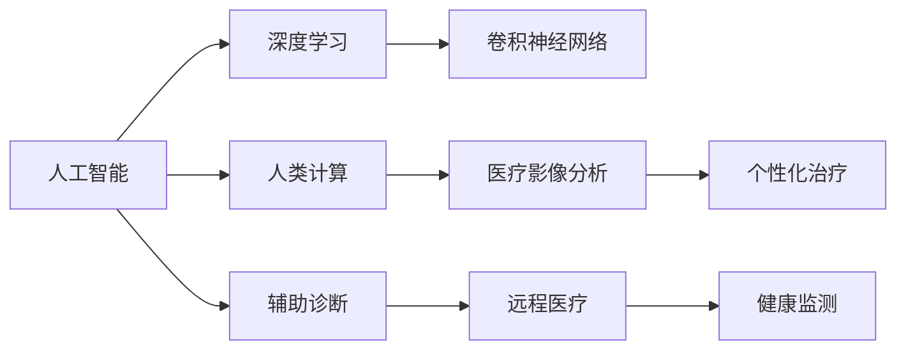

                 

# AI驱动的创新：人类计算在医疗行业的应用场景

> 关键词：人工智能,医疗数据,人类计算,疾病诊断,医疗影像分析,个性化治疗,辅助诊断,远程医疗,健康监测

## 1. 背景介绍

### 1.1 问题由来
随着科技的迅猛发展，人工智能（AI）技术正日益深刻地改变着各行各业。在医疗行业，AI的引入特别是基于深度学习的算法，如神经网络和卷积神经网络（CNN），正显著提升疾病的早期诊断、治疗方案优化、个性化治疗等方面的能力。然而，即便在AI技术的加持下，医疗行业的数字化进程仍面临诸多挑战，包括数据共享、隐私保护、模型可解释性、伦理问题等。在这样的背景下，“人类计算”的概念应运而生，它不仅强调计算资源的重要性，还着重强调了人的智慧和经验在AI辅助医疗决策中的不可替代性。本文将详细探讨人类计算在医疗行业中的应用场景，探讨如何结合AI和人类智慧，构建更为精准、高效的医疗服务体系。

### 1.2 问题核心关键点
人类计算的核心在于将AI的计算能力与人类的专业知识和经验相结合，形成一种新的医疗服务模式。这种模式通过AI辅助医疗决策，结合医生、护士等医疗从业者的判断和经验，最大限度地提升医疗服务的质量和效率。这种模式的应用场景主要包括疾病诊断、医疗影像分析、个性化治疗、辅助诊断、远程医疗和健康监测等。通过合理利用人类计算，AI不仅能够在处理海量医疗数据方面发挥优势，还能弥补其在临床判断、伦理决策等方面的不足。

## 2. 核心概念与联系

### 2.1 核心概念概述

为更好地理解人类计算在医疗行业中的应用，本节将介绍几个关键概念及其相互关系：

- **人工智能（AI）**：一种基于数据驱动的自动化决策过程，能够通过学习数据规律，实现智能化的决策和预测。
- **深度学习（DL）**：一种AI的分支，利用多层神经网络模拟人脑的神经元工作方式，用于处理复杂的数据结构和模式识别。
- **卷积神经网络（CNN）**：一种特殊的深度学习网络，擅长处理具有网格结构的图像和视频数据。
- **人类计算**：结合AI的计算能力和人类的专业知识和经验，通过共同协作的方式，提升医疗决策的精准性和效率。
- **医疗影像分析**：利用AI算法对医学影像进行自动检测、分类和标注，帮助医生快速做出诊断。
- **个性化治疗**：基于患者的基因、病史、生活习惯等多维数据，设计定制化的治疗方案。
- **辅助诊断**：AI辅助医生进行初步诊断，提供决策建议，帮助医生提升诊断的准确性和效率。
- **远程医疗**：通过AI技术实现医生和患者之间的远程互动，提升医疗服务的可及性和效率。
- **健康监测**：利用AI技术实时监测患者的生理指标和健康状况，提供预防和干预建议。

这些概念之间的逻辑关系可以通过以下Mermaid流程图来展示：



这个流程图展示了人工智能、深度学习、卷积神经网络等技术如何在大规模医疗数据上发挥作用，以及人类计算如何通过AI的计算能力和人类的专业知识，提升医疗服务的各个方面。

## 3. 核心算法原理 & 具体操作步骤
### 3.1 算法原理概述

人类计算在医疗行业的应用，本质上是一种结合AI和人类智慧的计算模式。其核心思想是通过AI算法处理海量医疗数据，提取出有价值的信息，然后结合医生的专业知识和经验，进行综合判断和决策。

以疾病诊断为例，人类计算可以遵循以下步骤：

1. **数据收集**：收集患者的病史、基因信息、实验室检查结果、医学影像等各类医疗数据。
2. **数据预处理**：清洗和标准化数据，去除噪声和异常值，确保数据质量。
3. **AI预分析**：利用深度学习算法（如CNN）对医学影像进行自动检测和分类，提取关键特征。
4. **医生介入**：医生结合AI的初步结果，进行进一步的诊断和分析，提出诊断意见。
5. **决策制定**：根据医生的诊断意见和AI的辅助结果，制定治疗方案。
6. **反馈学习**：根据治疗结果，对AI模型进行反馈学习，优化模型性能。

通过这样的流程，人类计算能够在保证诊断准确性的同时，提高医疗服务的效率和可及性。

### 3.2 算法步骤详解

下面以个性化治疗为例，详细介绍人类计算的具体操作步骤：

**Step 1: 数据收集**
- 收集患者的基因信息、病史、生活习惯等各类数据。

**Step 2: 数据预处理**
- 清洗和标准化数据，去除噪声和异常值。

**Step 3: AI预分析**
- 利用深度学习算法（如CNN）对基因数据进行分析，提取出关键基因特征。
- 结合病史和生活习惯数据，构建患者特征向量。

**Step 4: 医生介入**
- 医生结合AI的初步结果，进行进一步的诊断和分析，提出个性化治疗方案。

**Step 5: 决策制定**
- 根据医生的诊断意见和AI的辅助结果，制定详细的个性化治疗方案。

**Step 6: 反馈学习**
- 根据治疗结果，对AI模型进行反馈学习，优化模型性能。

### 3.3 算法优缺点

人类计算在医疗行业的应用具有以下优点：
1. 结合AI和人类智慧，提升诊断和治疗的精准性和效率。
2. 能够处理大规模医疗数据，挖掘隐藏在数据中的规律和信息。
3. 医生可以结合实际经验和专业知识，对AI的初步结果进行校正和优化。

同时，也存在一些缺点：
1. 对数据质量要求高，数据的完整性和准确性直接影响AI分析结果。
2. AI模型需要大量的标注数据进行训练，初期投资成本较高。
3. 医生的专业知识和经验可能与AI模型的输出结果存在冲突，需要额外的协调和沟通。
4. 数据隐私和安全问题需要特别注意，需要严格的数据保护措施。

### 3.4 算法应用领域

人类计算在医疗行业的应用非常广泛，以下是几个主要领域：

- **疾病诊断**：利用AI算法对医学影像、病历等数据进行自动分析，辅助医生进行诊断。
- **医疗影像分析**：通过深度学习算法对医学影像进行自动检测、分类和标注，帮助医生快速做出诊断。
- **个性化治疗**：结合患者的基因信息、病史和生活习惯，制定个性化的治疗方案。
- **辅助诊断**：AI辅助医生进行初步诊断，提供决策建议，提高诊断的准确性和效率。
- **远程医疗**：通过AI技术实现医生和患者之间的远程互动，提升医疗服务的可及性和效率。
- **健康监测**：利用AI技术实时监测患者的生理指标和健康状况，提供预防和干预建议。

这些领域的应用展示了人类计算在医疗行业中的巨大潜力，可以显著提升医疗服务的质量和效率。

## 4. 数学模型和公式 & 详细讲解 & 举例说明
### 4.1 数学模型构建

以下是一个简化的医疗影像分析模型的数学模型构建过程：

**输入**：患者的医学影像数据 $I$。

**目标**：通过卷积神经网络（CNN）对影像数据进行自动检测和分类，提取出关键特征 $F$。

**模型**：一个卷积神经网络模型 $M$，其输入为影像数据 $I$，输出为特征向量 $F$。

**损失函数**：均方误差（MSE）损失函数 $L$，用于衡量模型输出的特征向量与真实标签的差异。

**训练过程**：通过反向传播算法（Backpropagation）对模型进行训练，最小化损失函数 $L$。

### 4.2 公式推导过程

以一个简单的二分类问题为例，假设模型输出为 $F = (f_1, f_2)$，其中 $f_1$ 和 $f_2$ 分别表示正负样本的预测概率。模型输出的损失函数可以表示为：

$$
L = \frac{1}{2N} \sum_{i=1}^{N} \left( y_i - f_i \right)^2
$$

其中 $y_i$ 为真实标签，$f_i$ 为模型预测的概率，$N$ 为样本数量。

通过反向传播算法，计算损失函数对模型参数 $\theta$ 的梯度，更新模型参数：

$$
\theta \leftarrow \theta - \eta \nabla_{\theta}L
$$

其中 $\eta$ 为学习率，$\nabla_{\theta}L$ 为损失函数对模型参数 $\theta$ 的梯度。

### 4.3 案例分析与讲解

以肺部结节检测为例，深度学习模型可以利用卷积神经网络对肺部CT影像进行自动检测，提取出可能存在的结节区域。具体步骤如下：

1. **数据准备**：收集大量标注的肺部CT影像数据集，将其分为训练集和测试集。
2. **模型训练**：构建一个卷积神经网络模型，利用训练集对模型进行训练，最小化损失函数。
3. **模型评估**：在测试集上评估模型性能，计算准确率、召回率和F1分数等指标。
4. **医生介入**：医生结合AI的初步结果，进行进一步的诊断和分析，确认是否存在结节。
5. **决策制定**：根据医生的诊断意见和AI的辅助结果，制定治疗方案。

## 5. 项目实践：代码实例和详细解释说明
### 5.1 开发环境搭建

在进行人类计算实践前，我们需要准备好开发环境。以下是使用Python进行TensorFlow开发的环境配置流程：

1. 安装Anaconda：从官网下载并安装Anaconda，用于创建独立的Python环境。

2. 创建并激活虚拟环境：
```bash
conda create -n tf-env python=3.8 
conda activate tf-env
```

3. 安装TensorFlow：根据CUDA版本，从官网获取对应的安装命令。例如：
```bash
conda install tensorflow-gpu=2.7.0 -c conda-forge
```

4. 安装TensorBoard：用于实时监测模型训练状态，并提供丰富的图表呈现方式。

5. 安装Flask：用于构建Web应用，实现远程医疗服务。

完成上述步骤后，即可在`tf-env`环境中开始人类计算的实践。

### 5.2 源代码详细实现

下面以肺部结节检测为例，给出使用TensorFlow进行卷积神经网络模型训练的PyTorch代码实现。

```python
import tensorflow as tf
from tensorflow.keras import layers, models
from tensorflow.keras.losses import binary_crossentropy
from tensorflow.keras.optimizers import Adam

# 定义模型结构
model = models.Sequential()
model.add(layers.Conv2D(32, (3, 3), activation='relu', input_shape=(256, 256, 1)))
model.add(layers.MaxPooling2D((2, 2)))
model.add(layers.Conv2D(64, (3, 3), activation='relu'))
model.add(layers.MaxPooling2D((2, 2)))
model.add(layers.Flatten())
model.add(layers.Dense(64, activation='relu'))
model.add(layers.Dense(1, activation='sigmoid'))

# 编译模型
model.compile(optimizer=Adam(learning_rate=0.001), loss=binary_crossentropy, metrics=['accuracy'])

# 加载数据
train_data = ...
test_data = ...

# 训练模型
model.fit(train_data, epochs=10, validation_data=test_data)

# 评估模型
test_loss, test_accuracy = model.evaluate(test_data)

# 保存模型
model.save('lung_node_detection.h5')
```

以上就是使用TensorFlow进行肺部结节检测的完整代码实现。可以看到，TensorFlow提供了强大的计算图支持，使得深度学习模型的构建和训练变得非常简便。

### 5.3 代码解读与分析

让我们再详细解读一下关键代码的实现细节：

**模型结构**：
- `Sequential`模型：使用序列模型，按照顺序添加各个层。
- `Conv2D`层：卷积层，用于提取影像数据中的局部特征。
- `MaxPooling2D`层：池化层，用于降低特征图的维度。
- `Flatten`层：将二维特征图展平，变为一维向量。
- `Dense`层：全连接层，用于分类预测。

**模型编译**：
- `Adam`优化器：一种自适应学习率优化器，适合处理大规模数据集。
- `binary_crossentropy`损失函数：适用于二分类问题。
- `accuracy`指标：用于评估模型预测的准确性。

**数据加载**：
- `train_data`和`test_data`：加载训练集和测试集数据。

**模型训练**：
- `fit`方法：使用训练集对模型进行训练，最小化损失函数。
- `epochs`参数：训练轮数。
- `validation_data`参数：验证集数据。

**模型评估**：
- `evaluate`方法：在测试集上评估模型性能，计算损失和准确率。

**模型保存**：
- `save`方法：保存模型，便于后续加载和使用。

## 6. 实际应用场景

### 6.1 智能诊断
智能诊断是医疗行业中最常见的应用场景之一。通过AI算法对医学影像、病历等数据进行自动分析，辅助医生进行初步诊断。具体应用如下：

**Step 1: 数据收集**
- 收集患者的病历、医学影像等各类数据。

**Step 2: AI预分析**
- 利用深度学习算法对影像数据进行自动检测和分类，提取关键特征。

**Step 3: 医生介入**
- 医生结合AI的初步结果，进行进一步的诊断和分析，提出诊断意见。

**Step 4: 决策制定**
- 根据医生的诊断意见和AI的辅助结果，制定治疗方案。

**Step 5: 反馈学习**
- 根据治疗结果，对AI模型进行反馈学习，优化模型性能。

通过这样的流程，智能诊断系统能够在保证诊断准确性的同时，提高医疗服务的效率和可及性。

### 6.2 个性化治疗
个性化治疗是医疗行业中的另一重要应用场景。通过AI算法对患者的基因信息、病史和生活习惯进行分析，制定个性化的治疗方案。具体应用如下：

**Step 1: 数据收集**
- 收集患者的基因信息、病史、生活习惯等各类数据。

**Step 2: AI预分析**
- 利用深度学习算法对基因数据进行分析，提取出关键基因特征。

**Step 3: 医生介入**
- 医生结合AI的初步结果，进行进一步的诊断和分析，提出个性化治疗方案。

**Step 4: 决策制定**
- 根据医生的诊断意见和AI的辅助结果，制定详细的个性化治疗方案。

**Step 5: 反馈学习**
- 根据治疗结果，对AI模型进行反馈学习，优化模型性能。

通过这样的流程，个性化治疗系统能够根据患者的个体差异，制定最为合适的治疗方案，提升治疗效果。

### 6.3 辅助诊断
辅助诊断是通过AI算法对医学影像、病历等数据进行自动分析，辅助医生进行诊断。具体应用如下：

**Step 1: 数据收集**
- 收集患者的病历、医学影像等各类数据。

**Step 2: AI预分析**
- 利用深度学习算法对影像数据进行自动检测和分类，提取关键特征。

**Step 3: 医生介入**
- 医生结合AI的初步结果，进行进一步的诊断和分析，提出诊断意见。

**Step 4: 决策制定**
- 根据医生的诊断意见和AI的辅助结果，制定治疗方案。

**Step 5: 反馈学习**
- 根据治疗结果，对AI模型进行反馈学习，优化模型性能。

通过这样的流程，辅助诊断系统能够在医生的指导下，利用AI的计算能力，快速生成初步诊断结果，提高诊断效率。

### 6.4 远程医疗
远程医疗是通过AI技术实现医生和患者之间的远程互动，提升医疗服务的可及性和效率。具体应用如下：

**Step 1: 数据收集**
- 收集患者的病历、医学影像等各类数据。

**Step 2: AI预分析**
- 利用深度学习算法对影像数据进行自动检测和分类，提取关键特征。

**Step 3: 医生介入**
- 医生结合AI的初步结果，进行进一步的诊断和分析，提出诊断意见。

**Step 4: 决策制定**
- 根据医生的诊断意见和AI的辅助结果，制定治疗方案。

**Step 5: 反馈学习**
- 根据治疗结果，对AI模型进行反馈学习，优化模型性能。

通过这样的流程，远程医疗系统能够在医生和患者之间架起一座桥梁，实现远程会诊、在线咨询等功能，提升医疗服务的便捷性和效率。

### 6.5 健康监测
健康监测是通过AI技术实时监测患者的生理指标和健康状况，提供预防和干预建议。具体应用如下：

**Step 1: 数据收集**
- 收集患者的生理指标、生活习惯等各类数据。

**Step 2: AI预分析**
- 利用深度学习算法对生理指标进行分析，提取出关键特征。

**Step 3: 医生介入**
- 医生结合AI的初步结果，进行进一步的诊断和分析，提出预防和干预建议。

**Step 4: 决策制定**
- 根据医生的诊断意见和AI的辅助结果，制定健康监测计划。

**Step 5: 反馈学习**
- 根据监测结果，对AI模型进行反馈学习，优化模型性能。

通过这样的流程，健康监测系统能够实时监测患者的健康状况，提供个性化的预防和干预建议，提升患者的生活质量。

## 7. 工具和资源推荐
### 7.1 学习资源推荐

为了帮助开发者系统掌握人类计算在医疗行业中的应用，这里推荐一些优质的学习资源：

1. 《深度学习在医疗中的应用》系列博文：由深度学习专家撰写，详细介绍了深度学习在医疗领域的应用案例和技术要点。

2. 《医学影像处理与分析》课程：由斯坦福大学开设的深度学习课程，涵盖医学影像处理的基本概念和深度学习算法。

3. 《个性化医疗》书籍：详细介绍了个性化医疗的基本概念和实践方法，包括基因组学、临床决策等。

4. TensorFlow官方文档：TensorFlow的官方文档，提供了全面的API文档和示例代码，是学习TensorFlow的重要资料。

5. Kaggle医疗数据集：Kaggle平台上的医疗数据集，包含大量医疗影像、病历等数据，用于深度学习模型训练和验证。

通过对这些资源的学习实践，相信你一定能够快速掌握人类计算在医疗行业中的应用，并用于解决实际的医疗问题。

### 7.2 开发工具推荐

高效的开发离不开优秀的工具支持。以下是几款用于人类计算在医疗行业开发的常用工具：

1. TensorFlow：基于Python的开源深度学习框架，灵活动态的计算图，适合快速迭代研究。

2. PyTorch：基于Python的开源深度学习框架，灵活易用，广泛应用于学术研究和工业应用。

3. TensorBoard：TensorFlow配套的可视化工具，可实时监测模型训练状态，并提供丰富的图表呈现方式。

4. Flask：用于构建Web应用，实现远程医疗服务。

5. Jupyter Notebook：用于编写和共享研究代码，支持多语言编程和数据可视化。

6. Kaggle：数据科学竞赛平台，提供大量医疗数据集和开源代码，适合数据驱动的研究。

合理利用这些工具，可以显著提升人类计算在医疗行业的开发效率，加快创新迭代的步伐。

### 7.3 相关论文推荐

人类计算在医疗行业的发展源于学界的持续研究。以下是几篇奠基性的相关论文，推荐阅读：

1. "Deep Learning for Medical Image Analysis: A Review"：对深度学习在医疗影像分析中的应用进行综述，总结了最新的研究成果和应用场景。

2. "Personalized Medicine via Deep Learning"：介绍了深度学习在个性化医疗中的应用，探讨了如何通过基因组学数据构建个性化的治疗方案。

3. "A Survey on Deep Learning for Healthcare"：对深度学习在医疗领域的应用进行综述，涵盖了疾病诊断、健康监测等多个方面。

4. "AI for Remote Healthcare: A Survey"：对AI在远程医疗中的应用进行综述，总结了当前的研究进展和未来趋势。

5. "Healthcare Data Integration: A Survey"：对医疗数据集成和共享技术进行综述，探讨了数据集成对AI医疗应用的重要性。

这些论文代表了大规模医疗数据应用的研究方向，通过学习这些前沿成果，可以帮助研究者把握学科前进方向，激发更多的创新灵感。

## 8. 总结：未来发展趋势与挑战
### 8.1 总结

本文对人类计算在医疗行业中的应用进行了全面系统的介绍。首先阐述了人类计算的概念及其在医疗行业中的重要性和应用场景，明确了人类计算与AI结合的优势和潜力。其次，从原理到实践，详细讲解了人类计算在医疗行业中的实现步骤，给出了人类计算任务开发的完整代码实例。同时，本文还广泛探讨了人类计算在智能诊断、个性化治疗、辅助诊断、远程医疗和健康监测等多个医疗领域的实际应用，展示了人类计算在医疗服务中的巨大潜力。此外，本文精选了人类计算在医疗行业的应用资源，力求为读者提供全方位的技术指引。

通过本文的系统梳理，可以看到，人类计算结合AI在医疗行业中的应用前景广阔，能够在保证诊断和治疗效果的同时，提升医疗服务的效率和可及性。未来，伴随技术的不断演进和应用场景的拓展，人类计算必将在医疗行业中发挥更加重要的作用，为人类健康事业贡献力量。

### 8.2 未来发展趋势

展望未来，人类计算在医疗行业的发展趋势如下：

1. 数据融合与集成：医疗数据来源多样，数据集成是提升AI性能的关键。未来，人类计算将进一步推进数据融合与集成，实现多源数据的协同分析。

2. 模型可解释性：AI模型的不透明性是医疗行业的一大挑战。未来，人类计算将更加注重模型的可解释性，确保医生能够理解和信任模型的诊断结果。

3. 个性化与定制化：个性化医疗是医疗行业的发展方向。未来，人类计算将通过结合更多个体差异数据，实现更为精准的个性化治疗方案。

4. 实时性与交互性：远程医疗和健康监测需要实时响应和交互。未来，人类计算将致力于提升系统的实时性和交互性，提升用户体验。

5. 伦理与安全：医疗数据的隐私和安全是重要问题。未来，人类计算将更加注重数据保护和隐私安全，确保医疗数据的安全使用。

6. 跨学科融合：医疗领域涉及多学科知识。未来，人类计算将更加注重跨学科融合，推动AI与临床医学、数据科学等多领域的协同发展。

以上趋势凸显了人类计算在医疗行业中的广阔前景，未来的研究将在数据融合、模型可解释性、个性化治疗等方面进行更深入的探索。

### 8.3 面临的挑战

尽管人类计算在医疗行业的应用前景广阔，但在迈向更加智能化、普适化应用的过程中，它仍面临着诸多挑战：

1. 数据质量与多样性：医疗数据的来源多样，质量参差不齐，数据的完整性和准确性直接影响AI分析结果。需要进一步提升数据质量和多样性，以应对复杂多变的临床场景。

2. 技术成熟度：AI模型需要大量的标注数据进行训练，初期投资成本较高。需要进一步提升AI技术的成熟度，降低模型训练成本。

3. 医生的接受度：AI模型在医疗中的应用需要医生的信任和支持。需要进一步提升医生的技术接受度，帮助医生更好地理解和使用AI技术。

4. 伦理与安全问题：医疗数据的隐私和安全是重要问题。需要进一步加强数据保护和隐私安全，确保医疗数据的安全使用。

5. 跨学科协作：医疗领域涉及多学科知识，需要跨学科协作。需要进一步提升跨学科协作能力，推动AI与临床医学、数据科学等多领域的协同发展。

6. 技术整合：人类计算需要与现有医疗系统进行整合，提升系统的兼容性。需要进一步提升技术整合能力，确保系统的稳定性和可靠性。

正视人类计算在医疗行业中所面临的挑战，积极应对并寻求突破，将是大规模医疗数据应用的重要保障。相信随着学界和产业界的共同努力，这些挑战终将一一被克服，人类计算必将在医疗行业中发挥更大的作用。

### 8.4 研究展望

面向未来，人类计算在医疗行业的研究方向主要包括以下几个方面：

1. 无监督学习：利用无监督学习技术处理医疗数据，减少对标注数据的依赖，提升数据融合与集成的效果。

2. 跨模态学习：结合多种模态数据（如图像、文本、语音等），提升模型的泛化能力和鲁棒性。

3. 多任务学习：利用多任务学习技术，提升模型的任务适应性和迁移学习能力。

4. 迁移学习：利用迁移学习技术，将预训练模型应用于不同的医疗任务，提升模型的泛化能力。

5. 模型压缩与优化：通过模型压缩与优化技术，提升模型的计算效率和推理速度，优化系统的资源使用。

6. 模型解释与可信性：通过解释模型的工作机制和决策逻辑，增强模型的可信性和可解释性，确保医生能够理解和信任模型的诊断结果。

这些研究方向的研究突破，将进一步推动人类计算在医疗行业的应用，为构建智能、高效、可信赖的医疗系统奠定坚实基础。

## 9. 附录：常见问题与解答

**Q1：人类计算是否适用于所有医疗任务？**

A: 人类计算在医疗行业中的应用，主要适用于数据量大、计算复杂、对医生专业知识和经验依赖较高的任务，如智能诊断、个性化治疗、辅助诊断等。对于一些数据量小、计算简单、对医生依赖较少的任务，如简单的药物推荐、健康教育等，人类计算的优势可能不明显。

**Q2：如何处理医疗数据的质量和多样性问题？**

A: 医疗数据的质量和多样性问题需要通过多种方法进行解决，如数据清洗、数据标准化、数据融合等。具体措施包括：
1. 数据清洗：去除数据中的噪声和异常值，确保数据质量。
2. 数据标准化：对不同来源的数据进行标准化处理，统一数据格式和单位。
3. 数据融合：通过多源数据融合技术，整合不同数据源的数据，提升数据的多样性和完整性。

**Q3：医生如何理解和使用AI模型？**

A: 医生理解和使用AI模型需要以下几个步骤：
1. 培训教育：对医生进行AI技术的培训，使其掌握基本概念和使用方法。
2. 辅助决策：AI模型提供初步诊断和分析结果，辅助医生进行决策。
3. 反馈学习：医生根据治疗结果，对AI模型进行反馈学习，优化模型性能。
4. 共同协作：医生与AI模型进行共同协作，提升诊断和治疗的准确性和效率。

通过这样的流程，医生能够更好地理解和信任AI模型，提高AI在医疗行业中的应用效果。

**Q4：如何确保医疗数据的隐私和安全？**

A: 医疗数据的隐私和安全问题需要采取多种措施进行保护，如数据加密、访问控制、匿名化等。具体措施包括：
1. 数据加密：对医疗数据进行加密处理，确保数据传输和存储的安全性。
2. 访问控制：严格控制医疗数据的访问权限，确保数据只能被授权用户访问。
3. 匿名化：对医疗数据进行匿名化处理，保护患者的隐私。

通过这些措施，可以有效保护医疗数据的隐私和安全，确保数据的安全使用。

**Q5：如何提升AI模型的可解释性？**

A: 提升AI模型的可解释性需要从多个方面入手：
1. 模型设计：在设计模型时，采用可解释性较高的模型架构，如决策树、线性回归等。
2. 特征工程：通过特征工程，提取有意义的特征，提高模型的可解释性。
3. 解释工具：使用模型解释工具，如LIME、SHAP等，分析模型的决策过程，提供可视化解释。
4. 专家知识：结合领域专家的知识和经验，对模型进行解释和校正，提高模型的可信性。

通过这些措施，可以提升AI模型的可解释性，确保医生能够理解和信任模型的诊断结果。

---

作者：禅与计算机程序设计艺术 / Zen and the Art of Computer Programming

