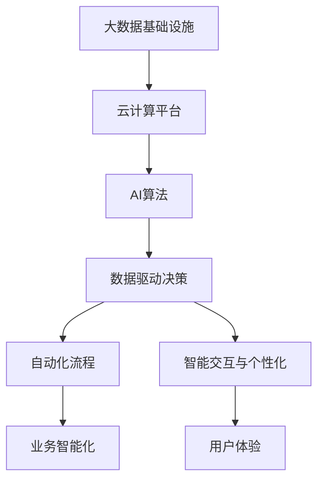

                 

# AI驱动的创新：人类计算在商业中的未来发展

> 关键词：AI驱动, 人类计算, 商业创新, 自动化, 人工智能, 计算效率, 业务智能化

## 1. 背景介绍

### 1.1 问题由来

进入21世纪以来，信息技术的飞速发展极大地推动了各行各业的变革，计算机和网络技术已成为现代商业的基础设施。但随着数据的爆炸性增长和业务复杂度的提升，传统的计算模式已经难以应对日益增长的计算需求。如何在不牺牲业务效益的前提下，提升计算效率和智能化水平，成为当今商业领域的重要课题。

人工智能（AI）技术，特别是深度学习、机器学习和自然语言处理（NLP）等领域的突破，为商业计算带来了新的希望。AI驱动的创新不仅能显著提高计算效率，还能释放人类计算潜力，开辟商业智能化新路径。本文将探讨AI在商业计算中的关键应用，分析其优势与局限，并展望未来的发展趋势。

### 1.2 问题核心关键点

AI驱动的商业计算，通过利用先进算法和大规模数据，实现自动化和智能化的计算过程。这一范式的核心关键点包括：

- AI技术应用：深度学习、机器学习、计算机视觉、自然语言处理等前沿技术，被广泛应用于商业数据分析、自动化决策、智能推荐等领域。
- 数据驱动决策：商业计算的决策过程基于大量实时数据，通过AI算法进行高效分析和预测，实现数据驱动的智能决策。
- 自动化流程：AI系统可以自动完成数据采集、处理、分析和报告，极大提高了工作效率，减少了人工干预。
- 智能交互与个性化：通过NLP等技术，AI系统能够进行智能对话、个性化推荐，提供更贴合用户需求的服务。

这些关键点展示了AI驱动商业计算的多样化和高效化优势，但同时也带来算法复杂性增加、数据隐私和伦理问题等挑战。

### 1.3 问题研究意义

研究AI在商业计算中的应用，对于提升企业竞争力、推动商业智能化转型、构建数据驱动的商业生态具有重要意义：

1. **提升效率和效益**：AI技术可以自动化处理大量繁琐的任务，提高业务效率，降低成本，从而提升企业的整体效益。
2. **增强决策科学性**：数据驱动的智能决策系统能提供精准的预测和分析，辅助管理层做出更科学合理的决策。
3. **开拓新业务模式**：AI驱动的商业计算为新兴业务模式提供了技术基础，如智能客服、智能投顾、智能制造等。
4. **优化客户体验**：AI系统能够根据用户行为和偏好提供个性化服务，提升用户体验和满意度。
5. **构建竞争优势**：掌握先进的AI技术，可以帮助企业在激烈的市场竞争中占据有利地位，实现快速响应市场变化。

## 2. 核心概念与联系

### 2.1 核心概念概述

为了更好地理解AI在商业计算中的应用，本节将介绍几个核心概念：

- **人工智能**：通过模拟人类智能，实现对复杂问题进行自动化处理的技术，包括机器学习、深度学习、自然语言处理等。
- **数据驱动决策**：利用大数据和AI技术，从海量数据中提取有用信息，辅助决策者进行科学决策。
- **自动化流程**：通过AI技术，实现业务流程的自动化，减少人工干预，提升工作效率。
- **智能交互与个性化**：利用NLP等技术，构建智能客服、推荐系统等，提供个性化、高效的用户服务。

这些概念之间存在紧密联系，共同构成了AI驱动商业计算的基本框架：

1. **基础架构**：大数据、云计算等基础设施为AI技术的实现提供了支持。
2. **算法与模型**：深度学习、自然语言处理等算法是大数据处理和决策分析的基础。
3. **应用场景**：自动化流程、智能推荐、智能客服等应用场景，是AI技术的具体落地。
4. **用户体验**：智能交互与个性化，通过AI技术提升用户满意度和体验。

### 2.2 核心概念原理和架构的 Mermaid 流程图



这个流程图展示了AI在商业计算中的基本流程：

1. 数据基础设施为AI技术的运行提供支撑。
2. AI算法处理海量数据，进行数据分析和模式识别。
3. 数据驱动的决策支持系统，辅助业务决策。
4. 自动化流程实现业务高效处理。
5. 智能交互与个性化提升用户体验。
6. 业务智能化促进企业全面转型。
7. 最终实现用户体验的全面提升。

## 3. 核心算法原理 & 具体操作步骤

### 3.1 算法原理概述

AI驱动的商业计算，本质上是一个数据驱动、算法驱动的自动化决策过程。其核心算法包括深度学习、自然语言处理、计算机视觉等。以深度学习为例，其基本原理是通过多层神经网络，对数据进行非线性映射和特征提取，从而实现对复杂问题的自动处理。

在商业计算中，深度学习常用于以下场景：

- **预测分析**：利用历史数据，进行销售预测、客户行为预测等。
- **图像识别**：通过图像识别技术，实现产品检测、质量控制等。
- **自然语言处理**：处理文本数据，进行情感分析、智能客服等。
- **推荐系统**：基于用户行为数据，进行个性化推荐。

### 3.2 算法步骤详解

AI驱动的商业计算一般包括以下几个关键步骤：

**Step 1: 数据收集与预处理**
- 收集企业内部的业务数据和外部市场数据。
- 对数据进行清洗、归一化、特征工程等预处理操作。

**Step 2: 数据建模**
- 选择合适的模型，如线性回归、随机森林、神经网络等。
- 在模型中引入AI算法，如深度学习、强化学习等。
- 进行超参数调优，选择最优模型参数。

**Step 3: 模型训练与评估**
- 使用训练集对模型进行训练，通过迭代优化提高模型性能。
- 在验证集上评估模型性能，防止过拟合。
- 根据评估结果调整模型参数，提高模型泛化能力。

**Step 4: 应用部署**
- 将训练好的模型部署到实际应用中。
- 集成到业务系统，实现自动化决策和智能化服务。
- 持续监测模型性能，根据新数据进行模型更新。

### 3.3 算法优缺点

AI驱动的商业计算具有以下优点：

1. **高效性**：AI算法可以处理大量数据，自动提取数据特征，提升计算效率。
2. **智能化**：AI系统能够进行智能决策，优化业务流程，提升用户体验。
3. **灵活性**：AI技术可以适应各种业务场景，灵活应用在自动化、推荐、客服等领域。
4. **动态性**：AI系统能够根据实时数据进行动态调整，适应市场变化。

同时，该方法也存在一些缺点：

1. **算法复杂性**：AI算法复杂，实现难度大，需要专业人才进行开发和维护。
2. **数据依赖**：AI系统依赖高质量的数据，数据获取和预处理难度大。
3. **透明度不足**：AI模型的决策过程不透明，难以解释和调试。
4. **技术门槛高**：实现AI驱动的商业计算需要一定的技术门槛，对中小企业而言可能成本较高。
5. **伦理风险**：AI系统可能存在偏见、歧视等问题，需要加强伦理监管。

### 3.4 算法应用领域

AI驱动的商业计算已经广泛应用于多个领域，例如：

- **金融科技**：用于股票交易、风险评估、客户服务、智能投顾等。
- **电子商务**：用于客户行为分析、推荐系统、反欺诈检测等。
- **制造业**：用于生产过程优化、质量控制、设备维护等。
- **物流与供应链**：用于货物追踪、仓储优化、配送路径规划等。
- **医疗健康**：用于患者数据分析、疾病预测、智能诊断等。

## 4. 数学模型和公式 & 详细讲解 & 举例说明

### 4.1 数学模型构建

在本节中，我们将使用数学语言对AI驱动的商业计算进行更严格的刻画。

设企业内部和外部数据集分别为 $D_{in}$ 和 $D_{out}$，模型为 $f(x)$，其中 $x \in \mathcal{X}$ 为输入，$\mathcal{X}$ 为特征空间。

目标函数为最小化预测误差：

$$
\min_{f} \frac{1}{N} \sum_{i=1}^N (y_i - f(x_i))^2
$$

其中 $y_i$ 为真实标签，$f(x_i)$ 为模型预测输出。

### 4.2 公式推导过程

以线性回归为例，其基本公式为：

$$
y = \theta_0 + \theta_1 x_1 + \theta_2 x_2 + \cdots + \theta_n x_n
$$

其中 $\theta_0, \theta_1, \ldots, \theta_n$ 为模型参数。

最小二乘法的优化目标为：

$$
\min_{\theta} \frac{1}{2N} \sum_{i=1}^N (y_i - f(x_i))^2
$$

通过求导，得到参数更新公式：

$$
\theta_j = \theta_j - \frac{\alpha}{N} \sum_{i=1}^N (y_i - f(x_i)) x_{ij}
$$

其中 $\alpha$ 为学习率，$x_{ij}$ 为第 $i$ 个样本的第 $j$ 个特征。

### 4.3 案例分析与讲解

以推荐系统为例，假设模型根据用户历史行为数据进行推荐，基本模型为：

$$
y = \sum_{i=1}^n \theta_i x_i
$$

其中 $y$ 为推荐商品，$x_i$ 为用户行为数据，$\theta_i$ 为模型参数。

通过梯度下降优化，不断调整参数 $\theta$，使得预测值与真实值之间的误差最小化。最终，模型可以基于用户行为数据，实时生成推荐结果。

## 5. 项目实践：代码实例和详细解释说明

### 5.1 开发环境搭建

在进行AI驱动的商业计算实践前，我们需要准备好开发环境。以下是使用Python进行TensorFlow和PyTorch开发的环境配置流程：

1. 安装Anaconda：从官网下载并安装Anaconda，用于创建独立的Python环境。

2. 创建并激活虚拟环境：
```bash
conda create -n ai-env python=3.8 
conda activate ai-env
```

3. 安装TensorFlow和PyTorch：
```bash
pip install tensorflow==2.6
pip install torch==1.11
```

4. 安装各类工具包：
```bash
pip install numpy pandas scikit-learn matplotlib tqdm jupyter notebook ipython
```

完成上述步骤后，即可在`ai-env`环境中开始AI驱动商业计算的实践。

### 5.2 源代码详细实现

下面以推荐系统为例，给出使用TensorFlow和PyTorch对深度学习模型进行商业计算的PyTorch代码实现。

首先，定义推荐系统数据处理函数：

```python
import pandas as pd
import tensorflow as tf

def load_data():
    data = pd.read_csv('recommendation_data.csv')
    return data

def preprocess_data(data):
    features = data[['feature_1', 'feature_2', 'feature_3']]
    labels = data['label']
    return features, labels

features, labels = preprocess_data(load_data())
```

然后，定义模型和优化器：

```python
from transformers import TFAutoModelForSequenceClassification

model = TFAutoModelForSequenceClassification.from_pretrained('bert-base-uncased', num_labels=num_labels)

optimizer = tf.keras.optimizers.Adam(learning_rate=0.001)
```

接着，定义训练和评估函数：

```python
from sklearn.model_selection import train_test_split

features_train, features_test, labels_train, labels_test = train_test_split(features, labels, test_size=0.2)

def train_model(model, features_train, labels_train, features_test, labels_test):
    model.compile(optimizer=optimizer, loss='binary_crossentropy', metrics=['accuracy'])
    model.fit(features_train, labels_train, epochs=10, batch_size=32, validation_data=((features_test, labels_test),))
    return model

model = train_model(model, features_train, labels_train, features_test, labels_test)
```

最后，启动训练流程并在测试集上评估：

```python
print('Model Accuracy:', model.evaluate(features_test, labels_test)[1])
```

以上就是使用TensorFlow和PyTorch对推荐系统进行商业计算的完整代码实现。可以看到，得益于TensorFlow和PyTorch的强大封装，我们可以用相对简洁的代码完成商业计算模型的构建和微调。

### 5.3 代码解读与分析

让我们再详细解读一下关键代码的实现细节：

**load_data函数**：
- 加载数据集，假定数据存储在CSV文件中。

**preprocess_data函数**：
- 数据预处理，提取特征和标签。

**train_model函数**：
- 使用TensorFlow和PyTorch的高级API进行模型定义和训练。
- 编译模型，定义优化器和损失函数。
- 使用训练集进行模型训练，并在验证集上进行评估。
- 返回训练好的模型。

**训练流程**：
- 定义训练集和测试集，使用train_test_split函数进行划分。
- 调用train_model函数进行模型训练。
- 在测试集上评估模型性能，输出准确率。

可以看到，TensorFlow和PyTorch的结合使用，极大简化了模型构建和训练的复杂度，使得开发者可以将更多精力放在数据处理和模型优化上。

当然，工业级的系统实现还需考虑更多因素，如模型的保存和部署、超参数的自动搜索、更灵活的任务适配层等。但核心的商业计算流程基本与此类似。

## 6. 实际应用场景

### 6.1 智能客服系统

AI驱动的智能客服系统，能够提供24/7不间断的服务，提升客户体验和满意度。传统客服需要大量人力，高峰期响应缓慢，且一致性和专业性难以保证。智能客服系统基于深度学习和大规模语料预训练的模型，能够理解自然语言，自动匹配常见问题和标准回答，处理复杂咨询，提升客户问题解决效率。

在技术实现上，可以收集企业内部的历史客服对话记录，将问题和最佳答复构建成监督数据，在此基础上对预训练模型进行微调。微调后的模型能够自动理解用户意图，匹配最合适的答案模板进行回复。对于客户提出的新问题，还可以接入检索系统实时搜索相关内容，动态组织生成回答。如此构建的智能客服系统，能大幅提升客户咨询体验和问题解决效率。

### 6.2 智能投顾系统

智能投顾系统是AI驱动的商业计算在金融领域的重要应用。传统的投资顾问依赖于分析师的经验和市场分析，耗时长、成本高，且容易受分析师主观因素影响。而智能投顾系统基于深度学习和数据分析，能够实时监测市场变化，分析用户投资偏好，提供个性化的投资建议。

在技术实现上，可以收集用户历史投资数据和行为数据，利用机器学习模型进行分析，生成推荐投资组合。同时，通过NLP技术，用户可以与系统进行自然语言交互，获取定制化的投资咨询和分析报告。智能投顾系统能够提供全天候、无间断的投资咨询服务，极大提升了用户的投资体验。

### 6.3 智能制造

智能制造是AI驱动的商业计算在工业领域的典型应用。传统的制造业依赖人工和半自动化流程，生产效率低下，品质控制困难。智能制造系统通过物联网设备和传感器数据，利用深度学习和大数据分析，实现生产过程的智能化管理。

在技术实现上，可以收集生产设备的数据和工艺参数，进行实时监控和预测维护。利用深度学习模型，系统能够预测设备故障，提前进行维护，减少停机时间。同时，通过NLP技术，系统可以与操作人员进行自然语言交互，提供实时的生产指导和故障诊断。智能制造系统能够显著提升生产效率和品质控制水平，降低运营成本。

### 6.4 未来应用展望

随着AI技术的不断进步，AI驱动的商业计算将在更多领域得到应用，为传统行业带来变革性影响。

- **智慧医疗**：基于深度学习和大数据分析，智能医疗系统能够进行疾病预测、智能诊断、药物推荐等，辅助医生诊疗，提升医疗服务效率和质量。
- **智能教育**：AI系统能够根据学生学习行为数据，提供个性化的学习推荐和智能辅导，提升教育效果和公平性。
- **智慧城市**：智能城市管理系统基于大数据和AI技术，实现交通流量预测、智能调度、环境监测等功能，提升城市治理水平。
- **金融科技**：智能投顾、风险评估、反欺诈检测等应用，极大地提升了金融服务的智能化水平，降低了金融风险。

此外，AI驱动的商业计算还将与物联网、区块链等技术深度融合，形成更加全面、智能的新一代数字基础设施。相信随着技术的日益成熟，AI驱动的商业计算必将在更广阔的领域发挥重要作用，推动社会全面进步。

## 7. 工具和资源推荐

### 7.1 学习资源推荐

为了帮助开发者系统掌握AI驱动商业计算的理论基础和实践技巧，这里推荐一些优质的学习资源：

1. **《深度学习》课程**：斯坦福大学开设的深度学习课程，提供了丰富的理论基础和实战案例，适合初学者和进阶者学习。
2. **TensorFlow官方文档**：TensorFlow的官方文档，提供了详尽的API文档和代码示例，是学习TensorFlow不可或缺的资料。
3. **PyTorch官方文档**：PyTorch的官方文档，提供了丰富的教程和示例，适合新手和专业开发者。
4. **Coursera深度学习专项课程**：Coursera提供的深度学习专项课程，涵盖深度学习、机器学习、计算机视觉等多个领域，适合系统学习。
5. **Kaggle数据科学竞赛平台**：Kaggle提供了丰富的数据集和竞赛，通过实践积累经验，提升实战能力。

通过对这些资源的学习实践，相信你一定能够快速掌握AI驱动商业计算的精髓，并用于解决实际的商业问题。

### 7.2 开发工具推荐

高效的开发离不开优秀的工具支持。以下是几款用于AI驱动商业计算开发的常用工具：

1. **TensorFlow**：由Google主导开发的深度学习框架，功能强大，适用于大规模生产部署。
2. **PyTorch**：Facebook开发的深度学习框架，灵活便捷，适合研究和原型开发。
3. **H2O.ai**：提供了基于AI的机器学习平台，适合快速构建和部署AI模型。
4. **DataRobot**：提供了自动化机器学习平台，适合大规模数据处理和模型优化。
5. **RapidMiner**：提供了商业智能和数据科学平台，适合数据分析和建模。

合理利用这些工具，可以显著提升AI驱动商业计算的开发效率，加快创新迭代的步伐。

### 7.3 相关论文推荐

AI驱动的商业计算的发展源于学界的持续研究。以下是几篇奠基性的相关论文，推荐阅读：

1. **Deep Learning for Financial Services**：提出深度学习在金融领域的应用，包括股票预测、风险评估、客户行为分析等。
2. **Reinforcement Learning in Robotics**：介绍强化学习在机器人领域的应用，包括智能决策和路径规划。
3. **Sequence to Sequence Learning with Neural Networks**：提出序列到序列的学习方法，实现自然语言处理和机器翻译等任务。
4. **A Survey on Deep Learning for Computer Vision**：综述深度学习在计算机视觉领域的应用，包括图像识别、目标检测等。
5. **Natural Language Processing with Deep Learning**：综述深度学习在自然语言处理领域的应用，包括语言模型、文本分类等。

这些论文代表了大数据和AI技术的发展脉络，通过学习这些前沿成果，可以帮助研究者把握学科前进方向，激发更多的创新灵感。

## 8. 总结：未来发展趋势与挑战

### 8.1 总结

本文对AI驱动的商业计算进行了全面系统的介绍。首先阐述了AI技术在商业计算中的重要应用，明确了AI驱动计算在提升效率、增强决策科学性、优化业务流程等方面的独特价值。其次，从原理到实践，详细讲解了AI驱动商业计算的数学模型和具体操作步骤，给出了商业计算任务的完整代码实例。同时，本文还广泛探讨了AI驱动计算在智能客服、智能投顾、智能制造等多个行业领域的应用前景，展示了AI驱动计算的广阔前景。此外，本文精选了AI驱动计算的相关学习资源，力求为读者提供全方位的技术指引。

通过本文的系统梳理，可以看到，AI驱动的商业计算正在成为商业智能化转型的重要工具，极大地提升了企业的计算效率和智能化水平，为各行各业带来了新的发展机遇。未来，伴随AI技术的不断进步，AI驱动的商业计算必将在更多领域得到应用，推动商业智能化的全面升级。

### 8.2 未来发展趋势

展望未来，AI驱动的商业计算将呈现以下几个发展趋势：

1. **计算效率持续提升**：随着硬件技术的进步，AI驱动的商业计算将实现更高效率、更低延迟，进一步提升企业计算能力。
2. **业务场景深度拓展**：AI驱动的商业计算将深入到更多的垂直领域，如医疗、教育、城市治理等，带来全面智能化转型。
3. **跨领域知识融合**：AI驱动的商业计算将与其他前沿技术如物联网、区块链深度融合，构建更加全面、智能的新一代数字基础设施。
4. **个性化和智能化服务**：基于AI的个性化推荐、智能客服等应用将大幅提升用户体验，推动客户满意度和忠诚度的提升。
5. **动态智能决策**：AI系统将能够实时监测市场变化，进行动态智能决策，提升企业的反应速度和竞争优势。
6. **数据安全和隐私保护**：随着AI系统的广泛应用，数据安全和隐私保护将成为重要课题，需要引入更严格的安全监管机制。

以上趋势凸显了AI驱动商业计算的广阔前景，这些方向的探索发展，必将进一步提升企业的计算效率和智能化水平，为各行各业带来新的变革。

### 8.3 面临的挑战

尽管AI驱动的商业计算已经取得了瞩目成就，但在迈向更加智能化、普适化应用的过程中，它仍面临诸多挑战：

1. **算法复杂性增加**：AI系统的复杂性不断提升，需要更多的技术资源和专业知识进行开发和维护。
2. **数据依赖和获取难度**：高质量的数据获取和预处理是AI系统的基础，但数据获取和处理难度大。
3. **透明性和可解释性不足**：AI系统的决策过程不透明，难以解释和调试，缺乏信任感。
4. **伦理和法律问题**：AI系统可能存在偏见、歧视等问题，需要加强伦理和法律监管。
5. **技术门槛和成本高**：AI驱动的商业计算需要较高的技术门槛和成本，中小企业难以负担。
6. **安全性和隐私保护**：AI系统的安全性和隐私保护问题亟待解决，需要引入更严格的安全和隐私保护机制。

正视这些挑战，积极应对并寻求突破，将是大数据和AI技术走向成熟的必由之路。

### 8.4 研究展望

面对AI驱动商业计算所面临的种种挑战，未来的研究需要在以下几个方面寻求新的突破：

1. **自动化和自动化工程**：开发更高效、易维护的自动化工具和平台，降低技术门槛，提高开发效率。
2. **轻量化和边缘计算**：研究轻量级模型和边缘计算技术，实现AI驱动商业计算在低延迟、高可靠性的场景下应用。
3. **多模态数据融合**：研究跨模态数据的融合技术，提升AI系统的综合能力和适应性。
4. **知识图谱和符号推理**：将知识图谱和符号推理技术引入AI系统，增强其逻辑推理和知识迁移能力。
5. **联邦学习和隐私保护**：研究联邦学习等隐私保护技术，确保数据安全和用户隐私。
6. **伦理和法律规范**：制定伦理和法律规范，确保AI系统的公平性、透明性和可解释性，避免偏见和歧视。

这些研究方向的探索，必将引领AI驱动商业计算技术迈向更高的台阶，为各行各业带来新的变革和机遇。面向未来，AI驱动商业计算需要在技术创新、业务应用、伦理规范等多个方面协同发力，共同推动人工智能技术在商业领域的全面落地。

## 9. 附录：常见问题与解答

**Q1：如何降低AI驱动商业计算的技术门槛？**

A: 降低技术门槛可以从以下几个方面入手：
1. **开源工具和平台**：使用TensorFlow、PyTorch等开源工具，可以快速构建和部署AI模型。
2. **自动化和简化工具**：引入自动化工具和平台，如AutoML、AutoTune等，简化模型开发和优化过程。
3. **云计算和边缘计算**：利用云计算和边缘计算技术，降低本地计算和存储成本。
4. **可视化工具**：使用可视化工具如TensorBoard、Jupyter Notebook等，提升模型开发和调试效率。
5. **社区和培训资源**：参与AI社区和培训课程，获取更多学习资源和经验分享。

通过以上措施，可以有效降低AI驱动商业计算的技术门槛，让更多企业和开发者能够轻松上手。

**Q2：如何提高AI驱动商业计算的透明性和可解释性？**

A: 提高AI系统的透明性和可解释性可以从以下几个方面入手：
1. **可解释性算法**：选择可解释性较强的算法，如决策树、线性模型等。
2. **特征工程和解释**：对模型进行特征工程，解释每个特征对结果的影响。
3. **可视化工具**：使用可视化工具如LIME、SHAP等，展示模型的决策过程和特征重要性。
4. **模型解释**：在模型训练和推理过程中，记录模型的决策路径和中间结果，进行事后解释。
5. **透明度标准**：制定透明度标准和规范，确保AI系统的决策过程透明和可解释。

通过以上措施，可以有效提升AI系统的透明性和可解释性，增强用户信任感和系统可靠性。

**Q3：如何在AI驱动商业计算中保护数据隐私和安全？**

A: 保护数据隐私和安全可以从以下几个方面入手：
1. **数据匿名化**：对数据进行匿名化处理，防止数据泄露和滥用。
2. **加密传输**：使用加密技术，保护数据在传输过程中的安全性。
3. **访问控制**：建立严格的访问控制机制，确保数据仅被授权人员访问。
4. **联邦学习**：采用联邦学习技术，在模型训练过程中保护数据隐私。
5. **隐私保护算法**：使用隐私保护算法如差分隐私、同态加密等，保护数据隐私。

通过以上措施，可以有效保护AI驱动商业计算中的数据隐私和安全，确保用户数据的保护和隐私权。

**Q4：如何提升AI驱动商业计算的实时性和响应速度？**

A: 提升AI驱动商业计算的实时性和响应速度可以从以下几个方面入手：
1. **模型压缩和轻量化**：使用模型压缩和轻量化技术，减小模型规模，提升推理速度。
2. **分布式计算**：利用分布式计算技术，实现模型的并行处理和加速。
3. **边缘计算**：利用边缘计算技术，将计算任务分配到本地设备进行，减少网络延迟。
4. **缓存机制**：引入缓存机制，存储常用计算结果，提高数据访问速度。
5. **硬件加速**：使用硬件加速技术如GPU、TPU等，提升计算速度。

通过以上措施，可以有效提升AI驱动商业计算的实时性和响应速度，满足高实时性业务需求。

---

作者：禅与计算机程序设计艺术 / Zen and the Art of Computer Programming

