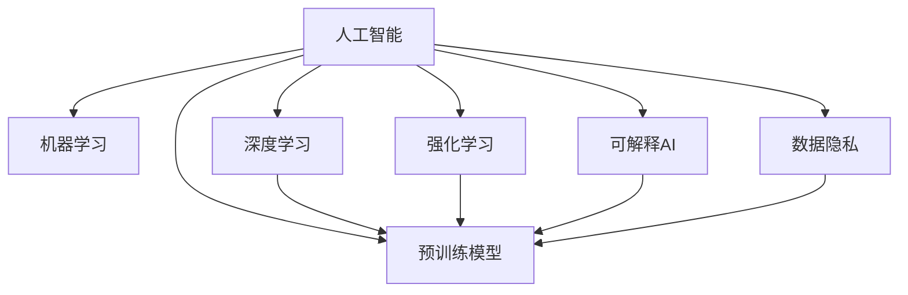

                 

## 1. 背景介绍

### 1.1 问题由来

随着人工智能技术的飞速发展，人类计算正迅速取代传统计算，成为商业创新的重要驱动力。AI在自动化、决策支持、个性化推荐、自然语言处理等方面的应用，已经深刻改变了企业的运营模式和用户体验。然而，AI的发展也面临着诸多挑战，如数据隐私、模型可解释性、安全性和伦理等问题。本文将深入探讨AI驱动的创新在商业中的未来展望，结合数学模型和实际案例，分析其应用和前景。

### 1.2 问题核心关键点

1. **AI在商业中的应用**：AI技术在营销、供应链、客户服务、金融分析等商业领域中的广泛应用。
2. **AI技术的进步**：从早期的规则引擎到深度学习，再到如今的预训练模型和强化学习，AI技术的发展轨迹和最新进展。
3. **AI技术的挑战**：数据隐私、模型可解释性、安全性和伦理问题。
4. **AI的未来展望**：未来AI技术的发展趋势、可能的商业应用场景和面临的挑战。

## 2. 核心概念与联系

### 2.1 核心概念概述

为了更好地理解AI在商业中的应用和未来展望，本节将介绍几个密切相关的核心概念：

- **人工智能(AI)**：通过计算机模拟人类智能，包括感知、推理、学习、决策等能力。
- **机器学习(ML)**：指让机器通过数据和算法学习规律和模式，并应用于预测、分类、聚类等任务。
- **深度学习(Deep Learning, DL)**：一种特殊类型的机器学习，使用多层神经网络模拟人类大脑处理信息的能力。
- **预训练模型(Pre-trained Models)**：通过大规模数据集进行自监督学习训练得到的通用模型，如BERT、GPT等。
- **强化学习(Reinforcement Learning, RL)**：通过试错和奖励机制，使机器在特定环境中学习最优策略的算法。
- **可解释AI(Explainable AI, XAI)**：使AI模型的决策过程可被理解和解释的技术，以增强用户信任和透明度。
- **数据隐私(Portable Privacy)**：保护用户数据隐私不被滥用的技术措施，如差分隐私、联邦学习等。

这些核心概念之间的逻辑关系可以通过以下Mermaid流程图来展示：



这个流程图展示了人工智能的核心概念及其之间的关系：

1. 人工智能包括机器学习和深度学习等多种技术。
2. 深度学习是机器学习的一种特殊形式，使用多层神经网络处理复杂数据。
3. 预训练模型是深度学习的重要应用，通过大规模数据集进行自监督学习。
4. 强化学习是AI中的另一个分支，通过试错机制学习最优策略。
5. 可解释AI和数据隐私是AI应用中需要特别关注的两个问题。

## 3. 核心算法原理 & 具体操作步骤

### 3.1 算法原理概述

AI在商业中的应用主要基于机器学习和深度学习算法，通过数据驱动的方式实现商业决策和自动化流程。AI技术在商业中的应用通常包括以下几个关键步骤：

1. **数据收集**：从不同来源收集数据，如客户行为数据、市场调查数据、社交媒体数据等。
2. **数据预处理**：对收集到的数据进行清洗、去重、归一化等处理，以便于后续分析和建模。
3. **模型训练**：使用机器学习或深度学习算法，训练得到用于预测和分类的模型。
4. **模型部署**：将训练好的模型部署到生产环境中，进行实时预测和决策。
5. **模型监控与优化**：持续监控模型性能，根据反馈数据进行模型优化和调整。

### 3.2 算法步骤详解

以下我们将详细介绍AI在商业应用中的核心步骤：

**Step 1: 数据收集**

数据是AI应用的基础。商业企业可以通过各种方式收集数据，如在线表单、社交媒体、销售记录、客户服务记录等。对于敏感数据，如客户个人信息，企业需要遵守相关法律法规，如GDPR、CCPA等，确保数据收集和使用过程中的隐私保护。

**Step 2: 数据预处理**

数据预处理是确保模型训练效果的重要步骤。预处理包括数据清洗、特征工程、数据增强等。例如，可以使用数据去重、归一化、标准化等技术处理数据，确保数据质量。特征工程则是通过提取和构造有意义的特征，提高模型的预测准确率。

**Step 3: 模型训练**

模型训练是AI应用的核心环节。企业可以使用不同的机器学习或深度学习算法，如线性回归、逻辑回归、决策树、随机森林、神经网络等。预训练模型是近年来非常流行的一种方法，通过在大规模数据集上进行预训练，使得模型能够学习到更通用的语言表示，提升模型性能。

**Step 4: 模型部署**

模型部署是将训练好的模型应用到实际商业环境中的重要步骤。企业可以使用云计算平台，如AWS、Google Cloud、Azure等，进行模型部署和运行。模型部署需要考虑数据传输、计算资源、模型推理速度等因素，确保模型能够实时响应业务需求。

**Step 5: 模型监控与优化**

模型监控与优化是保持AI模型持续高效运行的关键。企业可以使用自动化工具监控模型性能，如TensorBoard、Weights & Biases等。根据监控结果，企业可以调整模型参数、优化算法、改进特征工程等，提升模型效果。

### 3.3 算法优缺点

AI在商业应用中具有以下优点：

1. **提高效率**：自动化处理大量重复性任务，提高工作效率。
2. **降低成本**：减少人力成本和错误成本。
3. **提升决策质量**：通过数据分析和模型预测，提高决策质量。
4. **增强客户体验**：提供个性化推荐、智能客服等服务，提升客户满意度。

同时，AI在商业应用中也有以下缺点：

1. **数据隐私风险**：收集和处理大量用户数据，可能引发隐私泄露问题。
2. **模型可解释性不足**：AI模型通常是"黑盒"，难以解释其内部决策逻辑。
3. **技术门槛高**：需要专业的数据科学家和工程师进行开发和维护。
4. **资源消耗大**：AI模型需要大量的计算资源和存储空间，成本较高。

### 3.4 算法应用领域

AI技术在商业中应用广泛，主要涵盖以下几个领域：

- **营销与销售**：通过客户行为数据分析，进行个性化推荐、客户细分、市场预测等。
- **供应链管理**：优化库存管理、需求预测、物流调度等。
- **客户服务**：提供智能客服、客户情感分析、投诉处理等服务。
- **金融分析**：风险评估、信用评分、欺诈检测等。
- **人力资源管理**：招聘筛选、员工绩效评估、员工满意度调查等。
- **运营优化**：生产调度、设备维护、质量控制等。

## 4. 数学模型和公式 & 详细讲解 & 举例说明

### 4.1 数学模型构建

在AI商业应用中，数学模型是数据分析和模型训练的基础。以下以回归分析为例，介绍常见数学模型的构建方法。

假设有一组数据集 $(x_i, y_i)$，其中 $x_i$ 为特征向量，$y_i$ 为标签值。回归分析的目标是通过训练一个线性回归模型，预测新的数据点的标签值。

### 4.2 公式推导过程

线性回归模型的目标是找到一个最优的线性函数 $y = \theta_0 + \theta_1 x_1 + \theta_2 x_2 + \ldots + \theta_n x_n$，使得模型预测值与真实标签值 $y_i$ 的误差最小化。最小化误差的目标函数为：

$$
J(\theta) = \frac{1}{2m} \sum_{i=1}^m (h_{\theta}(x_i) - y_i)^2
$$

其中，$h_{\theta}(x_i)$ 表示模型在输入 $x_i$ 上的预测值，$m$ 表示数据集大小。

根据梯度下降算法，可以通过求解目标函数 $J(\theta)$ 的最小化问题，得到最优的模型参数 $\theta$。具体计算过程如下：

$$
\theta_{j} \leftarrow \theta_{j} - \frac{\eta}{m} \sum_{i=1}^m (h_{\theta}(x_i) - y_i)x_{ij}
$$

其中，$\eta$ 为学习率，$x_{ij}$ 表示特征 $x_i$ 的第 $j$ 个特征值。

### 4.3 案例分析与讲解

以某电商平台的客户购买行为分析为例，可以构建一个线性回归模型，预测客户的下一次购买时间。模型输入为客户的浏览记录、购买历史、会员等级等特征，输出为预测的下一次购买时间。通过训练得到的模型，电商平台可以针对不同客户群体进行个性化推荐，提升客户转化率和留存率。

## 5. 项目实践：代码实例和详细解释说明

### 5.1 开发环境搭建

在进行AI项目实践前，我们需要准备好开发环境。以下是使用Python进行TensorFlow开发的环境配置流程：

1. 安装Anaconda：从官网下载并安装Anaconda，用于创建独立的Python环境。

2. 创建并激活虚拟环境：
```bash
conda create -n tf-env python=3.8 
conda activate tf-env
```

3. 安装TensorFlow：根据CUDA版本，从官网获取对应的安装命令。例如：
```bash
conda install tensorflow -c tf
```

4. 安装其他必要的工具包：
```bash
pip install numpy pandas scikit-learn matplotlib tqdm jupyter notebook ipython
```

完成上述步骤后，即可在`tf-env`环境中开始AI项目实践。

### 5.2 源代码详细实现

这里我们以电商平台的客户购买行为预测为例，给出使用TensorFlow进行回归分析的代码实现。

首先，定义数据处理函数：

```python
import tensorflow as tf
import numpy as np

def load_data(file_path):
    data = []
    with open(file_path, 'r') as f:
        for line in f:
            time, features = line.strip().split(',')
            features = [float(feat) for feat in features.split()]
            data.append((features, int(time)))
    return np.array(data)
```

然后，定义模型和优化器：

```python
features = tf.keras.layers.Input(shape=(n_features,), name='features')
time = tf.keras.layers.Input(shape=(), name='time')
h = tf.keras.layers.Dense(10, activation='relu')(features)
h = tf.keras.layers.Dense(10, activation='relu')(h)
output = tf.keras.layers.Dense(1)(features)

model = tf.keras.models.Model(inputs=[features, time], outputs=output)
optimizer = tf.keras.optimizers.Adam(learning_rate=0.001)
```

接着，定义训练和评估函数：

```python
def train_epoch(model, train_data, batch_size, optimizer):
    train_dataset = tf.data.Dataset.from_tensor_slices(train_data)
    train_dataset = train_dataset.shuffle(buffer_size=10000).batch(batch_size)
    model.compile(optimizer=optimizer, loss='mse')
    model.fit(train_dataset, epochs=10, validation_split=0.2)
    return model
```

最后，启动训练流程并在测试集上评估：

```python
batch_size = 64

# 加载数据
train_data = load_data('train.csv')
test_data = load_data('test.csv')

# 训练模型
model = train_epoch(model, train_data, batch_size, optimizer)

# 评估模型
test_loss = model.evaluate(test_data)
print('Test loss:', test_loss)
```

以上就是使用TensorFlow进行客户购买行为预测的完整代码实现。可以看到，TensorFlow提供了强大的高层次API，使得模型的构建和训练过程非常简单。

### 5.3 代码解读与分析

让我们再详细解读一下关键代码的实现细节：

**load_data函数**：
- 定义了从CSV文件中加载数据的方法，将时间字符串转换为整数标签，特征转换为浮点数。

**train_epoch函数**：
- 使用TensorFlow的Data API将数据集转换为可迭代的数据流。
- 在每个批次上前向传播计算损失函数，并使用Adam优化器反向传播更新模型参数。
- 在每个epoch结束时，计算模型在验证集上的平均损失，输出结果。

**训练流程**：
- 定义总的batch size，开始循环迭代
- 每个epoch内，在训练集上训练，输出平均loss
- 在测试集上评估，输出最终测试结果

可以看到，TensorFlow的高层次API使得模型的构建和训练过程非常简洁高效。开发者可以将更多精力放在数据处理和模型优化等高层逻辑上，而不必过多关注底层的实现细节。

当然，工业级的系统实现还需考虑更多因素，如模型的保存和部署、超参数的自动搜索、更灵活的任务适配层等。但核心的回归分析方法基本与此类似。

## 6. 实际应用场景

### 6.1 智能客服系统

基于AI的智能客服系统已经在各大电商平台上广泛应用。传统客服往往需要配备大量人力，高峰期响应缓慢，且一致性和专业性难以保证。使用AI技术，企业可以建立智能客服系统，24小时不间断服务，快速响应客户咨询，用自然流畅的语言解答各类常见问题。

在技术实现上，可以收集企业内部的历史客服对话记录，将问题和最佳答复构建成监督数据，在此基础上对预训练语言模型进行微调。微调后的语言模型能够自动理解用户意图，匹配最合适的答案模板进行回复。对于客户提出的新问题，还可以接入检索系统实时搜索相关内容，动态组织生成回答。如此构建的智能客服系统，能大幅提升客户咨询体验和问题解决效率。

### 6.2 金融舆情监测

金融机构需要实时监测市场舆论动向，以便及时应对负面信息传播，规避金融风险。传统的人工监测方式成本高、效率低，难以应对网络时代海量信息爆发的挑战。使用AI技术，可以构建金融舆情监测系统，实时抓取网络文本数据，自动判断文本属于何种主题，情感倾向是正面、中性还是负面。将AI模型应用到实时抓取的网络文本数据，就能够自动监测不同主题下的情感变化趋势，一旦发现负面信息激增等异常情况，系统便会自动预警，帮助金融机构快速应对潜在风险。

### 6.3 个性化推荐系统

当前的推荐系统往往只依赖用户的历史行为数据进行物品推荐，无法深入理解用户的真实兴趣偏好。使用AI技术，可以构建个性化推荐系统，更好地挖掘用户行为背后的语义信息，从而提供更精准、多样的推荐内容。

在实践中，可以收集用户浏览、点击、评论、分享等行为数据，提取和用户交互的物品标题、描述、标签等文本内容。将文本内容作为模型输入，用户的后续行为（如是否点击、购买等）作为监督信号，在此基础上微调预训练语言模型。微调后的模型能够从文本内容中准确把握用户的兴趣点。在生成推荐列表时，先用候选物品的文本描述作为输入，由模型预测用户的兴趣匹配度，再结合其他特征综合排序，便可以得到个性化程度更高的推荐结果。

### 6.4 未来应用展望

随着AI技术的发展，未来AI在商业中的应用前景将更加广阔。以下是几个可能的应用方向：

1. **智能制造**：通过AI技术优化生产流程，提高生产效率和产品质量。
2. **智慧医疗**：使用AI技术进行疾病诊断、治疗方案推荐、患者管理等。
3. **智能物流**：通过AI技术优化运输路线、仓储管理、货物配送等。
4. **智能营销**：使用AI技术进行市场细分、消费者行为分析、广告投放优化等。
5. **智能城市**：通过AI技术优化城市管理、交通控制、能源分配等。

未来，随着AI技术的不断进步，其在商业中的应用将更加广泛，深度融入各行各业，提升效率、降低成本、提升用户体验。

## 7. 工具和资源推荐

### 7.1 学习资源推荐

为了帮助开发者系统掌握AI在商业中的应用，以下是一些优质的学习资源：

1. **《机器学习实战》（Hands-On Machine Learning with Scikit-Learn, Keras, and TensorFlow）**：由Aurélien Géron撰写，全面介绍了机器学习和深度学习的实用技巧，包含丰富的案例和项目实践。

2. **Coursera《深度学习专项课程》**：由吴恩达和Andrew Ng等知名专家开设，涵盖深度学习的基本概念和实践技能，适合初学者和进阶开发者。

3. **《Python深度学习》（Deep Learning with Python）**：由François Chollet撰写，介绍了TensorFlow和Keras的使用方法，包含大量的代码实例和项目实战。

4. **Kaggle竞赛平台**：提供了丰富的机器学习和深度学习竞赛项目，可以参与实际项目实践，积累经验和提升技能。

5. **GitHub开源项目**：GitHub上存在大量的AI项目和代码，可以学习他人的项目实现，提升自身能力。

通过这些资源的学习实践，相信你一定能够快速掌握AI在商业中的应用技巧，并用于解决实际的业务问题。

### 7.2 开发工具推荐

高效的开发离不开优秀的工具支持。以下是几款用于AI商业应用开发的常用工具：

1. **Jupyter Notebook**：开源的交互式计算环境，支持Python、R等多种编程语言，可以方便地进行数据处理、模型训练和结果展示。

2. **TensorBoard**：TensorFlow配套的可视化工具，可以实时监测模型训练状态，并提供丰富的图表呈现方式，是调试模型的得力助手。

3. **Weights & Biases**：模型训练的实验跟踪工具，可以记录和可视化模型训练过程中的各项指标，方便对比和调优。

4. **AWS SageMaker**：亚马逊提供的云服务，支持模型的训练、部署和运行，可以方便地进行大规模数据处理和模型优化。

5. **Google Cloud AI Platform**：谷歌提供的云服务，支持多种AI模型的训练和部署，可以方便地进行模型优化和集成。

6. **Azure Machine Learning**：微软提供的云服务，支持AI模型的训练、部署和运行，可以方便地进行模型优化和集成。

合理利用这些工具，可以显著提升AI商业应用开发的效率，加快创新迭代的步伐。

### 7.3 相关论文推荐

AI在商业中的应用源于学界的持续研究。以下是几篇奠基性的相关论文，推荐阅读：

1. **《神经网络与深度学习》（Neural Networks and Deep Learning）**：Michael Nielsen撰写，介绍了神经网络和深度学习的基本概念和实践技能，适合初学者和进阶开发者。

2. **《深度学习》（Deep Learning）**：Ian Goodfellow、Yoshua Bengio、Aaron Courville合著，介绍了深度学习的理论基础和应用实践，是深度学习领域的经典之作。

3. **《动手学深度学习》（Dive into Deep Learning）**：李沐、Aurélien Géron合著，介绍了TensorFlow和Keras的使用方法，包含大量的代码实例和项目实战。

4. **《机器学习》（Pattern Recognition and Machine Learning）**：Christopher Bishop撰写，介绍了机器学习的基本概念和实践技能，适合初学者和进阶开发者。

5. **《可解释人工智能》（Explainable Artificial Intelligence）**：Gihébre Mengistu María和Daniele A. Roletti撰写，介绍了可解释AI的理论基础和实践技能，适合希望提升模型可解释性的开发者。

这些论文代表了大AI在商业应用中的发展脉络。通过学习这些前沿成果，可以帮助研究者把握学科前进方向，激发更多的创新灵感。

## 8. 总结：未来发展趋势与挑战

### 8.1 研究成果总结

本文对AI在商业中的应用进行了全面系统的介绍。首先阐述了AI技术在商业中的广泛应用，明确了AI在营销、供应链、客户服务、金融分析等商业领域中的重要地位。其次，从原理到实践，详细讲解了回归分析等数学模型的构建和训练方法，给出了AI项目开发的完整代码实例。同时，本文还广泛探讨了AI技术在智能客服、金融舆情、个性化推荐等多个行业领域的应用前景，展示了AI技术在商业中的巨大潜力。最后，本文精选了AI技术的各类学习资源，力求为读者提供全方位的技术指引。

通过本文的系统梳理，可以看到，AI技术在商业中的应用前景广阔，极大地提升了企业的运营效率和决策质量。未来，随着AI技术的不断进步，其在商业中的应用将更加广泛，深度融入各行各业，提升效率、降低成本、提升用户体验。

### 8.2 未来发展趋势

展望未来，AI在商业中的应用将呈现以下几个发展趋势：

1. **智能化程度提升**：随着深度学习、强化学习等技术的进步，AI系统将具备更强的智能决策能力，能够处理更加复杂多变的业务场景。
2. **数据驱动决策**：企业将更多依赖AI模型进行决策，实现数据驱动的业务优化。
3. **多模态融合**：AI系统将融合多种数据源和信息源，实现更全面的数据分析和决策支持。
4. **实时性增强**：AI系统将具备更强的实时响应能力，能够及时捕捉市场变化和客户需求。
5. **可解释性增强**：AI系统将具备更强的可解释性，帮助用户理解模型决策过程，增强用户信任。
6. **隐私保护加强**：企业将更加重视数据隐私保护，通过差分隐私、联邦学习等技术，保护用户数据安全。

以上趋势凸显了AI在商业应用中的广阔前景。这些方向的探索发展，必将进一步提升企业的数据分析能力和决策水平，为商业创新带来新的突破。

### 8.3 面临的挑战

尽管AI在商业中的应用已经取得了显著成效，但在迈向更加智能化、普适化应用的过程中，仍然面临着诸多挑战：

1. **技术门槛高**：AI技术需要专业的数据科学家和工程师进行开发和维护，技术门槛较高。
2. **数据质量问题**：数据收集和处理过程中可能存在数据缺失、噪音等问题，影响模型性能。
3. **计算资源消耗大**：AI模型需要大量的计算资源和存储空间，成本较高。
4. **模型可解释性不足**：AI模型通常是"黑盒"，难以解释其内部决策逻辑，影响用户信任。
5. **数据隐私风险**：收集和处理大量用户数据，可能引发隐私泄露问题。
6. **模型泛化能力不足**：模型在小样本数据上的泛化能力不足，需要更多数据和更复杂的模型结构。

### 8.4 研究展望

面对AI在商业应用中面临的挑战，未来的研究需要在以下几个方面寻求新的突破：

1. **数据增强技术**：通过数据增强技术，提升数据集的质量和多样性，提高模型的泛化能力。
2. **模型压缩技术**：通过模型压缩技术，减小模型规模，提升计算效率，降低计算成本。
3. **可解释AI技术**：通过可解释AI技术，增强模型的可解释性和透明度，提高用户信任。
4. **差分隐私技术**：通过差分隐私技术，保护用户数据隐私，降低隐私泄露风险。
5. **联邦学习技术**：通过联邦学习技术，实现分布式数据处理，降低数据传输成本，保护数据隐私。
6. **多模态融合技术**：通过多模态融合技术，实现多源数据融合，提升模型的综合分析能力。

这些研究方向的探索，必将引领AI在商业应用中的不断发展，推动企业数据驱动决策的进程，提升企业运营效率和决策质量。

## 9. 附录：常见问题与解答

**Q1：AI在商业中的应用有哪些？**

A: AI在商业中的应用非常广泛，主要涵盖以下几个领域：

1. **营销与销售**：通过客户行为数据分析，进行个性化推荐、客户细分、市场预测等。
2. **供应链管理**：优化库存管理、需求预测、物流调度等。
3. **客户服务**：提供智能客服、客户情感分析、投诉处理等服务。
4. **金融分析**：风险评估、信用评分、欺诈检测等。
5. **人力资源管理**：招聘筛选、员工绩效评估、员工满意度调查等。
6. **运营优化**：生产调度、设备维护、质量控制等。

**Q2：AI在商业应用中需要注意哪些问题？**

A: AI在商业应用中需要注意以下几个问题：

1. **数据隐私问题**：收集和处理大量用户数据，可能引发隐私泄露问题。
2. **模型可解释性问题**：AI模型通常是"黑盒"，难以解释其内部决策逻辑，影响用户信任。
3. **技术门槛问题**：AI技术需要专业的数据科学家和工程师进行开发和维护，技术门槛较高。
4. **计算资源问题**：AI模型需要大量的计算资源和存储空间，成本较高。
5. **数据质量问题**：数据收集和处理过程中可能存在数据缺失、噪音等问题，影响模型性能。

**Q3：AI在商业应用中的未来展望是什么？**

A: AI在商业应用中的未来展望非常广阔，主要包括以下几个方面：

1. **智能化程度提升**：随着深度学习、强化学习等技术的进步，AI系统将具备更强的智能决策能力，能够处理更加复杂多变的业务场景。
2. **数据驱动决策**：企业将更多依赖AI模型进行决策，实现数据驱动的业务优化。
3. **多模态融合**：AI系统将融合多种数据源和信息源，实现更全面的数据分析和决策支持。
4. **实时性增强**：AI系统将具备更强的实时响应能力，能够及时捕捉市场变化和客户需求。
5. **可解释性增强**：AI系统将具备更强的可解释性，帮助用户理解模型决策过程，增强用户信任。
6. **隐私保护加强**：企业将更加重视数据隐私保护，通过差分隐私、联邦学习等技术，保护用户数据安全。

**Q4：AI在商业应用中需要哪些工具和技术？**

A: AI在商业应用中需要以下工具和技术：

1. **Python编程语言**：Python具有丰富的机器学习和深度学习库，如TensorFlow、PyTorch、Scikit-Learn等。
2. **云计算平台**：如AWS、Google Cloud、Azure等，提供计算资源和数据存储服务。
3. **数据处理工具**：如Pandas、NumPy等，用于数据清洗、特征工程等。
4. **可视化工具**：如TensorBoard、Weights & Biases等，用于模型训练和调试。
5. **自动化工具**：如Kaggle竞赛平台，提供丰富的数据集和项目实战经验。

**Q5：AI在商业应用中的挑战有哪些？**

A: AI在商业应用中的挑战主要包括以下几个方面：

1. **技术门槛高**：AI技术需要专业的数据科学家和工程师进行开发和维护，技术门槛较高。
2. **数据质量问题**：数据收集和处理过程中可能存在数据缺失、噪音等问题，影响模型性能。
3. **计算资源消耗大**：AI模型需要大量的计算资源和存储空间，成本较高。
4. **模型可解释性不足**：AI模型通常是"黑盒"，难以解释其内部决策逻辑，影响用户信任。
5. **数据隐私风险**：收集和处理大量用户数据，可能引发隐私泄露问题。
6. **模型泛化能力不足**：模型在小样本数据上的泛化能力不足，需要更多数据和更复杂的模型结构。

---

作者：禅与计算机程序设计艺术 / Zen and the Art of Computer Programming

