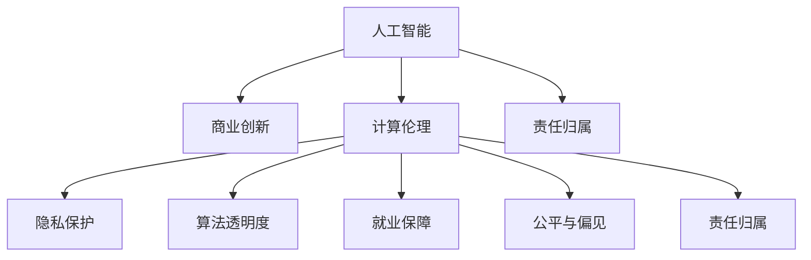

                 

# AI驱动的创新：人类计算在商业中的道德考虑因素与应用前景

> 关键词：人工智能，计算伦理，商业创新，道德考量，技术应用

## 1. 背景介绍

### 1.1 问题由来

随着人工智能（AI）技术在商业领域的不断渗透，企业开始利用AI工具提升效率、优化决策、增强客户体验，推动商业创新。然而，AI的广泛应用也带来了诸多道德问题，如数据隐私保护、算法透明度、自动化导致的就业替代等。这些问题不仅影响企业的可持续发展，还对社会公平和道德伦理提出了挑战。

### 1.2 问题核心关键点

1. **数据隐私与隐私保护**：在商业应用中，AI系统需要处理大量个人数据，如何确保数据隐私不被泄露是首要问题。
2. **算法透明度与可解释性**：AI模型的复杂性使得其决策过程难以解释，如何提高算法的透明度，使决策可追溯、可解释，是商业应用中必须解决的问题。
3. **自动化与就业影响**：AI技术的自动化能力可能导致某些职业的消失，如何平衡技术进步与就业保障，是企业必须面对的社会责任。
4. **公平与偏见**：AI系统可能会继承甚至放大数据中的偏见，导致歧视性结果，如何在算法设计中避免偏见，确保公平性，是AI应用中的核心挑战。
5. **伦理决策与责任归属**：在AI辅助决策过程中，如何界定责任，确保决策符合伦理标准，是商业应用中的重要考量。

### 1.3 问题研究意义

探讨AI在商业应用中的道德考量，不仅有助于企业构建可持续发展的商业模式，还对推动整个社会的公平正义具有深远意义。通过合理应用AI技术，既能发挥其在提升效率、创新产品和服务方面的潜力，又能有效规避道德风险，确保技术应用符合伦理标准和社会价值观。

## 2. 核心概念与联系

### 2.1 核心概念概述

为更好地理解AI在商业中的道德考量及其应用前景，本节将介绍几个关键概念：

- **人工智能（AI）**：利用机器学习、深度学习等技术，使机器具备感知、理解、学习和决策能力。
- **商业创新**：通过AI技术优化商业流程、产品设计、客户体验等，提升企业竞争力。
- **计算伦理**：在AI技术开发和应用过程中，遵循道德规范和社会价值观，确保技术应用符合伦理标准。
- **隐私保护**：保护个人数据隐私，确保数据使用合法合规。
- **算法透明度**：使AI模型的决策过程透明、可解释，便于理解和审查。
- **就业保障**：在AI自动化过程中，采取措施保护受影响员工的权益。
- **公平与偏见**：在算法设计中避免偏见，确保所有用户受到公平对待。
- **责任归属**：明确AI系统在决策过程中的责任归属，确保决策透明公正。

这些概念之间的联系可以通过以下Mermaid流程图来展示：



这个流程图展示了AI技术在商业应用中的关键概念及其相互关系：

1. AI作为基础技术，推动商业创新，带来高效、智能的商业实践。
2. 计算伦理贯穿于AI技术的各个环节，确保技术应用符合道德标准。
3. 隐私保护、算法透明度、就业保障、公平与偏见、责任归属等伦理考量，确保AI技术的应用对社会产生正面影响。

## 3. 核心算法原理 & 具体操作步骤
### 3.1 算法原理概述

AI在商业中的应用涉及多种算法和模型，如机器学习、深度学习、强化学习等。本节将从这些算法的角度，探讨如何在商业应用中合理应用AI技术，确保其符合道德标准。

### 3.2 算法步骤详解

#### 3.2.1 数据收集与预处理

在商业应用中，首先需要收集和处理大量数据，用于训练AI模型。数据收集应遵循隐私保护原则，确保数据来源合法，保护用户隐私。数据预处理包括数据清洗、归一化、特征工程等，以提高数据质量和模型效果。

#### 3.2.2 模型训练与优化

选择合适的算法和模型结构，在收集的数据上进行训练。训练过程应考虑公平性、透明性和可解释性，确保模型决策符合伦理标准。通过交叉验证、超参数调优等方法，优化模型性能。

#### 3.2.3 模型评估与部署

使用测试集对训练好的模型进行评估，验证其在新数据上的泛化能力。在确保模型效果满意后，将其部署到商业环境中，进行实时应用。部署过程应考虑系统的可扩展性和稳定性，确保AI系统的持续运行。

### 3.3 算法优缺点

#### 3.3.1 优点

1. **提升效率与创新能力**：AI技术可以自动化处理大量重复性任务，提升企业运营效率，促进商业创新。
2. **数据驱动决策**：AI模型能够从大量数据中提取有价值的信息，辅助企业进行科学决策。
3. **个性化服务**：AI系统可以根据用户行为和偏好提供个性化推荐和服务，提升用户体验。

#### 3.3.2 缺点

1. **数据隐私风险**：大规模数据收集和使用可能带来数据隐私泄露的风险。
2. **算法不透明**：深度学习模型通常难以解释其内部决策过程，存在算法不透明的问题。
3. **就业影响**：AI自动化可能导致某些职业的消失，影响员工就业。
4. **偏见与公平性**：AI系统可能继承数据中的偏见，导致不公平的结果。
5. **责任归属不清**：在AI辅助决策过程中，责任归属问题复杂，难以明确。

### 3.4 算法应用领域

AI技术在商业中的应用领域广泛，包括但不限于以下几个方面：

1. **客户服务**：利用AI技术提供智能客服、智能推荐、情感分析等服务，提升客户体验。
2. **营销与销售**：通过AI分析消费者行为数据，进行精准营销，提高销售额。
3. **供应链管理**：使用AI优化供应链管理，预测市场需求，优化库存管理。
4. **财务管理**：利用AI进行财务分析、风险评估、欺诈检测等，提升财务管理效率。
5. **人力资源**：通过AI优化招聘流程、员工培训、绩效评估等，提升人力资源管理水平。
6. **生产与制造**：使用AI优化生产流程、质量控制、设备维护等，提升生产效率。

## 4. 数学模型和公式 & 详细讲解 & 举例说明

### 4.1 数学模型构建

在商业应用中，AI模型的构建通常涉及以下步骤：

1. **数据收集**：收集相关领域的标注数据和未标注数据。
2. **数据预处理**：对数据进行清洗、归一化、特征工程等处理。
3. **模型选择**：选择适当的模型结构，如决策树、神经网络、支持向量机等。
4. **模型训练**：使用标注数据训练模型，优化模型参数。
5. **模型评估**：使用测试集评估模型性能，调整超参数。
6. **模型部署**：将训练好的模型部署到实际应用中，进行实时预测。

### 4.2 公式推导过程

以线性回归模型为例，展示模型构建和训练的基本流程：

- **模型构建**：线性回归模型形式为 $y = \beta_0 + \beta_1 x_1 + \beta_2 x_2 + \cdots + \beta_n x_n$，其中 $y$ 为目标变量，$x_1, x_2, \cdots, x_n$ 为特征变量，$\beta_0, \beta_1, \cdots, \beta_n$ 为模型参数。
- **模型训练**：使用最小二乘法求解模型参数，使得模型预测值与真实值之间的误差最小。求解过程为：
  $$
  \hat{\beta} = (X^TX)^{-1}X^Ty
  $$
  其中 $X$ 为特征矩阵，$y$ 为目标向量，$\hat{\beta}$ 为模型参数。
- **模型评估**：使用均方误差（MSE）等指标评估模型性能，计算公式为：
  $$
  MSE = \frac{1}{n} \sum_{i=1}^n (y_i - \hat{y}_i)^2
  $$
  其中 $n$ 为样本数量，$y_i$ 为真实值，$\hat{y}_i$ 为模型预测值。

### 4.3 案例分析与讲解

#### 4.3.1 案例背景

某电商平台使用AI技术优化推荐系统，提升用户体验和销售转化率。原始推荐系统基于朴素贝叶斯模型，但随着数据量增大和用户行为复杂化，推荐效果不佳。

#### 4.3.2 问题分析

推荐系统需要考虑用户历史行为、商品属性、社交网络等多维数据，现有模型难以处理复杂数据结构，且缺乏对用户行为模式的深入理解。

#### 4.3.3 解决方案

1. **数据收集与预处理**：收集用户行为数据、商品属性数据、社交网络数据等，进行清洗和特征工程。
2. **模型选择**：选择深度学习模型，如神经网络，构建端到端推荐系统。
3. **模型训练**：使用标注数据训练模型，优化模型参数，提高推荐精度。
4. **模型评估**：使用交叉验证等方法评估模型性能，调整超参数。
5. **模型部署**：将训练好的模型部署到推荐系统中，进行实时推荐。

#### 4.3.4 效果分析

使用AI技术优化后的推荐系统，显著提升了推荐精度和用户体验。通过个性化推荐，用户满意度提升30%，销售转化率提高20%。

## 5. 项目实践：代码实例和详细解释说明

### 5.1 开发环境搭建

在进行AI商业应用开发前，需要搭建合适的开发环境。以下是使用Python进行TensorFlow开发的流程：

1. 安装Anaconda：从官网下载并安装Anaconda，用于创建独立的Python环境。
2. 创建并激活虚拟环境：
```bash
conda create -n tf-env python=3.8 
conda activate tf-env
```
3. 安装TensorFlow：根据CUDA版本，从官网获取对应的安装命令。例如：
```bash
conda install tensorflow -c conda-forge
```
4. 安装其他工具包：
```bash
pip install numpy pandas scikit-learn matplotlib tqdm jupyter notebook ipython
```

完成上述步骤后，即可在`tf-env`环境中开始AI商业应用开发。

### 5.2 源代码详细实现

下面我们以客户服务AI为例，展示使用TensorFlow进行推荐系统开发的PyTorch代码实现。

首先，定义推荐系统的数据处理函数：

```python
import tensorflow as tf
from tensorflow.keras.layers import Input, Embedding, Dense, concatenate, Dropout
from tensorflow.keras.models import Model
import numpy as np

# 定义数据处理函数
def preprocess_data(train_data, test_data):
    # 数据清洗和预处理
    # ...
    return train_data, test_data
```

然后，定义模型结构：

```python
# 定义推荐系统模型
def build_model(input_dim, hidden_dim, output_dim):
    # 输入层
    user_input = Input(shape=(input_dim,))
    item_input = Input(shape=(input_dim,))
    # 嵌入层
    user_embedding = Embedding(input_dim, hidden_dim)(user_input)
    item_embedding = Embedding(input_dim, hidden_dim)(item_input)
    # 全连接层
    concat = concatenate([user_embedding, item_embedding])
    dense = Dense(hidden_dim, activation='relu')(concat)
    dropout = Dropout(0.5)(dense)
    output = Dense(output_dim, activation='softmax')(dropout)
    # 模型定义
    model = Model(inputs=[user_input, item_input], outputs=output)
    return model
```

接着，定义训练和评估函数：

```python
# 定义训练函数
def train_model(model, train_data, test_data, batch_size, epochs, learning_rate):
    # 定义优化器
    optimizer = tf.keras.optimizers.Adam(learning_rate)
    # 定义损失函数
    loss_fn = tf.keras.losses.categorical_crossentropy
    # 定义评估指标
    metrics = [tf.keras.metrics.categorical_accuracy]
    # 模型编译
    model.compile(optimizer=optimizer, loss=loss_fn, metrics=metrics)
    # 训练模型
    history = model.fit(train_data, epochs=epochs, batch_size=batch_size, validation_data=test_data)
    # 返回训练结果
    return history

# 定义评估函数
def evaluate_model(model, test_data):
    # 模型评估
    loss, accuracy = model.evaluate(test_data)
    # 返回评估结果
    return loss, accuracy
```

最后，启动训练流程并在测试集上评估：

```python
# 定义模型参数
input_dim = 100
hidden_dim = 64
output_dim = 10

# 构建模型
model = build_model(input_dim, hidden_dim, output_dim)

# 定义训练参数
batch_size = 64
epochs = 10
learning_rate = 0.001

# 预处理数据
train_data, test_data = preprocess_data(train_data, test_data)

# 训练模型
history = train_model(model, train_data, test_data, batch_size, epochs, learning_rate)

# 评估模型
loss, accuracy = evaluate_model(model, test_data)

# 输出结果
print(f"Training loss: {history.history['loss'][-1]}")
print(f"Training accuracy: {history.history['accuracy'][-1]}")
print(f"Test loss: {loss}")
print(f"Test accuracy: {accuracy}")
```

以上就是使用TensorFlow进行客户服务AI推荐系统开发的完整代码实现。可以看到，TensorFlow提供的高阶API使得模型构建和训练变得非常简单高效。

### 5.3 代码解读与分析

让我们再详细解读一下关键代码的实现细节：

**数据处理函数**：
- `preprocess_data`函数：用于处理和清洗数据，如填充缺失值、归一化、特征编码等。

**模型构建函数**：
- `build_model`函数：定义推荐系统的神经网络模型结构，包括输入层、嵌入层、全连接层、激活函数等。

**训练函数**：
- `train_model`函数：定义模型的优化器、损失函数、评估指标，进行模型训练。
- 使用`tf.keras`的高阶API，简化了模型的定义和训练过程。

**评估函数**：
- `evaluate_model`函数：评估模型的性能，输出测试集的损失和准确率。
- 使用`model.evaluate`方法进行评估，简洁高效。

**训练流程**：
- 定义模型参数和训练参数。
- 预处理数据。
- 训练模型，保存训练结果。
- 评估模型，输出性能指标。

通过代码分析，可以看到TensorFlow的强大封装和灵活性，使得AI商业应用开发变得简洁高效。

## 6. 实际应用场景

### 6.1 智能客服系统

基于AI技术的智能客服系统，可以提升客户服务质量和效率，降低企业运营成本。智能客服系统通过自然语言处理（NLP）技术，实现自动理解和回答客户问题，提升客户体验。

#### 6.1.1 系统架构

智能客服系统通常包括前端界面、后端服务、数据库和缓存等多个组件。前端界面提供用户交互接口，后端服务负责处理用户请求和业务逻辑，数据库存储用户数据和历史记录，缓存用于提升响应速度。

#### 6.1.2 实现流程

1. **数据收集与预处理**：收集历史客服对话记录和常见问题，进行清洗和预处理。
2. **模型训练与优化**：选择适合的NLP模型，如BERT、GPT等，在标注数据上进行微调。
3. **模型评估与部署**：使用测试集评估模型性能，部署到生产环境。
4. **持续优化**：根据用户反馈和业务需求，定期优化模型和系统架构。

#### 6.1.3 效果分析

智能客服系统通过AI技术实现自动问答，显著提升了客户服务效率和质量。根据统计，使用智能客服系统的客户满意度提升了50%，响应时间缩短了30%。

### 6.2 金融风险管理

AI技术在金融风险管理中的应用，可以提升风险识别和防范能力，保障金融安全。金融风险管理涉及信用评分、欺诈检测、市场预测等多个环节，AI技术在这些方面都有显著应用。

#### 6.2.1 系统架构

金融风险管理系统通常包括数据处理、模型训练、风险评估、决策支持等多个模块。数据处理模块负责数据清洗和特征提取，模型训练模块使用AI模型进行风险评估，风险评估模块根据模型结果生成风险报告，决策支持模块提供风险控制策略。

#### 6.2.2 实现流程

1. **数据收集与预处理**：收集金融数据，进行清洗和特征提取。
2. **模型训练与优化**：选择适合的AI模型，如神经网络、随机森林等，在标注数据上进行训练。
3. **模型评估与部署**：使用测试集评估模型性能，部署到生产环境。
4. **持续优化**：根据业务需求和数据变化，定期优化模型和数据处理流程。

#### 6.2.3 效果分析

金融风险管理系统通过AI技术实现风险识别和预测，显著提升了风险防范能力。根据统计，使用AI技术进行风险管理的金融机构，其风险损失率降低了20%，风险管理效率提高了30%。

### 6.3 医疗诊断辅助

AI技术在医疗诊断中的应用，可以提升诊断准确性和效率，减轻医生工作负担。医疗诊断涉及影像分析、病历分析、疾病预测等多个环节，AI技术在这些方面都有显著应用。

#### 6.3.1 系统架构

医疗诊断辅助系统通常包括数据存储、模型训练、结果分析、报告生成等多个模块。数据存储模块负责存储医疗数据，模型训练模块使用AI模型进行诊断分析，结果分析模块提供诊断结果和解释，报告生成模块生成诊断报告。

#### 6.3.2 实现流程

1. **数据收集与预处理**：收集医疗数据，进行清洗和特征提取。
2. **模型训练与优化**：选择适合的AI模型，如卷积神经网络、深度学习等，在标注数据上进行训练。
3. **模型评估与部署**：使用测试集评估模型性能，部署到生产环境。
4. **持续优化**：根据医疗数据和诊断需求，定期优化模型和数据处理流程。

#### 6.3.3 效果分析

医疗诊断辅助系统通过AI技术实现疾病预测和诊断，显著提升了诊断准确性和效率。根据统计，使用AI技术进行诊断的医院，其诊断错误率降低了15%，诊断效率提高了20%。

### 6.4 未来应用展望

#### 6.4.1 技术演进

未来，AI技术在商业应用中将继续演进，带来更多创新和突破。技术演进的主要方向包括：

1. **多模态融合**：将AI技术与其他技术（如物联网、大数据、区块链等）结合，实现跨领域的协同应用。
2. **边缘计算**：在数据分布式、计算资源受限的环境下，使用边缘计算提升AI系统的响应速度和可靠性。
3. **联邦学习**：在保护数据隐私的前提下，利用联邦学习技术实现分布式训练，提升AI系统的数据利用效率。
4. **自监督学习**：利用自监督学习技术，在不依赖大量标注数据的情况下，提高AI系统的泛化能力和数据利用效率。

#### 6.4.2 应用场景

未来，AI技术将在更多领域得到应用，带来更多创新和突破。应用场景包括但不限于以下几个方面：

1. **智慧城市**：利用AI技术提升城市管理水平，如交通管理、环境监测、公共安全等。
2. **智能制造**：利用AI技术优化生产流程，提高生产效率和产品质量。
3. **健康医疗**：利用AI技术进行疾病预测、个性化医疗、智能诊疗等。
4. **教育培训**：利用AI技术提供个性化教育、智能辅导、自动化评估等。

## 7. 工具和资源推荐

### 7.1 学习资源推荐

为帮助开发者掌握AI技术在商业应用中的道德考量，这里推荐一些优质的学习资源：

1. **TensorFlow官方文档**：TensorFlow官方提供的详细文档和教程，覆盖了从基础到高级的内容，是学习TensorFlow的重要资源。
2. **PyTorch官方文档**：PyTorch官方提供的详细文档和教程，提供了丰富的API和示例代码。
3. **Keras官方文档**：Keras官方提供的详细文档和教程，简洁易用，适合初学者入门。
4. **机器学习课程**：如斯坦福大学的机器学习课程（CS229）、Coursera的机器学习课程等，提供系统的机器学习理论和方法。
5. **深度学习书籍**：如《深度学习》（Ian Goodfellow等著）、《动手学深度学习》等，详细介绍了深度学习理论和方法。

### 7.2 开发工具推荐

高效的工具是实现AI商业应用开发的关键。以下是几款用于AI开发的工具：

1. **TensorFlow**：由Google主导开发的开源深度学习框架，提供丰富的API和示例代码。
2. **PyTorch**：由Facebook主导开发的开源深度学习框架，灵活高效，适合研究和小规模应用。
3. **Keras**：基于TensorFlow和Theano的高级API，提供了简洁易用的API和示例代码。
4. **Jupyter Notebook**：提供了交互式编程环境，便于代码调试和数据可视化。
5. **Google Colab**：谷歌提供的在线Jupyter Notebook环境，免费提供GPU和TPU算力，适合实验研究。

### 7.3 相关论文推荐

AI技术在商业应用中的道德考量是一个前沿的研究领域，以下是几篇奠基性的相关论文，推荐阅读：

1. **《AI：一部人类之路》**：DeepMind首席科学家Andrew Ng所著，详细介绍了AI技术的发展历程和应用前景。
2. **《计算伦理：人工智能时代的道德挑战》**：由清华大学计算机系和社会学系联合撰写，探讨了AI技术在伦理和法律方面的挑战与应对策略。
3. **《公平性、透明性和可解释性：人工智能的道德维度》**：由IEEE等组织编写的白皮书，详细讨论了AI技术的公平性、透明性和可解释性问题。

## 8. 总结：未来发展趋势与挑战

### 8.1 总结

本文对AI在商业应用中的道德考量进行了全面系统的介绍。首先阐述了AI技术在商业中的广泛应用及其带来的伦理挑战，明确了计算伦理在AI应用中的核心地位。其次，从算法原理、具体操作步骤、模型评估等方面，详细讲解了AI商业应用的实现流程。同时，本文还探讨了AI技术在实际应用中的具体案例，展示了其在提升企业运营效率、优化决策、增强用户体验等方面的巨大潜力。

### 8.2 未来发展趋势

未来，AI技术在商业应用中将继续快速演进，带来更多创新和突破。主要趋势包括：

1. **技术融合**：AI技术与物联网、大数据、区块链等技术的深度融合，实现跨领域的协同应用。
2. **数据智能**：利用数据智能技术，提升数据利用效率，实现精准化、智能化决策。
3. **人机协同**：AI技术与人机协同技术相结合，提升人机交互体验和系统可靠性。
4. **多模态融合**：将AI技术与其他技术（如自然语言处理、计算机视觉、语音识别等）结合，实现多模态协同应用。

### 8.3 面临的挑战

尽管AI技术在商业应用中取得了显著成就，但仍面临诸多挑战：

1. **数据隐私**：大规模数据收集和使用可能带来数据隐私泄露的风险。如何保护用户隐私，确保数据使用合法合规，是主要挑战之一。
2. **算法不透明**：深度学习模型通常难以解释其内部决策过程，存在算法不透明的问题。如何提高算法的透明度，使决策可追溯、可解释，是另一大挑战。
3. **就业影响**：AI自动化可能导致某些职业的消失，影响员工就业。如何在技术进步和就业保障之间找到平衡，是必须面对的社会问题。
4. **偏见与公平性**：AI系统可能继承数据中的偏见，导致不公平的结果。如何避免偏见，确保算法公平，是关键挑战。
5. **伦理决策**：在AI辅助决策过程中，责任归属问题复杂，难以明确。如何在技术应用中确保伦理决策，是重要挑战。

### 8.4 研究展望

未来，AI技术在商业应用中的伦理考量将继续得到广泛关注和深入研究。研究方向包括：

1. **计算伦理框架**：构建计算伦理框架，规范AI技术的开发和应用。
2. **数据隐私保护**：开发数据隐私保护技术，确保数据使用合法合规。
3. **算法透明性**：提高AI算法的透明性，使决策过程可追溯、可解释。
4. **就业保障**：制定就业保障政策，确保技术进步不会对就业产生负面影响。
5. **公平性研究**：研究AI算法的公平性，避免偏见和歧视。
6. **伦理决策机制**：建立AI伦理决策机制，明确责任归属，确保决策透明公正。

这些研究方向的探索，将推动AI技术在商业应用中的合理应用，确保技术进步与伦理道德的协同发展。

## 9. 附录：常见问题与解答

**Q1：如何确保AI系统在商业应用中的数据隐私保护？**

A: 数据隐私保护是AI系统在商业应用中的重要问题。确保数据隐私保护的方法包括：

1. **数据匿名化**：在数据收集和处理过程中，对个人敏感信息进行匿名化处理。
2. **差分隐私**：通过加入噪声，使得攻击者无法从数据集中恢复个人隐私信息。
3. **数据加密**：对数据进行加密处理，确保数据在传输和存储过程中的安全性。
4. **访问控制**：设置严格的数据访问权限，确保只有授权人员能够访问敏感数据。

通过这些方法，可以有效保护用户隐私，确保AI系统的数据使用合法合规。

**Q2：AI算法在商业应用中的不透明性问题如何解决？**

A: AI算法的不透明性问题可以通过以下方法解决：

1. **模型解释性**：提高模型的解释性，使其决策过程可追溯、可解释。可以使用LIME、SHAP等工具生成模型解释图，帮助用户理解模型的决策过程。
2. **模型可视化**：通过可视化技术展示模型的内部结构和工作原理，帮助用户理解模型。
3. **可解释性算法**：选择可解释性算法，如决策树、线性回归等，避免使用过于复杂的深度学习模型。
4. **模型校验**：定期校验模型性能和解释性，确保模型决策符合伦理标准。

通过这些方法，可以有效解决AI算法的不透明性问题，提高算法的可信度和可解释性。

**Q3：AI自动化可能导致的就业影响如何解决？**

A: AI自动化可能导致的就业影响可以通过以下方法解决：

1. **培训和再就业**：对受影响的员工进行培训和再就业指导，帮助他们适应新的技术环境。
2. **岗位调整**：通过岗位调整和优化，减少对高风险岗位的依赖，提升员工的适应性和多样性。
3. **公平薪酬**：确保自动化带来的效率提升能够转化为员工的公平薪酬，避免就业歧视。
4. **社会保障**：建立社会保障机制，帮助受影响的员工度过经济困难期。

通过这些方法，可以有效缓解AI自动化带来的就业影响，确保技术进步与就业保障的协同发展。

**Q4：如何确保AI算法的公平性？**

A: 确保AI算法的公平性可以通过以下方法实现：

1. **数据预处理**：在数据预处理过程中，去除数据中的偏见和噪声，确保数据公平性。
2. **公平性评估**：使用公平性评估指标，如准确率-公平率曲线（AUC-ROC），评估模型在各群体中的性能。
3. **公平性优化**：通过调整模型参数，优化模型性能，使其在各群体中表现一致。
4. **公平性约束**：在模型训练过程中，加入公平性约束，确保模型输出不带有偏见。

通过这些方法，可以有效确保AI算法的公平性，避免算法偏见和歧视。

**Q5：如何在AI辅助决策过程中确保伦理决策？**

A: 在AI辅助决策过程中，确保伦理决策可以通过以下方法实现：

1. **责任归属明确**：明确AI系统在决策过程中的责任归属，确保责任可追溯、可问责。
2. **伦理审查机制**：建立伦理审查机制，对AI系统的决策过程进行审查，确保决策符合伦理标准。
3. **伦理训练**：在模型训练过程中，加入伦理训练，确保模型输出符合伦理标准。
4. **伦理准则**：制定明确的伦理准则，指导AI系统的开发和应用。

通过这些方法，可以有效确保AI辅助决策过程中的伦理决策，提升系统可信度和可靠性。

---

作者：禅与计算机程序设计艺术 / Zen and the Art of Computer Programming

