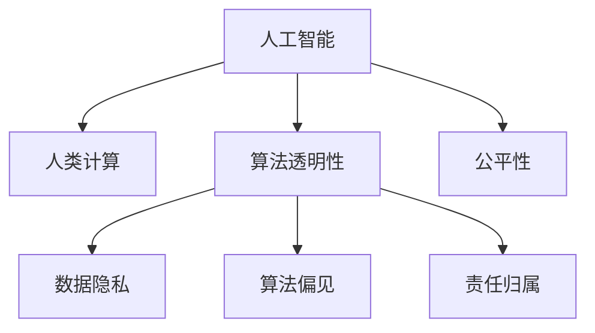

                 

# AI驱动的创新：人类计算在商业中的道德考虑因素与趋势预测

## 1. 背景介绍

### 1.1 问题由来

在信息时代，人类计算（Human Computation）以独特的智能方式重新定义了商业生态系统的运作模式。从海量数据的处理到复杂决策的辅助，人工智能（AI）驱动的创新为商业带来前所未有的效率与能力。然而，伴随其快速发展的背后，一系列伦理、法律、社会问题开始涌现。诸如隐私侵犯、数据滥用、算法偏见、就业替代等，这些问题不仅阻碍了AI技术的健康发展，还威胁到公众利益与社会稳定。如何在追求技术创新与经济效益的同时，兼顾道德伦理的底线，成为商业界亟需解决的重大课题。

### 1.2 问题核心关键点

人工智能驱动的商业创新，归根结底是人机交互中复杂的算法、数据与道德伦理之间的平衡问题。核心点包括：
1. 数据隐私：如何确保用户数据的安全与隐私不被滥用。
2. 算法透明：如何保证算法的决策过程可以被理解和解释，避免"黑盒"操作。
3. 公平性：如何设计算法以避免对特定群体的不公平待遇。
4. 责任归属：当AI系统出现错误时，责任由谁承担。
5. 就业影响：AI自动化对传统就业岗位的替代如何处理。

### 1.3 问题研究意义

研究人类计算在商业中的道德考虑，不仅有助于提升AI技术的安全性和可控性，还能增强公众对AI的信任感，推动社会公平和谐。具体而言：

1. 保障商业创新可持续：确保AI驱动的商业应用在尊重隐私、遵守法规的前提下进行。
2. 提升企业竞争力：负责任的商业创新实践能够增强企业品牌形象，赢得用户信任。
3. 优化社会资源配置：通过公平的AI算法，实现社会资源的合理分配，缩小数字鸿沟。
4. 促进就业转型：在AI替代部分传统岗位的同时，创造新的工作机会。

## 2. 核心概念与联系

### 2.1 核心概念概述

为深入理解人类计算在商业中的道德考虑，本节将介绍几个关键概念：

- 人工智能（Artificial Intelligence, AI）：模拟人类智能行为的技术，通过计算算法与数据学习来实现复杂决策。
- 人类计算（Human Computation）：结合人类直觉与算法计算的技术，提高决策的准确性与效率。
- 算法透明性（Algorithmic Transparency）：确保算法的决策过程可被理解和解释，增强信任感。
- 数据隐私（Data Privacy）：保护用户数据不被未授权访问和滥用。
- 算法偏见（Algorithmic Bias）：算法在训练数据中学习到的歧视性特征，可能导致不公平的决策。
- 责任归属（Accountability）：明确AI系统在决策过程中的责任人。

这些概念之间的联系可以通过以下Mermaid流程图来展示：



这个流程图展示了几大关键概念之间的关系：

1. 人工智能通过人类计算的辅助，提升了决策能力。
2. 算法透明性、数据隐私和算法偏见均是AI决策过程的重要考量因素。
3. 责任归属涉及算法在决策中的责任归属问题。
4. 公平性是AI设计中需要特别关注的问题。

这些概念共同构成了AI技术在商业应用中的道德伦理框架，帮助在技术创新与道德底线之间找到平衡。

## 3. 核心算法原理 & 具体操作步骤
### 3.1 算法原理概述

AI驱动的商业创新，本质上是通过计算模型学习并应用人类知识与数据，以自动化或辅助决策。算法的设计与实现，涉及到多个方面的道德伦理考量。

AI算法的核心原理可以简单概括为：

1. 数据收集与预处理：从不同数据源收集数据，并进行清洗、处理，确保数据的完整性与一致性。
2. 模型训练：通过深度学习、强化学习等技术对数据进行训练，形成能够执行特定任务的模型。
3. 模型评估与微调：在特定数据集上评估模型性能，并根据评估结果进行模型参数的微调，以提高模型的预测准确率。
4. 模型部署与应用：将训练好的模型部署到生产环境，供业务流程使用，并不断收集反馈进行迭代改进。

在整个过程中，需特别关注数据隐私、算法透明、公平性等问题。

### 3.2 算法步骤详解

AI驱动的商业创新步骤通常包括以下几个关键环节：

**Step 1: 数据收集与预处理**
- 收集多来源数据，包括用户行为数据、市场数据、公共数据等。
- 进行数据清洗、去重、归一化，确保数据的质量和一致性。
- 处理敏感数据，如去标识化处理，确保数据隐私。

**Step 2: 数据探索与特征工程**
- 利用统计分析、数据可视化等手段，进行数据探索，了解数据分布特征。
- 根据业务需求，设计合适的特征，进行特征工程，如特征选择、降维、编码等。

**Step 3: 模型设计与训练**
- 选择合适的算法模型，如深度神经网络、支持向量机、随机森林等。
- 设计合适的损失函数和优化器，进行模型训练。
- 引入正则化、dropout等技术，防止过拟合。

**Step 4: 模型评估与微调**
- 在验证集上评估模型性能，如准确率、召回率、F1-score等。
- 根据评估结果，进行模型微调，优化模型参数。
- 引入对抗样本、数据增强等技术，提高模型鲁棒性。

**Step 5: 模型部署与应用**
- 将训练好的模型部署到生产环境，如云服务、服务器等。
- 进行模型监控，定期评估模型性能。
- 根据反馈，不断优化模型，提升预测准确率。

### 3.3 算法优缺点

AI驱动的商业创新具有以下优点：
1. 高效性：AI算法能够快速处理海量数据，提高决策效率。
2. 精确性：AI模型通过训练，能够提高决策的准确性和稳定性。
3. 可扩展性：AI算法适用于各种规模和类型的商业应用，具有较高的灵活性。
4. 创新能力：AI技术的不断发展，为商业创新提供源源不断的动力。

同时，AI驱动的商业创新也存在一定的局限性：
1. 技术门槛高：AI算法设计与实现需要较高的专业知识和技能。
2. 数据依赖性强：AI系统依赖大量高质量数据，数据获取和处理成本高。
3. 道德伦理问题：AI决策过程中可能出现数据隐私、算法偏见等问题，需严格监管。
4. 就业影响大：AI自动化可能导致部分岗位被替代，带来就业风险。
5. 维护成本高：AI系统维护和更新成本较高，需持续投入资源。

### 3.4 算法应用领域

AI驱动的商业创新应用广泛，包括但不限于以下领域：

1. 市场营销：利用用户行为数据分析，实现个性化推荐和精准广告投放。
2. 客户服务：通过智能客服、机器人客服，提升客户体验和服务效率。
3. 供应链管理：通过预测分析，优化库存管理、物流规划，提高运营效率。
4. 财务分析：利用算法分析市场趋势，提供投资建议和风险控制。
5. 医疗健康：通过图像识别、自然语言处理等技术，提升医疗诊断和治疗效果。
6. 人力资源管理：通过智能招聘、绩效评估，优化人力资源配置和管理。

## 4. 数学模型和公式 & 详细讲解 & 举例说明

### 4.1 数学模型构建

在商业AI应用中，常用的数学模型包括线性回归、逻辑回归、决策树、随机森林、神经网络等。这里以线性回归模型为例，进行详细讲解。

假设要预测销售量 $Y$，与多个因素 $X_i$（如广告投入、促销活动、季节性等）有关。线性回归模型表示为：

$$
Y = \beta_0 + \beta_1X_1 + \beta_2X_2 + ... + \beta_nX_n + \epsilon
$$

其中 $\beta_i$ 为回归系数，$\epsilon$ 为误差项。

### 4.2 公式推导过程

线性回归的推导过程包括：
1. 线性假设：假设数据符合线性关系，即 $Y$ 与 $X_i$ 线性相关。
2. 最小二乘法：通过最小化残差平方和，求解 $\beta_i$。
3. 正则化：引入正则化项，防止过拟合。

最小二乘法的推导过程如下：

1. 残差平方和：$SSE = \sum_{i=1}^{n}(y_i - (\beta_0 + \beta_1x_{1i} + \beta_2x_{2i} + ... + \beta_nx_{ni}))^2$
2. 对 $\beta_i$ 求导并令导数为0：$\frac{\partial SSE}{\partial \beta_i} = 0$
3. 解方程组求得 $\beta_i$ 的值。

### 4.3 案例分析与讲解

假设某电商平台的销售数据为：
- 广告投入 $X_1$：500, 700, 800, 900, 1000元
- 促销活动 $X_2$：0, 1, 1, 1, 0
- 销售量 $Y$：100, 200, 300, 400, 500件

通过最小二乘法，求解回归系数 $\beta_0, \beta_1, \beta_2$。

1. 残差平方和 $SSE$ 为 $4000$
2. 求解方程组 $\beta_0 + 500\beta_1 + 700\beta_2 = 100$
3. 求解得到 $\beta_0 = 0, \beta_1 = 0.1, \beta_2 = 0.3$

因此，回归方程为 $Y = 0.1X_1 + 0.3X_2$。

利用此模型，可以对未来的广告投入和促销活动进行预测，以优化销售策略。

## 5. 项目实践：代码实例和详细解释说明
### 5.1 开发环境搭建

要进行AI驱动的商业创新项目实践，首先需要搭建开发环境。以下是使用Python进行TensorFlow开发的环境配置流程：

1. 安装Anaconda：从官网下载并安装Anaconda，用于创建独立的Python环境。
2. 创建并激活虚拟环境：
```bash
conda create -n tf-env python=3.8 
conda activate tf-env
```

3. 安装TensorFlow：根据CUDA版本，从官网获取对应的安装命令。例如：
```bash
conda install tensorflow=2.6 -c tensorflow -c conda-forge
```

4. 安装各类工具包：
```bash
pip install numpy pandas scikit-learn matplotlib tqdm jupyter notebook ipython
```

完成上述步骤后，即可在`tf-env`环境中开始项目实践。

### 5.2 源代码详细实现

下面我以线性回归模型为例，给出使用TensorFlow进行商业销售预测的代码实现。

```python
import tensorflow as tf
import numpy as np
import matplotlib.pyplot as plt

# 准备数据
X = np.array([[500, 0], [700, 1], [800, 1], [900, 1], [1000, 0]])
y = np.array([100, 200, 300, 400, 500])

# 定义模型
model = tf.keras.Sequential([
    tf.keras.layers.Dense(1, input_shape=(2,))
])

# 编译模型
model.compile(optimizer=tf.keras.optimizers.Adam(learning_rate=0.01),
              loss='mse')

# 训练模型
model.fit(X, y, epochs=100, verbose=0)

# 预测结果
X_test = np.array([[600, 1], [800, 1]])
y_pred = model.predict(X_test)

# 输出预测结果
print(y_pred)

# 绘制学习曲线
history = model.history
plt.plot(history.epoch, history.loss)
plt.show()
```

### 5.3 代码解读与分析

让我们再详细解读一下关键代码的实现细节：

**准备数据**：
- 利用numpy生成训练数据集。

**定义模型**：
- 使用Keras API定义一个单层线性回归模型。

**编译模型**：
- 使用Adam优化器，设定学习率为0.01，使用均方误差损失函数。

**训练模型**：
- 在训练集上训练模型，设定训练次数为100次。

**预测结果**：
- 使用训练好的模型对新数据进行预测。

**输出预测结果**：
- 输出模型预测的销售量。

**绘制学习曲线**：
- 使用Keras提供的`history`对象，绘制损失函数随训练次数的变化曲线。

可以看出，通过TensorFlow进行线性回归模型的训练与预测，操作简便，易于理解和调整。

## 6. 实际应用场景
### 6.1 智能营销

基于AI驱动的商业创新，智能营销成为新时代的商业利器。通过分析用户行为数据，智能营销可以提供个性化的广告投放策略，提升广告转化率和用户满意度。

例如，电商平台可以利用用户的浏览、点击、购买行为数据，进行深度学习，预测用户对某商品的购买意向。然后根据预测结果，优化广告投放策略，实现精准营销。

### 6.2 供应链管理

AI驱动的供应链管理，能够通过预测分析优化库存、物流规划，提升运营效率，降低运营成本。

例如，利用时间序列分析和深度学习模型，预测不同商品在未来一段时间的销售量。基于预测结果，合理规划库存，避免缺货和积压，提高供应链的整体响应速度。

### 6.3 智能客服

智能客服系统通过自然语言处理技术，实现与用户的自动对话，提高客户服务的效率和质量。

例如，通过分析历史客服对话记录，训练深度学习模型，实现对话生成和语义理解。将微调后的模型应用到实时客户咨询，能够快速响应客户需求，提供满意的客户服务。

### 6.4 未来应用展望

随着AI技术的不断发展，基于AI驱动的商业创新将带来更多变革性影响：

1. 智能决策：通过深度学习和大数据分析，实现决策自动化，提高商业决策的效率和准确性。
2. 个性化服务：利用用户行为数据，实现个性化推荐和服务，提升用户体验。
3. 运营优化：通过预测分析，优化供应链管理、库存控制、物流规划，降低运营成本。
4. 自动化办公：引入自然语言处理和机器人流程自动化，实现办公自动化，提升办公效率。

这些应用场景展示了AI驱动的商业创新的巨大潜力，未来必将在更多领域大放异彩。

## 7. 工具和资源推荐
### 7.1 学习资源推荐

为了帮助开发者系统掌握AI驱动的商业创新的理论基础和实践技巧，这里推荐一些优质的学习资源：

1. 《深度学习》书籍：Ian Goodfellow等著作，全面介绍了深度学习的基本概念、算法与实现。
2. 《机器学习实战》书籍：Peter Harrington著，通过实践项目深入讲解了机器学习的应用。
3. TensorFlow官方文档：Google开发的开源深度学习框架，提供丰富的API和样例，助力项目开发。
4. Kaggle平台：数据科学竞赛平台，通过实际项目练习，提高实战能力。
5. Coursera平台：提供各类深度学习和AI课程，涵盖基础知识与高级实践。

通过对这些资源的学习实践，相信你一定能够快速掌握AI驱动的商业创新的精髓，并用于解决实际的商业问题。

### 7.2 开发工具推荐

高效的开发离不开优秀的工具支持。以下是几款用于AI驱动的商业创新开发的常用工具：

1. TensorFlow：Google主导的深度学习框架，支持多种模型和算法，功能强大。
2. PyTorch：Facebook开发的深度学习框架，易于使用，适合研究和原型开发。
3. Jupyter Notebook：交互式编程环境，支持Python、R等多种语言，方便数据处理和模型训练。
4. Kaggle平台：数据科学竞赛平台，提供丰富的数据集和开源项目，方便学习与实践。
5. Google Colab：谷歌提供的免费GPU和TPU计算资源，方便开发者进行模型训练和实验。

合理利用这些工具，可以显著提升AI驱动的商业创新项目的开发效率，加快创新迭代的步伐。

### 7.3 相关论文推荐

AI驱动的商业创新涉及的理论与实践问题复杂多样，相关研究涉及多个学科领域。以下是几篇奠基性的相关论文，推荐阅读：

1. 《深度学习》（Deep Learning）：Ian Goodfellow等著，深度学习领域的经典之作，介绍了深度学习的基本概念和算法。
2. 《机器学习：原理、算法与应用》（Machine Learning: A Probabilistic Perspective）：Tom Mitchell著，从概率视角全面介绍了机器学习的基本概念和算法。
3. 《自然语言处理综论》（Speech and Language Processing）：Daniel Jurafsky等著，涵盖了自然语言处理的基本概念和算法。

这些论文代表了大规模深度学习和AI驱动的商业创新技术的发展脉络。通过学习这些前沿成果，可以帮助研究者把握学科前进方向，激发更多的创新灵感。

## 8. 总结：未来发展趋势与挑战
### 8.1 总结

本文对AI驱动的商业创新进行了全面系统的介绍。首先阐述了AI技术在商业中的重要性和道德考量，明确了AI驱动的商业创新在提升效率、优化决策、提升用户体验等方面的价值。其次，从原理到实践，详细讲解了AI算法的核心步骤，给出了实际应用中的代码实例。同时，本文还探讨了AI驱动的商业创新在多个行业领域的应用前景，展示了其巨大的潜力。

通过本文的系统梳理，可以看到，AI驱动的商业创新正在改变传统的商业运作模式，带来前所未有的效率与能力提升。未来，伴随技术的不断演进，AI在商业中的应用将更加广泛和深入，为人类的生活和工作带来更多便利和变革。

### 8.2 未来发展趋势

展望未来，AI驱动的商业创新将呈现以下几个发展趋势：

1. 智能化决策：通过深度学习和数据分析，实现决策自动化，提升决策效率和准确性。
2. 个性化服务：利用用户行为数据，实现个性化推荐和服务，提升用户体验。
3. 运营优化：通过预测分析，优化供应链管理、库存控制、物流规划，降低运营成本。
4. 自动化办公：引入自然语言处理和机器人流程自动化，实现办公自动化，提升办公效率。

### 8.3 面临的挑战

尽管AI驱动的商业创新取得了显著进展，但在迈向更加智能化、普适化应用的过程中，它仍面临诸多挑战：

1. 技术门槛高：AI算法设计与实现需要较高的专业知识和技能。
2. 数据依赖性强：AI系统依赖大量高质量数据，数据获取和处理成本高。
3. 道德伦理问题：AI决策过程中可能出现数据隐私、算法偏见等问题，需严格监管。
4. 就业影响大：AI自动化可能导致部分岗位被替代，带来就业风险。
5. 维护成本高：AI系统维护和更新成本较高，需持续投入资源。

### 8.4 研究展望

面对AI驱动的商业创新所面临的挑战，未来的研究需要在以下几个方面寻求新的突破：

1. 开发更加高效和可解释的算法，降低技术门槛，提高AI系统的可靠性。
2. 设计更加公平和透明的算法，确保数据隐私，避免算法偏见。
3. 引入更多先验知识，提高AI系统的普适性和鲁棒性。
4. 建立AI系统的伦理审查机制，确保AI决策符合人类价值观。
5. 开发跨领域、跨模态的AI系统，拓展AI的应用边界。

这些研究方向的探索，必将引领AI驱动的商业创新技术迈向更高的台阶，为构建智能化的商业生态系统提供坚实基础。面向未来，AI驱动的商业创新需要更多跨学科的协作和探索，共同推动技术的进步与应用。

## 9. 附录：常见问题与解答

**Q1：AI驱动的商业创新是否适用于所有行业？**

A: AI驱动的商业创新在大多数行业中都有广泛的应用潜力。例如，医疗、金融、教育、零售等行业，都可以利用AI提升效率、优化决策、改善用户体验。然而，不同行业的应用场景和挑战各有不同，需要针对性地设计算法和模型。

**Q2：如何选择合适的AI算法？**

A: 选择合适的AI算法，需要根据业务需求和数据特征进行综合考虑：
1. 数据类型：不同类型的数据（结构化、半结构化、非结构化）适合不同的算法。
2. 数据量：大数据适合使用深度学习算法，小数据适合使用传统机器学习算法。
3. 任务类型：分类、回归、聚类等不同类型的任务适合不同的算法。
4. 算法性能：考虑算法的训练时间、计算资源需求、预测准确率等因素。

**Q3：AI驱动的商业创新对就业有何影响？**

A: AI驱动的商业创新对就业的影响是多方面的：
1. 替代效应：自动化和智能化可能导致部分传统岗位被替代。
2. 创造效应：AI技术的应用也会创造新的就业岗位，如数据科学家、AI工程师、AI伦理专家等。
3. 培训效应：AI技术的发展需要大量的技术人才，推动教育和培训市场的发展。

**Q4：如何确保AI算法的公平性？**

A: 确保AI算法的公平性，需要从数据、算法、模型部署等多个方面进行综合考虑：
1. 数据公平：确保数据集不包含歧视性数据，平衡不同群体的样本分布。
2. 算法透明：设计可解释的算法，避免"黑盒"操作，增强决策透明度。
3. 模型监控：定期评估模型性能，及时发现和纠正算法偏见。

这些措施可以确保AI算法在决策过程中不产生歧视性，提升算法的公平性和可信度。

**Q5：AI驱动的商业创新如何兼顾经济效益与社会责任？**

A: 在追求经济效益的同时，AI驱动的商业创新需要兼顾社会责任：
1. 数据隐私：确保用户数据的安全与隐私不被滥用，尊重用户的隐私权。
2. 算法透明：设计可解释的算法，增强决策透明度，避免"黑盒"操作。
3. 公平性：确保算法不产生歧视性，公平对待不同群体。
4. 责任归属：明确AI系统在决策过程中的责任人，确保责任可追溯。
5. 就业影响：评估AI自动化对就业的影响，采取相应措施，减少负面影响。

这些措施可以在确保经济效益的同时，兼顾社会责任，推动AI技术健康发展。

---

作者：禅与计算机程序设计艺术 / Zen and the Art of Computer Programming

