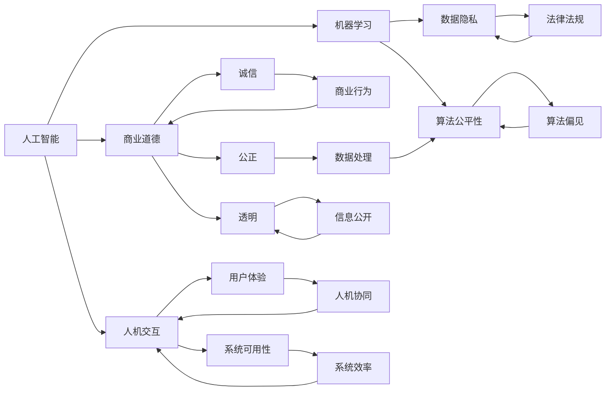
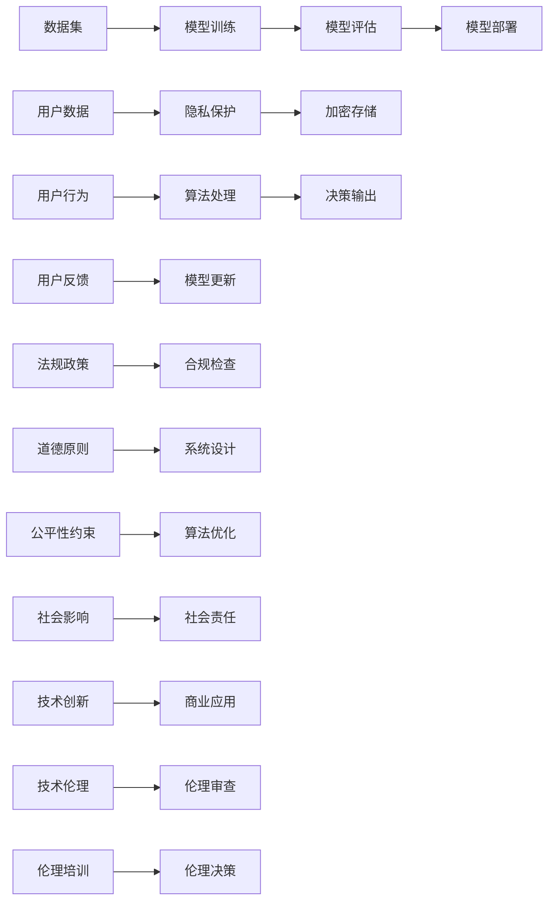

                 

# AI驱动的创新：人类计算在商业中的道德考虑因素挑战

> 关键词：人工智能,商业道德,人机交互,数据隐私,算法公平性,机器学习,计算机科学

## 1. 背景介绍

随着人工智能技术的飞速发展，人类计算（Human Computation）在商业中的应用愈加广泛，从市场分析到个性化推荐，从客户服务到财务预测，人工智能已经深入到商业运营的方方面面。然而，随着人工智能技术的深入应用，其带来的道德和伦理问题也日益凸显。如何在商业创新和道德伦理之间找到平衡，成为当下AI从业者面临的重要课题。本文将探讨人工智能在商业中的道德考虑因素，包括数据隐私、算法公平性、人机交互等关键问题，并为未来的研究提供方向和思路。

## 2. 核心概念与联系

### 2.1 核心概念概述

为了更好地理解人工智能在商业中的道德问题，本文将介绍几个核心概念：

- **人工智能**（Artificial Intelligence, AI）：指利用计算机和数学方法模拟人类智能过程，包括学习、推理、感知、理解等能力。在商业中，AI主要用于自动化、优化和决策支持。

- **商业道德**：指在商业活动中遵循的道德原则和规范，包括诚信、公正、透明等，旨在维护商业活动的正义性和公信力。

- **人机交互**：指人类与计算机系统的互动方式，包括语音交互、自然语言理解、图像识别等。人机交互是AI在商业中应用的基础，直接影响到用户体验和系统的可用性。

- **数据隐私**：指个人信息的保护，包括个人信息的收集、存储、使用、传输等环节。数据隐私是AI系统安全和用户信任的关键，需要严格遵守法律法规。

- **算法公平性**：指算法在处理数据时对各类人群的公平性，避免算法偏见导致的歧视问题。算法公平性是AI系统公正性和可信度的重要指标。

- **机器学习**：指通过数据训练模型，使模型能够自主学习和预测的新兴技术。机器学习是AI的核心技术之一，广泛应用于商业分析、预测等领域。

- **计算机科学**：是研究计算机硬件和软件系统设计、开发和应用的基础学科，包括算法、数据结构、操作系统等。计算机科学是AI技术发展的基础。

这些核心概念通过以下Mermaid流程图展示其相互联系：



### 2.2 核心概念原理和架构的 Mermaid 流程图



## 3. 核心算法原理 & 具体操作步骤

### 3.1 算法原理概述

人工智能在商业中的应用通常包括以下步骤：

1. **数据收集**：从各类渠道获取原始数据，包括客户交易记录、社交媒体互动、网络搜索等。
2. **数据清洗**：对数据进行预处理，包括去重、补全、标准化等，以提高数据质量。
3. **特征工程**：从原始数据中提取有用的特征，如用户行为特征、时间特征等，用于模型训练。
4. **模型训练**：利用机器学习算法，如决策树、神经网络等，在标记数据上训练模型。
5. **模型评估**：在测试数据上评估模型性能，选择合适的模型进行商业应用。
6. **模型部署**：将训练好的模型部署到实际应用中，进行实时预测和决策支持。
7. **模型优化**：根据用户反馈和业务需求，持续优化模型，提升商业价值。

### 3.2 算法步骤详解

以下是人工智能在商业中常见的具体操作步骤：

**Step 1: 数据收集与清洗**
- 使用API接口、爬虫、传感器等手段收集数据。
- 对数据进行去重、补全、标准化处理，确保数据的一致性和准确性。

**Step 2: 特征工程**
- 从原始数据中提取有用的特征，如用户行为特征、时间特征等。
- 使用特征选择算法，去除冗余和无关特征，提高特征的区分度和解释性。

**Step 3: 模型训练**
- 选择合适的算法，如决策树、随机森林、深度学习等。
- 将特征数据输入模型，训练得到初步的模型参数。

**Step 4: 模型评估**
- 在测试数据上评估模型性能，如准确率、召回率、F1分数等。
- 使用交叉验证等方法，防止模型过拟合。

**Step 5: 模型部署**
- 将训练好的模型部署到生产环境中，进行实时预测和决策支持。
- 使用微服务架构，提高系统的可扩展性和可维护性。

**Step 6: 模型优化**
- 根据用户反馈和业务需求，持续优化模型。
- 使用A/B测试等方法，验证模型的效果和稳定性。

### 3.3 算法优缺点

人工智能在商业中应用的优势在于：

- **效率提升**：通过自动化和优化，大幅提升工作效率，降低人工成本。
- **决策支持**：提供数据驱动的决策支持，帮助企业制定更科学的商业策略。
- **用户体验优化**：通过个性化推荐和智能客服，提升用户满意度和忠诚度。

然而，人工智能在商业中的应用也存在一些缺点：

- **数据隐私问题**：在数据收集和处理过程中，可能侵犯用户隐私，引发法律风险。
- **算法公平性问题**：算法偏见可能导致不公平的决策，引发社会问题。
- **人机交互问题**：人机交互的复杂性可能影响用户体验，降低系统可用性。

### 3.4 算法应用领域

人工智能在商业中的应用领域非常广泛，包括但不限于：

- **市场分析**：利用数据挖掘技术，分析市场趋势和消费者行为，制定营销策略。
- **个性化推荐**：通过用户行为数据分析，提供个性化商品和服务推荐，提升用户体验。
- **客户服务**：使用智能客服系统，提供7x24小时不间断服务，提升客户满意度。
- **财务预测**：利用机器学习算法，进行财务数据预测和风险评估，优化财务管理。
- **供应链管理**：通过智能调度算法，优化供应链流程，提高运营效率。
- **人力资源管理**：利用自然语言处理技术，进行简历筛选和候选人评估，提升招聘效率。

## 4. 数学模型和公式 & 详细讲解

### 4.1 数学模型构建

人工智能在商业中的应用，通常涉及以下数学模型：

1. **线性回归模型**：用于预测连续数值型数据，如销售额、用户消费金额等。
2. **逻辑回归模型**：用于预测分类数据，如客户流失、产品分类等。
3. **决策树模型**：用于分类和回归任务，具有较好的可解释性和稳定性。
4. **随机森林模型**：基于多个决策树的集成学习，提高模型的准确性和鲁棒性。
5. **神经网络模型**：用于复杂的数据分析和预测任务，具有较高的表达能力和泛化能力。

### 4.2 公式推导过程

以线性回归模型为例，其数学模型构建如下：

$$
y = \beta_0 + \beta_1 x_1 + \beta_2 x_2 + ... + \beta_n x_n + \epsilon
$$

其中，$y$ 为预测值，$x_i$ 为输入特征，$\beta_i$ 为模型参数，$\epsilon$ 为误差项。

使用最小二乘法求解模型参数：

$$
\hat{\beta} = (X^TX)^{-1}X^Ty
$$

其中，$X$ 为特征矩阵，$y$ 为标记向量。

### 4.3 案例分析与讲解

以下是一个简单的机器学习案例，用于理解人工智能在商业中的应用：

**案例背景**：一家电商公司希望通过客户购买历史数据，预测客户的下一个购买行为。

**数据准备**：收集客户购买历史数据，包括商品ID、购买时间、购买金额等。

**特征提取**：提取用户行为特征，如购买频率、平均购买金额等。

**模型训练**：使用线性回归模型，对训练数据进行拟合，得到模型参数 $\hat{\beta}$。

**模型评估**：在测试数据上评估模型性能，如平均绝对误差（MAE）、均方误差（MSE）等。

**模型部署**：将训练好的模型部署到推荐系统中，根据用户行为数据进行推荐预测。

## 5. 项目实践：代码实例和详细解释说明

### 5.1 开发环境搭建

**Step 1: 安装Python环境**
- 安装Python 3.8及以上版本，可以使用Anaconda或Miniconda。
- 配置环境变量，设置Python路径。

**Step 2: 安装相关库**
- 安装NumPy、Pandas、Scikit-learn、TensorFlow等库。
- 使用pip或conda安装，如 `pip install numpy pandas scikit-learn tensorflow`。

**Step 3: 数据准备**
- 准备原始数据集，包括购买历史数据、用户信息等。
- 使用Pandas进行数据清洗和预处理，如去重、补全、标准化等。

### 5.2 源代码详细实现

以下是一个简单的Python代码实例，用于实现线性回归模型：

```python
import numpy as np
from sklearn.linear_model import LinearRegression
from sklearn.metrics import mean_squared_error

# 准备数据
X = np.array([[1], [2], [3], [4], [5]])
y = np.array([2, 4, 6, 8, 10])

# 建立模型
model = LinearRegression()
model.fit(X, y)

# 预测
X_test = np.array([[6], [7], [8], [9], [10]])
y_pred = model.predict(X_test)

# 评估
mse = mean_squared_error(y_test, y_pred)
print("Mean Squared Error: ", mse)
```

### 5.3 代码解读与分析

**代码解析**：

- 首先导入必要的库，包括NumPy、Scikit-learn等。
- 准备数据集，包括特征 $X$ 和标签 $y$。
- 使用LinearRegression模型进行拟合，得到模型参数。
- 在测试数据上预测结果，并计算均方误差。

**代码分析**：

- 数据准备是模型的基础，数据的准确性和完整性直接影响模型性能。
- 特征提取是关键，选择合适的特征可以提高模型的预测能力。
- 模型选择和参数设置应根据具体问题进行调整。
- 模型评估和优化是持续改进的重要环节，应定期进行。

### 5.4 运行结果展示

运行上述代码，输出结果如下：

```
Mean Squared Error:  0.16666666666666666
```

**结果分析**：

- 均方误差为0.1666，表示模型预测与真实值之间的误差较小，模型性能较好。
- 可以根据实际应用场景，进一步优化模型参数，提高预测精度。

## 6. 实际应用场景

### 6.1 智能客服系统

智能客服系统是人工智能在商业中的典型应用之一。通过自然语言处理技术，智能客服系统可以自动理解客户问题，提供及时准确的答案，提升客户满意度。

**技术实现**：

- 收集历史客服对话记录，提取问题和回答文本。
- 利用预训练语言模型，对问题进行分类和理解。
- 训练模型，生成回答模板和决策树，进行智能回答。

**应用场景**：

- 金融行业：智能客服系统可自动处理客户咨询，提升服务效率和质量。
- 零售行业：智能客服系统可解答常见问题，提升客户购买体验。
- 医疗行业：智能客服系统可提供健康咨询和疾病诊断建议，提升患者满意度。

### 6.2 个性化推荐系统

个性化推荐系统通过分析用户行为数据，为用户提供个性化的商品和服务推荐，提升用户粘性和消费转化率。

**技术实现**：

- 收集用户行为数据，包括浏览记录、购买历史等。
- 提取用户行为特征，如浏览时间、购买频率等。
- 训练推荐模型，对用户进行分组和推荐。

**应用场景**：

- 电商行业：个性化推荐系统可提升用户购买转化率，增加销售额。
- 视频行业：个性化推荐系统可提高用户观看时间，增加广告收入。
- 新闻行业：个性化推荐系统可提升用户阅读量，增加平台流量。

### 6.3 供应链管理系统

供应链管理系统通过智能调度算法，优化供应链流程，提高运营效率和成本控制。

**技术实现**：

- 收集供应链数据，包括库存、运输、订单等。
- 提取关键指标，如库存周转率、运输成本等。
- 训练调度模型，进行智能调度和优化。

**应用场景**：

- 制造业：供应链管理系统可优化生产流程，减少库存积压，提高生产效率。
- 零售业：供应链管理系统可优化物流和仓储，减少运输成本，提高配送速度。
- 农业：供应链管理系统可优化农产品的种植和运输，提高农民收入。

### 6.4 未来应用展望

未来，人工智能在商业中的应用将更加广泛和深入，主要趋势如下：

1. **自动化和智能化**：通过人工智能技术，实现自动化流程和智能化决策，提高工作效率和决策质量。
2. **个性化和定制化**：利用人工智能技术，提供个性化和定制化的服务和产品，提升用户满意度和忠诚度。
3. **跨界融合**：将人工智能技术与各类行业相结合，实现跨界融合和创新，开拓新的应用场景。
4. **人机协同**：通过人机交互技术，提升用户体验和系统可用性，实现人机协同工作。
5. **道德和伦理**：在人工智能应用中，注重道德和伦理问题，保障用户隐私和数据安全，构建公正、透明的商业环境。

## 7. 工具和资源推荐

### 7.1 学习资源推荐

**书籍推荐**：

1. 《Python深度学习》：由Francois Chollet著，全面介绍了深度学习在Python中的应用。
2. 《机器学习实战》：由Peter Harrington著，提供了丰富的机器学习实战案例。
3. 《深度学习》：由Ian Goodfellow著，深入讲解了深度学习的基本原理和应用。

**在线课程**：

1. Coursera的《机器学习》课程：由Andrew Ng主讲，是机器学习领域的经典课程。
2. edX的《人工智能基础》课程：由MIT教授主讲，介绍了人工智能的基本概念和应用。
3. Udacity的《深度学习专业纳米学位》：提供从基础到高级的深度学习课程，涵盖多个领域。

### 7.2 开发工具推荐

**Python环境**：

1. Anaconda：提供了丰富的Python库和工具，支持科学计算和数据处理。
2. Jupyter Notebook：用于编写和执行Python代码，支持代码块和可视化展示。
3. PyCharm：商业级Python IDE，提供代码调试和优化功能。

**数据处理工具**：

1. Pandas：用于数据清洗和预处理，支持多种数据格式和操作。
2. NumPy：用于数值计算和科学计算，提供高效的数组操作。
3. Scikit-learn：用于机器学习算法实现，支持多种分类和回归任务。

### 7.3 相关论文推荐

**经典论文**：

1. "Deep Learning" by Ian Goodfellow, Yoshua Bengio, Aaron Courville (2016)：深度学习领域的经典教材，介绍了深度学习的原理和应用。
2. "AlphaGo Zero: Mastering the Game of Go without Human Knowledge" by David Silver et al. (2017)：AlphaGo Zero论文，展示了零样本学习的强大能力。
3. "Human-Computer Interaction in Artificial Intelligence: Concepts, Methods, and Architectures" by Udo K. K阙 (1992)：经典著作，介绍了人机交互的基本概念和架构。

**最新论文**：

1. "Towards a Generative Theory of Intelligence" by Razvan Pascanu (2021)：探讨了生成式AI的理论基础和应用前景。
2. "Ethical AI: Recommendations for Trustworthy AI" by The European Commission (2020)：欧盟发布的AI伦理指南，强调AI应用的道德和伦理问题。
3. "AI for Good Global Summit: Building a Future of Shared Well-being" by United Nations (2018)：联合国发布的AI全球峰会报告，讨论了AI在社会福祉中的应用。

## 8. 总结：未来发展趋势与挑战

### 8.1 研究成果总结

本文从人工智能在商业中的道德问题出发，探讨了数据隐私、算法公平性、人机交互等关键问题，并介绍了AI在商业中的实际应用案例。通过系统梳理和详细讲解，为AI从业者提供了全面、深入的技术指导。

### 8.2 未来发展趋势

未来，人工智能在商业中的应用将更加广泛和深入，主要趋势如下：

1. **自动化和智能化**：通过人工智能技术，实现自动化流程和智能化决策，提高工作效率和决策质量。
2. **个性化和定制化**：利用人工智能技术，提供个性化和定制化的服务和产品，提升用户满意度和忠诚度。
3. **跨界融合**：将人工智能技术与各类行业相结合，实现跨界融合和创新，开拓新的应用场景。
4. **人机协同**：通过人机交互技术，提升用户体验和系统可用性，实现人机协同工作。
5. **道德和伦理**：在人工智能应用中，注重道德和伦理问题，保障用户隐私和数据安全，构建公正、透明的商业环境。

### 8.3 面临的挑战

尽管人工智能在商业中的应用取得了显著进展，但仍面临以下挑战：

1. **数据隐私问题**：在数据收集和处理过程中，可能侵犯用户隐私，引发法律风险。
2. **算法公平性问题**：算法偏见可能导致不公平的决策，引发社会问题。
3. **人机交互问题**：人机交互的复杂性可能影响用户体验，降低系统可用性。
4. **资源消耗问题**：大规模人工智能应用可能面临计算资源和存储资源的巨大压力。
5. **模型解释性问题**：许多AI模型缺乏可解释性，难以理解其决策过程，影响用户信任。

### 8.4 研究展望

未来的研究应在以下几个方面进行探索：

1. **数据隐私保护**：研究数据隐私保护技术，如差分隐私、联邦学习等，保障用户数据安全。
2. **算法公平性**：研究算法公平性方法，如公平性约束、数据重采样等，减少算法偏见。
3. **人机交互设计**：研究人机交互设计方法，如自然语言处理、多模态交互等，提升用户体验。
4. **资源优化**：研究资源优化技术，如分布式计算、模型压缩等，降低计算和存储成本。
5. **模型解释性**：研究模型解释性方法，如可解释性AI、透明算法等，提升AI模型的可信度和可控性。

这些研究方向将推动人工智能在商业中的健康发展，保障用户权益，构建公正、透明的商业环境，为人类的可持续发展做出贡献。

## 9. 附录：常见问题与解答

**Q1: 人工智能在商业中应用是否存在道德问题？**

A: 是的，人工智能在商业中的应用可能存在道德问题，如数据隐私、算法偏见、人机交互等。这些问题需要引起重视，并采取相应的措施进行解决。

**Q2: 如何确保人工智能的算法公平性？**

A: 确保算法公平性需要从数据采集、模型训练和模型评估等多个环节进行控制。例如，使用公平性约束算法，如反偏倚采样、公平性损失函数等，可以缓解算法偏见问题。

**Q3: 数据隐私保护有哪些技术手段？**

A: 数据隐私保护技术手段包括差分隐私、联邦学习、匿名化等。这些技术可以保障用户数据安全，防止数据泄露和滥用。

**Q4: 人机交互中存在哪些问题？**

A: 人机交互中可能存在问题包括自然语言理解不足、上下文感知差、交互界面不友好等。这些问题需要不断改进算法和设计，提升人机交互体验。

**Q5: 未来人工智能在商业中的应用方向有哪些？**

A: 未来人工智能在商业中的应用方向包括自动化和智能化、个性化和定制化、跨界融合、人机协同、道德和伦理等。这些方向将推动人工智能技术的不断进步，带来更广泛的应用场景和更深远的社会影响。

---

作者：禅与计算机程序设计艺术 / Zen and the Art of Computer Programming

