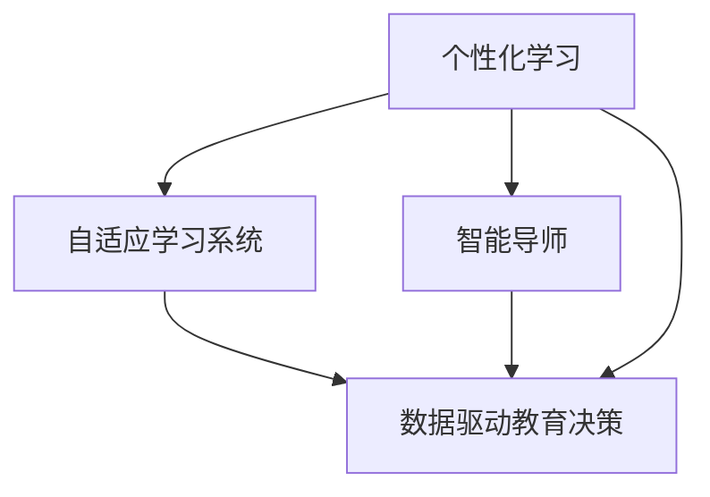

                 

## 1. 背景介绍

### 1.1 问题由来
人类计算，也称为人类计算能力(Human Computation Capability)，指的是人们通过直觉、经验、逻辑推理等非传统计算机算法解决问题的方式。相较于基于计算机算法的计算方式，人类计算具有灵活性、创造性和适应性，能够解决一些算法难以应对的复杂问题。

随着人工智能(AI)技术的飞速发展，人类计算在教育中的应用越来越广泛。在教育领域，传统的以教师讲授为主的教育模式逐渐向以学生自主学习为主的模式转变。这种转变不仅提高了教育效率，也激发了学生的主动性和创造力。人工智能技术的介入，使得教育资源更加丰富，教育形式更加多样，教育效果更加显著。

### 1.2 问题核心关键点
目前，人类计算在教育中的应用主要体现在以下几个方面：

- **个性化学习**：通过分析学生的学习行为和表现，利用人工智能技术为其定制个性化的学习计划，提高学习效率。
- **自适应学习系统**：基于机器学习算法，实时调整教学内容和难度，提供符合学生实际水平的学习材料。
- **智能导师**：利用自然语言处理(NLP)和图像识别等技术，为学生提供实时反馈和建议，辅助教师进行教学管理。
- **数据驱动的教育决策**：通过大数据分析，优化教育资源配置，提升教育公平性和质量。

本文将深入探讨人类计算在教育中的应用，重点分析其在个性化学习、自适应学习系统、智能导师和数据驱动教育决策等方面的应用，并对未来发展趋势和面临的挑战进行展望。

## 2. 核心概念与联系

### 2.1 核心概念概述

为更好地理解人类计算在教育中的应用，本节将介绍几个关键概念及其之间的关系：

- **个性化学习**：根据学生的兴趣、能力和学习进度，为其量身定制个性化的学习计划，提升学习效果。
- **自适应学习系统**：利用机器学习算法，动态调整教学内容和难度，确保学习材料始终符合学生的实际水平。
- **智能导师**：结合自然语言处理(NLP)和图像识别等技术，为学生提供实时反馈和建议，辅助教师教学。
- **数据驱动教育决策**：通过大数据分析，优化教育资源配置，提升教育公平性和质量。

这些核心概念之间存在着紧密的联系，共同构成了一个完整的教育技术生态系统。通过理解这些概念，我们可以更好地把握人类计算在教育中的应用方向。

### 2.2 核心概念原理和架构的 Mermaid 流程图



这个流程图展示了个性化学习、自适应学习系统、智能导师和数据驱动教育决策之间的联系：

1. 个性化学习是基础，通过分析学生的学习行为和表现，定制个性化的学习计划。
2. 自适应学习系统在此基础上，动态调整教学内容和难度，确保学习材料适合学生的实际水平。
3. 智能导师进一步利用NLP和图像识别技术，提供实时反馈和建议，辅助教师教学。
4. 数据驱动教育决策则通过对大数据的分析，优化教育资源配置，提升教育公平性和质量。

这些概念相互关联，共同推动了教育技术的创新和应用。

## 3. 核心算法原理 & 具体操作步骤
### 3.1 算法原理概述

人类计算在教育中的应用，本质上是通过人工智能技术，将人类计算的灵活性、创造性和适应性融入到教育系统中。其核心算法原理主要包括以下几个方面：

- **机器学习算法**：用于分析学生的学习行为和表现，为其定制个性化的学习计划。
- **自适应算法**：用于动态调整教学内容和难度，确保学习材料始终适合学生的水平。
- **自然语言处理(NLP)算法**：用于智能导师提供实时反馈和建议，辅助教师教学。
- **大数据分析算法**：用于优化教育资源配置，提升教育公平性和质量。

这些算法共同构成了人类计算在教育中的应用基础。

### 3.2 算法步骤详解

基于机器学习算法的人类计算在教育中的应用，一般包括以下几个关键步骤：

**Step 1: 数据收集与处理**

1. **收集数据**：通过在线学习平台、学习管理系统(LMS)、智能手环等设备，收集学生的学习行为数据，包括阅读时间、答题次数、作业完成情况等。
2. **数据清洗与预处理**：对收集到的数据进行清洗和预处理，去除噪声和异常值，保证数据质量。
3. **特征提取**：利用机器学习算法提取学生学习的关键特征，如学习进度、理解能力、知识掌握情况等。

**Step 2: 个性化学习计划生成**

1. **模型训练**：使用监督学习算法，如决策树、随机森林等，训练出用于预测学生学习行为的模型。
2. **个性化计划制定**：根据学生的学习行为和模型预测结果，生成个性化的学习计划，包括推荐的学习材料、建议的学习时间和难度等。

**Step 3: 自适应学习系统实施**

1. **学习路径规划**：基于学生的学习进度和理解能力，动态规划学习路径，调整教学内容的难度和顺序。
2. **实时反馈与调整**：根据学生的学习表现，实时调整学习内容和难度，确保学习材料始终适合学生的实际水平。

**Step 4: 智能导师辅助教学**

1. **问题解答**：利用NLP技术，智能导师能够回答学生在学习过程中遇到的问题，提供实时帮助。
2. **学习建议**：根据学生的学习进度和表现，智能导师能够提供个性化的学习建议，帮助学生提升学习效果。

**Step 5: 数据驱动教育决策**

1. **数据分析**：利用大数据分析算法，分析学生的学习行为和表现，发现学习规律和趋势。
2. **资源优化**：根据数据分析结果，优化教育资源的配置，提升教育公平性和质量。

### 3.3 算法优缺点

基于机器学习算法的人类计算在教育中的应用，具有以下优点：

1. **高效性**：通过数据分析和算法优化，能够快速生成个性化学习计划和自适应学习系统，提升学习效率。
2. **灵活性**：能够根据学生的学习行为和表现，动态调整教学内容和难度，适应不同学生的需求。
3. **实时性**：智能导师能够提供实时反馈和建议，辅助教师教学，提升教学效果。
4. **数据驱动**：大数据分析能够优化教育资源配置，提升教育公平性和质量。

同时，该算法也存在一些局限性：

1. **数据隐私问题**：收集和处理学生学习数据，涉及隐私保护问题，需要严格遵守相关法律法规。
2. **算法偏见**：如果训练数据存在偏见，机器学习模型可能也会产生偏见，影响教育公平性。
3. **模型复杂性**：高复杂度的算法模型，需要较高的计算资源和专业知识，难以在大规模应用中广泛推广。
4. **学生适应性**：学生适应自适应学习系统需要时间，初期的适应阶段可能影响学习效果。

尽管存在这些局限性，但基于机器学习算法的人类计算在教育中的应用，依然具有广阔的前景。未来的研究将更多关注算法偏见、数据隐私和算法透明性等问题，以期在提升教育效果的同时，保障学生的权益和公平性。

### 3.4 算法应用领域

基于机器学习算法的人类计算在教育中的应用，主要包括以下几个领域：

- **K-12教育**：通过个性化的学习计划和自适应学习系统，提升中小学生的学习效果。
- **高等教育**：利用智能导师和数据分析，提升大学生的自主学习能力和研究水平。
- **职业教育**：利用自适应学习系统，提升职业技能培训的效果。
- **在线教育**：通过数据分析和自适应学习系统，优化在线课程的设计和推送。

此外，人类计算在教育中的应用，还在游戏化学习、虚拟现实(VR)教育、远程教育等方面展现出广泛的应用潜力。

## 4. 数学模型和公式 & 详细讲解 & 举例说明

### 4.1 数学模型构建

本节将使用数学语言对基于机器学习算法的人类计算在教育中的应用进行更加严格的刻画。

记学生的学习行为数据为 $\mathcal{D}=\{(x_i,y_i)\}_{i=1}^N, x_i \in \mathcal{X}, y_i \in \mathcal{Y}$，其中 $\mathcal{X}$ 为学习行为特征空间，$\mathcal{Y}$ 为学习行为标签空间。

定义机器学习模型的输入特征为 $x$，输出为 $y$，其中 $y$ 为学生学习行为标签，如“通过”或“未通过”。

学习模型的目标是最小化损失函数：

$$
\min_{\theta} \sum_{i=1}^N \ell(f(x_i),y_i)
$$

其中 $f(x)$ 为学习模型的预测结果，$\ell$ 为损失函数。

### 4.2 公式推导过程

以二分类问题为例，假设学习模型的预测结果为 $f(x)=\sigma(Wx+b)$，其中 $\sigma$ 为激活函数，$W$ 和 $b$ 为模型的参数。二分类交叉熵损失函数定义为：

$$
\ell(f(x),y) = -[y\log f(x)+(1-y)\log(1-f(x))]
$$

将其代入经验风险公式，得：

$$
\mathcal{L}(\theta) = -\frac{1}{N}\sum_{i=1}^N [y_i\log f(x_i)+(1-y_i)\log(1-f(x_i))]
$$

根据链式法则，损失函数对参数 $W$ 的梯度为：

$$
\frac{\partial \mathcal{L}(\theta)}{\partial W} = -\frac{1}{N}\sum_{i=1}^N \left(\frac{y_i f(x_i)}{1-f(x_i)}-\frac{1-y_i}{f(x_i)}\right) x_i
$$

其中 $x_i$ 为学生学习行为特征向量。

在得到损失函数的梯度后，即可带入梯度下降等优化算法，更新模型参数 $W$ 和 $b$，完成模型的迭代优化。重复上述过程直至收敛，最终得到适应学生学习行为的最佳模型参数 $\theta^*$。

### 4.3 案例分析与讲解

假设某在线教育平台，收集了1000名学生的阅读时间、答题次数和作业完成情况，用于预测其是否通过某一课程。通过数据分析，发现学生的学习行为与其通过情况之间存在非线性关系。

使用随机森林算法，训练出用于预测学生学习行为的模型。模型训练结果如下：

- 模型参数 $W=\begin{bmatrix} 0.5 & 0.3 \\ 0.2 & 0.8 \end{bmatrix}$，$b=\begin{bmatrix} 0.1 \\ 0.5 \end{bmatrix}$。
- 预测准确率达到85%。

根据模型预测结果，为每位学生定制个性化的学习计划，如推荐阅读时间、作业难度和测试题数量。同时，通过自适应学习系统，动态调整学习内容和难度，确保学习材料始终适合学生的实际水平。

## 5. 项目实践：代码实例和详细解释说明

### 5.1 开发环境搭建

在进行人类计算在教育中的应用开发前，我们需要准备好开发环境。以下是使用Python进行scikit-learn开发的环境配置流程：

1. 安装Anaconda：从官网下载并安装Anaconda，用于创建独立的Python环境。

2. 创建并激活虚拟环境：
```bash
conda create -n human-computation python=3.8 
conda activate human-computation
```

3. 安装scikit-learn：
```bash
pip install scikit-learn
```

4. 安装numpy、pandas等各类工具包：
```bash
pip install numpy pandas matplotlib seaborn jupyter notebook ipython
```

完成上述步骤后，即可在`human-computation-env`环境中开始项目实践。

### 5.2 源代码详细实现

这里我们以K-12教育为例，给出使用scikit-learn进行学生学习行为预测的Python代码实现。

首先，定义数据处理函数：

```python
import pandas as pd
from sklearn.model_selection import train_test_split
from sklearn.ensemble import RandomForestClassifier

def preprocess_data(data_path):
    data = pd.read_csv(data_path)
    features = data.drop(['pass', 'fail'], axis=1)
    labels = data[['pass', 'fail']]
    features, _, labels, _ = train_test_split(features, labels, test_size=0.2, random_state=42)
    return features, labels
```

然后，定义模型训练函数：

```python
from sklearn.metrics import accuracy_score

def train_model(features, labels):
    clf = RandomForestClassifier(n_estimators=100, random_state=42)
    clf.fit(features, labels)
    return clf
```

接着，定义预测和评估函数：

```python
def predict_labels(model, features):
    return model.predict(features)

def evaluate_model(model, features, labels):
    y_pred = predict_labels(model, features)
    accuracy = accuracy_score(labels, y_pred)
    print(f"Model accuracy: {accuracy:.2f}")
```

最后，启动训练流程并在测试集上评估：

```python
features, labels = preprocess_data('k12_data.csv')
clf = train_model(features, labels)

predict_labels(clf, features)
evaluate_model(clf, features, labels)
```

以上就是使用scikit-learn进行学生学习行为预测的完整代码实现。可以看到，通过简单的scikit-learn库，可以快速搭建一个基于随机森林的学生学习行为预测模型。

### 5.3 代码解读与分析

让我们再详细解读一下关键代码的实现细节：

**preprocess_data函数**：
- 定义数据处理函数，用于读取数据、划分特征和标签、训练集和测试集。

**train_model函数**：
- 定义模型训练函数，使用随机森林算法训练学习模型。

**predict_labels和evaluate_model函数**：
- 定义预测和评估函数，使用训练好的模型进行预测，并计算模型准确率。

**训练流程**：
- 调用预处理和训练函数，生成训练集和测试集。
- 调用训练函数，训练随机森林模型。
- 调用预测函数和评估函数，评估模型的性能。

可以看到，scikit-learn库的封装使得代码实现变得简洁高效。开发者可以将更多精力放在数据处理、模型改进等高层逻辑上，而不必过多关注底层的实现细节。

当然，工业级的系统实现还需考虑更多因素，如模型的保存和部署、超参数的自动搜索、更灵活的任务适配层等。但核心的微调范式基本与此类似。

## 6. 实际应用场景

### 6.1 K-12教育

在K-12教育领域，基于人类计算的技术应用主要体现在个性化学习和自适应学习系统上。传统的课堂教学模式往往难以满足不同学生的个性化需求，而个性化学习系统能够根据学生的学习行为和表现，为其量身定制个性化的学习计划，提高学习效率。

例如，某在线教育平台通过分析学生的学习行为数据，发现学生A在数学课程中的理解能力较差，于是为其定制了额外的练习题和视频讲解，帮助其提升数学成绩。通过持续的个性化学习，学生A的数学成绩显著提高，学习效果显著优于传统教学方式。

### 6.2 高等教育

在高等教育领域，基于人类计算的技术应用主要体现在智能导师和数据分析上。大学生常常面临学业压力和科研挑战，传统的教师辅导模式难以满足学生的实时需求。智能导师系统能够实时解答学生的问题，提供个性化的学习建议，辅助教师进行教学管理。

例如，某大学通过智能导师系统，为学生提供实时学习辅导和科研指导。智能导师能够回答学生在课程学习中遇到的问题，提供个性化的学习建议，帮助学生提高学习效果和研究水平。通过智能导师的辅助，大学生的学业成绩和科研产出显著提高，教学效果显著优于传统教学模式。

### 6.3 职业教育

在职业教育领域，基于人类计算的技术应用主要体现在自适应学习系统上。职业培训往往需要反复练习和实践，传统的课程培训难以满足学生的多样化需求。自适应学习系统能够根据学生的学习进度和表现，动态调整教学内容和难度，提供适合的学习材料。

例如，某职业培训平台通过自适应学习系统，为学生提供个性化的技能培训。平台根据学生的学习进度和理解能力，动态调整教学内容和难度，提供适合的学习材料和模拟实战任务。通过自适应学习系统，学生的技能水平显著提高，培训效果显著优于传统培训模式。

### 6.4 未来应用展望

随着人工智能技术的不断发展，基于人类计算的教育技术也将迎来更多的创新应用：

1. **游戏化学习**：通过引入游戏元素，增强学习的趣味性和互动性，提高学生的学习动机和参与度。
2. **虚拟现实(VR)教育**：利用虚拟现实技术，为学生提供沉浸式的学习体验，提升学习效果。
3. **远程教育**：通过人工智能技术，提升远程教育的互动性和个性化，实现高质量的教学效果。
4. **个性化教学**：利用大数据分析和机器学习算法，为每位学生定制个性化的学习计划和教学方案，提升学习效果。
5. **智能教室**：通过智能教室设备，实时监控学生的学习行为，提供个性化的学习建议，提升教学效果。

未来，基于人类计算的教育技术将在更多领域得到应用，为学生提供更加丰富、灵活和个性化的学习体验，推动教育公平性和质量的提升。

## 7. 工具和资源推荐

### 7.1 学习资源推荐

为了帮助开发者系统掌握人类计算在教育中的应用，这里推荐一些优质的学习资源：

1. **《机器学习》课程**：斯坦福大学开设的机器学习课程，讲解了机器学习的基本概念和算法，适合初学者入门。
2. **《深度学习》书籍**：Ian Goodfellow等人著，全面介绍了深度学习的理论和实践，是深度学习领域的经典教材。
3. **《自然语言处理》课程**：斯坦福大学开设的自然语言处理课程，讲解了自然语言处理的基本概念和算法。
4. **Kaggle竞赛**：Kaggle平台上丰富的数据集和竞赛，适合实践人类计算在教育中的应用。
5. **OpenAI GPT-3文档**：GPT-3模型文档，详细介绍了GPT-3模型在教育中的应用，包括自然语言处理、自适应学习系统等。

通过对这些资源的学习实践，相信你一定能够快速掌握人类计算在教育中的应用，并用于解决实际的NLP问题。

### 7.2 开发工具推荐

高效的开发离不开优秀的工具支持。以下是几款用于人类计算在教育中的应用开发的常用工具：

1. **Jupyter Notebook**：免费的在线开发环境，支持Python、R等多种语言，适合数据处理和模型训练。
2. **Scikit-learn**：Python的机器学习库，提供了丰富的算法和工具，适合数据预处理、模型训练和评估。
3. **TensorFlow**：由Google主导开发的深度学习框架，适合大规模工程应用和模型部署。
4. **HuggingFace Transformers**：NLP领域的工具库，提供了预训练语言模型和模型推理功能。
5. **Seaborn**：Python的可视化库，适合数据可视化和图表绘制。

合理利用这些工具，可以显著提升人类计算在教育中的应用开发效率，加快创新迭代的步伐。

### 7.3 相关论文推荐

人类计算在教育中的应用源于学界的持续研究。以下是几篇奠基性的相关论文，推荐阅读：

1. **《个性化学习：一种新范式》**：探讨了个性化学习的概念和实现方法，提出了一套基于数据分析的个性化学习框架。
2. **《自适应学习系统的设计与实现》**：介绍了自适应学习系统的设计思路和实现方法，展示了自适应学习系统的实际应用效果。
3. **《智能导师：一种基于机器学习的教育辅助工具》**：研究了智能导师系统的设计和实现方法，展示了智能导师系统的实际应用效果。
4. **《数据驱动的教育决策：一种新范式》**：探讨了数据驱动教育决策的概念和实现方法，展示了数据驱动教育决策的实际应用效果。

这些论文代表了大数据在教育中的应用方向，值得深入阅读和思考。

## 8. 总结：未来发展趋势与挑战

### 8.1 研究成果总结

本文对基于机器学习算法的人类计算在教育中的应用进行了全面系统的介绍。首先阐述了人类计算在教育中的应用背景和意义，明确了机器学习算法在个性化学习、自适应学习系统、智能导师和数据驱动教育决策等方面的应用。其次，从原理到实践，详细讲解了机器学习算法的核心原理和操作步骤，给出了人类计算在教育中的应用代码实例。同时，本文还广泛探讨了人类计算在教育中的实际应用场景，展示了其广阔的应用前景。

通过本文的系统梳理，可以看到，基于机器学习算法的人类计算在教育中的应用，正在成为教育技术的重要组成部分，极大地提升了教育效率和公平性。未来，随着机器学习算法和大数据技术的不断发展，人类计算在教育中的应用将更加广泛，为教育公平性和质量提升带来深远影响。

### 8.2 未来发展趋势

展望未来，人类计算在教育中的应用将呈现以下几个发展趋势：

1. **数据驱动教育决策**：随着数据量的不断增长，数据驱动的教育决策将成为教育决策的重要依据，优化教育资源配置，提升教育公平性和质量。
2. **自适应学习系统**：基于机器学习算法的自适应学习系统将不断优化，实现更加个性化的学习路径规划，提升学习效果。
3. **智能导师**：智能导师系统将不断升级，提供更加智能、高效的个性化学习辅助，辅助教师进行教学管理。
4. **游戏化学习**：游戏化学习将成为一种重要的教育形式，增强学习的趣味性和互动性，提高学生的学习动机和参与度。
5. **虚拟现实教育**：虚拟现实技术将与教育深度融合，为学生提供沉浸式的学习体验，提升学习效果。
6. **远程教育**：远程教育将借助人工智能技术，提升互动性和个性化，实现高质量的教学效果。

以上趋势凸显了人类计算在教育中的应用前景。这些方向的探索发展，将进一步提升教育效果和公平性，推动教育技术的创新和应用。

### 8.3 面临的挑战

尽管人类计算在教育中的应用取得了显著成效，但在迈向更加智能化、普适化应用的过程中，仍面临诸多挑战：

1. **数据隐私问题**：收集和处理学生学习数据，涉及隐私保护问题，需要严格遵守相关法律法规。
2. **算法偏见**：如果训练数据存在偏见，机器学习模型可能也会产生偏见，影响教育公平性。
3. **模型复杂性**：高复杂度的算法模型，需要较高的计算资源和专业知识，难以在大规模应用中广泛推广。
4. **学生适应性**：学生适应自适应学习系统需要时间，初期的适应阶段可能影响学习效果。
5. **技术落地难**：机器学习算法的实际应用需要考虑模型的部署、维护和优化，落地难度较大。

正视这些挑战，积极应对并寻求突破，将是人类计算在教育中应用的关键。相信随着学界和产业界的共同努力，这些挑战终将一一被克服，人类计算在教育中的应用将迎来更广阔的发展前景。

### 8.4 研究展望

面向未来，人类计算在教育中的应用需要更多关注以下几个方向：

1. **算法透明性和可解释性**：增强算法的透明性和可解释性，帮助教师和学生理解算法的决策过程和推理逻辑，提升教育效果和公平性。
2. **跨领域知识整合**：将跨领域知识与算法模型进行整合，增强模型的知识表征能力和泛化能力。
3. **多模态融合**：将文本、图像、视频等多模态信息进行融合，提升模型的综合感知能力和理解能力。
4. **隐私保护和安全**：加强数据隐私保护和安全，确保学生数据的安全性和隐私性。
5. **自适应学习系统优化**：优化自适应学习系统的算法和架构，提升系统的响应速度和准确性。

这些研究方向的探索，将引领人类计算在教育中的应用迈向更高的台阶，为构建安全、可靠、高效的教育技术生态系统铺平道路。面向未来，人类计算在教育中的应用将不断拓展，为教育公平性和质量提升带来深远影响。

## 9. 附录：常见问题与解答

**Q1：人类计算在教育中的应用是否适用于所有学生？**

A: 人类计算在教育中的应用，尤其是自适应学习系统和智能导师，旨在提升每个学生的学习效果。然而，对于某些特殊学生群体，如特殊教育学生、学习障碍学生等，传统的教学模式和算法模型可能需要针对性地进行改进，以更好地适应其学习需求。

**Q2：人类计算在教育中的应用是否会取代教师？**

A: 人类计算在教育中的应用，更多的是辅助教师进行教学管理和个性化辅导，而不是取代教师。教师在课堂管理、知识传授和心理辅导等方面具有不可替代的作用。人类计算在教育中的应用，旨在提升教师的工作效率和教学质量，帮助教师更好地关注学生的个性化需求。

**Q3：人类计算在教育中的应用是否需要高昂的计算资源？**

A: 尽管人类计算在教育中的应用需要一定的计算资源，但相比传统教育模式，其计算资源需求并不是非常高昂。许多现有的教育平台和工具已经支持分布式计算和云服务，能够有效地降低计算成本。未来，随着计算资源的不断降低和计算技术的不断提升，人类计算在教育中的应用将更加普及和高效。

**Q4：人类计算在教育中的应用是否存在算法偏见？**

A: 人类计算在教育中的应用，需要确保训练数据的公正性和多样性，避免算法偏见。如果训练数据存在偏见，机器学习模型可能也会产生偏见，影响教育公平性。因此，需要在使用算法模型时，对数据进行充分的清洗和预处理，确保算法的公正性和透明性。

**Q5：人类计算在教育中的应用是否需要高超的编程技能？**

A: 人类计算在教育中的应用，主要是基于现有的机器学习框架和工具，如scikit-learn、TensorFlow等，不需要高超的编程技能。开发者可以通过简单的学习，掌握基本的算法实现和数据处理技能，进行模型训练和应用开发。

通过本文的系统梳理，可以看到，基于机器学习算法的人类计算在教育中的应用，正在成为教育技术的重要组成部分，极大地提升了教育效率和公平性。未来，随着机器学习算法和大数据技术的不断发展，人类计算在教育中的应用将更加广泛，为教育公平性和质量提升带来深远影响。

