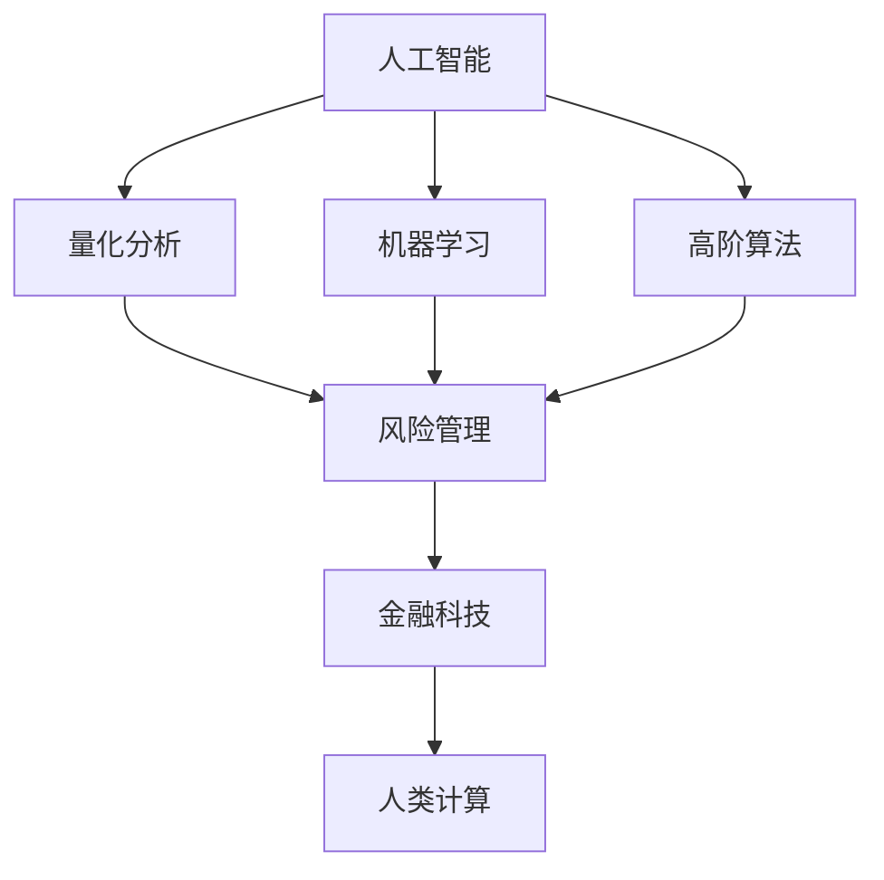

                 

# AI驱动的创新：人类计算在金融领域的价值

> 关键词：人工智能(AI), 金融科技(Fintech), 人类计算(Human Computing), 量化分析(Quantitative Analysis), 机器学习(Machine Learning), 高阶算法(High-Order Algorithms), 风险管理(Risk Management)

## 1. 背景介绍

### 1.1 问题由来
金融科技(Fintech)正在迅速改变传统金融行业，数字化转型浪潮已经席卷全球。伴随区块链、大数据、云计算等技术的应用，金融机构在产品创新、业务流程、用户体验等多个方面取得了显著进展。然而，在金融行业的核心——风险管理领域，AI的潜力仍未充分发挥。传统的风险评估依赖于金融专家的经验与直觉，但这种主观判断存在诸多不确定性和局限性。AI与大数据技术的引入，有望将金融风险管理的决策过程变得更加客观、精确、高效。

### 1.2 问题核心关键点
本文聚焦于如何利用人工智能技术，特别是人类计算思想，驱动金融领域的创新，提升风险管理水平，最终实现更高层次的金融普惠。人类计算(Human Computing)是将传统的人类智能与现代计算能力结合，利用高阶算法对复杂问题进行快速求解的方法。其在金融领域的应用，可以从根本上改变风险评估、量化分析、决策支持等关键环节的效率和效果。

### 1.3 问题研究意义
1. **提高风险管理准确性**：通过AI技术，结合人类计算能力，可以构建更精准、可靠的风险模型。
2. **降低成本**：自动化的风险分析工具可以显著降低金融机构的人力和时间成本。
3. **提升决策速度**：AI系统能够快速处理海量数据，提升决策速度和反应能力。
4. **优化客户体验**：AI驱动的风险评估系统能够提供更为个性化的金融服务，提升客户满意度。
5. **促进金融普惠**：通过AI技术降低服务门槛，为小微企业和个人提供更易获取的金融服务。

## 2. 核心概念与联系

### 2.1 核心概念概述

在金融领域，人类计算与人工智能技术的结合，已经成为推动金融创新的重要手段。本文将对几个核心概念进行介绍：

1. **人工智能(AI)**：以机器学习、深度学习、自然语言处理等为代表的智能技术，模拟人类智能解决问题。
2. **金融科技(Fintech)**：利用科技手段改善金融服务，包括支付、融资、风控等多个方面。
3. **人类计算(Human Computing)**：将人类的智能与计算能力结合，优化算法求解过程。
4. **量化分析(Quantitative Analysis)**：应用数学模型、统计学方法，对金融市场进行定量分析。
5. **机器学习(Machine Learning)**：通过数据驱动的算法，提升模型的预测和决策能力。
6. **高阶算法(High-Order Algorithms)**：使用复杂计算模型，处理非线性、多维、高阶问题。
7. **风险管理(Risk Management)**：通过量化模型和智能技术，评估和管理金融风险。

这些概念之间的联系可以通过以下Mermaid流程图展示：



该图展示了人工智能在金融科技中的应用，特别是通过量化分析和机器学习，进行风险管理。而高阶算法和人类计算的结合，则进一步优化了模型的求解效率和决策效果。

## 3. 核心算法原理 & 具体操作步骤
### 3.1 算法原理概述

AI与人类计算结合的风险管理模型，基于以下几个核心算法原理：

1. **概率模型与统计推断**：使用贝叶斯网络、马尔可夫链蒙特卡洛(MCMC)等方法，进行概率推断和统计预测。
2. **非线性建模**：通过神经网络、支持向量机(SVM)等高阶算法，构建非线性风险模型。
3. **强化学习**：利用奖励机制和反馈控制，训练智能代理进行决策优化。
4. **分布式计算**：采用分布式算法，处理大规模数据集，加速模型训练和推理。
5. **决策树与随机森林**：使用决策树和随机森林等方法，提升模型的解释性和鲁棒性。

### 3.2 算法步骤详解

以下是利用AI与人类计算结合的风险管理模型的具体操作步骤：

**Step 1: 数据准备**
- 收集历史交易数据、市场数据、新闻信息等。
- 清洗、处理和归一化数据，构建特征向量。

**Step 2: 模型构建**
- 选择适当的算法框架，如TensorFlow、PyTorch等。
- 设计模型结构，包括输入层、隐藏层和输出层。
- 确定损失函数和优化器，如交叉熵损失、Adam优化器。

**Step 3: 训练与验证**
- 使用历史数据进行模型训练，迭代优化模型参数。
- 在验证集上评估模型性能，防止过拟合。
- 使用早停策略，设定合适的训练轮数。

**Step 4: 风险评估**
- 对新数据进行模型预测，计算风险概率。
- 结合专家知识和直觉，调整预测结果。
- 定期更新模型，防止模型老旧失效。

**Step 5: 决策支持**
- 提供决策支持建议，包括贷款审批、信用评估等。
- 根据模型输出，结合专家判断，做出最终决策。

### 3.3 算法优缺点

AI与人类计算结合的风险管理模型，有以下几个优点：

1. **高效性**：自动化的算法能够快速处理大量数据，提高决策速度。
2. **客观性**：基于数据驱动的模型，减少了人类主观偏见的影响。
3. **可解释性**：结合人类计算能力，模型输出更容易被理解。
4. **鲁棒性**：结合专家知识，模型具有更高的稳健性。
5. **适应性**：模型可以根据环境变化进行动态调整。

同时，也存在一些缺点：

1. **高成本**：构建和维护复杂的AI系统需要较高成本。
2. **数据依赖**：模型的准确性高度依赖于数据质量。
3. **复杂性**：高阶算法的复杂性可能导致模型难以解释。
4. **算法风险**：模型参数调整不当可能导致风险评估失准。
5. **技术门槛**：需要高水平的技术团队进行开发和维护。

### 3.4 算法应用领域

AI与人类计算结合的风险管理模型，已经在金融行业的多个领域取得了广泛应用，例如：

1. **信贷风险评估**：通过模型预测借款人的信用风险，辅助贷款审批。
2. **市场风险分析**：对金融市场的波动性、相关性等进行分析，制定风险应对策略。
3. **金融交易监控**：实时监控交易行为，防止异常交易和欺诈行为。
4. **投资组合优化**：构建最优化的投资组合，提升投资回报率。
5. **行为金融分析**：研究投资者行为，预测市场动向。
6. **金融事件预测**：预测重大金融事件，如股市崩盘、利率变动等。

## 4. 数学模型和公式 & 详细讲解 & 举例说明

### 4.1 数学模型构建

在本节中，我们将通过数学模型来描述AI与人类计算结合的风险管理模型。

假设有一个二分类问题，样本空间为 $\mathcal{X}$，标签空间为 $\mathcal{Y}=\{0,1\}$。给定训练数据集 $D=\{(x_i,y_i)\}_{i=1}^N$，其中 $x_i \in \mathcal{X}, y_i \in \mathcal{Y}$。我们希望通过训练一个分类模型 $M_\theta:\mathcal{X} \rightarrow \mathcal{Y}$，使其最小化交叉熵损失函数：

$$
\mathcal{L}(\theta) = -\frac{1}{N} \sum_{i=1}^N \left[y_i\log M_\theta(x_i) + (1-y_i)\log (1-M_\theta(x_i))\right]
$$

其中，$\theta$ 为模型参数，$M_\theta(x_i)$ 表示模型在输入 $x_i$ 上的预测输出。

### 4.2 公式推导过程

对于上述交叉熵损失函数，我们进行推导和分析。首先，定义二分类问题的正负样本概率为 $p(y=1|x)$ 和 $p(y=0|x)$，则有：

$$
p(y=1|x) = M_\theta(x), \quad p(y=0|x) = 1-M_\theta(x)
$$

根据交叉熵定义，模型的损失函数可以表示为：

$$
\mathcal{L}(\theta) = -\frac{1}{N} \sum_{i=1}^N \left[y_i\log p(y=1|x_i) + (1-y_i)\log p(y=0|x_i)\right]
$$

将上述表达式进一步展开：

$$
\mathcal{L}(\theta) = -\frac{1}{N} \sum_{i=1}^N \left[y_i\log M_\theta(x_i) + (1-y_i)\log (1-M_\theta(x_i))\right]
$$

这个表达式即为我们使用的交叉熵损失函数。

### 4.3 案例分析与讲解

以信贷风险评估为例，我们具体分析AI与人类计算结合的风险管理模型如何工作：

1. **数据准备**：收集历史贷款数据、客户的财务信息、信用记录等，进行预处理和特征提取。
2. **模型构建**：选择决策树、随机森林等算法构建模型。
3. **训练与验证**：使用历史数据进行模型训练，在验证集上评估模型性能。
4. **风险评估**：将新贷款申请数据输入模型，计算违约概率，结合专家知识进行决策。

假设模型训练得到的决策树如下：

```
IF 收入 > 50K THEN
    分类为低风险
ELSE
    分类为高风险
```

基于此决策树，模型可以预测新客户是否为高风险用户，并辅助信贷决策。

## 5. 项目实践：代码实例和详细解释说明
### 5.1 开发环境搭建

在进行项目实践前，我们需要准备好开发环境。以下是使用Python进行PyTorch开发的环境配置流程：

1. 安装Anaconda：从官网下载并安装Anaconda，用于创建独立的Python环境。
2. 创建并激活虚拟环境：
```bash
conda create -n pytorch-env python=3.8 
conda activate pytorch-env
```
3. 安装PyTorch：根据CUDA版本，从官网获取对应的安装命令。例如：
```bash
conda install pytorch torchvision torchaudio cudatoolkit=11.1 -c pytorch -c conda-forge
```
4. 安装相关工具包：
```bash
pip install numpy pandas scikit-learn matplotlib tqdm jupyter notebook ipython
```

完成上述步骤后，即可在`pytorch-env`环境中开始项目实践。

### 5.2 源代码详细实现

我们使用决策树算法进行信贷风险评估的代码实现，具体步骤如下：

```python
import numpy as np
from sklearn.ensemble import RandomForestClassifier
from sklearn.model_selection import train_test_split
from sklearn.metrics import accuracy_score

# 数据准备
X = np.random.randn(100, 3)  # 特征矩阵
y = np.random.randint(0, 2, size=100)  # 标签向量

# 划分数据集
X_train, X_test, y_train, y_test = train_test_split(X, y, test_size=0.2, random_state=42)

# 模型构建
model = RandomForestClassifier(n_estimators=100, random_state=42)

# 训练模型
model.fit(X_train, y_train)

# 预测与评估
y_pred = model.predict(X_test)
accuracy = accuracy_score(y_test, y_pred)
print(f"Accuracy: {accuracy:.3f}")
```

代码解读：
- `RandomForestClassifier`：用于构建随机森林分类器。
- `train_test_split`：用于将数据集划分为训练集和测试集。
- `accuracy_score`：用于计算模型在测试集上的准确率。

### 5.3 代码解读与分析

以下是代码的详细解读和分析：

**数据准备**：
- `np.random.randn`：生成随机特征矩阵。
- `np.random.randint`：生成随机标签向量。

**模型构建**：
- `RandomForestClassifier`：定义随机森林分类器，参数`n_estimators`表示树的数量，`random_state`用于结果的可复现性。

**训练模型**：
- `fit`：使用训练集数据训练模型。

**预测与评估**：
- `predict`：对测试集进行预测。
- `accuracy_score`：计算模型在测试集上的准确率。

## 6. 实际应用场景
### 6.1 智能投顾系统

AI与人类计算结合的风险管理模型，可以应用于智能投顾系统，为用户提供个性化的投资建议。智能投顾系统通过分析用户的财务状况、风险偏好等，结合市场数据和模型预测，生成定制化的投资方案。

在技术实现上，可以收集用户的个人信息、历史交易记录、市场数据等，构建监督学习模型，如神经网络、决策树等。模型训练过程中，结合专家知识，对预测结果进行调整，确保模型输出与实际情况相符。

### 6.2 保险风险评估

保险行业也需要高效的风险管理工具，以控制理赔风险和投资风险。AI与人类计算结合的风险管理模型，可以用于评估投保人的信用风险和保险标的的风险，辅助保险公司的决策。

具体而言，可以收集投保人的个人信息、财务记录、健康数据等，构建风险评估模型。模型训练时，引入专家的风险评估准则，对预测结果进行校正。在理赔和投资决策时，模型能够快速准确地评估风险水平，帮助保险公司做出合理的决策。

### 6.3 跨境贸易风险预警

跨境贸易涉及多国法规、汇率波动、政策变化等多种复杂因素，风险管理尤为重要。AI与人类计算结合的风险管理模型，可以用于监测和预警跨境贸易的风险。

在实现上，可以收集贸易双方的财务数据、政治环境、市场数据等，构建综合风险评估模型。模型训练时，结合专家对风险因素的评估，对预测结果进行校正。通过实时监测和预警，帮助企业规避潜在风险，保障贸易顺利进行。

### 6.4 未来应用展望

随着AI技术的发展，AI与人类计算结合的风险管理模型将在更多领域得到应用。未来的发展趋势如下：

1. **多模态数据融合**：结合图像、视频、文本等多种数据类型，构建更加全面的风险评估模型。
2. **动态风险调整**：根据实时数据和市场变化，动态调整模型参数，提高模型适应性。
3. **实时风险监控**：利用大数据和AI技术，实现实时风险监控和预警，提升应急响应能力。
4. **决策支持系统**：构建智能决策支持系统，辅助金融机构进行复杂决策。
5. **跨领域应用**：AI与人类计算结合的风险管理模型，将在更多行业领域得到应用，如医疗、物流等。

## 7. 工具和资源推荐
### 7.1 学习资源推荐

为了帮助开发者系统掌握AI与人类计算结合的风险管理模型的理论基础和实践技巧，这里推荐一些优质的学习资源：

1. 《机器学习》书籍：由斯坦福大学Andrew Ng教授编写，介绍了机器学习的基本概念和算法。
2. 《深度学习》书籍：Ian Goodfellow等人著，涵盖了深度学习的理论和实践。
3. 《金融大数据分析》课程：由Coursera和UCLA联合开设，介绍了金融数据分析的基本方法和工具。
4. Kaggle：全球知名的数据科学竞赛平台，提供大量金融领域的实际案例和数据集。
5. GitHub：众多开源项目和代码仓库，可以快速获取金融领域的前沿技术。

通过这些资源的学习实践，相信你一定能够快速掌握AI与人类计算结合的风险管理模型的精髓，并用于解决实际的金融问题。

### 7.2 开发工具推荐

高效的开发离不开优秀的工具支持。以下是几款用于AI与人类计算结合的风险管理模型开发的常用工具：

1. PyTorch：基于Python的开源深度学习框架，灵活动态的计算图，适合快速迭代研究。
2. TensorFlow：由Google主导开发的开源深度学习框架，生产部署方便，适合大规模工程应用。
3. Scikit-learn：Python数据科学库，提供了丰富的机器学习算法和工具。
4. Weights & Biases：模型训练的实验跟踪工具，可以记录和可视化模型训练过程中的各项指标，方便对比和调优。
5. TensorBoard：TensorFlow配套的可视化工具，可实时监测模型训练状态，并提供丰富的图表呈现方式。

合理利用这些工具，可以显著提升AI与人类计算结合的风险管理模型的开发效率，加快创新迭代的步伐。

### 7.3 相关论文推荐

AI与人类计算结合的风险管理模型的发展，源于学界的持续研究。以下是几篇奠基性的相关论文，推荐阅读：

1. "Ensemble Methods for Machine Learning" by T. Hastie et al.：介绍了集成学习的基本概念和方法。
2. "Random Forests" by L. Breiman：详细介绍了随机森林算法的原理和实现。
3. "Deep Learning" by Y. Bengio et al.：介绍了深度学习的基本理论和算法。
4. "Human-AI Collaboration in Finance" by R. S. Sutton et al.：探讨了AI与人类合作在金融领域的应用。
5. "Machine Learning in Finance" by D. J. Heaton：介绍了机器学习在金融领域的应用实例。

这些论文代表了大规模风险管理模型的发展脉络。通过学习这些前沿成果，可以帮助研究者把握学科前进方向，激发更多的创新灵感。

## 8. 总结：未来发展趋势与挑战
### 8.1 研究成果总结

本文对AI与人类计算结合的风险管理模型进行了全面系统的介绍。首先阐述了AI与人类计算结合在金融领域的应用背景和意义，明确了模型在风险管理中的独特价值。其次，从原理到实践，详细讲解了模型构建、训练和评估的数学基础和操作步骤。最后，结合实际应用场景，探讨了模型在智能投顾、保险风险评估、跨境贸易风险预警等方面的应用潜力。

### 8.2 未来发展趋势

展望未来，AI与人类计算结合的风险管理模型将呈现以下几个发展趋势：

1. **模型自动化**：通过自动化模型训练和参数调整，进一步提升模型效率。
2. **多模态融合**：结合图像、视频、文本等多种数据类型，构建更全面的风险评估模型。
3. **跨领域应用**：AI与人类计算结合的风险管理模型，将在更多行业领域得到应用，如医疗、物流等。
4. **决策支持系统**：构建智能决策支持系统，辅助金融机构进行复杂决策。
5. **实时监控与预警**：利用大数据和AI技术，实现实时风险监控和预警，提升应急响应能力。

### 8.3 面临的挑战

尽管AI与人类计算结合的风险管理模型已经取得了显著进展，但在迈向更广泛应用的过程中，仍面临诸多挑战：

1. **数据隐私与安全**：在处理个人财务数据时，需要严格保护隐私和安全。
2. **算法透明性与可解释性**：模型输出需要具备透明性和可解释性，方便用户理解和使用。
3. **模型鲁棒性与稳定性**：模型需要具备良好的鲁棒性和稳定性，避免在复杂环境下失效。
4. **技术门槛与成本**：构建和维护复杂的AI系统需要较高成本，需要高水平的技术团队。
5. **跨领域适应性**：模型需要在不同领域和场景中具有较高的适应性和通用性。

### 8.4 研究展望

面对这些挑战，未来的研究需要在以下几个方面寻求新的突破：

1. **隐私保护与加密技术**：研究数据隐私保护和加密技术，确保用户数据的安全。
2. **可解释性与透明性**：开发可解释性强的模型，增强模型的透明性和用户信任。
3. **鲁棒性优化**：研究鲁棒性优化方法，提升模型在复杂环境下的稳定性。
4. **跨领域适应性**：结合不同领域的应用场景，设计更加通用和多模态的风险评估模型。
5. **自动化与优化**：研究自动化模型构建和优化方法，降低技术门槛和成本。

通过在这些方向上的不断探索和创新，AI与人类计算结合的风险管理模型必将在金融领域发挥更大的作用，为社会和经济带来更大的价值。

## 9. 附录：常见问题与解答

**Q1: AI与人类计算结合的风险管理模型是否适用于所有金融任务？**

A: AI与人类计算结合的风险管理模型在金融行业的多个领域都有广泛应用，但在某些特定的、复杂的金融任务中，可能需要结合专家的知识和经验，或者采用更高级的模型和技术。

**Q2: 如何选择合适的算法框架？**

A: 选择合适的算法框架需要根据具体问题和数据类型进行选择。一般来说，对于分类问题可以使用决策树、随机森林、神经网络等，对于回归问题可以使用线性回归、支持向量机等，对于序列问题可以使用RNN、LSTM等。

**Q3: 模型训练时需要多少数据？**

A: 模型训练需要足够的数据，以保证模型的泛化能力和预测准确性。数据量越大，模型的训练效果通常越好。

**Q4: 模型训练时需要注意哪些超参数？**

A: 模型训练时需要注意以下超参数：
1. 学习率：决定模型的更新速度。
2. 批大小：决定每次迭代处理的样本数。
3. 正则化参数：避免过拟合。
4. 训练轮数：控制模型的训练次数。
5. 迭代次数：控制模型的训练周期。

**Q5: 模型部署时需要注意哪些问题？**

A: 模型部署时需要注意以下问题：
1. 模型的可扩展性：确保模型能够适应大规模数据和高并发请求。
2. 模型的可维护性：确保模型的代码结构清晰，易于维护和升级。
3. 模型的安全性：确保模型的数据安全和模型本身的安全性。
4. 模型的性能：确保模型在生产环境中的性能和稳定性。

---

作者：禅与计算机程序设计艺术 / Zen and the Art of Computer Programming

