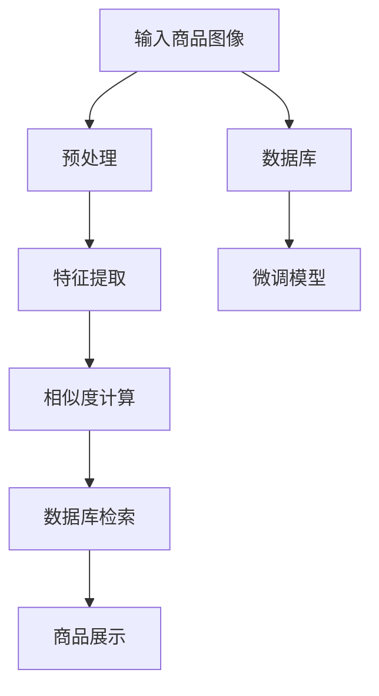

                 

# AI驱动的商品图像搜索系统设计

## 1. 背景介绍

在现代社会，信息爆炸和消费升级的双重驱动下，传统的文本搜索已无法满足用户的多样化需求。商品图像搜索作为一种新型搜索方式，能够通过直观的视觉信息匹配，快速帮助用户找到所需商品。而随着深度学习技术的发展，基于AI的商品图像搜索系统逐渐成为热门话题，为零售、电商、制造等多个领域带来了革命性的变化。

本文旨在探讨如何利用大模型和大数据，设计高效、智能的商品图像搜索系统，全面提升用户体验和商家收益。我们将重点介绍AI商品图像搜索系统的主要架构和技术细节，以及面临的挑战和未来发展方向。

## 2. 核心概念与联系

### 2.1 核心概念概述

为更清晰地理解AI商品图像搜索系统，我们先介绍一些核心概念和它们之间的联系：

- **商品图像搜索**：通过对比输入的商品图像和数据库中的商品图像，快速定位到目标商品的技术。主要应用于零售、电商、制造等行业，帮助用户更直观、更便捷地查找商品。
- **深度学习**：一种基于人工神经网络的机器学习方法，利用数据训练模型，实现高精度的预测和分类。在图像识别、自然语言处理等领域有着广泛应用。
- **大模型**：如GPT、BERT、DALL·E等，通过大规模数据预训练，学习通用语言或图像表示，具有强大的泛化能力和迁移学习特性。
- **微调**：在预训练大模型的基础上，使用特定任务的少量标注数据进行优化，使得模型能够适应新的任务要求。
- **迁移学习**：利用一个领域学到的知识，迁移应用到另一个领域的学习过程，可以在数据较少的情况下提升模型性能。
- **语义相似度**：通过计算输入图像和数据库图像之间的相似度，判断它们是否属于同一类别或相似类别。常用的相似度计算方法包括余弦相似度、欧式距离、KL散度等。

这些概念构成了AI商品图像搜索系统的基础，通过整合大模型、微调、迁移学习和语义相似度等技术，可以实现高效、智能的商品图像搜索。

### 2.2 核心概念原理和架构的 Mermaid 流程图



在这个流程图中，商品图像通过预处理、特征提取和相似度计算，最终在数据库中进行检索，匹配出相关商品并展示给用户。

## 3. 核心算法原理 & 具体操作步骤

### 3.1 算法原理概述

基于AI的商品图像搜索系统主要涉及以下几个关键步骤：

1. **输入预处理**：对输入的商品图像进行预处理，包括尺寸调整、归一化、标准化等操作。
2. **特征提取**：利用深度学习模型提取输入图像的特征表示。常用的特征提取模型包括VGG、ResNet、Inception等。
3. **相似度计算**：计算输入图像与数据库中每个商品的特征表示之间的相似度，常用方法有欧式距离、余弦相似度、KL散度等。
4. **数据库检索**：通过排序算法（如快速排序、堆排序）选择相似度最高的商品，返回给用户。
5. **商品展示**：将检索出的商品信息展示给用户，包括商品图片、名称、价格等。

### 3.2 算法步骤详解

#### 3.2.1 输入预处理

输入的商品图像大小通常不一致，需要进行预处理以保证后续计算的准确性。预处理包括但不限于：

- 调整图像尺寸，使之符合模型输入要求。
- 归一化图像像素值，通常使用均值和方差归一化。
- 标准化图像数据，使其符合标准正态分布。

#### 3.2.2 特征提取

特征提取是商品图像搜索系统的核心步骤，通常使用卷积神经网络（CNN）模型提取图像特征。以ResNet为例，其基本步骤如下：

1. **卷积层**：通过多层卷积操作，捕捉图像的局部特征。
2. **池化层**：对特征图进行下采样，减小特征图尺寸，降低计算复杂度。
3. **全连接层**：将池化层的输出映射到高维特征空间。

常用的特征提取模型包括ResNet、VGG、Inception等。这里以ResNet为例，说明特征提取的详细过程：

```python
import torch
import torchvision.models as models
import torchvision.transforms as transforms

# 加载预训练的ResNet模型
model = models.resnet50(pretrained=True)

# 定义输入预处理步骤
transform = transforms.Compose([
    transforms.Resize(256),
    transforms.CenterCrop(224),
    transforms.ToTensor(),
    transforms.Normalize(mean=[0.485, 0.456, 0.406],
                         std=[0.229, 0.224, 0.225])
])

# 加载输入图像
input_image = transforms.ToPILImage(transforms.ToTensor(input_image))
```

#### 3.2.3 相似度计算

特征提取后，需要计算输入图像与数据库中每个商品的特征表示之间的相似度。常用的相似度计算方法包括欧式距离、余弦相似度、KL散度等。这里以余弦相似度为例：

$$
similarity = \cos(\theta) = \frac{\vec{x} \cdot \vec{y}}{\lVert \vec{x} \rVert \cdot \lVert \vec{y} \rVert}
$$

其中，$\vec{x}$ 和 $\vec{y}$ 分别表示输入图像和数据库中商品的特征向量，$\theta$ 表示两向量之间的夹角。

#### 3.2.4 数据库检索

通过计算相似度，可以得出输入图像与数据库中每个商品的相似度得分。通过排序算法，选择得分最高的商品，返回给用户。

```python
import numpy as np
from sklearn.metrics.pairwise import cosine_similarity

# 假设特征提取后的向量为X，数据库中所有商品的特征向量为Y
X = resnet_model(input_image)
Y = database_features

# 计算余弦相似度
similarities = cosine_similarity(X, Y)

# 选取相似度得分最高的商品
top_k_indices = np.argsort(similarities)[::-1][:k]
top_k_products = [products[i] for i in top_k_indices]
```

#### 3.2.5 商品展示

将检索出的商品信息展示给用户，包括商品图片、名称、价格等。

```python
# 展示商品信息
for product in top_k_products:
    print(f"Product Name: {product.name}")
    print(f"Price: {product.price}")
    display(product.image)
```

### 3.3 算法优缺点

#### 3.3.1 优点

1. **高效性**：使用深度学习模型进行特征提取，能够快速计算相似度，实现高效的商品搜索。
2. **泛化能力**：大模型在预训练过程中学习到通用图像特征，具有较强的泛化能力，能够处理多种类型和样式的商品。
3. **鲁棒性**：特征提取模型具有一定的鲁棒性，能够处理一定程度的图像噪声和变形。

#### 3.3.2 缺点

1. **数据依赖**：预训练模型的效果依赖于大量高质量的标注数据，获取高质量数据成本较高。
2. **计算复杂**：深度学习模型的训练和推理计算量大，需要高性能硬件支持。
3. **特征提取误差**：不同模型的特征提取能力有限，可能存在一定的误差。

### 3.4 算法应用领域

基于AI的商品图像搜索系统广泛应用于零售、电商、制造等领域。以下是几个典型应用场景：

- **电商商品搜索**：帮助用户通过商品图像快速查找所需商品，提升购物体验。
- **制造库存管理**：通过拍摄库存商品图像，快速检索库存情况，优化库存管理。
- **时尚设计**：设计师通过比较不同材质、款式、颜色的图像，获取设计灵感。
- **环境监测**：通过拍摄环境中的物体图像，快速识别并记录物体类型和数量。

## 4. 数学模型和公式 & 详细讲解 & 举例说明

### 4.1 数学模型构建

假设输入图像为 $x$，数据库中所有商品的特征表示为 $Y=\{y_1, y_2, \ldots, y_n\}$，相似度计算方法为余弦相似度。构建数学模型如下：

$$
\theta = \mathop{\arg\min}_{\theta} \sum_{i=1}^N \frac{1}{N} \left( \cos(\theta) - \frac{y_i}{\lVert y_i \rVert} \right)^2
$$

其中，$N$ 为数据库商品数量，$\cos(\theta)$ 表示输入图像与数据库中商品的余弦相似度得分。

### 4.2 公式推导过程

以余弦相似度为例，进行公式推导：

$$
similarity = \cos(\theta) = \frac{\vec{x} \cdot \vec{y}}{\lVert \vec{x} \rVert \cdot \lVert \vec{y} \rVert}
$$

假设 $x$ 为输入图像的特征向量，$y_i$ 为数据库中商品 $i$ 的特征向量，则相似度计算公式为：

$$
similarity = \frac{x^T y_i}{\lVert x \rVert \cdot \lVert y_i \rVert}
$$

通过上述公式，可以计算输入图像与数据库中每个商品的相似度得分，并进行排序检索。

### 4.3 案例分析与讲解

以一个简单的商品图像搜索系统为例，分析其主要步骤和技术细节：

**场景描述**：用户上传一张鞋子的图片，系统需要找到与之匹配的鞋子商品。

1. **输入预处理**：将用户上传的图片调整为固定尺寸，进行归一化和标准化处理。
2. **特征提取**：使用预训练的ResNet模型提取鞋子图像的特征向量。
3. **相似度计算**：计算鞋子图像与数据库中所有鞋子的余弦相似度得分。
4. **数据库检索**：选择得分最高的前10个商品，返回给用户。
5. **商品展示**：展示商品图片、名称、价格等信息。

下面给出具体代码实现：

```python
import torch
import torchvision.models as models
import torchvision.transforms as transforms

# 加载预训练的ResNet模型
model = models.resnet50(pretrained=True)

# 定义输入预处理步骤
transform = transforms.Compose([
    transforms.Resize(256),
    transforms.CenterCrop(224),
    transforms.ToTensor(),
    transforms.Normalize(mean=[0.485, 0.456, 0.406],
                         std=[0.229, 0.224, 0.225])
])

# 加载输入图像
input_image = transforms.ToPILImage(transforms.ToTensor(input_image))

# 特征提取
X = model(input_image)

# 加载数据库中所有商品的特征向量
Y = database_features

# 计算余弦相似度
similarities = cosine_similarity(X, Y)

# 选取相似度得分最高的商品
top_k_indices = np.argsort(similarities)[::-1][:10]
top_k_products = [products[i] for i in top_k_indices]

# 展示商品信息
for product in top_k_products:
    print(f"Product Name: {product.name}")
    print(f"Price: {product.price}")
    display(product.image)
```

## 5. 项目实践：代码实例和详细解释说明

### 5.1 开发环境搭建

在进行项目实践前，需要搭建好开发环境。以下是使用Python进行PyTorch开发的详细步骤：

1. 安装Anaconda：从官网下载并安装Anaconda，用于创建独立的Python环境。

2. 创建并激活虚拟环境：
```bash
conda create -n pytorch-env python=3.8 
conda activate pytorch-env
```

3. 安装PyTorch：根据CUDA版本，从官网获取对应的安装命令。例如：
```bash
conda install pytorch torchvision torchaudio cudatoolkit=11.1 -c pytorch -c conda-forge
```

4. 安装TensorFlow：从官网下载并安装TensorFlow，用于替代PyTorch。

5. 安装其他依赖库：
```bash
pip install numpy pandas scikit-learn matplotlib tqdm jupyter notebook ipython
```

完成上述步骤后，即可在`pytorch-env`环境中开始项目实践。

### 5.2 源代码详细实现

下面我们以一个简单的商品图像搜索系统为例，给出使用PyTorch进行特征提取和相似度计算的详细代码实现。

**代码实现**：

```python
import torch
import torchvision.models as models
import torchvision.transforms as transforms
from sklearn.metrics.pairwise import cosine_similarity

# 加载预训练的ResNet模型
model = models.resnet50(pretrained=True)

# 定义输入预处理步骤
transform = transforms.Compose([
    transforms.Resize(256),
    transforms.CenterCrop(224),
    transforms.ToTensor(),
    transforms.Normalize(mean=[0.485, 0.456, 0.406],
                         std=[0.229, 0.224, 0.225])
])

# 加载输入图像
input_image = transforms.ToPILImage(transforms.ToTensor(input_image))

# 特征提取
X = model(input_image)

# 加载数据库中所有商品的特征向量
Y = database_features

# 计算余弦相似度
similarities = cosine_similarity(X, Y)

# 选取相似度得分最高的商品
top_k_indices = np.argsort(similarities)[::-1][:10]
top_k_products = [products[i] for i in top_k_indices]

# 展示商品信息
for product in top_k_products:
    print(f"Product Name: {product.name}")
    print(f"Price: {product.price}")
    display(product.image)
```

### 5.3 代码解读与分析

下面我们详细解读一下关键代码的实现细节：

**输入预处理**：

```python
# 定义输入预处理步骤
transform = transforms.Compose([
    transforms.Resize(256),
    transforms.CenterCrop(224),
    transforms.ToTensor(),
    transforms.Normalize(mean=[0.485, 0.456, 0.406],
                         std=[0.229, 0.224, 0.225])
])
```

通过Compose函数，定义了输入预处理步骤，包括调整图像尺寸、归一化和标准化处理。

**特征提取**：

```python
# 加载预训练的ResNet模型
model = models.resnet50(pretrained=True)
```

使用预训练的ResNet模型，提取输入图像的特征向量。

**相似度计算**：

```python
# 计算余弦相似度
similarities = cosine_similarity(X, Y)
```

使用余弦相似度计算输入图像与数据库中每个商品的相似度得分。

**数据库检索**：

```python
# 选取相似度得分最高的商品
top_k_indices = np.argsort(similarities)[::-1][:10]
top_k_products = [products[i] for i in top_k_indices]
```

通过排序算法，选择得分最高的商品，返回给用户。

**商品展示**：

```python
# 展示商品信息
for product in top_k_products:
    print(f"Product Name: {product.name}")
    print(f"Price: {product.price}")
    display(product.image)
```

展示商品信息，包括商品名称、价格和图片。

## 6. 实际应用场景

### 6.1 电商平台

在电商平台中，商品图像搜索系统可以帮助用户快速找到所需商品，提升购物体验。用户上传商品图片，系统通过特征提取和相似度计算，快速匹配到相关商品，返回给用户。

### 6.2 制造库存管理

在制造库存管理中，通过拍摄库存商品图像，快速检索库存情况，优化库存管理。系统将商品图像与数据库中所有商品进行匹配，找到匹配的商品记录，显示库存信息。

### 6.3 时尚设计

设计师通过比较不同材质、款式、颜色的图像，获取设计灵感。系统通过特征提取和相似度计算，快速匹配相似的图像，提供设计师需要的设计参考。

### 6.4 未来应用展望

随着深度学习技术的发展，基于AI的商品图像搜索系统将越来越普及。未来的发展趋势包括：

1. **多模态融合**：将文本、语音、图像等多种模态信息进行融合，实现更加全面、精准的商品匹配。
2. **实时处理**：通过优化算法和硬件配置，实现实时处理，满足用户的即时需求。
3. **个性化推荐**：结合用户的历史行为和偏好，进行个性化推荐，提升用户体验。
4. **跨平台应用**：实现跨平台应用，支持移动端、Web端等多种客户端。

## 7. 工具和资源推荐

### 7.1 学习资源推荐

为了帮助开发者系统掌握商品图像搜索系统的理论基础和实践技巧，这里推荐一些优质的学习资源：

1. 《深度学习与计算机视觉》：介绍深度学习在计算机视觉中的基础理论和应用。
2. 《PyTorch官方文档》：详细介绍了PyTorch的使用方法和API，适合新手入门。
3. 《Transformers: From Self-Attention to Transformers》：介绍Transformer模型的工作原理和应用。
4. 《计算机视觉：模型与学习》：介绍计算机视觉中的主要模型和算法。
5. 《AI商品图像搜索系统实战》：一本实战性的书籍，介绍了商品图像搜索系统的设计思路和代码实现。

### 7.2 开发工具推荐

高效的开发离不开优秀的工具支持。以下是几款用于商品图像搜索系统开发的常用工具：

1. PyTorch：基于Python的开源深度学习框架，灵活动态的计算图，适合快速迭代研究。
2. TensorFlow：由Google主导开发的开源深度学习框架，生产部署方便，适合大规模工程应用。
3. OpenCV：开源计算机视觉库，支持图像处理、特征提取等操作。
4. Scikit-image：基于Scikit-learn的图像处理库，提供了丰富的图像处理算法。
5. Flask：轻量级的Web框架，适合快速开发商品图像搜索系统的前端接口。

### 7.3 相关论文推荐

商品图像搜索系统的发展离不开学界的持续研究。以下是几篇奠基性的相关论文，推荐阅读：

1. ImageNet Classification with Deep Convolutional Neural Networks：介绍CNN模型在图像分类中的表现。
2. Deep Residual Learning for Image Recognition：介绍ResNet模型的工作原理和应用。
3. Convolutional Neural Networks for Visual Recognition：介绍卷积神经网络在图像处理中的应用。
4. A Survey on Deep Learning Techniques for Image Search：介绍深度学习在图像搜索中的研究现状和未来方向。

## 8. 总结：未来发展趋势与挑战

### 8.1 总结

本文对AI商品图像搜索系统的设计进行了全面系统的介绍。首先阐述了AI商品图像搜索系统的背景和意义，明确了其在零售、电商、制造等领域的应用价值。其次，从原理到实践，详细讲解了商品图像搜索系统的数学模型和关键步骤，给出了系统的完整代码实现。同时，本文还广泛探讨了商品图像搜索系统在多个行业领域的应用前景，展示了其巨大潜力。

通过本文的系统梳理，可以看到，基于AI的商品图像搜索系统已经成为一个热门话题，通过深度学习模型和特征提取技术，能够快速匹配商品图像，提升用户体验和商家收益。未来，伴随深度学习技术的不断演进，商品图像搜索系统必将迎来更多的创新和突破。

### 8.2 未来发展趋势

展望未来，AI商品图像搜索系统将呈现以下几个发展趋势：

1. **多模态融合**：将文本、语音、图像等多种模态信息进行融合，实现更加全面、精准的商品匹配。
2. **实时处理**：通过优化算法和硬件配置，实现实时处理，满足用户的即时需求。
3. **个性化推荐**：结合用户的历史行为和偏好，进行个性化推荐，提升用户体验。
4. **跨平台应用**：实现跨平台应用，支持移动端、Web端等多种客户端。
5. **智能化决策**：结合机器学习和自然语言处理技术，实现智能化决策，提升系统的决策水平。

### 8.3 面临的挑战

尽管AI商品图像搜索系统已经取得了一定的进展，但在迈向更加智能化、普适化应用的过程中，它仍面临着诸多挑战：

1. **数据依赖**：深度学习模型的效果依赖于大量高质量的标注数据，获取高质量数据成本较高。
2. **计算复杂**：深度学习模型的训练和推理计算量大，需要高性能硬件支持。
3. **特征提取误差**：不同模型的特征提取能力有限，可能存在一定的误差。
4. **安全性有待提高**：商品图像搜索系统需要保证数据和模型安全，防止数据泄露和模型攻击。
5. **可解释性不足**：系统的决策过程缺乏可解释性，难以对其推理逻辑进行分析和调试。

### 8.4 研究展望

为了应对上述挑战，未来的研究需要在以下几个方面寻求新的突破：

1. **无监督学习和半监督学习**：探索无监督学习和半监督学习范式，降低对标注数据的依赖，提升模型的泛化能力。
2. **模型压缩和加速**：开发更加轻量级、高效的商品图像搜索系统，减少计算资源消耗，提高系统响应速度。
3. **多模态融合**：将文本、语音、图像等多种模态信息进行融合，提升系统的匹配精度。
4. **安全性和隐私保护**：设计更加安全、隐私保护的算法和系统，防止数据泄露和模型攻击。
5. **可解释性和透明性**：开发可解释的、透明的系统，提升用户对系统的信任度。

这些研究方向的探索，必将引领商品图像搜索系统迈向更高的台阶，为零售、电商、制造等领域带来革命性的变化。相信随着技术的不断演进，商品图像搜索系统必将实现更广泛的应用，深刻影响人类的生产生活方式。

## 9. 附录：常见问题与解答

**Q1：如何提高商品图像搜索系统的准确率？**

A: 提高商品图像搜索系统的准确率可以从以下几个方面入手：

1. **数据质量**：确保输入的商品图像和数据库中商品图像的数据质量，避免模糊、变形、遮挡等问题。
2. **特征提取模型**：使用先进的特征提取模型，如ResNet、Inception等，提升特征提取能力。
3. **相似度计算方法**：选择合适的相似度计算方法，如欧式距离、余弦相似度等，提升相似度计算精度。
4. **数据库优化**：优化数据库中商品的特征向量，使其能够更好地与输入图像进行匹配。
5. **多模态融合**：结合文本、语音等多种模态信息，提升系统的匹配精度。

**Q2：商品图像搜索系统如何处理相似的图像？**

A: 处理相似的图像通常需要引入一些策略：

1. **多尺度匹配**：使用多尺度匹配策略，比较不同尺度的图像特征，提升匹配精度。
2. **旋转和缩放**：使用旋转和缩放技术，处理图像在不同角度和尺寸下的变形问题。
3. **图像增强**：使用图像增强技术，提升图像的质量和细节，增强匹配效果。
4. **多模态融合**：结合文本、语音等多种模态信息，提升系统的匹配精度。

**Q3：商品图像搜索系统如何保证数据和模型安全？**

A: 保证数据和模型安全可以从以下几个方面入手：

1. **数据加密**：使用数据加密技术，保护数据在传输和存储过程中的安全性。
2. **访问控制**：设置访问控制机制，限制对数据和模型的访问权限。
3. **模型审计**：定期对模型进行审计，检测和修复潜在的安全漏洞。
4. **隐私保护**：使用隐私保护技术，如差分隐私、联邦学习等，保护用户隐私。

**Q4：如何设计高效的相似度计算方法？**

A: 设计高效的相似度计算方法可以从以下几个方面入手：

1. **选择合适的相似度计算方法**：如欧式距离、余弦相似度、KL散度等。
2. **特征降维**：使用特征降维技术，减少特征向量的维度，提升计算效率。
3. **向量量化**：使用向量量化技术，将高维特征向量映射到低维空间，降低计算复杂度。
4. **多模态融合**：结合文本、语音等多种模态信息，提升系统的匹配精度。

通过上述方法的综合运用，可以设计出高效的相似度计算方法，提升商品图像搜索系统的匹配精度。

---

作者：禅与计算机程序设计艺术 / Zen and the Art of Computer Programming

