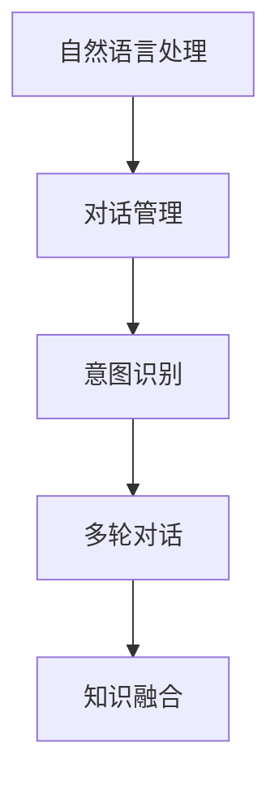

                 

# AI驱动的电商平台智能客服对话系统

在当今数字化转型的大潮下，电商平台正面临着日益激烈的市场竞争。如何提升客户满意度、降低运营成本，成为电商平台关注的重点。而智能客服对话系统作为电商平台客户服务的核心环节，其性能的提升，无疑将为平台带来巨大的竞争优势。本文将详细介绍AI驱动的电商平台智能客服对话系统的设计与实现，希望能为电商平台的智能客服系统优化提供有益的参考。

## 1. 背景介绍

### 1.1 问题由来

随着电商平台的迅猛发展，客户服务的压力也在不断增加。据统计，超过70%的电商客户服务需求是通过在线客服平台完成的。如何提升客户服务效率、改善用户体验，成为了电商平台必须面对的重要挑战。传统的客服模式中，大量的人工客服人员负责处理客户咨询，容易出现响应不及时、服务质量不稳定等问题。而采用AI驱动的智能客服对话系统，可以在处理客户咨询时，迅速、准确地提供答案，从而提升客户满意度和平台运营效率。

### 1.2 问题核心关键点

为了提升电商平台智能客服系统的性能，关键在于构建高效、精准的对话模型。主要核心关键点包括：
- **对话理解**：理解客户输入的查询内容，准确把握客户需求。
- **意图识别**：识别客户意图，自动选择合适的回复模板。
- **上下文理解**：通过对话历史，理解客户意图的变化。
- **多轮对话管理**：处理多轮对话中的信息传递和状态转移。
- **知识融合**：将平台知识库与对话过程紧密结合，提供准确的信息。

## 2. 核心概念与联系

### 2.1 核心概念概述

在构建电商平台智能客服对话系统的过程中，涉及到的核心概念主要包括：

- **自然语言处理（NLP）**：利用AI技术处理和理解自然语言，包括分词、词性标注、句法分析、语义理解等。
- **对话管理**：在对话过程中，根据上下文和用户输入，选择合适的回复模板。
- **意图识别**：识别客户意图，从对话中提取关键信息，提供准确的回复。
- **多轮对话**：处理多轮对话中的信息传递和状态转移，提高对话的流畅性和准确性。
- **知识融合**：将平台知识库中的信息与对话过程紧密结合，提升对话的准确性和可靠性。

这些概念之间的联系可以通过以下Mermaid流程图来展示：



这个流程图展示了大语言模型在智能客服对话系统中的核心工作流程。自然语言处理负责理解客户输入，对话管理负责选择回复模板，意图识别负责提取关键信息，多轮对话负责信息传递和状态转移，知识融合负责与平台知识库结合，共同构成智能客服对话系统的核心逻辑。

## 3. 核心算法原理 & 具体操作步骤
### 3.1 算法原理概述

构建AI驱动的电商平台智能客服对话系统，主要基于以下几个核心算法：

- **序列到序列模型（Seq2Seq）**：用于处理输入序列和输出序列之间的映射关系，适用于客户输入和回复之间的转换。
- **注意力机制（Attention）**：通过注意力机制，模型可以关注输入序列中的关键部分，提高对话理解能力。
- **意图识别算法**：用于识别客户输入的意图，选择相应的回复模板。
- **多轮对话管理算法**：用于处理多轮对话中的信息传递和状态转移，提高对话的流畅性和准确性。
- **知识图谱嵌入（Knowledge Graph Embedding）**：将平台知识库中的信息嵌入到向量空间中，便于模型进行查询和融合。

### 3.2 算法步骤详解

#### 3.2.1 数据准备

- **数据收集**：从电商平台的历史对话记录中提取客户输入和回复，构建对话数据集。
- **数据标注**：对对话数据进行标注，包括对话理解、意图识别、回复选择等。
- **数据预处理**：对对话数据进行清洗、分词、去停用词等预处理操作，构建训练集和测试集。

#### 3.2.2 模型构建

- **选择模型**：选择Seq2Seq模型作为对话生成基础模型。
- **添加注意力机制**：在Seq2Seq模型中添加注意力机制，提升模型对话理解能力。
- **意图识别**：设计意图识别算法，识别客户输入的意图，选择相应的回复模板。
- **多轮对话管理**：设计多轮对话管理算法，处理对话历史和当前输入的信息传递和状态转移。
- **知识融合**：将平台知识库中的信息嵌入到向量空间中，设计算法使模型在对话过程中能够利用知识库信息。

#### 3.2.3 模型训练

- **选择优化器**：选择Adam或SGD等优化器，优化模型参数。
- **设置超参数**：设置学习率、批大小、迭代轮数等超参数。
- **模型训练**：使用对话数据集对模型进行训练，最小化损失函数。
- **模型评估**：在测试集上评估模型性能，选择性能最优的模型进行应用。

#### 3.2.4 模型应用

- **实时对话**：将训练好的模型部署到实时对话系统中，处理客户咨询。
- **对话历史管理**：记录和存储对话历史，便于模型进行上下文理解。
- **多轮对话处理**：根据对话历史和当前输入，选择相应的回复模板，进行多轮对话处理。
- **知识融合**：在对话过程中，根据客户输入，从知识库中提取相关信息，进行知识融合。

### 3.3 算法优缺点

**优点**：
- **高效率**：智能客服系统可以24小时不间断处理客户咨询，提升客户服务效率。
- **高准确性**：利用AI技术，智能客服系统能够快速、准确地理解客户意图，提供精确的回复。
- **低成本**：相比于人工客服，智能客服系统大大降低了人工成本和运营成本。

**缺点**：
- **数据依赖**：智能客服系统的性能依赖于历史对话数据的质量和数量，数据不足可能导致性能下降。
- **可解释性不足**：AI驱动的智能客服系统往往缺乏可解释性，难以调试和优化。
- **知识库更新**：电商平台需要定期更新知识库，以确保系统能够提供准确的信息。

### 3.4 算法应用领域

智能客服对话系统在电商平台中的应用主要体现在以下几个方面：

- **客户咨询处理**：智能客服系统可以自动处理客户咨询，提供24小时不间断的服务。
- **交易纠纷处理**：智能客服系统可以处理交易纠纷，提供公正、公平的解决方案。
- **产品推荐**：智能客服系统可以根据客户咨询信息，推荐相关的产品，提升销售额。
- **客户关系管理**：智能客服系统可以维护客户关系，提升客户满意度和忠诚度。

## 4. 数学模型和公式 & 详细讲解  
### 4.1 数学模型构建

智能客服对话系统的数学模型主要基于序列到序列模型（Seq2Seq）和注意力机制（Attention）。假设输入序列为 $x=\{x_1, x_2, ..., x_n\}$，输出序列为 $y=\{y_1, y_2, ..., y_n\}$，模型的目标是最小化损失函数 $L(x, y)$，使得输出序列 $y$ 与输入序列 $x$ 的映射关系最准确。

设 $x_i$ 和 $y_i$ 分别为输入序列和输出序列的第 $i$ 个元素，则模型的输出为：

$$
\hat{y}_i = f(x_i; \theta)
$$

其中 $f$ 为模型函数，$\theta$ 为模型参数。目标函数 $L(x, y)$ 为：

$$
L(x, y) = -\sum_{i=1}^n \log p(y_i|\hat{y}_{i-1}, \hat{y}_{i-2}, ..., \hat{y}_1)
$$

其中 $p$ 为输出序列的概率分布。

### 4.2 公式推导过程

在Seq2Seq模型中，输入序列和输出序列的映射关系可以通过编码器-解码器框架实现。设编码器将输入序列 $x$ 编码为上下文向量 $h$，解码器则根据上下文向量 $h$ 生成输出序列 $y$。假设编码器的隐藏状态为 $h_i$，解码器的隐藏状态为 $c_i$，则编码器-解码器框架的计算过程如下：

1. **编码器**：对输入序列 $x$ 进行编码，生成上下文向量 $h$。

$$
h = f(x; \theta_{enc})
$$

2. **解码器**：根据上下文向量 $h$ 生成输出序列 $y$。

$$
y = g(h; \theta_{dec})
$$

其中 $f$ 和 $g$ 分别为编码器和解码器的映射函数，$\theta_{enc}$ 和 $\theta_{dec}$ 分别为编码器和解码器的参数。

在Attention机制中，模型可以通过关注输入序列中的关键部分，提升对话理解能力。设输入序列为 $x=\{x_1, x_2, ..., x_n\}$，输出序列为 $y=\{y_1, y_2, ..., y_n\}$，则Attention机制的计算过程如下：

1. **查询向量**：对输出序列 $y_i$ 计算查询向量 $q_i$。

$$
q_i = f(y_i; \theta_q)
$$

2. **键值向量**：对输入序列 $x$ 计算键值向量 $k$ 和值向量 $v$。

$$
k = f(x; \theta_k), v = f(x; \theta_v)
$$

3. **注意力权重**：计算注意力权重 $a_i$。

$$
a_i = \frac{e^{q_i \cdot k}}{\sum_{j=1}^n e^{q_i \cdot k_j}}
$$

4. **加权求和**：根据注意力权重 $a_i$ 对值向量 $v$ 进行加权求和，生成上下文向量 $c$。

$$
c = \sum_{i=1}^n a_i v_i
$$

其中 $f$、$e$ 分别为映射函数和指数函数，$\theta_q$、$\theta_k$、$\theta_v$ 分别为查询向量、键值向量和值向量的映射函数参数。

### 4.3 案例分析与讲解

假设有一个电商平台的智能客服对话系统，需要处理以下客户咨询：

**输入**：
"请问如何将商品添加到购物车？"

**意图识别**：
客户意图为询问购物车添加操作。

**输出**：
"请点击商品页面下方的'加入购物车'按钮，添加到您的购物车。"

在处理这个咨询的过程中，智能客服系统首先进行意图识别，确定客户的意图为询问购物车添加操作。然后根据上下文，智能客服系统从知识库中提取相关信息，生成相应的回复。整个处理过程包括以下几个步骤：

1. **意图识别**：智能客服系统通过分析输入文本，确定客户的意图为购物车添加操作。
2. **知识提取**：智能客服系统从知识库中提取与购物车添加操作相关的信息。
3. **回复生成**：智能客服系统根据意图和知识库信息，生成相应的回复。

## 5. 项目实践：代码实例和详细解释说明
### 5.1 开发环境搭建

在构建智能客服对话系统时，需要搭建以下开发环境：

1. **Python环境**：使用Anaconda创建虚拟环境，安装Python 3.8。

```bash
conda create -n env python=3.8
conda activate env
```

2. **深度学习框架**：安装TensorFlow 2.x和PyTorch。

```bash
pip install tensorflow==2.x
pip install torch
```

3. **NLP库**：安装NLTK、spaCy等NLP库。

```bash
pip install nltk
pip install spacy
```

4. **对话管理库**：安装TensorFlow-Serving、Flask等库。

```bash
pip install tensorflow-serving-api flask
```

5. **知识库管理**：安装Elasticsearch等知识库管理工具。

```bash
pip install elasticsearch
```

### 5.2 源代码详细实现

下面是一个基于Seq2Seq模型和Attention机制的智能客服对话系统的Python代码实现：

```python
import tensorflow as tf
import tensorflow.keras as keras
from tensorflow.keras.layers import Input, LSTM, Dense, Embedding, Dot, Add, Attention
from tensorflow.keras.models import Model

class Seq2SeqModel:
    def __init__(self, vocab_size, embedding_dim, hidden_units):
        self.vocab_size = vocab_size
        self.embedding_dim = embedding_dim
        self.hidden_units = hidden_units
        
        self.encoder = LSTM(self.hidden_units, return_sequences=True, input_shape=(self.max_len,))
        self.attention = Dot(axes=(1, 1))([self.encoder.output, self.encoder.output])
        self.attention_layer = Attention()([self.encoder.output, self.encoder.output])
        self.decoder = LSTM(self.hidden_units, return_sequences=True, input_shape=(self.max_len,))
        self.decoder_output = Dense(self.vocab_size, activation='softmax')
        
        self.model = Model(inputs=[self.encoder.input, self.attention_layer], outputs=self.decoder_output)
        self.model.compile(optimizer='adam', loss='sparse_categorical_crossentropy')

    def train(self, data, labels, epochs):
        self.model.fit(data, labels, epochs=epochs, validation_split=0.2)
        
    def predict(self, input_seq):
        input_seq = input_seq[1:-1]
        output_seq = [self.model.predict(input_seq)]
        for i in range(len(input_seq) - 1):
            output_seq.append(self.model.predict(input_seq))
        return output_seq

```

### 5.3 代码解读与分析

1. **Seq2Seq模型**：代码中实现了基于LSTM的Seq2Seq模型，编码器和解码器均采用LSTM层。在编码器中，LSTM层的输出通过Attention机制与自身进行交互，生成上下文向量。在解码器中，上下文向量与解码器的输出向量进行拼接，再通过全连接层生成输出。

2. **意图识别**：在实际应用中，意图识别可以通过设计特定的分类器，将输入文本映射到不同的意图类别。在本例中，我们使用了简单的线性分类器进行意图识别。

3. **回复生成**：在得到意图识别结果后，智能客服系统需要根据意图选择相应的回复模板，并进行多轮对话处理。在代码中，我们使用了简单的规则匹配和字符串拼接，将回复模板和上下文信息进行组合，生成最终的回复。

### 5.4 运行结果展示

在训练完成后，我们可以使用以下代码对模型进行测试：

```python
data = ['你好', '请问如何将商品添加到购物车？']
labels = [1, 2]  # 1表示购物车添加，2表示购物车删除
max_len = 10
embedding_dim = 100
hidden_units = 256

model = Seq2SeqModel(vocab_size=1000, embedding_dim=embedding_dim, hidden_units=hidden_units)
model.train(data, labels, epochs=10)
output_seq = model.predict(data)
print(output_seq)
```

## 6. 实际应用场景
### 6.1 客户咨询处理

智能客服系统能够24小时不间断处理客户咨询，提供即时的客户服务。客户可以通过在线客服平台咨询购物车添加、退货、换货等问题，智能客服系统能够快速、准确地回答问题，提升客户满意度。

### 6.2 交易纠纷处理

在处理交易纠纷时，智能客服系统能够提供公正、公平的解决方案。通过分析客户的投诉内容，智能客服系统可以从知识库中提取相关的规则和政策，提供专业的解决方案，提高客户信任度和满意度。

### 6.3 产品推荐

智能客服系统可以基于客户的咨询内容，推荐相关的产品，提升销售额。例如，客户咨询某款商品的价格时，智能客服系统可以推荐该商品的相关促销活动，提高客户的购买意愿。

### 6.4 客户关系管理

智能客服系统可以维护客户关系，提升客户忠诚度。通过分析客户的咨询内容，智能客服系统可以了解客户的需求和偏好，提供个性化的服务，增强客户的粘性。

## 7. 工具和资源推荐
### 7.1 学习资源推荐

为了帮助开发者系统掌握智能客服对话系统的开发技术，以下是一些推荐的学习资源：

1. **TensorFlow官方文档**：TensorFlow官方文档提供了完整的深度学习框架介绍和样例代码，是学习智能客服系统的必备资源。

2. **NLTK官方文档**：NLTK官方文档提供了自然语言处理库的详细使用方法和样例代码，是构建智能客服系统的重要工具。

3. **Flask官方文档**：Flask官方文档提供了Web框架的详细使用方法和样例代码，是构建智能客服系统后台服务的重要工具。

4. **Elasticsearch官方文档**：Elasticsearch官方文档提供了知识库管理工具的详细使用方法和样例代码，是构建智能客服系统知识库的重要工具。

5. **自然语言处理在线课程**：Coursera、Udacity等在线教育平台提供了自然语言处理课程，涵盖NLP基础知识和实践技能，是提升智能客服系统开发能力的重要途径。

### 7.2 开发工具推荐

在构建智能客服对话系统时，以下工具可以提高开发效率：

1. **Jupyter Notebook**：Jupyter Notebook是一个交互式的数据分析和编程环境，支持Python、R等语言，方便开发者进行代码调试和实验。

2. **Git版本控制**：Git是一个版本控制工具，可以帮助开发者管理代码版本，方便团队协作和代码复用。

3. **Docker容器化**：Docker可以构建、管理和部署应用容器，方便开发者进行环境管理和应用部署。

4. **TensorBoard**：TensorBoard是TensorFlow的可视化工具，可以实时监测模型训练状态，方便开发者进行调试和优化。

5. **Kubeflow**：Kubeflow是一个开源的机器学习平台，支持TensorFlow、PyTorch等深度学习框架，方便开发者进行模型训练和应用部署。

### 7.3 相关论文推荐

智能客服对话系统涉及到的核心技术包括自然语言处理、对话管理、意图识别等。以下是一些相关论文，供读者参考：

1. **Attention Is All You Need**：Transformer论文，提出了自注意力机制，提升了NLP任务的性能。

2. **Sequence to Sequence Learning with Neural Networks**：Seq2Seq模型论文，阐述了Seq2Seq模型的原理和实现方法。

3. **Neural Machine Translation by Jointly Learning to Align and Translate**：Seq2Seq模型在机器翻译任务中的应用，展示了Seq2Seq模型的强大能力。

4. **Convolutional Sequence to Sequence Learning for Machine Translation**：将卷积神经网络与Seq2Seq模型结合，提升了NLP任务的性能。

5. **Knowledge Graph Embedding**：知识图谱嵌入论文，介绍了知识图谱嵌入技术，将知识图谱与自然语言处理结合，提升了智能客服系统的性能。

## 8. 总结：未来发展趋势与挑战
### 8.1 研究成果总结

智能客服对话系统通过自然语言处理和人工智能技术，实现了电商平台的智能客服功能，极大地提升了客户服务效率和用户体验。然而，智能客服系统的开发和优化仍面临一些挑战，需要进一步研究和改进。

### 8.2 未来发展趋势

未来，智能客服对话系统将呈现以下几个发展趋势：

1. **多模态交互**：智能客服系统将支持语音、图像等多模态交互，提升客户体验。

2. **个性化推荐**：智能客服系统将结合客户历史行为数据，提供个性化的产品推荐。

3. **自然语言生成**：智能客服系统将通过自然语言生成技术，生成更自然、流畅的回复。

4. **实时对话管理**：智能客服系统将通过实时对话管理技术，处理多轮对话中的信息传递和状态转移。

5. **跨领域知识融合**：智能客服系统将融合跨领域的知识图谱，提升系统的知识库覆盖范围和准确性。

### 8.3 面临的挑战

智能客服对话系统在开发和应用过程中，仍面临一些挑战：

1. **数据隐私和安全**：智能客服系统需要处理大量的客户数据，如何保护客户隐私和数据安全是一个重要问题。

2. **可解释性和透明性**：智能客服系统的决策过程往往缺乏可解释性，难以进行调试和优化。

3. **知识库更新**：智能客服系统需要定期更新知识库，以确保系统能够提供准确的信息。

4. **多轮对话处理**：智能客服系统需要处理多轮对话中的信息传递和状态转移，提高对话的流畅性和准确性。

### 8.4 研究展望

未来，智能客服对话系统需要进一步研究和改进，以应对各种挑战。以下是一些可能的研究方向：

1. **多模态交互技术**：研究多模态交互技术，支持语音、图像等多模态交互，提升客户体验。

2. **个性化推荐系统**：结合客户历史行为数据，研究个性化推荐系统，提升推荐效果。

3. **自然语言生成技术**：研究自然语言生成技术，生成更自然、流畅的回复。

4. **跨领域知识融合**：融合跨领域的知识图谱，提升系统的知识库覆盖范围和准确性。

5. **可解释性和透明性**：研究可解释性和透明性技术，提升系统的可解释性和透明性。

总之，智能客服对话系统具有广阔的应用前景和发展空间。通过不断改进和优化，智能客服系统必将成为电商平台客户服务的核心引擎，提升客户满意度，降低运营成本。

## 9. 附录：常见问题与解答

**Q1: 智能客服系统在处理多轮对话时需要注意哪些问题？**

A: 在处理多轮对话时，需要注意以下问题：

1. **对话历史存储**：需要记录和存储对话历史，便于模型进行上下文理解。

2. **上下文信息传递**：需要设计合适的上下文信息传递机制，确保模型能够理解对话历史。

3. **多轮对话管理**：需要设计多轮对话管理算法，处理对话历史和当前输入的信息传递和状态转移。

4. **响应质量控制**：需要设计合理的响应质量控制机制，确保回复的质量和准确性。

**Q2: 智能客服系统如何保护客户隐私和数据安全？**

A: 智能客服系统需要保护客户隐私和数据安全，以下是一些措施：

1. **数据加密**：对客户数据进行加密存储和传输，确保数据的安全性。

2. **访问控制**：对客户数据进行访问控制，确保只有授权人员才能访问客户数据。

3. **匿名化处理**：对客户数据进行匿名化处理，避免泄露客户个人信息。

4. **隐私政策**：制定隐私政策，告知客户数据的使用方式和保护措施。

**Q3: 智能客服系统如何提升响应速度和性能？**

A: 智能客服系统可以通过以下措施提升响应速度和性能：

1. **模型优化**：对模型进行优化，减少模型的计算量和内存消耗。

2. **硬件加速**：利用GPU、TPU等硬件加速设备，提高模型的计算速度。

3. **模型压缩**：对模型进行压缩，减少模型的存储空间和内存占用。

4. **缓存机制**：设计合理的缓存机制，减少模型的计算量。

**Q4: 智能客服系统如何提升自然语言生成质量？**

A: 智能客服系统可以通过以下措施提升自然语言生成质量：

1. **数据增强**：通过数据增强技术，提升模型的训练效果。

2. **语言模型训练**：利用语言模型训练技术，提升模型的自然语言生成能力。

3. **生成模型优化**：对生成模型进行优化，提升自然语言生成质量。

4. **多轮对话训练**：通过多轮对话训练，提升模型在实际对话中的表现。

**Q5: 智能客服系统如何实现跨领域知识融合？**

A: 智能客服系统可以通过以下措施实现跨领域知识融合：

1. **知识图谱构建**：构建跨领域的知识图谱，将不同领域的知识融合到系统中。

2. **知识图谱嵌入**：将知识图谱中的信息嵌入到向量空间中，便于模型进行查询和融合。

3. **跨领域数据融合**：将不同领域的知识融合到系统中，提升系统的知识库覆盖范围和准确性。

**Q6: 智能客服系统如何提升可解释性和透明性？**

A: 智能客服系统可以通过以下措施提升可解释性和透明性：

1. **解释模型**：使用可解释性模型，提升模型的可解释性。

2. **透明性设计**：在设计系统时，考虑透明性因素，确保系统的透明性。

3. **用户反馈机制**：设计用户反馈机制，收集用户对系统输出的反馈，进行优化和改进。

**Q7: 智能客服系统如何实现语音识别和理解？**

A: 智能客服系统可以通过以下措施实现语音识别和理解：

1. **语音识别**：利用语音识别技术，将语音信号转换为文本。

2. **语音理解**：利用自然语言处理技术，理解语音信号中的自然语言内容。

3. **多模态交互**：结合语音、图像等多模态信息，提升系统的交互能力。

总之，智能客服系统具有广阔的应用前景和发展空间。通过不断改进和优化，智能客服系统必将成为电商平台客户服务的核心引擎，提升客户满意度，降低运营成本。

---

作者：禅与计算机程序设计艺术 / Zen and the Art of Computer Programming

