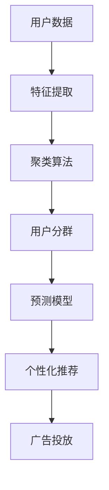

                 

## AI驱动的电商平台用户分群与精准营销

### 1. 背景介绍

随着电子商务的快速发展和互联网用户的不断增长，电商平台面临着前所未有的市场竞争压力。为提升用户转化率和销售额，各大电商企业纷纷转向数据驱动的运营策略，其中用户分群和精准营销成为焦点。通过AI技术，电商平台能够精准识别不同用户群体，制定个性化的营销方案，实现更高的运营效率和盈利能力。

在电商平台的实际运营中，用户分群是指将用户按照其行为、属性、偏好等特征进行分类，形成不同用户群体，以便进行针对性的营销策略制定。精准营销则是通过数据挖掘和机器学习技术，预测用户行为和需求，实现高效、低成本的个性化推荐和广告投放，提升用户体验和销售额。

本文将详细介绍基于AI技术的用户分群与精准营销方法，涵盖用户画像构建、聚类算法、预测模型、广告投放等多个方面，旨在为电商平台提供可行的技术解决方案，实现用户价值的最大化。

### 2. 核心概念与联系

为更好地理解基于AI的用户分群与精准营销方法，本节将介绍几个密切相关的核心概念及其相互联系：

#### 2.1 核心概念概述

- **用户分群（User Segmentation）**：指通过数据分析和机器学习技术，将电商平台上的用户根据其行为、属性、购买记录等特征进行分类，形成不同用户群体，以进行更精细化的运营。
- **个性化推荐（Personalized Recommendation）**：根据用户的历史行为和当前兴趣，推荐其可能感兴趣的商品或服务，提升用户满意度和购买转化率。
- **聚类算法（Clustering Algorithm）**：一种无监督学习方法，用于将相似的样本聚为一类，常用于用户分群。
- **预测模型（Predictive Model）**：通过历史数据训练，预测用户未来行为或需求，用于精准营销。
- **广告投放（Ad Placement）**：根据用户的群体特征和预测结果，在合适的时间、地点、渠道展示广告，实现高效营销。

#### 2.2 核心概念原理和架构的 Mermaid 流程图



这个流程图展示了用户分群与精准营销的核心步骤：

1. 从用户数据中提取特征。
2. 使用聚类算法将用户分为不同群体。
3. 通过预测模型预测用户未来行为。
4. 结合用户群体特征和预测结果，进行个性化推荐。
5. 在合适的时间、地点、渠道展示广告。

这些步骤共同构成了基于AI的用户分群与精准营销方法的基本框架，实现对用户的深度理解和精准营销。

### 3. 核心算法原理 & 具体操作步骤

#### 3.1 算法原理概述

基于AI的用户分群与精准营销方法，核心在于通过数据挖掘和机器学习技术，实现对用户的深度理解与预测。其基本原理如下：

1. **用户画像构建**：通过收集用户行为数据、社交数据、交易数据等多维数据，构建用户画像，了解用户的基本特征、偏好和需求。
2. **聚类算法**：使用K-Means、层次聚类等算法，将用户按照相似性分为不同群体。
3. **预测模型**：使用回归、分类、深度学习等模型，预测用户未来的购买行为、流失风险等，为精准营销提供数据支持。
4. **个性化推荐**：根据用户画像和预测结果，推荐其可能感兴趣的商品或服务。
5. **广告投放**：结合用户群体特征和预测结果，在合适的时间、地点、渠道展示广告，实现高效营销。

#### 3.2 算法步骤详解

**Step 1: 数据准备**

- 收集用户行为数据（点击、浏览、购买、评价等）
- 收集用户属性数据（年龄、性别、地域、职业等）
- 收集外部数据（社交媒体、搜索行为等）
- 数据清洗和预处理（去重、处理缺失值、标准化等）

**Step 2: 特征工程**

- 数据探索和可视化
- 特征选择和提取
- 特征缩放和归一化
- 特征编码和转换（如one-hot编码）

**Step 3: 聚类算法**

- 选择合适的聚类算法（如K-Means、层次聚类）
- 设定聚类参数（如K值、距离度量等）
- 进行聚类分析，生成用户分群

**Step 4: 预测模型**

- 选择适当的预测模型（如线性回归、逻辑回归、随机森林、深度学习模型）
- 模型训练和验证
- 模型评估和调参
- 使用预测模型进行用户行为预测

**Step 5: 个性化推荐**

- 选择合适的推荐算法（如协同过滤、基于内容的推荐、混合推荐）
- 根据用户画像和预测结果生成推荐列表
- 优化推荐算法性能，提升推荐效果

**Step 6: 广告投放**

- 选择广告平台和渠道
- 根据用户群体特征和预测结果设计广告内容
- 自动化广告投放策略优化
- 监测广告效果并进行调整

#### 3.3 算法优缺点

**优点**：

- **高效精准**：通过AI技术，能够高效地实现用户分群和精准营销，提升转化率和销售额。
- **个性化推荐**：能够根据用户兴趣和需求，提供个性化的商品和服务推荐，提升用户体验。
- **数据驱动**：依赖大量数据进行模型训练，具备较强的预测能力和数据洞察力。

**缺点**：

- **数据质量要求高**：需要高质量的数据支撑，数据缺失、噪声等问题会影响模型效果。
- **算法复杂度高**：涉及数据预处理、聚类、预测等多个步骤，算法实现较为复杂。
- **模型更新困难**：模型需要定期更新以适应新的用户行为和市场变化，更新过程较为繁琐。

#### 3.4 算法应用领域

基于AI的用户分群与精准营销方法，在电商、社交媒体、金融、旅游等多个领域得到了广泛应用，具体如下：

- **电商**：通过用户分群和个性化推荐，提升用户转化率和销售额。
- **社交媒体**：利用用户分群进行内容推荐和广告投放，提升用户活跃度和广告效果。
- **金融**：使用用户分群进行风险评估和客户细分，提升金融产品的销售和客户管理。
- **旅游**：根据用户分群提供个性化旅游推荐，提升用户体验和预订转化率。

### 4. 数学模型和公式 & 详细讲解 & 举例说明

#### 4.1 数学模型构建

假设用户数据集为 $D=\{(x_i, y_i)\}_{i=1}^N$，其中 $x_i$ 为特征向量，$y_i$ 为标签（如购买行为、流失风险等）。

定义用户画像 $P(x)$ 为用户的特征向量 $x$ 到高维向量 $P$ 的映射，即：

$$
P(x) = \{p_1, p_2, ..., p_m\}
$$

其中 $p_1, p_2, ..., p_m$ 为用户的不同特征维度。

用户分群通过聚类算法 $C(P(x))$ 实现，将用户按照相似性分为 $k$ 个群体 $G_1, G_2, ..., G_k$。

预测模型 $M(y|P(x))$ 用于预测用户未来的行为或需求，其输出为 $y$ 的预测值。

个性化推荐算法 $R(x)$ 根据用户画像 $P(x)$ 和预测结果生成推荐列表。

广告投放策略 $A$ 根据用户群体特征和预测结果，设计广告内容并在合适的时间、地点、渠道展示。

#### 4.2 公式推导过程

以K-Means聚类算法为例，其核心公式为：

$$
G_i = \arg\min_{G_k} \sum_{x_j \in G_k} \Vert x_j - \mu_k \Vert^2
$$

其中 $G_i$ 为用户 $i$ 所属的群体，$\mu_k$ 为第 $k$ 个群体的聚类中心，$x_j$ 为用户 $j$ 的特征向量。

在预测模型中，常用的回归模型公式为：

$$
y_i = \sum_{p_j \in P(x_i)} \theta_j p_j + \epsilon_i
$$

其中 $\theta_j$ 为回归模型的系数，$\epsilon_i$ 为误差项。

在个性化推荐中，协同过滤推荐算法的基本公式为：

$$
r_{i,j} = \frac{1}{1 + \Vert x_i - x_j \Vert_F^2}
$$

其中 $r_{i,j}$ 为用户 $i$ 对用户 $j$ 的评分预测值，$x_i$ 和 $x_j$ 为用户 $i$ 和 $j$ 的特征向量。

#### 4.3 案例分析与讲解

以电商平台的个性化推荐系统为例，分析其核心流程和模型实现。

1. **数据准备**：收集用户行为数据（点击、浏览、购买等）和用户属性数据（年龄、性别、地域等），清洗和预处理数据。
2. **特征工程**：提取用户行为特征（如点击次数、浏览时长、购买金额等）和用户属性特征（如年龄、性别、地域等），进行特征编码和转换。
3. **聚类算法**：使用K-Means算法，将用户按照行为和属性分为不同群体，生成用户分群。
4. **预测模型**：使用随机森林模型，预测用户的购买行为和流失风险，生成预测结果。
5. **个性化推荐**：使用协同过滤推荐算法，根据用户画像和预测结果生成个性化推荐列表。
6. **广告投放**：根据用户群体特征和预测结果，设计个性化广告内容，并在合适的时间、地点、渠道展示。

### 5. 项目实践：代码实例和详细解释说明

#### 5.1 开发环境搭建

在进行用户分群与精准营销的实践开发中，需要搭建一个完善的开发环境。以下是具体的步骤：

1. **选择开发语言和框架**：Python 是数据科学和机器学习领域的主流语言，TensorFlow、PyTorch、Scikit-Learn 等框架适用于不同的机器学习任务。
2. **安装相关工具和库**：安装 Anaconda 或 Miniconda，使用 pip 安装 TensorFlow、PyTorch、Scikit-Learn 等库。
3. **配置环境变量**：设置 Python 路径、环境变量等，确保开发环境能够正常运行。
4. **创建虚拟环境**：使用 virtualenv 或 conda 创建虚拟环境，避免与其他项目冲突。

#### 5.2 源代码详细实现

以下是一个基于 PyTorch 的电商个性化推荐系统的实现代码：

```python
import torch
import torch.nn as nn
import torch.optim as optim
import torch.nn.functional as F
from torch.utils.data import DataLoader
from sklearn.model_selection import train_test_split
from sklearn.preprocessing import StandardScaler

# 定义神经网络模型
class MLP(nn.Module):
    def __init__(self, input_size, hidden_size, output_size):
        super(MLP, self).__init__()
        self.fc1 = nn.Linear(input_size, hidden_size)
        self.fc2 = nn.Linear(hidden_size, hidden_size)
        self.fc3 = nn.Linear(hidden_size, output_size)

    def forward(self, x):
        x = F.relu(self.fc1(x))
        x = F.relu(self.fc2(x))
        x = self.fc3(x)
        return x

# 数据加载和预处理
def load_data():
    # 加载数据
    data = pd.read_csv('user_data.csv')
    # 数据预处理
    features = ['click_count', 'browsing_time', 'purchase_amount', 'age', 'gender', 'location']
    target = ['purchase_frequency', 'churn_rate']
    X_train, X_test, y_train, y_test = train_test_split(data[features], data[target], test_size=0.2, random_state=42)
    X_train = StandardScaler().fit_transform(X_train)
    X_test = StandardScaler().transform(X_test)
    return X_train, y_train, X_test, y_test

# 模型训练和预测
def train_model(X_train, y_train, X_test, y_test):
    # 定义模型
    model = MLP(input_size=X_train.shape[1], hidden_size=64, output_size=len(target))
    # 定义优化器和损失函数
    optimizer = optim.Adam(model.parameters(), lr=0.001)
    criterion = nn.MSELoss()
    # 训练模型
    for epoch in range(100):
        optimizer.zero_grad()
        y_pred = model(X_train)
        loss = criterion(y_pred, y_train)
        loss.backward()
        optimizer.step()
        if (epoch+1) % 10 == 0:
            print('Epoch [{}/{}], Loss: {:.4f}'.format(epoch+1, 100, loss.item()))
    # 测试模型
    model.eval()
    with torch.no_grad():
        y_pred = model(X_test)
    return y_pred

# 运行代码
X_train, y_train, X_test, y_test = load_data()
y_pred = train_model(X_train, y_train, X_test, y_test)
```

#### 5.3 代码解读与分析

以上代码实现了一个基于 MLP（多层感知机）的电商个性化推荐系统，主要包括以下步骤：

1. **数据加载和预处理**：使用 Pandas 库加载数据，提取特征和目标变量，并进行标准化处理。
2. **模型定义**：定义一个三层全连接神经网络模型，使用 PyTorch 的 nn 模块实现。
3. **模型训练**：使用 Adam 优化器和均方误差损失函数训练模型，输出训练过程中的损失值。
4. **模型测试**：使用训练好的模型对测试集进行预测，得到预测结果。

### 6. 实际应用场景

#### 6.1 电商推荐系统

电商推荐系统是用户分群与精准营销的重要应用场景之一。通过分析用户的浏览、点击、购买等行为数据，电商平台可以构建用户画像，使用聚类算法将用户分为不同群体，利用预测模型预测用户的购买行为，最终生成个性化推荐列表，提升用户满意度和购买转化率。

#### 6.2 金融客户管理

在金融领域，通过用户分群与精准营销，金融机构可以更好地管理客户，降低流失风险。利用客户的历史交易数据、行为数据等，金融机构可以构建客户画像，使用聚类算法将客户分为不同群体，利用预测模型评估客户的流失风险，进而制定针对性的客户管理策略，提升客户满意度和忠诚度。

#### 6.3 旅游个性化推荐

旅游平台利用用户分群与精准营销，可以提供个性化的旅游推荐，提升用户预订转化率。通过分析用户的浏览记录、搜索行为等数据，旅游平台可以构建用户画像，使用聚类算法将用户分为不同群体，利用预测模型预测用户的旅游偏好和需求，最终生成个性化的旅游推荐列表，提升用户体验和预订转化率。

### 7. 工具和资源推荐

#### 7.1 学习资源推荐

为了帮助开发者系统掌握用户分群与精准营销的理论基础和实践技巧，这里推荐一些优质的学习资源：

1. **Coursera 《机器学习》课程**：由斯坦福大学开设的机器学习课程，涵盖机器学习基础和常见算法，适合入门学习。
2. **《Python数据科学手册》书籍**：由Jake VanderPlas撰写，全面介绍了使用Python进行数据科学和机器学习的实践技巧。
3. **Kaggle 数据科学竞赛平台**：通过参与数据科学竞赛，实战演练用户分群与精准营销方法，积累经验。
4. **Google Colab 在线环境**：免费提供GPU和TPU算力，适合进行高性能计算实验。
5. **PyTorch 官方文档**：详细介绍了PyTorch框架的使用方法和实例，适合深度学习应用开发。

通过这些资源的学习和实践，相信你一定能够快速掌握用户分群与精准营销的精髓，并用于解决实际的电商、金融、旅游等场景问题。

#### 7.2 开发工具推荐

高效的开发离不开优秀的工具支持。以下是几款用于用户分群与精准营销开发的常用工具：

1. **Python**：数据科学和机器学习领域的主流编程语言，易于学习且生态丰富。
2. **TensorFlow**：由Google主导的深度学习框架，功能强大且社区活跃。
3. **PyTorch**：由Facebook主导的深度学习框架，灵活高效且支持动态计算图。
4. **Jupyter Notebook**：交互式编程环境，适合进行数据探索和模型验证。
5. **Scikit-Learn**：Python的机器学习库，提供了多种经典算法的实现，适合快速原型开发。

合理利用这些工具，可以显著提升用户分群与精准营销任务的开发效率，加快创新迭代的步伐。

#### 7.3 相关论文推荐

用户分群与精准营销的研究涉及多个领域，以下是几篇奠基性的相关论文，推荐阅读：

1. **Ad Click Prediction: A View from the Trenches**：介绍了电商广告点击率预测的实现方法和效果评估。
2. **Customer Segmentation by Credit Card Spending**：探讨了通过信用卡消费数据进行客户分群的方法。
3. **Personalized Product Recommendations Using Collaborative Filtering**：研究了基于协同过滤的个性化推荐算法，并进行了实验验证。
4. **Churn Prediction in Telecommunications: A Review and Outlook**：综述了电信行业的用户流失预测方法，并展望了未来的研究方向。
5. **User Profiling for Recommendation Systems**：介绍了用户画像在推荐系统中的应用，并提出了一些改进方法。

这些论文代表了大规模用户分群与精准营销方法的发展脉络。通过学习这些前沿成果，可以帮助研究者把握学科前进方向，激发更多的创新灵感。

### 8. 总结：未来发展趋势与挑战

#### 8.1 研究成果总结

基于AI的用户分群与精准营销方法在电商、金融、旅游等多个领域得到了广泛应用，取得了显著的效果。其主要研究成果包括：

- **数据驱动的用户画像构建**：通过收集和分析多维数据，构建用户画像，了解用户的基本特征和需求。
- **高效的聚类算法**：使用K-Means、层次聚类等算法，将用户分为不同群体，实现用户分群。
- **预测模型和推荐算法**：使用回归、分类、协同过滤等模型，预测用户行为并进行个性化推荐。
- **广告投放策略优化**：根据用户群体特征和预测结果，设计个性化广告内容，并在合适的时间、地点、渠道展示。

#### 8.2 未来发展趋势

展望未来，用户分群与精准营销技术将呈现以下几个发展趋势：

1. **深度学习模型的普及**：随着深度学习技术的不断发展，越来越多的电商、金融、旅游等领域开始采用深度学习模型，提升预测精度和个性化推荐效果。
2. **实时性需求增加**：为了提升用户体验和运营效率，用户分群与精准营销系统需要具备实时处理能力，及时响应用户行为变化。
3. **多模态数据融合**：除了传统的行为数据和属性数据，多模态数据（如语音、图像等）的融合将提升用户分群与精准营销的全面性和准确性。
4. **跨领域应用拓展**：用户分群与精准营销方法不仅限于电商、金融、旅游等领域，将在更多行业得到应用，如医疗、教育、能源等。
5. **用户隐私保护**：随着数据隐私和安全的重视，如何在保证用户隐私的前提下，进行精准营销将成为重要研究方向。

#### 8.3 面临的挑战

尽管用户分群与精准营销技术已经取得了一定的进展，但在实际应用中仍面临诸多挑战：

1. **数据质量和多样性**：用户数据的质量和多样性直接影响模型效果，获取高质量且多样化的数据成本较高。
2. **模型复杂性和可解释性**：深度学习模型的复杂性较高，难以解释其内部机制，对模型的理解和调试带来挑战。
3. **实时处理需求**：实时处理海量数据需要高性能的计算资源和优化技术，实现实时性需求仍需优化。
4. **用户隐私保护**：在收集和使用用户数据时，需要严格遵守隐私保护法规，避免数据滥用和安全风险。
5. **跨领域适应性**：不同行业领域的数据特征和应用场景差异较大，用户分群与精准营销方法需要在多个领域进行适配和优化。

#### 8.4 研究展望

面对用户分群与精准营销所面临的挑战，未来的研究需要在以下几个方面寻求新的突破：

1. **数据治理与质量提升**：建立完善的的数据治理体系，提升数据质量和多样性，降低数据获取成本。
2. **模型可解释性与可视化**：开发可解释性强的模型，通过可视化技术提升模型的透明度和理解度。
3. **实时处理与优化**：优化算法和系统架构，提升实时处理能力和效率，满足实时性需求。
4. **用户隐私保护与合规**：探索隐私保护技术，确保数据使用的合规性，保障用户隐私。
5. **跨领域应用与迁移**：开发可迁移的模型和算法，提升方法在不同领域的应用泛化能力。

这些研究方向将推动用户分群与精准营销技术的不断进步，为电商、金融、旅游等领域带来新的突破和应用。

### 9. 附录：常见问题与解答

**Q1: 用户分群与精准营销是否适用于所有电商场景？**

A: 用户分群与精准营销在大多数电商场景中都能取得显著效果，但对于特定小众市场，可能受到用户规模和数据量的限制。因此，在实际应用中需要根据具体场景进行评估和优化。

**Q2: 聚类算法如何选择？**

A: 聚类算法的选择应根据数据类型和应用场景进行。K-Means算法适用于数据线性可分的情况，层次聚类算法适用于数据层级结构明显的情况。此外，GMM聚类、DBSCAN聚类等算法也有广泛应用。

**Q3: 预测模型如何选择？**

A: 预测模型的选择应根据具体任务和数据特点进行。回归模型适用于连续型预测，分类模型适用于离散型预测。深度学习模型如CNN、RNN、Transformer等，在预测精度和泛化能力上具备优势。

**Q4: 如何优化推荐系统性能？**

A: 推荐系统性能的优化可以从多个方面进行，包括数据预处理、特征工程、模型选择、超参数调优等。此外，引入多臂老虎机算法、强化学习等技术，也能提升推荐系统的效果。

**Q5: 用户分群与精准营销的隐私问题如何解决？**

A: 用户分群与精准营销的隐私问题可以通过数据匿名化、差分隐私等技术解决。此外，应建立严格的数据使用规范和隐私保护机制，确保数据使用的合规性和安全性。

---

作者：禅与计算机程序设计艺术 / Zen and the Art of Computer Programming

