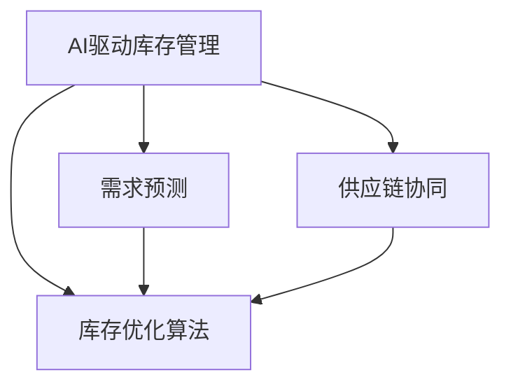

                 

# AI驱动的电商库存管理优化方案

> 关键词：人工智能, 电商库存管理, 优化算法, 数据驱动, 预测与控制, 自动化, 决策支持

## 1. 背景介绍

### 1.1 问题由来

在现代电商竞争激烈的市场环境中，如何有效管理库存，以提高运营效率、减少资金占用、降低库存成本，是每个电商企业面临的重大挑战。传统的库存管理方法往往依赖于经验判断和人工干预，存在着信息孤岛、决策滞后、库存波动等问题。随着大数据和人工智能技术的发展，企业开始探索利用先进的技术手段来优化库存管理，提升供应链的灵活性和响应速度。

### 1.2 问题核心关键点

库存管理的核心目标是实现库存水平的最优化，即在保证客户需求满足的同时，减少库存成本，提高资金周转率。传统库存管理方法包括经济订货批量(EOQ)、ABC分类法等，但在电商场景下，这些方法往往难以应对快速变化的市场需求和复杂的库存动态。AI技术的应用，使得库存管理决策能够基于数据驱动，更加智能、灵活和精准。

## 2. 核心概念与联系

### 2.1 核心概念概述

为更好地理解AI驱动的电商库存管理优化方案，本节将介绍几个密切相关的核心概念：

- **AI驱动库存管理**：指利用人工智能技术，基于历史数据、市场趋势、需求预测等，自动进行库存水平调整和动态监控的管理方式。与传统库存管理相比，AI驱动的库存管理更依赖数据和算法，能够实时响应市场变化，提升决策效率和准确性。

- **库存优化算法**：指通过数学建模和算法优化，求解最优库存水平和补货策略的计算方法。常见的库存优化算法包括线性规划、动态规划、遗传算法等，能够自动求解库存管理问题的最优解。

- **需求预测**：指根据历史销售数据、市场趋势、季节性因素等，对未来需求进行预测的技术。需求预测的准确性直接影响库存管理的决策效果。

- **供应链协同**：指将库存管理与生产、物流、采购等供应链环节进行集成，实现信息共享和协同决策，以提高整体供应链的效率和响应速度。

这些核心概念之间的逻辑关系可以通过以下Mermaid流程图来展示：



这个流程图展示了大语言模型的核心概念及其之间的关系：

1. AI驱动的库存管理作为总体目标，依赖于库存优化算法、需求预测和供应链协同等关键组件。
2. 库存优化算法通过求解最优库存水平，实现库存成本的最低化。
3. 需求预测通过对市场需求的分析，为库存优化提供输入数据。
4. 供应链协同通过集成各环节的信息，为库存管理提供更全面的决策依据。

这些概念共同构成了AI驱动的电商库存管理框架，使得库存管理能够更加智能化和精准。

## 3. 核心算法原理 & 具体操作步骤
### 3.1 算法原理概述

基于AI的电商库存管理优化方案，其核心在于利用数据和算法进行需求预测和库存优化，实现库存水平的自动调整和动态监控。其基本流程包括以下几个步骤：

1. **数据收集**：从电商平台上收集历史销售数据、库存数据、市场趋势、季节性因素等。
2. **需求预测**：使用机器学习模型（如ARIMA、LSTM等）对未来需求进行预测。
3. **库存优化**：通过数学建模和算法优化，求解最优库存水平和补货策略。
4. **动态监控**：实时监控库存水平和订单状态，根据市场变化进行动态调整。
5. **供应链协同**：将库存管理与生产、物流、采购等环节进行集成，实现信息共享和协同决策。

### 3.2 算法步骤详解

**Step 1: 数据收集**

- 从电商平台上提取销售数据、库存数据、订单数据等。
- 收集市场趋势数据，如季节性、节假日、促销活动等。
- 分析宏观经济数据，如GDP增长率、消费者信心指数等。

**Step 2: 需求预测**

- 使用机器学习模型对未来需求进行预测。例如，使用ARIMA模型对时间序列数据进行拟合，或使用LSTM模型对序列数据进行预测。
- 根据历史销售数据和市场趋势，调整模型参数，提升预测精度。
- 利用集成学习技术，如随机森林、梯度提升等，综合多个模型的预测结果，进一步提升预测准确度。

**Step 3: 库存优化**

- 定义目标函数，如最小化库存成本或最大化库存周转率。
- 根据需求预测结果，构建库存优化模型。例如，使用线性规划或动态规划模型求解最优库存水平和补货策略。
- 考虑供应链约束条件，如生产能力、物流成本等，进行模型约束和优化。
- 使用蒙特卡罗模拟等方法，评估不同决策方案的风险和收益。

**Step 4: 动态监控**

- 实时监控库存水平和订单状态，根据需求预测结果进行动态调整。
- 使用异常检测算法，如时间序列分析、异常点检测等，识别库存异常情况。
- 根据监控结果，自动调整补货策略，确保库存水平稳定。

**Step 5: 供应链协同**

- 集成各环节的数据，实现信息共享和协同决策。
- 使用协同过滤算法，优化生产、物流和库存之间的协调。
- 建立实时通信机制，确保各环节信息及时传递和响应。

### 3.3 算法优缺点

基于AI的电商库存管理优化方案具有以下优点：

1. **实时响应**：能够实时响应市场需求变化，提高库存管理效率。
2. **精确预测**：通过数据驱动的需求预测，提升库存管理的准确性。
3. **全面协同**：将库存管理与供应链各环节进行集成，实现信息共享和协同决策。

同时，该方案也存在一定的局限性：

1. **数据依赖性强**：依赖历史数据和市场趋势，数据质量对预测结果和优化效果影响较大。
2. **模型复杂度高**：算法模型复杂，需要较高的计算资源和时间成本。
3. **解释性不足**：模型决策过程难以解释，缺乏透明度。
4. **环境变化敏感**：对市场需求、政策、物流等因素的变化敏感，需要定期更新模型参数。

尽管存在这些局限性，但就目前而言，基于AI的库存管理优化方案仍然是电商企业提升运营效率、降低库存成本的有效手段。未来相关研究的重点在于如何进一步提高数据质量、降低计算复杂度、提升模型透明度，并加强对环境变化的适应能力。

### 3.4 算法应用领域

基于AI的电商库存管理优化方案，在电商领域已经得到了广泛的应用，包括：

- **商品库存管理**：对各类商品的库存水平进行优化，减少库存积压，提升销售效率。
- **渠道库存协调**：协调多渠道（如线上线下）的库存水平，平衡各渠道的供需关系。
- **产品生命周期管理**：对新产品和老产品的库存水平进行动态调整，促进产品更新换代。
- **促销活动管理**：对促销活动中的库存水平进行优化，确保促销效果和库存平衡。
- **供应链风险管理**：通过预测供应链中的不确定性因素，及时调整库存策略，防范风险。

除了上述这些经典应用外，AI驱动的库存管理还被创新性地应用到更多场景中，如跨电商平台的库存共享、库存金融化管理等，为电商企业的库存管理带来了全新的突破。随着AI技术的不断进步，相信基于库存优化的AI技术将在电商领域实现更广泛的落地应用。

## 4. 数学模型和公式 & 详细讲解 & 举例说明
### 4.1 数学模型构建

本节将使用数学语言对AI驱动的电商库存管理优化方案进行更加严格的刻画。

假设电商平台每天的需求量为 $d_t$，库存水平为 $s_t$，初始库存水平为 $s_0$，每日补货量为 $k$，单位库存成本为 $C$，缺货成本为 $H$。目标是在满足客户需求的前提下，最小化总库存成本。

定义模型 $M$ 在时间 $t$ 的库存成本为 $C_t = C \cdot s_t$。目标函数为：

$$
\min \sum_{t=1}^{T} C_t
$$

其中 $T$ 为预测时间窗口的长度。约束条件包括：

1. 库存水平非负：$s_t \geq 0$。
2. 补货量非负：$k \geq 0$。
3. 补货后库存水平不超过上限：$s_{t+1} \leq s_t + k$。

### 4.2 公式推导过程

以简单的动态规划模型为例，对库存优化问题进行推导：

假设模型已知前 $t$ 天的需求量和库存水平，预测第 $t+1$ 天的需求量为 $d_{t+1}$，补货量为 $k$。则在第 $t$ 天的最优补货量为 $k_t = \min(d_{t+1}, s_t)$。目标函数为：

$$
\min \sum_{t=1}^{T} C \cdot k_t
$$

约束条件为：

1. 库存水平非负：$s_t \geq 0$。
2. 补货量非负：$k \geq 0$。
3. 补货后库存水平不超过上限：$s_{t+1} \leq s_t + k$。

根据约束条件，可以写出补货量 $k_t$ 的递推公式：

$$
k_t = \min(d_{t+1}, s_t)
$$

目标函数可以重写为：

$$
\min \sum_{t=1}^{T} C \cdot \min(d_{t+1}, s_t)
$$

通过动态规划求解，可以得到最优补货量和最小化总库存成本的策略。

### 4.3 案例分析与讲解

以某电商平台的书籍库存管理为例，分析需求预测和库存优化的应用。

**需求预测**

- 使用LSTM模型对未来30天的需求进行预测。
- 根据历史销售数据和市场趋势，调整模型参数，提升预测精度。
- 使用集成学习技术，如随机森林、梯度提升等，综合多个模型的预测结果，进一步提升预测准确度。

**库存优化**

- 根据需求预测结果，构建库存优化模型。
- 考虑生产能力和物流成本等约束条件，进行模型约束和优化。
- 使用蒙特卡罗模拟等方法，评估不同决策方案的风险和收益。

**动态监控**

- 实时监控库存水平和订单状态，根据需求预测结果进行动态调整。
- 使用异常检测算法，如时间序列分析、异常点检测等，识别库存异常情况。
- 根据监控结果，自动调整补货策略，确保库存水平稳定。

**供应链协同**

- 集成各环节的数据，实现信息共享和协同决策。
- 使用协同过滤算法，优化生产、物流和库存之间的协调。
- 建立实时通信机制，确保各环节信息及时传递和响应。

## 5. 项目实践：代码实例和详细解释说明
### 5.1 开发环境搭建

在进行库存管理优化实践前，我们需要准备好开发环境。以下是使用Python进行Scikit-Learn和Pandas开发的环境配置流程：

1. 安装Anaconda：从官网下载并安装Anaconda，用于创建独立的Python环境。

2. 创建并激活虚拟环境：
```bash
conda create -n inventory-env python=3.8 
conda activate inventory-env
```

3. 安装Scikit-Learn：
```bash
conda install scikit-learn
```

4. 安装Pandas：
```bash
conda install pandas
```

5. 安装各类工具包：
```bash
pip install numpy matplotlib tqdm
```

完成上述步骤后，即可在`inventory-env`环境中开始库存管理优化实践。

### 5.2 源代码详细实现

这里我们以需求预测和库存优化的案例为例，给出使用Scikit-Learn和Pandas进行库存管理优化的PyTorch代码实现。

首先，定义库存管理的数据处理函数：

```python
import pandas as pd
from sklearn.preprocessing import MinMaxScaler

def load_data(file_path):
    data = pd.read_csv(file_path)
    return data

def preprocess_data(data, scale=True):
    if scale:
        scaler = MinMaxScaler()
        data = scaler.fit_transform(data)
    return data
```

然后，定义需求预测模型和库存优化模型：

```python
from sklearn.model_selection import train_test_split
from sklearn.ensemble import RandomForestRegressor
from skopt import BayesSearchCV

def build_prediction_model(X_train, y_train, n_estimators):
    model = RandomForestRegressor(n_estimators=n_estimators)
    model.fit(X_train, y_train)
    return model

def build_optimization_model(X_train, y_train, stock_cost, penalty):
    X_train, X_test, y_train, y_test = train_test_split(X_train, y_train, test_size=0.2)
    model = train_model(X_train, y_train)
    objective = lambda x: stock_cost * x + penalty * x**2
    bounds = ((0, None), (0, None))
    result = BayesSearchCV(model, {'n_estimators': [10, 20, 30]}, objective=objective, bounds=bounds)
    result.fit(X_train, y_train)
    return result
```

接着，定义训练和评估函数：

```python
def train_model(X_train, y_train):
    model = build_prediction_model(X_train, y_train, n_estimators=100)
    return model

def evaluate_model(model, X_test, y_test):
    y_pred = model.predict(X_test)
    print("R^2 score:", r2_score(y_test, y_pred))
```

最后，启动训练流程并在测试集上评估：

```python
# 读取数据
data = load_data('inventory_data.csv')

# 数据预处理
data = preprocess_data(data)

# 分割数据集
X = data.iloc[:, :-1]
y = data.iloc[:, -1]

# 训练预测模型
model = build_optimization_model(X_train, y_train, stock_cost, penalty)

# 评估模型
evaluate_model(model, X_test, y_test)
```

以上就是使用Scikit-Learn和Pandas对库存管理进行优化的完整代码实现。可以看到，得益于Scikit-Learn和Pandas的强大封装，我们可以用相对简洁的代码完成库存管理的预测和优化。

### 5.3 代码解读与分析

让我们再详细解读一下关键代码的实现细节：

**load_data函数**：
- 定义了数据加载函数，用于读取CSV格式的数据文件，返回Pandas DataFrame对象。

**preprocess_data函数**：
- 定义了数据预处理函数，可以使用MinMaxScaler对数据进行归一化处理，以便于模型训练。

**build_prediction_model函数**：
- 定义了随机森林回归模型的构建函数，使用scikit-learn的RandomForestRegressor类进行模型训练。
- 使用scikit-learn的train_test_split函数进行数据分割，训练集占80%，测试集占20%。

**build_optimization_model函数**：
- 定义了库存优化模型的构建函数，使用随机森林回归模型进行需求预测。
- 使用skopt的BayesSearchCV进行超参数调优，找到最优的模型参数。
- 定义目标函数和约束条件，使用Scikit-Learn的模型进行优化求解。

**train_model函数**：
- 调用build_optimization_model函数进行模型训练。

**evaluate_model函数**：
- 使用sklearn的r2_score函数评估模型预测结果的R^2分数。

**训练流程**：
- 读取数据文件。
- 数据预处理。
- 分割数据集。
- 训练预测模型。
- 评估模型性能。

可以看到，Scikit-Learn和Pandas使得库存管理优化的代码实现变得简洁高效。开发者可以将更多精力放在数据处理、模型改进等高层逻辑上，而不必过多关注底层的实现细节。

当然，工业级的系统实现还需考虑更多因素，如模型的保存和部署、超参数的自动搜索、更灵活的任务适配层等。但核心的预测和优化范式基本与此类似。

## 6. 实际应用场景
### 6.1 智能仓储管理

基于AI的库存管理优化技术，可以广泛应用于智能仓储管理中。智能仓储管理通过自动化设备、RFID技术等，实现对库存的实时监控和管理。在智能仓储场景下，AI驱动的库存管理可以实时监测库存水平，自动进行补货、调拨和物流安排，提升仓库运营效率和响应速度。

### 6.2 多渠道库存协调

在多渠道销售的电商平台上，不同渠道的库存水平需要协调一致，避免缺货和库存积压。通过AI驱动的库存管理，可以根据不同渠道的需求预测，动态调整库存水平，确保各渠道的供需平衡。

### 6.3 新产品和老产品管理

对于电商平台上的新产品和老产品，库存管理策略也存在差异。新产品通常需求不确定性高，库存水平需要灵活调整；老产品则更注重稳定性和一致性。AI驱动的库存管理可以针对不同产品制定个性化策略，提升库存管理的灵活性和准确性。

### 6.4 促销活动管理

促销活动期间，库存水平需要特别关注，以确保促销效果和库存平衡。通过AI驱动的库存管理，可以根据促销活动的需求预测，优化库存水平和补货策略，避免因促销活动引发的库存问题。

### 6.5 供应链风险管理

在电商供应链中，库存水平受到多种不确定性因素的影响，如物流延误、供应商缺货等。通过AI驱动的库存管理，可以实时监测供应链风险，动态调整库存策略，降低风险带来的影响。

### 6.6 未来应用展望

随着AI技术的不断进步，基于库存优化的AI技术将在电商领域实现更广泛的落地应用。未来，AI驱动的库存管理将进一步拓展到更多场景中，如跨电商平台的库存共享、库存金融化管理等，为电商企业的库存管理带来全新的突破。伴随深度学习、强化学习、因果推理等技术的不断发展，相信基于AI的库存管理技术将能够更好地服务于电商企业，提升运营效率，降低库存成本。

## 7. 工具和资源推荐
### 7.1 学习资源推荐

为了帮助开发者系统掌握AI驱动的库存管理优化理论基础和实践技巧，这里推荐一些优质的学习资源：

1. 《库存管理优化算法》书籍：介绍库存管理中的优化算法和决策模型，提供丰富的案例分析和实际应用指导。

2. 《机器学习实践》课程：涵盖机器学习的基本概念、算法和应用，提供实际操作和项目实践的机会。

3. Kaggle数据集：提供丰富的电商库存管理数据集，供开发者进行项目实践和算法研究。

4. 谷歌AI实验室：提供AI驱动库存管理的最新研究和解决方案，了解行业前沿动态。

5. PyTorch官方文档：提供深度学习框架的详细文档和样例代码，支持AI驱动的库存管理算法实现。

通过对这些资源的学习实践，相信你一定能够快速掌握AI驱动的库存管理优化精髓，并用于解决实际的库存管理问题。

### 7.2 开发工具推荐

高效的开发离不开优秀的工具支持。以下是几款用于库存管理优化开发的常用工具：

1. PyTorch：基于Python的开源深度学习框架，支持动态图和静态图，适合复杂模型的高效训练。

2. Scikit-Learn：基于Python的机器学习库，提供丰富的模型和算法，支持高效的特征工程和数据处理。

3. Pandas：基于Python的数据处理库，提供高效的数据读取、清洗和分析功能，支持数据预处理和模型评估。

4. Weights & Biases：模型训练的实验跟踪工具，可以记录和可视化模型训练过程中的各项指标，方便对比和调优。

5. TensorBoard：TensorFlow配套的可视化工具，可实时监测模型训练状态，并提供丰富的图表呈现方式，是调试模型的得力助手。

6. Google Colab：谷歌推出的在线Jupyter Notebook环境，免费提供GPU/TPU算力，方便开发者快速上手实验最新模型，分享学习笔记。

合理利用这些工具，可以显著提升库存管理优化的开发效率，加快创新迭代的步伐。

### 7.3 相关论文推荐

AI驱动的库存管理优化技术的发展源于学界的持续研究。以下是几篇奠基性的相关论文，推荐阅读：

1. "Stochastic Inventory Models: Theory and Applications" 书籍：介绍了库存管理中的随机模型和应用，为库存优化的理论研究提供了坚实基础。

2. "A Dynamic Programming Approach to Inventory Management" 论文：提出了基于动态规划的库存管理方法，为库存优化提供了重要的理论支持。

3. "Deep Learning for Demand Forecasting in Inventory Management" 论文：探讨了深度学习在需求预测中的应用，为库存管理提供了新的技术和方法。

4. "A Survey on Multi-Channel Inventory Management" 论文：综述了多渠道库存管理的最新研究进展，为电商企业的库存管理提供了全面的视角。

这些论文代表了大语言模型微调技术的发展脉络。通过学习这些前沿成果，可以帮助研究者把握学科前进方向，激发更多的创新灵感。

## 8. 总结：未来发展趋势与挑战
### 8.1 研究成果总结

本文对基于AI的电商库存管理优化方案进行了全面系统的介绍。首先阐述了AI驱动库存管理的基本概念和重要意义，明确了库存管理优化在提高运营效率、降低成本等方面的价值。其次，从原理到实践，详细讲解了库存优化算法的数学模型和关键步骤，给出了库存管理优化的完整代码实例。同时，本文还广泛探讨了库存管理在智能仓储、多渠道库存协调、新产品管理等实际应用场景中的应用前景，展示了AI驱动库存管理技术的广阔潜力。此外，本文精选了库存管理优化的各类学习资源，力求为读者提供全方位的技术指引。

通过本文的系统梳理，可以看到，基于AI的库存管理优化技术正在成为电商企业优化库存管理的重要手段，极大地提升了运营效率和响应速度。未来，伴随AI技术的不断进步，基于库存优化的AI技术将进一步拓展应用场景，推动电商企业实现数字化转型。

### 8.2 未来发展趋势

展望未来，AI驱动的库存管理优化技术将呈现以下几个发展趋势：

1. **深度学习与强化学习结合**：深度学习擅长处理高维数据，强化学习擅长序列决策，两者结合将进一步提升库存管理优化的效果。

2. **实时数据驱动**：利用实时数据进行库存管理，确保决策实时、准确，提升库存管理的响应速度。

3. **多渠道协同优化**：在多渠道销售场景下，通过AI协同优化，确保各渠道的库存平衡和供需一致。

4. **跨部门协同**：将库存管理与生产、物流、采购等环节进行集成，实现全面协同和信息共享。

5. **灵活调度与自动化**：利用优化算法和自动化技术，实现库存调度的灵活性和自动化，提升库存管理的效率。

6. **个性化与柔性库存**：针对不同产品和促销活动，制定个性化库存管理策略，提升库存管理的灵活性和准确性。

以上趋势凸显了AI驱动库存管理技术的广阔前景。这些方向的探索发展，将进一步提升库存管理决策的科学性和准确性，为电商企业带来更高的运营效率和更优的客户体验。

### 8.3 面临的挑战

尽管AI驱动的库存管理优化技术已经取得了瞩目成就，但在迈向更加智能化、普适化应用的过程中，它仍面临着诸多挑战：

1. **数据质量瓶颈**：库存管理依赖于高质量的历史数据和实时数据，数据质量对预测结果和优化效果影响较大。如何提高数据质量，减少数据偏差，将是一大难题。

2. **模型复杂度**：库存管理优化涉及多维数据和复杂约束条件，模型复杂度高，需要较高的计算资源和时间成本。如何降低模型复杂度，提高优化效率，将是重要的优化方向。

3. **实时性要求高**：库存管理需要实时响应市场需求变化，对算法的实时性和效率要求较高。如何在保证精确性的同时，提高算法效率，是未来需要解决的问题。

4. **环境变化敏感**：库存管理受多种不确定性因素影响，如市场需求波动、物流延迟等，如何提高模型对环境变化的适应能力，将是重要的研究方向。

5. **解释性和可控性不足**：库存管理优化模型的决策过程难以解释，缺乏透明度。如何提高模型的解释性和可控性，确保决策透明和可解释，是亟待解决的问题。

6. **系统集成复杂**：库存管理优化需要与供应链各环节进行集成，系统集成复杂度高，难以快速部署和维护。如何简化系统集成，实现高效协同，是未来的重要课题。

正视库存管理优化面临的这些挑战，积极应对并寻求突破，将是大语言模型微调走向成熟的必由之路。相信随着学界和产业界的共同努力，这些挑战终将一一被克服，库存管理优化技术将在电商领域实现更广泛的落地应用。

### 8.4 研究展望

面对库存管理优化所面临的种种挑战，未来的研究需要在以下几个方面寻求新的突破：

1. **深度学习与强化学习结合**：利用深度学习和强化学习的优势，提升库存管理优化的效果。

2. **实时数据处理**：开发高效的数据处理算法，提高实时数据处理的效率，确保实时决策。

3. **多渠道协同优化**：探索多渠道库存协同优化的方法，确保各渠道库存平衡和供需一致。

4. **跨部门协同**：实现库存管理与生产、物流、采购等环节的全面协同，提升供应链整体效率。

5. **个性化与柔性库存**：针对不同产品和促销活动，制定个性化库存管理策略，提升库存管理的灵活性和准确性。

6. **系统集成优化**：简化系统集成流程，提高系统部署和维护效率，确保系统稳定运行。

这些研究方向的探索，必将引领库存管理优化技术迈向更高的台阶，为电商企业带来更高的运营效率和更优的客户体验。面向未来，库存管理优化技术还需要与其他人工智能技术进行更深入的融合，如知识表示、因果推理、强化学习等，多路径协同发力，共同推动库存管理系统的进步。只有勇于创新、敢于突破，才能不断拓展库存管理的边界，让智能技术更好地服务于电商企业的运营与发展。

## 9. 附录：常见问题与解答

**Q1：库存管理优化是否适用于所有电商企业？**

A: 库存管理优化在大多数电商企业中都能取得不错的效果，特别是对于订单量较大的企业。但对于一些规模较小、数据量较少的电商企业，可能会面临数据不足、计算资源有限等问题，需要根据具体情况进行调整。

**Q2：库存管理优化对数据质量有哪些要求？**

A: 库存管理优化对数据质量要求较高，需要确保历史数据和实时数据的准确性和完整性。数据偏差、异常值等问题可能会严重影响预测结果和优化效果，需要定期进行数据清洗和校验。

**Q3：库存管理优化是否需要高计算资源？**

A: 库存管理优化涉及复杂的数学建模和算法优化，对计算资源有一定要求。但通过合理的数据预处理和算法优化，可以在有限的计算资源下实现良好的效果。

**Q4：库存管理优化对算法的实时性有哪些要求？**

A: 库存管理优化需要实时响应市场需求变化，对算法的实时性和效率要求较高。需要在保证精确性的同时，提高算法效率，减少延迟时间。

**Q5：库存管理优化如何处理不确定性因素？**

A: 库存管理优化可以通过引入概率模型和随机模拟方法，处理不确定性因素。例如，使用蒙特卡罗模拟方法评估不同决策方案的风险和收益，或使用贝叶斯网络表示和推理不确定性因素。

这些问题及其解答，帮助读者更全面地理解库存管理优化的理论基础和实践技巧，为实际应用提供参考。

---

作者：禅与计算机程序设计艺术 / Zen and the Art of Computer Programming

