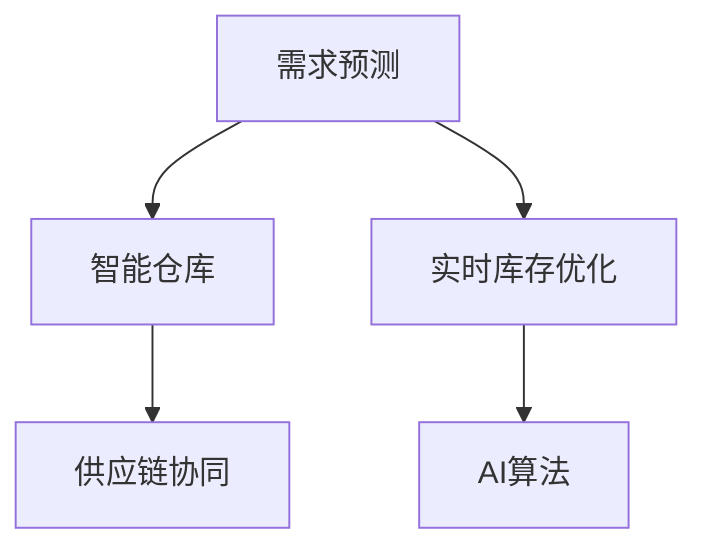

                 

## 1. 背景介绍

随着电子商务的迅猛发展，电商企业面临的库存管理问题变得越来越复杂。传统的库存管理系统往往依赖于人工处理，效率低下，难以满足实时动态库存需求。在库存不足时无法及时补货，造成订单延误；库存积压时又造成资金占用成本上升，资金周转效率下降。因此，构建智能库存管理系统，以AI驱动实时决策，优化库存资源配置，成为了电商企业的迫切需求。

### 1.1 问题由来
传统的库存管理系统主要包括三个部分：需求预测、订单处理和库存管理。其中，需求预测是关键环节，它决定了库存水平的高低。然而，传统的库存管理方法，如A-R-C法则（ABC法则），往往基于历史数据进行统计分析，难以适应实时变化的需求环境。当需求发生快速变化时，传统方法无法快速响应，导致库存短缺或积压问题。

此外，库存管理涉及仓库调度、货物拣选、库存盘点等环节，这些操作依赖于人工处理，流程繁琐、效率低下。如何通过技术手段提高库存管理的自动化和智能化水平，提高库存管理的效率和准确性，成为电商企业需要解决的痛点问题。

## 2. 核心概念与联系

### 2.1 核心概念概述

为更好地理解AI驱动的电商智能库存管理系统，本节将介绍几个密切相关的核心概念：

- **需求预测（Demand Forecasting）**：通过历史数据、市场趋势、促销活动等因素，预测未来一段时间内商品的需求量。
- **智能仓库（Smart Warehouse）**：通过自动化设备、智能算法、物联网技术，实现仓库操作的全自动化和智能化管理。
- **实时库存优化（Real-time Inventory Optimization）**：实时监测库存状态，动态调整库存水平，避免过剩或缺货，优化资金使用效率。
- **供应链协同（Supply Chain Collaboration）**：与供应商、物流公司等外部合作方进行信息共享和协同作业，提高整个供应链的协同效率。
- **AI算法（AI Algorithms）**：包括深度学习、强化学习、决策树等算法，用于实现需求预测、库存管理、仓储优化等任务。

这些核心概念之间的逻辑关系可以通过以下Mermaid流程图来展示：



这个流程图展示了几大核心概念及其之间的关系：

1. **需求预测**：提供预测需求量的基础，指导库存水平设定。
2. **智能仓库**：自动化执行仓库操作，提升操作效率。
3. **实时库存优化**：动态调整库存，确保库存水平最优。
4. **供应链协同**：与供应链上下游进行信息共享和协同作业，提升整体协同效率。
5. **AI算法**：支持需求预测、库存管理等关键任务，是整个系统的技术核心。

这些概念共同构成了AI驱动的电商智能库存管理系统的核心框架，使其能够实现实时、高效、智能的库存管理。

## 3. 核心算法原理 & 具体操作步骤
### 3.1 算法原理概述

AI驱动的电商智能库存管理系统，主要依赖于深度学习、强化学习和优化算法。其核心思想是：通过历史数据和实时数据，使用机器学习模型预测需求量，并根据预测结果进行库存优化，同时利用强化学习算法进行库存管理策略的动态调整。

具体而言，整个系统的运作流程如下：

1. **需求预测**：通过历史销售数据、季节性因素、促销活动等因素，使用深度学习模型（如LSTM、GRU）预测未来一段时间内商品的需求量。
2. **库存优化**：将预测需求量与现有库存水平进行对比，根据优化算法（如动态规划、遗传算法）调整仓库操作策略，确保库存水平在合理范围内。
3. **实时调整**：通过传感器、RFID等设备实时监测库存状态，动态调整库存水平，避免过剩或缺货。
4. **供应链协同**：与供应商、物流公司等外部合作方进行信息共享和协同作业，确保库存管理与供应链上下游的协同一致性。
5. **策略学习**：利用强化学习算法（如Q-learning、SARSA）不断优化库存管理策略，提高库存管理效果。

### 3.2 算法步骤详解

下面以需求预测和库存优化为例，详细介绍AI驱动的电商智能库存管理系统的算法步骤。

**需求预测步骤**：

1. **数据准备**：收集商品的历史销售数据、季节性因素、促销活动等相关信息。
2. **特征工程**：将原始数据转化为模型可处理的特征向量，如将时间转化为时序特征。
3. **模型训练**：使用深度学习模型（如LSTM、GRU）对历史数据进行训练，得到预测模型。
4. **模型评估**：在验证集上评估模型预测准确度，调整模型超参数，提升预测效果。
5. **预测应用**：将模型应用于实时需求预测，得到未来一段时间内商品的需求量。

**库存优化步骤**：

1. **库存水平设定**：根据历史销售数据和预测需求量，设定初始库存水平。
2. **库存动态调整**：实时监测库存状态，根据需求预测和现有库存水平，调整仓库操作策略，确保库存水平在合理范围内。
3. **策略优化**：利用强化学习算法（如Q-learning、SARSA）不断优化库存管理策略，提升库存管理效果。
4. **绩效评估**：定期评估库存管理绩效，分析库存管理策略的有效性，进行策略调整。

### 3.3 算法优缺点

AI驱动的电商智能库存管理系统具有以下优点：

1. **高效性**：通过自动化处理仓库操作，提升操作效率。
2. **准确性**：利用深度学习和强化学习算法，提升需求预测和库存管理的准确性。
3. **实时性**：实时监测库存状态，动态调整库存水平，确保库存优化。
4. **协同性**：与供应链上下游进行信息共享和协同作业，提高整个供应链的协同效率。

然而，该系统也存在一些缺点：

1. **高成本**：构建智能仓库和系统实现需要较高成本，包括硬件设备和软件开发成本。
2. **数据依赖**：系统运行依赖于历史数据和实时数据，数据质量对系统效果影响较大。
3. **复杂性**：系统涉及多个复杂算法和模型，需要较高的技术水平和专业知识。
4. **系统维护**：系统运行需要持续维护和调整，以适应不断变化的市场环境。

尽管存在这些缺点，但AI驱动的电商智能库存管理系统仍然被认为是电商企业提高库存管理效率、降低运营成本的重要手段。

### 3.4 算法应用领域

AI驱动的电商智能库存管理系统已经在多个领域得到应用，例如：

1. **电商企业**：用于优化库存管理，提高订单处理效率，提升客户满意度。
2. **物流公司**：用于优化库存水平，减少物流成本，提高配送效率。
3. **零售商**：用于优化商品陈列，提高销售转化率，提升市场竞争力。
4. **制造企业**：用于优化生产计划，减少库存积压，提高资金周转效率。

此外，该系统还被创新性地应用于智能家居、智能制造、智能农业等场景，为各行各业带来了新的智能化管理模式。

## 4. 数学模型和公式 & 详细讲解
### 4.1 数学模型构建

本节将使用数学语言对AI驱动的电商智能库存管理系统进行更加严格的刻画。

假设需求预测模型为 $F_t$，库存水平为 $I_t$，预测需求量为 $D_t$，优化策略为 $A_t$，则系统的数学模型可以表示为：

1. **需求预测模型**：
$$
D_t = F_t(X_t, \theta)
$$

其中 $X_t$ 为时序特征向量，$\theta$ 为模型参数。

2. **库存优化模型**：
$$
I_{t+1} = I_t - D_t + F_{t+1}(X_{t+1}, \theta) + A_t
$$

其中 $I_{t+1}$ 为下一个时间步的库存水平，$F_{t+1}$ 为下一时间步的预测需求量，$A_t$ 为当前时间步的调整策略。

3. **库存管理策略**：
$$
A_t = \mathop{\arg\min}_{a_t} \mathcal{L}(I_{t+1}, a_t, D_t, F_{t+1})
$$

其中 $\mathcal{L}$ 为库存优化损失函数，$a_t$ 为库存管理策略，需最小化库存水平与策略的偏差。

### 4.2 公式推导过程

以下我们以需求预测模型为例，推导LSTM模型的参数学习过程。

假设输入序列 $x_t = [x_{t-1}, x_{t-2}, \dots, x_{t-m}]$，对应的时序特征向量为 $X_t$，其中 $m$ 为特征序列长度。

LSTM模型的输出为：
$$
\hat{D}_t = \text{sigmoid}(W_H \cdot [h_{t-1}, X_t] + b_H) \odot \tanh(W_C \cdot [h_{t-1}, X_t] + b_C) + \text{sigmoid}(W_H \cdot [h_{t-1}, X_t] + b_H) \odot c_t
$$

其中 $W_H$、$b_H$、$W_C$、$b_C$ 为模型参数，$h_{t-1}$ 为上一时间步的隐藏状态，$c_t$ 为LSTM的细胞状态。

预测需求量的损失函数为：
$$
\mathcal{L} = \frac{1}{N}\sum_{i=1}^N (D_i - \hat{D}_i)^2
$$

利用梯度下降等优化算法，求解上述最小化问题，更新模型参数，得到训练后的LSTM模型。

### 4.3 案例分析与讲解

以LSTM模型为例，其需求预测过程如下：

1. **数据准备**：收集商品的历史销售数据、季节性因素、促销活动等相关信息，整理为时序特征向量 $X_t$。
2. **模型初始化**：设定LSTM模型的初始参数，如 $W_H$、$b_H$、$W_C$、$b_C$ 等。
3. **模型训练**：将历史销售数据 $D_t$ 作为目标，使用LSTM模型进行训练，得到预测模型。
4. **模型评估**：在验证集上评估模型预测准确度，调整模型参数，提升预测效果。
5. **预测应用**：将模型应用于实时需求预测，得到未来一段时间内商品的需求量。

## 5. 项目实践：代码实例和详细解释说明
### 5.1 开发环境搭建

在进行AI驱动的电商智能库存管理系统开发前，我们需要准备好开发环境。以下是使用Python进行TensorFlow开发的环境配置流程：

1. 安装Anaconda：从官网下载并安装Anaconda，用于创建独立的Python环境。

2. 创建并激活虚拟环境：
```bash
conda create -n tensorflow-env python=3.8 
conda activate tensorflow-env
```

3. 安装TensorFlow：根据CUDA版本，从官网获取对应的安装命令。例如：
```bash
conda install tensorflow -c tf -c conda-forge
```

4. 安装各类工具包：
```bash
pip install numpy pandas scikit-learn matplotlib tqdm jupyter notebook ipython
```

完成上述步骤后，即可在`tensorflow-env`环境中开始开发。

### 5.2 源代码详细实现

这里我们以LSTM模型为例，给出使用TensorFlow实现需求预测的PyTorch代码实现。

首先，定义LSTM模型的超参数和模型结构：

```python
import tensorflow as tf
from tensorflow.keras.layers import LSTM, Dense, Dropout

# 超参数
sequence_length = 30
batch_size = 64
hidden_size = 128
dropout_rate = 0.2
learning_rate = 0.001

# 模型定义
model = tf.keras.Sequential([
    LSTM(hidden_size, return_sequences=True, input_shape=(sequence_length, 1)),
    Dropout(dropout_rate),
    LSTM(hidden_size),
    Dropout(dropout_rate),
    Dense(1)
])
```

然后，定义损失函数和优化器：

```python
from tensorflow.keras.losses import MeanSquaredError

# 损失函数
loss = MeanSquaredError()

# 优化器
optimizer = tf.keras.optimizers.Adam(learning_rate)
```

接着，定义训练和评估函数：

```python
from tensorflow.keras.callbacks import EarlyStopping

# 训练函数
def train_model(model, x_train, y_train, epochs):
    model.compile(loss=loss, optimizer=optimizer)
    early_stopping = EarlyStopping(monitor='val_loss', patience=10)
    model.fit(x_train, y_train, batch_size=batch_size, epochs=epochs, validation_split=0.2, callbacks=[early_stopping])

# 评估函数
def evaluate_model(model, x_test, y_test):
    loss = model.evaluate(x_test, y_test)
    print(f'Test loss: {loss:.4f}')
```

最后，启动训练流程并在测试集上评估：

```python
epochs = 100

# 训练模型
train_model(model, x_train, y_train, epochs)

# 评估模型
evaluate_model(model, x_test, y_test)
```

以上就是使用TensorFlow对LSTM模型进行需求预测的完整代码实现。可以看到，TensorFlow提供了高度抽象的API，使得模型定义和训练过程非常简单。

### 5.3 代码解读与分析

让我们再详细解读一下关键代码的实现细节：

**模型定义**：
- `LSTM` 层定义了LSTM模型的结构，`return_sequences=True`表示输出每个时间步的隐藏状态，`input_shape` 定义了输入数据的维度。
- `Dropout` 层用于防止过拟合，`dropout_rate` 设置了随机失活的比例。

**损失函数和优化器**：
- `MeanSquaredError` 定义了均方误差损失函数。
- `Adam` 优化器用于参数优化，`learning_rate` 设置了学习率。

**训练函数**：
- `EarlyStopping` 回调函数用于防止过拟合，`monitor` 参数指定了停止条件，`patience` 参数指定了停止训练的轮数。
- `model.fit` 函数用于训练模型，`validation_split` 参数指定了验证集的比例。

**评估函数**：
- `model.evaluate` 函数用于评估模型在测试集上的性能，直接输出损失值。

**训练流程**：
- `epochs` 定义了训练轮数。
- 先训练模型，并在验证集上评估，防止过拟合。
- 在测试集上评估模型，输出最终结果。

可以看到，TensorFlow提供了丰富的API和工具，使得模型训练和评估过程变得非常简单和高效。开发者可以将更多精力放在模型优化和数据分析上，而不必过多关注底层实现细节。

当然，工业级的系统实现还需考虑更多因素，如模型的保存和部署、超参数的自动搜索、更灵活的任务适配层等。但核心的算法原理基本与此类似。

## 6. 实际应用场景
### 6.1 智能仓库管理

AI驱动的电商智能库存管理系统，已经在智能仓库管理中得到了广泛应用。传统仓库管理依赖于人工处理，效率低下，错误率高。而智能仓库通过自动化设备、智能算法、物联网技术，实现了仓库操作的全自动化和智能化管理。

在智能仓库中，可以通过AI驱动的库存管理系统，实时监测库存状态，动态调整库存水平，优化仓库操作。例如，通过智能拣选系统，快速响应订单需求，确保货物高效拣选和配送。同时，通过仓库自动清洁和维护，保证货物存储环境的卫生和安全。

### 6.2 供应链协同管理

AI驱动的电商智能库存管理系统，可以实现供应链上下游的信息共享和协同作业。通过系统平台，与供应商、物流公司等外部合作方进行数据交互，提升整个供应链的协同效率。

例如，在需求预测过程中，通过与供应商共享需求信息，优化供应商的生产计划和库存管理。在订单处理过程中，通过与物流公司共享订单信息，优化物流配送路线和运输计划，提高配送效率。在库存优化过程中，通过与供应商共享库存信息，实现库存的协同管理和优化。

### 6.3 多渠道库存管理

AI驱动的电商智能库存管理系统，支持多渠道库存管理，确保各渠道库存的一致性和协同。例如，在多平台销售过程中，通过系统平台实时监控各平台库存状态，动态调整库存水平，确保各平台库存一致。

此外，通过系统平台与第三方平台进行数据交互，优化各平台的库存管理，提升整体库存效率。例如，在电商平台上销售商品时，通过系统平台实时监控库存状态，动态调整库存水平，确保库存准确性和及时补货。

### 6.4 未来应用展望

随着AI驱动的电商智能库存管理系统的发展，未来将有更多的应用场景被开拓出来。例如：

1. **智能家居管理**：通过系统平台，实现智能家居设备的自动化管理，如智能家电的库存管理、智能安防设备的库存管理等。
2. **智能制造管理**：通过系统平台，实现智能制造设备的库存管理、生产计划优化等，提升生产效率和库存管理水平。
3. **智能农业管理**：通过系统平台，实现农业设备的库存管理、田间作业管理等，提升农业生产效率和库存管理水平。

此外，未来还将有更多行业将AI驱动的智能库存管理系统应用于实际业务中，提升各行业的运营效率和市场竞争力。

## 7. 工具和资源推荐
### 7.1 学习资源推荐

为了帮助开发者系统掌握AI驱动的电商智能库存管理系统的理论基础和实践技巧，这里推荐一些优质的学习资源：

1. **《深度学习》书籍**：Ian Goodfellow等著，全面介绍了深度学习的基本概念和常用模型。
2. **《TensorFlow实战》书籍**：Manning Publications，由TensorFlow官方团队编写，详细介绍了TensorFlow的API和应用案例。
3. **TensorFlow官方文档**：TensorFlow的官方文档，提供了丰富的API和应用案例，是学习TensorFlow的必备资源。
4. **Kaggle竞赛**：Kaggle提供了大量的数据集和竞赛，通过参与竞赛，可以锻炼数据分析和模型优化能力。
5. **Coursera课程**：Coursera提供的深度学习课程，由大学教授和工业界专家讲授，系统全面。

通过对这些资源的学习实践，相信你一定能够快速掌握AI驱动的电商智能库存管理系统的精髓，并用于解决实际的业务问题。

### 7.2 开发工具推荐

高效的开发离不开优秀的工具支持。以下是几款用于AI驱动的电商智能库存管理系统开发的常用工具：

1. **TensorFlow**：Google主导开发的开源深度学习框架，适合大规模工程应用。
2. **Keras**：基于TensorFlow的高级API，简化模型构建过程。
3. **PyTorch**：由Facebook主导的开源深度学习框架，适合快速迭代研究。
4. **Jupyter Notebook**：开源的交互式笔记本，适合模型开发和数据可视化。
5. **GitHub**：代码托管平台，方便版本控制和协作开发。

合理利用这些工具，可以显著提升AI驱动的电商智能库存管理系统的开发效率，加快创新迭代的步伐。

### 7.3 相关论文推荐

AI驱动的电商智能库存管理系统的发展源于学界的持续研究。以下是几篇奠基性的相关论文，推荐阅读：

1. **"Deep learning for recommendation systems"**：Ian Goodfellow等著，介绍了深度学习在推荐系统中的应用。
2. **"Deep reinforcement learning for inventory management"**：Guo Jie等著，提出了基于深度强化学习的库存管理模型。
3. **"AI-driven inventory management system for e-commerce"**：Xiaoyu Wei等著，介绍了AI驱动的电商智能库存管理系统的应用。
4. **"A survey on deep learning for inventory management"**：Jingyue Li等著，综述了深度学习在库存管理中的应用。

这些论文代表了大语言模型微调技术的发展脉络。通过学习这些前沿成果，可以帮助研究者把握学科前进方向，激发更多的创新灵感。

## 8. 总结：未来发展趋势与挑战

### 8.1 总结

本文对AI驱动的电商智能库存管理系统进行了全面系统的介绍。首先阐述了AI驱动的电商智能库存管理系统的背景和意义，明确了AI驱动的智能库存管理系统的独特价值。其次，从原理到实践，详细讲解了AI驱动的电商智能库存管理系统的算法步骤，给出了系统实现的完整代码实例。同时，本文还广泛探讨了AI驱动的电商智能库存管理系统在智能仓库管理、供应链协同管理、多渠道库存管理等多个行业领域的应用前景，展示了AI驱动的电商智能库存管理系统的发展潜力。此外，本文精选了AI驱动的电商智能库存管理系统的学习资源，力求为读者提供全方位的技术指引。

通过本文的系统梳理，可以看到，AI驱动的电商智能库存管理系统已经广泛应用于各行业，成为提高库存管理效率、降低运营成本的重要手段。未来，伴随AI技术的不断进步，AI驱动的电商智能库存管理系统将进一步优化和升级，为各行业带来新的发展机遇。

### 8.2 未来发展趋势

展望未来，AI驱动的电商智能库存管理系统将呈现以下几个发展趋势：

1. **智能化水平提升**：随着AI技术的不断发展，系统将具备更高的智能化水平，能够实现更加复杂的管理任务。例如，智能预测需求量、智能推荐商品、智能优化库存等。
2. **跨领域应用拓展**：AI驱动的电商智能库存管理系统将拓展到更多领域，如智能制造、智能农业、智能家居等，提升各行业的运营效率和市场竞争力。
3. **数据驱动优化**：系统将更加注重数据驱动的优化，通过不断收集和分析实时数据，进行动态优化，提高管理效果。
4. **多模态融合**：系统将引入更多模态的数据，如传感器数据、物联网数据等，实现多模态信息的融合，提升管理的全面性和准确性。
5. **实时协同增强**：系统将进一步增强实时协同能力，通过与供应链上下游的协同作业，提升整体效率。

以上趋势凸显了AI驱动的电商智能库存管理系统的广阔前景。这些方向的探索发展，必将进一步提升系统的智能化水平和应用范围，为电商企业带来更加高效、智能的库存管理模式。

### 8.3 面临的挑战

尽管AI驱动的电商智能库存管理系统已经取得了显著成效，但在迈向更加智能化、普适化应用的过程中，仍面临诸多挑战：

1. **数据质量问题**：系统的运行依赖于高质量的数据，数据质量对系统效果影响较大。如何获取和处理高质量的数据，成为系统应用中的关键问题。
2. **模型复杂性**：系统涉及多个复杂算法和模型，需要较高的技术水平和专业知识，模型的调试和优化较为复杂。
3. **成本问题**：系统的构建和维护需要较高的成本，包括硬件设备和软件开发的成本。如何在保证系统效果的同时，降低成本，成为系统应用中的重要挑战。
4. **系统安全问题**：系统涉及大量的数据和模型，存在数据泄露、模型篡改等安全隐患。如何保障系统的安全性，成为系统应用中的重要课题。

尽管存在这些挑战，但通过技术进步和业务实践，AI驱动的电商智能库存管理系统必将在未来得到更加广泛的应用和推广。

### 8.4 研究展望

面对AI驱动的电商智能库存管理系统所面临的挑战，未来的研究需要在以下几个方面寻求新的突破：

1. **数据处理和质量提升**：开发更加高效的数据处理和清洗技术，提升数据质量和可用性。
2. **模型优化和简化**：开发更加简单、高效的模型，降低模型复杂性，提高模型可解释性。
3. **系统优化和集成**：将系统与其他业务系统进行集成，提高系统整体性能。
4. **安全性和隐私保护**：加强系统的安全性和隐私保护，防止数据泄露和模型篡改。

这些研究方向将引领AI驱动的电商智能库存管理系统迈向更高的台阶，为电商企业带来更加高效、智能的库存管理模式，推动整个行业的数字化转型和升级。

## 9. 附录：常见问题与解答

**Q1：AI驱动的电商智能库存管理系统如何实现实时需求预测？**

A: AI驱动的电商智能库存管理系统实现实时需求预测，主要依赖于深度学习模型，如LSTM、GRU等。具体步骤如下：

1. **数据准备**：收集商品的历史销售数据、季节性因素、促销活动等相关信息，整理为时序特征向量。
2. **模型训练**：使用深度学习模型对历史数据进行训练，得到预测模型。
3. **模型评估**：在验证集上评估模型预测准确度，调整模型参数，提升预测效果。
4. **预测应用**：将模型应用于实时需求预测，得到未来一段时间内商品的需求量。

通过实时监测市场需求，系统可以及时调整库存水平，避免库存积压或短缺，提高库存管理的效率。

**Q2：如何优化库存管理策略？**

A: 优化库存管理策略，主要依赖于强化学习算法，如Q-learning、SARSA等。具体步骤如下：

1. **数据准备**：收集库存管理的历史数据，包括库存水平、订单数量、供应商信息等。
2. **策略定义**：定义库存管理策略，如库存水平设定、订单处理策略等。
3. **模型训练**：使用强化学习算法训练库存管理策略，优化策略参数。
4. **策略应用**：将优化后的策略应用于实时库存管理，提升库存管理效果。

通过不断优化库存管理策略，系统可以更高效地管理库存，避免库存积压或缺货，提高资金使用效率。

**Q3：AI驱动的电商智能库存管理系统如何实现供应链协同管理？**

A: AI驱动的电商智能库存管理系统实现供应链协同管理，主要依赖于系统平台的数据共享和协同作业。具体步骤如下：

1. **数据共享**：与供应商、物流公司等外部合作方进行数据共享，包括订单信息、库存信息、需求预测信息等。
2. **协同作业**：通过系统平台实现供应链上下游的协同作业，如自动补货、自动配货、自动发货等。
3. **绩效评估**：定期评估供应链协同的绩效，分析协同效果，进行策略调整。

通过系统平台的数据共享和协同作业，系统可以实现供应链上下游的协同优化，提高整体协同效率，提升供应链管理水平。

**Q4：AI驱动的电商智能库存管理系统如何实现多渠道库存管理？**

A: AI驱动的电商智能库存管理系统实现多渠道库存管理，主要依赖于系统平台的数据同步和协同作业。具体步骤如下：

1. **数据同步**：通过系统平台实现各渠道库存数据同步，实时监控各渠道库存状态。
2. **协同作业**：根据各渠道库存状态，动态调整各渠道库存水平，避免库存积压或缺货。
3. **绩效评估**：定期评估各渠道库存管理的绩效，分析协同效果，进行策略调整。

通过系统平台的数据同步和协同作业，系统可以实现多渠道库存的优化管理，确保各渠道库存一致，提升整体库存效率。

---

作者：禅与计算机程序设计艺术 / Zen and the Art of Computer Programming

