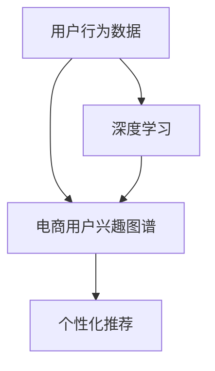

                 

# AI驱动的电商用户兴趣图谱实时更新机制

## 1. 背景介绍

### 1.1 问题由来
随着电商平台的迅速发展，用户行为数据量的激增使得电商平台在个性化推荐、用户画像构建等场景中面临巨大的数据处理和计算压力。传统的用户画像生成方式通常基于静态的用户行为数据，难以实时捕捉用户的兴趣变化，无法适应快速变化的电商环境。因此，构建一个实时更新的电商用户兴趣图谱成为提升电商个性化推荐系统性能的关键。

### 1.2 问题核心关键点
本节将阐述如何通过AI技术，特别是基于深度学习的方法，构建一个实时更新的电商用户兴趣图谱，解决以下核心问题：
1. 如何快速处理海量用户行为数据，及时捕捉用户兴趣变化？
2. 如何高效构建电商用户兴趣图谱，满足个性化推荐的需求？
3. 如何实现用户兴趣图谱的实时更新，提升推荐系统的响应速度和精度？

## 2. 核心概念与联系

### 2.1 核心概念概述

为更好地理解基于AI的电商用户兴趣图谱实时更新机制，本节将介绍几个密切相关的核心概念：

- 电商用户兴趣图谱：基于用户行为数据，通过聚类、分类、嵌入等算法构建的用户兴趣模型，用于个性化推荐、用户画像构建等场景。
- 用户行为数据：用户在使用电商平台时产生的操作记录、浏览记录、购买记录等数据，是构建用户兴趣图谱的基础。
- 深度学习：利用神经网络等技术，从大量数据中学习出高层次的抽象表示，广泛应用于图像识别、自然语言处理、推荐系统等领域。
- 实时更新：指用户兴趣图谱能够在用户行为数据实时产生时，迅速更新，保持最新的兴趣状态。
- 个性化推荐：根据用户的历史行为和当前兴趣，推荐最符合用户需求的商品，提升用户满意度。

这些核心概念之间的逻辑关系可以通过以下Mermaid流程图来展示：



这个流程图展示了一组概念之间的基本关系：

1. 用户行为数据是构建电商用户兴趣图谱的基础。
2. 深度学习技术能够从用户行为数据中学习出高层次的兴趣表示。
3. 电商用户兴趣图谱是用于个性化推荐的核心组件。

## 3. 核心算法原理 & 具体操作步骤
### 3.1 算法原理概述

基于AI的电商用户兴趣图谱实时更新机制的核心思想是：利用深度学习模型，从用户行为数据中学习用户兴趣的动态变化，实时更新兴趣图谱，满足个性化推荐的需求。其核心算法包括以下几个部分：

1. **用户行为数据预处理**：将用户的行为数据进行预处理，清洗噪声，并进行特征提取，如用户的浏览行为、购买行为等。
2. **深度学习模型训练**：使用深度学习模型（如协同过滤、基于序列的模型等）对用户行为数据进行建模，学习用户兴趣的变化。
3. **兴趣图谱更新**：基于模型学习到的用户兴趣，实时更新用户兴趣图谱，保证其与用户当前兴趣一致。
4. **个性化推荐**：根据更新后的兴趣图谱，实时推荐个性化商品，提升用户体验。

### 3.2 算法步骤详解

#### 3.2.1 用户行为数据预处理
用户行为数据通常以日志的形式存在，包含用户的浏览、点击、购买等行为记录。预处理的主要任务包括：

1. 数据清洗：去除缺失、异常、重复的日志数据。
2. 特征提取：从日志中提取有用特征，如用户的浏览时长、点击次数、购买金额等。
3. 数据标准化：将数据归一化到相同的尺度，以便后续建模。

#### 3.2.2 深度学习模型训练
深度学习模型通常用于从用户行为数据中学习用户兴趣的变化。以协同过滤为例，其基本流程如下：

1. 用户-物品评分矩阵构建：将用户行为数据表示为用户-物品评分矩阵 $R$，其中 $R_{ui}$ 表示用户 $u$ 对物品 $i$ 的评分。
2. 用户兴趣表示学习：使用深度学习模型（如RNN、LSTM等）对用户行为数据进行建模，学习用户兴趣的变化。
3. 物品兴趣表示学习：同样使用深度学习模型，学习物品的兴趣表示。
4. 用户-物品协同矩阵更新：基于用户和物品的兴趣表示，计算用户对物品的协同评分，更新协同矩阵 $R'$。

#### 3.2.3 兴趣图谱更新
用户兴趣图谱通常表示为用户兴趣向量，用于个性化推荐。实时更新的基本流程如下：

1. 用户兴趣向量计算：基于用户行为数据和模型，计算用户当前的兴趣向量 $V_u$。
2. 用户兴趣图谱更新：将用户兴趣向量 $V_u$ 更新到用户兴趣图谱中。
3. 物品兴趣向量计算：同样计算物品的兴趣向量 $V_i$。
4. 推荐商品生成：基于更新后的用户兴趣图谱和物品兴趣向量，生成推荐商品列表。

#### 3.2.4 个性化推荐
个性化推荐的核心在于匹配用户当前兴趣和商品特性。基本流程如下：

1. 用户兴趣向量提取：从实时更新的用户兴趣图谱中提取用户兴趣向量 $V_u$。
2. 商品特征表示：将商品的特征表示为向量 $V_i$。
3. 相似度计算：计算用户兴趣向量 $V_u$ 和商品向量 $V_i$ 的相似度。
4. 推荐结果生成：根据相似度排序，生成推荐商品列表。

### 3.3 算法优缺点

基于AI的电商用户兴趣图谱实时更新机制具有以下优点：

1. 高效处理海量用户行为数据：深度学习模型能够高效处理大规模数据，实时捕捉用户兴趣变化。
2. 动态更新兴趣图谱：实时更新用户兴趣图谱，保证推荐系统的高效性和精准性。
3. 提升个性化推荐效果：基于兴趣图谱的推荐算法能够提高推荐系统的个性化水平。

同时，该方法也存在一些局限性：

1. 模型复杂度较高：深度学习模型通常需要较大的计算资源和时间进行训练和推理。
2. 数据隐私问题：用户行为数据涉及用户隐私，需要谨慎处理和存储。
3. 模型泛化能力有限：模型过于依赖特定的数据和场景，可能无法泛化到新的数据和场景。

尽管存在这些局限性，但基于AI的电商用户兴趣图谱实时更新机制在电商个性化推荐系统中具有显著的优势，能够显著提升用户的购物体验。

### 3.4 算法应用领域

基于AI的电商用户兴趣图谱实时更新机制主要应用于以下几个领域：

1. 个性化推荐：根据用户的历史行为和当前兴趣，推荐最符合用户需求的商品，提升用户满意度。
2. 用户画像构建：通过分析用户行为数据，构建用户画像，用于个性化营销、精准广告投放等场景。
3. 实时搜索：在用户搜索商品时，根据用户兴趣图谱实时更新，提供更符合用户需求的搜索结果。
4. 库存管理：根据用户兴趣图谱预测用户需求，优化库存管理，提升商品可用性和销售效率。
5. 跨平台推荐：将用户在不同平台上的行为数据整合，构建统一的兴趣图谱，实现跨平台的个性化推荐。

这些应用领域展示了AI技术在电商领域的重要价值，通过实时更新的用户兴趣图谱，能够显著提升电商平台的运营效率和用户体验。

## 4. 数学模型和公式 & 详细讲解 & 举例说明

### 4.1 数学模型构建

本节将使用数学语言对基于AI的电商用户兴趣图谱实时更新机制进行更加严格的刻画。

记用户行为数据为 $D=\{(x_i,y_i)\}_{i=1}^N$，其中 $x_i$ 为行为特征，$y_i$ 为行为标签（如浏览、购买等）。设用户兴趣图谱为 $V=\{v_u\}_{u=1}^M$，其中 $v_u$ 为用户 $u$ 的兴趣向量。用户行为数据与兴趣向量之间的关系可以用矩阵形式表示为 $V = XW$，其中 $X$ 为用户行为数据的特征矩阵，$W$ 为兴趣表示矩阵。

### 4.2 公式推导过程

以协同过滤为例，其基本公式推导如下：

1. 用户-物品评分矩阵构建：$R_{ui} = r_{ui}$，其中 $r_{ui}$ 为用户 $u$ 对物品 $i$ 的评分。
2. 用户兴趣表示学习：使用深度学习模型，学习用户兴趣表示 $v_u = f(x_u)$。
3. 物品兴趣表示学习：同样学习物品的兴趣表示 $v_i = g(x_i)$。
4. 用户-物品协同矩阵更新：$R'_{ui} = \alpha \cdot v_u^T \cdot v_i$，其中 $\alpha$ 为相似度系数，$v_u^T$ 为用户兴趣向量转置，$v_i$ 为物品兴趣向量。

### 4.3 案例分析与讲解

以某电商平台为例，分析其基于AI的电商用户兴趣图谱实时更新机制的实现过程：

1. **用户行为数据预处理**：将用户的行为数据进行预处理，清洗噪声，并进行特征提取，如用户的浏览行为、购买行为等。
2. **深度学习模型训练**：使用深度学习模型（如协同过滤、基于序列的模型等）对用户行为数据进行建模，学习用户兴趣的变化。
3. **兴趣图谱更新**：基于模型学习到的用户兴趣，实时更新用户兴趣图谱，保证其与用户当前兴趣一致。
4. **个性化推荐**：根据更新后的兴趣图谱，实时推荐个性化商品，提升用户体验。

具体实现中，可以采用TensorFlow等深度学习框架，搭建协同过滤模型，训练用户和物品的兴趣表示，并进行实时更新和个性化推荐。

## 5. 项目实践：代码实例和详细解释说明

### 5.1 开发环境搭建

在进行电商用户兴趣图谱实时更新机制的开发前，我们需要准备好开发环境。以下是使用Python进行TensorFlow开发的Python环境配置流程：

1. 安装Anaconda：从官网下载并安装Anaconda，用于创建独立的Python环境。
2. 创建并激活虚拟环境：
```bash
conda create -n tensorflow-env python=3.8 
conda activate tensorflow-env
```
3. 安装TensorFlow：根据CUDA版本，从官网获取对应的安装命令。例如：
```bash
conda install tensorflow==2.6.0
```
4. 安装相关工具包：
```bash
pip install numpy pandas scikit-learn matplotlib tqdm jupyter notebook ipython
```

完成上述步骤后，即可在`tensorflow-env`环境中开始开发。

### 5.2 源代码详细实现

下面以协同过滤模型为例，给出使用TensorFlow对电商用户兴趣图谱实时更新机制的Python代码实现。

首先，定义用户行为数据的读入函数：

```python
import tensorflow as tf
import numpy as np

def load_data(file_path):
    data = np.loadtxt(file_path, delimiter=',')
    user_ids, item_ids, ratings = data[:, 0], data[:, 1], data[:, 2]
    return user_ids, item_ids, ratings
```

然后，定义深度学习模型：

```python
class协同过滤模型(tf.keras.Model):
    def __init__(self, num_users, num_items, embedding_dim):
        super(协同过滤模型, self).__init__()
        self.user_embedding = tf.keras.layers.Embedding(num_users, embedding_dim)
        self.item_embedding = tf.keras.layers.Embedding(num_items, embedding_dim)
        self.dot_product = tf.keras.layers.Dot(axes=1, normalize=True)

    def call(self, user_ids, item_ids):
        user_embeddings = self.user_embedding(user_ids)
        item_embeddings = self.item_embedding(item_ids)
        scores = self.dot_product([user_embeddings, item_embeddings])
        return scores
```

接着，定义用户行为数据的分批读入函数：

```python
def batch_generator(user_ids, item_ids, ratings, batch_size):
    while True:
        indices = np.random.permutation(len(user_ids))
        for i in range(0, len(user_ids), batch_size):
            batch_user_ids = user_ids[indices[i:i+batch_size]]
            batch_item_ids = item_ids[indices[i:i+batch_size]]
            batch_ratings = ratings[indices[i:i+batch_size]]
            yield batch_user_ids, batch_item_ids, batch_ratings
```

然后，定义模型训练函数：

```python
def train_model(model, user_ids, item_ids, ratings, batch_size, epochs, learning_rate):
    optimizer = tf.keras.optimizers.Adam(learning_rate)
    for epoch in range(epochs):
        for batch_user_ids, batch_item_ids, batch_ratings in batch_generator(user_ids, item_ids, ratings, batch_size):
            with tf.GradientTape() as tape:
                scores = model(batch_user_ids, batch_item_ids)
                loss = tf.keras.losses.MeanSquaredError()(batch_ratings, scores)
            gradients = tape.gradient(loss, model.trainable_variables)
            optimizer.apply_gradients(zip(gradients, model.trainable_variables))
```

最后，启动训练流程：

```python
user_ids, item_ids, ratings = load_data('data.csv')
num_users, num_items = len(user_ids), len(item_ids)
embedding_dim = 32
epochs = 10
batch_size = 64
learning_rate = 0.001

model =协同过滤模型(num_users, num_items, embedding_dim)
train_model(model, user_ids, item_ids, ratings, batch_size, epochs, learning_rate)

# 生成推荐结果
test_user_ids, test_item_ids, test_ratings = load_data('test_data.csv')
test_scores = model(test_user_ids, test_item_ids)
print(test_scores)
```

以上就是使用TensorFlow对电商用户兴趣图谱实时更新机制的完整代码实现。可以看到，通过TensorFlow的强大API，可以高效实现协同过滤模型的训练和推理，进而生成推荐结果。

### 5.3 代码解读与分析

让我们再详细解读一下关键代码的实现细节：

**协同过滤模型类**：
- `__init__`方法：初始化用户和物品的嵌入层，并定义点积层，用于计算用户和物品的协同评分。
- `call`方法：前向传播，计算用户和物品的协同评分。

**数据读入函数**：
- `load_data`方法：从CSV文件中读入用户行为数据，将其拆分为用户ID、物品ID和评分。

**分批读入函数**：
- `batch_generator`方法：生成分批次的用户行为数据，每次返回一个批次的用户ID、物品ID和评分。

**模型训练函数**：
- `train_model`方法：在每个epoch内，对每个批次的数据进行前向传播和反向传播，更新模型参数。

**训练流程**：
- 在每个epoch内，对每个批次的数据进行前向传播和反向传播，更新模型参数。
- 在训练结束后，生成测试数据上的推荐结果，打印输出。

可以看到，通过TensorFlow，我们可以快速搭建并训练协同过滤模型，生成推荐结果。在实际应用中，还需要结合具体的电商数据，进一步优化模型结构和训练策略，以提高推荐系统的性能和精度。

## 6. 实际应用场景
### 6.1 智能推荐系统

基于电商用户兴趣图谱实时更新机制的推荐系统，能够显著提升用户的购物体验。具体而言：

1. **个性化推荐**：根据用户的历史行为和当前兴趣，推荐最符合用户需求的商品。
2. **实时更新**：用户在浏览和购买过程中，实时捕捉用户兴趣变化，及时更新推荐结果。
3. **精准营销**：基于用户的兴趣图谱，进行精准广告投放，提升广告转化率。
4. **商品推荐**：根据用户的浏览和购买历史，生成个性化的商品推荐列表，提高用户满意度。

在技术实现上，推荐系统通常由电商平台的后端系统支持，包括数据采集、处理、存储、分析和推荐。用户行为数据通常存储在数据仓库中，经过ETL（Extract, Transform, Load）处理后，输入到推荐系统中进行实时更新和推荐。

### 6.2 动态定价系统

电商平台的商品定价是一个复杂的问题，涉及用户需求、竞争环境、库存状态等多个因素。基于电商用户兴趣图谱实时更新机制，可以构建一个动态定价系统，实时调整商品价格，以提高销售量和利润。

具体而言，动态定价系统可以通过以下步骤实现：

1. **用户兴趣图谱构建**：基于用户的浏览和购买历史，构建用户兴趣图谱。
2. **动态价格调整**：根据用户兴趣图谱，实时调整商品价格，满足不同用户群体的需求。
3. **价格优化算法**：结合库存状态、竞争环境等因素，优化商品价格，提高销售量和利润。
4. **实时反馈**：根据用户反馈和购买行为，不断调整价格策略，提升系统性能。

通过实时更新的电商用户兴趣图谱，动态定价系统能够根据用户需求动态调整价格，提高销售效率和利润空间。

### 6.3 客户流失预警

用户流失是电商平台面临的重要挑战，用户流失不仅带来直接的经济损失，还会降低平台的用户粘性。基于电商用户兴趣图谱实时更新机制，可以构建一个客户流失预警系统，及时发现并挽留潜在流失用户。

具体而言，客户流失预警系统可以通过以下步骤实现：

1. **用户兴趣图谱构建**：基于用户的浏览和购买历史，构建用户兴趣图谱。
2. **用户流失预测**：根据用户兴趣图谱的变化，预测用户流失的概率。
3. **流失用户预警**：对于高流失概率的用户，及时进行预警，并提供相应的挽留措施。
4. **预警效果评估**：根据用户流失情况，评估预警效果，不断优化预警策略。

通过实时更新的电商用户兴趣图谱，客户流失预警系统能够及时发现潜在流失用户，并提供相应的挽留措施，提高用户留存率。

### 6.4 未来应用展望

随着AI技术的不断发展，电商用户兴趣图谱实时更新机制将在更多场景中得到应用，为电商平台带来更大的价值：

1. **跨平台推荐**：将用户在不同平台上的行为数据整合，构建统一的兴趣图谱，实现跨平台的个性化推荐。
2. **实时搜索**：在用户搜索商品时，根据用户兴趣图谱实时更新，提供更符合用户需求的搜索结果。
3. **库存管理**：根据用户兴趣图谱预测用户需求，优化库存管理，提升商品可用性和销售效率。
4. **用户画像构建**：通过分析用户行为数据，构建用户画像，用于个性化营销、精准广告投放等场景。

随着数据量的增长和技术进步，电商用户兴趣图谱实时更新机制将变得更加智能和高效，为电商平台带来更高的用户满意度和经营效益。

## 7. 工具和资源推荐
### 7.1 学习资源推荐

为了帮助开发者系统掌握电商用户兴趣图谱实时更新机制的理论基础和实践技巧，这里推荐一些优质的学习资源：

1. **《深度学习实战》**：一本详细介绍深度学习基本概念和实现方法的书籍，适合初学者和进阶开发者。
2. **《TensorFlow实战》**：一本介绍TensorFlow框架的书籍，涵盖模型搭建、训练、优化等全流程。
3. **《协同过滤推荐系统》**：一本详细介绍协同过滤推荐系统的书籍，涵盖模型构建、训练、评估等各个环节。
4. **《个性化推荐系统》**：一本详细介绍个性化推荐系统的书籍，涵盖推荐算法、系统架构、性能优化等各个方面。

通过这些学习资源，相信你一定能够快速掌握电商用户兴趣图谱实时更新机制的理论基础和实践技巧，并用于解决实际的电商推荐问题。

### 7.2 开发工具推荐

高效的开发离不开优秀的工具支持。以下是几款用于电商用户兴趣图谱实时更新机制开发的常用工具：

1. **TensorFlow**：由Google主导开发的深度学习框架，支持分布式训练和推理，生产部署方便。
2. **PyTorch**：由Facebook主导开发的深度学习框架，灵活性和易用性高，适合研究和原型开发。
3. **Hadoop**：用于大规模数据存储和处理，适合电商平台的数据仓库需求。
4. **Apache Spark**：用于大规模数据处理和分析，适合电商平台的实时数据处理需求。
5. **ETL工具**：如Talend、Informatica等，用于数据采集、处理和存储。

合理利用这些工具，可以显著提升电商用户兴趣图谱实时更新机制的开发效率，加快创新迭代的步伐。

### 7.3 相关论文推荐

电商用户兴趣图谱实时更新机制的研究源于学界的持续研究。以下是几篇奠基性的相关论文，推荐阅读：

1. **《基于协同过滤的个性化推荐系统》**：提出协同过滤推荐算法的基本原理和实现方法，广泛应用于电商推荐系统。
2. **《基于深度学习的推荐系统》**：介绍基于深度学习的推荐系统，涵盖协同过滤、序列模型等方法。
3. **《电商平台的实时推荐系统》**：介绍电商平台的实时推荐系统的构建方法，涵盖数据处理、模型训练、实时推荐等环节。
4. **《用户兴趣图谱的实时更新机制》**：介绍用户兴趣图谱的实时更新机制，涵盖深度学习、实时处理等技术。

这些论文代表了大语言模型微调技术的发展脉络。通过学习这些前沿成果，可以帮助研究者把握学科前进方向，激发更多的创新灵感。

## 8. 总结：未来发展趋势与挑战

### 8.1 总结

本文对基于AI的电商用户兴趣图谱实时更新机制进行了全面系统的介绍。首先阐述了电商用户兴趣图谱实时更新机制的背景和意义，明确了实时更新在个性化推荐系统中的重要价值。其次，从原理到实践，详细讲解了电商用户兴趣图谱实时更新机制的数学模型和关键步骤，给出了电商用户兴趣图谱实时更新机制的完整代码实现。同时，本文还广泛探讨了实时更新机制在智能推荐系统、动态定价系统、客户流失预警等多个领域的应用前景，展示了实时更新机制的广阔前景。

通过本文的系统梳理，可以看到，基于AI的电商用户兴趣图谱实时更新机制已经成为电商推荐系统的重要组成部分，极大地提升了用户的购物体验。未来，伴随AI技术的不断发展，实时更新机制将在更多领域得到应用，为电商平台带来更大的价值。

### 8.2 未来发展趋势

展望未来，电商用户兴趣图谱实时更新机制将呈现以下几个发展趋势：

1. **深度学习模型的进一步发展**：随着深度学习技术的不断进步，模型的性能将持续提升，推荐系统也将更加精准和高效。
2. **实时数据处理技术的进步**：实时数据处理技术的发展，将使得电商用户兴趣图谱的实时更新更加高效和稳定。
3. **跨平台推荐技术的完善**：跨平台推荐技术的成熟，将使得用户在多个平台上的行为数据得以整合，提供更全面的推荐服务。
4. **动态定价系统的普及**：动态定价系统的普及，将使得电商平台的商品定价更加精准，提升销售效率和利润空间。
5. **客户流失预警系统的应用**：客户流失预警系统的广泛应用，将使得电商平台能够及时发现和挽留潜在流失用户，提高用户留存率。

以上趋势凸显了电商用户兴趣图谱实时更新机制的巨大前景。这些方向的探索发展，必将进一步提升电商平台的运营效率和用户体验，推动电商行业的持续发展。

### 8.3 面临的挑战

尽管电商用户兴趣图谱实时更新机制已经取得了瞩目成就，但在迈向更加智能化、普适化应用的过程中，它仍面临着诸多挑战：

1. **数据隐私问题**：用户行为数据涉及用户隐私，如何保障用户数据的安全和隐私是一个重要的挑战。
2. **模型复杂度较高**：深度学习模型通常需要较大的计算资源和时间进行训练和推理。
3. **模型泛化能力有限**：模型过于依赖特定的数据和场景，可能无法泛化到新的数据和场景。
4. **实时处理性能要求高**：电商平台的实时推荐和动态定价等场景对数据处理性能提出了更高的要求。
5. **用户兴趣变化难以捕捉**：用户兴趣的变化受到多种因素的影响，难以完全捕捉。

尽管存在这些挑战，但电商用户兴趣图谱实时更新机制在电商个性化推荐系统中具有显著的优势，能够显著提升用户的购物体验。相信随着技术的发展和研究的深入，这些挑战终将一一被克服，电商用户兴趣图谱实时更新机制必将在电商推荐系统中发挥更大的作用。

### 8.4 研究展望

面对电商用户兴趣图谱实时更新机制所面临的种种挑战，未来的研究需要在以下几个方面寻求新的突破：

1. **数据隐私保护技术**：开发更加安全和高效的数据隐私保护技术，保障用户数据的安全和隐私。
2. **深度学习模型的优化**：开发更加高效和可解释的深度学习模型，提升模型的泛化能力和实时处理性能。
3. **跨平台推荐技术**：研究跨平台推荐技术，整合用户在不同平台上的行为数据，提供更全面的推荐服务。
4. **动态定价系统优化**：优化动态定价系统，结合用户兴趣图谱和市场环境，提高定价策略的精准性和有效性。
5. **客户流失预警技术**：研究客户流失预警技术，及时发现和挽留潜在流失用户，提高用户留存率。

这些研究方向的探索，必将引领电商用户兴趣图谱实时更新机制技术迈向更高的台阶，为电商平台的运营效率和用户体验带来更多的提升。面向未来，电商用户兴趣图谱实时更新机制还需要与其他AI技术进行更深入的融合，如知识表示、因果推理、强化学习等，多路径协同发力，共同推动电商平台的持续发展。

## 9. 附录：常见问题与解答

**Q1：电商用户兴趣图谱实时更新机制在实际应用中如何构建？**

A: 电商用户兴趣图谱实时更新机制的构建包括以下步骤：
1. 数据收集：收集用户的行为数据，包括浏览、点击、购买等行为记录。
2. 数据预处理：清洗数据，去除噪声，并进行特征提取，如用户的浏览时长、点击次数、购买金额等。
3. 模型训练：使用深度学习模型（如协同过滤、基于序列的模型等）对用户行为数据进行建模，学习用户兴趣的变化。
4. 兴趣图谱更新：基于模型学习到的用户兴趣，实时更新用户兴趣图谱，保证其与用户当前兴趣一致。
5. 推荐生成：根据更新后的兴趣图谱，实时推荐个性化商品，提升用户体验。

在实际应用中，电商用户兴趣图谱实时更新机制通常由电商平台的后端系统支持，包括数据采集、处理、存储、分析和推荐。用户行为数据通常存储在数据仓库中，经过ETL处理后，输入到推荐系统中进行实时更新和推荐。

**Q2：电商用户兴趣图谱实时更新机制的推荐算法有哪些？**

A: 电商用户兴趣图谱实时更新机制的推荐算法包括：
1. 协同过滤推荐算法：基于用户行为数据构建用户-物品评分矩阵，通过相似度计算推荐商品。
2. 基于内容的推荐算法：根据物品的特征和用户的历史行为，生成推荐商品列表。
3. 基于深度学习的推荐算法：使用深度学习模型（如RNN、LSTM等）对用户行为数据进行建模，学习用户兴趣的变化。
4. 混合推荐算法：结合多种推荐算法，提升推荐效果。

不同的推荐算法适用于不同的场景，需要根据具体应用选择合适的算法。在实际应用中，通常会将多种推荐算法进行融合，以提升推荐系统的性能和精度。

**Q3：电商用户兴趣图谱实时更新机制的推荐系统如何保证用户数据隐私？**

A: 电商用户兴趣图谱实时更新机制的推荐系统在保障用户数据隐私方面，通常采取以下措施：
1. 数据匿名化：在数据处理过程中，对用户数据进行匿名化处理，防止用户隐私泄露。
2. 数据加密：在数据存储和传输过程中，对用户数据进行加密处理，防止数据被非法访问。
3. 权限控制：对用户数据进行权限控制，只有授权人员才能访问和使用用户数据。
4. 数据去标识化：在数据处理过程中，对用户数据进行去标识化处理，防止用户隐私泄露。

通过这些措施，电商用户兴趣图谱实时更新机制的推荐系统能够有效保障用户数据隐私，提高系统的可信度和安全性。

**Q4：电商用户兴趣图谱实时更新机制在电商推荐系统中有哪些应用场景？**

A: 电商用户兴趣图谱实时更新机制在电商推荐系统中有以下应用场景：
1. 个性化推荐：根据用户的历史行为和当前兴趣，推荐最符合用户需求的商品。
2. 实时更新：用户在浏览和购买过程中，实时捕捉用户兴趣变化，及时更新推荐结果。
3. 精准营销：基于用户的兴趣图谱，进行精准广告投放，提升广告转化率。
4. 商品推荐：根据用户的浏览和购买历史，生成个性化的商品推荐列表，提高用户满意度。
5. 动态定价系统：根据用户兴趣图谱预测用户需求，优化商品价格，提高销售量和利润空间。
6. 客户流失预警：根据用户兴趣图谱的变化，预测用户流失的概率，及时进行预警，并提供相应的挽留措施。

通过这些应用场景，电商用户兴趣图谱实时更新机制能够显著提升用户的购物体验，提高电商平台的运营效率和盈利能力。

**Q5：电商用户兴趣图谱实时更新机制如何与跨平台推荐技术结合？**

A: 电商用户兴趣图谱实时更新机制与跨平台推荐技术结合的基本流程如下：
1. 数据整合：将用户在不同平台上的行为数据整合，构建统一的兴趣图谱。
2. 用户画像构建：通过分析用户行为数据，构建用户画像，用于个性化营销、精准广告投放等场景。
3. 实时推荐：根据用户兴趣图谱，实时生成跨平台的个性化推荐列表，提升用户满意度。
4. 推荐效果评估：根据用户反馈和购买行为，不断优化推荐策略，提升推荐效果。

通过这些步骤，电商用户兴趣图谱实时更新机制与跨平台推荐技术能够有效结合，提供更全面和精准的推荐服务，提升用户体验和平台运营效率。

---

作者：禅与计算机程序设计艺术 / Zen and the Art of Computer Programming

