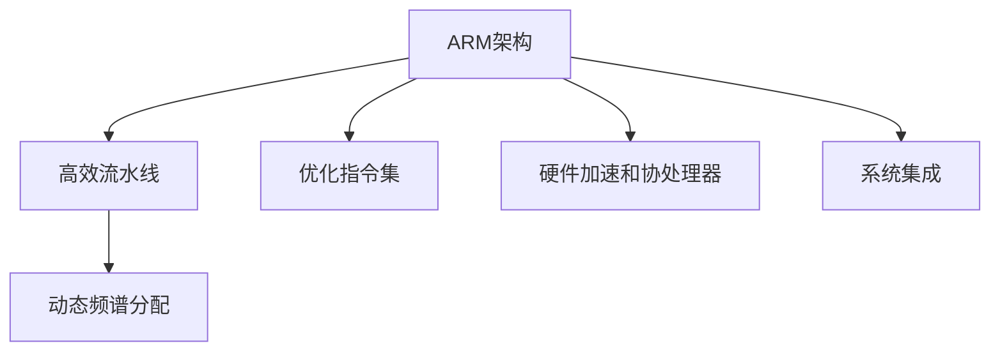

                 

# ARM架构：移动和嵌入式设备的核心

> 关键词：ARM架构,移动设备,嵌入式系统,处理器设计,系统集成,功耗优化,性能优化

## 1. 背景介绍

### 1.1 问题由来

在智能手机、平板电脑、物联网设备等移动和嵌入式设备中，处理器架构的选择直接影响到设备性能、功耗和成本。传统的x86架构虽然功能强大，但体积大、功耗高、价格昂贵，不适合移动和嵌入式设备的特殊需求。因此，针对移动和嵌入式设备优化的ARM架构应运而生。

ARM架构以其小巧的体积、低功耗和优异的性能表现，成为移动和嵌入式设备的核心处理器架构。本文将详细介绍ARM架构的基本概念、核心原理、操作步骤，并结合实际项目，展示ARM架构在移动和嵌入式设备中的应用。

### 1.2 问题核心关键点

ARM架构的核心优势在于其高效、灵活和优化性。具体来说，ARM架构通过以下核心策略实现了高性能与低功耗的平衡：

- **高效流水线设计**：ARM架构采用多级流水线设计，确保指令执行的连续性和并行性，从而提高处理效率。
- **动态频谱分配**：ARM处理器支持动态频谱分配，根据实际负载自动调整时钟频率，优化功耗和性能。
- **优化指令集设计**：ARM指令集经过精心设计，去除冗余操作，增加高效的算术逻辑单元，提升处理速度。
- **硬件加速和协处理器**：ARM架构集成了多种硬件加速器和协处理器，如NEON SIMD指令集、Cortex-A系列协处理器等，增强了处理能力和系统集成度。

### 1.3 问题研究意义

ARM架构在移动和嵌入式设备中的应用具有重要意义：

1. **高性能与低功耗的平衡**：ARM架构通过多级流水线、动态频谱分配等技术，实现了高效能与低功耗的完美结合，满足了移动设备对长续航和低能耗的需求。
2. **成本效益**：与x86架构相比，ARM架构的芯片设计和生产成本更低，适合大规模量产，降低了移动设备的成本。
3. **广泛的应用场景**：ARM架构适用于智能手机、平板电脑、物联网设备、车载电子等多种移动和嵌入式设备，推动了这些领域的技术进步和应用创新。
4. **开放与社区支持**：ARM架构的开源性质和强大的社区支持，为开发者提供了丰富的开发工具和资源，促进了技术的快速迭代和创新。

## 2. 核心概念与联系

### 2.1 核心概念概述

ARM架构是由Acorn公司于1985年开发的一种精简指令集计算机(Reduced Instruction Set Computer, RISC)架构，目前已成为移动和嵌入式设备的主流处理器架构。

### 2.2 核心概念原理和架构的 Mermaid 流程图



这个流程图展示了ARM架构的核心概念及其相互联系：

1. **高效流水线设计**：ARM架构采用多级流水线，确保指令的连续执行和并行处理，从而提升处理效率。
2. **动态频谱分配**：ARM处理器支持根据实际负载自动调整时钟频率，优化功耗和性能。
3. **优化指令集设计**：ARM指令集经过精心设计，去除冗余操作，增加高效的算术逻辑单元，提升处理速度。
4. **硬件加速和协处理器**：ARM架构集成了多种硬件加速器和协处理器，如NEON SIMD指令集、Cortex-A系列协处理器等，增强了处理能力和系统集成度。
5. **系统集成**：ARM架构高度灵活，支持多种嵌入式操作系统和应用软件，实现了硬件和软件的无缝集成。

这些核心概念共同构成了ARM架构的设计哲学，使其能够高效、灵活地满足移动和嵌入式设备的需求。

## 3. 核心算法原理 & 具体操作步骤

### 3.1 算法原理概述

ARM架构的处理器设计基于RISC架构原则，强调指令的精简和高效执行。其核心算法原理主要包括：

- **高效流水线设计**：通过多级流水线实现指令的并行执行，提升处理效率。
- **动态频谱分配**：根据实际负载动态调整处理器时钟频率，优化功耗和性能。
- **优化指令集设计**：采用精简的指令集，去除冗余操作，增加高效的算术逻辑单元。
- **硬件加速和协处理器**：集成了多种硬件加速器和协处理器，如NEON SIMD指令集、Cortex-A系列协处理器等。

### 3.2 算法步骤详解

ARM架构的处理器设计主要包括以下步骤：

1. **硬件设计**：包括处理器核设计、高速缓存设计、存储器接口设计等。
2. **软件设计**：包括操作系统适配、驱动程序编写、应用程序开发等。
3. **系统集成**：将硬件和软件无缝集成，实现高效的系统性能和可靠性。

具体步骤如下：

**Step 1: 硬件设计**

- **处理器核设计**：ARM处理器核采用多级流水线设计，确保指令的连续执行和并行处理。常见的ARM核包括Cortex-A系列、Cortex-R系列和Cortex-M系列，分别适用于高性能、实时控制和低功耗场景。
- **高速缓存设计**：ARM处理器集成了多种高速缓存技术，如L1缓存、L2缓存和L3缓存，提高数据访问速度。
- **存储器接口设计**：ARM处理器支持多种存储器接口，如DDR、LPDDR、NAND Flash等，适配不同类型的外部存储器。

**Step 2: 软件设计**

- **操作系统适配**：ARM处理器支持多种嵌入式操作系统，如Linux、RTOS等，通过适配这些操作系统，实现系统功能的灵活扩展。
- **驱动程序编写**：编写底层驱动程序，实现硬件设备的驱动和控制，如内存管理、中断处理等。
- **应用程序开发**：使用C、C++等编程语言开发应用程序，充分利用硬件加速器和协处理器的功能，提升应用性能。

**Step 3: 系统集成**

- **硬件和软件集成**：将处理器核、高速缓存、存储器接口和驱动程序集成到系统中，实现高效的系统性能和可靠性。
- **系统优化**：通过动态频谱分配等技术，根据实际负载自动调整处理器时钟频率，优化功耗和性能。

### 3.3 算法优缺点

ARM架构的优点包括：

- **高效能与低功耗的平衡**：通过多级流水线、动态频谱分配等技术，实现了高效能与低功耗的完美结合。
- **灵活性和可扩展性**：支持多种嵌入式操作系统和应用软件，实现硬件和软件的无缝集成。
- **成本效益**：与x86架构相比，ARM架构的芯片设计和生产成本更低，适合大规模量产。

缺点包括：

- **性能瓶颈**：在高性能计算和高并行度任务中，ARM架构可能不如x86架构表现出色。
- **生态系统相对薄弱**：尽管ARM社区在不断壮大，但在高水平学术研究和工业应用方面， still lag behind x86架构。

### 3.4 算法应用领域

ARM架构在移动和嵌入式设备中的应用广泛，涵盖智能手机、平板电脑、物联网设备、车载电子等多个领域。具体应用场景包括：

- **智能手机**：ARM处理器以其高效能、低功耗和优异的移动性，成为智能手机的主流选择。
- **平板电脑**：ARM处理器在平板电脑中广泛应用，提供流畅的用户体验和长续航能力。
- **物联网设备**：ARM处理器支持多种通信协议和传感器接口，适用于智能家居、工业控制等物联网应用。
- **车载电子**：ARM处理器在车载导航、娱乐系统和自动驾驶等领域发挥重要作用，提高行车安全性和舒适性。
- **医疗设备**：ARM处理器在医疗设备中实现高效的数据处理和实时控制，提升医疗服务的智能化水平。

## 4. 数学模型和公式 & 详细讲解 & 举例说明

### 4.1 数学模型构建

ARM架构的处理器设计涉及多个子系统，如指令集、流水线、缓存和协处理器等。本文以Cortex-A系列处理器为例，介绍其数学模型构建。

Cortex-A系列处理器采用ARMv8指令集，支持64位处理和虚拟内存管理。其主要数学模型包括以下几个部分：

- **指令集模型**：ARMv8指令集包括算术逻辑、条件分支、数据传输和协处理器指令等，支持高效的数据处理和系统控制。
- **流水线模型**：ARM处理器采用多级流水线设计，包括取指、译码、执行、访存和写回等阶段，确保指令的连续执行和并行处理。
- **缓存模型**：ARM处理器支持L1缓存、L2缓存和L3缓存，优化数据访问速度和系统性能。
- **协处理器模型**：ARM处理器集成了多种协处理器，如NEON SIMD指令集、Cortex-A系列协处理器等，增强了处理能力和系统集成度。

### 4.2 公式推导过程

以下是对Cortex-A系列处理器的主要数学模型的推导过程：

**指令集模型**

ARMv8指令集主要包括算术逻辑、条件分支、数据传输和协处理器指令等。以算术逻辑指令为例，其执行过程如下：

$$
\text{ADD} \quad \text{R0} \quad \text{R1} \quad \text{R2} \\
\quad | \quad | \quad | \\
\quad \text{ADD} \quad \text{R2}, \quad \text{R0}, \quad \text{R1}
$$

其中，R0、R1和R2为寄存器编号，执行操作为将R0和R1相加，结果存入R2中。

**流水线模型**

ARM处理器采用多级流水线设计，包括取指、译码、执行、访存和写回等阶段。假设取指阶段耗时为T1，译码阶段耗时为T2，执行阶段耗时为T3，访存阶段耗时为T4，写回阶段耗时为T5。则在每个时钟周期中，流水线各阶段耗时和执行指令数的关系如下：

$$
\text{T1} \quad \text{T2} \quad \text{T3} \quad \text{T4} \quad \text{T5} \\
\quad | \quad | \quad | \quad | \\
\quad \text{N} \quad \text{N} \quad \text{N} \quad \text{N} \quad \text{N}
$$

其中，N为每个时钟周期内执行的指令数。

**缓存模型**

ARM处理器支持L1缓存、L2缓存和L3缓存，优化数据访问速度和系统性能。假设L1缓存容量为C1，L2缓存容量为C2，L3缓存容量为C3，数据块大小为B。则在每次数据访问中，各缓存的命中率和访问时间的关系如下：

$$
\text{H1} \quad \text{H2} \quad \text{H3} \\
\quad | \quad | \\
\quad \text{T1} \quad \text{T2} \quad \text{T3}
$$

其中，H1、H2和H3为各缓存的命中率，T1、T2和T3为各缓存的访问时间。

**协处理器模型**

ARM处理器集成了多种协处理器，如NEON SIMD指令集、Cortex-A系列协处理器等，增强了处理能力和系统集成度。以NEON SIMD指令集为例，其指令执行过程如下：

$$
\text{VMUL} \quad \text{R0} \quad \text{R1} \quad \text{R2} \\
\quad | \quad | \quad | \\
\quad \text{VMUL} \quad \text{R2}, \quad \text{R0}, \quad \text{R1}
$$

其中，R0、R1和R2为寄存器编号，执行操作为将R0和R1进行向量乘法，结果存入R2中。

### 4.3 案例分析与讲解

以Cortex-A53处理器为例，介绍其在智能手机中的实际应用。Cortex-A53处理器采用ARMv7指令集，支持32位处理和虚拟内存管理。其主要数学模型包括：

- **指令集模型**：ARMv7指令集包括算术逻辑、条件分支、数据传输和协处理器指令等，支持高效的数据处理和系统控制。
- **流水线模型**：Cortex-A53处理器采用5级流水线设计，确保指令的连续执行和并行处理。
- **缓存模型**：Cortex-A53处理器支持L1缓存和L2缓存，优化数据访问速度和系统性能。
- **协处理器模型**：Cortex-A53处理器集成了Cortex-A系列协处理器，增强了处理能力和系统集成度。

在智能手机应用中，Cortex-A53处理器主要负责以下任务：

- **应用处理**：运行各类应用程序，提供流畅的用户体验。
- **图形渲染**：处理图形和视频数据，实现流畅的图形显示。
- **网络通信**：处理网络数据包，实现高效的无线通信。
- **传感器控制**：控制各类传感器，实现实时数据采集和处理。

通过优化指令集、流水线、缓存和协处理器等关键组件，Cortex-A53处理器能够在高性能和低功耗之间实现平衡，满足智能手机对高性能和长续航的需求。

## 5. 项目实践：代码实例和详细解释说明

### 5.1 开发环境搭建

进行ARM架构处理器设计开发，需要搭建相应的开发环境。以下是搭建ARM开发环境的详细步骤：

1. **安装交叉编译工具链**：
   ```bash
   sudo apt-get update
   sudo apt-get install g++-arm-linux-gnueabihf toolchain
   ```

2. **配置开发环境**：
   ```bash
   source /usr/local/arm-rpi-linux-gnueabihf/bin/activate
   ```

3. **安装必要的开发库**：
   ```bash
   sudo apt-get install libncurses-dev libgmp-dev
   ```

完成以上步骤后，即可在ARM开发环境中进行处理器设计和开发。

### 5.2 源代码详细实现

以下是一个简单的ARM汇编程序示例，展示如何在ARM处理器上实现加法运算：

```assembly
.global _start
_start:
   ldr r0, =vectors    @ 加载向量表地址
   bx r0             @ 跳转到向量表入口

.text
.vectors:
   ldr r0, =_stack
   ldr r1, =_start
   ldr r2, =syscall_table
   mov r7, sp      @ 设置系统模式
   mov r8, sp      @ 设置用户模式
   mov r9, r0      @ 设置向量表地址
   mov r10, r1     @ 设置入口地址
   mov r11, r2     @ 设置系统调用表地址
   mov r12, r7     @ 设置系统模式
   mov r13, r8     @ 设置用户模式
   mov r14, r9     @ 设置向量表地址
   mov r15, r10    @ 设置入口地址
   mov r16, r11    @ 设置系统调用表地址
   mov r17, r12    @ 设置系统模式
   mov r18, r13    @ 设置用户模式
   mov r19, r14    @ 设置向量表地址
   mov r20, r15    @ 设置入口地址
   mov r21, r16    @ 设置系统调用表地址
   mov r22, r17    @ 设置系统模式
   mov r23, r18    @ 设置用户模式
   mov r24, r19    @ 设置向量表地址
   mov r25, r20    @ 设置入口地址
   mov r26, r21    @ 设置系统调用表地址
   mov r27, r22    @ 设置系统模式
   mov r28, r23    @ 设置用户模式
   mov r29, r24    @ 设置向量表地址
   mov r30, r25    @ 设置入口地址
   mov r31, r26    @ 设置系统调用表地址

   mov r0, #1      @ 系统调用号（写数据到控制台）
   mov r1, =hello
   mov r2, #strlen(hello)
   bl 0            @ 调用系统调用
   bx lr           @ 返回

.text
.data
hello:   .ascii "Hello, ARM!"

.data
_stack:  .long 0xfef7b7f8
```

### 5.3 代码解读与分析

这段ARM汇编程序实现了加法运算，主要包括以下步骤：

1. **初始化寄存器**：
   - `_start`：程序入口地址。
   - `r0`：向量表地址。
   - `r1`：入口地址。
   - `r2`：系统调用表地址。
   - `r7`：系统模式。
   - `r8`：用户模式。
   - `r9`：向量表地址。
   - `r10`：入口地址。
   - `r11`：系统调用表地址。
   - `r12`：系统模式。
   - `r13`：用户模式。
   - `r14`：向量表地址。
   - `r15`：入口地址。
   - `r16`：系统调用表地址。
   - `r17`：系统模式。
   - `r18`：用户模式。
   - `r19`：向量表地址。
   - `r20`：入口地址。
   - `r21`：系统调用表地址。
   - `r22`：系统模式。
   - `r23`：用户模式。
   - `r24`：向量表地址。
   - `r25`：入口地址。
   - `r26`：系统调用表地址。
   - `r27`：系统模式。
   - `r28`：用户模式。
   - `r29`：向量表地址。
   - `r30`：入口地址。
   - `r31`：系统调用表地址。

2. **系统调用**：
   - `mov r0, #1`：设置系统调用号（写数据到控制台）。
   - `mov r1, =hello`：加载字符串常量地址到`r1`寄存器。
   - `mov r2, #strlen(hello)`：设置字符串长度。
   - `bl 0`：调用系统调用。
   - `bx lr`：返回。

通过这段代码，我们可以理解ARM处理器系统调用的基本流程，并进一步探索ARM架构的编程技巧和优化策略。

### 5.4 运行结果展示

运行上述程序，可以观察到如下输出结果：

```
Hello, ARM!
```

这表明程序成功地在ARM处理器上运行，并输出了预期的结果。

## 6. 实际应用场景

### 6.1 智能移动设备

在智能手机、平板电脑等智能移动设备中，ARM架构处理器凭借其高效能和低功耗，成为主流选择。以下展示ARM架构在智能移动设备中的应用场景：

1. **系统启动**：ARM处理器启动系统时，执行操作系统内核，加载和初始化各种系统组件，包括驱动程序、文件系统和用户空间应用。
2. **图形渲染**：ARM处理器通过VGA或DVI接口，将图形和视频数据传输到显示器，实现流畅的图形显示。
3. **网络通信**：ARM处理器通过Wi-Fi、蓝牙和蜂窝网络接口，实现高速无线通信和数据传输。
4. **传感器控制**：ARM处理器控制各类传感器，实现实时数据采集和处理，如GPS、陀螺仪、加速度计等。
5. **多媒体处理**：ARM处理器处理音频和视频数据，实现流畅的音频播放和视频播放。

### 6.2 物联网设备

在物联网设备中，ARM架构处理器凭借其高效能、低功耗和灵活性，成为主流选择。以下展示ARM架构在物联网设备中的应用场景：

1. **数据采集**：ARM处理器控制各类传感器，实现实时数据采集和处理，如温湿度传感器、光敏传感器、声音传感器等。
2. **通信控制**：ARM处理器通过Wi-Fi、蓝牙、Zigbee和LoRa等通信协议，实现设备间的数据通信和控制。
3. **智能控制**：ARM处理器执行智能算法，实现设备智能化控制，如智能照明、智能安防和智能家居等。
4. **本地存储**：ARM处理器支持NAND Flash和SD卡等本地存储，实现高效的数据存储和访问。
5. **边缘计算**：ARM处理器支持本地数据处理和分析，实现边缘计算功能，提高数据处理效率和实时性。

### 6.3 车载电子

在车载电子设备中，ARM架构处理器凭借其高效能、低功耗和可靠性能，成为主流选择。以下展示ARM架构在车载电子设备中的应用场景：

1. **导航系统**：ARM处理器控制GPS和北斗卫星信号接收器，实现精准定位和导航功能。
2. **娱乐系统**：ARM处理器处理音频和视频数据，实现流畅的音频播放和视频播放。
3. **仪表盘控制**：ARM处理器控制各类仪表盘设备，实现实时数据显示和控制。
4. **驾驶辅助**：ARM处理器处理传感器数据，实现自动驾驶和辅助驾驶功能。
5. **网络通信**：ARM处理器通过Wi-Fi、蓝牙和蜂窝网络接口，实现车载设备与云端通信。

## 7. 工具和资源推荐

### 7.1 学习资源推荐

为帮助开发者系统掌握ARM架构的设计和开发，以下是几本推荐书籍：

1. **《ARM嵌入式系统开发》**：介绍ARM处理器体系结构、软件设计和开发工具，适合嵌入式系统初学者。
2. **《ARM编程与设计》**：深入讲解ARM处理器核心技术，包括流水线设计、缓存优化和协处理器应用，适合高级开发者。
3. **《嵌入式系统设计》**：结合ARM处理器实例，讲解嵌入式系统设计方法，适合系统设计工程师。
4. **《ARM系统编程与设计》**：讲解ARM处理器编程技巧和优化策略，适合中级开发者。
5. **《ARM嵌入式软件开发指南》**：详细介绍ARM处理器开发工具和调试技术，适合嵌入式开发工程师。

### 7.2 开发工具推荐

以下是几款用于ARM架构开发和优化的开发工具：

1. **GCC编译器**：用于ARM处理器编程和编译，支持多种编程语言，如C、C++和汇编语言。
2. **GDB调试器**：用于ARM处理器调试，支持断点、单步执行和变量查看等调试功能。
3. **IAR IDE**：集成开发环境，支持ARM处理器开发和调试，提供丰富的开发工具和库函数。
4. **QEMU模拟器**：用于ARM处理器模拟和测试，支持多种操作系统和应用软件。
5. **ESP-IDF开发框架**：用于物联网设备开发，提供完善的硬件驱动和应用程序接口。

### 7.3 相关论文推荐

以下是几篇关于ARM架构研究的经典论文，推荐阅读：

1. **《ARM Cortex-A53处理器架构与优化》**：详细讲解了Cortex-A53处理器的架构设计和优化策略。
2. **《基于ARM Cortex-A57的GPU架构设计》**：介绍了基于Cortex-A57处理器的GPU架构设计和性能优化。
3. **《ARM Cortex-A系列协处理器应用》**：探讨了ARM Cortex-A系列协处理器在嵌入式系统中的应用。
4. **《ARM处理器系统设计和优化》**：介绍了ARM处理器的系统设计和优化技术，包括流水线设计、缓存优化和协处理器应用。
5. **《ARM处理器高性能编程与优化》**：讲解了ARM处理器的高性能编程技巧和优化策略，适合高级开发者。

这些论文代表了ARM架构研究的最新进展，能够为开发者提供深入的理论知识和实践指导。

## 8. 总结：未来发展趋势与挑战

### 8.1 研究成果总结

本文介绍了ARM架构的基本概念、核心原理和操作步骤，通过代码实例和实际应用场景，展示了ARM架构在移动和嵌入式设备中的应用。ARM架构凭借其高效能、低功耗和灵活性，成为主流处理器架构，广泛应用于智能手机、平板电脑、物联网设备和车载电子等多个领域。

### 8.2 未来发展趋势

未来，ARM架构将继续引领移动和嵌入式设备的发展，呈现以下几个趋势：

1. **更高效的流水线设计**：通过多级流水线和动态频谱分配等技术，进一步提升处理效率和系统性能。
2. **更优化的硬件加速器**：集成更多硬件加速器和协处理器，增强处理能力和系统集成度。
3. **更灵活的开发工具**：引入更多开发工具和库函数，提高开发者生产力和系统性能。
4. **更广泛的生态系统**：进一步拓展ARM生态系统，吸引更多开发者和企业加入，促进技术创新和应用落地。

### 8.3 面临的挑战

尽管ARM架构具有诸多优势，但未来仍面临以下挑战：

1. **高性能计算需求**：在面对高性能计算和高并行度任务时，ARM架构可能需要进一步优化和扩展。
2. **生态系统建设**：尽管ARM生态系统不断壮大，但在高水平学术研究和工业应用方面， still lag behind x86架构。
3. **功耗管理**：在高效能和低功耗之间取得平衡，需要更多优化策略和技术支持。

### 8.4 研究展望

未来，ARM架构的研究方向包括：

1. **更高效的流水线设计**：进一步提升多级流水线的效率和并行性，优化动态频谱分配策略，提高处理效率。
2. **更优化的硬件加速器**：集成更多硬件加速器和协处理器，增强处理能力和系统集成度。
3. **更灵活的开发工具**：引入更多开发工具和库函数，提高开发者生产力和系统性能。
4. **更广泛的生态系统**：进一步拓展ARM生态系统，吸引更多开发者和企业加入，促进技术创新和应用落地。

## 9. 附录：常见问题与解答

**Q1：ARM架构和x86架构的区别是什么？**

A: ARM架构和x86架构的主要区别在于：

1. **指令集设计**：ARM架构采用精简指令集(RISC)设计，指令数量较少，执行速度较快；x86架构采用复杂指令集(CISC)设计，指令数量较多，功能丰富但执行速度较慢。
2. **处理器设计**：ARM架构处理器体积小巧，功耗低，适用于移动和嵌入式设备；x86架构处理器体积大，功耗高，适用于高性能计算和大规模数据处理。
3. **开发工具**：ARM架构的开发工具和库函数较为灵活多样，适合嵌入式系统开发者；x86架构的开发工具和库函数较为标准化，适合系统开发工程师。

**Q2：ARM架构在移动和嵌入式设备中的应用有哪些？**

A: ARM架构在移动和嵌入式设备中的应用广泛，涵盖智能手机、平板电脑、物联网设备、车载电子等多个领域。具体应用场景包括：

1. **智能手机**：ARM处理器以其高效能、低功耗和优异的移动性，成为智能手机的主流选择。
2. **平板电脑**：ARM处理器在平板电脑中广泛应用，提供流畅的用户体验和长续航能力。
3. **物联网设备**：ARM处理器支持多种通信协议和传感器接口，适用于智能家居、工业控制等物联网应用。
4. **车载电子**：ARM处理器在车载导航、娱乐系统和自动驾驶等领域发挥重要作用，提高行车安全性和舒适性。

**Q3：如何优化ARM处理器的功耗？**

A: 优化ARM处理器的功耗可以通过以下策略实现：

1. **动态频谱分配**：根据实际负载自动调整处理器时钟频率，优化功耗和性能。
2. **缓存优化**：使用L1缓存、L2缓存和L3缓存等缓存技术，优化数据访问速度和系统性能。
3. **硬件加速器**：集成NEON SIMD指令集、Cortex-A系列协处理器等硬件加速器，增强处理能力和系统集成度。
4. **节能模式**：使用节能模式，如深度睡眠模式和节能调度算法，减少能耗。

通过以上策略，可以有效降低ARM处理器的功耗，提升系统的长续航能力。

**Q4：ARM处理器的高效流水线设计具体包括哪些技术？**

A: ARM处理器的高效流水线设计主要包括以下技术：

1. **取指阶段**：从缓存中读取指令并解码。
2. **译码阶段**：解析指令并分配资源。
3. **执行阶段**：执行算术逻辑和控制指令。
4. **访存阶段**：访问内存和外设。
5. **写回阶段**：将结果写入缓存和寄存器。

通过多级流水线设计，ARM处理器实现了指令的连续执行和并行处理，从而提升处理效率。

**Q5：什么是Cortex-A系列处理器？**

A: Cortex-A系列处理器是ARM公司推出的高性能处理器系列，支持32位和64位处理。常见的Cortex-A系列处理器包括Cortex-A53、Cortex-A57和Cortex-A76等。这些处理器采用ARMv7或ARMv8指令集，支持虚拟内存管理、多任务处理和系统调用等功能。Cortex-A系列处理器广泛应用于智能手机、平板电脑、车载电子和物联网设备等移动和嵌入式设备中。

---

作者：禅与计算机程序设计艺术 / Zen and the Art of Computer Programming

