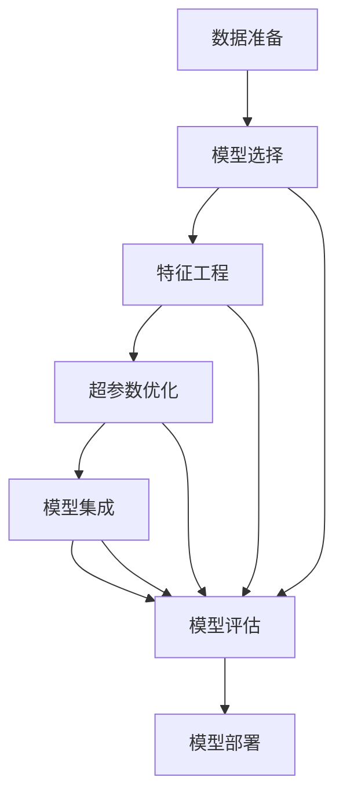

                 

## 1. 背景介绍

### 1.1 问题由来
在数据科学和人工智能领域，机器学习（ML）已经成为了核心技术之一。随着数据量和计算能力的提升，模型训练和调优的复杂度也随之增加。特别是当面临众多模型选择、调参优化和模型集成等问题时，传统的“手工调优”方法变得越来越难以适用。

在实践中，数据科学家常常需要在不同算法和模型架构之间进行选择，并对其进行调参优化。例如，针对一个特定问题，需要从几十上百种算法中选择一种合适的模型，然后再对模型进行大量的超参数调整和优化。这种传统的手工调优方式往往耗费大量时间和资源，且效果有限，可能导致模型的性能和泛化能力不足。

### 1.2 问题核心关键点
自动化机器学习（AutoML）应运而生，它通过自动化的方式，帮助数据科学家在模型选择、调参和优化等环节中减少人工干预，从而提高效率和模型性能。AutoML的核心在于“自动化”和“学习”，它能够自动选择最合适的模型和超参数，并自动完成模型训练和优化。

### 1.3 问题研究意义
AutoML技术对数据科学和人工智能领域的意义重大，可以显著提升数据科学家的工作效率和模型质量：

1. **提高效率**：自动化模型选择和调参可以大大减少手工调优的时间成本，让数据科学家能够更快地迭代实验和部署模型。
2. **提升性能**：AutoML能够自动探索最优的模型和超参数组合，从而得到性能更好的模型。
3. **降低门槛**：AutoML技术降低了数据科学领域的入门门槛，使更多非专家用户能够轻松构建高质量的模型。
4. **推广应用**：AutoML技术在多种场景中的应用，使得数据科学的应用范围更加广泛，推动了人工智能技术的普及。

## 2. 核心概念与联系

### 2.1 核心概念概述

AutoML涵盖了机器学习过程中多个自动化环节，包括但不限于模型选择、特征工程、超参数优化、模型集成等。以下是AutoML的几个核心概念及其联系：

- **模型选择**：自动选择最适合问题类型的模型，如线性回归、决策树、支持向量机等。
- **特征工程**：自动进行特征选择、降维和构造新特征，提高模型的泛化能力。
- **超参数优化**：自动寻找最优的超参数组合，如学习率、正则化参数、层数等。
- **模型集成**：自动进行模型融合和优化，如Bagging、Boosting、Stacking等。

这些核心概念构成了AutoML的主要流程，通过自动化的方式优化各个环节，提升模型的性能和泛化能力。

### 2.2 核心概念原理和架构的 Mermaid 流程图



该流程图展示了AutoML的主要流程。从数据准备开始，经过模型选择、特征工程、超参数优化和模型集成，最终输出评估后的最佳模型，并进行部署。其中，模型评估环节起到了关键的监督作用，确保最终输出的模型具有较好的性能。

## 3. 核心算法原理 & 具体操作步骤

### 3.1 算法原理概述

AutoML的算法原理主要基于以下几个关键点：

1. **自动化模型选择**：通过自动化的方式，评估不同模型的性能，选择最优模型。
2. **自动化超参数优化**：使用自动化方法，如网格搜索、贝叶斯优化、遗传算法等，自动寻找最优的超参数组合。
3. **自动化特征工程**：自动进行特征选择、降维和构造新特征，提高模型的泛化能力。
4. **自动化模型集成**：使用自动化方法，如Bagging、Boosting、Stacking等，进行模型融合和优化。

这些自动化的步骤通过模型评估环节进行监督，确保最终输出的是性能最优的模型。

### 3.2 算法步骤详解

AutoML的具体操作步骤如下：

**Step 1: 数据准备**
- 收集数据集，并进行数据清洗、处理和划分。
- 准备训练集、验证集和测试集，确保数据集划分合理。

**Step 2: 模型选择**
- 自动评估不同模型的性能，如线性回归、决策树、支持向量机等。
- 根据模型性能选择最优模型。

**Step 3: 特征工程**
- 自动进行特征选择，选择最相关的特征。
- 自动进行特征降维，如PCA、LDA等。
- 自动构造新特征，如交互特征、多项式特征等。

**Step 4: 超参数优化**
- 使用自动化方法，如网格搜索、贝叶斯优化、遗传算法等，寻找最优超参数组合。
- 对不同模型的超参数进行优化。

**Step 5: 模型集成**
- 使用自动化方法，如Bagging、Boosting、Stacking等，进行模型融合和优化。
- 输出最终的最佳模型。

**Step 6: 模型评估**
- 在验证集上评估模型性能。
- 输出最终的最佳模型。

**Step 7: 模型部署**
- 将最终选择的模型部署到实际应用中。
- 持续收集新数据，定期重新评估和微调模型。

### 3.3 算法优缺点

AutoML的优点：

1. **效率高**：通过自动化模型选择和超参数优化，减少了人工干预，提高了工作效率。
2. **性能好**：自动探索最优模型和超参数组合，得到性能更好的模型。
3. **易于使用**：降低了数据科学领域的入门门槛，使更多非专家用户能够轻松构建高质量的模型。

AutoML的缺点：

1. **可解释性不足**：自动化过程的黑盒性质使得模型优化过程缺乏可解释性。
2. **资源消耗大**：自动搜索和评估大量模型和超参数组合，需要消耗大量计算资源。
3. **可能过拟合**：自动化搜索可能找到过拟合的模型，特别是在标注数据不足的情况下。
4. **通用性有限**：AutoML技术在特定领域和任务上的效果可能不如手工调优。

### 3.4 算法应用领域

AutoML技术已经广泛应用于数据科学和机器学习领域，涵盖了以下主要应用：

- **金融风控**：自动化构建模型，进行信用评分、欺诈检测等。
- **医疗诊断**：自动化构建模型，进行疾病预测、影像分析等。
- **自然语言处理**：自动化构建模型，进行文本分类、情感分析等。
- **图像识别**：自动化构建模型，进行目标检测、图像分割等。
- **推荐系统**：自动化构建模型，进行个性化推荐、广告推荐等。

此外，AutoML技术还在智能制造、智能交通、智能家居等多个领域得到应用，推动了相关产业的数字化转型。

## 4. 数学模型和公式 & 详细讲解 & 举例说明

### 4.1 数学模型构建

AutoML的数学模型构建主要基于机器学习中的模型评估、特征选择、超参数优化和模型集成等关键技术。以下是一个简单的数学模型构建流程：

**模型选择**：
- 使用交叉验证方法，如k折交叉验证，评估不同模型的性能。
- 选择性能最优的模型。

**特征选择**：
- 使用信息增益、卡方检验、L1正则等方法进行特征选择。
- 选择最相关的特征。

**超参数优化**：
- 使用网格搜索、贝叶斯优化等方法，自动寻找最优超参数组合。
- 使用交叉验证方法，评估超参数组合的性能。

**模型集成**：
- 使用Bagging、Boosting、Stacking等方法，进行模型融合和优化。
- 输出最终的最佳模型。

### 4.2 公式推导过程

以下是AutoML中几个关键数学模型的推导过程：

**模型选择**
- 假设我们有m个模型，使用k折交叉验证方法评估其性能。
- 假设模型i在某一折的平均误差为$E_i$。
- 选择误差最小的模型i作为最优模型。

**特征选择**
- 假设我们有一个特征集合$X$，使用信息增益$IG$选择最相关的特征。
- 假设特征j的信息增益为$IG_j$。
- 选择信息增益最大的特征j。

**超参数优化**
- 假设我们有n个超参数，使用网格搜索方法寻找最优超参数组合。
- 假设超参数k的取值为$k_1, k_2, ..., k_n$。
- 选择性能最优的超参数组合$(k_{i_1}, k_{i_2}, ..., k_{i_n})$。

**模型集成**
- 假设我们有m个模型，使用Bagging方法进行集成。
- 假设模型j的预测结果为$\hat{y}_j$。
- 选择集成后的预测结果$\hat{y}_{agg}$。

### 4.3 案例分析与讲解

**案例：金融风控模型**

- **数据准备**：收集历史贷款数据，进行数据清洗和特征工程。
- **模型选择**：使用k折交叉验证方法，评估线性回归、决策树、支持向量机等模型的性能。
- **特征选择**：使用信息增益方法，选择最相关的特征。
- **超参数优化**：使用网格搜索方法，寻找最优超参数组合。
- **模型集成**：使用Bagging方法，进行模型融合和优化。
- **模型评估**：在验证集上评估模型性能，选择最优模型。
- **模型部署**：将最终选择的模型部署到实际应用中。

## 5. 项目实践：代码实例和详细解释说明

### 5.1 开发环境搭建

在进行AutoML实践前，我们需要准备好开发环境。以下是使用Python进行Scikit-learn开发的环境配置流程：

1. 安装Anaconda：从官网下载并安装Anaconda，用于创建独立的Python环境。

2. 创建并激活虚拟环境：
```bash
conda create -n sklearn-env python=3.8 
conda activate sklearn-env
```

3. 安装Scikit-learn：
```bash
conda install scikit-learn
```

4. 安装其他工具包：
```bash
pip install numpy pandas matplotlib seaborn jupyter notebook
```

完成上述步骤后，即可在`sklearn-env`环境中开始AutoML实践。

### 5.2 源代码详细实现

这里我们以线性回归模型为例，使用Scikit-learn的GridSearchCV函数进行超参数优化，并输出性能评估结果。

```python
from sklearn.model_selection import GridSearchCV
from sklearn.linear_model import LinearRegression
from sklearn.datasets import make_regression
from sklearn.metrics import mean_squared_error

# 生成模拟数据
X, y = make_regression(n_samples=1000, n_features=10, noise=10)

# 初始化模型和网格搜索参数
lr = LinearRegression()
param_grid = {'fit_intercept': [True, False],
              'normalize': [True, False],
              'copy_X': [True, False],
              'positive': [True, False]}

# 使用GridSearchCV进行超参数优化
grid_search = GridSearchCV(lr, param_grid, cv=5, scoring='neg_mean_squared_error')
grid_search.fit(X, y)

# 输出最优参数和性能评估结果
best_params = grid_search.best_params_
best_score = -grid_search.best_score_
mse = mean_squared_error(y, grid_search.predict(X))
print(f"Best parameters: {best_params}")
print(f"Best score: {best_score:.2f}")
print(f"Mean Squared Error: {mse:.2f}")
```

这段代码展示了如何使用Scikit-learn的GridSearchCV函数进行线性回归模型的超参数优化。通过设置不同的超参数组合，并使用交叉验证方法评估模型性能，最终得到最优的超参数组合和性能评估结果。

### 5.3 代码解读与分析

让我们再详细解读一下关键代码的实现细节：

**GridSearchCV类**：
- `__init__`方法：初始化网格搜索的参数，包括超参数网格、交叉验证折数、评估指标等。
- `fit`方法：对数据集进行交叉验证，自动探索最优超参数组合。
- `best_params_`属性：返回最优的超参数组合。
- `best_score_`属性：返回最优超参数组合对应的负均方误差。

**make_regression函数**：
- 生成一个简单的线性回归数据集，包括特征和标签。

**LinearRegression类**：
- 初始化线性回归模型。

**GridSearchCV对象的输出**：
- 输出最优的超参数组合、最优模型的负均方误差和模型的均方误差。

**均方误差计算**：
- 使用均方误差计算模型预测和实际标签之间的误差。

可以看到，Scikit-learn的GridSearchCV函数使得超参数优化的过程变得简单易行。开发者可以通过简单的几行代码，自动化地探索最优超参数组合，并进行模型性能评估。

当然，工业级的系统实现还需考虑更多因素，如超参数自动搜索、更灵活的任务适配层等。但核心的AutoML范式基本与此类似。

## 6. 实际应用场景

### 6.1 金融风控

基于AutoML的金融风控模型可以自动构建和优化，帮助金融机构进行信用评分、欺诈检测等任务。传统的手工调优方式往往耗费大量时间和资源，而AutoML技术可以显著提高模型构建和优化的效率，降低人工干预的复杂度。

在实践中，可以使用AutoML技术自动构建和优化多个线性回归、决策树、支持向量机等模型的组合，并进行交叉验证和超参数优化。最终，输出最优的金融风控模型，实时应用于贷款审批、信用卡审批等场景，提升金融机构的风险控制能力。

### 6.2 医疗诊断

在医疗诊断领域，AutoML技术可以自动构建和优化各种机器学习模型，帮助医生进行疾病预测、影像分析等任务。传统的手工调优方式难以处理复杂的多模态数据，而AutoML技术可以自动进行特征选择和超参数优化，得到性能更好的诊断模型。

具体而言，可以自动构建和优化线性回归、决策树、支持向量机、深度学习等模型，进行疾病预测和影像分析。通过AutoML技术，可以自动选择最优的模型和超参数组合，得到性能更好的诊断模型，提升医疗诊断的准确性和效率。

### 6.3 智能推荐系统

智能推荐系统需要处理大量的用户行为数据和物品特征数据，需要进行特征选择、超参数优化和模型集成等操作。传统的手工调优方式难以处理海量数据和高维度特征，而AutoML技术可以自动构建和优化推荐模型，提升推荐系统的性能和用户满意度。

具体而言，可以使用AutoML技术自动构建和优化多个线性回归、决策树、支持向量机等模型的组合，并进行交叉验证和超参数优化。最终，输出最优的推荐模型，实时应用于推荐系统，提升用户的个性化推荐体验。

### 6.4 未来应用展望

随着AutoML技术的不断演进，其在更多领域的应用前景将更加广阔。

在智慧城市治理中，AutoML技术可以自动构建和优化城市事件监测、舆情分析、应急指挥等模型，提升城市管理的自动化和智能化水平。

在智能制造中，AutoML技术可以自动构建和优化生产流程优化、设备故障预测等模型，提升制造业的智能化水平。

在智能交通中，AutoML技术可以自动构建和优化交通流量预测、道路事故预测等模型，提升交通管理的智能化水平。

此外，在教育、农业、能源等多个领域，AutoML技术都将发挥重要作用，推动相关行业的数字化转型和智能化升级。

## 7. 工具和资源推荐

### 7.1 学习资源推荐

为了帮助开发者系统掌握AutoML的理论基础和实践技巧，这里推荐一些优质的学习资源：

1. 《AutoML：自动机器学习》系列博文：由AutoML领域专家撰写，深入浅出地介绍了AutoML的原理、方法和应用。

2. AutoML官方文档：包含AutoML库的详细介绍和大量示例代码，是AutoML开发的必备资料。

3. AutoML综述论文：综述了AutoML领域的最新进展和研究方向，提供了丰富的理论支持和应用案例。

4. Kaggle数据竞赛：Kaggle平台上有许多数据竞赛项目，包含AutoML的应用案例，适合动手实践。

通过对这些资源的学习实践，相信你一定能够快速掌握AutoML的精髓，并用于解决实际的机器学习问题。

### 7.2 开发工具推荐

高效的开发离不开优秀的工具支持。以下是几款用于AutoML开发的常用工具：

1. Scikit-learn：Python的开源机器学习库，包含丰富的机器学习算法和模型评估工具，适合进行自动超参数优化。

2. XGBoost：高效率的梯度提升库，支持大规模数据和复杂模型，适合进行模型集成和优化。

3. H2O.ai：开源的自动化机器学习平台，支持自动数据预处理、模型选择和调优，适合进行大规模工业部署。

4. Hyperopt：自动超参数优化库，支持贝叶斯优化、网格搜索等方法，适合进行高效超参数优化。

5. Optuna：高效的超参数优化库，支持多种优化方法，适合进行超参数自动搜索。

合理利用这些工具，可以显著提升AutoML任务的开发效率，加快创新迭代的步伐。

### 7.3 相关论文推荐

AutoML技术的发展源于学界的持续研究。以下是几篇奠基性的相关论文，推荐阅读：

1. AutoML：Effective and Efficient Automated Machine Learning（JMLR 2020）：提出了AutoML的全面框架，涵盖模型选择、特征工程、超参数优化等环节。

2. AutoML-DeepLearning：Efficient and Guided Automated Model-Tuning（NeurIPS 2019）：提出了基于深度学习的自动模型调优方法，通过网络结构搜索实现高效模型调优。

3. Hyperopt：A Python Library for Dynamic Hyperparameter Optimization（JMLR 2014）：介绍了超参数优化的方法，如贝叶斯优化和网格搜索，为AutoML提供了重要的理论支持。

这些论文代表了大AutoML技术的发展脉络。通过学习这些前沿成果，可以帮助研究者把握学科前进方向，激发更多的创新灵感。

## 8. 总结：未来发展趋势与挑战

### 8.1 总结

本文对AutoML的自动化机器学习模型选择与优化方法进行了全面系统的介绍。首先阐述了AutoML的研究背景和意义，明确了其在模型选择、超参数优化和模型集成等环节的自动化功能。其次，从原理到实践，详细讲解了AutoML的数学模型和操作步骤，给出了AutoML任务开发的完整代码实例。同时，本文还广泛探讨了AutoML方法在金融风控、医疗诊断、智能推荐等多个领域的应用前景，展示了AutoML范式的广泛应用价值。

通过本文的系统梳理，可以看到，AutoML技术正在成为机器学习领域的核心工具，极大地提高了数据科学家的工作效率和模型性能。未来，伴随AutoML技术的持续演进，机器学习的应用范围和质量将进一步提升，为人工智能技术的普及和落地带来深远影响。

### 8.2 未来发展趋势

展望未来，AutoML技术将呈现以下几个发展趋势：

1. **自动化水平提升**：AutoML技术将进一步自动化模型选择和超参数优化，减少人工干预，提高效率。
2. **多模态融合**：AutoML技术将融合多种数据模态，如文本、图像、视频等，提升模型的泛化能力和应用范围。
3. **模型可解释性增强**：AutoML技术将逐步增强模型的可解释性，使得模型优化过程透明化。
4. **自动化流程优化**：AutoML技术将优化模型构建和优化流程，提高模型的生产效率和质量。
5. **云端部署普及**：AutoML技术将进一步向云端化方向发展，提供更便捷、更高效的服务。

以上趋势凸显了AutoML技术的广阔前景。这些方向的探索发展，必将进一步提升机器学习模型的性能和应用范围，推动人工智能技术的普及和应用。

### 8.3 面临的挑战

尽管AutoML技术已经取得了瞩目成就，但在迈向更加智能化、普适化应用的过程中，它仍面临着诸多挑战：

1. **可解释性不足**：自动化过程的黑盒性质使得模型优化过程缺乏可解释性。
2. **资源消耗大**：自动搜索和评估大量模型和超参数组合，需要消耗大量计算资源。
3. **模型鲁棒性有限**：自动优化可能找到过拟合的模型，特别是在标注数据不足的情况下。
4. **通用性有限**：AutoML技术在特定领域和任务上的效果可能不如手工调优。

### 8.4 研究展望

面对AutoML面临的这些挑战，未来的研究需要在以下几个方面寻求新的突破：

1. **增强可解释性**：引入可解释性技术，如LIME、SHAP等，增强模型的可解释性。
2. **优化资源消耗**：引入高效模型搜索和评估方法，如剪枝、量化等，减少计算资源消耗。
3. **提升模型鲁棒性**：引入鲁棒性优化方法，如对抗训练、数据增强等，提升模型的泛化能力。
4. **扩展应用领域**：将AutoML技术应用到更多领域，如智能制造、智能交通等，推动相关产业的数字化转型。
5. **提升自动化水平**：引入更多自动化技术，如符号推理、元学习等，提升AutoML技术的自动化水平。

这些研究方向的探索，必将引领AutoML技术迈向更高的台阶，为构建智能化、普适化的人工智能系统铺平道路。面向未来，AutoML技术还需要与其他人工智能技术进行更深入的融合，如知识表示、因果推理、强化学习等，多路径协同发力，共同推动自然语言理解和智能交互系统的进步。只有勇于创新、敢于突破，才能不断拓展AutoML技术的边界，让智能技术更好地造福人类社会。

## 9. 附录：常见问题与解答

**Q1: AutoML是否可以应用于所有机器学习问题？**

A: AutoML技术适用于大部分机器学习问题，但某些问题可能由于数据复杂性、计算资源限制等原因，难以直接应用。例如，需要手工调优的深度学习模型、大规模分布式数据集等。此时可以考虑结合手工调优的方法，充分发挥AutoML的优势。

**Q2: 如何评估AutoML模型的性能？**

A: AutoML模型的评估通常使用交叉验证方法，如k折交叉验证、留一法等。通过评估模型在交叉验证过程中的平均性能，选择性能最优的模型。还可以使用其他评估指标，如准确率、召回率、F1-score等，综合评估模型性能。

**Q3: 使用AutoML时，如何处理高维数据？**

A: 高维数据需要进行特征选择和降维处理。可以使用特征选择方法，如L1正则、信息增益等，选择最相关的特征。还可以使用降维方法，如PCA、LDA等，降低数据维度，提高模型的泛化能力。

**Q4: AutoML能否处理非结构化数据？**

A: AutoML可以处理非结构化数据，如文本、图像、音频等。可以通过文本分类、图像识别、语音识别等任务，自动构建和优化模型。但需要考虑数据的复杂性，可能需要进行预处理和特征工程。

**Q5: AutoML是否可以与深度学习技术结合使用？**

A: AutoML可以与深度学习技术结合使用，如神经网络、卷积神经网络、循环神经网络等。可以通过自动超参数优化和模型集成，提升深度学习模型的性能和泛化能力。但需要考虑深度学习模型的复杂性和计算资源消耗，可能需要进行额外的优化和处理。

