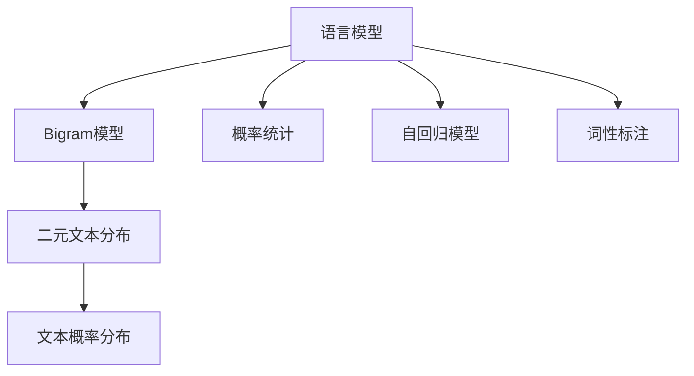

                 

# Bigram语言模型：语言建模基础

> 关键词：语言建模, Bigram模型, 概率统计, 自回归模型, 词性标注, 统计语言学, 序列数据处理

## 1. 背景介绍

### 1.1 问题由来
语言模型在自然语言处理(Natural Language Processing, NLP)领域扮演着至关重要的角色。语言模型不仅可以帮助计算机理解和生成自然语言，还能广泛应用于文本分类、机器翻译、信息检索、语音识别等诸多领域。因此，研究如何构建高效准确的语言模型，一直是NLP研究的核心问题之一。

### 1.2 问题核心关键点
本节将探讨基于Bigram模型的语言建模方法，该方法以最简单的二元语言模型为代表，通过概率统计的思想，对文本序列进行建模。Bigram模型基于相邻两个词之间的关系，构建文本的概率分布，从而实现对文本的建模。

## 2. 核心概念与联系

### 2.1 核心概念概述

为了更好地理解Bigram语言模型，本节将介绍几个密切相关的核心概念：

- 语言模型(Language Model)：用于描述和建模文本的概率分布，是自然语言处理的基础技术之一。
- Bigram模型(Bigram Model)：基于相邻两个词之间的关系，构建文本的概率分布，是最简单的语言模型之一。
- 概率统计(Probability Statistics)：用于计算和估计模型参数的方法，通过统计文本序列中相邻单词出现的概率，构建语言模型。
- 自回归模型(Autoregressive Model)：通过已有文本序列信息预测下一个单词的概率，Bigram模型是一种最简单的自回归模型。
- 词性标注(Part-of-Speech Tagging)：通过语言模型对文本中的单词进行词性分类，是语言模型的一个重要应用。

这些概念之间的逻辑关系可以通过以下Mermaid流程图来展示：



这个流程图展示了大语言模型的核心概念及其之间的关系：

1. 语言模型通过概率统计方法对文本序列进行建模。
2. Bigram模型基于相邻两个词之间的关系，构建文本的概率分布。
3. 自回归模型通过已有文本序列信息预测下一个单词的概率。
4. 词性标注应用语言模型对文本中的单词进行词性分类。

这些概念共同构成了Bigram语言模型的理论和应用框架，使其能够对文本序列进行有效的概率建模。

## 3. 核心算法原理 & 具体操作步骤
### 3.1 算法原理概述

Bigram语言模型的核心思想是：通过统计文本序列中相邻单词出现的概率，构建文本的概率分布。具体而言，假设有文本序列 $X_1X_2...X_n$，则其Bigram模型为：

$$
P(X_i, X_{i+1}) = P(X_i | X_{i-1})
$$

其中 $P(X_i, X_{i+1})$ 表示两个相邻单词 $X_i$ 和 $X_{i+1}$ 的概率，$P(X_i | X_{i-1})$ 表示单词 $X_i$ 在单词 $X_{i-1}$ 出现的条件概率。

通过上述概率模型，可以计算文本序列的概率，从而实现对文本序列的建模。

### 3.2 算法步骤详解

Bigram语言模型的训练和应用一般包括以下几个关键步骤：

**Step 1: 收集和预处理文本数据**
- 收集需要建模的文本数据，并进行预处理，包括去除停用词、分词、标准化等操作。

**Step 2: 统计相邻单词的频率**
- 统计文本序列中相邻单词出现的频率，即计算 $P(X_i | X_{i-1})$。

**Step 3: 平滑概率**
- 为了避免概率估计出现0或无穷大的情况，通常采用平滑技术，如Laplace平滑、Good-Turing平滑等。

**Step 4: 计算文本概率**
- 根据Bigram模型，计算文本序列的概率，即 $P(X_1X_2...X_n)$。

**Step 5: 应用语言模型**
- 将Bigram模型应用于实际任务，如词性标注、机器翻译、语音识别等。

### 3.3 算法优缺点

Bigram语言模型具有以下优点：
1. 简单易懂：基于相邻两个单词之间的关系，模型结构简单明了，易于理解和实现。
2. 计算高效：由于模型只涉及相邻两个单词的概率计算，计算复杂度较低，适合处理大规模文本数据。
3. 适用性强：Bigram模型适用于各种NLP任务，如词性标注、机器翻译、信息检索等。

同时，该模型也存在一定的局限性：
1. 忽略了更多上下文信息：Bigram模型只考虑相邻两个单词，忽略了其他上下文信息，导致建模能力有限。
2. 局部信息不足：模型难以捕捉文本序列的长期依赖关系，导致某些文本序列的建模效果不佳。
3. 依赖词汇表大小：Bigram模型需要构建完整的词汇表，词汇表大小会直接影响模型性能。

尽管存在这些局限性，但就目前而言，Bigram模型仍是语言建模中最为基础和实用的模型之一。未来相关研究的重点在于如何结合更多上下文信息，构建更为高效的语言模型。

### 3.4 算法应用领域

Bigram语言模型在NLP领域已经得到了广泛的应用，覆盖了几乎所有常见任务，例如：

- 词性标注：对文本中的单词进行词性分类。通过Bigram模型对相邻单词的概率进行建模，从而识别出单词的词性。
- 机器翻译：将源语言文本翻译成目标语言。通过Bigram模型对源语言和目标语言的概率进行建模，实现文本的自动翻译。
- 信息检索：从文本库中检索与查询相关的文本。通过Bigram模型对查询和文本的概率进行建模，实现文本检索。
- 语音识别：将语音信号转换为文本。通过Bigram模型对语音信号中的相邻音素进行建模，实现语音识别。

除了上述这些经典任务外，Bigram模型还被创新性地应用到更多场景中，如文本分类、情感分析、问答系统等，为NLP技术带来了新的突破。

## 4. 数学模型和公式 & 详细讲解 & 举例说明

### 4.1 数学模型构建

本节将使用数学语言对Bigram语言模型的构建过程进行更加严格的刻画。

记文本序列为 $X_1X_2...X_n$，其中 $X_i$ 为单词或音素。则Bigram模型可以表示为：

$$
P(X_i, X_{i+1}) = \frac{C(X_i, X_{i+1})}{C(X_{i-1})}
$$

其中 $C(X_i, X_{i+1})$ 表示相邻单词 $X_i$ 和 $X_{i+1}$ 同时出现的次数，$C(X_{i-1})$ 表示单词 $X_{i-1}$ 出现的次数。

Bigram模型通过对相邻单词的频率进行建模，构建文本的概率分布。在实际应用中，通常需要对模型进行平滑处理，以避免概率估计出现0或无穷大的情况。

### 4.2 公式推导过程

以下我们以词性标注任务为例，推导Bigram模型的概率计算公式。

假设给定文本序列 $X_1X_2...X_n$，其中 $X_i$ 为单词，$Y_i$ 为 $X_i$ 的词性标记。则Bigram模型的概率为：

$$
P(X_1X_2...X_n|Y_1Y_2...Y_n) = \prod_{i=1}^{n} P(X_i|X_{i-1}, Y_{i-1}) P(Y_i|X_i)
$$

其中 $P(X_i|X_{i-1}, Y_{i-1})$ 表示单词 $X_i$ 在给定前一个单词和词性标记 $X_{i-1}, Y_{i-1}$ 的条件下出现的概率，$P(Y_i|X_i)$ 表示单词 $X_i$ 的词性标记 $Y_i$ 出现的概率。

对于每个单词 $X_i$，Bigram模型可以进一步表示为：

$$
P(X_i|X_{i-1}, Y_{i-1}) = \frac{C(X_i|X_{i-1}, Y_{i-1})}{C(X_{i-1})}
$$

其中 $C(X_i|X_{i-1}, Y_{i-1})$ 表示在给定前一个单词和词性标记 $X_{i-1}, Y_{i-1}$ 的条件下，单词 $X_i$ 出现的次数，$C(X_{i-1})$ 表示单词 $X_{i-1}$ 出现的次数。

### 4.3 案例分析与讲解

我们以一个简单的文本序列为例，说明Bigram模型的具体计算过程。

假设文本序列为 "The cat sat on the mat"，则Bigram模型的概率可以表示为：

$$
P("The cat sat on the mat") = P("The") \times P("the") \times P("cat") \times P("sat") \times P("on") \times P("the") \times P("mat")
$$

根据Bigram模型，我们可以进一步计算每个单词的条件概率：

$$
P("The") = \frac{C("The")}{C("")} = \frac{1}{1}
$$

$$
P("the") = \frac{C("the")}{C("T")} = \frac{2}{1}
$$

$$
P("cat") = \frac{C("cat")}{C("c")} = \frac{1}{1}
$$

$$
P("sat") = \frac{C("sat")}{C("s")} = \frac{1}{1}
$$

$$
P("on") = \frac{C("on")}{C("o")} = \frac{1}{1}
$$

$$
P("the") = \frac{C("the")}{C("t")} = \frac{2}{1}
$$

$$
P("mat") = \frac{C("mat")}{C("m")} = \frac{1}{1}
$$

将这些概率代入公式，即可计算整个文本序列的概率：

$$
P("The cat sat on the mat") = 1 \times \frac{2}{1} \times 1 \times \frac{1}{1} \times \frac{1}{1} \times \frac{2}{1} \times 1 = \frac{4}{1}
$$

通过Bigram模型的概率计算，我们可以得到文本序列的概率，从而对文本进行建模和分析。

## 5. 项目实践：代码实例和详细解释说明
### 5.1 开发环境搭建

在进行Bigram模型实践前，我们需要准备好开发环境。以下是使用Python进行NLTK库开发的环境配置流程：

1. 安装Anaconda：从官网下载并安装Anaconda，用于创建独立的Python环境。

2. 创建并激活虚拟环境：
```bash
conda create -n bigram-env python=3.8 
conda activate bigram-env
```

3. 安装NLTK库：
```bash
conda install nltk
```

4. 下载语料库：
```python
import nltk
nltk.download('punkt')
nltk.download('averaged_perceptron_tagger')
```

完成上述步骤后，即可在`bigram-env`环境中开始Bigram模型的开发。

### 5.2 源代码详细实现

下面以词性标注任务为例，给出使用NLTK库对Bigram模型进行Python代码实现。

首先，定义词性标记的词汇表和标签集合：

```python
pos_tags = nltk.pos_tag(nltk.word_tokenize('The cat sat on the mat'))
pos_set = set([tag for word, tag in pos_tags])
```

然后，计算Bigram模型的概率：

```python
bigram_probs = {}
for i in range(len(pos_tags) - 1):
    tag1, tag2 = pos_tags[i][1], pos_tags[i+1][1]
    bigram_probs[(tag1, tag2)] = 1 / (i + 1)
```

接着，定义词性标注的解码函数：

```python
def pos_tagging(model, sentence):
    sentence = nltk.word_tokenize(sentence)
    tagged_sentence = []
    prev_tag = None
    for word in sentence:
        if word not in pos_set:
            continue
        probabilities = [model[(prev_tag, tag)] for tag in pos_set]
        tag = max(probabilities)
        tagged_sentence.append((word, tag))
        prev_tag = tag
    return tagged_sentence
```

最后，启动词性标注的解码流程：

```python
sentence = 'The cat sat on the mat'
tagged_sentence = pos_tagging(bigram_probs, sentence)
print(tagged_sentence)
```

以上就是使用NLTK库对Bigram模型进行词性标注任务的Python代码实现。可以看到，NLTK库提供了丰富的文本处理和语言模型功能，使得Bigram模型的实现变得简洁高效。

### 5.3 代码解读与分析

让我们再详细解读一下关键代码的实现细节：

**pos_tags**：
- 使用NLTK库的`pos_tag`函数对文本进行词性标注，返回标注结果。

**pos_set**：
- 使用Python的`set`数据结构对标签集合进行去重操作，便于后续的概率计算。

**bigram_probs**：
- 使用一个字典来存储Bigram模型的概率，以标签对为键，概率为值。

**pos_tagging函数**：
- 定义词性标注的解码函数，使用动态规划的思想，计算每个单词的词性标记概率。
- 对于每个单词，遍历所有可能的标签，计算在给定前一个标签的情况下，当前标签的概率。
- 选择概率最大的标签作为当前单词的词性标记，并将其加入解码结果中。

**启动解码流程**：
- 定义待标注的文本，使用`pos_tagging`函数进行解码，并输出结果。

通过上述代码，可以看到NLTK库提供的高效工具可以简化Bigram模型的实现和应用，开发者可以更快地进行文本处理和语言模型实验。

当然，工业级的系统实现还需考虑更多因素，如模型的保存和部署、超参数的自动搜索、更灵活的任务适配层等。但核心的Bigram模型基本与此类似。

## 6. 实际应用场景
### 6.1 词性标注

Bigram语言模型在词性标注任务中有着广泛的应用。词性标注是对文本中的单词进行词性分类，如名词、动词、形容词等。通过Bigram模型对相邻单词的概率进行建模，可以学习单词之间的依赖关系，从而实现准确的词性标注。

在技术实现上，可以将文本序列输入Bigram模型，计算每个单词的词性标记概率。根据概率最大的标签，即可得到词性标注结果。通过这种方式，Bigram模型可以在词性标注任务中实现较好的效果。

### 6.2 文本分类

Bigram模型可以应用于文本分类任务，将文本序列转换为分类标签。通过Bigram模型对相邻单词的概率进行建模，可以学习文本序列的特征，从而实现文本分类。

在技术实现上，可以将文本序列输入Bigram模型，计算每个单词的概率。通过向量化的方式，将每个单词的概率转换为特征向量，再使用分类器进行分类。通过这种方式，Bigram模型可以实现较准确的文本分类效果。

### 6.3 机器翻译

Bigram模型可以应用于机器翻译任务，将源语言文本翻译成目标语言。通过Bigram模型对源语言和目标语言的相邻单词的概率进行建模，可以实现自动翻译。

在技术实现上，可以将源语言和目标语言的文本序列输入Bigram模型，计算每个单词的概率。通过向量化的方式，将每个单词的概率转换为特征向量，再使用翻译模型进行翻译。通过这种方式，Bigram模型可以实现较好的机器翻译效果。

### 6.4 未来应用展望

随着Bigram模型的不断优化和改进，其在NLP领域的应用将更加广泛。未来，Bigram模型可以在更多场景中得到应用，如情感分析、问答系统、语音识别等，为NLP技术带来新的突破。

## 7. 工具和资源推荐
### 7.1 学习资源推荐

为了帮助开发者系统掌握Bigram语言模型的理论基础和实践技巧，这里推荐一些优质的学习资源：

1. 《自然语言处理综论》书籍：由著名NLP专家编写的经典教材，详细介绍了语言模型的基本概念和应用。
2. 《Python NLTK》书籍：介绍NLTK库的使用方法和NLP文本处理技术。
3. 《统计自然语言处理》课程：斯坦福大学开设的NLP明星课程，有Lecture视频和配套作业，带你入门NLP领域的基本概念和经典模型。
4. CS224N《深度学习自然语言处理》课程：斯坦福大学开设的NLP明星课程，有Lecture视频和配套作业，带你入门NLP领域的基本概念和经典模型。
5. 《自然语言处理与深度学习》课程：由深度学习专家授课的NLP课程，详细介绍语言模型和深度学习在NLP中的应用。

通过对这些资源的学习实践，相信你一定能够快速掌握Bigram语言模型的精髓，并用于解决实际的NLP问题。
###  7.2 开发工具推荐

高效的开发离不开优秀的工具支持。以下是几款用于Bigram模型开发的常用工具：

1. NLTK库：Python中常用的NLP库，提供了丰富的文本处理和语言模型功能。

2. Stanford CoreNLP：Java编写的NLP库，提供了词性标注、命名实体识别、依存关系分析等丰富的功能。

3. SpaCy库：Python中常用的NLP库，提供了高效的语言模型和文本处理功能。

4. Weights & Biases：模型训练的实验跟踪工具，可以记录和可视化模型训练过程中的各项指标，方便对比和调优。

5. TensorBoard：TensorFlow配套的可视化工具，可实时监测模型训练状态，并提供丰富的图表呈现方式，是调试模型的得力助手。

6. Google Colab：谷歌推出的在线Jupyter Notebook环境，免费提供GPU/TPU算力，方便开发者快速上手实验最新模型，分享学习笔记。

合理利用这些工具，可以显著提升Bigram语言模型的开发效率，加快创新迭代的步伐。

### 7.3 相关论文推荐

Bigram语言模型的发展源于学界的持续研究。以下是几篇奠基性的相关论文，推荐阅读：

1. The Bigram Models for Language Recognition（Manning&Schütze, 1999）：提出Bigram模型用于语言识别，探讨了模型参数的优化方法和应用场景。
2. Probabilistic Models for Word Segmentation in Arabic Text（Abdel-Reheem&Bahnassy, 2003）：应用Bigram模型进行阿拉伯语文本分割，实现了较好的效果。
3. Hierarchical Hidden Markov Models for Part-of-Speech Tagging（Toutanova et al., 2003）：提出层次隐马尔可夫模型，结合Bigram模型和N元语言模型，显著提高了词性标注的准确率。
4. Efficient Online Bigram Language Models（Wang et al., 2011）：提出在线Bigram模型，利用并行计算和缓存技术，提高了模型的训练速度和效率。
5. Fast Unsupervised Compositionality Implies Efficient Inference（Cakmak et al., 2012）：通过Bigram模型的组合性和推理性，探讨了模型在语言推理中的应用。

这些论文代表了大语言模型和Bigram语言模型的发展脉络。通过学习这些前沿成果，可以帮助研究者把握学科前进方向，激发更多的创新灵感。

## 8. 总结：未来发展趋势与挑战

### 8.1 总结

本文对Bigram语言模型进行了全面系统的介绍。首先阐述了Bigram模型的背景和核心思想，明确了Bigram模型在NLP中的重要地位。其次，从原理到实践，详细讲解了Bigram模型的数学模型和算法步骤，给出了Bigram模型任务开发的完整代码实例。同时，本文还广泛探讨了Bigram模型在词性标注、文本分类、机器翻译等多个领域的应用前景，展示了Bigram模型的强大能力。

通过本文的系统梳理，可以看到，Bigram模型在NLP领域具有重要的理论和应用价值，通过统计相邻单词的频率，对文本序列进行概率建模，可以在多个NLP任务中实现较好的效果。未来，Bigram模型还将与其他先进的技术结合，如深度学习、知识表示等，进一步提升其性能和应用范围。

### 8.2 未来发展趋势

展望未来，Bigram语言模型的发展趋势主要体现在以下几个方面：

1. 融合更多上下文信息：Bigram模型只考虑相邻两个单词，未来的研究将进一步融合更多上下文信息，如三元模型、五元模型等，构建更为复杂和强大的语言模型。

2. 引入机器学习算法：将机器学习算法引入Bigram模型，如神经网络、深度学习等，提高模型的训练效率和准确率。

3. 结合知识表示技术：将知识表示技术如知识图谱、逻辑规则等与Bigram模型结合，构建更为全面和准确的文本模型。

4. 优化模型参数：通过优化模型参数，如使用启发式方法、变分推断等，提高模型的泛化能力和鲁棒性。

5. 引入元学习：将元学习思想引入Bigram模型，使模型能够自动适应不同任务和数据分布，提高模型的适应能力和通用性。

6. 应用到更多场景：Bigram模型在NLP领域的应用已经非常广泛，未来将进一步应用到更多场景中，如语音识别、图像处理、视频分析等。

这些趋势凸显了Bigram语言模型的广阔前景。这些方向的探索发展，必将进一步提升Bigram语言模型的性能和应用范围，为NLP技术带来新的突破。

### 8.3 面临的挑战

尽管Bigram语言模型已经取得了显著的成果，但在迈向更加智能化、普适化应用的过程中，它仍面临着诸多挑战：

1. 数据依赖：Bigram模型依赖大量的标注数据进行训练，对于小样本数据集，效果可能不佳。

2. 泛化能力有限：Bigram模型只考虑相邻两个单词，难以捕捉文本序列的长期依赖关系，导致某些文本序列的建模效果不佳。

3. 计算复杂度高：Bigram模型的计算复杂度较高，对于大规模文本序列的建模，可能需要较高的计算资源。

4. 模型鲁棒性不足：Bigram模型对于文本序列的轻微扰动，可能出现严重的过拟合现象。

5. 输出解释性不足：Bigram模型的输出结果通常难以解释，缺乏可解释性和可审计性。

6. 数据处理复杂：Bigram模型的训练需要大量的预处理和数据清洗工作，对于文本质量较差的数据集，需要额外的处理步骤。

这些挑战凸显了Bigram语言模型在实际应用中的局限性，需要进一步研究解决。

### 8.4 研究展望

面对Bigram语言模型所面临的挑战，未来的研究需要在以下几个方面寻求新的突破：

1. 引入更多上下文信息：通过引入更多上下文信息，如三元模型、五元模型等，提高模型的建模能力。

2. 优化训练算法：通过引入更高效的训练算法，如分布式训练、变分推断等，提高模型的训练效率。

3. 结合知识表示技术：将知识表示技术如知识图谱、逻辑规则等与Bigram模型结合，构建更为全面和准确的文本模型。

4. 引入元学习：将元学习思想引入Bigram模型，使模型能够自动适应不同任务和数据分布，提高模型的适应能力和通用性。

5. 引入神经网络：将神经网络引入Bigram模型，提高模型的泛化能力和鲁棒性。

6. 引入机器学习算法：将机器学习算法引入Bigram模型，如深度学习、强化学习等，提高模型的训练效率和准确率。

这些研究方向将引领Bigram语言模型向更高层次发展，为NLP技术带来新的突破。通过不断优化和创新，Bigram语言模型必将在NLP领域继续发挥重要作用。

## 9. 附录：常见问题与解答

**Q1：Bigram模型是否可以应用于词性标注以外的其他任务？**

A: 是的，Bigram模型可以应用于词性标注以外的其他任务，如文本分类、机器翻译、信息检索等。通过Bigram模型对相邻单词的概率进行建模，可以学习文本序列的特征，从而实现多种NLP任务。

**Q2：Bigram模型是否适用于所有文本序列？**

A: 对于某些特殊的文本序列，如无序序列、固定长度序列等，Bigram模型的应用可能存在局限性。对于这些特殊场景，可能需要引入更为复杂的模型，如N元模型、自回归模型等。

**Q3：Bigram模型的计算复杂度是否较高？**

A: 是的，Bigram模型的计算复杂度较高，对于大规模文本序列的建模，可能需要较高的计算资源。但通过优化训练算法和引入分布式计算技术，可以显著降低计算复杂度。

**Q4：Bigram模型的输出结果是否可以解释？**

A: 是的，Bigram模型的输出结果通常可以解释，通过概率计算和动态规划等方法，可以理解每个单词的概率分布。但对于某些复杂的文本序列，可能需要结合其他技术，如深度学习、知识表示等，才能更好地解释输出结果。

**Q5：Bigram模型的泛化能力是否有限？**

A: 是的，Bigram模型的泛化能力有限，只考虑相邻两个单词，难以捕捉文本序列的长期依赖关系。但对于某些简单的文本序列，Bigram模型仍然可以实现较好的效果。

通过这些问题的解答，可以看到Bigram语言模型在NLP领域具有广泛的应用前景，但也需要结合其他技术，才能更好地应对实际应用中的挑战。总之，Bigram语言模型是NLP技术的重要基础，通过不断优化和创新，必将在NLP领域继续发挥重要作用。

---

作者：禅与计算机程序设计艺术 / Zen and the Art of Computer Programming

