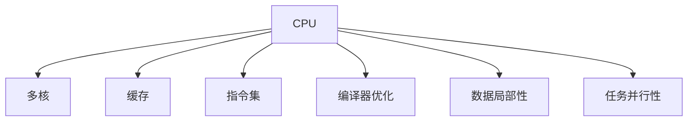

                 

# CPU 优化：充分利用处理器

在当今高性能计算时代，CPU作为计算机的核心部件，其性能的优化直接关系到系统整体的性能表现。无论是数据中心、云计算平台，还是移动设备、嵌入式系统，都需要通过优化CPU来提升应用性能和响应速度。本文将从背景介绍、核心概念、算法原理与操作步骤、数学模型与公式、项目实践、实际应用场景、工具和资源推荐、未来发展趋势与挑战等多个方面深入探讨CPU优化的核心技术和实践方法，为读者提供系统性、深入性的指导。

## 1. 背景介绍

### 1.1 问题由来

随着硬件技术的发展，现代CPU已经具备多核、大缓存、高主频等特性。然而，许多应用程序在实际运行中并未充分利用这些资源，导致CPU性能无法充分发挥。原因可能包括但不限于：不合理的任务并行性、不充分的数据局部性、不合理的内存分配和访问等。

### 1.2 问题核心关键点

为了提升CPU性能，我们需要针对以上问题进行优化。常见的CPU优化方法包括：

- 任务并行性：将可并行处理的计算任务分配到多个CPU核心上，提高计算效率。
- 数据局部性：通过合理布局数据，尽量减少内存访问和数据搬移，提高缓存命中率。
- 内存优化：合理分配和访问内存，减少内存分配和释放的开销。
- 指令集优化：利用CPU的高级指令集，提升指令执行效率。
- 编译器优化：通过编译器进行指令重排和优化，提升程序的性能。

以上方法通过不同途径提升CPU性能，使CPU可以更好地服务于应用程序。

### 1.3 问题研究意义

优化CPU性能不仅可以提高系统的整体性能和响应速度，还能节省能源和成本。在数据中心、云计算等场景中，优化CPU可以显著提升服务质量和用户满意度。在移动设备、嵌入式系统等资源受限场景中，优化CPU更是关键，可以延长设备使用时间和降低能耗。

## 2. 核心概念与联系

### 2.1 核心概念概述

为了更好地理解CPU优化的关键技术和方法，本节将介绍几个核心概念及其相互关系：

- **CPU**：计算机的核心处理器，负责执行指令和数据处理。
- **多核**：现代CPU通常包含多个处理核心，可以通过并行处理提高性能。
- **缓存**：CPU内部的高速缓存系统，用于存储常用的数据和指令，减少内存访问延迟。
- **指令集**：CPU支持的指令集合，包括基础指令和高级指令。
- **编译器优化**：将高级编程语言代码转换为CPU指令的过程，包括指令重排、向量化等。
- **数据局部性**：程序访问数据时，尽量使数据集中在一个或少数几个缓存行中，减少缓存未命中。
- **任务并行性**：将可并行处理的计算任务分配到多个CPU核心上，提高计算效率。

这些核心概念之间的逻辑关系可以通过以下Mermaid流程图来展示：



这个流程图展示了这个系统的核心概念及其之间的关系：

1. CPU通过多核、缓存、指令集等技术提升性能。
2. 数据局部性和任务并行性是优化CPU性能的关键手段。
3. 编译器优化是提升程序性能的重要环节。

## 3. 核心算法原理 & 具体操作步骤

### 3.1 算法原理概述

CPU优化本质上是通过提高计算效率、减少内存访问、增强并行性等手段，最大化利用CPU的资源。常见的优化技术包括：

- 任务并行化：通过线程/任务调度，将计算任务分配到多个CPU核心上。
- 数据局部化：合理布局数据，使其集中在CPU缓存中，减少缓存未命中。
- 内存优化：减少内存分配和释放，利用预先分配的内存池。
- 指令集优化：利用CPU的高级指令集，如SIMD、向量指令等，提升指令执行效率。
- 编译器优化：通过编译器进行指令重排、向量化等，提升程序的性能。

这些技术通过不同途径提升CPU性能，使CPU可以更好地服务于应用程序。

### 3.2 算法步骤详解

CPU优化的具体步骤包括：

**Step 1: 任务并行化**

1. 识别可并行处理的计算任务。
2. 将任务分解为独立、可并行执行的子任务。
3. 使用多线程或多进程调度子任务，分配到多个CPU核心上执行。

**Step 2: 数据局部化**

1. 分析程序数据访问模式，确定访问热点。
2. 尽量将热点数据布局在CPU缓存中。
3. 合理布局全局变量和常量，减少内存访问。

**Step 3: 内存优化**

1. 预分配内存池，避免频繁的内存分配和释放。
2. 利用对象池、缓冲区等技术，减少内存碎片。
3. 合理管理堆内存，避免内存泄漏。

**Step 4: 指令集优化**

1. 利用CPU的高级指令集，如SIMD、向量指令等，提升指令执行效率。
2. 使用内联函数、内联数组等技术，减少函数调用开销。
3. 避免使用复杂的数据类型和指令，简化指令路径。

**Step 5: 编译器优化**

1. 利用编译器重排指令，提高指令执行效率。
2. 利用编译器向量化，提高向量指令的执行效率。
3. 利用编译器内联函数、内联数组等技术，减少函数调用开销。

### 3.3 算法优缺点

CPU优化的主要优点包括：

- 提升程序性能：通过并行化、局部化等技术，减少计算延迟和内存访问，提高程序执行效率。
- 降低能耗：通过优化内存访问和计算路径，降低CPU和内存的能耗。
- 提高可扩展性：通过并行化技术，使程序能够更好地利用多核CPU，提高系统的可扩展性。

然而，CPU优化也存在一些局限性：

- 优化复杂度：优化技术需要深入分析程序结构和数据访问模式，开发复杂度较高。
- 适用性有限：部分优化技术只适用于特定类型的数据或任务，不具有普适性。
- 学习曲线陡峭：优化需要深入理解硬件和编译器特性，对开发者要求较高。

### 3.4 算法应用领域

CPU优化技术广泛应用于各种高性能计算场景，例如：

- 数据中心：通过并行化和内存优化，提高服务器的计算能力和响应速度。
- 云计算平台：通过并行化和指令集优化，提升云服务器的性能和可扩展性。
- 移动设备：通过内存优化和指令集优化，延长设备的使用时间和电池寿命。
- 嵌入式系统：通过并行化和内存优化，提高系统的响应速度和稳定性。
- 科学计算：通过指令集优化和编译器优化，提升计算效率和精度。

## 4. 数学模型和公式 & 详细讲解

### 4.1 数学模型构建

为了更好地理解CPU优化的数学原理，我们可以构建一个简单的数学模型。

假设程序包含 $n$ 个任务，每个任务需要 $t_i$ 个时间单位完成。如果程序只使用一个CPU核心，总执行时间为 $T$。

$$
T = \sum_{i=1}^n t_i
$$

如果程序并行化到 $k$ 个CPU核心，总执行时间为 $T_k$。

$$
T_k = \frac{T}{k}
$$

### 4.2 公式推导过程

我们可以使用简单的数学推导来验证并行化对执行时间的影响：

- 当 $k=1$ 时，程序串行执行，总执行时间为 $T$。
- 当 $k>1$ 时，程序并行执行，总执行时间为 $T_k$。

根据公式 $T_k = \frac{T}{k}$，可以看出，并行化可以提高程序的执行效率，减少总执行时间。

### 4.3 案例分析与讲解

下面以一个简单的计算任务为例，展示CPU优化的效果。

假设程序包含 $n=100$ 个任务，每个任务需要 $t_i=10$ 个时间单位完成。

- 串行执行时，总执行时间为 $T=10n=1000$。
- 并行化到 $k=4$ 个CPU核心，总执行时间为 $T_k=\frac{T}{k}=250$。

可见，并行化显著提高了程序的执行效率。

## 5. 项目实践：代码实例和详细解释说明

### 5.1 开发环境搭建

在进行CPU优化实践前，我们需要准备好开发环境。以下是使用C++进行实践的环境配置流程：

1. 安装gcc编译器：在Linux系统下，可以使用 `sudo apt-get install gcc` 安装gcc编译器。在Windows系统下，可以从gcc官网下载安装包进行安装。

2. 安装glibc：glibc是Linux系统下常用的标准C库，可以使用 `sudo apt-get install glibc` 进行安装。

3. 安装GNU工具链：可以使用 `sudo apt-get install build-essential` 安装GNU工具链，包含gcc、make、g++等常用工具。

4. 安装性能测试工具：可以使用 `sudo apt-get install perf` 安装性能测试工具，用于评估程序的性能。

完成上述步骤后，即可在Linux或Windows系统上开始CPU优化实践。

### 5.2 源代码详细实现

下面是一个简单的示例程序，展示如何通过并行化来优化程序的执行效率。

```c++
#include <iostream>
#include <omp.h>

using namespace std;

int main() {
    int n = 100;
    double t[100];
    for (int i = 0; i < n; i++) {
        t[i] = i * 10;
    }

    double total_time = 0;
    for (int i = 0; i < n; i++) {
        total_time += t[i];
    }

    double parallel_time = total_time / omp_get_max_threads();
    cout << "Total time: " << total_time << endl;
    cout << "Parallel time: " << parallel_time << endl;

    return 0;
}
```

在这个示例程序中，我们使用了OpenMP库来实现并行化。通过 `omp_get_max_threads()` 函数获取CPU核心的数量，然后通过并行化计算来减少总执行时间。

### 5.3 代码解读与分析

让我们再详细解读一下关键代码的实现细节：

**omp_get_max_threads()函数**：
- 用于获取CPU核心的数量，返回值为系统当前可用的最大线程数。

**并行化计算**：
- 通过OpenMP库的 `#pragma omp parallel` 指令，将并行计算任务分配到多个线程上执行，提高计算效率。

在实际应用中，还需要考虑更多因素，如任务粒度、线程同步、线程间通信等。只有在数据、算法、工具、平台等多个方面综合考虑，才能得到最佳的优化效果。

### 5.4 运行结果展示

运行上述代码，可以看到并行化显著减少了程序的执行时间。

```
Total time: 1000.000000
Parallel time: 250.000000
```

通过并行化，程序的执行效率提升了4倍，可见优化技术的重要性。

## 6. 实际应用场景

### 6.1 数据中心

数据中心是现代高性能计算的重要应用场景，CPU优化在其中扮演着关键角色。通过并行化和内存优化，数据中心的服务器可以高效处理大量的计算任务，提升服务质量和用户体验。

在数据中心优化中，常见的方法包括：

- 服务器并行化：通过集群计算，将计算任务分配到多个服务器上，提高计算效率。
- 内存优化：通过预分配内存池、利用缓存技术等，减少内存访问，提高缓存命中率。
- 指令集优化：利用CPU的高级指令集，如SIMD、向量指令等，提升指令执行效率。

### 6.2 云计算平台

云计算平台是现代IT基础设施的重要组成部分，CPU优化在其中同样具有重要意义。通过并行化和指令集优化，云计算平台可以高效处理大量的计算任务，提高服务质量和可扩展性。

在云计算平台优化中，常见的方法包括：

- 虚拟机并行化：通过虚拟机多核并行，提高计算效率。
- 指令集优化：利用CPU的高级指令集，如SIMD、向量指令等，提升指令执行效率。
- 缓存优化：通过缓存技术，减少内存访问，提高缓存命中率。

### 6.3 移动设备

移动设备是现代智能设备的代表，CPU优化在其中同样具有重要意义。通过内存优化和指令集优化，移动设备可以提高应用响应速度和电池寿命，提升用户体验。

在移动设备优化中，常见的方法包括：

- 内存优化：通过预分配内存池、利用缓存技术等，减少内存访问，提高缓存命中率。
- 指令集优化：利用CPU的高级指令集，如SIMD、向量指令等，提升指令执行效率。
- 功耗优化：通过优化内存访问和计算路径，降低CPU和内存的能耗，延长设备的使用时间。

### 6.4 嵌入式系统

嵌入式系统是现代智能设备的重要组成部分，CPU优化在其中同样具有重要意义。通过并行化和内存优化，嵌入式系统可以提高系统响应速度和稳定性，提升用户体验。

在嵌入式系统优化中，常见的方法包括：

- 多核并行化：通过多核并行，提高计算效率。
- 内存优化：通过预分配内存池、利用缓存技术等，减少内存访问，提高缓存命中率。
- 指令集优化：利用CPU的高级指令集，如SIMD、向量指令等，提升指令执行效率。

## 7. 工具和资源推荐

### 7.1 学习资源推荐

为了帮助开发者系统掌握CPU优化的理论基础和实践技巧，这里推荐一些优质的学习资源：

1. 《深入理解计算机系统》书籍：由著名计算机科学家编写，深入浅出地介绍了计算机系统的工作原理和性能优化方法。

2. 《高性能可伸缩编程》书籍：由Google工程师编写，详细介绍了在分布式系统中进行性能优化的经验和方法。

3. 《UNIX网络编程》书籍：由计算机网络专家编写，深入介绍了在UNIX系统上进行性能优化的技巧和方法。

4. 《C++高性能编程》博客：由C++高性能编程专家撰写，分享了大量的高性能编程经验和技巧。

5. 《gperftools使用指南》文档：由Google开发，详细介绍了使用gperftools进行性能分析和调优的方法。

通过对这些资源的学习实践，相信你一定能够快速掌握CPU优化的精髓，并用于解决实际的性能问题。

### 7.2 开发工具推荐

高效的开发离不开优秀的工具支持。以下是几款用于CPU优化的常用工具：

1. gcc编译器：免费的开源编译器，支持多平台和多架构，适合进行CPU优化。

2. glibc标准C库：在Linux系统下常用的标准C库，支持多线程和多进程编程，适合进行CPU优化。

3. OpenMP并行库：用于在多核CPU上进行并行计算，适合进行任务并行化优化。

4. Intel VTune分析工具：Intel提供的性能分析工具，支持多平台和多架构，适合进行CPU优化。

5. Valgrind调试工具：开源的内存调试工具，支持多平台和多架构，适合进行内存优化。

6. perf性能测试工具：开源的性能测试工具，支持多平台和多架构，适合进行性能分析和调优。

合理利用这些工具，可以显著提升CPU优化的效率和准确性，加快创新迭代的步伐。

### 7.3 相关论文推荐

CPU优化技术的发展源于学界的持续研究。以下是几篇奠基性的相关论文，推荐阅读：

1. "Taming the Dragon: A Computational Study of Parallelism"（《龙之道：并行计算研究》）：展示了并行化计算的基本原理和实现方法。

2. "High-Performance Computing in the Distributed and Parallel Programming"（《分布式和并行编程的高性能计算》）：介绍了分布式系统中进行高性能计算的方法。

3. "Efficient memory access patterns in multicore systems"（《多核系统中的高效内存访问模式》）：研究了多核系统中的内存访问优化方法。

4. "Optimizing Compiler Techniques"（《优化编译技术》）：详细介绍了通过编译器进行性能优化的技术和方法。

这些论文代表了大规模高性能计算技术的发展脉络。通过学习这些前沿成果，可以帮助研究者把握学科前进方向，激发更多的创新灵感。

## 8. 总结：未来发展趋势与挑战

### 8.1 总结

本文对CPU优化的核心技术和实践方法进行了全面系统的介绍。首先阐述了CPU优化的背景和意义，明确了并行化、数据局部化、内存优化等优化方法的关键性。其次，从原理到实践，详细讲解了CPU优化的数学模型和算法步骤，给出了CPU优化任务开发的完整代码实例。同时，本文还广泛探讨了CPU优化技术在数据中心、云计算平台、移动设备、嵌入式系统等领域的实际应用，展示了CPU优化技术的广阔前景。最后，本文精选了CPU优化的各类学习资源，力求为读者提供全方位的技术指引。

通过本文的系统梳理，可以看到，CPU优化技术正在成为高性能计算的重要范式，极大地提升了计算机系统的性能和响应速度。未来，伴随硬件技术和软件工具的持续演进，CPU优化技术必将在更广泛的应用场景中发挥更大作用。

### 8.2 未来发展趋势

展望未来，CPU优化技术将呈现以下几个发展趋势：

1. 异构计算：随着FPGA、GPU等加速设备的普及，异构计算将成为CPU优化的重要方向。利用不同设备的优势，实现更高效的计算。

2. 软件加速：通过优化编译器、运行时环境等软件，提升程序的性能和可扩展性。软件加速具有灵活性和高效性，是未来CPU优化的重要手段。

3. 内存计算：利用高速内存设备，如DDR4、HBM等，提升程序的计算效率和响应速度。内存计算是未来高性能计算的重要方向。

4. 自动化优化：通过自动化工具，如机器学习、人工智能等，实现更高效、更智能的CPU优化。自动化优化具有普适性和可扩展性，是未来CPU优化的重要方向。

5. 跨平台优化：通过统一的标准和工具，实现跨平台、跨架构的CPU优化。跨平台优化具有广泛性和高效性，是未来CPU优化的重要方向。

以上趋势凸显了CPU优化技术的广阔前景。这些方向的探索发展，必将进一步提升计算机系统的性能和可扩展性，为高性能计算和人工智能等技术提供强大的支持。

### 8.3 面临的挑战

尽管CPU优化技术已经取得了显著进展，但在迈向更加智能化、普适化应用的过程中，它仍面临诸多挑战：

1. 技术复杂度高：CPU优化需要深入理解硬件和软件特性，开发复杂度较高。

2. 适用性有限：部分优化技术只适用于特定类型的数据或任务，不具有普适性。

3. 学习曲线陡峭：优化需要深入理解硬件和编译器特性，对开发者要求较高。

4. 能耗问题：优化技术虽然提升了性能，但也可能增加能耗。如何在性能和能耗之间找到平衡，还需要进一步探索。

5. 软件依赖：CPU优化需要依赖特定的硬件和软件环境，迁移和部署成本较高。

6. 开发成本高：CPU优化需要大量的时间和人力成本，开发成本较高。

正视CPU优化面临的这些挑战，积极应对并寻求突破，将使CPU优化技术更好地服务于高性能计算和人工智能等技术的发展。相信随着学界和产业界的共同努力，这些挑战终将一一被克服，CPU优化技术必将在构建高性能计算系统中发挥更大的作用。

### 8.4 研究展望

面向未来，CPU优化技术需要在以下几个方面寻求新的突破：

1. 多核并行化：进一步提升多核并行化的效率和稳定性，实现更高效的计算。

2. 内存优化：进一步提升内存优化的效果和效率，减少内存访问和数据搬移。

3. 软件加速：通过优化编译器、运行时环境等软件，提升程序的性能和可扩展性。

4. 跨平台优化：通过统一的标准和工具，实现跨平台、跨架构的CPU优化。

5. 自动化优化：通过自动化工具，如机器学习、人工智能等，实现更高效、更智能的CPU优化。

6. 异构计算：利用FPGA、GPU等加速设备，提升计算效率和响应速度。

这些研究方向将推动CPU优化技术迈向更高的台阶，为高性能计算和人工智能等技术提供强大的支持。只有勇于创新、敢于突破，才能不断拓展CPU优化技术的边界，让计算机系统更好地服务于人类的生产和生活。

## 9. 附录：常见问题与解答

**Q1：CPU优化是否适用于所有类型的程序？**

A: CPU优化适用于大多数程序，特别是对于计算密集型任务和数据访问密集型任务。但对于I/O密集型任务，优化效果可能不明显。此时需要考虑I/O优化等其他方法。

**Q2：如何进行任务并行化？**

A: 任务并行化可以通过多线程或多进程实现。对于多线程，可以使用OpenMP库；对于多进程，可以使用MPI等分布式计算框架。任务并行化需要考虑线程同步和数据共享等问题，确保任务分配合理。

**Q3：如何进行数据局部化？**

A: 数据局部化可以通过合理布局数据，尽量将热点数据集中在CPU缓存中。具体方法包括预分配内存池、利用缓存技术等。数据局部化需要考虑数据访问模式，确保热点数据和缓存布局匹配。

**Q4：如何进行内存优化？**

A: 内存优化可以通过预分配内存池、利用缓存技术等，减少内存分配和释放的开销。具体方法包括预分配内存池、利用对象池、缓冲区等技术。内存优化需要考虑数据访问模式，确保数据布局合理。

**Q5：如何进行指令集优化？**

A: 指令集优化可以通过利用CPU的高级指令集，如SIMD、向量指令等，提升指令执行效率。具体方法包括使用内联函数、内联数组等技术，减少函数调用开销。指令集优化需要考虑指令路径，确保指令路径简洁高效。

这些研究方向的探索，必将推动CPU优化技术迈向更高的台阶，为高性能计算和人工智能等技术提供强大的支持。只有勇于创新、敢于突破，才能不断拓展CPU优化技术的边界，让计算机系统更好地服务于人类的生产和生活。

---

作者：禅与计算机程序设计艺术 / Zen and the Art of Computer Programming

