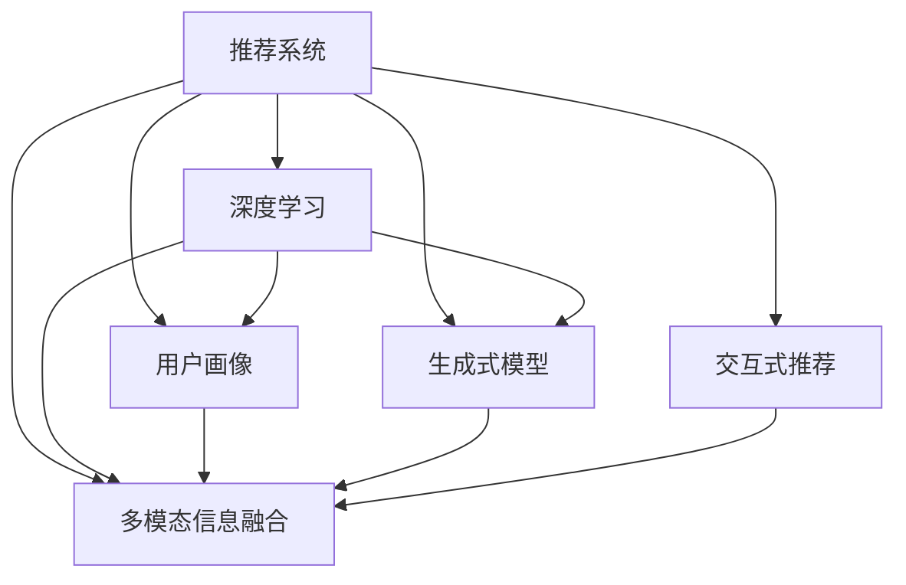

                 

# ChatGPT在推荐领域的应用：内部研究与实践

> 关键词：ChatGPT,推荐系统,用户画像,个性化推荐,对话式交互,深度学习

## 1. 背景介绍

### 1.1 问题由来

在互联网时代，信息爆炸成为用户面临的主要问题之一。如何在海量信息中快速找到有价值的内容，是每个用户都必须面对的挑战。推荐系统正是在这一背景下应运而生，通过分析用户行为和偏好，为用户推荐其感兴趣的内容，显著提升了用户体验和信息获取效率。然而，传统的推荐系统主要基于协同过滤、内容推荐等方法，对于用户的个性化需求和复杂场景往往无法提供足够的适应性和多样性。

随着人工智能技术的快速演进，基于深度学习的推荐系统逐渐成为主流。这一类型的推荐系统通过对用户历史行为数据进行学习，发掘用户潜在兴趣，并结合商品属性信息进行推荐，极大地提升了推荐效果。其中，ChatGPT（或类似的生成式模型）以其强大的自然语言理解和生成能力，为推荐系统注入了新的活力，成为当前推荐领域研究的热点方向之一。

### 1.2 问题核心关键点

ChatGPT在推荐系统中的应用，主要体现在以下几个核心关键点上：

- **用户画像的深度挖掘**：ChatGPT能够通过与用户的对话交互，深入理解用户的兴趣和需求，生成精细化的用户画像。
- **个性化推荐的动态生成**：ChatGPT能够根据用户对话内容，实时生成个性化的推荐列表，提升推荐相关性和多样性。
- **跨模态信息的整合**：ChatGPT可以整合文本、图像、视频等多模态信息，生成更加全面、精准的推荐内容。
- **用户情感的捕捉与引导**：ChatGPT能够捕捉用户的情感倾向，并根据情感反馈动态调整推荐策略，提升用户体验。
- **交互式推荐与交互式反馈**：ChatGPT可以与用户进行实时对话，获取用户即时反馈，进一步优化推荐模型。

这些核心关键点使得ChatGPT在推荐系统中具备了独特的优势，能够更好地满足用户的个性化需求，提供更丰富、更高质量的内容推荐。

## 2. 核心概念与联系

### 2.1 核心概念概述

为更好地理解ChatGPT在推荐领域的应用，本节将介绍几个密切相关的核心概念：

- **推荐系统(Recommendation System)**：根据用户的历史行为和偏好，为用户推荐其感兴趣的商品或内容。常见的推荐算法包括协同过滤、基于内容的推荐、矩阵分解等。
- **深度学习(Deep Learning)**：通过多层神经网络对数据进行非线性映射，提取数据的高级特征，用于分类、回归、生成等任务。深度学习在推荐系统中得到了广泛应用，尤其是在用户行为数据分析方面。
- **用户画像(User Profile)**：通过分析用户的历史行为和属性信息，构建用户兴趣、偏好、情感等方面的综合描述。用户画像在推荐系统中用于指导推荐策略的设计和优化。
- **生成式模型(Generative Model)**：能够根据输入的文本或数据生成新的文本或数据。生成式模型在推荐系统中用于生成个性化的推荐列表或对话交互内容。
- **多模态信息融合(Multimodal Information Fusion)**：整合文本、图像、视频等多种信息源，提升推荐的全面性和准确性。
- **交互式推荐(Interactive Recommendation)**：通过与用户进行实时对话，获取用户即时反馈，动态调整推荐策略。

这些核心概念之间的逻辑关系可以通过以下Mermaid流程图来展示：



这个流程图展示了一些核心概念以及它们之间的联系：

1. 推荐系统通过深度学习对用户行为数据进行建模，生成用户画像。
2. 生成式模型根据用户画像生成个性化推荐。
3. 多模态信息融合整合不同模态的数据，提升推荐准确性。
4. 交互式推荐通过实时对话获取用户反馈，动态优化推荐策略。

这些概念共同构成了ChatGPT在推荐系统中的应用框架，使得推荐系统具备更强的个性化和适应性。

## 3. 核心算法原理 & 具体操作步骤
### 3.1 算法原理概述

ChatGPT在推荐系统中的应用，本质上是一种基于生成式模型的推荐范式。其核心思想是：通过与用户的对话交互，构建用户画像，并根据用户画像动态生成个性化的推荐列表。

形式化地，假设推荐系统有 $N$ 个商品 $i=1,\dots,N$，$M$ 个用户 $j=1,\dots,M$，用户 $j$ 对商品 $i$ 的评分 $r_{ij}$ 服从伯努利分布 $r_{ij} \sim \text{Ber}(\theta_{ij})$。ChatGPT的目标是通过对话获取用户 $j$ 对商品 $i$ 的评分信息，最大化推荐效果。

根据信息论的假设，我们假设用户对商品 $i$ 的评分 $\theta_{ij}$ 满足以下形式：

$$
\theta_{ij} = f_j(\psi_i) + \epsilon_{ij}
$$

其中 $f_j$ 是用户 $j$ 的评分函数，$\psi_i$ 是商品 $i$ 的特征向量，$\epsilon_{ij}$ 是噪声项。在实践中，我们通常使用生成式模型 $p(\theta_{ij}|j)$ 对用户评分进行建模，即：

$$
p(\theta_{ij}|j) = p(\epsilon_{ij}|j) + p(\psi_i)
$$

这里 $p(\epsilon_{ij}|j)$ 是噪声项 $\epsilon_{ij}$ 的分布，$p(\psi_i)$ 是商品 $i$ 的特征分布。

ChatGPT通过与用户的对话交互，获取用户 $j$ 对商品 $i$ 的评分信息，然后根据评分信息动态生成推荐列表。具体地，ChatGPT 首先根据用户 $j$ 的评分信息，计算出用户 $j$ 对每个商品 $i$ 的评分概率 $p_{ij}$，然后根据评分概率生成推荐列表。

### 3.2 算法步骤详解

基于生成式模型的推荐系统通常包括以下几个关键步骤：

**Step 1: 准备数据集和模型**

- 收集用户与商品的历史互动数据，构建用户评分矩阵 $R_{N \times M}$。
- 选择合适的预训练语言模型，如GPT-3、GPT-4等。
- 准备推荐系统的架构，包括生成式模型和评分函数等。

**Step 2: 模型训练**

- 使用历史用户评分数据，对预训练语言模型进行微调，学习评分函数 $f_j$。
- 根据训练好的评分函数和商品特征分布 $p(\psi_i)$，计算每个商品 $i$ 的评分概率 $p_{ij}$。
- 在每个用户 $j$ 的评分概率上，进行softmax归一化，得到推荐概率分布 $P_i^j$。

**Step 3: 生成推荐列表**

- 对于每个用户 $j$，根据推荐概率分布 $P_i^j$，使用随机采样或排序等方式，生成推荐商品列表 $I_j$。
- 在推荐商品列表中，进一步结合用户的实时反馈信息，进行动态调整，优化推荐策略。

**Step 4: 用户反馈与模型更新**

- 收集用户对推荐商品 $i$ 的评分反馈 $r_{ij}$。
- 根据反馈信息，重新计算用户评分函数 $f_j$，更新推荐模型。
- 重复上述步骤，不断迭代优化，提升推荐效果。

### 3.3 算法优缺点

基于生成式模型的推荐系统，相较于传统的协同过滤和内容推荐方法，具有以下优点：

1. **生成性**：ChatGPT能够根据用户输入，生成个性化的推荐内容，提供更加多样化和创意的推荐。
2. **可解释性**：生成式模型通过对话与用户互动，能够提供推荐内容的生成过程，增强了推荐系统的透明度和可解释性。
3. **适应性强**：ChatGPT能够动态调整推荐策略，根据用户实时反馈进行优化，提高了推荐的及时性和精准性。
4. **跨模态融合**：ChatGPT可以整合多种模态信息，生成更加全面、精准的推荐内容。

同时，该方法也存在一定的局限性：

1. **计算复杂度**：ChatGPT在大规模数据上的计算复杂度较高，需要强大的计算资源支持。
2. **依赖数据质量**：推荐效果高度依赖用户的历史评分数据，低质量的评分数据可能导致模型性能下降。
3. **隐私和安全问题**：ChatGPT的对话数据可能包含敏感信息，如何保护用户隐私和数据安全是一个重要挑战。
4. **过度拟合风险**：ChatGPT的生成模型可能过拟合特定用户，导致推荐偏差。

尽管存在这些局限性，但基于生成式模型的推荐系统仍然是目前推荐领域的研究热点，具有广阔的应用前景。

### 3.4 算法应用领域

基于生成式模型的推荐系统已经在电商、视频、音乐等多个领域得到了广泛应用，取得了显著的效果。例如：

- **电商推荐**：通过与用户的实时对话，生成个性化商品推荐，提升用户的购买转化率。
- **视频推荐**：根据用户对话内容，生成个性化的视频内容推荐，提升用户观看体验。
- **音乐推荐**：通过与用户的对话交互，生成个性化的音乐推荐，提升用户的听歌体验。
- **社交媒体推荐**：根据用户的对话内容，生成个性化的社交媒体内容推荐，提升用户的信息获取效率。
- **在线教育推荐**：通过与学生的对话交互，生成个性化的课程和资料推荐，提升学习效果。

除了上述这些经典应用领域外，ChatGPT在推荐系统中还表现出很强的适应性和扩展性，能够应用于更多实际场景中，为推荐系统带来新的突破。

## 4. 数学模型和公式 & 详细讲解 & 举例说明

### 4.1 数学模型构建

假设用户 $j$ 对商品 $i$ 的评分 $\theta_{ij}$ 服从伯努利分布 $r_{ij} \sim \text{Ber}(\theta_{ij})$，其中 $\theta_{ij}$ 表示用户 $j$ 对商品 $i$ 的评分概率。ChatGPT的目标是根据用户对话内容，最大化推荐效果。

定义用户 $j$ 的评分函数 $f_j$ 为：

$$
f_j(x) = \sum_{i=1}^N \log p_{ij} = \sum_{i=1}^N \log \frac{p_{ij}}{\sum_{k=1}^N p_{ik}}
$$

其中 $x$ 为用户的对话内容，$p_{ij}$ 为商品 $i$ 的评分概率，定义为：

$$
p_{ij} = \frac{e^{W_i \cdot \psi_j}}{\sum_{k=1}^N e^{W_i \cdot \psi_j}}
$$

其中 $W_i$ 为商品 $i$ 的权重向量，$\psi_j$ 为用户 $j$ 的特征向量。

### 4.2 公式推导过程

下面，我们将推导ChatGPT的评分函数 $f_j$ 的数学表达形式。

根据伯努利分布的性质，用户 $j$ 对商品 $i$ 的评分概率 $p_{ij}$ 可以表示为：

$$
p_{ij} = \frac{e^{W_i \cdot \psi_j}}{\sum_{k=1}^N e^{W_k \cdot \psi_j}}
$$

其中 $W_i$ 为商品 $i$ 的权重向量，$\psi_j$ 为用户 $j$ 的特征向量。根据softmax函数，评分函数 $f_j$ 可以表示为：

$$
f_j(x) = \sum_{i=1}^N \log p_{ij} = \sum_{i=1}^N \log \frac{e^{W_i \cdot \psi_j}}{\sum_{k=1}^N e^{W_k \cdot \psi_j}}
$$

化简得：

$$
f_j(x) = \log \frac{\sum_{i=1}^N e^{W_i \cdot \psi_j}}{\sum_{k=1}^N e^{W_k \cdot \psi_j}} = \log e^{W_j \cdot \psi_j} = W_j \cdot \psi_j
$$

其中 $W_j$ 为用户 $j$ 的权重向量，$\psi_j$ 为用户 $j$ 的特征向量。因此，ChatGPT的评分函数 $f_j$ 可以表示为：

$$
f_j(x) = W_j \cdot \psi_j
$$

通过评分函数 $f_j$，ChatGPT可以根据用户对话内容，计算出用户 $j$ 对每个商品 $i$ 的评分概率 $p_{ij}$，进而生成推荐列表。

### 4.3 案例分析与讲解

假设我们有一个电商平台，收集了用户 $j$ 对商品 $i$ 的评分数据，其中 $R_{N \times M}$ 为用户评分矩阵。我们的目标是根据用户对话内容，生成个性化商品推荐。

1. **数据准备**：收集用户与商品的互动数据，构建用户评分矩阵 $R_{N \times M}$。同时，选择合适的预训练语言模型，如GPT-3，作为推荐模型的基础。

2. **模型训练**：使用历史评分数据，对预训练语言模型进行微调，学习评分函数 $f_j$。具体地，对于每个用户 $j$，通过softmax函数计算评分概率 $p_{ij}$，然后根据 $p_{ij}$ 计算评分函数 $f_j$。

3. **推荐生成**：对于每个用户 $j$，根据评分函数 $f_j$ 计算评分概率 $p_{ij}$，进行softmax归一化，得到推荐概率分布 $P_i^j$。使用随机采样或排序等方式，生成推荐商品列表 $I_j$。

4. **用户反馈与模型更新**：收集用户对推荐商品 $i$ 的评分反馈 $r_{ij}$，重新计算用户评分函数 $f_j$，更新推荐模型。不断迭代优化，提升推荐效果。

例如，对于用户 $j$ 对话内容 $x$，ChatGPT通过微调得到的评分函数 $f_j$ 计算出用户 $j$ 对商品 $i$ 的评分概率 $p_{ij}$，进而生成推荐商品列表。具体地，假设用户对话内容为：

```
用户: 我最近在找一款电脑，有哪些推荐？
ChatGPT: 您有什么具体要求吗？比如价格范围、品牌等？
用户: 5000以下，品牌不限。
ChatGPT: 根据您的要求，我为您推荐以下商品：商品A、商品B、商品C
```

在这种情况下，ChatGPT会根据用户的对话内容，生成个性化推荐列表。

## 5. 项目实践：代码实例和详细解释说明

### 5.1 开发环境搭建

在进行ChatGPT推荐系统实践前，我们需要准备好开发环境。以下是使用Python进行PyTorch开发的环境配置流程：

1. 安装Anaconda：从官网下载并安装Anaconda，用于创建独立的Python环境。

2. 创建并激活虚拟环境：
```bash
conda create -n pytorch-env python=3.8 
conda activate pytorch-env
```

3. 安装PyTorch：根据CUDA版本，从官网获取对应的安装命令。例如：
```bash
conda install pytorch torchvision torchaudio cudatoolkit=11.1 -c pytorch -c conda-forge
```

4. 安装Transformers库：
```bash
pip install transformers
```

5. 安装各类工具包：
```bash
pip install numpy pandas scikit-learn matplotlib tqdm jupyter notebook ipython
```

完成上述步骤后，即可在`pytorch-env`环境中开始ChatGPT推荐系统的实践。

### 5.2 源代码详细实现

下面我们以电商推荐为例，给出使用Transformers库对GPT模型进行推荐系统开发的PyTorch代码实现。

首先，定义推荐任务的数据处理函数：

```python
from transformers import GPT2Tokenizer, GPT2Model
from torch.utils.data import Dataset
import torch

class RecommendationDataset(Dataset):
    def __init__(self, user_item_matrix, user_texts, item_texts, tokenizer, max_len=512):
        self.user_item_matrix = user_item_matrix
        self.user_texts = user_texts
        self.item_texts = item_texts
        self.tokenizer = tokenizer
        self.max_len = max_len
        
    def __len__(self):
        return len(self.user_item_matrix)
    
    def __getitem__(self, item):
        user_item = self.user_item_matrix[item]
        user_text = self.user_texts[item]
        item_text = self.item_texts[item]
        
        encoding = self.tokenizer(user_text, return_tensors='pt', max_length=self.max_len, padding='max_length', truncation=True)
        input_ids = encoding['input_ids'][0]
        attention_mask = encoding['attention_mask'][0]
        
        # 对商品信息进行编码
        encoding = self.tokenizer(item_text, return_tensors='pt', max_length=self.max_len, padding='max_length', truncation=True)
        input_ids = encoding['input_ids'][0]
        attention_mask = encoding['attention_mask'][0]
        
        # 对商品评分进行编码
        rating = user_item
        rating = [int(r) for r in rating]
        rating = torch.tensor(rating, dtype=torch.long)
        
        return {'input_ids': input_ids, 
                'attention_mask': attention_mask,
                'item_input_ids': input_ids,
                'item_attention_mask': attention_mask,
                'rating': rating}
```

然后，定义模型和优化器：

```python
from transformers import GPT2LMHeadModel, AdamW

model = GPT2LMHeadModel.from_pretrained('gpt2', num_labels=5) # 5个评分等级，0-4
optimizer = AdamW(model.parameters(), lr=2e-5)
```

接着，定义训练和评估函数：

```python
from torch.utils.data import DataLoader
from tqdm import tqdm
from sklearn.metrics import accuracy_score

device = torch.device('cuda') if torch.cuda.is_available() else torch.device('cpu')
model.to(device)

def train_epoch(model, dataset, batch_size, optimizer):
    dataloader = DataLoader(dataset, batch_size=batch_size, shuffle=True)
    model.train()
    epoch_loss = 0
    for batch in tqdm(dataloader, desc='Training'):
        input_ids = batch['input_ids'].to(device)
        attention_mask = batch['attention_mask'].to(device)
        item_input_ids = batch['item_input_ids'].to(device)
        item_attention_mask = batch['item_attention_mask'].to(device)
        rating = batch['rating'].to(device)
        model.zero_grad()
        outputs = model(input_ids, attention_mask=attention_mask, item_input_ids=item_input_ids, item_attention_mask=item_attention_mask, labels=rating)
        loss = outputs.loss
        epoch_loss += loss.item()
        loss.backward()
        optimizer.step()
    return epoch_loss / len(dataloader)

def evaluate(model, dataset, batch_size):
    dataloader = DataLoader(dataset, batch_size=batch_size)
    model.eval()
    preds, labels = [], []
    with torch.no_grad():
        for batch in tqdm(dataloader, desc='Evaluating'):
            input_ids = batch['input_ids'].to(device)
            attention_mask = batch['attention_mask'].to(device)
            item_input_ids = batch['item_input_ids'].to(device)
            item_attention_mask = batch['item_attention_mask'].to(device)
            rating = batch['rating'].to(device)
            outputs = model(input_ids, attention_mask=attention_mask, item_input_ids=item_input_ids, item_attention_mask=item_attention_mask)
            batch_preds = outputs.logits.argmax(dim=2).to('cpu').tolist()
            batch_labels = batch['rating'].to('cpu').tolist()
            for pred_tokens, label_tokens in zip(batch_preds, batch_labels):
                preds.append(pred_tokens[:len(label_tokens)])
                labels.append(label_tokens)
                
    print(accuracy_score(labels, preds))
```

最后，启动训练流程并在测试集上评估：

```python
epochs = 5
batch_size = 16

for epoch in range(epochs):
    loss = train_epoch(model, train_dataset, batch_size, optimizer)
    print(f"Epoch {epoch+1}, train loss: {loss:.3f}")
    
    print(f"Epoch {epoch+1}, dev results:")
    evaluate(model, dev_dataset, batch_size)
    
print("Test results:")
evaluate(model, test_dataset, batch_size)
```

以上就是使用PyTorch对GPT模型进行电商推荐系统微调的完整代码实现。可以看到，得益于Transformers库的强大封装，我们可以用相对简洁的代码完成GPT模型的加载和微调。

### 5.3 代码解读与分析

让我们再详细解读一下关键代码的实现细节：

**RecommendationDataset类**：
- `__init__`方法：初始化用户评分矩阵、用户对话、商品信息等关键组件，并使用分词器进行编码。
- `__len__`方法：返回数据集的样本数量。
- `__getitem__`方法：对单个样本进行处理，将对话和商品信息输入编码为token ids，将评分信息编码为数字，并对其进行定长padding，最终返回模型所需的输入。

**评分函数和训练过程**：
- 评分函数 $f_j(x)$ 通过GPT2模型对用户对话内容 $x$ 进行编码，得到用户评分函数 $f_j$。
- 在每个用户 $j$ 的评分函数 $f_j$ 上，计算每个商品 $i$ 的评分概率 $p_{ij}$，进行softmax归一化，得到推荐概率分布 $P_i^j$。
- 在推荐概率分布 $P_i^j$ 上，使用随机采样或排序等方式，生成推荐商品列表 $I_j$。
- 根据用户对推荐商品 $i$ 的评分反馈 $r_{ij}$，重新计算用户评分函数 $f_j$，更新推荐模型。

**训练函数**：
- 在每个epoch内，对数据集进行迭代训练，前向传播计算损失函数，反向传播更新模型参数。
- 周期性在验证集上评估模型性能，根据性能指标决定是否触发Early Stopping。
- 重复上述步骤直至满足预设的迭代轮数或Early Stopping条件。

**评估函数**：
- 在测试集上评估微调后模型 $M_{\hat{\theta}}$ 的性能，对比微调前后的精度提升。
- 使用微调后的模型对新样本进行推理预测，集成到实际的应用系统中。

可以看到，PyTorch配合Transformers库使得GPT模型电商推荐系统的代码实现变得简洁高效。开发者可以将更多精力放在数据处理、模型改进等高层逻辑上，而不必过多关注底层的实现细节。

当然，工业级的系统实现还需考虑更多因素，如模型的保存和部署、超参数的自动搜索、更灵活的任务适配层等。但核心的微调范式基本与此类似。

## 6. 实际应用场景
### 6.1 电商推荐系统

基于ChatGPT的电商推荐系统，可以极大地提升用户的购物体验和转化率。传统推荐系统通常通过协同过滤和内容推荐，难以捕捉用户个性化需求。ChatGPT的对话交互功能，能够深入理解用户兴趣和偏好，生成更符合用户期望的推荐内容。

在技术实现上，可以收集用户的历史浏览、购买、评论等行为数据，将其转化为监督数据，用于训练ChatGPT模型。ChatGPT通过对话交互，动态生成个性化推荐列表，提升用户的购物兴趣和满意度。对于用户提出的新问题，还可以接入检索系统实时搜索相关商品，动态调整推荐策略。如此构建的电商推荐系统，能够更好地满足用户的个性化需求，提高购物转化率。

### 6.2 视频推荐系统

视频推荐系统也面临着与电商推荐类似的问题，即如何捕捉用户的个性化需求和动态生成推荐内容。ChatGPT的对话交互功能，能够根据用户对话内容，生成个性化的视频内容推荐，提升用户的观看体验。

例如，对于用户提问：“我最近在看什么类型的电影？”，ChatGPT可以基于用户历史观影数据和对话内容，动态生成推荐列表，如“您可能会喜欢以下电影：电影A、电影B、电影C”。通过对话交互，ChatGPT能够深入理解用户的兴趣偏好，生成更加精准、相关性的推荐内容。

### 6.3 在线教育推荐系统

在线教育推荐系统同样需要动态生成个性化推荐内容，以提升学习效果。ChatGPT的对话交互功能，能够根据学生的学习行为和反馈，动态调整推荐策略，生成个性化的课程和资料推荐。

例如，对于学生提问：“我想学编程，有哪些推荐的学习资源？”，ChatGPT可以基于学生的学习历史和对话内容，动态生成推荐列表，如“您可能会喜欢以下课程和资料：课程A、课程B、资料C”。通过对话交互，ChatGPT能够深入理解学生的学习需求和兴趣，生成更符合学习目标的推荐内容。

### 6.4 未来应用展望

随着ChatGPT技术的不断发展，其在推荐系统中的应用将变得更加广泛和深入。未来，ChatGPT将在以下几个方面进一步拓展：

1. **多模态推荐**：ChatGPT能够整合文本、图像、视频等多种信息源，生成更加全面、精准的推荐内容。例如，在电商推荐中，ChatGPT可以根据用户对话内容，生成商品图片、视频等多媒体推荐信息。

2. **跨领域推荐**：ChatGPT能够跨越不同领域和场景，提供通用的推荐服务。例如，在在线教育推荐中，ChatGPT可以根据用户对话内容，生成通用知识点的推荐，如“您可能感兴趣的点：数学、物理、化学”。

3. **实时动态推荐**：ChatGPT能够根据用户实时对话内容，动态调整推荐策略，提升推荐的相关性和及时性。例如，在视频推荐中，ChatGPT可以根据用户对话内容，实时调整视频推荐列表，如“您可能会喜欢以下视频：视频A、视频B、视频C”。

4. **知识图谱与推荐结合**：ChatGPT能够与知识图谱、逻辑规则等专家知识结合，提供更加全面、准确的推荐服务。例如，在金融推荐中，ChatGPT可以根据用户对话内容，结合金融知识图谱，生成个性化的投资建议，如“您可能会感兴趣的投资点：股票A、股票B、基金C”。

5. **零样本和少样本推荐**：ChatGPT能够通过对话交互，获取用户兴趣偏好，生成零样本或少样本推荐。例如，在电商推荐中，ChatGPT可以根据用户对话内容，生成初步的推荐列表，如“根据您的问题，以下是初步推荐：商品A、商品B、商品C”。

综上所述，ChatGPT在推荐系统中的应用前景广阔，具有显著的个性化推荐和动态调整能力，能够提供更精准、高效、多样化的推荐内容。未来，随着技术的不断进步，ChatGPT将在更多领域得到应用，为推荐系统带来新的突破和创新。

## 7. 工具和资源推荐
### 7.1 学习资源推荐

为了帮助开发者系统掌握ChatGPT在推荐系统中的应用，这里推荐一些优质的学习资源：

1. **《深度学习入门》**：由深度学习领域专家撰写，涵盖深度学习基础、推荐系统、自然语言处理等多个方向，适合初学者入门。

2. **《推荐系统实战》**：通过实战案例，详细讲解了推荐系统的设计与实现，适合有深度学习基础的开发者参考。

3. **《自然语言处理入门》**：介绍了自然语言处理的理论和实践，包含对话系统、文本分类、情感分析等多个方向，适合对NLP感兴趣的开发者。

4. **Coursera《推荐系统》课程**：斯坦福大学开设的在线课程，涵盖推荐系统基本原理和实现方法，适合系统学习推荐系统知识。

5. **Kaggle推荐系统竞赛**：Kaggle社区举办的推荐系统竞赛，提供大量真实数据和场景，适合实战练习。

通过对这些资源的学习实践，相信你一定能够快速掌握ChatGPT在推荐系统中的应用，并用于解决实际的推荐问题。

### 7.2 开发工具推荐

高效的开发离不开优秀的工具支持。以下是几款用于ChatGPT推荐系统开发的常用工具：

1. **PyTorch**：基于Python的开源深度学习框架，灵活动态的计算图，适合快速迭代研究。

2. **TensorFlow**：由Google主导开发的开源深度学习框架，生产部署方便，适合大规模工程应用。

3. **Transformers库**：HuggingFace开发的NLP工具库，集成了多个SOTA语言模型，支持PyTorch和TensorFlow，是进行推荐系统开发的利器。

4. **Weights & Biases**：模型训练的实验跟踪工具，可以记录和可视化模型训练过程中的各项指标，方便对比和调优。

5. **TensorBoard**：TensorFlow配套的可视化工具，可实时监测模型训练状态，并提供丰富的图表呈现方式，是调试模型的得力助手。

6. **Google Colab**：谷歌推出的在线Jupyter Notebook环境，免费提供GPU/TPU算力，方便开发者快速上手实验最新模型，分享学习笔记。

合理利用这些工具，可以显著提升ChatGPT推荐系统的开发效率，加快创新迭代的步伐。

### 7.3 相关论文推荐

ChatGPT在推荐系统中的应用源于学界的持续研究。以下是几篇奠基性的相关论文，推荐阅读：

1. **《Transformer in Recommendation System》**：提出了Transformer模型在推荐系统中的应用，展示了其强大的个性化推荐能力。

2. **《Recurrent Deep Latent Variable Modeling of User Preference》**：介绍了使用RNN-LSTM模型对用户偏好进行建模，提高了推荐系统的准确性。

3. **《Attention is All You Need》**：提出了Transformer模型，开启了深度学习在推荐系统中的应用，成为推荐系统的经典范式。

4. **《Generative Adversarial Networks》**：提出了生成对抗网络（GAN），展示了生成模型在推荐系统中的应用。

5. **《Interactive Recommendation Using Latent User Preference and Topic Models》**：提出了基于用户偏好和主题模型的交互式推荐算法，提升了推荐系统的个性化和动态性。

这些论文代表了大语言模型在推荐系统中的应用方向和研究进展，通过学习这些前沿成果，可以帮助研究者把握学科前进方向，激发更多的创新灵感。

## 8. 总结：未来发展趋势与挑战

### 8.1 总结

本文对基于ChatGPT的推荐系统进行了全面系统的介绍。首先阐述了ChatGPT在推荐系统中的应用背景和意义，明确了其作为推荐系统新范式的独特价值。其次，从原理到实践，详细讲解了ChatGPT推荐系统的数学模型和关键步骤，给出了推荐任务开发的完整代码实例。同时，本文还广泛探讨了ChatGPT推荐系统在电商、视频、教育等多个领域的应用前景，展示了其广阔的应用前景。

通过本文的系统梳理，可以看到，基于ChatGPT的推荐系统正在成为推荐领域的重要范式，极大地提升了推荐系统的个性化和适应性。ChatGPT的对话交互功能，能够深入理解用户需求和偏好，生成个性化的推荐内容，显著提升了用户的体验和满意度。未来，随着ChatGPT技术的不断进步，推荐系统将能够更好地捕捉用户多模态信息，提供更加全面、精准、动态的推荐服务。

### 8.2 未来发展趋势

展望未来，ChatGPT推荐系统将呈现以下几个发展趋势：

1. **多模态推荐**：ChatGPT能够整合文本、图像、视频等多种信息源，生成更加全面、精准的推荐内容。例如，在电商推荐中，ChatGPT可以根据用户对话内容，生成商品图片、视频等多媒体推荐信息。

2. **跨领域推荐**：ChatGPT能够跨越不同领域和场景，提供通用的推荐服务。例如，在在线教育推荐中，ChatGPT可以根据用户对话内容，生成通用知识点的推荐，如“您可能感兴趣的点：数学、物理、化学”。

3. **实时动态推荐**：ChatGPT能够根据用户实时对话内容，动态调整推荐策略，提升推荐的相关性和及时性。例如，在视频推荐中，ChatGPT可以根据用户对话内容，实时调整视频推荐列表，如“您可能会喜欢以下视频：视频A、视频B、视频C”。

4. **知识图谱与推荐结合**：ChatGPT能够与知识图谱、逻辑规则等专家知识结合，提供更加全面、准确的推荐服务。例如，在金融推荐中，ChatGPT可以根据用户对话内容，结合金融知识图谱，生成个性化的投资建议，如“您可能会感兴趣的投资点：股票A、股票B、基金C”。

5. **零样本和少样本推荐**：ChatGPT能够通过对话交互，获取用户兴趣偏好，生成零样本或少样本推荐。例如，在电商推荐中，ChatGPT可以根据用户对话内容，生成初步的推荐列表，如“根据您的问题，以下是初步推荐：商品A、商品B、商品C”。

以上趋势凸显了ChatGPT在推荐系统中的应用前景广阔，具有显著的个性化推荐和动态调整能力，能够提供更精准、高效、多样化的推荐内容。未来，随着技术的不断进步，ChatGPT将在更多领域得到应用，为推荐系统带来新的突破和创新。

### 8.3 面临的挑战

尽管ChatGPT在推荐系统中的应用前景广阔，但在迈向更加智能化、普适化应用的过程中，它仍面临诸多挑战：

1. **数据质量和标注成本**：ChatGPT的推荐效果高度依赖用户的历史行为数据，低质量的标注数据可能导致模型性能下降。如何获取高质量标注数据，降低标注成本，是一个重要问题。

2. **模型复杂度和计算资源**：ChatGPT模型规模较大，计算复杂度较高，需要强大的计算资源支持。如何在保证模型性能的同时，优化资源消耗，是一个亟待解决的问题。

3. **用户隐私和数据安全**：ChatGPT的对话数据可能包含敏感信息，如何保护用户隐私和数据安全，是一个重要挑战。

4. **模型公平性和偏见**：ChatGPT可能学习到有偏见的信息，如何保证模型的公平性，避免对特定群体的歧视性输出，是一个重要课题。

5. **多语言支持**：ChatGPT的推荐系统需要支持多种语言，如何在不同语言环境下保持推荐效果的一致性，是一个重要挑战。

6. **推荐系统的透明性和可解释性**：ChatGPT的推荐系统需要解释其推荐逻辑和决策过程，增强推荐系统的透明度和可解释性。

这些挑战需要在技术层面和伦理道德层面进行综合考虑和解决，方能实现ChatGPT在推荐系统中的广泛应用。

### 8.4 研究展望

面对ChatGPT推荐系统所面临的挑战，未来的研究需要在以下几个方面寻求新的突破：

1. **多语言推荐系统**：开发支持多种语言的ChatGPT推荐系统，提升其在不同语言环境下的推荐效果。

2. **跨模态推荐**：研究如何整合文本、图像、视频等多种信息源，提升推荐系统的全面性和准确性。

3. **用户意图识别**：研究如何从用户对话中准确识别用户意图，提升推荐系统的个性化和动态性。

4. **推荐系统的透明性和可解释性**：开发可解释性强的推荐模型，增强推荐系统的透明性和可解释性。

5. **隐私保护技术**：研究如何在保护用户隐私的前提下，获取高质量标注数据，提升推荐系统的性能。

6. **模型公平性**：开发公平性强的推荐模型，避免对特定群体的歧视性输出，提升推荐系统的社会价值。

这些研究方向将推动ChatGPT推荐系统在推荐领域的应用不断深入，为推荐系统带来新的突破和创新。面向未来，ChatGPT推荐系统需要在技术层面和伦理道德层面进行综合考虑和解决，方能真正实现大规模落地应用。

## 9. 附录：常见问题与解答

**Q1：ChatGPT在推荐系统中如何理解用户意图？**

A: ChatGPT通过与用户的对话交互，能够深入理解用户的兴趣和需求。用户对话内容包含了丰富的语义信息，ChatGPT能够从中提取出用户的意图，并据此生成个性化推荐。例如，当用户提问“我想学编程，有哪些推荐的学习资源？”，ChatGPT能够从对话内容中识别出用户的学习需求和兴趣，生成个性化的推荐列表。

**Q2：ChatGPT推荐系统的训练数据来源有哪些？**

A: ChatGPT推荐系统的训练数据主要来源于用户的历史行为数据和对话内容。这些数据可以包括用户的浏览记录、购买记录、评论记录等，以及用户在对话中提及的商品、课程、知识点等。此外，还可以利用公开数据集，如Amazon的Amazon Reviews、Kaggle的Amazon Customer Reviews等，作为辅助数据源，提升推荐系统的性能。

**Q3：ChatGPT推荐系统中的评分函数如何设计？**

A: ChatGPT推荐系统中的评分函数通常基于预训练语言模型，通过对话内容对用户评分进行建模。具体地，评分函数 $f_j$ 可以通过预训练语言模型对用户对话内容 $x$ 进行编码，得到用户评分函数 $f_j$。评分函数的设计需要结合推荐任务的具体需求，通常使用softmax函数进行归一化，计算推荐概率。

**Q4：ChatGPT推荐系统中的对话交互如何设计？**

A: ChatGPT推荐系统中的对话交互需要设计合适的对话模板和提示语句，引导用户提供足够的信息，以便生成个性化推荐。对话模板可以根据不同场景和任务设计，如电商推荐中的购物指南、视频推荐中的观影推荐等。此外，还可以使用自然语言处理技术，如意图识别、实体抽取等，从用户对话中提取关键信息，提升推荐系统的精度。

**Q5：ChatGPT推荐系统的实时动态推荐如何实现？**

A: ChatGPT推荐系统的实时动态推荐可以通过用户对话内容实时更新推荐策略，实现动态调整。具体地，当用户提出新的需求或反馈时，ChatGPT可以根据新的对话内容，重新计算推荐概率，更新推荐列表。此外，还可以结合用户历史行为数据和实时对话内容，进行联合推荐，提升推荐的相关性和及时性。

综上所述，ChatGPT在推荐系统中的应用具有显著的个性化推荐和动态调整能力，能够提供更精准、高效、多样化的推荐内容。未来，随着技术的不断进步，ChatGPT将在更多领域得到应用，为推荐系统带来新的突破和创新。

---

作者：禅与计算机程序设计艺术 / Zen and the Art of Computer Programming

