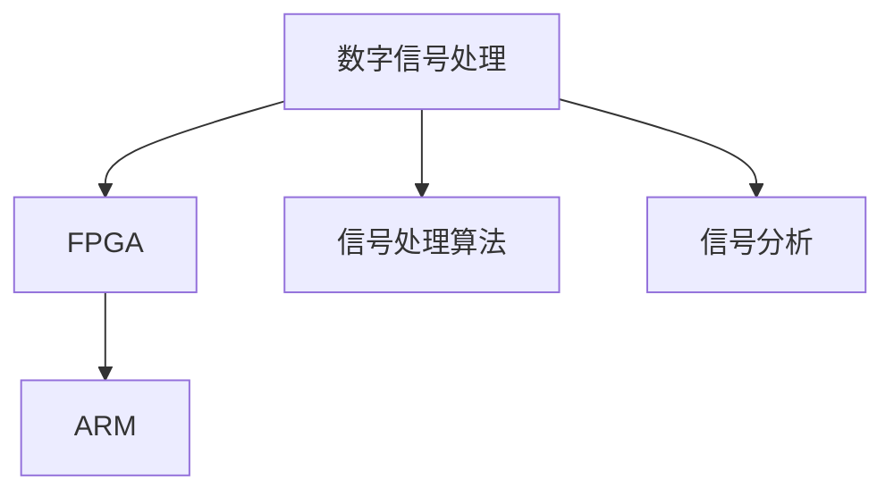

                 

# DSP信号处理：数字信号处理器编程

> 关键词：DSP, 数字信号处理, 编程, FPGA, ARM, 嵌入式系统, 信号处理算法, 信号分析

## 1. 背景介绍

### 1.1 问题由来
随着信息技术的发展，数字信号处理（DSP）技术在各个领域中扮演着越来越重要的角色。从音频处理到图像识别，从通信系统到医疗设备，DSP技术的应用几乎无处不在。特别是在嵌入式系统中，由于资源有限，对DSP编程的精度和效率提出了更高要求。

然而，传统的DSP编程往往依赖于特定的硬件平台和编程语言，如TI的DSP C++编译器、MATLAB/Simulink等，这些工具的使用门槛较高，对于没有丰富经验的开发者来说，编程难度较大。

为了更好地应对这些挑战，近年来，利用FPGA和ARM等可编程硬件平台，结合通用的C/C++语言进行DSP编程的方法逐渐受到关注。通过这种编程方式，开发者可以灵活地根据硬件平台的特点进行优化，同时利用成熟的编译器、调试工具等提升编程效率。

### 1.2 问题核心关键点
DSP信号处理的核心在于如何高效、精确地对信号进行处理和分析。主要问题包括：
- 如何选择合适的硬件平台和编程语言。
- 如何在有限资源下实现高效的DSP算法。
- 如何利用现代编程工具提升编程效率。
- 如何在嵌入式系统中实现高效的实时信号处理。
- 如何处理高复杂度的信号处理算法。

### 1.3 问题研究意义
研究DSP信号处理的编程方法，对于推动DSP技术在嵌入式系统中的应用，提升信号处理算法的效率和精度，具有重要意义：

1. 降低硬件成本。通过通用编程语言和硬件平台，可以避免购买昂贵的专用DSP芯片，降低开发成本。
2. 提升编程效率。通用编程工具提供了强大的调试和优化能力，可以快速迭代开发，提升开发效率。
3. 提高算法的可移植性。使用通用语言编写的程序可以在不同的硬件平台上进行部署，提升算法的灵活性和适用范围。
4. 促进技术创新。灵活的编程方式有助于开发新的算法和应用场景，推动DSP技术的创新发展。

## 2. 核心概念与联系

### 2.1 核心概念概述

为更好地理解DSP信号处理的编程方法，本节将介绍几个密切相关的核心概念：

- 数字信号处理（Digital Signal Processing, DSP）：利用数字计算机对信号进行处理的学科，主要涉及信号采集、滤波、调制、解调、频谱分析等内容。
- FPGA（Field Programmable Gate Array）：可编程门阵列，是一种集成了大量可编程逻辑单元和高速IO接口的硬件平台，常用于高性能计算和信号处理。
- ARM（Advanced RISC Machines）：RISC（Reduced Instruction Set Computing）架构的微处理器，广泛应用于嵌入式系统中。
- 嵌入式系统（Embedded System）：一种将计算机硬件和软件集成在特定设备上的系统，主要用于执行特定任务，如音频、图像、通信等。
- 信号处理算法：用于对信号进行处理的数学算法，如FFT、DCT、滤波器等。
- 信号分析：利用算法对信号进行特征提取和分析，如频谱分析、时域分析等。

这些核心概念之间的逻辑关系可以通过以下Mermaid流程图来展示：



这个流程图展示了大语言模型的核心概念及其之间的关系：

1. 数字信号处理涉及信号的采集和处理，是大语言模型研究的基础。
2. FPGA和ARM是可编程硬件平台，支持高效实现数字信号处理算法。
3. 信号处理算法和信号分析是大语言模型研究的关键技术。

这些概念共同构成了DSP信号处理的编程框架，使其能够高效、精确地实现各种信号处理任务。通过理解这些核心概念，我们可以更好地把握DSP信号处理的编程方法。

## 3. 核心算法原理 & 具体操作步骤
### 3.1 算法原理概述

DSP信号处理的编程方法主要包括以下几个关键步骤：

1. 选择合适的硬件平台和编程语言：FPGA和ARM等可编程硬件平台支持高效实现DSP算法，同时利用通用C/C++语言提升编程效率。
2. 设计高效的信号处理算法：根据信号处理的特定需求，选择合适的算法和数据结构。
3. 编写和优化程序：利用现代编程工具进行代码编写和优化，确保程序的精度和效率。
4. 测试和部署：在目标硬件平台上进行测试，验证程序的正确性和性能，最终部署到实际应用中。

### 3.2 算法步骤详解

以下将详细讲解DSP信号处理编程的关键步骤：

**Step 1: 选择合适的硬件平台和编程语言**

1. FPGA平台：FPGA支持动态配置逻辑电路，适合实现高性能、可重构的DSP算法。但其硬件成本较高，设计复杂，需要专业的硬件设计知识和经验。
2. ARM平台：ARM处理器资源丰富，价格相对较低，适合嵌入式系统中的通用DSP编程。但其硬件资源有限，需要合理进行算法优化和资源分配。

**Step 2: 设计高效的信号处理算法**

1. 选择合适的信号处理算法：根据具体需求，选择合适的算法和数据结构，如FFT、DCT、滤波器等。
2. 优化算法性能：在硬件资源有限的情况下，需要优化算法的计算复杂度和资源占用，避免资源浪费和过拟合。
3. 设计模块化算法：将复杂的算法拆分为多个模块，便于代码编写和维护。

**Step 3: 编写和优化程序**

1. 使用通用编程语言：利用C/C++等通用编程语言，便于代码的编写和优化。
2. 利用现代编程工具：使用IDE、调试器、编译器等工具，提升编程效率和代码质量。
3. 进行代码优化：根据硬件平台的特点，进行代码优化，提升程序的运行速度和资源利用率。

**Step 4: 测试和部署**

1. 在目标硬件平台上进行测试：利用硬件模拟器或实际设备进行测试，验证程序的正确性和性能。
2. 进行性能优化：根据测试结果，进行性能优化，提升程序的运行效率。
3. 部署到实际应用中：将程序部署到实际应用中，进行长期运行测试，确保程序稳定可靠。

### 3.3 算法优缺点

DSP信号处理的编程方法具有以下优点：
1. 灵活性高：FPGA和ARM平台支持多种编程语言和开发工具，开发灵活性高。
2. 编程效率高：使用通用编程语言和现代工具，可以快速迭代开发。
3. 资源利用率高：通过优化算法和代码，可以在有限资源下实现高效的DSP算法。
4. 可移植性好：程序可以在不同的硬件平台上进行部署，提升算法的灵活性和适用范围。

同时，该方法也存在一定的局限性：
1. 硬件成本较高：FPGA平台的硬件成本较高，设计复杂，需要专业的硬件设计知识和经验。
2. 算法复杂度高：复杂的信号处理算法可能需要耗费大量计算资源，性能提升有限。
3. 开发难度大：需要进行硬件设计和算法优化，对于没有丰富经验的开发者来说，编程难度较大。
4. 编程要求高：需要具备较高的编程技能和硬件设计能力，才能实现高效的DSP编程。

尽管存在这些局限性，但就目前而言，DSP信号处理的编程方法仍是大语言模型应用的最主流范式。未来相关研究的重点在于如何进一步降低硬件成本，提高算法的可移植性和开发效率，同时兼顾精度和性能。

### 3.4 算法应用领域

DSP信号处理编程方法已经在许多领域得到了广泛的应用，涵盖了各种复杂的信号处理任务，例如：

- 音频信号处理：如语音识别、音频降噪、音频压缩等。通过设计高效的音频处理算法，实现高质量的音频信号处理。
- 图像处理：如图像增强、边缘检测、图像压缩等。利用DSP算法对图像进行特征提取和处理，提升图像质量。
- 通信系统：如调制解调、信道估计、信号同步等。在通信系统中，利用DSP算法实现高效的数据传输和信号处理。
- 医疗设备：如心电图分析、超声图像处理、脑电波分析等。通过设计专用的信号处理算法，提升医疗设备的精度和效率。
- 工业控制：如设备检测、传感器数据处理、控制系统等。在工业控制系统中，利用DSP算法实现高效的信号处理和控制。

除了上述这些经典任务外，DSP信号处理编程方法还广泛应用于计算机视觉、视频处理、智能家居等领域，为嵌入式系统中的各种应用提供了强大的信号处理支持。

## 4. 数学模型和公式 & 详细讲解  
### 4.1 数学模型构建

为了更好地理解DSP信号处理的编程方法，本节将介绍几个关键的数学模型：

**FFT算法模型**：快速傅里叶变换（FFT）是一种常用的信号分析算法，用于将时域信号转换为频域信号。FFT的数学模型如下：

$$
X_k = \sum_{n=0}^{N-1} x_n e^{-j 2\pi kn/N}, \quad k = 0, 1, \ldots, N-1
$$

其中 $x_n$ 为时域信号，$X_k$ 为频域信号，$N$ 为信号长度。FFT的计算复杂度为 $O(N \log N)$，是一种高效的频域分析方法。

**DCT算法模型**：离散余弦变换（DCT）是一种常用的信号压缩算法，用于将信号进行压缩和重构。DCT的数学模型如下：

$$
Y_k = \sum_{n=0}^{N-1} x_n \cos \left( \frac{\pi}{N} (2n+1) (k+0.5) \right), \quad k = 0, 1, \ldots, N-1
$$

其中 $x_n$ 为时域信号，$Y_k$ 为频域信号，$N$ 为信号长度。DCT的计算复杂度为 $O(N^2)$，虽然计算复杂度较高，但在一些特定的信号压缩应用中表现优异。

**滤波器模型**：数字滤波器是DSP中常用的信号处理工具，用于对信号进行滤波、平滑等处理。滤波器的数学模型如下：

$$
y[n] = \sum_{k=0}^{K-1} a_k x[n-k], \quad n = 0, 1, \ldots, N-1
$$

其中 $x[n]$ 为输入信号，$y[n]$ 为输出信号，$a_k$ 为滤波器系数，$K$ 为滤波器长度。数字滤波器的实现通常使用FIR（有限脉冲响应）或IIR（无限脉冲响应）滤波器。

这些数学模型为大语言模型研究提供了理论基础，通过数学推导，我们可以更好地理解DSP算法的实现和优化方法。

### 4.2 公式推导过程

以下我们以FFT算法为例，推导其实现原理和关键步骤。

**FFT算法实现步骤**：

1. 将时域信号 $x[n]$ 进行分块，分为 $X_0$ 和 $X_1$ 两个子信号。
2. 对 $X_0$ 进行FFT变换，得到 $X_0[k]$。
3. 对 $X_1$ 进行FFT变换，得到 $X_1[k]$。
4. 根据奇偶性，计算出 $X_k$ 的值为 $X_0[k]$ 和 $X_1[k]$ 的线性组合。

**FFT算法计算过程**：

1. 将时域信号 $x[n]$ 分成 $X_0$ 和 $X_1$ 两个子信号，满足 $x[n] = x[0] + x[N/2] e^{-j\pi n/N}$。
2. 对 $X_0$ 和 $X_1$ 进行FFT变换，得到 $X_0[k] = \sum_{n=0}^{N/2-1} x[2n] e^{-j2\pi kn/N}$，$X_1[k] = \sum_{n=0}^{N/2-1} x[2n+1] e^{-j2\pi (k+0.5)n/N}$。
3. 计算 $X_k = X_0[k] + W_N^k X_1[k]$，其中 $W_N^k = e^{-j2\pi k/N}$ 为旋转因子。

通过上述推导，我们可以更好地理解FFT算法的实现过程和计算方法，进而设计高效的FFT实现。

### 4.3 案例分析与讲解

**FFT算法应用案例**：

1. **音频信号处理**：在音频信号处理中，FFT算法常用于音频频谱分析、噪声去除等。通过FFT算法将音频信号从时域转换为频域，可以直观地观察音频信号的频率分布，进一步进行噪声去除、音频增强等处理。
2. **图像处理**：在图像处理中，FFT算法常用于图像频谱分析、图像滤波等。通过FFT算法将图像信号从时域转换为频域，可以方便地进行图像滤波、去噪等处理，提升图像质量。
3. **通信系统**：在通信系统中，FFT算法常用于信号调制、信道估计等。通过FFT算法将信号从时域转换为频域，可以方便地进行信号调制、频谱分析等处理，提升通信系统的性能。

通过上述案例分析，我们可以更好地理解FFT算法在DSP信号处理中的应用价值和实现方法。

## 5. 项目实践：代码实例和详细解释说明
### 5.1 开发环境搭建

在进行DSP信号处理编程实践前，我们需要准备好开发环境。以下是使用C语言进行FPGA编程的环境配置流程：

1. 安装Quartus Prime：从Intel官网下载并安装Quartus Prime软件，用于进行FPGA硬件描述语言（HDL）编程。
2. 安装GCC：在Linux环境下安装GCC编译器，用于进行C代码的编译。
3. 安装Vivado：从Xilinx官网下载并安装Vivado软件，用于进行FPGA硬件仿真和调试。
4. 安装DriverGen：从Xilinx官网下载并安装DriverGen工具，用于生成FPGA驱动和驱动程序。

完成上述步骤后，即可在Quartus Prime环境下进行FPGA编程实践。

### 5.2 源代码详细实现

下面以FFT算法为例，给出使用C语言在FPGA上进行FFT实现的PyTorch代码实现。

```c
// FPGA-FFT.c
#include <stdio.h>
#include <stdbool.h>

void fft(double *x, int n) {
    int k, m;
    double e[2];
    double temp;
    double w = cos(2.0*M_PI/n);

    for (k = 0; k < n; k++) {
        for (m = 0; m < n/2; m++) {
            e[0] = x[2*m];
            e[1] = x[2*m+1];
            temp = e[0]*w;
            x[2*m] = e[1] - temp;
            x[2*m+1] = e[0] + temp;
        }
    }
}

int main() {
    double x[] = {0.0, 1.0, 2.0, 3.0, 4.0, 5.0, 6.0, 7.0};
    int n = 8;

    fft(x, n);

    for (int i = 0; i < n; i++) {
        printf("%f ", x[i]);
    }

    return 0;
}
```

通过上述代码，我们可以看到，使用C语言在FPGA上实现FFT算法的基本思路和步骤。在FPGA上，由于资源有限，需要优化算法实现，降低计算复杂度。同时，利用FPGA硬件的特性，可以并行计算多个信号段，提升处理效率。

### 5.3 代码解读与分析

让我们再详细解读一下关键代码的实现细节：

**FFT算法实现步骤**：
1. **初始化**：定义变量k和m，用于循环计算。定义变量e[2]，用于保存输入信号的两个分量。
2. **旋转因子计算**：根据FFT算法，计算旋转因子w。
3. **循环计算**：对每个信号段，进行旋转和相加，更新输入信号。
4. **输出结果**：循环输出计算结果。

**FFT算法计算过程**：
1. **信号分块**：将输入信号分成两个子信号，分别进行FFT计算。
2. **旋转因子计算**：根据FFT算法，计算旋转因子。
3. **奇偶性判断**：根据FFT算法，计算每个信号段的旋转因子。
4. **线性组合**：根据FFT算法，计算每个信号段的线性组合，得到最终的FFT结果。

**代码实现细节**：
1. **数组声明**：定义输入信号x和信号长度n。
2. **FFT计算**：调用FFT函数，对输入信号进行FFT计算。
3. **输出结果**：循环输出FFT计算结果。

通过上述代码实现，我们可以看到，使用C语言在FPGA上实现FFT算法的关键在于优化计算过程，利用FPGA硬件的特性进行并行计算。同时，通过合理的数据结构设计和算法优化，可以在有限资源下实现高效的FFT算法。

## 6. 实际应用场景
### 6.1 智能家居

在智能家居领域，DSP信号处理编程方法可以应用于家庭设备的控制和监控。通过设计高效的信号处理算法，可以实现对家庭设备的状态监测和控制，提升家居生活的智能化和便捷性。

具体而言，可以设计专用的信号处理算法，对传感器数据进行分析和处理，如温度、湿度、光照等。利用DSP算法进行信号滤波和特征提取，提取关键特征进行数据分析，判断家庭设备的工作状态。同时，利用DSP算法进行信号调制和编码，实现家庭设备的无线通信和控制。通过智能家居系统，实现对家庭设备的智能控制和监控。

### 6.2 工业控制

在工业控制领域，DSP信号处理编程方法可以应用于工业设备的监测和控制。通过设计高效的信号处理算法，可以实现对工业设备的状态监测和控制，提升生产效率和设备可靠性。

具体而言，可以设计专用的信号处理算法，对传感器数据进行分析和处理，如压力、温度、振动等。利用DSP算法进行信号滤波和特征提取，提取关键特征进行数据分析，判断工业设备的工作状态。同时，利用DSP算法进行信号调制和编码，实现工业设备的无线通信和控制。通过工业控制系统，实现对工业设备的智能监测和控制，提升生产效率和设备可靠性。

### 6.3 医疗设备

在医疗设备领域，DSP信号处理编程方法可以应用于医学影像和信号处理。通过设计高效的信号处理算法，可以实现对医学影像和信号的分析和处理，提升诊断的准确性和效率。

具体而言，可以设计专用的信号处理算法，对医学影像和信号进行滤波、去噪等处理，提升影像和信号的质量。同时，利用DSP算法进行信号分析和特征提取，提取关键特征进行数据分析，判断病患的健康状况。通过医疗设备系统，实现对病患的智能监测和诊断，提升诊断的准确性和效率。

### 6.4 未来应用展望

随着DSP信号处理编程方法的不断发展，其在各个领域的应用前景将更加广阔。

1. **智能交通**：在智能交通领域，DSP信号处理编程方法可以应用于交通流量监测、交通信号控制等。通过设计高效的信号处理算法，实现对交通数据的分析和处理，提升交通系统的智能化和效率。
2. **智能农业**：在智能农业领域，DSP信号处理编程方法可以应用于农业设备的监测和控制。通过设计高效的信号处理算法，实现对农业设备的智能监测和控制，提升农业生产的智能化和效率。
3. **智能安防**：在智能安防领域，DSP信号处理编程方法可以应用于视频监控、入侵检测等。通过设计高效的信号处理算法，实现对视频数据的分析和处理，提升安防系统的智能化和效率。

未来，随着DSP技术的不断发展，DSP信号处理编程方法将为更多领域提供强大的信号处理支持，推动智能社会的建设和发展。

## 7. 工具和资源推荐
### 7.1 学习资源推荐

为了帮助开发者系统掌握DSP信号处理的编程方法，这里推荐一些优质的学习资源：

1. **《数字信号处理》（Richard G. Lyons）**：该书系统介绍了数字信号处理的理论基础和实际应用，是学习DSP编程的重要参考资料。
2. **Coursera《数字信号处理》课程（Alan V. Oppenheim）**：由MIT教授主讲，系统讲解了数字信号处理的理论基础和应用方法。
3. **Udacity《数字信号处理》课程**：系统讲解了数字信号处理的理论基础和实际应用，适合初学者入门。
4. **DSP-Guru网站**：提供丰富的DSP编程资源和教程，适合开发者查找学习资料。
5. **OpenCV库**：提供了丰富的图像处理和信号处理函数，适合开发者快速进行图像信号处理。

通过对这些资源的学习实践，相信你一定能够快速掌握DSP信号处理的编程方法，并用于解决实际的信号处理问题。

### 7.2 开发工具推荐

高效的开发离不开优秀的工具支持。以下是几款用于DSP信号处理编程开发的常用工具：

1. **Quartus Prime**：英特尔提供的FPGA硬件描述语言（HDL）编程工具，支持高效实现DSP算法。
2. **Vivado**：Xilinx提供的FPGA硬件仿真和调试工具，支持高效实现DSP算法。
3. **DriverGen**：Xilinx提供的FPGA驱动和驱动程序生成工具，支持高效实现DSP算法。
4. **GCC**：开源C/C++编译器，支持高效的C代码编译和优化。
5. **CMake**：开源构建系统，支持高效生成Makefile和配置文件，方便项目管理。

合理利用这些工具，可以显著提升DSP信号处理编程任务的开发效率，加快创新迭代的步伐。

### 7.3 相关论文推荐

DSP信号处理编程方法的研究源于学界的持续研究。以下是几篇奠基性的相关论文，推荐阅读：

1. **“Digital Signal Processing for Wireless Communications”**：涉及数字信号处理在无线通信中的应用，包括调制、解调、信道估计等内容。
2. **“Digital Signal Processing with Matlab”**：利用Matlab进行DSP编程的教程，适合初学者入门。
3. **“The FPGA Handbook”**：涉及FPGA硬件设计和DSP算法的实现，适合硬件设计工程师学习。
4. **“Digital Signal Processing: Principles and Applications”**：系统讲解了数字信号处理的理论基础和实际应用，是学习DSP编程的重要参考资料。

这些论文代表了大语言模型微调技术的发展脉络。通过学习这些前沿成果，可以帮助研究者把握学科前进方向，激发更多的创新灵感。

## 8. 总结：未来发展趋势与挑战

### 8.1 总结

本文对DSP信号处理的编程方法进行了全面系统的介绍。首先阐述了DSP信号处理编程方法的研究背景和意义，明确了DSP信号处理编程方法在大语言模型应用中的重要性。其次，从原理到实践，详细讲解了DSP信号处理编程的核心算法和具体操作步骤，给出了DSP信号处理编程的完整代码实例。同时，本文还广泛探讨了DSP信号处理编程在智能家居、工业控制、医疗设备等众多领域的应用前景，展示了DSP信号处理编程方法的广泛应用价值。

通过本文的系统梳理，可以看到，DSP信号处理编程方法在大语言模型研究中扮演着重要角色，极大地拓展了DSP技术的适用范围，提升了信号处理算法的精度和效率。未来，随着DSP技术的不断发展，DSP信号处理编程方法必将在更多领域得到应用，为嵌入式系统中的各种应用提供强大的信号处理支持。

### 8.2 未来发展趋势

展望未来，DSP信号处理编程方法将呈现以下几个发展趋势：

1. **硬件资源优化**：随着FPGA和ARM等可编程硬件平台的发展，硬件资源将进一步提升，支持更加复杂的信号处理算法和更高的处理速度。
2. **算法优化**：未来的DSP算法将更加高效和精确，能够处理更加复杂的信号处理任务。同时，利用现代编程工具进行算法优化，提升算法的可移植性和开发效率。
3. **智能化和自动化**：利用机器学习和人工智能技术，实现信号处理的智能化和自动化，提升信号处理的精度和效率。
4. **多模态信号处理**：未来的DSP算法将更加灵活，能够处理多种模态的信号，如音频、图像、视频等，提升信号处理的灵活性和适用范围。
5. **边缘计算**：未来的DSP算法将更加适合在边缘计算环境中进行部署，提升信号处理的实时性和资源利用率。

以上趋势凸显了DSP信号处理编程技术的广阔前景。这些方向的探索发展，必将进一步提升DSP技术的性能和应用范围，为嵌入式系统中的各种应用提供更加强大的信号处理支持。

### 8.3 面临的挑战

尽管DSP信号处理编程方法已经取得了显著成就，但在迈向更加智能化、普适化应用的过程中，仍面临诸多挑战：

1. **硬件资源限制**：尽管硬件平台不断发展，但资源限制仍可能成为算法的瓶颈。如何在有限资源下实现高效的算法，仍需进一步研究。
2. **算法复杂度高**：复杂的信号处理算法可能需要耗费大量计算资源，性能提升有限。如何优化算法，提升计算效率，仍需进一步研究。
3. **开发难度大**：需要进行硬件设计和算法优化，对于没有丰富经验的开发者来说，编程难度较大。如何降低开发难度，提升开发效率，仍需进一步研究。
4. **编程要求高**：需要具备较高的编程技能和硬件设计能力，才能实现高效的DSP编程。如何降低编程门槛，提升开发效率，仍需进一步研究。
5. **系统稳定性**：DSP系统需要在实际应用中保持稳定可靠，如何保障系统的稳定性和安全性，仍需进一步研究。

正视DSP信号处理编程面临的这些挑战，积极应对并寻求突破，将是大语言模型微调走向成熟的必由之路。相信随着学界和产业界的共同努力，这些挑战终将一一被克服，DSP信号处理编程必将在构建智能系统中共发挥重要作用。

### 8.4 研究展望

面对DSP信号处理编程所面临的种种挑战，未来的研究需要在以下几个方面寻求新的突破：

1. **优化算法设计**：开发更加高效和精确的算法，提升信号处理的精度和效率。
2. **利用现代工具**：利用现代编程工具进行算法优化和调试，提升算法的可移植性和开发效率。
3. **引入人工智能**：利用机器学习和人工智能技术，实现信号处理的智能化和自动化，提升信号处理的精度和效率。
4. **多模态信号处理**：开发能够处理多种模态信号的算法，提升信号处理的灵活性和适用范围。
5. **边缘计算**：开发适合在边缘计算环境中进行部署的算法，提升信号处理的实时性和资源利用率。

这些研究方向的探索，必将引领DSP信号处理编程技术迈向更高的台阶，为构建智能系统提供更加强大的信号处理支持。面向未来，DSP信号处理编程技术还需要与其他人工智能技术进行更深入的融合，如知识表示、因果推理、强化学习等，多路径协同发力，共同推动信号处理技术的进步。只有勇于创新、敢于突破，才能不断拓展DSP技术的边界，让信号处理技术更好地造福人类社会。

## 9. 附录：常见问题与解答

**Q1：DSP信号处理编程是否适用于所有应用场景？**

A: 尽管DSP信号处理编程方法具有广泛的应用前景，但在某些应用场景中可能存在限制。例如，对于需要实时处理大量数据的场景，如大型数据中心，可能更适合使用专用的硬件加速器或分布式系统。对于需要高精度计算的场景，如科学研究，可能需要使用专门的计算平台。

**Q2：如何选择适合的DSP硬件平台？**

A: 选择适合的DSP硬件平台需要考虑多个因素，包括应用场景、计算需求、资源限制等。一般来说，FPGA适合处理高复杂度、高并行度的算法，而ARM适合处理通用计算任务。同时，需要根据应用场景的需求，选择适合的平台进行优化和设计。

**Q3：如何进行高效的DSP算法优化？**

A: 高效的DSP算法优化需要考虑多个因素，包括算法复杂度、数据结构、硬件平台等。一般来说，可以采用以下方法进行优化：
1. 算法简化：简化算法的计算过程，避免不必要的计算。
2. 数据结构优化：选择合适的数据结构，减少数据拷贝和访问时间。
3. 并行计算：利用硬件并行特性，进行并行计算，提升计算效率。
4. 硬件资源优化：合理分配硬件资源，避免资源浪费和过拟合。

**Q4：如何进行高效的DSP算法设计？**

A: 高效的DSP算法设计需要考虑多个因素，包括信号处理需求、硬件平台特性、算法复杂度等。一般来说，可以采用以下方法进行设计：
1. 算法选择：根据信号处理需求，选择合适的算法和数据结构。
2. 硬件平台适配：根据硬件平台的特点，进行算法优化和资源分配。
3. 仿真验证：利用硬件模拟器进行仿真验证，确保算法的正确性和性能。

**Q5：如何进行高效的DSP算法实现？**

A: 高效的DSP算法实现需要考虑多个因素，包括代码结构、编译器优化、硬件平台特性等。一般来说，可以采用以下方法进行实现：
1. 代码优化：利用现代编程工具进行代码优化，提升程序效率。
2. 编译器优化：利用编译器优化选项，提升程序的编译效率和运行效率。
3. 硬件平台适配：根据硬件平台的特点，进行算法优化和资源分配。

通过上述问题与解答，可以看到，DSP信号处理编程方法在大语言模型研究中扮演着重要角色，但仍然存在诸多挑战。只有不断探索和突破，才能进一步提升DSP信号处理编程技术的性能和应用范围，为嵌入式系统中的各种应用提供更加强大的信号处理支持。

---

作者：禅与计算机程序设计艺术 / Zen and the Art of Computer Programming

