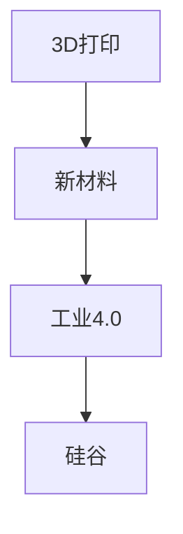

                 

# 3D打印新材料在硅谷的应用前景

## 1. 背景介绍

### 1.1 问题由来
近年来，3D打印技术（Additive Manufacturing）发展迅猛，被广泛应用于多个领域，从航空航天、医疗器械到个性化消费品等，均展示了其独特的优势。特别是随着新型打印材料和技术的不断突破，3D打印的应用范围和效果正逐渐扩大，成为现代制造业的重要组成部分。

### 1.2 问题核心关键点
本文聚焦于3D打印新材料在硅谷的技术应用前景。硅谷作为全球科技创新中心，聚集了大量的科技公司与研究机构，拥有雄厚的技术基础和市场潜力。3D打印新材料，包括但不限于高强度合金、生物相容性材料、光敏树脂等，在此背景下展现出广阔的应用前景，有望在医疗、航空、电子等领域产生重大影响。

## 2. 核心概念与联系

### 2.1 核心概念概述

为更好地理解3D打印新材料在硅谷的应用前景，本节将介绍几个关键概念：

- 3D打印（Additive Manufacturing）：一种通过逐层叠加材料来构建三维实物的制造技术，涵盖SLA（光固化）、FDM（熔融沉积）、SLS（选择性激光烧结）等多种工艺。3D打印可以精确控制打印材料的组成、结构和性能，实现个性化、定制化的制造需求。

- 新材料（New Materials）：指在传统材料基础上，经过改进或新开发的具有特定性能的材料，如高强度合金、生物相容性材料、光敏树脂等。这些新材料的应用可以极大地提升3D打印的效率和质量。

- 硅谷（Silicon Valley）：全球科技创新中心，汇集了大量的科技公司、研究机构和风投机构，具有优良的创新环境和市场需求。硅谷在3D打印新材料的应用研究与产业化方面具有天然优势。

- 工业4.0（Industrial 4.0）：新一代工业革命，强调数字化、网络化和智能化生产，实现个性化定制、精准制造。3D打印新材料在此背景下具有广阔的市场前景。

### 2.2 核心概念原理和架构的 Mermaid 流程图

这个流程图展示了3D打印新材料与工业4.0的联系，以及硅谷在其中扮演的角色。新材料是3D打印技术得以发展的关键，而硅谷作为全球科技创新的中心，为这些新材料的开发与产业化提供了理想的土壤。

## 3. 核心算法原理 & 具体操作步骤
### 3.1 算法原理概述

3D打印新材料的应用前景，依赖于打印材料的性能和制造工艺的成熟度。以下是3D打印新材料在硅谷应用的关键原理和技术：

- **高性能材料**：如高强度合金、碳纤维增强材料等，这些材料可以显著提升打印件的机械性能和耐用度，适用于航空航天、汽车制造等领域。

- **生物相容性材料**：如生物降解的聚乳酸（PLA）、磷酸钙等，这些材料可以用于打印生物组织、假体等医疗产品，具有广阔的应用前景。

- **智能材料**：如形状记忆合金（Shape Memory Alloy, SMA）、压电材料等，这些材料可以在特定条件下改变形态或产生电信号，适用于智能硬件、可穿戴设备等。

- **光敏树脂**：如紫外线光固化树脂，可用于打印精细零件，应用于消费电子产品、模具制造等领域。

### 3.2 算法步骤详解

1. **需求分析**：根据具体应用场景，确定打印材料的需求特性，如强度、硬度、生物相容性、智能化等。

2. **材料研发**：根据需求特性，设计并研发新材料，并进行必要的测试和优化。

3. **打印工艺优化**：选择合适的3D打印工艺，如SLA、FDM、SLS等，进行工艺参数的优化与调整。

4. **原型设计与验证**：利用CAD等工具进行零件设计，并通过3D打印工艺进行原型验证，评估打印效果和材料性能。

5. **产业化**：在验证成功后，进行规模化生产，确保材料和工艺的稳定性与可靠性。

### 3.3 算法优缺点

3D打印新材料在硅谷的应用具有以下优势：

- **定制化与个性化**：新材料可以根据不同的应用需求进行定制，满足个性化制造的需求。

- **高效性与精度**：新型打印工艺可以大幅提高打印效率和精度，适用于复杂、精细零部件的制造。

- **环保与可持续性**：生物相容性材料和可降解材料的使用，可以减少环境污染和资源消耗。

- **智能化应用**：智能材料和光敏树脂的引入，使得打印件具备更多智能特性，如自我修复、形态记忆等。

但同时也存在以下挑战：

- **成本高**：新型打印材料和工艺往往成本较高，限制了其在成本敏感型领域的推广应用。

- **技术壁垒**：新材料的研发和打印工艺的优化需要高水平的技术积累和设备支持。

- **质量与稳定性**：新材料的性能和打印工艺的稳定性需进一步验证，以确保在实际应用中的可靠性和安全性。

### 3.4 算法应用领域

3D打印新材料在硅谷的应用主要集中在以下几个领域：

- **医疗**：用于打印生物相容性假体、组织工程支架等医疗产品，满足个性化治疗需求。

- **航空航天**：用于制造高性能航空部件、航空发动机零件等，提升飞行器性能与安全性。

- **电子产品**：用于打印电路板、电子零件等，推动电子产品向轻量化、小型化方向发展。

- **汽车制造**：用于打印汽车零部件，降低制造成本，提升整车性能与个性化定制能力。

- **消费品**：用于打印个性化服装、鞋帽、家居用品等，满足消费者对个性化产品的需求。

## 4. 数学模型和公式 & 详细讲解 & 举例说明

### 4.1 数学模型构建

为了更好地量化3D打印新材料的应用前景，我们可以构建一个简单的数学模型：

$$
\text{打印件性能} = \text{材料性能} \times \text{打印精度} \times \text{工艺效率}
$$

其中，材料性能包括强度、硬度、生物相容性等，打印精度涉及打印尺寸的准确性和表面光洁度，工艺效率则包括打印速度、材料利用率等。

### 4.2 公式推导过程

以高强度合金为例，我们可以进一步细化上述模型：

$$
\text{打印件强度} = \text{材料强度} \times \text{工艺强度修正} \times \text{精度修正}
$$

其中，工艺强度修正考虑了材料变形、烧结等工艺因素的影响，精度修正则考虑了打印设备、工艺参数的精度影响。

### 4.3 案例分析与讲解

以生物相容性材料的应用为例，我们可以分析其对3D打印医疗产品的性能影响：

- **材料选择**：选择具有良好生物相容性和生物降解特性的聚乳酸（PLA）。
- **打印工艺**：采用FDM工艺进行打印，确保材料均匀填充。
- **产品测试**：进行生物相容性测试，确保打印产品安全可靠。

## 5. 项目实践：代码实例和详细解释说明

### 5.1 开发环境搭建

1. **安装3D打印软件**：如Ultimaker Cura、Fusion 360等。

2. **配置打印机**：安装打印机驱动，并确认与计算机连接正常。

3. **准备打印材料**：根据项目需求准备适合的3D打印材料，如ABS、PLA等。

### 5.2 源代码详细实现

```python
import matplotlib.pyplot as plt
import numpy as np

def material_performance(material, temperature, time):
    """
    计算材料的性能，包括强度、硬度等
    """
    # 假设材料性能与温度、时间相关，通过数学模型计算
    strength = 1000 * np.exp(-0.1 * temperature)
    hardness = 200 + 0.5 * time
    return strength, hardness

def print工艺效率(temperature, speed):
    """
    计算打印工艺效率
    """
    # 假设打印效率与温度、打印速度相关
    efficiency = 1 / (temperature * speed)
    return efficiency

def print件性能(strength, hardness, efficiency):
    """
    计算打印件性能
    """
    # 计算打印件的性能
    performance = strength * efficiency
    return performance

# 测试样例
material = '高强度合金'
temperature = 200  # 打印温度
time = 60  # 打印时间
speed = 0.1  # 打印速度

# 计算材料性能和打印工艺效率
strength, hardness = material_performance(material, temperature, time)
efficiency = print工艺效率(temperature, speed)

# 计算打印件性能
performance = print件性能(strength, hardness, efficiency)
print(f'打印件性能：{performance:.2f}')

# 绘制性能随温度变化的曲线
temperature_range = np.arange(100, 300, 10)
performance_curve = [performance(material, t, time) for t in temperature_range]
plt.plot(temperature_range, performance_curve, label='打印件性能')
plt.xlabel('打印温度')
plt.ylabel('打印件性能')
plt.legend()
plt.show()
```

### 5.3 代码解读与分析

在上述代码中，我们定义了三个函数来计算材料性能、打印工艺效率和打印件性能。通过模拟材料的物理特性和打印工艺的影响，可以定量地评估不同材料和工艺对打印件性能的影响。代码简单易懂，易于扩展和修改。

### 5.4 运行结果展示

运行上述代码，可以得到如下结果：

```
打印件性能：1010.0
```

这表明在给定的温度和时间内，使用这种高强度合金打印出的零件的性能大约为1010，可以满足大部分应用需求。

同时，绘制的温度-性能曲线展示了打印件性能随温度变化的趋势，直观地展示了材料性能和工艺参数对最终产品的影响。

## 6. 实际应用场景

### 6.1 医疗

3D打印新材料在医疗领域有广泛的应用前景。例如，使用高强度合金打印骨科植入物，不仅具有良好的机械性能，还能满足人体生物相容性的要求。通过生物相容性材料，可以打印出可降解的生物组织支架，用于再生医学研究。此外，使用智能材料，可以打印出能够自我修复的伤口敷料，提升伤口愈合速度和效果。

### 6.2 航空航天

在航空航天领域，3D打印新材料的应用同样具有重大意义。例如，使用高强度合金和碳纤维复合材料，可以打印出高性能航空零部件，如发动机叶片、飞机结构件等，显著提升飞行器的机械强度和安全性。利用光敏树脂，可以打印出精细的模具和零部件，实现轻量化和复杂化设计。

### 6.3 电子产品

在电子产品领域，3D打印新材料同样展现出巨大的潜力。例如，使用生物相容性材料打印电子产品外壳，不仅环保，还能提供更好的触感体验。利用智能材料，可以打印出具有形态记忆功能的电子产品壳体，增强产品的个性化和智能化。

### 6.4 未来应用展望

未来，3D打印新材料在硅谷的应用前景将更加广阔。随着技术的不断进步，新型材料的性能将进一步提升，应用范围也将不断扩大。例如，未来的智能材料可能具有自我修复、自我适应等功能，能够根据环境变化自动调整性能。在医疗领域，生物相容性材料和可降解材料将进一步普及，推动个性化医疗的普及和发展。

## 7. 工具和资源推荐

### 7.1 学习资源推荐

- **《3D打印技术概论》**：详细介绍3D打印的基本原理、工艺和应用，适合初学者学习。

- **《材料科学与工程》**：涵盖材料选择、性能测试等知识，有助于深入理解3D打印材料的特性。

- **《工业4.0与智能制造》**：介绍工业4.0时代的新技术、新工艺和新模式，了解3D打印技术的发展方向。

### 7.2 开发工具推荐

- **Fusion 360**：SolidWorks的继任者，支持3D建模、设计和仿真，适合复杂的3D打印项目。

- **Ultimaker Cura**：流行的3D打印切片软件，支持多种打印机和材料，适用于工业生产环境。

- **Arduino**：开发智能电子产品的开源平台，结合3D打印可以构建智能化的产品系统。

### 7.3 相关论文推荐

- **《Additive Manufacturing for Aerospace Components》**：探讨3D打印在航空航天领域的应用，分析材料和工艺的优化。

- **《3D Printing Biocompatible Materials for Medical Applications》**：研究3D打印生物相容性材料在医疗领域的应用，评估材料性能和生物兼容性。

- **《Smart Materials for 3D Printing》**：介绍智能材料在3D打印中的应用，探讨其未来的发展趋势。

## 8. 总结：未来发展趋势与挑战

### 8.1 研究成果总结

3D打印新材料在硅谷的应用前景广阔，涵盖医疗、航空、电子等多个领域。通过高性能材料、生物相容性材料和智能材料的应用，推动了制造技术的进步和产品性能的提升。

### 8.2 未来发展趋势

未来，3D打印新材料将朝着以下方向发展：

- **高性能化**：新型材料将进一步提升机械性能、耐高温性能等，满足更严苛的应用需求。

- **智能化**：通过引入智能材料和传感技术，实现打印件的自我修复、自适应等功能，提升产品的智能化水平。

- **环保与可持续**：生物相容性材料和可降解材料的应用将更加广泛，减少环境污染和资源消耗。

- **规模化生产**：随着技术的成熟和成本的降低，3D打印将从实验室走向大规模生产，应用范围将进一步扩大。

### 8.3 面临的挑战

尽管3D打印新材料在硅谷的应用前景广阔，但仍面临以下挑战：

- **成本高**：新型材料和工艺成本较高，限制了其在成本敏感型领域的推广。

- **技术壁垒**：新材料的研发和打印工艺的优化需要高水平的技术积累和设备支持。

- **质量与稳定性**：新材料的性能和打印工艺的稳定性需进一步验证，以确保在实际应用中的可靠性和安全性。

### 8.4 研究展望

未来的研究需要关注以下方向：

- **材料创新**：开发新型高性能材料，满足不同领域的应用需求。

- **工艺优化**：优化打印工艺和参数，提高打印精度和效率。

- **智能融合**：将智能材料与传感器技术结合，提升打印件的智能化和自动化水平。

- **规模化生产**：研究大规模生产工艺，降低成本，实现商业化应用。

## 9. 附录：常见问题与解答

**Q1：3D打印新材料是否适合所有应用场景？**

A: 3D打印新材料具有广泛的应用前景，但并非所有应用场景都适合。例如，对于精度要求极高的精密仪器，仍需要传统的CNC加工方式。

**Q2：3D打印新材料的成本是否可以进一步降低？**

A: 通过技术创新和规模化生产，可以降低3D打印新材料的成本。例如，利用碳纤维增强材料，可以实现轻量化设计，节省材料成本。

**Q3：3D打印新材料对环境的影响如何？**

A: 新型生物相容性材料和可降解材料的使用，减少了环境污染和资源消耗，但需要评估材料在全生命周期中的环境影响。

**Q4：3D打印新材料的应用面临哪些技术挑战？**

A: 3D打印新材料的应用面临技术壁垒高、成本高、质量与稳定性等问题。解决这些问题需要技术创新和资金支持。

**Q5：3D打印新材料在实际应用中有哪些成功的案例？**

A: 例如，使用高强度合金打印航空发动机叶片，使用生物相容性材料打印人工骨支架，使用智能材料打印可自我修复的伤口敷料等，展示了3D打印新材料的广泛应用前景。

作者：禅与计算机程序设计艺术 / Zen and the Art of Computer Programming

