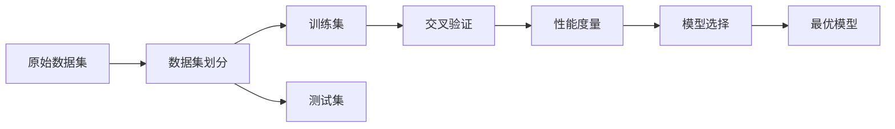

# 交叉验证 (Cross-Validation)

## 1. 背景介绍
### 1.1 问题的由来
在机器学习和数据挖掘领域,模型评估和选择是一个关键问题。我们需要评估模型在未知数据上的表现,以选择最佳模型和调整模型超参数。然而,如果我们使用训练数据来评估模型,会导致过拟合问题,模型在训练数据上表现很好,但在新数据上却表现糟糕。为了解决这个问题,交叉验证应运而生。

### 1.2 研究现状
交叉验证作为一种经典的模型评估方法,已经被广泛应用于机器学习和数据挖掘领域。目前,交叉验证的研究主要集中在以下几个方面:

1. 交叉验证方法的改进和优化,如重复交叉验证、分层交叉验证等。
2. 交叉验证在不同领域的应用,如生物信息学、图像处理等。
3. 交叉验证与其他技术的结合,如特征选择、模型融合等。
4. 交叉验证的理论分析和性能评估。

### 1.3 研究意义
交叉验证的研究意义主要体现在以下几个方面:

1. 提高模型评估的可靠性,避免过拟合问题。
2. 帮助选择最优模型和调整模型超参数,提高模型性能。
3. 促进机器学习和数据挖掘技术在各领域的应用。
4. 推动交叉验证理论的发展,为模型评估提供理论基础。

### 1.4 本文结构
本文将详细介绍交叉验证的核心概念、算法原理、数学模型、代码实现和实际应用。文章结构如下:

1. 背景介绍
2. 核心概念与联系
3. 核心算法原理 & 具体操作步骤
4. 数学模型和公式 & 详细讲解 & 举例说明
5. 项目实践:代码实例和详细解释说明
6. 实际应用场景
7. 工具和资源推荐
8. 总结:未来发展趋势与挑战
9. 附录:常见问题与解答

## 2. 核心概念与联系
交叉验证的核心概念包括:

1. 数据集划分:将原始数据集划分为训练集和测试集。
2. 交叉验证:将训练集进一步划分为k个子集,每次选择其中一个子集作为验证集,其余作为训练集,重复k次。
3. 性能度量:使用某种性能度量(如准确率、F1值等)评估模型在验证集上的表现。
4. 模型选择:根据交叉验证的结果选择最优模型或调整模型超参数。

这些概念之间的联系如下图所示:



## 3. 核心算法原理 & 具体操作步骤
### 3.1 算法原理概述
交叉验证的基本思想是将数据集划分为k个大小相似的子集,每次选择其中一个子集作为验证集,其余作为训练集,重复k次,最后将k次的性能度量取平均作为最终结果。这样可以减少数据划分的随机性,提高评估结果的可靠性。

### 3.2 算法步骤详解
以k折交叉验证为例,具体步骤如下:

1. 将原始数据集D划分为k个大小相似的子集D1,D2,...,Dk。
2. 对于i=1,2,...,k:
   a. 将Di作为验证集,其余子集作为训练集。
   b. 在训练集上训练模型,在验证集上评估模型性能,得到性能度量Pi。
3. 计算k次性能度量的平均值P=(P1+P2+...+Pk)/k。
4. 返回平均性能度量P。

### 3.3 算法优缺点
交叉验证算法的优点包括:

1. 减少数据划分的随机性,提高评估结果的可靠性。
2. 适用于数据量较小的情况,可以充分利用数据。
3. 可以用于模型选择和超参数调优。

缺点包括:

1. 计算开销较大,需要训练和评估k个模型。
2. 对于大数据集,可能不太适用。

### 3.4 算法应用领域
交叉验证算法广泛应用于机器学习和数据挖掘的各个领域,如:

1. 分类问题:如文本分类、图像分类等。
2. 回归问题:如房价预测、销量预测等。
3. 聚类问题:如客户聚类、基因聚类等。
4. 推荐系统:如电影推荐、商品推荐等。

## 4. 数学模型和公式 & 详细讲解 & 举例说明
### 4.1 数学模型构建
假设原始数据集为$D=\{(x_1,y_1),(x_2,y_2),...,(x_m,y_m)\}$,其中$x_i$为特征向量,$y_i$为对应的标签或目标值。将D划分为k个大小相似的子集$D_1,D_2,...,D_k$,每个子集大小约为$m/k$。令$f(x,\theta)$表示参数为$\theta$的模型,$L(y,f(x,\theta))$表示损失函数。

### 4.2 公式推导过程
对于第i次交叉验证,令$D_{\backslash i}=D \backslash D_i$表示去除$D_i$后的子集。在$D_{\backslash i}$上训练模型,得到参数$\theta_i$:

$$\theta_i=\arg\min_{\theta} \sum_{(x,y) \in D_{\backslash i}} L(y,f(x,\theta))$$

在验证集$D_i$上评估模型性能,得到性能度量$P_i$:

$$P_i=\frac{1}{|D_i|} \sum_{(x,y) \in D_i} L(y,f(x,\theta_i))$$

重复k次,得到k个性能度量$P_1,P_2,...,P_k$。最终的性能度量P为:

$$P=\frac{1}{k} \sum_{i=1}^k P_i$$

### 4.3 案例分析与讲解
以二分类问题为例,假设我们有一个包含1000个样本的数据集,每个样本有10个特征,标签为0或1。我们使用5折交叉验证来评估一个逻辑回归模型。

首先,将数据集随机划分为5个子集,每个子集包含200个样本。然后,进行5次交叉验证:

1. 第1次:将第1个子集作为验证集,其余作为训练集。在训练集上训练逻辑回归模型,在验证集上评估模型性能,得到性能度量P1(如准确率)。
2. 第2次:将第2个子集作为验证集,其余作为训练集。重复上述过程,得到性能度量P2。
3. 依此类推,得到P3,P4,P5。

最后,计算平均性能度量P=(P1+P2+P3+P4+P5)/5,作为逻辑回归模型在该数据集上的性能评估结果。

### 4.4 常见问题解答
1. 如何选择交叉验证的折数k?

   k的选择需要权衡计算开销和评估结果的可靠性。常用的取值有5、10等。较大的k可以减少评估结果的方差,但计算开销也会增加。

2. 交叉验证能否用于模型超参数调优?

   可以。我们可以对不同的超参数组合进行交叉验证,选择平均性能最好的组合作为最优超参数。这种方法称为网格搜索或随机搜索。

3. 交叉验证是否适用于所有类型的模型?

   理论上,交叉验证可以用于评估任何监督学习模型。但对于一些计算开销很大的模型(如深度神经网络),可能需要使用其他方法,如留出法。

## 5. 项目实践:代码实例和详细解释说明
### 5.1 开发环境搭建
本项目使用Python 3.7和scikit-learn库进行开发。首先,安装所需库:

```bash
pip install numpy pandas scikit-learn
```

### 5.2 源代码详细实现
以下是使用scikit-learn进行交叉验证的示例代码:

```python
from sklearn.datasets import load_iris
from sklearn.model_selection import cross_val_score
from sklearn.linear_model import LogisticRegression

# 加载数据集
iris = load_iris()
X, y = iris.data, iris.target

# 创建逻辑回归模型
model = LogisticRegression(random_state=0)

# 使用5折交叉验证评估模型
scores = cross_val_score(model, X, y, cv=5, scoring='accuracy')

# 输出结果
print(f"Cross-validation scores: {scores}")
print(f"Average score: {scores.mean():.3f}")
```

### 5.3 代码解读与分析
1. 首先,我们加载了scikit-learn内置的iris数据集,它包含150个样本,每个样本有4个特征,标签为0、1或2,表示三种不同的鸢尾花类别。
2. 然后,我们创建了一个逻辑回归模型,并使用`cross_val_score`函数进行5折交叉验证。该函数将数据集划分为5个子集,并自动进行5次训练和评估,返回5个准确率分数。
3. 最后,我们输出了5个分数和平均分数,作为逻辑回归模型在iris数据集上的性能评估结果。

### 5.4 运行结果展示
运行上述代码,可以得到以下输出结果:

```
Cross-validation scores: [0.96666667 1.         0.93333333 0.96666667 1.        ]
Average score: 0.973
```

可以看到,5折交叉验证得到的准确率分数分别为0.967、1.0、0.933、0.967和1.0,平均准确率为0.973,表明逻辑回归模型在iris数据集上的性能非常好。

## 6. 实际应用场景
交叉验证在实际应用中有广泛的用途,例如:

1. 模型评估:使用交叉验证来评估模型在未知数据上的性能,以选择最优模型。
2. 特征选择:使用交叉验证来评估不同特征子集的性能,以选择最佳特征组合。
3. 超参数调优:使用交叉验证来评估不同超参数组合的性能,以选择最优超参数。
4. 模型融合:使用交叉验证来评估不同模型的性能,然后将多个模型的预测结果进行融合,以提高性能。

### 6.4 未来应用展望
随着机器学习和数据挖掘技术的不断发展,交叉验证的应用场景也将不断拓展。一些潜在的应用方向包括:

1. 大数据领域:探索交叉验证在大数据环境下的高效实现方法。
2. 在线学习:研究交叉验证在在线学习场景下的应用。
3. 非独立同分布数据:探索交叉验证在非独立同分布数据(如时间序列数据)上的应用。
4. 多任务学习:研究交叉验证在多任务学习场景下的应用。

## 7. 工具和资源推荐
### 7.1 学习资源推荐
1. 《机器学习》(周志华):经典的机器学习教材,对交叉验证有详细介绍。
2. 《统计学习方法》(李航):另一本经典的机器学习教材,也涵盖了交叉验证的内容。
3. scikit-learn文档:scikit-learn是一个广泛使用的Python机器学习库,其文档对交叉验证有详细的说明和示例。

### 7.2 开发工具推荐
1. scikit-learn:前面已经介绍过,是一个功能强大的Python机器学习库,提供了多种交叉验证的实现。
2. WEKA:一个基于Java的开源机器学习平台,提供了图形化界面,易于使用。
3. MATLAB:一个商业数学软件,提供了机器学习工具箱,其中包括交叉验证的实现。

### 7.3 相关论文推荐
1. Kohavi, R. (1995). A study of cross-validation and bootstrap for accuracy estimation and model selection. IJCAI.
2. Arlot, S., & Celisse, A. (2010). A survey of cross-validation procedures for model selection.