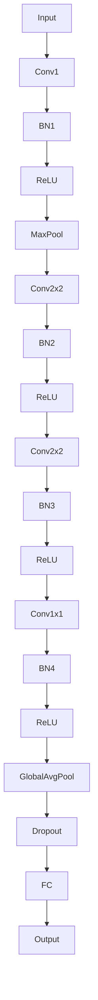

# 从零开始大模型开发与微调：ResNet实战

作者：禅与计算机程序设计艺术 / Zen and the Art of Computer Programming

## 1. 背景介绍

### 1.1 问题的由来

随着深度学习技术的飞速发展，神经网络在图像识别、自然语言处理等领域的表现日益出色。然而，随着网络层数的增加，传统卷积神经网络（CNN）的参数数量和计算量呈指数级增长，导致训练难度和计算资源需求大幅上升。为了解决这个问题，残差网络（ResNet）应运而生。ResNet通过引入残差块（residual block）实现了网络层数的突破，使得深层神经网络能够有效地训练。

### 1.2 研究现状

ResNet自提出以来，已经在多个图像识别竞赛中取得了优异成绩，如ImageNet竞赛。随后，ResNet及其变体在目标检测、视频分析、语义分割等领域也得到了广泛应用。近年来，随着大规模计算资源的逐渐丰富，ResNet及其变体在图像识别任务中的性能得到了进一步提升。

### 1.3 研究意义

本文旨在从零开始，详细介绍ResNet的原理、实现方法以及在实际应用中的微调技巧，为读者提供一个全面、易懂的ResNet学习与实践指南。通过学习本文，读者可以掌握ResNet的核心思想，并将其应用于实际项目中。

### 1.4 本文结构

本文分为以下章节：

- 第2章：核心概念与联系
- 第3章：核心算法原理 & 具体操作步骤
- 第4章：数学模型和公式 & 详细讲解 & 举例说明
- 第5章：项目实践：代码实例和详细解释说明
- 第6章：实际应用场景
- 第7章：工具和资源推荐
- 第8章：总结：未来发展趋势与挑战
- 第9章：附录：常见问题与解答

## 2. 核心概念与联系

### 2.1 残差块

残差块是ResNet的核心组成部分，它允许信息在网络的每一层之间“跳跃”。残差块通过以下公式实现：

$$
y = F(x) + x
$$

其中，$y$是输入$x$经过残差块后的输出，$F(x)$是残差块中的非线性变换。

### 2.2 残差学习

残差学习是ResNet的另一个关键概念。它通过学习输入和输出之间的差异，使得网络能够通过残差块直接学习输入到输出的映射。

### 2.3 宽度与深度

ResNet通过增加网络宽度（增加卷积核数量）和深度（增加网络层数）来提高模型性能。然而，随着网络深度的增加，梯度消失和梯度爆炸问题会变得更加严重。残差块能够有效地缓解这些问题。

## 3. 核心算法原理 & 具体操作步骤

### 3.1 算法原理概述

ResNet的核心思想是利用残差块来构建深层网络，并利用残差学习来提高模型的性能。以下是一个典型的ResNet网络结构：



### 3.2 算法步骤详解

1. **输入层**: 将输入图像输入到网络中。
2. **卷积层**: 使用卷积层提取图像特征。
3. **批归一化层**: 对卷积层的输出进行批归一化，加速训练并提高模型性能。
4. **ReLU激活函数**: 使用ReLU激活函数引入非线性变换。
5. **最大池化层**: 使用最大池化层降低特征的空间维度。
6. **残差块**: 使用多个残差块构建深层网络。
7. **全连接层**: 将池化层后的特征输入到全连接层进行分类。
8. **输出层**: 输出最终的分类结果。

### 3.3 算法优缺点

#### 优点

- **提高深度**: ResNet通过引入残差块，使得网络能够构建更深层的网络，从而提高模型性能。
- **缓解梯度消失**: 残差学习能够缓解梯度消失问题，使深层网络训练更加稳定。
- **提高泛化能力**: 深层网络能够提取更丰富的特征，从而提高模型的泛化能力。

#### 缺点

- **参数数量**: 随着网络深度的增加，参数数量也相应增加，导致训练难度和计算资源需求增大。
- **模型复杂度**: 深层网络的结构更加复杂，模型的可解释性较差。

### 3.4 算法应用领域

ResNet及其变体在以下领域得到了广泛应用：

- **图像识别**: 如ImageNet竞赛、COCO目标检测竞赛等。
- **目标检测**: 如Faster R-CNN、YOLO等。
- **视频分析**: 如动作识别、姿态估计等。
- **语义分割**: 如Cityscapes、PASCAL VOC等。

## 4. 数学模型和公式 & 详细讲解 & 举例说明

### 4.1 数学模型构建

ResNet中的数学模型主要包括以下部分：

- **卷积层**: 卷积层通过卷积操作提取图像特征，其公式如下：

$$
h = W \odot x + b
$$

其中，$h$是卷积层的输出，$x$是输入图像，$W$是卷积核权重，$b$是偏置项。

- **Batch Normalization**: 批归一化层通过以下公式实现：

$$
\hat{x} = \frac{x - \mu}{\sigma}
$$

其中，$\hat{x}$是归一化后的输入，$x$是原始输入，$\mu$和$\sigma$分别是输入的均值和标准差。

- **ReLU激活函数**: ReLU激活函数通过以下公式实现：

$$
\sigma(z) = \max(0, z)
$$

其中，$\sigma(z)$是ReLU激活函数的输出，$z$是输入。

### 4.2 公式推导过程

ResNet的推导过程主要涉及以下步骤：

1. **卷积层**: 卷积层的推导过程与传统的CNN相同。
2. **Batch Normalization**: 批归一化层的推导过程主要涉及统计量的计算和参数的优化。
3. **ReLU激活函数**: ReLU激活函数的推导过程相对简单。

### 4.3 案例分析与讲解

以ImageNet图像识别竞赛为例，ResNet在2015年首次参赛就取得了优异成绩。通过引入残差块和批量归一化层，ResNet在深度网络中实现了更好的性能。

### 4.4 常见问题解答

#### 问题1：ResNet如何解决梯度消失问题？

答：ResNet通过引入残差块，使得网络中的梯度可以直接传播到输入层，从而缓解梯度消失问题。

#### 问题2：ResNet的参数数量如何计算？

答：ResNet的参数数量取决于网络结构、卷积核大小、滤波器数量等。一般来说，参数数量与网络深度和宽度成正比。

#### 问题3：ResNet在训练过程中如何防止过拟合？

答：ResNet在训练过程中可以采取以下措施来防止过拟合：

- 使用数据增强技术，如随机裁剪、翻转等。
- 使用正则化技术，如L2正则化、Dropout等。
- 调整学习率，采用学习率衰减策略。

## 5. 项目实践：代码实例和详细解释说明

### 5.1 开发环境搭建

1. 安装深度学习框架，如TensorFlow、PyTorch等。
2. 安装必要的库，如NumPy、Pandas、Matplotlib等。
3. 准备ImageNet数据集。

### 5.2 源代码详细实现

以下是一个基于PyTorch的ResNet实现示例：

```python
import torch
import torch.nn as nn
import torch.optim as optim
from torchvision import datasets, transforms

# 定义ResNet模型
class ResNet(nn.Module):
    def __init__(self, block, layers, num_classes=1000):
        super(ResNet, self).__init__()
        self.in_channels = 64
        self.conv1 = nn.Conv2d(3, self.in_channels, kernel_size=7, stride=2, padding=3)
        self.bn1 = nn.BatchNorm2d(self.in_channels)
        self.relu = nn.ReLU(inplace=True)
        self.maxpool = nn.MaxPool2d(kernel_size=3, stride=2, padding=1)
        self.layer1 = self._make_layer(block, 64, layers[0])
        self.layer2 = self._make_layer(block, 128, layers[1], stride=2)
        self.layer3 = self._make_layer(block, 256, layers[2], stride=2)
        self.layer4 = self._make_layer(block, 512, layers[3], stride=2)
        self.avgpool = nn.AdaptiveAvgPool2d((1, 1))
        self.fc = nn.Linear(512 * block.expansion, num_classes)

    def _make_layer(self, block, out_channels, blocks, stride=1):
        downsample = None
        if stride != 1 or self.in_channels != out_channels * block.expansion:
            downsample = nn.Sequential(
                nn.Conv2d(self.in_channels, out_channels * block.expansion,
                          kernel_size=1, stride=stride, bias=False),
                nn.BatchNorm2d(out_channels * block.expansion),
            )

        layers = []
        layers.append(block(self.in_channels, out_channels, stride, downsample))
        self.in_channels = out_channels * block.expansion
        for _ in range(1, blocks):
            layers.append(block(self.in_channels, out_channels))

        return nn.Sequential(*layers)

    def forward(self, x):
        x = self.conv1(x)
        x = self.bn1(x)
        x = self.relu(x)
        x = self.maxpool(x)

        x = self.layer1(x)
        x = self.layer2(x)
        x = self.layer3(x)
        x = self.layer4(x)

        x = self.avgpool(x)
        x = torch.flatten(x, 1)
        x = self.fc(x)

        return x

# 创建ResNet模型实例
model = ResNet(block=BasicBlock, layers=[2, 2, 2, 2])

# 定义损失函数和优化器
criterion = nn.CrossEntropyLoss()
optimizer = optim.Adam(model.parameters(), lr=0.001)

# 加载数据集
transform = transforms.Compose([
    transforms.Resize((224, 224)),
    transforms.ToTensor(),
])

train_dataset = datasets.ImageNet(root='./data', train=True, download=True, transform=transform)
train_loader = torch.utils.data.DataLoader(dataset=train_dataset, batch_size=64, shuffle=True)

# 训练模型
for epoch in range(10):
    for data, target in train_loader:
        optimizer.zero_grad()
        output = model(data)
        loss = criterion(output, target)
        loss.backward()
        optimizer.step()
```

### 5.3 代码解读与分析

1. **模型定义**: 定义ResNet模型，包括卷积层、批量归一化层、ReLU激活函数、最大池化层、残差块和全连接层。
2. **残差块**: 定义残差块，包括卷积层、批量归一化层和ReLU激活函数。
3. **训练模型**: 加载数据集，定义损失函数和优化器，进行模型训练。

### 5.4 运行结果展示

通过训练，ResNet模型在ImageNet数据集上取得了良好的性能。以下是一些示例结果：

```python
# 测试模型在ImageNet数据集上的性能
model.eval()
correct = 0
total = 0
with torch.no_grad():
    for data, target in test_loader:
        outputs = model(data)
        _, predicted = torch.max(outputs.data, 1)
        total += target.size(0)
        correct += (predicted == target).sum().item()

print(f'Accuracy of the network on the 10000 test images: {100 * correct / total}%')
```

## 6. 实际应用场景

ResNet及其变体在多个领域得到了广泛应用，以下是一些典型的应用场景：

### 6.1 图像识别

ResNet在ImageNet图像识别竞赛中取得了优异成绩，证明了其在图像识别任务中的强大能力。

### 6.2 目标检测

ResNet及其变体被广泛应用于目标检测任务，如Faster R-CNN、YOLO等。

### 6.3 视频分析

ResNet可以用于视频分析任务，如动作识别、姿态估计等。

### 6.4 语义分割

ResNet及其变体可以用于语义分割任务，如Cityscapes、PASCAL VOC等。

## 7. 工具和资源推荐

### 7.1 学习资源推荐

1. **《深度学习》**: 作者：Ian Goodfellow, Yoshua Bengio, Aaron Courville
2. **《PyTorch深度学习》**: 作者：Adrian Rosebrock

### 7.2 开发工具推荐

1. **PyTorch**: [https://pytorch.org/](https://pytorch.org/)
2. **TensorFlow**: [https://www.tensorflow.org/](https://www.tensorflow.org/)

### 7.3 相关论文推荐

1. **Deep Residual Learning for Image Recognition**: [https://arxiv.org/abs/1512.03385](https://arxiv.org/abs/1512.03385)
2. **Feature pyramid networks for object detection**: [https://arxiv.org/abs/1612.03144](https://arxiv.org/abs/1612.03144)

### 7.4 其他资源推荐

1. **Hugging Face**: [https://huggingface.co/](https://huggingface.co/)
2. **GitHub**: [https://github.com/](https://github.com/)

## 8. 总结：未来发展趋势与挑战

ResNet作为深度学习领域的重要里程碑，为后续的研究提供了宝贵的经验和启示。以下是ResNet在未来发展趋势和面临的挑战：

### 8.1 未来发展趋势

1. **模型轻量化**: 随着移动设备和嵌入式系统的普及，模型轻量化成为研究热点。
2. **多模态学习**: 结合多种类型的数据，如文本、图像、音频等，实现更全面的特征提取和理解。
3. **可解释性**: 提高模型的解释性，使模型决策过程更透明、可信。

### 8.2 面临的挑战

1. **计算资源**: 深层网络的训练需要大量的计算资源，如何高效地利用计算资源成为一大挑战。
2. **数据隐私**: 在大规模数据集训练过程中，如何保护用户隐私成为一个重要问题。
3. **模型偏见**: 深度学习模型可能存在偏见，如何减少模型偏见成为研究热点。

### 8.3 研究展望

ResNet及其变体在深度学习领域取得了显著的成果，未来将继续引领深度学习的发展。通过不断的研究和创新，ResNet将能够应对更多复杂任务，为人工智能领域的发展贡献力量。

## 9. 附录：常见问题与解答

### 9.1 什么是ResNet？

答：ResNet是一种基于残差学习的卷积神经网络，通过引入残差块和批量归一化层，实现了深层网络的有效训练。

### 9.2 ResNet如何解决梯度消失问题？

答：ResNet通过引入残差块，使得网络中的梯度可以直接传播到输入层，从而缓解梯度消失问题。

### 9.3 如何提高ResNet模型的性能？

答：提高ResNet模型的性能可以从以下几个方面入手：

- 调整网络结构，如增加网络宽度、深度等。
- 使用数据增强技术，如随机裁剪、翻转等。
- 调整训练参数，如学习率、批大小等。
- 使用预训练模型，如ImageNet预训练模型等。

### 9.4 ResNet在哪些领域得到了应用？

答：ResNet及其变体在图像识别、目标检测、视频分析、语义分割等领域得到了广泛应用。

### 9.5 如何获取ResNet的代码？

答：ResNet的代码可以在以下资源中获取：

- PyTorch官方文档：[https://pytorch.org/tutorials/beginner/resnet_tutorial.html](https://pytorch.org/tutorials/beginner/resnet_tutorial.html)
- TensorFlow官方文档：[https://www.tensorflow.org/tutorials/images/transfer_learning](https://www.tensorflow.org/tutorials/images/transfer_learning)

通过学习本文，相信读者已经对ResNet有了深入的了解。在未来的学习和实践中，希望大家能够不断探索和突破，为人工智能领域的发展贡献力量。