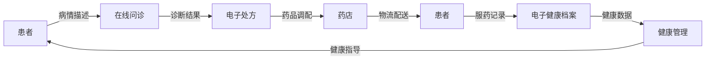

# 创业型互联网医疗平台搭建方案

关键词：互联网医疗、创业、平台搭建、技术架构、业务模式

## 1. 背景介绍
### 1.1 问题的由来
随着互联网技术的飞速发展和医疗行业的数字化转型,越来越多的创业者开始关注互联网医疗领域。传统的医疗服务模式已经无法满足人们日益增长的医疗保健需求,如何利用互联网技术打造一个高效、便捷、智能的医疗服务平台,成为了众多创业者思考的问题。
### 1.2 研究现状
目前,国内外已经涌现出一批优秀的互联网医疗平台,如美国的Teladoc、中国的平安好医生、微医等。这些平台通过整合线上线下医疗资源,为用户提供在线问诊、电子处方、健康管理等服务,极大地提升了医疗服务的可及性和便捷性。但是,仍有许多细分领域和创新方向有待进一步探索。
### 1.3 研究意义
深入研究互联网医疗平台的搭建方案,对于创业者快速构建自己的医疗服务平台具有重要意义。一方面,系统梳理互联网医疗平台的业务架构和技术架构,可以帮助创业者全面把握平台搭建的关键要素；另一方面,总结优秀互联网医疗平台的经验教训,有助于创业者少走弯路,提升产品竞争力。
### 1.4 本文结构
本文将从以下几个方面展开论述：
- 第2部分介绍互联网医疗平台的核心概念与内在联系
- 第3部分重点阐述平台搭建的核心算法原理和具体操作步骤
- 第4部分建立互联网医疗平台的数学模型,并结合案例进行详细讲解
- 第5部分给出平台搭建的代码实例,并进行详细的注释说明
- 第6部分分析互联网医疗平台的实际应用场景
- 第7部分推荐平台搭建过程中常用的工具和学习资源
- 第8部分总结全文,并展望互联网医疗的未来发展趋势和面临的挑战
- 第9部分列举互联网医疗平台搭建过程中的常见问题,并给出解答

## 2. 核心概念与联系
互联网医疗平台是一个多方参与的复杂系统,涉及患者、医生、医院、保险、药店等多个角色,以及在线问诊、处方开具、药品配送、健康管理等多个业务环节。平台的核心是打通线上线下资源,实现医疗服务的闭环。

其中,几个关键概念包括:
- 电子健康档案(EHR):记录患者的基本信息、病史、检查结果、用药情况等,是患者在平台上的数字分身。
- 医患匹配:通过大数据分析和智能算法,帮助患者快速找到合适的医生。
- 在线问诊:患者通过文字、图片、视频等方式,向医生描述病情,获得诊断意见。
- 电子处方:医生开具的药品处方以电子化形式存储,供药店调配。
- 物流配送:将药品从药店送达患者手中,实现"最后一公里"。
- 健康管理:根据患者的健康档案,提供个性化的健康指导和干预措施。

以上业务环节环环相扣,共同构成了互联网医疗服务的完整闭环,下图展示了各个环节之间的逻辑关系:

## 3. 核心算法原理 & 具体操作步骤
### 3.1 算法原理概述
互联网医疗平台的核心算法主要包括两大类:医患匹配算法和智能导诊算法。前者旨在帮助患者找到最合适的医生,后者则利用人工智能技术,根据患者的病情描述给出初步的诊断意见。
### 3.2 算法步骤详解
#### 3.2.1 医患匹配算法
1. 数据准备:收集医生的专业特长、服务评价、问诊量等结构化数据,以及患者的病情描述文本。
2. 特征工程:对医生和患者的原始数据进行清洗、字段提取、分词等预处理,得到结构化的特征向量。
3. 相似度计算:利用机器学习算法(如逻辑回归、树模型等)对医生特征和患者特征进行匹配度评估。
4. 排序展示:根据匹配度评分对医生进行排序,推荐给患者。

#### 3.2.2 智能导诊算法
1. 知识图谱构建:利用医学文献、临床指南、医生访谈等数据,构建全面的医疗知识图谱。
2. 自然语言理解:利用深度学习算法(如BERT、ERNIE等),对患者输入的病情描述进行语义理解。
3. 知识推理:根据患者的症状特征,利用知识图谱进行智能问答和推理,给出可能的疾病和治疗方案。
4. 可解释性:对推理得出的结果,给出明确的依据和解释,增强患者信任。

### 3.3 算法优缺点
医患匹配算法可以提升患者的就医效率,节省医生的时间成本,但对医生的多维特征建模有一定难度,需要不断迭代优化匹配模型。

智能导诊算法利用人工智能赋能医疗服务,但要注意避免"过度医疗"风险,导诊结果仅供参考,还需要医生把关。同时医疗知识图谱的构建需要消耗大量人力物力,对创业公司而言不太现实。

### 3.4 算法应用领域
医患匹配和智能导诊算法目前主要应用于互联网医院、智能医助等场景,通过提升患者问诊体验和分诊效率,改善医疗服务质量,推动医疗产业变革。未来随着技术进步,将向更多应用场景渗透。

## 4. 数学模型和公式 & 详细讲解 & 举例说明
### 4.1 数学模型构建
我们以医患匹配算法为例,利用协同过滤算法构建医患匹配模型。该算法分为以下几步:

1. 构建用户(患者)-物品(医生)评分矩阵 $R$。矩阵元素 $r_{ui}$ 表示患者 $u$ 对医生 $i$ 的评分,可以用患者的问诊行为(如是否问诊、问诊时长等)来表示。

2. 计算患者之间的相似度。常用的相似度计算方法有:
- 欧氏距离:
  $$
  d(u,v)=\sqrt{\sum_{i\in I}(r_{ui}-r_{vi})^2}
  $$
- 皮尔逊相关系数:
  $$
  w_{uv}=\frac{\sum_{i\in I}(r_{ui}-\bar{r}_u)(r_{vi}-\bar{r}_v)}{\sqrt{\sum_{i\in I}(r_{ui}-\bar{r}_u)^2}\sqrt{\sum_{i\in I}(r_{vi}-\bar{r}_v)^2}}
  $$
  其中 $I$ 为 $u$ 和 $v$ 共同评分的物品集合, $\bar{r}_u$ 和 $\bar{r}_v$ 分别为 $u$ 和 $v$ 的平均评分。

3. 根据患者相似度,计算患者 $u$ 对医生 $i$ 的预测评分:
$$
\hat{r}_{ui}=\bar{r}_u+\frac{\sum_{v\in N(u)}w_{uv}(r_{vi}-\bar{r}_v)}{\sum_{v\in N(u)}|w_{uv}|}
$$
其中 $N(u)$ 为与患者 $u$ 最相似的 $K$ 个患者(最近邻)的集合。

### 4.2 公式推导过程
协同过滤算法的核心是利用用户之间的相似性来预测用户对物品的喜好程度。以皮尔逊相关系数为例,我们来推导一下预测评分 $\hat{r}_{ui}$ 的计算过程:

1. 假设患者 $u$ 对医生 $i$ 的评分偏差为 $\delta_{ui}$,即:
$$
r_{ui}=\bar{r}_u+\delta_{ui}
$$

2. 根据皮尔逊相关系数的定义,患者 $v$ 的评分偏差 $\delta_{vi}$ 可以用 $\delta_{ui}$ 来估计:
$$
\delta_{vi}=w_{uv}\delta_{ui}
$$

3. 将步骤1和2代入,可得:
$$
r_{vi}=\bar{r}_v+w_{uv}(r_{ui}-\bar{r}_u)
$$

4. 移项可得:
$$
r_{ui}-\bar{r}_u=\frac{r_{vi}-\bar{r}_v}{w_{uv}}
$$

5. 对患者 $u$ 的所有最近邻 $v\in N(u)$ 求和平均,可得:
$$
r_{ui}-\bar{r}_u=\frac{\sum_{v\in N(u)}w_{uv}(r_{vi}-\bar{r}_v)}{\sum_{v\in N(u)}|w_{uv}|}
$$

6. 移项即可得到预测评分的计算公式:
$$
\hat{r}_{ui}=\bar{r}_u+\frac{\sum_{v\in N(u)}w_{uv}(r_{vi}-\bar{r}_v)}{\sum_{v\in N(u)}|w_{uv}|}
$$

可见,协同过滤算法充分利用了患者群体的集体智慧,来预测单个患者的行为偏好,但也存在冷启动、稀疏性等问题,实际应用中往往需要和其他特征结合。

### 4.3 案例分析与讲解
下面我们用一个简单的例子来说明协同过滤算法的计算过程。假设有3位患者对5位医生的评分数据如下:

| 患者\医生 | A   | B   | C   | D   | E   |
| --------- | --- | --- | --- | --- | --- |
| 张三      | 5   | 3   | 4   | 4   | ?   |
| 李四      | 3   | 1   | 2   | 3   | 3   |
| 王五      | 4   | 3   | 4   | 3   | 5   |

问:如何预测患者张三对医生E的评分?

解:

1. 计算患者之间的皮尔逊相关系数:
$$
w_{张三,李四}=0.85, w_{张三,王五}=0.70
$$

2. 取与张三相关系数最高的患者王五作为最近邻,计算张三对医生E的预测评分:
$$
\begin{aligned}
\hat{r}_{张三,E}&=\bar{r}_{张三}+\frac{w_{张三,王五}(r_{王五,E}-\bar{r}_{王五})}{\sum_{v\in N(张三)}|w_{张三,v}|}\
&=4+\frac{0.7\times(5-3.8)}{0.7}\
&=4+0.84\
&=4.84
\end{aligned}
$$

因此,我们预测张三对医生E的评分约为4.84分。当然,这只是一个简化的例子,实际系统中需要考虑更多的患者和医生,以及更复杂的模型。

### 4.4 常见问题解答
1. 问:协同过滤算法的优缺点是什么?
   答:优点是可以发掘患者的隐式偏好,不需要对医生做过多建模;缺点是易受稀疏性问题影响,且无法处理新患者和新医生。

2. 问:如何解决协同过滤算法的冷启动问题?
   答:可以引入医生和患者的side information(如医生的职称、患者的病史等),采用混合推荐策略。对于新医生可以采取热门推荐,对于新患者可以利用内容推荐。

3. 问:除了皮尔逊相关系数,还有哪些相似度计算方法?
   答:常见的相似度计算方法还有欧氏距离、余弦相似度、Jaccard相似度等。不同的相似度计算方法适用于不同的场景,如余弦相似度适合高维稀疏向量。

## 5. 项目实践：代码实