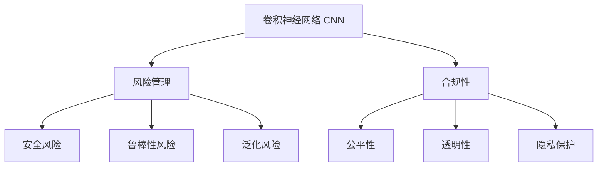

# 卷积神经网络的风险管理与合规Compliance

## 1. 背景介绍
### 1.1 问题的由来
近年来,随着人工智能技术的飞速发展,卷积神经网络(CNN)在计算机视觉、语音识别、自然语言处理等领域取得了显著成果。CNN强大的特征提取和抽象能力,使其在诸多应用场景中展现出色的性能。然而,在CNN模型的开发与应用过程中,风险管理与合规问题日益凸显,亟需引起业界的高度重视。

### 1.2 研究现状
目前,学术界和工业界已经开始关注CNN模型的风险管理与合规问题。一些研究者提出了基于对抗样本的CNN模型鲁棒性评估方法[1],揭示了CNN面临的安全风险。此外,业界也在积极探索CNN模型的可解释性[2],以提高模型决策过程的透明度。但总体而言,CNN风险管理与合规的研究尚处于起步阶段,许多问题有待进一步探索。

### 1.3 研究意义
系统研究CNN的风险管理与合规问题,对于确保CNN模型的安全可靠应用具有重要意义。一方面,识别CNN面临的潜在风险,有助于研发人员采取针对性措施,提升模型的鲁棒性和可靠性。另一方面,合规性研究可以推动CNN模型在实际应用中遵循相关法律法规和伦理准则,促进人工智能技术的负责任发展。

### 1.4 本文结构
本文将围绕CNN的风险管理与合规展开深入探讨。第2部分介绍CNN的核心概念及其与风险管理和合规的关系。第3部分重点阐述CNN面临的风险类型及评估方法。第4部分建立CNN风险管理的数学模型,并以案例形式加以说明。第5部分给出CNN合规性的代码实现示例。第6部分讨论CNN风险管理与合规的实际应用场景。第7部分推荐相关工具与学习资源。第8部分总结全文,并对CNN风险管理与合规的未来发展趋势与挑战进行展望。

## 2. 核心概念与联系
卷积神经网络(Convolutional Neural Network, CNN)是一种专门用于处理网格拓扑结构数据(如图像)的深度学习模型。CNN通过卷积(convolution)、池化(pooling)等操作,逐层提取输入数据的特征表示,再经过全连接层对特征进行组合,最终输出分类或预测结果。CNN在图像分类、目标检测、语义分割等任务上取得了state-of-the-art的性能。

风险管理是指识别、评估和控制风险的过程。在CNN的语境下,风险管理主要关注以下几个方面:

1. 安全风险:CNN模型面临对抗攻击、隐私泄露等安全威胁。
2. 鲁棒性风险:CNN模型在噪声、遮挡、视角变化等扰动下性能下降。
3. 泛化风险:CNN模型在新的未知数据上表现不佳,存在过拟合问题。

合规性(Compliance)是指遵守相关法律、法规、标准、伦理准则等。对CNN而言,需要重点考虑以下合规问题:

1. 公平性:CNN模型在不同人群、属性上的预测结果是否存在歧视和偏见。
2. 透明性:CNN模型的决策过程能否被解释和理解,是否具备可审计性。
3. 隐私保护:利用CNN处理的数据是否合法合规,是否存在隐私泄露风险。

下图展示了CNN风险管理与合规的关键概念及其相互联系:



## 3. 核心算法原理 & 具体操作步骤
### 3.1 算法原理概述
针对CNN的风险管理,一个核心算法是基于对抗样本的鲁棒性评估。对抗样本是指在原始样本上叠加少量扰动,使得CNN模型产生错误输出的样本。通过生成对抗样本并评估模型在其上的性能,可以揭示CNN的脆弱性和安全风险。常见的对抗样本生成方法包括FGSM、PGD、CW等。

### 3.2 算法步骤详解
以FGSM(Fast Gradient Sign Method)[3]为例,其具体步骤如下:

输入:原始样本$x$,标签$y$,CNN模型$f$,扰动大小$\epsilon$
输出:对抗样本$\hat{x}$

1. 计算CNN模型关于输入$x$的梯度:
$$\nabla_x J(x,y)$$
其中$J$为模型的损失函数。

2. 根据梯度的符号生成扰动:
$$\eta = \epsilon \cdot sign(\nabla_x J(x,y))$$

3. 将扰动叠加到原始样本上得到对抗样本:
$$\hat{x} = x + \eta$$

4. 将对抗样本$\hat{x}$输入CNN模型,评估其预测性能。

### 3.3 算法优缺点
FGSM算法的优点是简单高效,单次前向反向传播即可生成对抗样本。但其缺点是生成的对抗样本扰动较为明显,容易被人眼识别。相比之下,PGD、CW等算法虽然计算复杂度更高,但能生成更加隐蔽和有效的对抗样本。

### 3.4 算法应用领域
对抗样本算法主要应用于以下领域:

1. 模型安全性评估:利用对抗样本揭示CNN的安全漏洞,为模型加固提供依据。
2. 对抗训练:将对抗样本加入训练集,提升模型抵御对抗攻击的能力。
3. 模型可解释性:通过可视化对抗样本,理解CNN的决策依据和潜在偏好。

## 4. 数学模型和公式 & 详细讲解 & 举例说明
### 4.1 数学模型构建
为了量化评估CNN模型的风险,我们可以构建如下数学模型:

令$f$表示CNN模型,$\mathcal{X}$为样本空间,$\mathcal{Y}$为标签空间。定义风险度量函数$R(f)$为:

$$
R(f) = \mathbb{E}_{(x,y)\sim \mathcal{D}} [\mathcal{L}(f(x),y)]
$$

其中$\mathcal{D}$为样本分布,$\mathcal{L}$为损失函数。$R(f)$表示模型$f$在分布$\mathcal{D}$上的期望风险。

进一步地,我们定义鲁棒性风险$R_{rob}(f)$为:

$$
R_{rob}(f) = \mathbb{E}_{(x,y)\sim \mathcal{D}} [\max_{\|\eta\|\leq \epsilon} \mathcal{L}(f(x+\eta),y)]
$$

其中$\eta$为$L_p$范数约束下的扰动。$R_{rob}(f)$表示在最坏情况下,模型$f$面临扰动$\eta$的鲁棒性风险。

### 4.2 公式推导过程
为了计算鲁棒性风险$R_{rob}(f)$,一种常用的近似方法是PGD(Projected Gradient Descent):

$$
\eta^{t+1} = \Pi_{\|\eta\|\leq \epsilon} (\eta^t + \alpha \cdot sign(\nabla_x \mathcal{L}(f(x+\eta^t),y)))
$$

其中$\eta^t$为第$t$步的扰动,$\alpha$为步长,$\Pi$为投影操作。PGD通过迭代优化的方式求解$\max_{\|\eta\|\leq \epsilon} \mathcal{L}(f(x+\eta),y)$。

假设迭代$T$步后得到扰动$\eta^T$,则鲁棒性风险可近似为:

$$
\hat{R}_{rob}(f) = \mathbb{E}_{(x,y)\sim \mathcal{D}} [\mathcal{L}(f(x+\eta^T),y)]
$$

### 4.3 案例分析与讲解
考虑一个二分类问题,假设我们训练了一个简单的CNN模型$f$。现在利用PGD算法评估其鲁棒性风险。

给定一个测试样本$x$,其真实标签为$y=1$。假设在$\epsilon=0.1$的$L_\infty$范数约束下,PGD算法迭代$T=10$步后得到对抗扰动$\eta^{10}$。将扰动叠加到原始样本上得到对抗样本$\hat{x}=x+\eta^{10}$。

将$\hat{x}$输入CNN模型$f$进行预测,若$f(\hat{x})=0$,则说明该对抗样本成功欺骗了模型。我们可以统计一系列测试样本上的预测结果,估算出模型$f$的鲁棒性风险$\hat{R}_{rob}(f)$。

假设在1000个测试样本上,模型$f$被对抗样本欺骗的比例为20%,则鲁棒性风险可估计为:

$$
\hat{R}_{rob}(f) = \frac{1}{1000} \sum_{i=1}^{1000} \mathcal{L}(f(\hat{x}_i),y_i) \approx 0.2
$$

这表明,在$\epsilon=0.1$的扰动下,模型$f$大约有20%的概率输出错误结果,其鲁棒性有待提高。

### 4.4 常见问题解答
Q: 对抗样本的扰动大小$\epsilon$如何选取?
A: $\epsilon$的选取需要平衡对抗样本的有效性和隐蔽性。$\epsilon$越大,越容易生成有效的对抗样本,但同时也更容易被人眼识别。实践中可以尝试不同的$\epsilon$值,并结合人工检查和模型评估结果综合确定。

Q: 除了PGD,还有哪些常用的对抗样本生成算法?
A: 其他常见算法包括FGSM、BIM、DeepFool、C&W等。不同算法在攻击效力、计算效率、可转移性等方面各有优劣,可根据实际需求选择。

Q: 对抗训练是否会影响模型在正常样本上的性能?
A: 理论上,对抗训练可能会略微降低模型在正常样本上的性能,但这种折损通常在可接受范围内。实践中,对抗训练往往能提升模型的鲁棒性,同时维持较高的正常样本性能。

## 5. 项目实践：代码实例和详细解释说明
### 5.1 开发环境搭建
本项目使用Python语言和PyTorch深度学习框架。推荐的开发环境配置如下:

- Python 3.7+
- PyTorch 1.8+
- NumPy
- Matplotlib

可以通过以下命令安装所需库:

```bash
pip install torch numpy matplotlib
```

### 5.2 源代码详细实现
以下代码展示了如何利用PGD算法生成MNIST数据集上的对抗样本,并评估CNN模型的鲁棒性:

```python
import torch
import torch.nn as nn
import torch.optim as optim
from torchvision import datasets, transforms

# 定义CNN模型
class Net(nn.Module):
    def __init__(self):
        super(Net, self).__init__()
        self.conv1 = nn.Conv2d(1, 32, 3, 1)
        self.conv2 = nn.Conv2d(32, 64, 3, 1)
        self.dropout1 = nn.Dropout(0.25)
        self.dropout2 = nn.Dropout(0.5)
        self.fc1 = nn.Linear(9216, 128)
        self.fc2 = nn.Linear(128, 10)

    def forward(self, x):
        x = self.conv1(x)
        x = F.relu(x)
        x = self.conv2(x)
        x = F.relu(x)
        x = F.max_pool2d(x, 2)
        x = self.dropout1(x)
        x = torch.flatten(x, 1)
        x = self.fc1(x)
        x = F.relu(x)
        x = self.dropout2(x)
        x = self.fc2(x)
        output = F.log_softmax(x, dim=1)
        return output

# 加载MNIST数据集
train_data = datasets.MNIST('../data', train=True, download=True,
                    transform=transforms.Compose([
                        transforms.ToTensor()
                    ]))
test_data = datasets.MNIST('../data