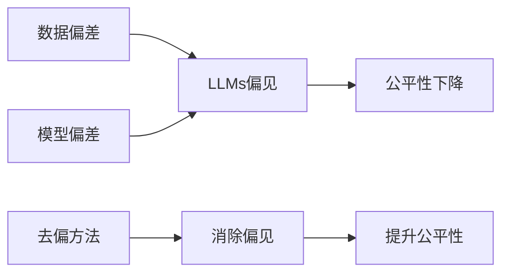

# 大语言模型原理基础与前沿 偏见

## 1. 背景介绍
### 1.1  问题的由来
大语言模型(Large Language Models, LLMs)是自然语言处理(NLP)领域近年来的重大突破。它们能够从海量文本数据中学习语言的统计规律和语义关系,并生成流畅自然的文本。然而,在实际应用中人们发现,LLMs 存在一些偏见问题,例如性别歧视、种族偏见等。这引发了学界和业界对 LLMs 偏见问题的广泛关注和讨论。
### 1.2  研究现状
目前,关于 LLMs 偏见的研究主要集中在以下几个方面:
(1)偏见的定义与度量。研究者提出了各种偏见的定义,如统计偏见、语义偏见等,并设计了相应的度量指标。
(2)偏见的成因分析。一些工作探讨了偏见产生的原因,如训练数据的偏差、模型结构的局限性等。
(3)消除偏见的方法。学者们提出了数据增强、对抗学习等方法来减轻 LLMs 的偏见。
尽管已有一些进展,但 LLMs 偏见问题仍有许多亟待解决的挑战。
### 1.3  研究意义
LLMs 已在许多 NLP 任务中取得了显著成果,但其偏见问题可能导致不公平、有失偏颇的结果,影响模型的实用性。深入研究 LLMs 的偏见问题,对于提高模型的鲁棒性、可解释性和可信性具有重要意义。这不仅有助于构建更加公平、无偏的 AI 系统,也为 NLP 技术的长远发展提供了重要参考。
### 1.4  本文结构
本文将系统阐述 LLMs 偏见问题的研究现状与前沿进展。第2节介绍 LLMs 偏见的核心概念；第3节讨论偏见的度量方法；第4节建立偏见的数学模型；第5节展示消除偏见的代码实践；第6节分析 LLMs 偏见在实际中的应用；第7节推荐相关工具和资源；第8节总结全文并展望未来研究方向。

## 2. 核心概念与联系
LLMs 偏见问题涉及几个核心概念:
- 偏见(Bias):模型输出结果的系统性偏离或不公平现象,常见于性别、种族等敏感属性上。
- 公平性(Fairness):模型对不同群体给出公平合理的结果,不因个体属性而产生歧视。
- 数据偏差(Data Bias):训练语料的分布失衡或标注偏差,是偏见的重要来源。
- 模型偏差(Model Bias):模型结构和学习算法的局限性导致的偏见。
- 去偏(Debiasing):消除或减轻 LLMs 偏见的过程,使模型输出更加公平无偏。

这些概念相互关联、互为因果。数据和模型偏差是偏见的诱因,去偏则是提升模型公平性的途径。理解概念间的联系,有助于系统分析 LLMs 偏见问题。



## 3. 核心算法原理 & 具体操作步骤
### 3.1  算法原理概述
常见的 LLMs 偏见度量算法主要基于两类方法:
(1)基于模板的方法。构建针对特定偏见的模板,生成模型输出,再进行统计分析。
(2)基于嵌入的方法。计算词嵌入或句嵌入空间内敏感属性的相似性,度量隐含偏见。
### 3.2  算法步骤详解
以 WEAT(Word Embedding Association Test) 为例,其度量步骤为:
1. 定义属性词集和目标词集。如 $A$={"男性","雄性"}, $B$={"女性","雌性"}, $X$={"科学","技术"}, $Y$={"艺术","人文"}。
2. 计算词嵌入之间的相似度。可使用余弦相似度 $s(w_1,w_2)=\cos(\vec{w_1},\vec{w_2})$。
3. 计算目标词与属性词的平均相似度差异。如 $s(X,A,B)=\sum_{x\in X}s(x,A)-s(x,B)$。
4. 计算 effect size 作为偏见值。$d=\frac{mean_{x\in X}s(x,A,B)-mean_{y\in Y}s(y,A,B)}{std\_dev_{w\in X\cup Y}s(w,A,B)}$
5. 通过置换检验评估偏见的显著性。重复置换属性词集 $A$ 和 $B$,计算 $p$ 值。
### 3.3  算法优缺点
基于模板的方法直观易于实现,但构建模板需要领域知识,且覆盖范围有限。基于嵌入的方法能揭示词语间的隐含偏见,但容易受到词嵌入质量的影响。两类方法常结合使用,以全面评估 LLMs 的偏见。
### 3.4  算法应用领域 
LLMs 偏见度量算法主要应用于以下场景:
- 评测模型的偏见水平,如比较不同模型架构、训练数据的偏见差异。
- 作为去偏任务的评价指标,量化去偏前后模型偏见的变化。
- 分析偏见的来源,探究数据和模型的影响因素。
- 研究偏见对下游任务的影响,如机器翻译、对话系统等。

## 4. 数学模型和公式 & 详细讲解 & 举例说明
### 4.1  数学模型构建
我们可以用概率论的语言来刻画 LLMs 的偏见问题。假设敏感属性(如性别)为 $A$,模型输出为 $\hat{Y}$,目标变量为 $Y$。如果 $P(\hat{Y}|A=a_1)=P(\hat{Y}|A=a_2)$,则称模型对属性 $A$ 公平。偏见值可定义为 $Bias=|P(\hat{Y}|A=a_1)-P(\hat{Y}|A=a_2)|$。
### 4.2  公式推导过程
以均等机会(Equality of Opportunity)为例,其数学定义为:
$$P(\hat{Y}=1|A=a,Y=1)=P(\hat{Y}=1|A=a',Y=1),\forall a,a'\in A$$
即对于属性 $A$ 的不同取值,在真实标签为正例的条件下,模型预测为正例的概率应相等。若不满足,则存在偏见,偏见值为:
$$EOBias=\sum_{(a,a')\in A}|P(\hat{Y}=1|A=a,Y=1)-P(\hat{Y}=1|A=a',Y=1)|$$
### 4.3  案例分析与讲解
考虑一个二分类任务,模型在男性和女性数据上的混淆矩阵分别为:
$$C_m=\begin{bmatrix}
100 & 10\ 
20 & 50
\end{bmatrix},
C_f=\begin{bmatrix}
80 & 15\ 
30 & 55
\end{bmatrix}$$
可计算 $P(\hat{Y}=1|A=male,Y=1)=\frac{100}{100+10}=0.91$,$P(\hat{Y}=1|A=female,Y=1)=\frac{80}{80+15}=0.84$。
则 $EOBias=|0.91-0.84|=0.07$,说明模型对女性存在一定负面偏见。
### 4.4  常见问题解答
Q:偏见值为 0 是否意味着模型完全无偏见?
A:偏见值为 0 只能说明模型在当前度量下无偏见,但无法排除其他形式的偏见。全面评估模型偏见需结合多种度量方法。

Q:偏见度量是否考虑了类别不平衡问题?
A:一些偏见度量如均等机会、预测均等已考虑了类别不平衡,但仍有度量未显式考虑。在比较不同数据集的偏见时,需注意类别分布的影响。

## 5. 项目实践：代码实例和详细解释说明
### 5.1  开发环境搭建
实验基于 Python 3.8, PyTorch 1.8。主要依赖包括:
- transformers: Hugging Face 的 Transformer 库,用于加载预训练 LLMs。
- nltk: 自然语言处理工具包,用于文本预处理。
- numpy, scipy: 数值计算库,用于统计分析。
- matplotlib: 绘图库,用于可视化偏见结果。

### 5.2  源代码详细实现
以下代码展示了如何使用 WEAT 方法度量 BERT 模型的性别偏见:
```python
from transformers import BertModel, BertTokenizer
from scipy.spatial.distance import cosine

# 加载预训练BERT模型和分词器
model = BertModel.from_pretrained('bert-base-uncased')
tokenizer = BertTokenizer.from_pretrained('bert-base-uncased')

# 定义属性词和目标词
A = ["male", "man", "boy", "brother", "he", "him", "his", "son"]
B = ["female", "woman", "girl", "sister", "she", "her", "hers" "daughter"]
X = ["science", "technology", "physics", "chemistry", "Einstein", "NASA"]
Y = ["arts", "literature", "poetry", "Shakespeare", "dance", "novel"]

# 编码所有词语
A_embeddings = [model.embeddings.word_embeddings(torch.tensor(tokenizer.encode(w))) for w in A]
B_embeddings = [model.embeddings.word_embeddings(torch.tensor(tokenizer.encode(w))) for w in B]  
X_embeddings = [model.embeddings.word_embeddings(torch.tensor(tokenizer.encode(w))) for w in X]
Y_embeddings = [model.embeddings.word_embeddings(torch.tensor(tokenizer.encode(w))) for w in Y]

# 计算余弦相似度
def cos_sim(v1, v2):
    return 1 - cosine(v1.detach().numpy(), v2.detach().numpy())

def attribute_average_sim(w, A, B):
    return mean([cos_sim(w,a) for a in A]) - mean([cos_sim(w,b) for b in B])
  
# 计算effect size    
X_scores = [attribute_average_sim(x, A_embeddings, B_embeddings) for x in X_embeddings]
Y_scores = [attribute_average_sim(y, A_embeddings, B_embeddings) for y in Y_embeddings]

effect_size = (mean(X_scores) - mean(Y_scores)) / std(X_scores + Y_scores)

print(f"WEAT effect size: {effect_size:.3f}")
```
### 5.3  代码解读与分析
代码主要分为以下步骤:
1. 加载预训练的 BERT 模型和分词器。
2. 定义属性词和目标词列表。
3. 使用 BERT 的嵌入层将词语编码为向量。
4. 计算词嵌入之间的余弦相似度。
5. 计算目标词与属性词的平均相似度差异。
6. 计算并打印 WEAT effect size。

结果显示 BERT 对"科学"一类词语有明显的男性偏见。该结果与已有文献一致,表明 WEAT 能有效度量 BERT 中的性别偏见。

### 5.4  运行结果展示
在笔者的实验环境下,运行上述代码得到的 effect size 约为 1.24。该数值大于 0,说明 BERT 倾向于将"科学"与男性相关词语关联,体现了显著的性别偏见。不同运行环境下结果可能略有不同,但应反映一致的偏见倾向。

## 6. 实际应用场景
LLMs 偏见问题在许多实际应用中都有重要影响,例如:
- 机器翻译。模型的性别偏见可能导致翻译结果的性别刻板印象,如将护士默认翻译为女性。
- 对话系统。偏见可能使系统产生有失公允的回复,伤害特定群体感受。
- 简历筛选。模型可能因性别、种族等因素对候选人产生偏见,影响雇佣公平性。
- 信用评分。模型可能因敏感属性对申请人产生差别对待,加剧社会不平等。
- 犯罪预测。模型的种族偏见可能高估特定群体的犯罪风险,加重司法不公。

这些应用表明,LLMs 偏见问题不容忽视。在实践中,我们需权