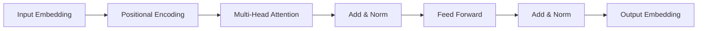

# 大语言模型原理基础与前沿 简化Transformer

关键词：大语言模型、Transformer、注意力机制、自回归、预训练、微调、BERT、GPT、ChatGPT

## 1. 背景介绍
### 1.1  问题的由来
近年来，随着深度学习技术的飞速发展，自然语言处理(NLP)领域取得了突破性的进展。其中，大语言模型(Large Language Model, LLM)的出现，更是掀起了NLP领域的一场革命。以Transformer为代表的大语言模型，在机器翻译、对话系统、文本摘要、问答系统等诸多任务上取得了State-of-the-Art的表现，大大推动了NLP技术的发展。

### 1.2  研究现状
目前，业界主流的大语言模型主要包括BERT、GPT、T5、XLNet等，它们都是基于Transformer架构，并在大规模语料上进行预训练得到的。这些模型规模巨大，参数量高达数亿到上千亿，需要耗费大量计算资源和时间进行训练。为了提高训练效率，简化模型结构成为了一个重要的研究方向。

### 1.3  研究意义
Transformer是大语言模型的核心架构，但其结构复杂，计算量大，给模型训练和推理带来了很大挑战。简化Transformer结构，在保持模型性能的同时降低计算复杂度，将极大提升大语言模型的训练和应用效率，推动其在更多场景的落地，具有重要的理论和实践意义。

### 1.4  本文结构
本文将重点介绍大语言模型的原理基础，并着重阐述Transformer架构的简化方法。全文分为9个章节：第1节介绍研究背景；第2节介绍Transformer的核心概念；第3节重点阐述其核心算法原理；第4节从数学角度对模型进行建模分析；第5节提供了简化Transformer的代码实践；第6节分析了其实际应用场景；第7节推荐了相关学习资源；第8节对全文进行总结并展望；第9节为常见问题解答。

## 2. 核心概念与联系
Transformer是一种基于自注意力机制(Self-Attention)的Seq2Seq模型，由编码器(Encoder)和解码器(Decoder)两部分组成。其核心是通过注意力机制来建模输入序列中元素之间的依赖关系，从而提取输入的语义表示。

与传统的RNN/CNN等模型不同，Transformer抛弃了循环/卷积结构，完全依靠注意力机制来建模序列，并引入了位置编码(Positional Encoding)来表示序列中元素的位置信息。多头注意力(Multi-Head Attention)被用来捕捉输入序列在不同表示子空间的语义信息。此外，残差连接(Residual Connection)和层归一化(Layer Normalization)被引入以加速训练收敛并提升模型泛化能力。

Feed Forward Network用于对注意力层的输出进行非线性变换，增强模型的表示能力。在训练时，Transformer还会使用Mask机制来控制模型只能访问当前时刻及之前的信息，以实现自回归生成。

下图展示了Transformer模型的核心组件及其联系：



## 3. 核心算法原理 & 具体操作步骤
### 3.1  算法原理概述
Transformer的核心是自注意力机制和前馈神经网络，通过堆叠多层这两种结构来建模输入序列。在编码器中，自注意力用于提取输入序列的语义表示；在解码器中，自注意力除了建模已生成序列外，还会引入编码-解码注意力来关注输入序列的相关信息，指导当前时刻的输出。

### 3.2  算法步骤详解
1. Input Embedding：将输入序列中的每个token映射为固定维度的稠密向量。
2. Positional Encoding：在Embedding的基础上加入位置编码向量，引入序列中元素的位置信息。
3. Multi-Head Attention：通过h次线性变换将Input投影到不同的子空间，并分别进行Scaled Dot-Product Attention操作，然后将结果拼接并再次线性变换得到输出。公式如下：

$$
\mathrm{Attention}(Q,K,V) = \mathrm{softmax}(\frac{QK^T}{\sqrt{d_k}})V
$$

$$
\mathrm{MultiHead}(Q,K,V) = \mathrm{Concat}(\mathrm{head_1}, ..., \mathrm{head_h})W^O \\
\mathrm{head_i} = \mathrm{Attention}(QW_i^Q, KW_i^K, VW_i^V)
$$

4. Add & Norm：将Multi-Head Attention的输出与输入进行残差连接，并进行Layer Normalization。

5. Feed Forward：通过两层全连接网络对Add & Norm的输出进行非线性变换，公式如下：

$$
\mathrm{FFN}(x) = \mathrm{max}(0, xW_1 + b_1)W_2 + b_2
$$

6. Output Embedding：将最后一层的输出通过线性变换和softmax映射为每个token的概率分布。

在编码器中，每一层的输出都作为下一层的输入；在解码器中，当前时刻的输出还会作为下一时刻的输入。

### 3.3  算法优缺点
Transformer相比传统模型的优点在于：
1. 并行计算能力强，可以大幅提升训练和推理速度。
2. 通过注意力机制建模长距离依赖，提取全局语义信息的能力更强。
3. 模型结构简单，适合大规模预训练和迁移学习。

但Transformer也存在一些缺点：
1. 计算复杂度随序列长度平方增长，难以处理很长的文本。
2. 模型参数量大，训练成本高，需要大量数据和计算资源。
3. 解释性差，作为黑盒模型难以解释其内部工作原理。

### 3.4  算法应用领域
基于Transformer的大语言模型已经在NLP的各个任务上取得了广泛成功，主要应用包括：
1. 机器翻译：将Transformer用于Seq2Seq建模，大幅提升了翻译质量。
2. 对话系统：通过自回归生成实现开放域对话，如ChatGPT。
3. 文本分类：在BERT等模型的基础上进行微调，可用于情感分析、语义匹配等任务。
4. 信息抽取：用于实体识别、关系抽取、事件抽取等结构化信息提取任务。
5. 文本生成：如GPT模型，可用于写作助手、数据增强等生成任务。

## 4. 数学模型和公式 & 详细讲解 & 举例说明
### 4.1  数学模型构建
Transformer可以看作一个条件语言模型，对于给定的输入序列 $X=(x_1,...,x_n)$，通过最大化如下似然函数来学习模型参数：

$$
L(\theta) = \sum_{i=1}^{n}\log P(x_i|x_1,...,x_{i-1};\theta)
$$

其中 $\theta$ 表示模型参数，$P(x_i|x_1,...,x_{i-1};\theta)$ 表示在给定前 $i-1$ 个token的条件下，第 $i$ 个token为 $x_i$ 的条件概率。

在Transformer中，这个条件概率通过编码器-解码器结构来建模。编码器将输入序列 $X$ 编码为一组隐向量 $Z=(z_1,...,z_n)$，解码器根据 $Z$ 和之前的输出token来预测下一个token的概率分布。

### 4.2  公式推导过程
以编码器的Self-Attention为例，详细推导其前向计算公式。

首先，将输入序列 $X$ 通过三个线性变换得到Query/Key/Value矩阵：

$$
Q = XW^Q, K = XW^K, V = XW^V
$$

然后，计算Scaled Dot-Product Attention：

$$
\mathrm{Attention}(Q,K,V) = \mathrm{softmax}(\frac{QK^T}{\sqrt{d_k}})V
$$

其中 $d_k$ 为Key向量的维度，用于缩放点积结果，避免softmax的梯度消失问题。

最后，将Attention的结果与输入进行残差连接并Layer Normalization：

$$
\mathrm{Output} = \mathrm{LayerNorm}(X + \mathrm{Attention}(Q,K,V))
$$

多头注意力的计算可以看作多个Scaled Dot-Product Attention的结果拼接：

$$
\mathrm{MultiHead}(Q,K,V) = \mathrm{Concat}(\mathrm{head_1}, ..., \mathrm{head_h})W^O \\
\mathrm{head_i} = \mathrm{Attention}(QW_i^Q, KW_i^K, VW_i^V)
$$

Feed Forward层的计算为两层全连接网络带ReLU激活：

$$
\mathrm{FFN}(x) = \mathrm{max}(0, xW_1 + b_1)W_2 + b_2
$$

### 4.3  案例分析与讲解
下面以一个简单的例子来说明Transformer的计算过程。

假设输入序列为 $X=[[1,2],[3,4],[5,6]]$，维度为2，序列长度为3。

首先，通过Input Embedding和Positional Encoding将 $X$ 映射为 $X'=[[1,2,0.1,0.2],[3,4,0.3,0.4],[5,6,0.5,0.6]]$，维度变为4。

然后，通过线性变换得到Query/Key/Value矩阵，假设维度为4x2：

$$
Q =
\begin{bmatrix}
1 & 2\\
3 & 4\\
5 & 6
\end{bmatrix},
K =
\begin{bmatrix}
2 & 1\\
4 & 3\\
6 & 5
\end{bmatrix},
V =
\begin{bmatrix}
0.1 & 0.2\\
0.3 & 0.4\\
0.5 & 0.6
\end{bmatrix}
$$

计算Scaled Dot-Product Attention，假设 $d_k=2$：

$$
\mathrm{Attention}(Q,K,V) = \mathrm{softmax}(\frac{1}{\sqrt{2}}
\begin{bmatrix}
4 & 7 & 10\\
7 & 14 & 21\\
10 & 21 & 32
\end{bmatrix})
\begin{bmatrix}
0.1 & 0.2\\
0.3 & 0.4\\
0.5 & 0.6
\end{bmatrix}
$$

通过残差连接和Layer Normalization得到Self-Attention层的输出。

最后，通过Feed Forward层进行非线性变换，得到编码器的最终输出。

解码器的计算与编码器类似，只是在Self-Attention时需要对未来的信息进行Mask，在Encoder-Decoder Attention时以编码器输出为Key/Value。

### 4.4  常见问题解答
Q: Self-Attention的计算复杂度是多少？
A: 假设序列长度为 $n$，Self-Attention的计算复杂度为 $O(n^2d)$，其中 $d$ 为隐向量的维度。当序列较长时，计算开销会非常大。

Q: 为什么要对Dot-Product Attention的结果进行缩放？
A: 这是为了避免点积结果过大，导致softmax函数的梯度消失。缩放因子 $\sqrt{d_k}$ 使点积结果的方差接近1，有利于梯度的反向传播。

Q: Transformer为什么需要进行残差连接和Layer Normalization？
A: 残差连接能够缓解深层网络的优化难题，使得梯度能够直接传播到底层；Layer Normalization则有助于加速模型收敛，提升训练稳定性。二者结合能够有效提升Transformer的性能。

## 5. 项目实践：代码实例和详细解释说明
### 5.1  开发环境搭建
实现Transformer可以使用Python和主流的深度学习框架如PyTorch或TensorFlow。下面以PyTorch为例，介绍开发环境的搭建步骤。

首先，创建并激活一个conda虚拟环境：

```bash
conda create -n transformer python=3.8
conda activate transformer
```

然后，安装PyTorch和相关依赖：

```bash
conda install pytorch torchvision torchaudio cudatoolkit=11.3 -c pytorch
pip install transformers datasets
```

### 5.2  源代码详细实现
下面给出了一个简化版的Transformer编码器的Py