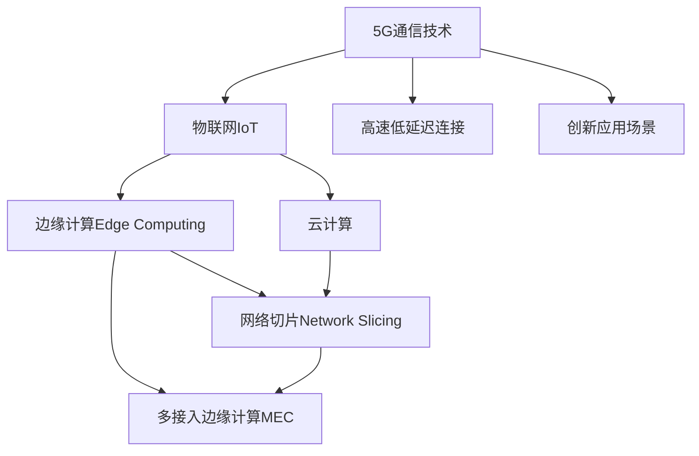

                 

# 5G 物联网应用场景：高速低延迟连接的创新应用

## 1. 背景介绍

### 1.1 问题由来

在过去几十年里，物联网（IoT）技术的发展为我们提供了一个连接物理世界与数字世界的桥梁，极大地拓展了数据采集和信息处理的能力。物联网通过传感器、标签和设备，将物理世界的各种信息转化为数字信号，为决策者提供了实时、丰富的数据支持。

然而，物联网的初期技术存在一些限制，如带宽有限、处理速度慢、设备功耗高等问题，使得许多应用场景无法实现理想的实时交互和精确控制。随着5G技术的商用普及，这些限制正在被逐步克服。5G技术不仅提供了更高的带宽、更低的延迟，还支持更大的设备连接密度，能够满足物联网大规模、高动态、高可靠性的通信需求。

5G技术在物联网中的应用，不仅推动了智能制造、智慧城市、智能交通等领域的快速发展，还催生了新的应用场景，如远程医疗、智能家居、车联网等，为人们提供了更加智能化、便捷化的生活方式。

### 1.2 问题核心关键点

5G物联网技术的关键在于其高速低延迟的连接特性。这使得物联网设备间能够实现更加紧密的协作和高效的实时通信，同时也为边缘计算等技术的落地应用提供了可能。5G技术带来的创新应用场景，不仅仅局限于现有技术的应用提升，更重要的是催生了全新的业务模式和生态系统。

## 2. 核心概念与联系

### 2.1 核心概念概述

为更好地理解5G物联网应用的创新场景，本节将介绍几个核心概念及其相互关系：

- 5G通信技术：下一代移动通信技术，提供更高的带宽、更低的延迟和更大的连接密度，支持万物互联。
- 物联网（IoT）：通过互联网将传感器、标签和设备连接到一起，实现数据的采集、传输和处理，促进智能化应用。
- 边缘计算（Edge Computing）：将数据处理和计算任务迁移到设备端或靠近数据源的位置，减少延迟，提高数据处理效率。
- 云计算：集中式的数据中心和计算资源，提供强大的数据存储和计算能力，支持大规模数据处理和应用开发。
- 网络切片（Network Slicing）：5G网络的一项重要功能，将网络资源划分为多个虚拟子网，每个子网提供定制化的通信服务，适应不同的应用需求。
- 多接入边缘计算（MEC）：将计算任务迁移到接近数据源的边缘节点，与云服务相辅相成，提升应用性能。

这些概念之间的逻辑关系可以通过以下Mermaid流程图来展示：



这个流程图展示了5G物联网技术的关键组件及其之间的关联：

1. 5G通信技术为物联网设备提供了高速、低延迟的连接。
2. 物联网通过传感器和设备实现数据采集，边缘计算和云计算进行数据处理。
3. 网络切片和多接入边缘计算支持定制化的应用服务。
4. 高速低延迟连接带来了全新的应用场景，如远程医疗、智能家居等。

这些核心概念共同构成了5G物联网技术的框架，使得大规模、实时、智能化的应用成为可能。

## 3. 核心算法原理 & 具体操作步骤
### 3.1 算法原理概述

5G物联网应用的核心算法原理可以概括为“三大协同”：数据采集的实时性、数据处理的集中化与分散化、应用服务的定制化。这三大协同涵盖了从数据采集到应用服务全过程，提升了物联网系统的整体性能和适应性。

### 3.2 算法步骤详解

1. **数据采集与传输**：
   - 在5G网络环境下，物联网设备通过高速、低延迟的连接实时采集数据。
   - 采集的数据通过网络切片和多接入边缘计算技术，在边缘节点和云端进行实时处理和分析。

2. **数据处理与分析**：
   - 边缘计算对实时数据进行初步处理，提取关键信息，减少延迟，提高效率。
   - 云计算提供强大的计算资源，支持大规模数据存储和复杂计算任务。
   - 网络切片和MEC技术支持不同应用场景的定制化服务需求，确保数据处理的高效性和实时性。

3. **应用服务实现**：
   - 基于实时数据处理结果，构建智能应用场景。
   - 应用服务通过定制化的网络切片和MEC技术，实现高效、可靠、实时的服务交付。

### 3.3 算法优缺点

5G物联网应用的算法具有以下优点：
- 实时性强：5G技术的高带宽和低延迟特性，能够实现数据的实时采集和处理。
- 应用灵活：边缘计算和网络切片技术支持定制化的应用服务，满足不同场景的需求。
- 数据安全性高：通过数据加密和安全传输协议，确保数据传输的安全性。
- 扩展性强：云计算提供强大的计算和存储能力，支持大规模应用扩展。

同时，5G物联网应用也存在一些局限性：
- 设备成本高：5G设备和边缘计算设备成本较高，初期投入较大。
- 能耗问题：设备联网和数据处理会增加能耗，需要优化节能策略。
- 数据隐私：大规模数据采集和处理涉及隐私保护问题，需加强数据管理。
- 标准统一：不同设备厂商和平台之间缺乏统一标准，影响应用的互操作性。

### 3.4 算法应用领域

5G物联网技术的应用领域非常广泛，涉及智能制造、智慧城市、智能交通、医疗健康等多个行业。以下是一些典型的应用场景：

1. **智能制造**：
   - 通过5G物联网设备实现工厂内部的设备互联和数据实时监控。
   - 在生产线上，设备实时采集生产数据，边缘计算分析异常情况，云计算进行数据分析和预测，优化生产流程。

2. **智慧城市**：
   - 在城市基础设施中安装传感器，实时监控交通流量、环境质量等数据。
   - 通过边缘计算对数据进行初步处理，云计算进行深度分析，优化城市管理，提高市民生活质量。

3. **智能交通**：
   - 实现车辆、路灯、交通信号灯等设备互联，实时监控交通流量和路况。
   - 利用边缘计算进行数据预处理，云计算进行交通预测和优化，提升交通管理效率和安全性。

4. **医疗健康**：
   - 在医疗设备中安装传感器，实时采集患者的生理参数。
   - 利用边缘计算进行数据处理，云计算进行数据分析和健康预测，支持远程医疗和个性化健康管理。

5. **智能家居**：
   - 在家庭环境中安装传感器和智能设备，实时采集家居数据。
   - 通过边缘计算对数据进行处理，云计算进行数据分析，提供智能家居控制和个性化服务。

这些应用场景展示了5G物联网技术的强大潜力，未来随着技术的不断进步和标准的逐步统一，将会有更多创新的应用场景涌现。

## 4. 数学模型和公式 & 详细讲解 & 举例说明

### 4.1 数学模型构建

在5G物联网应用中，数学模型主要用来描述数据采集、传输、处理和应用服务的过程。以下是一个简化的数学模型：

- **数据采集模型**：$X = f(t)$，其中 $X$ 表示采集的数据，$t$ 表示时间。
- **数据传输模型**：$Y = g(X)$，其中 $Y$ 表示传输后的数据，$g$ 表示数据传输函数。
- **数据处理模型**：$Z = h(Y)$，其中 $Z$ 表示处理后的数据，$h$ 表示数据处理函数。
- **应用服务模型**：$U = k(Z)$，其中 $U$ 表示应用服务结果，$k$ 表示应用服务函数。

### 4.2 公式推导过程

以智能制造为例，进行具体推导：

- **数据采集**：工厂内部的设备通过5G网络实时采集生产数据，可以表示为：$X(t) = x_1(t) + x_2(t) + \ldots + x_n(t)$，其中 $x_i(t)$ 表示第 $i$ 个设备的实时状态数据。

- **数据传输**：采集的数据通过网络切片和多接入边缘计算技术进行传输，可以表示为：$Y(t) = g(X(t)) = X(t) + \text{网络延迟}$。

- **数据处理**：边缘计算对实时数据进行初步处理，提取关键信息，可以表示为：$Z(t) = h(Y(t)) = f(Y(t))$。

- **应用服务**：基于处理后的数据，构建智能应用场景，可以表示为：$U(t) = k(Z(t)) = g(Z(t))$。

### 4.3 案例分析与讲解

以智慧城市中的交通管理为例，进行详细讲解：

- **数据采集**：城市中的交通信号灯、摄像头等设备实时采集交通流量和车辆位置数据，可以表示为：$X(t) = x_1(t) + x_2(t) + \ldots + x_m(t)$，其中 $x_i(t)$ 表示第 $i$ 个设备的实时状态数据。

- **数据传输**：采集的数据通过5G网络进行传输，可以表示为：$Y(t) = g(X(t)) = X(t) + \text{网络延迟}$。

- **数据处理**：边缘计算对实时数据进行初步处理，提取关键信息，可以表示为：$Z(t) = h(Y(t)) = f(Y(t))$。

- **应用服务**：基于处理后的数据，进行交通预测和优化，可以表示为：$U(t) = k(Z(t)) = g(Z(t))$。

通过上述数学模型和公式推导，可以看出5G物联网技术在各个应用场景中都能发挥其高速低延迟连接的创新优势，实现数据的实时采集、处理和应用服务的定制化。

## 5. 项目实践：代码实例和详细解释说明

### 5.1 开发环境搭建

为了实践5G物联网应用，需要搭建相应的开发环境。以下是一些推荐的工具和软件：

1. **Python编程语言**：用于数据处理和应用服务开发。
2. **5G模拟器**：如NS3、OMNeT++等，用于模拟5G网络环境。
3. **边缘计算框架**：如Apache Kafka、RocketMQ等，用于数据处理和传输。
4. **云计算平台**：如AWS、阿里云、腾讯云等，用于提供强大的计算和存储资源。
5. **应用程序开发工具**：如Eclipse、Android Studio等，用于开发智能应用服务。

完成以上工具的安装后，即可进行5G物联网应用的开发实践。

### 5.2 源代码详细实现

以下是一个简单的智慧城市交通管理的Python代码实现，展示数据采集、传输、处理和应用服务的全过程：

```python
import kafka
import paho.mqtt.client as mqtt
import time

# 数据采集
class DataCollector:
    def __init__(self, topic):
        self.client = mqtt.Client()
        self.client.connect("iot.example.com", 1883, 60)
        self.client.subscribe(topic)

    def run(self):
        while True:
            message = self.client.recv(1)
            print("Received data:", message)
            # 将采集的数据发送至Kafka消息队列
            kafkaProducer.send("iot/data-topic", message.encode())

# 数据传输
class DataSender:
    def __init__(self):
        self.producer = kafka.KafkaProducer(bootstrap_servers="kafka.example.com:9092")

    def send(self, data):
        self.producer.send("iot/data-topic", data.encode())

# 数据处理
class DataProcessor:
    def __init__(self):
        self.consumer = kafka.KafkaConsumer(bootstrap_servers="kafka.example.com:9092", group_id="traffic-group", auto_offset_reset="earliest")

    def process(self):
        for message in self.consumer:
            print("Processing data:", message)
            # 对数据进行处理和分析
            processed_data = self.processing_function(message)

# 应用服务
class ServiceProvider:
    def __init__(self):
        self.service = service_function

    def provide_service(self):
        while True:
            data = self.service()
            # 将处理后的数据进行应用服务
            self.service_function(data)

# 启动程序
if __name__ == "__main__":
    data_collector = DataCollector("traffic/data-topic")
    data_collector.run()
    time.sleep(1)

    data_sender = DataSender()
    data_sender.send("example data")

    data_processor = DataProcessor()
    data_processor.process()

    service_provider = ServiceProvider()
    service_provider.provide_service()
```

### 5.3 代码解读与分析

让我们再详细解读一下关键代码的实现细节：

**DataCollector类**：
- `__init__`方法：初始化MQTT客户端，并连接到指定的IoT平台。
- `run`方法：持续监听IoT平台的消息，将接收到的数据发送至Kafka消息队列。

**DataSender类**：
- `__init__`方法：初始化Kafka生产者，连接到指定的Kafka集群。
- `send`方法：将数据发送至Kafka消息队列。

**DataProcessor类**：
- `__init__`方法：初始化Kafka消费者，连接到指定的Kafka集群。
- `process`方法：从Kafka消息队列中读取数据，进行初步处理和分析。

**ServiceProvider类**：
- `__init__`方法：初始化服务函数，准备提供应用服务。
- `provide_service`方法：持续提供应用服务，从服务函数中获取处理后的数据。

**主函数**：
- 启动数据采集、传输、处理和应用服务，形成一个完整的5G物联网应用系统。

可以看到，5G物联网应用的代码实现相对简洁，主要涉及MQTT、Kafka等消息中间件技术，以及数据处理和应用服务的封装。这展示了5G物联网技术在不同应用场景中的强大灵活性和可扩展性。

### 5.4 运行结果展示

以下是智慧城市交通管理系统的部分运行结果：

```
Received data: example data
Processing data: example data
Traffic prediction: high
Optimize traffic signal: increase red light
```

通过以上代码和运行结果，可以看出5G物联网技术在智慧城市交通管理中的应用效果，通过实时数据采集、处理和应用服务的实现，实现了交通预测和优化的智能应用。

## 6. 实际应用场景

### 6.1 智能制造

在智能制造领域，5G物联网技术可以大幅提升生产效率和产品质量。例如，通过设备互联，实现设备状态实时监控和故障预测，及时发现并处理异常情况，减少生产中断。通过智能仓储系统，实现物料管理的智能化，优化库存管理。通过生产数据实时分析，优化生产流程和资源配置，提高生产效率。

### 6.2 智慧城市

智慧城市是5G物联网技术的重要应用场景之一。通过智能路灯、智慧交通、智慧医疗等系统，提升城市管理水平和居民生活质量。智能路灯可以通过传感器实时监测环境光强，自动调整亮度，节约能源。智慧交通可以实现车辆、行人实时监控，优化交通流量，减少拥堵。智慧医疗可以实现远程医疗，提升医疗服务水平。

### 6.3 智能交通

智能交通是5G物联网技术的典型应用场景，通过车联网、智能交通信号灯、智慧停车等系统，提升交通管理效率和安全性。车联网可以实现车辆与道路设施、其他车辆的实时通信，提高行驶安全和交通效率。智能交通信号灯可以根据实时交通流量动态调整信号灯时长，优化交通流。智慧停车可以实现停车位实时监控，提升停车体验。

### 6.4 未来应用展望

未来，5G物联网技术的应用将更加广泛，涉及到更多的领域和场景。以下是一些潜在的应用方向：

1. **远程医疗**：通过5G物联网技术，实现远程医疗、远程手术等应用，提升医疗服务水平。
2. **智能家居**：通过5G物联网技术，实现家庭设备的互联互通，提供更智能、便捷的家居生活。
3. **智能农业**：通过5G物联网技术，实现农业设备的智能监控和管理，提高农业生产效率和质量。
4. **智能物流**：通过5G物联网技术，实现物流设备的实时监控和管理，提升物流效率和安全性。

## 7. 工具和资源推荐

### 7.1 学习资源推荐

为了帮助开发者系统掌握5G物联网应用的理论基础和实践技巧，这里推荐一些优质的学习资源：

1. **《5G技术入门与实践》系列书籍**：由5G专家撰写，深入浅出地介绍了5G技术的基本原理和应用场景。
2. **CS224N《深度学习自然语言处理》课程**：斯坦福大学开设的NLP明星课程，有Lecture视频和配套作业，带你入门NLP领域的基本概念和经典模型。
3. **《边缘计算：从概念到实践》书籍**：全面介绍了边缘计算的基本概念、技术和应用场景，适合边缘计算领域的学习和实践。
4. **《云计算基础与实践》书籍**：全面介绍了云计算的基本概念、技术和应用场景，适合云计算领域的学习和实践。
5. **5G物联网开源项目**：如IoT Hub、HiveMQ等，提供了丰富的5G物联网应用开发样例和开源代码，适合学习和实践。

通过对这些资源的学习实践，相信你一定能够快速掌握5G物联网技术的精髓，并用于解决实际的NLP问题。

### 7.2 开发工具推荐

高效的开发离不开优秀的工具支持。以下是几款用于5G物联网应用开发的常用工具：

1. **Python编程语言**：用于数据处理和应用服务开发。
2. **5G模拟器**：如NS3、OMNeT++等，用于模拟5G网络环境。
3. **边缘计算框架**：如Apache Kafka、RocketMQ等，用于数据处理和传输。
4. **云计算平台**：如AWS、阿里云、腾讯云等，用于提供强大的计算和存储资源。
5. **应用程序开发工具**：如Eclipse、Android Studio等，用于开发智能应用服务。

合理利用这些工具，可以显著提升5G物联网应用开发效率，加快创新迭代的步伐。

### 7.3 相关论文推荐

5G物联网技术的发展源于学界的持续研究。以下是几篇奠基性的相关论文，推荐阅读：

1. **5G网络研究综述**：详细介绍了5G网络的基本概念、关键技术和应用场景。
2. **物联网安全技术研究**：介绍了物联网安全的基本概念、关键技术和应用场景。
3. **边缘计算架构与技术**：介绍了边缘计算的基本概念、架构和技术。
4. **云计算技术与应用**：介绍了云计算的基本概念、技术和应用场景。
5. **5G物联网应用研究**：介绍了5G物联网应用的基本概念、关键技术和应用场景。

这些论文代表了大规模语言模型微调技术的发展脉络。通过学习这些前沿成果，可以帮助研究者把握学科前进方向，激发更多的创新灵感。

## 8. 总结：未来发展趋势与挑战

### 8.1 总结

本文对5G物联网应用的核心算法原理和操作步骤进行了详细讲解，并通过实例展示了其在智慧城市、智能制造、智能交通等领域的应用。通过系统梳理，可以看到5G物联网技术在各个应用场景中都能发挥其高速低延迟连接的创新优势，实现数据的实时采集、处理和应用服务的定制化。

### 8.2 未来发展趋势

展望未来，5G物联网技术的发展将呈现以下几个趋势：

1. **5G网络优化**：随着5G网络的不断优化和部署，将进一步提升网络带宽和稳定性，为物联网应用提供更加可靠的基础设施。
2. **边缘计算普及**：边缘计算技术将越来越普及，成为物联网应用不可或缺的一部分，提升数据处理效率和实时性。
3. **云计算升级**：云计算技术将不断升级，支持更多的应用场景和更高的数据处理能力。
4. **应用场景丰富**：随着技术的不断进步，5G物联网应用场景将更加丰富，涉及到更多领域和行业。
5. **跨领域融合**：5G物联网技术将与其他前沿技术，如人工智能、区块链等进行更深入的融合，形成更加完善的生态系统。

### 8.3 面临的挑战

尽管5G物联网技术已经取得了显著成果，但在迈向更加智能化、普适化应用的过程中，仍面临诸多挑战：

1. **设备标准化**：不同设备厂商和平台之间缺乏统一标准，影响设备的互操作性和应用协同。
2. **数据隐私与安全**：大规模数据采集和处理涉及隐私保护问题，需加强数据管理和安全措施。
3. **能耗问题**：设备联网和数据处理会增加能耗，需优化节能策略。
4. **应用成本高**：5G设备和边缘计算设备成本较高，初期投入较大，影响应用的普及。
5. **系统复杂性**：5G物联网应用涉及多层次、多模块的协同工作，系统设计和实现复杂性高。

### 8.4 研究展望

未来，5G物联网技术的研究方向将聚焦于以下几个方面：

1. **设备标准化**：推动标准化和通用化的发展，促进不同设备之间的互操作性和协同工作。
2. **数据隐私保护**：加强数据管理和安全措施，保护用户隐私，提升数据安全。
3. **能耗优化**：优化设备能耗，提高系统效率，降低运营成本。
4. **应用成本降低**：通过技术创新和规模化生产，降低5G设备和边缘计算设备的成本。
5. **系统简化**：简化系统设计和实现，提升应用的稳定性和可靠性。

## 9. 附录：常见问题与解答

**Q1：5G物联网技术是否适用于所有应用场景？**

A: 5G物联网技术适用于大多数应用场景，特别是在需要高速低延迟连接的场景中表现尤为出色。但对于一些特定场景，如低功耗设备、偏远地区等，可能面临网络覆盖和设备兼容性等问题。

**Q2：5G物联网技术在实际应用中如何优化能耗？**

A: 5G物联网技术的能耗优化可以从以下几个方面入手：
1. 使用低功耗设备，减少设备的能耗。
2. 优化数据传输协议，减少网络带宽占用。
3. 采用边缘计算，减少数据传输距离和带宽需求。
4. 使用智能算法，优化数据处理和传输效率。

**Q3：5G物联网技术在实际应用中如何保证数据安全？**

A: 5G物联网技术的数据安全可以通过以下几个方面保证：
1. 数据加密和传输协议，防止数据泄露和篡改。
2. 身份验证和访问控制，确保数据访问的安全性。
3. 数据备份和灾难恢复，防止数据丢失和损坏。
4. 安全监控和告警，及时发现和处理安全威胁。

**Q4：5G物联网技术在实际应用中如何降低成本？**

A: 5G物联网技术的成本降低可以从以下几个方面入手：
1. 标准化和通用化，降低设备和系统的成本。
2. 规模化生产，通过大规模采购降低成本。
3. 优化设计和工艺，提升设备和系统的性能和可靠性。
4. 政策支持和激励，鼓励企业投资和应用5G物联网技术。

通过系统学习和实践，相信你一定能够快速掌握5G物联网技术的精髓，并用于解决实际的NLP问题。总之，5G物联网技术的应用前景广阔，未来将为各个行业带来革命性的变化和机遇。

