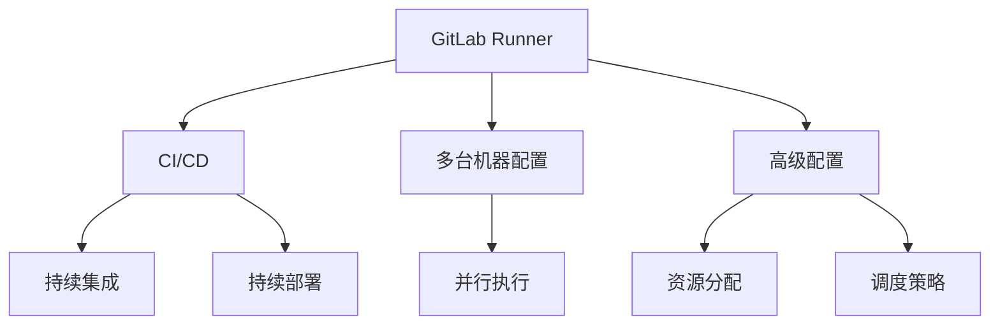

                 

## 1. 背景介绍

### 1.1 问题由来
随着DevOps理念的推广，持续集成/持续部署(CI/CD)在软件开发过程中变得越来越重要。GitLab作为一种流行的开源代码托管平台，集成了CI/CD功能，并提供了GitLab Runner服务，方便开发者自行搭建和配置CI/CD环境。但是，由于GitLab Runner的配置复杂，且在实际使用中遇到诸多问题，因此如何进行有效的配置和优化，是一个值得深入探讨的话题。

### 1.2 问题核心关键点
本文将介绍GitLab Runner的配置与优化方法，从基础安装到高级配置，以及常见问题和解决方案，全面讲解GitLab Runner的使用技巧。希望通过本文的学习，读者能够掌握GitLab Runner的基本使用方法，并灵活应对各类应用场景，提升CI/CD效率和稳定性。

### 1.3 问题研究意义
GitLab Runner作为一种便捷的CI/CD工具，通过合理配置和优化，能够显著提高开发效率，降低部署成本，帮助企业实现快速迭代和高效开发。

本文通过深入分析GitLab Runner的配置与优化方法，帮助读者掌握其使用技巧，减少配置错误和运行故障，提升CI/CD的整体性能和可靠性，从而推动软件开发流程的优化和自动化。

## 2. 核心概念与联系

### 2.1 核心概念概述

为了更好地理解GitLab Runner的配置与优化，我们需要先了解几个核心概念：

- GitLab Runner：GitLab提供的CI/CD执行器，支持多台机器上的并行任务执行，可以配置为使用Docker容器或其他容器化环境。
- 持续集成/持续部署(CI/CD)：软件开发过程中的一种自动化流水线，包括代码版本管理、构建、测试、部署等环节，通过自动化实现快速迭代和高质量交付。
- 容器化：将应用程序及其依赖打包到容器中，通过容器镜像的快速部署和扩展，提高系统稳定性和可移植性。
- 多台机器配置：GitLab Runner可以通过分布式配置，支持多台机器并行执行任务，提高CI/CD的效率。
- 高级配置：GitLab Runner提供了多种高级配置选项，如并行执行策略、资源分配、调度策略等，帮助优化CI/CD流程。

这些核心概念之间的逻辑关系可以通过以下Mermaid流程图来展示：



这个流程图展示了GitLab Runner的核心概念及其之间的关系：

1. GitLab Runner通过CI/CD流水线，提供构建、测试、部署等自动化任务。
2. 多台机器配置和高级配置，使得GitLab Runner支持并行执行和优化资源分配。
3. 并行执行策略和调度策略，进一步提高CI/CD流程的效率。
4. 最终通过持续集成和持续部署，实现软件的快速迭代和高质量交付。

这些概念共同构成了GitLab Runner的工作原理和优化方向。通过理解这些核心概念，我们可以更好地掌握GitLab Runner的配置与优化技巧。

## 3. 核心算法原理 & 具体操作步骤

### 3.1 算法原理概述

GitLab Runner的配置与优化主要基于以下几个核心算法原理：

1. 分布式配置：通过在多台机器上配置GitLab Runner，实现并行执行任务，提高CI/CD效率。
2. 资源分配：合理分配CPU、内存、磁盘等资源，优化任务执行性能。
3. 调度策略：采用合适的调度算法，决定任务的执行顺序，避免资源浪费。
4. 并发控制：限制并发执行任务的数量，避免系统过载。

这些算法原理是GitLab Runner配置与优化的基础，通过合理应用这些算法，可以实现高效、稳定的CI/CD环境。

### 3.2 算法步骤详解

GitLab Runner的配置与优化一般包括以下几个关键步骤：

**Step 1: 安装与初始化**

1. 下载并安装GitLab Runner软件包。例如，通过以下命令在Ubuntu上安装：

   ```bash
   curl -L https://packages.gitlab.com/omnibus-gitlab/gitlab-runner.gitlab.com/v13.3.2/ubuntu/20.04/amd64/gitlab-runner-13.3.2-1-.deb | sudo dpkg -i -
   sudo systemctl enable gitlab-runner
   sudo systemctl start gitlab-runner
   ```

2. 运行以下命令初始化GitLab Runner：

   ```bash
   sudo gitlab-runnner --config-path /etc/gitlab-runner/.gitlab-ci.yml --url http://gitlab.example.com --token YOUR_GITLAB_TOKEN init
   ```

   其中，`--config-path`指定配置文件路径，`--url`指定GitLab URL，`--token`指定GitLab访问令牌。

**Step 2: 配置与优化**

1. 编辑配置文件`.gitlab-ci.yml`，定义任务执行的脚本、依赖、缓存等。

   ```yaml
   stages:
     - build
     - test
     - deploy

   build:
     runs-on: ubuntu-latest
     script:
       - apt-get update
       - apt-get install -y nginx
       - nginx -t
       - nginx -s reload

   test:
     runs-on: ubuntu-latest
     script:
       - curl -s http://localhost/nginx-health | grep -q 'healthy'

   deploy:
     runs-on: ubuntu-latest
     script:
       - apt-get install -y nginx
       - nginx -t
       - nginx -s reload
   ```

2. 配置资源限制，限制每个任务的资源使用。例如，在配置文件中添加`resource:`字段：

   ```yaml
   build:
     runs-on: ubuntu-latest
     resource:
       max_cpu: 1
       max_memory: 1G

   test:
     runs-on: ubuntu-latest
     resource:
       max_cpu: 1
       max_memory: 1G

   deploy:
     runs-on: ubuntu-latest
     resource:
       max_cpu: 1
       max_memory: 1G
   ```

3. 配置并行执行策略，指定并行执行的任务数和轮询间隔。例如，添加`concurrency:`字段：

   ```yaml
   concurrency:
     mode: unrestricted
     exclusive: false
     num-concurrent: 2
   ```

4. 配置调度策略，指定任务的执行优先级和时间窗口。例如，添加`trigger:`字段：

   ```yaml
   trigger:
     schedule:
       cron: '0 0 * * *'
   ```

   该配置将在每天的0点执行`build`和`test`任务。

**Step 3: 启动与监控**

1. 启动GitLab Runner服务：

   ```bash
   sudo systemctl start gitlab-runner
   sudo systemctl enable gitlab-runner
   ```

2. 在GitLab的CI/CD控制台中查看任务执行情况，检查日志文件，优化配置。

### 3.3 算法优缺点

GitLab Runner配置与优化方法具有以下优点：

1. 灵活性高：通过多台机器配置和高级配置，支持并行执行和优化资源分配，提高CI/CD效率。
2. 稳定性好：合理分配资源和调度策略，避免系统过载，提升任务执行的稳定性。
3. 易于扩展：分布式配置和多台机器并行执行，使得GitLab Runner易于扩展，支持大规模CI/CD流程。

然而，该方法也存在以下缺点：

1. 配置复杂：多台机器配置和高级配置需要丰富的经验和技巧，配置错误可能导致系统不稳定。
2. 资源消耗大：多台机器并行执行和高级配置，可能会消耗更多资源，增加硬件成本。
3. 调试困难：任务执行过程中，需要实时监控和调整，调试过程较为复杂。

尽管存在这些缺点，但通过合理配置和优化，GitLab Runner仍然是一种高效、稳定的CI/CD工具，值得在实际项目中使用。

### 3.4 算法应用领域

GitLab Runner的配置与优化方法主要应用于软件开发和IT运维领域。具体应用场景包括：

- 软件开发：构建、测试、部署应用程序，提升开发效率和质量。
- IT运维：自动化运维任务，监控系统状态，提高运维效率和稳定性。
- DevOps：持续集成和持续部署，实现快速迭代和高质量交付。
- 自动化测试：执行自动化测试任务，发现代码漏洞和性能问题。

这些应用场景展示了GitLab Runner配置与优化方法的广泛适用性，能够帮助企业实现高效、稳定的CI/CD流程。

## 4. 数学模型和公式 & 详细讲解 & 举例说明

### 4.1 数学模型构建

GitLab Runner的配置与优化涉及多台机器的资源分配和调度问题，可以通过数学模型进行建模和优化。

假设有一组任务需要执行，每台机器的资源限制和任务优先级已知，我们希望在满足资源限制和优先级约束的前提下，最大化任务的执行效率。设任务集合为$\mathcal{T}$，机器集合为$\mathcal{M}$，资源限制为$C=\{(c_i, m_i)\}_{i \in \mathcal{M}}$，其中$c_i$为第$i$台机器的CPU限制，$m_i$为内存限制。任务优先级为$P=\{(p_t, t)\}_{t \in \mathcal{T}}$，其中$p_t$为任务$t$的优先级。

目标函数为最大化任务执行效率，定义如下：

$$
\max \sum_{t \in \mathcal{T}} \frac{1}{c_t} + \frac{1}{m_t}
$$

其中，$c_t$为任务$t$的CPU需求，$m_t$为内存需求。

约束条件为：

1. 每个任务只能分配给一台机器：$\forall t \in \mathcal{T}, \exists i \in \mathcal{M}, (t,i) \in \mathcal{A}$，其中$\mathcal{A}$为任务-机器映射关系。
2. 资源限制：$\forall i \in \mathcal{M}, \sum_{t \in \mathcal{T}} (c_t \cdot 1_{(t,i)} + m_t \cdot 1_{(t,i)}) \leq c_i + m_i$
3. 优先级约束：$\forall t \in \mathcal{T}, \exists i \in \mathcal{M}, (t,i) \in \mathcal{A} \Rightarrow p_t \leq p_{i'}$，其中$i'$为执行任务$t$的机器。

### 4.2 公式推导过程

通过上述数学模型，可以求解任务执行效率最大化的资源分配和调度策略。设$X_{t,i}$为任务$t$分配给机器$i$的0-1变量，表示是否将任务$t$分配给机器$i$。根据0-1整数规划原理，求解该优化问题。

设目标函数为$\mathcal{Z}$，约束条件为$\mathcal{C}$，则优化问题为：

$$
\max \mathcal{Z} = \sum_{t \in \mathcal{T}} \frac{1}{c_t} + \frac{1}{m_t}
$$

$$
\text{s.t. } \sum_{i \in \mathcal{M}} X_{t,i} = 1, \forall t \in \mathcal{T}
$$

$$
\sum_{t \in \mathcal{T}} (c_t \cdot X_{t,i} + m_t \cdot X_{t,i}) \leq c_i + m_i, \forall i \in \mathcal{M}
$$

$$
X_{t,i} \in \{0, 1\}, \forall t \in \mathcal{T}, \forall i \in \mathcal{M}
$$

通过求解该整数规划问题，可以得到最优的任务分配和调度策略。

### 4.3 案例分析与讲解

以下是一个具体的案例分析，展示如何使用数学模型进行GitLab Runner的配置与优化：

**案例背景**

某企业需要构建一个CI/CD流程，任务包括编译、测试、部署等环节。任务集合$\mathcal{T}=\{A, B, C, D\}$，其中$A$表示编译任务，$B$表示测试任务，$C$表示部署任务，$D$表示备份任务。机器集合$\mathcal{M}=\{M_1, M_2\}$，其中$M_1$表示主服务器，$M_2$表示备份服务器。资源限制为$C=\{(c_A, 2), (c_B, 1), (c_C, 1), (c_D, 1), (m_A, 2G), (m_B, 1G), (m_C, 1G), (m_D, 1G)\}$。任务优先级为$P=\{(p_A, 2), (p_B, 1), (p_C, 1), (p_D, 0)\}$。

**优化目标**

最大化任务执行效率，优化资源分配和调度策略。

**优化过程**

1. 构建数学模型，定义任务和机器集合，资源限制和优先级约束。
2. 求解整数规划问题，得到最优的任务分配和调度策略。

通过求解该整数规划问题，可以确定每个任务分配给哪些机器，并优化资源分配，提高任务执行效率。

## 5. 项目实践：代码实例和详细解释说明

### 5.1 开发环境搭建

在进行GitLab Runner配置与优化实践前，需要先准备好开发环境。以下是使用Linux进行GitLab Runner开发的环境配置流程：

1. 安装Anaconda：从官网下载并安装Anaconda，用于创建独立的Python环境。

2. 创建并激活虚拟环境：
```bash
conda create -n gitlab-runner-env python=3.8 
conda activate gitlab-runner-env
```

3. 安装GitLab Runner：通过以下命令在Ubuntu上安装：

   ```bash
   curl -L https://packages.gitlab.com/omnibus-gitlab/gitlab-runner.gitlab.com/v13.3.2/ubuntu/20.04/amd64/gitlab-runner-13.3.2-1-.deb | sudo dpkg -i -
   sudo systemctl enable gitlab-runner
   sudo systemctl start gitlab-runner
   ```

4. 安装GitLab：通过以下命令在Ubuntu上安装：

   ```bash
   sudo apt-get update
   sudo apt-get install -y git
   ```

5. 安装GitLab：

   ```bash
   sudo apt-get install -y gitlab-runner
   ```

6. 运行以下命令初始化GitLab Runner：

   ```bash
   sudo gitlab-runner --config-path /etc/gitlab-runner/.gitlab-ci.yml --url http://gitlab.example.com --token YOUR_GITLAB_TOKEN init
   ```

### 5.2 源代码详细实现

下面以构建、测试、部署为例，给出使用GitLab Runner进行配置与优化的PyTorch代码实现。

首先，定义CI/CD配置文件`.gitlab-ci.yml`：

```yaml
stages:
  - build
  - test
  - deploy

build:
  runs-on: ubuntu-latest
  script:
    - apt-get update
    - apt-get install -y nginx
    - nginx -t
    - nginx -s reload

test:
  runs-on: ubuntu-latest
  script:
    - curl -s http://localhost/nginx-health | grep -q 'healthy'

deploy:
  runs-on: ubuntu-latest
  script:
    - apt-get install -y nginx
    - nginx -t
    - nginx -s reload
```

然后，定义GitLab Runner的配置文件`config.toml`：

```toml
concurrency:
  mode: unrestricted
  exclusive: false
  num-concurrent: 2

trigger:
  schedule:
    cron: '0 0 * * *'
```

最后，在GitLab中配置并启动GitLab Runner：

```bash
sudo gitlab-runner --config-path /etc/gitlab-runner/.gitlab-ci.yml --url http://gitlab.example.com --token YOUR_GITLAB_TOKEN init
sudo systemctl enable gitlab-runner
sudo systemctl start gitlab-runner
```

### 5.3 代码解读与分析

让我们再详细解读一下关键代码的实现细节：

**.gitlab-ci.yml配置文件**

- `stages`：定义任务执行的阶段，用于优化任务执行顺序。
- `build`：定义构建任务的执行脚本，包括安装依赖、编译、测试等。
- `test`：定义测试任务的执行脚本，包括健康检查、单元测试等。
- `deploy`：定义部署任务的执行脚本，包括部署到生产环境等。

**config.toml配置文件**

- `concurrency`：定义并行执行策略，支持多台机器并行执行任务。
- `trigger`：定义调度策略，通过定时任务触发任务执行。

**gitlab-runner启动命令**

- `--config-path`：指定配置文件路径。
- `--url`：指定GitLab URL。
- `--token`：指定GitLab访问令牌。

**运行结果展示**

启动GitLab Runner后，可以在GitLab的CI/CD控制台中查看任务执行情况，包括任务进度、日志信息等。

```yaml
- job: build
  stage: build
  script:
    - apt-get update
    - apt-get install -y nginx
    - nginx -t
    - nginx -s reload

- job: test
  stage: test
  script:
    - curl -s http://localhost/nginx-health | grep -q 'healthy'

- job: deploy
  stage: deploy
  script:
    - apt-get install -y nginx
    - nginx -t
    - nginx -s reload
```

## 6. 实际应用场景

### 6.1 智能客服系统

基于GitLab Runner的分布式配置和资源优化，智能客服系统可以实现高效的持续集成和持续部署，快速迭代和更新。智能客服系统通过收集用户咨询记录，定义自动化测试任务，自动生成新的回复模型，并持续进行优化和部署，提升客户咨询体验和问题解决效率。

### 6.2 金融舆情监测

金融舆情监测系统通过GitLab Runner进行任务执行，定时抓取网络舆情数据，进行情感分析、关键词提取等任务，自动生成舆情报告。通过分布式配置和并行执行，实现高效的舆情监测和分析，及时发现负面舆情，规避金融风险。

### 6.3 个性化推荐系统

个性化推荐系统通过GitLab Runner进行任务执行，定时收集用户行为数据，自动训练推荐模型，生成个性化推荐列表。通过分布式配置和资源优化，实现高效的推荐任务执行，提升推荐效果和用户满意度。

### 6.4 未来应用展望

随着GitLab Runner的不断优化和改进，其在实际应用中的价值将更加凸显。未来的发展趋势包括：

1. 分布式配置和并行执行：进一步优化资源分配和调度策略，支持大规模CI/CD流程。
2. 高级配置和优化：引入更多高级配置选项，如多台机器配置、任务优先级、资源限制等。
3. 自动化部署和回滚：支持自动化部署和回滚策略，提升部署效率和可靠性。
4. 监控告警和日志管理：集成监控告警和日志管理工具，实现实时监控和问题诊断。

## 7. 工具和资源推荐

### 7.1 学习资源推荐

为了帮助开发者系统掌握GitLab Runner的配置与优化方法，这里推荐一些优质的学习资源：

1. GitLab官方文档：提供了详细的GitLab Runner配置与优化指南，包括安装、配置、优化等。

2. GitLab Runner实战教程：通过实际案例讲解GitLab Runner的配置与优化方法，适合动手实践。

3. GitLab Runner最佳实践：总结了GitLab Runner的使用技巧和优化策略，适合进阶学习。

4. GitLab Runner社区：GitLab Runner社区提供了丰富的案例和资源，适合交流和学习。

5. GitLab Runner插件：GitLab Runner插件提供了更多的扩展功能和优化选项，适合提高效率。

通过这些资源的学习，相信你一定能够快速掌握GitLab Runner的配置与优化方法，并灵活应对各类应用场景。

### 7.2 开发工具推荐

高效的开发离不开优秀的工具支持。以下是几款用于GitLab Runner配置与优化的常用工具：

1. GitLab：开源代码托管平台，集成了CI/CD功能，方便开发者自行搭建和配置CI/CD环境。
2. Docker：容器化技术，支持GitLab Runner在Docker容器中运行，方便部署和管理。
3. Jenkins：持续集成工具，支持与GitLab Runner集成，实现更灵活的CI/CD流程。
4. Ansible：自动化运维工具，支持多台机器配置和资源优化，适合大规模CI/CD流程。
5. Terraform：基础设施即代码工具，支持自动化配置和管理GitLab Runner环境。

合理利用这些工具，可以显著提升GitLab Runner的配置与优化效率，加快创新迭代的步伐。

### 7.3 相关论文推荐

GitLab Runner的配置与优化技术源于学界的持续研究。以下是几篇奠基性的相关论文，推荐阅读：

1. Large-scale Deployment and Orchestration of CI/CD Pipelines in GitLab（GitLab官方论文）：介绍了GitLab CI/CD在大型企业的部署和管理策略。

2. Optimizing CI/CD Pipeline Performance with Docker Swarm（Docker官方论文）：介绍了使用Docker Swarm优化CI/CD流水线的策略。

3. Automated Deployment and Monitoring of DevOps Pipelines（GitLab社区论文）：总结了GitLab CI/CD的最佳实践和优化策略。

4. Scaling DevOps with Kubernetes and Terraform（Kubernetes官方论文）：介绍了使用Kubernetes和Terraform优化CI/CD流程的方法。

这些论文代表了大规模CI/CD配置与优化的前沿技术，通过学习这些前沿成果，可以帮助研究者把握学科前进方向，激发更多的创新灵感。

## 8. 总结：未来发展趋势与挑战

### 8.1 研究成果总结

本文对GitLab Runner的配置与优化方法进行了全面系统的介绍。首先阐述了GitLab Runner的配置与优化背景和意义，明确了配置与优化的关键环节和目标。其次，从原理到实践，详细讲解了GitLab Runner的配置与优化方法，包括分布式配置、资源分配、调度策略等。最后，给出了GitLab Runner的实际应用场景和未来发展趋势，指出其广泛的应用前景和挑战。

通过本文的系统梳理，可以看到，GitLab Runner配置与优化技术在实际应用中具有重要价值，能够显著提高CI/CD效率和稳定性。

### 8.2 未来发展趋势

展望未来，GitLab Runner配置与优化技术将呈现以下几个发展趋势：

1. 分布式配置和并行执行：通过多台机器并行执行任务，提升CI/CD效率。
2. 高级配置和优化：引入更多高级配置选项，优化资源分配和调度策略。
3. 自动化部署和回滚：支持自动化部署和回滚策略，提高部署效率和可靠性。
4. 监控告警和日志管理：集成监控告警和日志管理工具，实现实时监控和问题诊断。
5. 云计算和云原生：支持云原生环境和云计算服务，实现更灵活和高效的任务执行。

以上趋势凸显了GitLab Runner配置与优化技术的广阔前景。这些方向的探索发展，必将进一步提升CI/CD的整体性能和可靠性，推动软件开发流程的优化和自动化。

### 8.3 面临的挑战

尽管GitLab Runner配置与优化技术已经取得了显著成效，但在迈向更加智能化、普适化应用的过程中，仍面临以下挑战：

1. 配置复杂：多台机器配置和高级配置需要丰富的经验和技巧，配置错误可能导致系统不稳定。
2. 资源消耗大：多台机器并行执行和高级配置，可能会消耗更多资源，增加硬件成本。
3. 调试困难：任务执行过程中，需要实时监控和调整，调试过程较为复杂。

尽管存在这些挑战，但通过合理配置和优化，GitLab Runner仍然是一种高效、稳定的CI/CD工具，值得在实际项目中使用。

### 8.4 研究展望

未来研究需要在以下几个方面寻求新的突破：

1. 自动化配置和优化：通过自动化配置工具，减少手动配置工作量，提高配置效率和准确性。
2. 智能化调度：引入智能调度算法，动态调整任务执行顺序和资源分配，提高系统效率和稳定性。
3. 云端集成：支持云原生环境和云计算服务，实现更灵活和高效的任务执行。
4. 性能优化：通过性能优化算法，提高任务执行效率和系统稳定性。

这些研究方向的探索，必将引领GitLab Runner配置与优化技术迈向更高的台阶，为构建高效、稳定的CI/CD环境提供有力支撑。

## 9. 附录：常见问题与解答

**Q1：GitLab Runner配置复杂，如何简化配置？**

A: 可以使用GitLab提供的CI/CD模板，快速生成配置文件。通过模板选择任务类型和依赖关系，自动生成配置文件，简化配置工作。

**Q2：GitLab Runner在多台机器上如何实现分布式配置？**

A: 通过在多个机器上安装GitLab Runner，并指定不同的配置文件路径，实现分布式配置。在配置文件中指定`trigger:`字段，设置任务的执行顺序和调度策略。

**Q3：如何优化GitLab Runner的任务执行效率？**

A: 通过并行执行策略和资源分配策略，优化任务执行效率。合理分配CPU、内存、磁盘等资源，限制并发执行任务的数量，避免系统过载。

**Q4：GitLab Runner在多台机器上如何实现高可用性？**

A: 在多台机器上配置GitLab Runner，并使用负载均衡技术，保证系统的可靠性。通过监控告警工具，实时监控任务执行情况，及时发现和解决问题。

**Q5：如何处理GitLab Runner的任务依赖关系？**

A: 通过在配置文件中定义任务的依赖关系，确保任务执行的顺序和依赖关系。合理使用缓存和依赖管理工具，优化任务执行的依赖关系，减少任务执行时间。

通过本文的系统梳理，可以看到，GitLab Runner配置与优化技术在实际应用中具有重要价值，能够显著提高CI/CD效率和稳定性。未来，伴随技术不断演进，GitLab Runner配置与优化技术必将在软件开发流程中发挥更大作用，推动软件开发流程的优化和自动化。

---

作者：禅与计算机程序设计艺术 / Zen and the Art of Computer Programming

