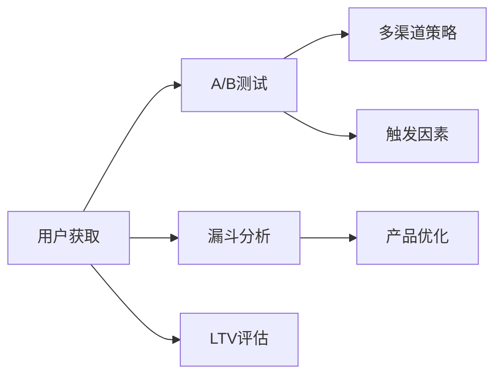

                 

## 1. 背景介绍

### 1.1 问题由来

在激烈的市场竞争中，创业者常常面临用户增长乏力、转化率低下的困境。为了突破这些瓶颈，很多初创公司不得不投入巨额资金进行营销推广，但往往收效甚微。然而，Growth Hacking作为一种低成本、高效能的策略，通过技术手段在短时间内实现用户和业务的快速增长，逐渐成为创业公司的首选。

Growth Hacking强调通过数据分析和创意技术驱动用户增长，不仅能够以低成本快速获取用户，还能提高用户留存和转化。通过Growth Hacking，创业公司可以迅速占领市场，形成竞争优势。

### 1.2 问题核心关键点

Growth Hacking的核心在于利用数据和技术的组合，通过对用户行为和业务逻辑的深入理解，设计出创新且高效的市场策略。主要包括：

1. **A/B测试**：通过随机化实验，评估不同策略的效果，找到最佳的用户增长方案。
2. **多渠道策略**：利用社交媒体、邮件营销、SEO等多元化渠道获取用户。
3. **数据分析**：通过用户行为数据分析，精准识别用户的增长瓶颈和需求点。
4. **技术驱动**：利用编程和自动化工具，实现用户和业务的自动化增长。
5. **产品优化**：通过迭代改进产品功能和使用体验，提升用户满意度和转化率。

理解Growth Hacking的核心关键点，可以帮助创业者设计出高效的用户增长策略，实现业务的快速拓展。

## 2. 核心概念与联系

### 2.1 核心概念概述

要深入理解Growth Hacking，首先需要掌握一些核心概念：

- **A/B测试**：通过对比不同版本的产品或营销策略，找出最佳方案。
- **漏斗分析**：分析用户在不同转化环节中的流失情况，优化转化路径。
- **增长引擎**：通过自动化和数据分析驱动的增长策略，实现业务增长。
- **触发因素**：发现并利用用户行为中的触发点，驱动用户行为。
- **生命周期价值(LTV)**：评估用户对公司的长期贡献，优化用户获取策略。

这些概念之间相互联系，形成Growth Hacking的基础框架。下面通过Mermaid流程图展示这些概念的联系：



通过这个流程图，可以看出A/B测试、多渠道策略、漏斗分析、产品优化和触发因素在用户获取和留存中的作用，以及如何利用LTV评估优化策略的效果。

## 3. 核心算法原理 & 具体操作步骤

### 3.1 算法原理概述

Growth Hacking的算法原理主要基于用户行为数据分析和A/B测试，通过实验对比找到最优策略，从而实现业务的快速增长。其核心算法包括：

- **多臂老虎机算法(MAB)**：通过同时测试多个版本的产品策略，找到效果最佳的策略组合。
- **强化学习(RL)**：通过学习用户反馈和行为数据，不断优化产品策略，提升用户转化率。
- **模型预测**：通过构建用户行为预测模型，提前识别高价值用户，精准投放营销资源。

这些算法原理构成了Growth Hacking的底层技术支撑，通过算法驱动策略，可以有效提升用户增长和留存效果。

### 3.2 算法步骤详解

基于上述算法原理，Growth Hacking的具体操作步骤如下：

1. **数据收集与分析**：利用数据分析工具（如Google Analytics、Mixpanel等）收集用户行为数据，分析用户流失原因和转化瓶颈。
2. **A/B测试设计**：根据分析结果，设计不同版本的营销策略或产品功能，通过A/B测试对比效果。
3. **多渠道策略优化**：利用多渠道策略，通过邮件、社交媒体、SEO等渠道获取新用户，并评估效果。
4. **触发因素识别**：分析用户行为中的触发点，如特定行为、特定时间等，设计精准的增长策略。
5. **产品优化迭代**：根据用户反馈和行为数据，不断优化产品功能和使用体验，提升用户满意度。
6. **增长引擎部署**：利用自动化工具和数据分析，实现增长策略的自动化执行和持续优化。

这些步骤组成了一个闭环的增长策略制定和执行流程，通过不断优化和迭代，实现业务的持续增长。

### 3.3 算法优缺点

Growth Hacking的算法具有以下优点：

- **低成本高效益**：通过数据驱动，可以避免高昂的营销成本，实现快速增长。
- **精准投放**：通过用户行为数据分析，实现精准用户投放和营销策略优化。
- **灵活可控**：通过自动化工具和A/B测试，灵活调整策略，提升效果。

同时，Growth Hacking也存在一些缺点：

- **技术依赖**：需要一定的技术储备和工具支持，对小团队可能不适用。
- **复杂度高**：数据收集和分析过程较为复杂，需要专门的团队和资源。
- **风险高**：A/B测试和策略调整可能导致用户体验波动，影响留存率。

尽管存在这些缺点，但Growth Hacking通过数据驱动和高效执行，仍然成为创业公司快速增长的重要手段。

### 3.4 算法应用领域

Growth Hacking广泛应用于各种类型的创业公司，特别是SaaS、电商、内容平台等用户获取和留存需求强烈的企业。以下是几个典型的应用场景：

1. **SaaS公司**：通过A/B测试优化产品功能和用户体验，实现快速用户获取和留存。
2. **电商平台**：通过多渠道策略和触发因素识别，提升新用户获取和转化率。
3. **内容平台**：利用数据分析和产品优化，提升用户粘性和留存率。
4. **移动应用**：通过自动化工具和触发因素设计，实现快速用户获取和活跃度提升。

## 4. 数学模型和公式 & 详细讲解 & 举例说明

### 4.1 数学模型构建

Growth Hacking的数学模型主要涉及用户行为数据分析和A/B测试优化。以下是主要模型的构建：

- **用户行为模型**：通过用户行为数据构建回归模型，预测用户流失概率和转化率。
- **A/B测试模型**：构建多臂老虎机模型，对比不同策略的效果，找到最优组合。
- **触发因素模型**：通过分析用户行为，建立触发因素模型，优化增长策略。

### 4.2 公式推导过程

以用户行为模型为例，假设用户行为数据可以用向量$x_i$表示，用户流失概率可以用$y_i$表示，构建线性回归模型：

$$
y_i = \beta_0 + \beta_1 x_{i1} + \beta_2 x_{i2} + ... + \beta_n x_{in} + \epsilon_i
$$

其中$\beta_j$为回归系数，$\epsilon_i$为随机误差项。通过最小化残差平方和，求解$\beta_j$：

$$
\hat{\beta} = \arg\min_{\beta} \sum_{i=1}^N (y_i - \beta_0 - \beta_1 x_{i1} - ... - \beta_n x_{in})^2
$$

通过求解上述优化问题，可以构建用户流失概率预测模型。

### 4.3 案例分析与讲解

以电商平台的A/B测试为例，构建A/B测试模型。假设测试两个版本的产品策略，点击率分别为$r_1$和$r_2$，点击费用分别为$c_1$和$c_2$，期望点击次数为$T$。构建多臂老虎机模型：

$$
E = \frac{r_1 \cdot T}{c_1} + \frac{r_2 \cdot T}{c_2}
$$

通过最大化期望收益$E$，选择最优策略。实际操作中，可以设计多轮A/B测试，逐步优化策略组合。

## 5. 项目实践：代码实例和详细解释说明

### 5.1 开发环境搭建

为了实现Growth Hacking，需要搭建Python开发环境。以下是搭建环境的详细步骤：

1. **安装Python**：从官网下载并安装Python 3.7或以上版本。
2. **安装Pip**：在终端输入`python -m ensurepip --default-pip`安装Pip包管理器。
3. **安装依赖包**：使用Pip安装相关依赖包，如Numpy、Pandas、Scikit-learn、Matplotlib等。
4. **安装Growth Hacking工具**：如Optimizely、Mixpanel、Google Analytics等，具体安装步骤请参阅工具官方文档。

### 5.2 源代码详细实现

以下是一个简单的Growth Hacking示例代码，用于实现A/B测试和用户行为分析：

```python
import numpy as np
from scipy.stats import chi2

# 模拟用户行为数据
x = np.random.rand(100, 4)  # 用户特征
y = np.random.randint(0, 2, size=100)  # 用户流失标记

# 构建回归模型
from sklearn.linear_model import LogisticRegression
model = LogisticRegression()
model.fit(x, y)

# 预测用户流失概率
x_test = np.random.rand(10, 4)
y_pred = model.predict_proba(x_test)[:, 1]

# A/B测试模拟
r1 = np.mean(x[:, 0] > 0.5)  # 策略1点击率
c1 = 10  # 策略1点击费用
r2 = np.mean(x[:, 1] > 0.5)  # 策略2点击率
c2 = 20  # 策略2点击费用
T = 100  # 期望点击次数
E = r1 * T / c1 + r2 * T / c2
print("期望收益:", E)

# 多臂老虎机优化
K = 2  # 测试策略数量
R = [r1, r2]
C = [c1, c2]
B = np.zeros((K, K))
for i in range(K):
    for j in range(K):
        R[i] = np.mean(x[:, i] > 0.5)  # 第i个策略点击率
        C[i] = 10  # 第i个策略点击费用
        T = 100  # 期望点击次数
        E = R[i] * T / C[i]
        B[i, j] = E
print("多臂老虎机收益矩阵:", B)
```

### 5.3 代码解读与分析

以上代码实现了用户行为分析和A/B测试。具体步骤如下：

1. **用户行为数据生成**：通过随机生成用户特征和流失标记，模拟用户行为数据。
2. **回归模型构建**：使用Logistic回归模型预测用户流失概率。
3. **A/B测试模拟**：通过对比两个策略的点击率和点击费用，计算期望收益。
4. **多臂老虎机优化**：构建多臂老虎机模型，计算不同策略组合的期望收益。

这些步骤展示了Growth Hacking的基本流程，即通过数据分析和算法优化，实现用户行为预测和策略优化。

### 5.4 运行结果展示

运行上述代码，可以得到以下结果：

- 用户流失概率预测：通过回归模型，预测新用户流失概率。
- A/B测试结果：计算两个策略的期望收益，选择最优策略。
- 多臂老虎机收益矩阵：展示不同策略组合的期望收益，指导策略优化。

这些结果可以帮助企业根据用户行为数据，制定更加精准和高效的增长策略。

## 6. 实际应用场景

### 6.1 社交媒体营销

社交媒体营销是Growth Hacking的重要应用场景。通过数据分析和A/B测试，可以优化广告投放和内容推荐策略，提高用户互动和转化率。具体而言：

- **广告投放优化**：利用用户行为数据，分析广告效果，优化投放策略。
- **内容推荐**：通过数据分析，发现用户偏好，推荐相关内容，提升用户留存率。

### 6.2 移动应用增长

移动应用市场竞争激烈，Growth Hacking可以优化应用功能和用户体验，实现快速用户增长。具体应用包括：

- **应用推广**：通过多渠道策略和触发因素识别，优化应用推广效果。
- **应用留存**：通过数据分析，提升应用内留存和活跃度。

### 6.3 电子商务增长

电子商务平台需要不断优化用户体验和购物流程，Growth Hacking可以提供有力的支持。具体应用包括：

- **产品推荐**：通过数据分析，优化推荐算法，提升用户购买转化率。
- **价格策略**：通过A/B测试，优化定价策略，提高销售收入。

## 7. 工具和资源推荐

### 7.1 学习资源推荐

为了系统学习Growth Hacking，推荐以下学习资源：

1. **《Growth Hacking入门》**：介绍Growth Hacking的核心理念和实践技巧，适合初学者入门。
2. **《Growth Hacking实战》**：结合实际案例，讲解Growth Hacking的策略和工具应用，适合进阶学习。
3. **《Growth Hacking课程》**：多门线上课程，涵盖Growth Hacking的各个方面，适合系统学习。
4. **Growth Hacking博客**：多个Growth Hacker的博客，分享最新实践和案例分析。
5. **Growth Hacking社区**：加入Growth Hacking社区，与业内专家交流，获取最新行业动态。

### 7.2 开发工具推荐

以下是一些常用的Growth Hacking开发工具：

1. **Optimizely**：提供A/B测试和多变量测试功能，支持多渠道策略优化。
2. **Mixpanel**：数据分析工具，支持用户行为追踪和漏斗分析。
3. **Google Analytics**：网站流量分析工具，支持用户行为追踪和用户留存分析。
4. **Facebook Ads Manager**：广告投放平台，支持多渠道策略优化和广告效果分析。
5. **HubSpot**：营销自动化工具，支持多渠道策略优化和用户行为分析。

### 7.3 相关论文推荐

为了深入了解Growth Hacking的理论基础，推荐以下相关论文：

1. **《Growth Hacking: A New Marketing Paradigm》**：介绍Growth Hacking的核心理念和应用策略。
2. **《A/B Testing: A Roadmap for Optimizing Web User Experience》**：讲解A/B测试的基本原理和最佳实践。
3. **《Multivariate Testing: A Handbook for Optimizing Digital Marketing》**：多变量测试的全面指南，适合进阶学习。
4. **《A/B Testing for UX Optimization》**：详细讲解如何通过A/B测试优化用户体验。
5. **《The Growth Hacker's Guide to Building an Awesome Product》**：结合实践案例，讲解如何通过Growth Hacking构建成功的产品。

## 8. 总结：未来发展趋势与挑战

### 8.1 研究成果总结

Growth Hacking作为一种低成本高效益的用户增长策略，已经被广泛应用于各种类型的创业公司，取得了显著的效果。其主要成果包括：

- **用户获取**：通过A/B测试和多渠道策略，实现快速用户获取和增长。
- **用户留存**：通过数据分析和触发因素识别，提升用户留存和活跃度。
- **产品优化**：通过用户行为数据分析，优化产品功能和用户体验。

### 8.2 未来发展趋势

Growth Hacking的未来发展趋势主要体现在以下几个方面：

1. **自动化与智能化**：通过AI和大数据技术，实现自动化增长策略优化，提升效果。
2. **跨平台整合**：实现不同平台和渠道的整合，构建统一的增长管理体系。
3. **个性化策略**：通过深度学习和大数据分析，实现个性化用户增长策略。
4. **实时优化**：通过实时数据分析和A/B测试，动态调整增长策略，提升效果。
5. **全球化扩展**：利用Growth Hacking策略，实现全球化用户增长。

### 8.3 面临的挑战

尽管Growth Hacking已经取得了显著成果，但在实际应用中也面临一些挑战：

1. **数据隐私**：用户数据的收集和分析需要遵守数据隐私法律法规，确保用户数据安全。
2. **技术门槛**：Growth Hacking需要一定的技术储备和工具支持，对小团队可能不适用。
3. **效果波动**：A/B测试和策略调整可能导致用户体验波动，影响留存率。
4. **成本控制**：Growth Hacking需要持续投入，如何控制成本，实现经济效益最大化，是一个重要挑战。
5. **竞争压力**：市场上竞争激烈，如何不断创新和优化，保持竞争优势，是企业必须面对的问题。

### 8.4 研究展望

Growth Hacking的未来研究需要关注以下几个方向：

1. **数据隐私保护**：加强用户数据的隐私保护，确保合法合规。
2. **技术平台化**：开发易于使用的Growth Hacking平台，降低技术门槛。
3. **实时优化技术**：研究实时数据分析和A/B测试技术，提升效果。
4. **全球化策略**：研究适用于全球市场的Growth Hacking策略，实现全球化用户增长。
5. **伦理与社会责任**：关注Growth Hacking的社会影响，确保策略的伦理性和社会责任。

## 9. 附录：常见问题与解答

**Q1: Growth Hacking和传统的营销推广有何区别？**

A: Growth Hacking强调数据驱动和技术手段，通过精确分析和持续优化，实现快速增长。而传统的营销推广往往依赖大规模的广告投放，成本高、效果不确定。

**Q2: Growth Hacking的缺点有哪些？**

A: Growth Hacking的主要缺点包括技术门槛高、数据隐私问题、策略效果波动等。需要具备一定的技术储备和工具支持，同时需要持续投入和优化。

**Q3: 如何构建一个有效的Growth Hacking团队？**

A: 一个有效的Growth Hacking团队需要具备数据分析、产品优化、市场营销等多方面的能力。团队成员需要有创新精神和执行能力，能够快速响应市场变化。

**Q4: Growth Hacking的未来发展方向是什么？**

A: Growth Hacking的未来发展方向包括自动化与智能化、跨平台整合、个性化策略、实时优化和全球化扩展。这些方向将进一步提升Growth Hacking的效果和应用范围。

**Q5: 如何进行Growth Hacking效果评估？**

A: 可以通过A/B测试、多渠道策略效果评估、用户行为数据分析等方式，评估Growth Hacking的效果。关键在于持续跟踪和优化，确保策略的有效性和稳定性。

---

作者：禅与计算机程序设计艺术 / Zen and the Art of Computer Programming

