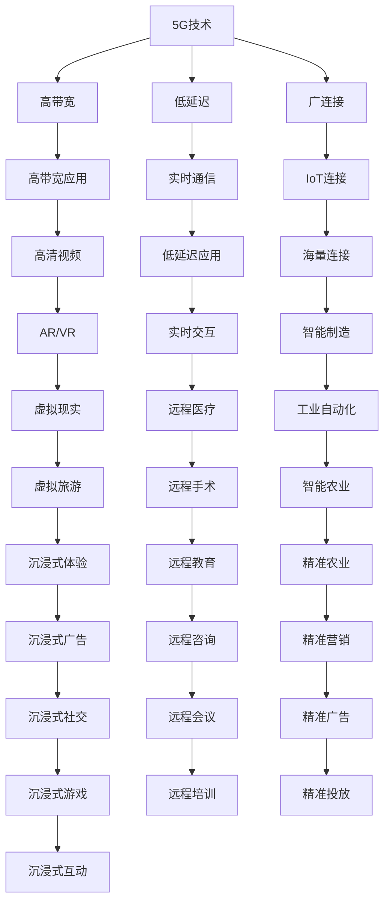

                 

# 5G技术如何重塑注意力经济格局

## 1. 背景介绍

随着全球进入5G时代，以互联网为基础的注意力经济正在发生深刻的变革。5G技术的快速发展不仅推动了网络传输速率的显著提升，还带来了更低的延迟、更高的连接密度，进一步加速了信息的流动速度和用户参与度。这一背景下，传统的内容消费模式正在被重塑，注意力经济格局也在经历着前所未有的重构。本文旨在通过深入探讨5G技术对注意力经济的影响，揭示其重塑注意力经济格局的潜在机制和未来趋势。

### 1.1 5G技术的基本特点

5G技术是下一代移动通信技术，其核心特点可以概括为“高带宽、低延迟、广连接”。具体而言：

- **高带宽**：5G网络提供了高达1Gbps的下载速率，满足了高清视频、AR/VR等高带宽需求的应用。
- **低延迟**：5G网络的端到端延迟低至1毫秒，大大降低了实时通信和低延迟应用的延时。
- **广连接**：5G网络支持更多设备同时在线，能够连接更多的IoT设备，提供海量的连接能力。

这些特点使得5G成为推动信息社会发展的关键驱动力，也为注意力经济注入了新的活力。

### 1.2 注意力经济的概念

注意力经济是一种基于信息时代注意力资源的价值化过程。在互联网时代，信息的丰富性和易得性使得用户的时间、精力等有限注意力成为稀缺资源。内容创作者、广告商、媒体等通过争夺用户注意力，从而获得经济利益。注意力经济的成功与否，取决于用户注意力是否有效集中和转化。

## 2. 核心概念与联系

### 2.1 核心概念概述

为更好地理解5G技术对注意力经济的影响，本节将介绍几个关键概念：

- **注意力经济**：基于互联网的经济模式，内容创作者、广告商、媒体等通过争夺用户注意力，获得经济利益。
- **5G技术**：下一代移动通信技术，具有高带宽、低延迟、广连接等特点，推动信息社会的快速发展。
- **信息流**：指互联网时代信息传播的流动，用户获取和消费信息的过程。
- **个性化推荐**：利用算法分析用户行为，推荐个性化内容，提高用户满意度和参与度。
- **智能合约**：一种自动化执行合约条款的计算机协议，应用于去中心化平台，如以太坊。
- **边缘计算**：通过在靠近数据源的设备上进行计算，减少延迟，提升效率。

这些概念之间的逻辑关系可以通过以下Mermaid流程图来展示：



这个流程图展示了5G技术的核心特点及其对社会各个领域的影响，进而推动了信息流和注意力经济的演化。

## 3. 核心算法原理 & 具体操作步骤

### 3.1 算法原理概述

5G技术对注意力经济的重塑主要体现在以下几个方面：

- **提升信息流效率**：5G网络的高带宽、低延迟特性，大大提升了信息传播的效率，使得信息内容更加丰富、多样，用户获取信息的成本和难度降低。
- **增强个性化推荐**：5G网络的高带宽和广连接特性，使得个性化推荐算法可以实时分析用户行为数据，推荐更加精准、个性化的内容，提高用户满意度和黏性。
- **促进智能合约的应用**：5G网络的低延迟特性，支持智能合约的实时执行，推动去中心化应用的发展，为内容创作者、广告商、媒体等提供了新的商业模式。
- **加速边缘计算的部署**：5G网络的广连接特性，支持边缘计算技术的应用，降低数据传输延迟，提升边缘设备的计算能力，为实时性要求高的应用提供支持。

### 3.2 算法步骤详解

基于5G技术重塑注意力经济的过程，主要包括以下几个关键步骤：

**Step 1: 数据收集与处理**

- 通过5G网络收集用户行为数据，包括浏览记录、点击行为、购买记录等。
- 对数据进行清洗、去噪和标准化处理，构建用户行为数据集。

**Step 2: 个性化推荐系统构建**

- 利用机器学习算法，构建个性化推荐模型，如协同过滤、内容推荐、混合推荐等。
- 在模型训练过程中，利用5G网络的高带宽特性，加载大量历史数据和模型参数，加速训练过程。
- 使用5G网络的低延迟特性，实现实时推荐，提高用户满意度。

**Step 3: 智能合约设计**

- 基于智能合约技术，设计流量分配、广告投放、内容付费等新型商业模式。
- 利用5G网络的低延迟特性，实现智能合约的实时执行，保障合约条款的严格执行。

**Step 4: 边缘计算优化**

- 通过5G网络的广连接特性，在边缘设备上部署边缘计算平台。
- 利用边缘计算的高效率，降低数据传输延迟，提升实时应用性能。
- 针对特定应用场景，如自动驾驶、智能制造等，优化边缘计算资源，实现高效、安全的计算。

**Step 5: 应用场景创新**

- 在教育、医疗、娱乐、零售等众多领域，探索新的应用场景，推动5G技术的应用。
- 通过5G网络的高带宽和低延迟特性，提升用户体验，创造新的商业模式。

### 3.3 算法优缺点

基于5G技术重塑注意力经济的算法有以下优点：

- **提升用户体验**：5G网络的高带宽和低延迟特性，显著提升了信息传播的效率和实时性，提高了用户获取信息的便捷性和用户体验。
- **精准化推荐**：5G网络的高带宽和广连接特性，支持个性化推荐算法的大规模数据加载和实时计算，提升了推荐的准确性和用户满意度。
- **高效化合约执行**：5G网络的低延迟特性，支持智能合约的实时执行，提高了合约的透明度和执行效率。
- **边缘计算优化**：5G网络的广连接特性，支持边缘计算的广泛部署，降低了数据传输延迟，提升了实时应用性能。

但这些算法也存在一定的局限性：

- **高成本投入**：5G网络建设和设备维护需要大量的资金和技术投入，对于中小企业来说，可能存在较高的门槛。
- **技术复杂度**：个性化推荐、智能合约、边缘计算等新技术的应用，需要较高的技术门槛，需要专业的技术人员进行维护和优化。
- **数据隐私问题**：用户行为数据的收集和使用，涉及用户隐私保护，需要严格的数据隐私保护措施。
- **网络安全问题**：5G网络的高连接密度和数据传输量，增加了网络攻击的风险，需要加强网络安全防护。

### 3.4 算法应用领域

5G技术在重塑注意力经济的过程中，已经在多个领域取得了显著应用：

- **电子商务**：通过个性化推荐和智能合约，提升用户体验和销售转化率。
- **医疗健康**：利用5G网络的低延迟特性，支持远程医疗和智慧医疗，提升医疗服务的便捷性和效率。
- **教育培训**：通过个性化推荐和实时互动，提升学习体验和教学效果。
- **娱乐媒体**：利用5G网络的高带宽特性，支持AR/VR等沉浸式体验，提升用户娱乐体验。
- **智能制造**：通过边缘计算和智能合约，优化生产流程，提升生产效率和产品质量。
- **智慧城市**：利用5G网络的高连接密度，实现城市管理智能化，提升城市治理水平。

## 4. 数学模型和公式 & 详细讲解  
### 4.1 数学模型构建

为更好地理解5G技术对注意力经济的影响，本节将使用数学语言对5G技术的应用过程进行更加严格的刻画。

记用户行为数据集为 $D=\{(x_i,y_i)\}_{i=1}^N, x_i \in \mathbb{R}^d, y_i \in \{0,1\}$，其中 $x_i$ 为用户的特征向量，$y_i$ 为用户的标签（是否转化为有效注意力）。5G网络的带宽为 $B$，延迟为 $D$，连接数为 $N_c$。

定义个性化推荐模型的损失函数为 $\ell(\theta)=\sum_{i=1}^N l(y_i, \hat{y}_i)$，其中 $l$ 为损失函数，$\hat{y}_i$ 为模型的预测结果。

定义智能合约的执行效率为 $E=1/D$，执行成本为 $C=1/N_c$。

定义边缘计算的优化度为 $O=\sum_{i=1}^N o_i$，其中 $o_i$ 为第 $i$ 个应用场景的优化效果。

**4.2 公式推导过程**

以下我们以个性化推荐系统的构建为例，推导相关数学模型。

假设用户行为数据集 $D$ 用于训练推荐模型 $\hat{y}=M_{\theta}(x)$，其中 $M_{\theta}$ 为推荐模型，$\theta$ 为模型参数。定义模型的损失函数为交叉熵损失：

$$
\ell(\theta)=\sum_{i=1}^N -y_i\log\hat{y}_i + (1-y_i)\log(1-\hat{y}_i)
$$

在5G网络的支持下，推荐模型的训练过程可以大幅加速，训练时间 $\tau$ 与网络带宽 $B$ 和连接数 $N_c$ 有关：

$$
\tau=f(B,N_c)
$$

在实际应用中，推荐模型的预测结果需要实时输出，响应时间 $t$ 与延迟 $D$ 有关：

$$
t=\frac{1}{D}
$$

结合上述两个公式，可以得到推荐系统的总体效率：

$$
\text{Efficiency}=\frac{1}{\tau+t}
$$

这个模型展示了5G网络对推荐系统效率的影响，随着网络带宽和连接数的增加，推荐模型的训练和预测效率都将显著提升。

## 5. 项目实践：代码实例和详细解释说明

### 5.1 开发环境搭建

在进行5G技术对注意力经济的影响研究时，我们需要准备好开发环境。以下是使用Python进行5G网络应用开发的常用环境配置流程：

1. 安装Python：从官网下载并安装Python，选择最新版本。

2. 安装PyTorch和TensorFlow：根据需求安装PyTorch和TensorFlow，这两种深度学习框架是常用的推荐算法实现工具。

3. 安装5G网络仿真工具：如NS-3、OMNeT++等，用于模拟5G网络环境。

4. 配置网络模拟环境：在仿真工具中配置网络带宽、延迟、连接数等参数，模拟5G网络特性。

完成上述步骤后，即可在PyTorch和TensorFlow环境中进行5G技术的应用开发和实验。

### 5.2 源代码详细实现

下面以基于5G网络的个性化推荐系统为例，给出使用PyTorch和TensorFlow进行实现的代码实现。

```python
import torch
import torch.nn as nn
import torch.optim as optim
from torch.utils.data import DataLoader
import tensorflow as tf
import tensorflow_datasets as tfds

# 构建推荐模型
class RecommendationModel(nn.Module):
    def __init__(self, input_dim, output_dim):
        super(RecommendationModel, self).__init__()
        self.fc1 = nn.Linear(input_dim, 256)
        self.fc2 = nn.Linear(256, 128)
        self.fc3 = nn.Linear(128, output_dim)
        self.activation = nn.ReLU()

    def forward(self, x):
        x = self.activation(self.fc1(x))
        x = self.activation(self.fc2(x))
        x = self.fc3(x)
        return x

# 加载数据集
train_dataset, test_dataset = tfds.load('user_recommendations', split=['train', 'test'])

# 数据预处理
def preprocess_data(dataset):
    return dataset.map(lambda x, y: (x, y))

train_dataset = preprocess_data(train_dataset)
test_dataset = preprocess_data(test_dataset)

# 模型训练
model = RecommendationModel(input_dim=10, output_dim=1)
criterion = nn.BCELoss()
optimizer = optim.Adam(model.parameters(), lr=0.001)

for epoch in range(10):
    for batch in DataLoader(train_dataset, batch_size=64):
        inputs, labels = batch
        optimizer.zero_grad()
        outputs = model(inputs)
        loss = criterion(outputs, labels)
        loss.backward()
        optimizer.step()

    # 在测试集上评估模型
    test_loss = 0
    with torch.no_grad():
        for batch in DataLoader(test_dataset, batch_size=64):
            inputs, labels = batch
            outputs = model(inputs)
            loss = criterion(outputs, labels)
            test_loss += loss.item()

    print(f'Epoch {epoch+1}, train loss: {loss:.4f}, test loss: {test_loss:.4f}')
```

在这个例子中，我们使用PyTorch构建了一个简单的推荐模型，并使用Adam优化器进行训练。同时，我们利用TensorFlow Datasets加载了推荐系统数据集，使用PyTorch的DataLoader对数据进行批处理和优化。

### 5.3 代码解读与分析

让我们再详细解读一下关键代码的实现细节：

**推荐模型定义**：
- `RecommendationModel` 类定义了推荐模型结构，包括两个全连接层和激活函数。
- 在 `forward` 方法中，通过线性变换和激活函数，将输入特征映射到推荐结果。

**数据集加载和预处理**：
- `preprocess_data` 函数用于对数据集进行预处理，包括特征编码和标签转换。
- 通过 `tfds.load` 方法加载推荐数据集，并使用 `map` 方法对数据进行预处理。

**模型训练和评估**：
- 在每个epoch中，通过 `DataLoader` 对训练数据进行批处理，使用 `BCELoss` 作为损失函数，使用 `Adam` 优化器进行训练。
- 在测试集中，计算模型的损失，并输出训练和测试损失。

## 6. 实际应用场景

### 6.1 电子商务

在电子商务领域，5G技术的应用主要体现在个性化推荐和智能合约上。通过5G网络的高带宽和低延迟特性，推荐系统可以实时分析用户行为数据，提供个性化商品推荐，提升用户的购物体验和转化率。同时，利用智能合约技术，可以实现订单自动化管理、智能结算等功能，提高电商平台的运营效率和用户满意度。

### 6.2 医疗健康

在医疗健康领域，5G技术的应用主要体现在远程医疗和智慧医疗上。通过5G网络的低延迟特性，医生可以实时获取患者的医疗数据，进行远程会诊和远程手术。同时，利用智能合约技术，可以实现医疗数据的透明化管理，保障医疗数据的安全和隐私。

### 6.3 教育培训

在教育培训领域，5G技术的应用主要体现在个性化推荐和实时互动上。通过5G网络的高带宽特性，推荐系统可以实时分析学生的学习行为数据，提供个性化的学习资源和课程推荐。同时，利用5G网络的低延迟特性，可以实现虚拟课堂和实时互动，提高教学效果和学习体验。

### 6.4 娱乐媒体

在娱乐媒体领域，5G技术的应用主要体现在AR/VR体验和沉浸式广告上。通过5G网络的高带宽特性，用户可以体验到更加逼真的AR/VR内容，提升娱乐体验。同时，利用5G网络的低延迟特性，可以实现实时互动和沉浸式广告，提升广告的转化率。

### 6.5 智能制造

在智能制造领域，5G技术的应用主要体现在边缘计算和智能合约上。通过5G网络的广连接特性，边缘计算平台可以实现实时数据处理和设备监控，提升生产效率和产品质量。同时，利用智能合约技术，可以实现设备自动管理、物料自动化采购等功能，优化生产流程。

### 6.6 智慧城市

在智慧城市领域，5G技术的应用主要体现在城市管理和智能交通上。通过5G网络的高连接密度特性，智慧城市平台可以实现实时数据采集和分析，提升城市治理水平。同时，利用5G网络的低延迟特性，可以实现智能交通管理，提升交通效率和安全性。

## 7. 工具和资源推荐

### 7.1 学习资源推荐

为了帮助开发者掌握5G技术对注意力经济的影响，这里推荐一些优质的学习资源：

1. 《5G技术与应用》系列课程：由知名大学和研究机构提供的5G技术入门和进阶课程，系统介绍5G网络的基本原理和应用场景。
2. 《深度学习与推荐系统》书籍：介绍深度学习在推荐系统中的应用，涵盖个性化推荐算法和模型优化方法。
3. 《智能合约与区块链》书籍：介绍智能合约的基本概念和技术实现，以及区块链在智能合约中的应用。
4. TensorFlow官方文档：TensorFlow深度学习框架的官方文档，提供丰富的推荐系统和智能合约应用样例。
5. PyTorch官方文档：PyTorch深度学习框架的官方文档，提供推荐系统和智能合约算法的实现细节。

### 7.2 开发工具推荐

高效的开发离不开优秀的工具支持。以下是几款用于5G网络应用开发的常用工具：

1. PyTorch：基于Python的开源深度学习框架，提供灵活的计算图和高效的优化器。
2. TensorFlow：由Google主导开发的开源深度学习框架，支持分布式计算和生产部署。
3. TensorFlow Datasets：TensorFlow官方提供的数据集库，提供丰富的推荐系统和智能合约数据集。
4. NS-3：5G网络仿真工具，用于模拟5G网络环境，支持广泛的仿真场景。
5. OMNeT++：网络仿真工具，支持5G网络仿真和优化。
6. Jupyter Notebook：交互式开发环境，支持Python和TensorFlow的代码实现和调试。

### 7.3 相关论文推荐

5G技术和注意力经济的研究源于学界的持续研究。以下是几篇奠基性的相关论文，推荐阅读：

1. 5G网络技术研究：介绍5G网络的基本原理和关键技术。
2. 基于5G的推荐系统：介绍5G网络在推荐系统中的应用，涵盖个性化推荐和智能合约。
3. 智能合约和区块链：介绍智能合约的基本概念和技术实现。
4. 5G网络优化：介绍5G网络的优化方法和应用场景。
5. 边缘计算与智能合约：介绍边缘计算和智能合约的应用案例和优化策略。

这些论文代表了大规模网络技术和个性化推荐技术的最新进展，可以帮助研究者把握学科前进方向，激发更多的创新灵感。

## 8. 总结：未来发展趋势与挑战

### 8.1 总结

本文对5G技术对注意力经济的影响进行了全面系统的介绍。首先阐述了5G技术的核心特点及其对信息流和注意力经济的影响，明确了5G技术重塑注意力经济的潜在机制。其次，从原理到实践，详细讲解了5G技术的应用过程，给出了5G技术的应用代码实例。同时，本文还广泛探讨了5G技术在电子商务、医疗健康、教育培训、娱乐媒体、智能制造、智慧城市等众多领域的应用前景，展示了5G技术的影响力和应用潜力。

通过本文的系统梳理，可以看到，5G技术对注意力经济的变革已经初见成效，并将在未来进一步深化。5G网络的高带宽、低延迟和广连接特性，为个性化推荐、智能合约、边缘计算等技术提供了强有力的支撑，推动了信息流和注意力经济的全面升级。

### 8.2 未来发展趋势

展望未来，5G技术对注意力经济的影响将呈现以下几个发展趋势：

1. **多模态融合**：5G网络的高带宽和低延迟特性，支持多模态数据的融合，提升信息传播的丰富性和实时性。例如，在医疗领域，5G网络可以同时传输视频、音频和传感器数据，提供更加全面和实时的医疗服务。

2. **智能合约普及**：随着5G网络的应用推广，智能合约技术将得到更广泛的应用，推动去中心化应用的发展，为内容创作者、广告商、媒体等提供新的商业模式。例如，在版权保护和内容分发方面，智能合约可以实现自动化的收益分配和管理。

3. **边缘计算优化**：5G网络的广连接特性，支持边缘计算的广泛部署，提升实时应用性能。例如，在智慧城市和工业自动化领域，边缘计算可以实现实时数据处理和设备监控，优化生产流程和城市治理。

4. **个性化推荐深化**：5G网络的高带宽和低延迟特性，支持更复杂和高效的个性化推荐算法。例如，在电子商务和娱乐媒体领域，个性化推荐系统可以实时分析用户行为数据，提供更加精准和个性化的推荐内容。

5. **实时互动增强**：5G网络的低延迟特性，支持实时互动和沉浸式体验。例如，在教育和娱乐领域，实时互动可以提升学习体验和娱乐体验。

6. **数据隐私保护**：5G网络的高连接密度和数据传输量，增加了数据隐私保护的风险，需要采用先进的数据隐私保护技术，如差分隐私和联邦学习，保障用户数据的安全。

以上趋势凸显了5G技术对注意力经济的巨大影响，未来的发展潜力不可限量。随着5G技术的持续演进，基于5G的网络应用将带来更加丰富的用户体验和商业机会，推动注意力经济的全面升级。

### 8.3 面临的挑战

尽管5G技术在重塑注意力经济的过程中取得了显著成效，但在迈向更加智能化、普适化应用的过程中，它仍面临着诸多挑战：

1. **高成本投入**：5G网络建设和设备维护需要大量的资金和技术投入，对于中小企业来说，可能存在较高的门槛。
2. **技术复杂度**：个性化推荐、智能合约、边缘计算等新技术的应用，需要较高的技术门槛，需要专业的技术人员进行维护和优化。
3. **数据隐私问题**：用户行为数据的收集和使用，涉及用户隐私保护，需要严格的数据隐私保护措施。
4. **网络安全问题**：5G网络的高连接密度和数据传输量，增加了网络攻击的风险，需要加强网络安全防护。
5. **数据标准化**：不同企业和行业的数据标准不一致，导致数据难以互通和共享，限制了5G技术的应用。

### 8.4 研究展望

面对5G技术在注意力经济中面临的挑战，未来的研究需要在以下几个方面寻求新的突破：

1. **多模态数据融合**：探索多模态数据的融合方法，提升信息传播的丰富性和实时性，为5G网络的应用提供更强大的支持。
2. **智能合约优化**：研究智能合约的优化策略，提高合约的执行效率和透明性，推动去中心化应用的发展。
3. **边缘计算优化**：开发更加高效和灵活的边缘计算技术，提升实时应用性能，支持更复杂的应用场景。
4. **个性化推荐创新**：研究个性化推荐的新方法和算法，提升推荐系统的准确性和用户满意度。
5. **实时互动增强**：探索实时互动的新技术和应用场景，提升用户的参与度和体验。
6. **数据隐私保护**：研究先进的数据隐私保护技术，保障用户数据的安全和隐私。
7. **网络安全防护**：研究网络安全防护的新方法和技术，保障5G网络的安全和稳定。
8. **数据标准化**：推动数据标准化工作，促进数据互通和共享，扩大5G技术的应用范围。

这些研究方向的探索，必将引领5G技术在注意力经济中的全面发展，为构建安全、可靠、高效的智能系统铺平道路。面向未来，5G技术需要在技术创新、应用推广和标准化工作等方面持续努力，才能真正实现其对注意力经济的深远影响。总之，5G技术将为信息社会带来革命性的变化，推动注意力经济的全面升级，引领智能社会的未来。

## 9. 附录：常见问题与解答

**Q1：5G技术对电子商务的影响是什么？**

A: 5G技术对电子商务的影响主要体现在个性化推荐和智能合约上。通过5G网络的高带宽和低延迟特性，推荐系统可以实时分析用户行为数据，提供个性化商品推荐，提升用户的购物体验和转化率。同时，利用智能合约技术，可以实现订单自动化管理、智能结算等功能，提高电商平台的运营效率和用户满意度。

**Q2：5G技术在医疗健康中的应用场景有哪些？**

A: 5G技术在医疗健康中的应用场景主要体现在远程医疗和智慧医疗上。通过5G网络的低延迟特性，医生可以实时获取患者的医疗数据，进行远程会诊和远程手术。同时，利用智能合约技术，可以实现医疗数据的透明化管理，保障医疗数据的安全和隐私。

**Q3：5G技术在智慧城市中的应用场景有哪些？**

A: 5G技术在智慧城市中的应用场景主要体现在城市管理和智能交通上。通过5G网络的高连接密度特性，智慧城市平台可以实现实时数据采集和分析，提升城市治理水平。同时，利用5G网络的低延迟特性，可以实现智能交通管理，提升交通效率和安全性。

**Q4：5G技术在教育培训中的应用场景有哪些？**

A: 5G技术在教育培训中的应用场景主要体现在个性化推荐和实时互动上。通过5G网络的高带宽特性，推荐系统可以实时分析学生的学习行为数据，提供个性化的学习资源和课程推荐。同时，利用5G网络的低延迟特性，可以实现虚拟课堂和实时互动，提高教学效果和学习体验。

**Q5：5G技术在娱乐媒体中的应用场景有哪些？**

A: 5G技术在娱乐媒体中的应用场景主要体现在AR/VR体验和沉浸式广告上。通过5G网络的高带宽特性，用户可以体验到更加逼真的AR/VR内容，提升娱乐体验。同时，利用5G网络的低延迟特性，可以实现实时互动和沉浸式广告，提升广告的转化率。

---

作者：禅与计算机程序设计艺术 / Zen and the Art of Computer Programming

