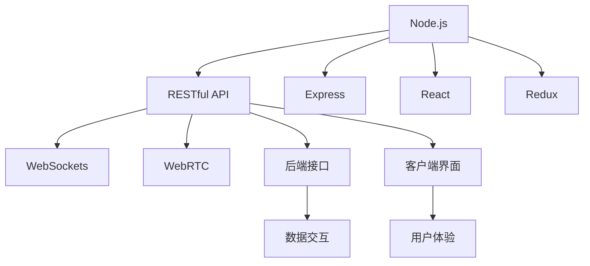

                 

# JavaScript全栈开发：Node.js与前端框架的结合

> 关键词：JavaScript, Node.js, 前端框架, Full-stack development, RESTful API, Express, React, Redux, WebSockets, WebRTC

## 1. 背景介绍

### 1.1 问题由来

在当前的软件开发领域，全栈开发已成为一种趋势，尤其是在快速迭代和产品交付日益重要的背景下。全栈开发要求开发人员具备前端和后端的能力，以更加高效地构建无缝连接的Web应用。Node.js作为JavaScript语言的运行时，其异步非阻塞的I/O特性和模块化架构，使得前端开发人员可以无缝地进行后端开发，极大降低了跨领域的开发门槛。然而，尽管Node.js使得前端开发人员可以进行后端开发，但仍然需要掌握相对复杂的技术栈。在前端框架日新月异的发展背景下，如何利用Node.js与前端框架更好地结合，成为当前全栈开发的主要挑战。

### 1.2 问题核心关键点

本文将聚焦于JavaScript全栈开发中，Node.js与前端框架（如React、Redux等）的结合，探讨通过RESTful API和WebSockets实现前后端的无缝连接，以及WebRTC实现实时通信的技术。首先介绍Node.js的基本概念和架构，然后详细阐述RESTful API的原理和开发实践，以及WebSockets和WebRTC的技术细节和实际应用。最后，将通过具体的开发实例，展示如何利用这些技术实现一个全栈Web应用。

## 2. 核心概念与联系

### 2.1 核心概念概述

- **Node.js**：基于Chrome V8引擎，提供了一个非阻塞的I/O模型，使得JavaScript可以在服务器端运行，并且支持异步编程模型。
- **RESTful API**：一种基于HTTP协议的Web服务架构风格，强调资源的标识和操作，采用统一接口设计，易于扩展和维护。
- **Express**：一个基于Node.js的Web应用框架，提供路由、中间件、模板引擎等功能，使得Web应用开发更加便捷。
- **React**：一个用于构建用户界面的JavaScript库，采用组件化思想，支持单向数据流，适用于大型复杂的Web应用。
- **Redux**：一个用于管理应用状态的JavaScript库，提供单一的数据源，使得状态管理更加集中和可控。
- **WebSockets**：一种基于TCP的协议，实现服务器与客户端之间的双向实时通信。
- **WebRTC**：一个开放标准的协议，用于浏览器之间的直接音频和视频通信，支持点对点通讯和网络拓扑发现。

这些核心概念之间的关系可以通过以下Mermaid流程图来展示：



这个流程图展示了Node.js与前端框架之间的关系：

1. Node.js作为基础运行时，提供异步I/O和模块化架构，支持前端开发。
2. RESTful API作为连接前后端的桥梁，通过Express框架实现。
3. React用于构建客户端界面，Redux用于管理应用状态。
4. WebSockets和WebRTC用于实现实时通信。

## 3. 核心算法原理 & 具体操作步骤
### 3.1 算法原理概述

在全栈开发中，Node.js与前端框架的结合主要通过RESTful API和WebSockets/WebRTC实现。RESTful API定义了前后端的接口和交互规则，而WebSockets和WebRTC则提供了实时通信的功能。

- **RESTful API**：采用HTTP协议，支持CRUD操作，支持跨域资源共享(CORS)，具有标准化和易用性的特点。
- **WebSockets**：建立持久化的TCP连接，实现实时双向通信，适用于需要低延迟和高可靠性的应用场景。
- **WebRTC**：基于浏览器内置的媒体通道，实现P2P通信，适用于音视频、聊天等实时通信应用。

### 3.2 算法步骤详解

1. **RESTful API设计**：
   - 定义API接口，包括资源路径、HTTP方法、参数等。
   - 使用Express框架搭建API路由，实现数据交互和状态管理。
   - 配置中间件，如body-parser、cors、compression等，以增强API的功能和性能。

2. **客户端界面开发**：
   - 使用React框架搭建用户界面，设计组件和布局。
   - 使用Redux管理应用状态，通过store提供统一的数据源。
   - 使用react-router、axios等库实现路由和异步请求，提升用户体验。

3. **实时通信开发**：
   - 使用WebSockets协议，建立与后端的持久化连接。
   - 使用socket.io库封装WebSockets API，实现事件驱动的实时通信。
   - 使用WebRTC协议，实现点对点的音视频通信，通过ICE和STUN等技术解决网络拓扑问题。

4. **测试和部署**：
   - 使用Jest、Mocha等测试框架编写单元测试和集成测试。
   - 使用Docker容器化应用，优化部署流程和环境。
   - 使用Kubernetes实现服务集群和自动伸缩，提高系统的可扩展性和可靠性。

### 3.3 算法优缺点

- **优点**：
  - 前后端分离，代码复用性高，提升开发效率。
  - 异步I/O模型，提高系统性能和响应速度。
  - 标准化和易用性，便于维护和扩展。
  - 实时通信功能，提升用户体验。

- **缺点**：
  - 学习曲线较陡，需要掌握多技术栈。
  - 接口设计需要仔细考虑，影响代码的可维护性。
  - 实时通信可能存在网络延迟和传输问题。

### 3.4 算法应用领域

RESTful API和WebSockets/WebRTC的应用领域非常广泛，适用于各种Web应用场景，如电商、社交、金融、教育等。具体应用包括：

- **电商**：商品详情页、购物车管理、订单处理、库存更新等。
- **社交**：实时聊天、动态消息、好友推荐等。
- **金融**：交易记录、资金流水、实时行情、通知提醒等。
- **教育**：在线学习、直播授课、学习记录等。

## 4. 数学模型和公式 & 详细讲解 & 举例说明（备注：数学公式请使用latex格式，latex嵌入文中独立段落使用 $$，段落内使用 $)
### 4.1 数学模型构建

以RESTful API为例，其核心数学模型为HTTP协议的请求和响应模型。HTTP协议采用请求-响应模型，客户端通过HTTP请求向服务器发送请求，服务器通过HTTP响应返回数据。

一个典型的HTTP请求包括：
- 请求方法（GET、POST等）
- 请求路径（/api/user/login）
- 请求头（Content-Type、Authorization等）
- 请求体（JSON格式的数据）

一个典型的HTTP响应包括：
- 响应状态码（200、404等）
- 响应头（Content-Type、Access-Control-Allow-Origin等）
- 响应体（JSON格式的数据）

### 4.2 公式推导过程

以一个简单的登录API为例，其请求和响应的数据模型可以表示为：

**请求模型**：
$$
\text{请求} = (\text{请求方法}, \text{请求路径}, \text{请求头}, \text{请求体})
$$

**响应模型**：
$$
\text{响应} = (\text{响应状态码}, \text{响应头}, \text{响应体})
$$

### 4.3 案例分析与讲解

以登录API为例，前端通过axios库向后台发送登录请求，后端通过Express框架处理请求，返回登录结果。具体实现过程如下：

**前端代码**：
```javascript
import axios from 'axios';

axios.post('/api/login', { username, password })
  .then(response => {
    console.log(response.data);
  })
  .catch(error => {
    console.error(error);
  });
```

**后端代码**：
```javascript
const express = require('express');
const app = express();
const bodyParser = require('body-parser');

app.use(bodyParser.json());

app.post('/api/login', (req, res) => {
  const { username, password } = req.body;
  // 验证用户名和密码
  if (username === 'admin' && password === 'password') {
    res.status(200).json({ message: '登录成功' });
  } else {
    res.status(401).json({ message: '登录失败' });
  }
});

app.listen(3000, () => {
  console.log('Server started on port 3000');
});
```

这个示例展示了RESTful API的基本流程，前端通过axios库发送POST请求，后端通过Express框架处理请求并返回JSON格式的数据。

## 5. 项目实践：代码实例和详细解释说明
### 5.1 开发环境搭建

为了搭建一个全栈Web应用，需要安装Node.js、Express、React、Redux等工具和库。以下是具体安装步骤：

1. 安装Node.js：从官网下载并安装Node.js，获取全局可执行的`node`和`npm`命令。

2. 初始化项目：使用`create-react-app`工具初始化React项目，创建`package.json`和`package-lock.json`文件。

```bash
npx create-react-app my-app
cd my-app
npm init
```

3. 安装Express和相关依赖：使用npm安装Express和相关中间件，如body-parser、cors等。

```bash
npm install express body-parser cors compression
```

4. 初始化后端项目：创建`server.js`文件，编写Express应用的路由和中间件。

### 5.2 源代码详细实现

以下是一个简单的全栈Web应用示例，包括RESTful API和前端React应用。

**后端代码**：
```javascript
// server.js
const express = require('express');
const bodyParser = require('body-parser');
const cors = require('cors');
const compression = require('compression');

const app = express();
app.use(bodyParser.json());
app.use(cors());
app.use(compression());

app.get('/', (req, res) => {
  res.json({ message: 'Hello, world!' });
});

app.post('/api/user', (req, res) => {
  const { name } = req.body;
  res.json({ message: `Welcome, ${name}!` });
});

app.listen(3000, () => {
  console.log('Server started on port 3000');
});
```

**前端代码**：
```javascript
// App.js
import React, { useState } from 'react';

function App() {
  const [name, setName] = useState('');

  const handleSubmit = (e) => {
    e.preventDefault();
    fetch('/api/user', {
      method: 'POST',
      headers: {
        'Content-Type': 'application/json',
      },
      body: JSON.stringify({ name }),
    })
      .then((response) => response.json())
      .then((data) => console.log(data))
      .catch((error) => console.error(error));
  };

  return (
    <div className="App">
      <form onSubmit={handleSubmit}>
        <input
          type="text"
          value={name}
          onChange={(e) => setName(e.target.value)}
        />
        <button type="submit">Submit</button>
      </form>
    </div>
  );
}

export default App;
```

### 5.3 代码解读与分析

这个示例展示了如何使用Express和React实现一个简单的全栈Web应用。后端通过Express框架搭建RESTful API，前端通过React构建用户界面。

**后端代码**：
- `server.js`：使用Express搭建API路由，通过`body-parser`中间件解析请求体，使用`cors`和`compression`中间件增强API功能。
- 路由`/api/user`：处理POST请求，接收JSON格式的参数，返回JSON格式的响应。

**前端代码**：
- `App.js`：使用React构建用户界面，通过`useState`管理表单状态，使用`fetch`发送POST请求。

这个示例展示了RESTful API和前端框架的结合，通过简单的代码实现了前后端的通信和数据交互。

## 6. 实际应用场景
### 6.1 智能聊天机器人

智能聊天机器人是Web应用的一个典型应用场景，可以与用户进行实时对话。后端通过RESTful API处理用户输入和输出，前端通过React构建用户界面，提供流畅的交互体验。

具体实现可以采用WebSockets实现实时通信，通过socket.io封装WebSocket API，提供事件驱动的实时通信功能。前端通过socket.io监听WebSocket事件，实时接收和发送消息。

### 6.2 在线协作平台

在线协作平台需要实现文档编辑、评论、讨论等功能，需要前后端无缝协作。后端通过RESTful API处理文档数据，前端通过React构建界面，提供协作和编辑功能。

具体实现可以采用WebSockets实现实时协作，前端通过socket.io监听WebSocket事件，实时同步文档状态，实现多人协作编辑。

### 6.3 实时数据仪表盘

实时数据仪表盘需要实时获取和展示数据，需要前后端的数据交互。后端通过RESTful API处理数据，前端通过React构建界面，提供实时数据展示功能。

具体实现可以采用WebSockets实现实时数据推送，后端通过socket.io监听WebSocket事件，实时推送数据到前端，前端通过Redux管理应用状态，展示实时数据。

### 6.4 未来应用展望

随着全栈开发的不断发展和技术的不断进步，基于Node.js与前端框架的全栈应用将更加普及和成熟。未来的应用场景将更加丰富和多样化，如智能客服、在线教育、远程办公等。

## 7. 工具和资源推荐
### 7.1 学习资源推荐

为了帮助开发者系统掌握JavaScript全栈开发的技术，这里推荐一些优质的学习资源：

1. **《JavaScript全栈开发》书籍**：介绍Node.js、Express、React、Redux等技术的原理和应用，适合全面学习全栈开发。
2. **MDN Web Docs**：Mozilla开发者网络，提供JavaScript、HTML、CSS等Web技术的学习文档和示例代码，是开发者必备的学习资源。
3. **Node.js官网**：Node.js官方文档，提供Node.js及其生态系统的完整文档，涵盖API、最佳实践、社区资源等。
4. **React官网**：React官方文档，提供React库的详细文档和示例代码，涵盖React核心、组件化、状态管理等内容。
5. **Redux官网**：Redux官方文档，提供Redux库的详细文档和示例代码，涵盖Redux核心、中间件、容器等内容。
6. **Udemy、Coursera等在线课程**：提供系统化的全栈开发课程，涵盖Node.js、Express、React、Redux等内容。

通过对这些资源的学习实践，相信你一定能够快速掌握JavaScript全栈开发的技术，并用于解决实际的Web应用问题。

### 7.2 开发工具推荐

高效的开发离不开优秀的工具支持。以下是几款用于JavaScript全栈开发的工具：

1. **Visual Studio Code**：开源的代码编辑器，支持丰富的插件和扩展，适用于前后端开发。
2. **Git**：版本控制系统，支持代码管理、协作和提交，是软件开发的重要工具。
3. **npm、yarn**：JavaScript包管理工具，支持包的安装、卸载和依赖管理，简化开发流程。
4. **Jest、Mocha**：JavaScript测试框架，支持单元测试和集成测试，保障代码质量。
5. **Webpack、Rollup**：打包工具，支持模块化开发和代码压缩，提高开发效率。
6. **Postman、Insomnia**：API测试工具，支持HTTP请求和响应调试，快速验证API接口。

合理利用这些工具，可以显著提升JavaScript全栈开发的效率，加快创新迭代的步伐。

### 7.3 相关论文推荐

全栈开发领域的研究不断进展，以下是几篇奠基性的相关论文，推荐阅读：

1. **Node.js: Environment for JavaScript**：Node.js创始人Ryan Dahl发表的论文，介绍Node.js的设计思想和技术实现。
2. **RESTful Web Services**：Roy Fielding发表的论文，介绍RESTful Web服务的原理和设计原则。
3. **React: A JavaScript Library for Building User Interfaces**：Facebook开发者发表的论文，介绍React库的设计思想和技术实现。
4. **Redux: Predictable State Containers for JavaScript**：Dan Abramov和Andrew Clark发表的论文，介绍Redux库的设计思想和技术实现。
5. **WebSockets in Action**：Chad Brewbaker和Friedrich Luitz发表的书籍，介绍WebSockets协议和socket.io库的使用方法。
6. **WebRTC: A Real-Time Communication Protocol**：IETF工作组发表的文档，介绍WebRTC协议的技术细节和应用场景。

这些论文和书籍代表了大规模全栈开发的研究进展，通过学习这些前沿成果，可以帮助开发者把握学科前进方向，激发更多的创新灵感。

## 8. 总结：未来发展趋势与挑战
### 8.1 总结

本文对JavaScript全栈开发中，Node.js与前端框架（如React、Redux等）的结合进行了全面系统的介绍。首先介绍Node.js的基本概念和架构，然后详细阐述RESTful API的原理和开发实践，以及WebSockets和WebRTC的技术细节和实际应用。最后，通过具体的开发实例，展示如何利用这些技术实现一个全栈Web应用。

通过本文的系统梳理，可以看到，JavaScript全栈开发在实现前后端无缝连接、提升开发效率、提高系统性能方面具有重要价值。未来，随着全栈开发技术的不断进步，JavaScript全栈开发将成为Web应用开发的重要趋势。

### 8.2 未来发展趋势

展望未来，JavaScript全栈开发将呈现以下几个发展趋势：

1. **前端和后端深度融合**：前端和后端技术的不断融合，将带来更加无缝的用户体验和更高的开发效率。
2. **实时通信技术的普及**：WebSockets和WebRTC技术的普及，将使得实时通信应用变得更加普及和强大。
3. **微服务和分布式架构**：微服务和分布式架构的普及，将带来更高的系统可扩展性和可靠性。
4. **全栈框架的创新**：全栈框架的不断创新，将带来更加便捷和高效的开发体验。

### 8.3 面临的挑战

尽管JavaScript全栈开发技术已经取得了显著进展，但在迈向更加智能化、普适化应用的过程中，仍然面临诸多挑战：

1. **性能优化**：在处理大量数据和实时通信时，前端和后端性能需要进一步优化，以提升用户体验。
2. **安全性和隐私保护**：全栈应用需要考虑更多的安全性和隐私保护问题，防止数据泄露和攻击。
3. **标准化和规范化**：全栈开发需要更多的标准化和规范化，避免技术多样性和兼容性问题。
4. **跨平台兼容性**：全栈应用需要考虑跨平台兼容性，提供更加统一的开发体验。

### 8.4 研究展望

面对全栈开发面临的挑战，未来的研究需要在以下几个方面寻求新的突破：

1. **性能优化**：研究前端和后端性能优化技术，提高系统响应速度和吞吐量。
2. **安全性和隐私保护**：研究全栈应用的安全性和隐私保护技术，保障用户数据安全和隐私。
3. **标准化和规范化**：研究全栈开发的标准化和规范化技术，提升技术的一致性和兼容性。
4. **跨平台兼容性**：研究跨平台兼容性的技术，提供统一的开发体验。

这些研究方向的探索，将引领JavaScript全栈开发技术迈向更高的台阶，为构建安全、可靠、可扩展的全栈应用提供新的方向。

## 9. 附录：常见问题与解答

**Q1：如何优化JavaScript全栈应用的性能？**

A: 优化JavaScript全栈应用的性能需要从多个方面入手：

1. **前端优化**：
   - 使用CDN加速静态资源加载，减少首屏渲染时间。
   - 使用懒加载和代码分割，提高加载速度和用户体验。
   - 使用图片和视频的压缩技术，减小文件大小。

2. **后端优化**：
   - 使用缓存技术，如Redis、Memcached等，减少数据库访问和响应时间。
   - 使用异步I/O模型，提高系统吞吐量和响应速度。
   - 使用数据库优化技术，如索引、分区、读写分离等，提高数据访问效率。

3. **网络优化**：
   - 使用CDN和内容分发技术，加速数据传输。
   - 使用HTTP缓存策略，减少重复请求。
   - 使用HTTP/2协议，提高传输效率和连接复用率。

4. **测试和监控**：
   - 使用Jest、Mocha等测试框架，编写性能测试用例。
   - 使用Lighthouse等工具，评估应用性能和用户体验。
   - 使用Sentry等监控工具，实时监控应用性能和异常。

**Q2：如何提升JavaScript全栈应用的安全性？**

A: 提升JavaScript全栈应用的安全性需要从多个方面入手：

1. **前端安全**：
   - 使用HTTPS协议，保障数据传输的安全性。
   - 使用CORS策略，防止跨站请求伪造（CSRF）。
   - 使用XSS攻击防御技术，防止跨站脚本攻击。

2. **后端安全**：
   - 使用身份验证和授权技术，防止未授权访问。
   - 使用数据加密和脱敏技术，保护用户数据隐私。
   - 使用防火墙和安全扫描工具，防止网络攻击。

3. **数据库安全**：
   - 使用数据库加密和访问控制，防止数据泄露。
   - 使用SQL注入防御技术，防止SQL注入攻击。
   - 使用数据备份和恢复技术，保障数据安全。

4. **应用安全**：
   - 使用API网关和安全中间件，保障API接口的安全性。
   - 使用Web应用防火墙，防止DDoS攻击和恶意流量。
   - 使用威胁情报和漏洞扫描技术，及时发现和修复安全漏洞。

**Q3：JavaScript全栈开发是否适合所有的Web应用场景？**

A: JavaScript全栈开发适用于大多数Web应用场景，但仍然有一些场景需要考虑：

1. **实时通信要求高**：如实时聊天、在线游戏等场景，需要高可靠性和低延迟的网络连接，WebSockets和WebRTC更为适合。
2. **后端性能要求高**：如高并发、高吞吐量的场景，Node.js和Express的优势较为明显。
3. **系统复杂度高**：如微服务架构、分布式系统的场景，需要更多的标准化和规范化技术。
4. **跨平台兼容性**：如多终端、多平台的场景，需要考虑跨平台兼容性。

**Q4：如何选择合适的全栈框架？**

A: 选择合适的全栈框架需要考虑多个因素：

1. **功能丰富度**：选择功能丰富、可扩展性强的框架，如React、Angular、Vue等。
2. **性能表现**：选择性能高、响应速度快的框架，如Node.js、Express、Angular等。
3. **生态系统成熟度**：选择生态系统成熟、社区活跃的框架，如React、Vue、Angular等。
4. **开发效率**：选择开发效率高、工具链完善的框架，如React、Angular、Vue等。
5. **学习和使用成本**：选择学习和使用成本低的框架，如React、Vue、Angular等。

**Q5：如何处理JavaScript全栈应用的数据库交互？**

A: 处理JavaScript全栈应用的数据库交互需要考虑以下几个方面：

1. **数据库选择**：选择适合应用场景的数据库，如MySQL、MongoDB、PostgreSQL等。
2. **ORM框架**：使用ORM框架，如Sequelize、Mongoose等，简化数据库操作。
3. **连接池管理**：使用连接池技术，如Sequelize、Mongoose等，优化数据库连接管理。
4. **事务处理**：使用事务处理技术，如Sequelize、Mongoose等，保障数据一致性。
5. **数据缓存**：使用数据缓存技术，如Redis、Memcached等，减少数据库访问和响应时间。

总之，JavaScript全栈开发技术具有广泛的应用前景和巨大的潜力。通过不断探索和实践，相信开发者能够更好地掌握全栈开发技术，构建更加高效、可靠的全栈Web应用。

---

作者：禅与计算机程序设计艺术 / Zen and the Art of Computer Programming

