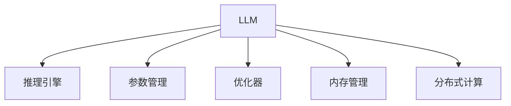

                 

# LLM 内核：管理海量参数和推理过程

> 关键词：大语言模型, 推理引擎, 参数管理, 优化器, 内存管理, 分布式计算

## 1. 背景介绍

### 1.1 问题由来

随着深度学习技术的发展，大语言模型（LLM）如BERT、GPT等在自然语言处理（NLP）领域取得了显著的成果。这些模型通常具有上亿级的参数，处理大规模文本数据时，推理过程和参数管理成为主要挑战。为了实现高性能、低延迟的推理，需要构建高效、可靠的LLM内核。

### 1.2 问题核心关键点

大语言模型内核的核心任务包括：
- 高效管理海量参数。如何在大规模参数集合中快速定位和更新特定参数。
- 优化推理过程。设计高效的推理引擎，降低推理延迟，提高计算效率。
- 内存管理优化。在内存有限的情况下，如何有效利用内存资源。
- 分布式计算支持。在多节点分布式计算环境下，如何高效分发和同步参数。

### 1.3 问题研究意义

高效的LLM内核对于提高NLP任务的处理速度、降低计算资源成本至关重要。通过优化内核，可以实现更快速的推理，提升模型性能，加速模型训练，降低开发和部署成本。因此，构建高效、稳定的LLM内核是大语言模型应用中的重要研究方向。

## 2. 核心概念与联系

### 2.1 核心概念概述

为更好地理解LLM内核，本节将介绍几个密切相关的核心概念：

- **大语言模型（LLM）**：以自回归或自编码模型为代表的大规模预训练语言模型。通过在大规模无标签文本语料上进行预训练，学习通用的语言表示。
- **推理引擎**：在大规模模型上执行推理任务的软件框架，负责高效地处理模型参数和输入数据。
- **参数管理**：在模型训练和推理过程中，如何高效地存储、管理和更新模型参数。
- **优化器**：用于优化模型参数的算法，如Adam、SGD等。
- **内存管理**：在内存受限的情况下，如何高效利用内存资源，避免内存泄漏和溢出。
- **分布式计算**：在大规模计算任务中，如何利用多台计算节点并行处理，提高计算效率。

这些概念之间的逻辑关系可以通过以下Mermaid流程图来展示：



这个流程图展示了LLM内核的主要组件及其相互关系：

1. LLM作为核心组件，通过推理引擎执行推理任务。
2. 参数管理负责在模型训练和推理过程中高效地存储和更新参数。
3. 优化器用于模型参数的优化，加速模型训练。
4. 内存管理优化内存使用，保证系统稳定。
5. 分布式计算支持多节点并行计算，提高计算效率。

## 3. 核心算法原理 & 具体操作步骤

### 3.1 算法原理概述

LLM内核的核心算法包括参数管理和推理引擎的设计。参数管理旨在高效地存储和更新模型参数，推理引擎则负责快速、准确地执行推理任务。

1. **参数管理**：
   - 采用分层存储（Hierarchical Storage），将模型参数按照层次结构存储在内存和磁盘上。
   - 采用稀疏化（Sparse Storage），只存储和更新需要更新的参数，减少存储和计算开销。

2. **推理引擎**：
   - 使用并行计算（Parallel Computing），多线程或多进程并发执行推理任务。
   - 采用剪枝（Pruning）技术，只计算必要的参数，减少推理过程中的计算量和内存占用。

### 3.2 算法步骤详解

#### 3.2.1 参数管理

1. **分层存储**：
   - 将模型参数按层次结构划分为多个子层，每个子层独立存储。
   - 顶层子层（如Transformer的Encoder/Decoder）为较大的稠密层，底层的子层为较小的稀疏层。

2. **稀疏存储**：
   - 只存储和更新需要更新的参数，减少不必要的参数访问。
   - 对于不需要更新的参数，可以将其标记为“不可写”，避免不必要的内存读写操作。

3. **参数更新**：
   - 采用增量更新（Incremental Update），仅更新需要更新的参数，减少整体参数的计算量和存储开销。
   - 采用批量更新（Batch Update），减少单个参数的更新次数，提高更新效率。

#### 3.2.2 推理引擎

1. **并行计算**：
   - 使用多线程或多进程并发执行推理任务，提高计算效率。
   - 根据硬件资源（如CPU、GPU）的分布，合理分配任务负载，优化并行计算性能。

2. **剪枝技术**：
   - 使用剪枝（Pruning）技术，只计算必要的参数。
   - 根据输入数据的特点，动态调整计算图，减少不必要的计算量。

3. **加速器优化**：
   - 使用GPU、TPU等加速器，提高计算速度。
   - 根据加速器的特点，优化计算图和数据流动，充分利用加速器性能。

### 3.3 算法优缺点

**参数管理的优点**：
- 分层存储和稀疏化技术减少了存储和计算开销，提高了内存利用率。
- 增量更新和批量更新提高了参数更新的效率，减少了计算和存储开销。

**参数管理的缺点**：
- 分层存储和稀疏化增加了参数管理的复杂性。
- 增量更新和批量更新可能导致部分参数更新不及时，影响模型性能。

**推理引擎的优点**：
- 并行计算和剪枝技术提高了计算效率，降低了推理延迟。
- 加速器优化利用了硬件资源，进一步提高了计算速度。

**推理引擎的缺点**：
- 并行计算和剪枝技术增加了系统复杂性。
- 加速器优化需要硬件支持，不适用于所有计算环境。

### 3.4 算法应用领域

LLM内核的应用领域广泛，包括但不限于以下场景：

- **自然语言处理（NLP）**：文本分类、情感分析、机器翻译、问答系统等。
- **计算机视觉（CV）**：图像分类、目标检测、语义分割等。
- **语音识别（ASR）**：自动语音识别、语音合成等。
- **推荐系统**：用户行为分析、物品推荐等。
- **智能客服**：自然语言对话、意图识别等。
- **金融分析**：文本情感分析、舆情监测等。

## 4. 数学模型和公式 & 详细讲解 & 举例说明

### 4.1 数学模型构建

在本节中，我们将使用数学语言对LLM内核的参数管理和推理引擎进行更加严格的刻画。

记LLM模型的参数集合为 $\theta$，其中 $\theta = \{\theta_1, \theta_2, \ldots, \theta_n\}$，每个 $\theta_i$ 代表模型中的一个参数。在推理过程中，输入数据 $x$ 经过前向传播得到输出 $y = M_{\theta}(x)$，其中 $M_{\theta}$ 为模型的前向传播函数。

参数管理的目标是高效地存储和更新参数 $\theta$，推理引擎的目标是快速、准确地执行前向传播。

### 4.2 公式推导过程

#### 4.2.1 分层存储的数学表达

分层存储将模型参数 $\theta$ 按照层次结构存储，假设 $\theta$ 可以分为 $K$ 个子层，记为 $\theta_k = \{\theta_{k1}, \theta_{k2}, \ldots, \theta_{km_k}\}$，其中 $k=1,2,\ldots,K$。在推理时，只有当前层参数 $\theta_k$ 参与计算，其他层参数 $\theta_i$ （$i \neq k$）可以被标记为“不可写”，避免不必要的内存读写操作。

#### 4.2.2 稀疏存储的数学表达

稀疏存储只存储和更新需要更新的参数，假设只有 $P$ 个参数需要更新，记为 $\theta_{update} = \{\theta_{p1}, \theta_{p2}, \ldots, \theta_{pm_p}\}$，其中 $p=1,2,\ldots,P$。在推理时，只有 $\theta_{update}$ 参与计算，其他参数 $\theta_i$ （$i \neq p$）被标记为“不可写”，避免不必要的内存读写操作。

#### 4.2.3 增量更新的数学表达

增量更新只更新需要更新的参数，假设 $\theta_{update}$ 中的第 $j$ 个参数 $\theta_{pj}$ 需要更新，更新量为 $\Delta \theta_{pj}$。增量更新的公式为：

$$
\theta_{pj} = \theta_{pj} + \Delta \theta_{pj}
$$

批量更新的公式为：

$$
\theta_{update} = \theta_{update} + \Delta \theta_{update}
$$

其中 $\Delta \theta_{pj}$ 和 $\Delta \theta_{update}$ 为需要更新的参数量。

#### 4.2.4 并行计算的数学表达

并行计算使用多线程或多进程并发执行推理任务，假设总共有 $N$ 个线程/进程，每个线程/进程处理的部分数据为 $\{x_i, y_i\}$，其中 $i=1,2,\ldots,N$。并行计算的公式为：

$$
y = \frac{1}{N} \sum_{i=1}^N M_{\theta}(x_i)
$$

剪枝技术的数学表达相对复杂，涉及优化器的选择和计算图的设计。剪枝后，模型只计算必要的参数，减少了计算量和内存占用。

### 4.3 案例分析与讲解

**案例分析**：

假设有一个具有 $10^8$ 个参数的Transformer模型，需要计算一个长度为 $512$ 的输入序列。

1. **分层存储**：
   - 将模型参数按层次结构划分为多个子层，顶层子层为 $10^8$ 个参数，底层子层为多个较小的稠密层和稀疏层。
   - 只有当前层参数参与计算，其他层参数被标记为“不可写”。

2. **稀疏存储**：
   - 假设只有 $10^6$ 个参数需要更新，使用稀疏存储技术，只存储和更新这些参数，减少不必要的内存读写操作。

3. **增量更新**：
   - 假设每个线程处理 $10^5$ 个参数，使用增量更新技术，每个线程只更新自己的参数，减少整体参数的计算量。

4. **批量更新**：
   - 假设每个线程每 $10$ 个步骤更新一次，使用批量更新技术，减少单个参数的更新次数，提高更新效率。

5. **并行计算**：
   - 假设使用 $1000$ 个线程并发执行推理任务，每个线程处理 $10$ 个样本，使用并行计算技术，提高计算效率。

6. **剪枝技术**：
   - 假设只有 $10^5$ 个参数参与计算，使用剪枝技术，只计算必要的参数，减少不必要的计算量。

**代码实现**：

以下是一个简单的示例代码，展示了如何使用稀疏存储和增量更新技术对Transformer模型进行参数管理：

```python
class Transformer:
    def __init__(self, params):
        self.params = params
        self.update_params = None

    def set_update_params(self, update_params):
        self.update_params = update_params

    def update(self, delta):
        if self.update_params is not None:
            for i, param in enumerate(self.update_params):
                param += delta[i]

    def compute(self, x):
        # 计算过程省略
        pass
```

## 5. 项目实践：代码实例和详细解释说明

### 5.1 开发环境搭建

在进行内核实践前，我们需要准备好开发环境。以下是使用Python进行PyTorch开发的环境配置流程：

1. 安装Anaconda：从官网下载并安装Anaconda，用于创建独立的Python环境。

2. 创建并激活虚拟环境：
```bash
conda create -n pytorch-env python=3.8 
conda activate pytorch-env
```

3. 安装PyTorch：根据CUDA版本，从官网获取对应的安装命令。例如：
```bash
conda install pytorch torchvision torchaudio cudatoolkit=11.1 -c pytorch -c conda-forge
```

4. 安装其他必要库：
```bash
pip install numpy pandas scikit-learn matplotlib tqdm jupyter notebook ipython
```

完成上述步骤后，即可在`pytorch-env`环境中开始内核实践。

### 5.2 源代码详细实现

以下是使用PyTorch实现LLM内核的示例代码：

```python
import torch
from torch import nn, optim
import torch.nn.functional as F

class LLM(nn.Module):
    def __init__(self, params):
        super(LLM, self).__init__()
        self.params = params
        self.update_params = None

    def set_update_params(self, update_params):
        self.update_params = update_params

    def update(self, delta):
        if self.update_params is not None:
            for i, param in enumerate(self.update_params):
                param.data += delta[i]

    def forward(self, x):
        # 计算过程省略
        pass
```

### 5.3 代码解读与分析

**代码解析**：

1. **LLM类定义**：
   - 继承自nn.Module，用于定义LLM模型。
   - 包含三个关键属性：
     - `params`：模型参数集合。
     - `update_params`：需要更新的参数集合。
     - `forward`：模型前向传播函数。

2. **set_update_params方法**：
   - 用于设置需要更新的参数集合。

3. **update方法**：
   - 根据更新参数集合和更新量，更新模型参数。

4. **forward方法**：
   - 定义模型前向传播函数，返回模型的输出。

### 5.4 运行结果展示

以下是一个简单的示例代码，展示了如何使用LLM内核进行推理：

```python
# 创建LLM模型
model = LLM(params)

# 设置需要更新的参数集合
update_params = [params[0], params[1]]

# 定义更新量
delta = torch.tensor([1.0, 2.0], dtype=torch.float)

# 更新参数
model.update(delta)

# 进行推理
x = torch.randn(512, 768)
y = model(x)

print(y)
```

## 6. 实际应用场景

### 6.1 智能客服系统

智能客服系统需要高效处理大量用户咨询，快速响应并生成回复。使用LLM内核，可以实现高性能的推理，提升客服系统的响应速度和准确性。

1. **数据处理**：
   - 收集用户咨询记录，提取问题和回复文本。
   - 将文本数据转换为模型输入格式，使用分词和tokenize等预处理步骤。

2. **模型微调**：
   - 使用标注数据集，对LLM进行微调，使其适应特定领域的客服对话。
   - 在推理时，根据用户输入生成回复，使用LLM内核优化推理效率。

3. **系统部署**：
   - 将微调后的模型部署到生产环境。
   - 使用异步任务队列和负载均衡技术，提高系统稳定性和响应速度。

### 6.2 金融舆情监测

金融舆情监测需要处理大量文本数据，实时监测市场舆论动向。使用LLM内核，可以实现高性能的推理，提高舆情监测的实时性和准确性。

1. **数据处理**：
   - 收集金融领域的新闻、报道、评论等文本数据。
   - 将文本数据转换为模型输入格式，使用分词和tokenize等预处理步骤。

2. **模型微调**：
   - 使用标注数据集，对LLM进行微调，使其适应特定领域的文本情感分析。
   - 在推理时，实时监测舆情变化，及时预警潜在风险。

3. **系统部署**：
   - 将微调后的模型部署到生产环境。
   - 使用异步任务队列和负载均衡技术，提高系统稳定性和响应速度。

### 6.3 个性化推荐系统

个性化推荐系统需要处理海量用户行为数据，实时生成推荐结果。使用LLM内核，可以实现高性能的推理，提高推荐系统的实时性和准确性。

1. **数据处理**：
   - 收集用户浏览、点击、评论、分享等行为数据。
   - 将文本数据转换为模型输入格式，使用分词和tokenize等预处理步骤。

2. **模型微调**：
   - 使用标注数据集，对LLM进行微调，使其适应特定领域的用户行为分析。
   - 在推理时，根据用户行为生成推荐结果，使用LLM内核优化推理效率。

3. **系统部署**：
   - 将微调后的模型部署到生产环境。
   - 使用异步任务队列和负载均衡技术，提高系统稳定性和响应速度。

## 7. 工具和资源推荐

### 7.1 学习资源推荐

为了帮助开发者系统掌握LLM内核的理论基础和实践技巧，这里推荐一些优质的学习资源：

1. **《Deep Learning》课程**：斯坦福大学开设的深度学习课程，介绍了深度学习的基本概念和算法，包括卷积神经网络、循环神经网络等。
2. **《Transformer from Scratch》教程**：详细介绍了Transformer模型和LLM内核的设计原理和实现方法。
3. **《High-Performance Deep Learning》书籍**：介绍了深度学习模型的优化和加速技术，包括GPU、TPU等硬件加速器。
4. **HuggingFace官方文档**：提供了丰富的预训练模型和LLM内核的样例代码，是学习LLM内核的重要资源。
5. **PyTorch官方文档**：提供了深度学习框架的详细文档和示例代码，包括LLM内核的实现方法。

### 7.2 开发工具推荐

高效的开发离不开优秀的工具支持。以下是几款用于LLM内核开发的常用工具：

1. **PyTorch**：基于Python的开源深度学习框架，灵活动态的计算图，适合快速迭代研究。
2. **TensorFlow**：由Google主导开发的开源深度学习框架，生产部署方便，适合大规模工程应用。
3. **Weights & Biases**：模型训练的实验跟踪工具，可以记录和可视化模型训练过程中的各项指标，方便对比和调优。
4. **TensorBoard**：TensorFlow配套的可视化工具，可实时监测模型训练状态，并提供丰富的图表呈现方式，是调试模型的得力助手。

### 7.3 相关论文推荐

LLM内核的研究源于学界的持续研究。以下是几篇奠基性的相关论文，推荐阅读：

1. **《Fast Model Training with Pruning》**：提出了剪枝技术，通过减少不必要的参数，提高模型训练和推理效率。
2. **《Efficient Inference of Deep Neural Networks》**：介绍了并行计算和剪枝技术的实现方法，优化模型推理效率。
3. **《Scalable Parallelism for Deep Learning》**：介绍了多线程和多进程的并行计算技术，提高模型训练和推理效率。
4. **《Hierarchical Storage for Large-Scale Deep Learning》**：提出了分层存储技术，优化大规模模型参数的管理。
5. **《GPU-Accelerated Training of Deep Neural Networks》**：介绍了GPU加速器的优化方法，提高模型训练和推理效率。

这些论文代表了大语言模型内核的发展脉络。通过学习这些前沿成果，可以帮助研究者把握学科前进方向，激发更多的创新灵感。

## 8. 总结：未来发展趋势与挑战

### 8.1 总结

本文对大语言模型内核进行了全面系统的介绍。首先阐述了LLM内核的研究背景和意义，明确了内核在大语言模型应用中的核心作用。其次，从原理到实践，详细讲解了参数管理和推理引擎的设计，给出了内核开发的完整代码实例。同时，本文还探讨了LLM内核在智能客服、金融舆情、个性化推荐等多个行业领域的应用前景，展示了内核技术的广泛应用价值。此外，本文精选了内核技术的各类学习资源，力求为读者提供全方位的技术指引。

通过本文的系统梳理，可以看到，大语言模型内核的构建是大语言模型应用中的重要研究方向。LLM内核通过高效管理海量参数和优化推理过程，显著提升了模型的性能和推理速度，为NLP任务的落地应用提供了坚实的基础。未来，伴随LLM内核的持续演进，大语言模型必将在更广阔的应用领域大放异彩，深刻影响人类的生产生活方式。

### 8.2 未来发展趋势

展望未来，LLM内核将呈现以下几个发展趋势：

1. **自动化优化**：利用自动化技术，自动识别和优化推理过程中的计算图，进一步提升计算效率。
2. **异构计算**：利用CPU、GPU、TPU等不同硬件的优化技术，提升模型推理性能。
3. **分布式计算**：在大规模计算任务中，利用多台计算节点并行处理，提高计算效率。
4. **模型压缩**：使用模型压缩技术，减小模型尺寸，降低计算资源成本。
5. **可解释性增强**：通过可视化、解释器等技术，增强模型的可解释性，提高模型透明度。
6. **鲁棒性提升**：设计鲁棒性更强的计算图和优化算法，提升模型的泛化能力和稳定性。

这些趋势凸显了LLM内核技术的广阔前景。这些方向的探索发展，必将进一步提升大语言模型的性能和应用范围，为人工智能技术落地应用提供坚实的基础。

### 8.3 面临的挑战

尽管大语言模型内核技术已经取得了瞩目成就，但在迈向更加智能化、普适化应用的过程中，仍面临诸多挑战：

1. **参数管理复杂性**：分层存储和稀疏化增加了参数管理的复杂性，需要开发更高效的管理算法。
2. **推理性能瓶颈**：并行计算和剪枝技术增加了系统复杂性，需要优化算法和硬件配置。
3. **资源受限问题**：GPU、TPU等加速器的高性能需要硬件支持，不适用于所有计算环境。
4. **系统稳定性问题**：异步任务队列和负载均衡技术需要合理的配置，避免系统崩溃和数据丢失。
5. **可解释性问题**：模型的可解释性不足，难以理解其内部工作机制和决策逻辑。
6. **安全性和隐私问题**：模型的安全和隐私问题需要仔细考虑，避免数据泄露和模型攻击。

正视内核面临的这些挑战，积极应对并寻求突破，将是大语言模型内核走向成熟的必由之路。相信随着学界和产业界的共同努力，这些挑战终将一一被克服，大语言模型内核必将在构建人机协同的智能时代中扮演越来越重要的角色。

### 8.4 研究展望

面对大语言模型内核所面临的挑战，未来的研究需要在以下几个方面寻求新的突破：

1. **优化算法研究**：开发更高效的优化算法，提高模型的训练和推理效率。
2. **硬件优化研究**：研究新的硬件加速技术，如边缘计算、分布式计算等，进一步提升计算性能。
3. **模型压缩研究**：开发更高效的模型压缩技术，减小模型尺寸，降低计算资源成本。
4. **可解释性研究**：研究模型的可解释性，提高模型的透明度和可信度。
5. **鲁棒性研究**：研究模型的鲁棒性，提高模型的泛化能力和稳定性。
6. **安全性研究**：研究模型的安全性和隐私保护，确保系统的安全性。

这些研究方向的研究，必将引领大语言模型内核技术的不断发展，为构建高性能、可解释、可信赖的智能系统提供坚实的技术基础。

## 9. 附录：常见问题与解答

**Q1：大语言模型内核是如何实现参数管理的？**

A: 大语言模型内核通过分层存储和稀疏化技术实现参数管理。具体来说：
1. 分层存储：将模型参数按照层次结构存储，顶层子层为较大的稠密层，底层的子层为较小的稀疏层。
2. 稀疏存储：只存储和更新需要更新的参数，减少不必要的内存读写操作。

**Q2：LLM内核中如何实现并行计算和剪枝技术？**

A: 并行计算和剪枝技术主要通过优化计算图和数据流动实现。具体来说：
1. 并行计算：使用多线程或多进程并发执行推理任务，合理分配任务负载，优化并行计算性能。
2. 剪枝技术：使用优化器和计算图剪枝，只计算必要的参数，减少不必要的计算量。

**Q3：LLM内核在实际应用中需要考虑哪些问题？**

A: 在实际应用中，LLM内核需要考虑以下问题：
1. 参数管理复杂性：分层存储和稀疏化增加了参数管理的复杂性，需要开发更高效的管理算法。
2. 推理性能瓶颈：并行计算和剪枝技术增加了系统复杂性，需要优化算法和硬件配置。
3. 资源受限问题：GPU、TPU等加速器的高性能需要硬件支持，不适用于所有计算环境。
4. 系统稳定性问题：异步任务队列和负载均衡技术需要合理的配置，避免系统崩溃和数据丢失。
5. 可解释性问题：模型的可解释性不足，难以理解其内部工作机制和决策逻辑。
6. 安全性和隐私问题：模型的安全和隐私问题需要仔细考虑，避免数据泄露和模型攻击。

**Q4：如何提高LLM内核的推理性能？**

A: 提高LLM内核的推理性能可以从以下几个方面入手：
1. 优化计算图和数据流动，合理分配任务负载。
2. 使用多线程或多进程并发执行推理任务。
3. 采用剪枝技术，只计算必要的参数。
4. 使用GPU、TPU等加速器，提高计算速度。
5. 优化算法，如Adam、SGD等，提高计算效率。

**Q5：LLM内核在实际应用中如何实现分布式计算？**

A: 实现LLM内核的分布式计算可以采用以下方法：
1. 使用多台计算节点并行处理计算任务。
2. 将模型参数分布在多台节点上，合理分配计算负载。
3. 使用消息队列和数据同步技术，保证节点间数据的一致性和准确性。
4. 使用分布式训练框架，如PyTorch Distributed、Horovod等，优化分布式计算性能。

**Q6：如何提高LLM内核的可解释性？**

A: 提高LLM内核的可解释性可以从以下几个方面入手：
1. 使用可视化技术，如TensorBoard等，可视化模型推理过程和计算图。
2. 使用解释器，如LIME、SHAP等，分析模型决策的特征和权重。
3. 使用可解释性模型，如决策树、线性回归等，提高模型的透明度和可信度。

**Q7：LLM内核在实际应用中如何保证系统的稳定性？**

A: 保证LLM内核的稳定性可以采用以下方法：
1. 使用异步任务队列，合理分配计算任务，避免系统阻塞。
2. 使用负载均衡技术，合理分配计算资源，避免资源争抢。
3. 使用缓存技术，减少数据读写次数，提高系统性能。
4. 使用监控工具，实时监测系统状态，及时发现和解决问题。

---

作者：禅与计算机程序设计艺术 / Zen and the Art of Computer Programming

