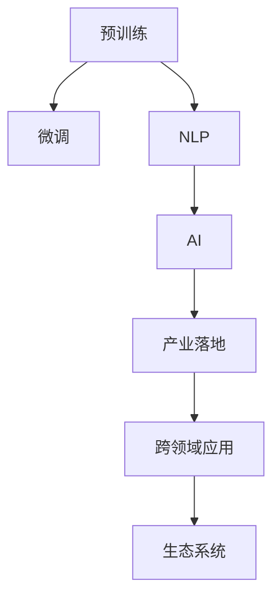

                 

# LLM 生态系统：一个新产业的诞生

> 关键词：
1. 大规模语言模型(LLMs)
2. 预训练与微调
3. 自然语言处理(NLP)
4. 人工智能(AI)
5. 产业落地
6. 产业生态
7. 跨领域应用

## 1. 背景介绍

### 1.1 问题由来

过去几十年，人工智能(AI)领域取得了长足进步，尤其在自然语言处理(NLP)和计算机视觉领域，涌现出一系列突破性技术。其中，大规模语言模型(LLMs)在语言理解与生成能力上取得了巨大突破，被认为是人工智能领域的一次里程碑事件。LLMs通过在大规模无标签文本数据上进行预训练，学习到丰富的语言知识，具备强大的语言处理能力。目前，主流的LLMs包括OpenAI的GPT系列、Google的BERT、T5等，这些模型已经在各种NLP任务中展现了出色的表现。

然而，尽管LLMs在通用性上取得了显著进展，但它们在特定领域的应用仍然存在局限性。由于通用模型可能无法完全理解特定领域的复杂背景和专业术语，因此在实际应用中，LLMs的性能和准确性往往会打折扣。例如，在医疗、法律、金融等专业领域，通用的LLMs往往难以提供准确的解答或推荐。

### 1.2 问题核心关键点

当前，LLMs在特定领域应用面临的主要挑战包括：
1. 数据不匹配：通用模型无法完全理解领域特定知识，导致在专业领域中表现不佳。
2. 过拟合风险：在专业领域标注数据量有限，模型容易过拟合。
3. 计算资源消耗高：预训练和微调需要大量的计算资源，难以应用于大规模生产环境。
4. 解释性和可控性差：模型输出缺乏可解释性，难以满足专业领域对解释性和可控性的需求。
5. 伦理和安全性问题：模型可能输出有害或误导性信息，带来伦理和安全风险。

因此，针对特定领域，如何有效利用LLMs，提升其在实际应用中的表现，成为了当前AI研究的热点。基于这一背景，本文将深入探讨如何构建LLMs生态系统，助力其在各专业领域的落地应用。

## 2. 核心概念与联系

### 2.1 核心概念概述

为更好地理解LLMs在特定领域的应用，本文将介绍以下几个核心概念：

- 预训练与微调：预训练是指在大规模无标签数据上训练通用语言模型，微调则是在特定领域标注数据上优化模型。
- 自然语言处理(NLP)：涉及对自然语言信息的处理和理解，包括语言模型、文本分类、机器翻译等。
- 人工智能(AI)：使用算法和计算方法，使机器模拟人类智能行为，涵盖感知、认知、决策等多个方面。
- 产业落地：将AI技术应用于实际业务场景，解决具体问题，提升业务效率和质量。
- 跨领域应用：指AI技术在不同领域中的应用，如医疗、法律、金融等。
- 生态系统：指由多个相互关联的实体构成的系统，旨在促进创新、共享资源和协作。

这些核心概念之间的逻辑关系可以通过以下Mermaid流程图来展示：



这个流程图展示了预训练与微调在构建LLMs生态系统中的作用，以及与NLP、AI、产业落地、跨领域应用和生态系统的联系。

## 3. 核心算法原理 & 具体操作步骤
### 3.1 算法原理概述

预训练与微调是构建LLMs生态系统的核心算法。预训练是指在大规模无标签数据上训练通用语言模型，学习语言表示。微调则是在特定领域标注数据上优化模型，使其适应特定任务。预训练与微调相辅相成，预训练提供了通用知识，微调则将通用知识应用于特定任务，提升模型性能。

预训练与微调的总体流程包括以下几个步骤：
1. 数据准备：收集预训练数据和特定领域标注数据。
2. 模型初始化：使用预训练模型作为初始参数。
3. 微调训练：在特定领域标注数据上训练模型，调整参数以适应特定任务。
4. 性能评估：在验证集和测试集上评估模型性能，调整超参数以优化模型。
5. 模型部署：将训练好的模型部署到实际应用场景中，进行推理和应用。

### 3.2 算法步骤详解

预训练与微调的具体步骤如下：

**Step 1: 数据准备**
- 预训练数据：收集大规模无标签文本数据，如维基百科、新闻网站等。
- 微调数据：收集特定领域的标注数据，如医疗文本、法律文书、金融报告等。
- 数据预处理：对文本进行分词、标记化、标准化等处理。

**Step 2: 模型初始化**
- 选择预训练模型：如GPT、BERT、T5等。
- 加载模型参数：使用预训练模型的权重作为初始参数。

**Step 3: 微调训练**
- 添加任务适配层：根据任务类型，添加相应的输出层和损失函数。
- 设置超参数：如学习率、批大小、迭代轮数等。
- 训练模型：在微调数据上进行训练，调整参数以适应特定任务。
- 评估模型：在验证集上评估模型性能，避免过拟合。

**Step 4: 性能评估**
- 测试集评估：在测试集上评估模型性能，获取准确率、召回率等指标。
- 超参数调整：根据测试集结果调整学习率、批大小等超参数。

**Step 5: 模型部署**
- 模型保存：将训练好的模型保存到本地或云存储。
- 模型推理：在实际应用场景中，使用模型进行推理和应用。

### 3.3 算法优缺点

预训练与微调方法具有以下优点：
1. 数据利用率高：利用大规模无标签数据进行预训练，减少标注数据的依赖。
2. 泛化能力强：预训练模型具备通用知识，适用于多种下游任务。
3. 模型效果稳定：微调过程能够较好地适应特定任务，提升模型性能。
4. 高效可扩展：通过微调，可以在少量标注数据上实现高性能模型。

同时，预训练与微调方法也存在一些缺点：
1. 计算资源消耗大：预训练和微调需要大量计算资源，难以应用于资源受限环境。
2. 数据质量要求高：微调效果依赖标注数据质量，标注数据不足会导致过拟合。
3. 模型复杂度高：预训练模型通常参数量大，难以快速推理。
4. 解释性差：预训练与微调模型的决策过程复杂，难以解释。
5. 伦理风险：预训练模型可能学习有害信息，输出误导性结果。

尽管存在这些局限性，但预训练与微调方法仍然是构建LLMs生态系统的核心手段，具有广泛的应用前景。

### 3.4 算法应用领域

预训练与微调方法在多个领域都有广泛应用：

- 医疗：用于医学文本分类、患者问答、智能诊断等。
- 法律：用于法律文书分类、合同审查、案例检索等。
- 金融：用于金融报告分析、情感分析、交易预测等。
- 教育：用于智能辅导、作业批改、课程推荐等。
- 工业制造：用于设备监控、故障预测、维护建议等。

## 4. 数学模型和公式 & 详细讲解  
### 4.1 数学模型构建

假设预训练模型为 $M_{\theta}$，其中 $\theta$ 为预训练得到的模型参数。给定特定领域标注数据集 $D=\{(x_i,y_i)\}_{i=1}^N, x_i \in \mathcal{X}, y_i \in \mathcal{Y}$。微调的目标是找到新的模型参数 $\hat{\theta}$，使得：

$$
\hat{\theta}=\mathop{\arg\min}_{\theta} \mathcal{L}(M_{\theta},D)
$$

其中 $\mathcal{L}$ 为针对任务 $T$ 设计的损失函数，用于衡量模型预测输出与真实标签之间的差异。常见的损失函数包括交叉熵损失、均方误差损失等。

### 4.2 公式推导过程

以二分类任务为例，假设模型 $M_{\theta}$ 在输入 $x$ 上的输出为 $\hat{y}=M_{\theta}(x) \in [0,1]$，表示样本属于正类的概率。真实标签 $y \in \{0,1\}$。则二分类交叉熵损失函数定义为：

$$
\ell(M_{\theta}(x),y) = -[y\log \hat{y} + (1-y)\log (1-\hat{y})]
$$

将其代入经验风险公式，得：

$$
\mathcal{L}(\theta) = -\frac{1}{N}\sum_{i=1}^N [y_i\log M_{\theta}(x_i)+(1-y_i)\log(1-M_{\theta}(x_i))]
$$

根据链式法则，损失函数对参数 $\theta_k$ 的梯度为：

$$
\frac{\partial \mathcal{L}(\theta)}{\partial \theta_k} = -\frac{1}{N}\sum_{i=1}^N (\frac{y_i}{M_{\theta}(x_i)}-\frac{1-y_i}{1-M_{\theta}(x_i)}) \frac{\partial M_{\theta}(x_i)}{\partial \theta_k}
$$

其中 $\frac{\partial M_{\theta}(x_i)}{\partial \theta_k}$ 可进一步递归展开，利用自动微分技术完成计算。

在得到损失函数的梯度后，即可带入参数更新公式，完成模型的迭代优化。重复上述过程直至收敛，最终得到适应下游任务的最优模型参数 $\theta^*$。

### 4.3 案例分析与讲解

以医疗领域的疾病诊断为例，假设目标任务是对患者症状进行分类，并给出疾病诊断。首先，收集医疗领域的大量病历文本，作为预训练数据；然后，从病历文本中提取和标注大量疾病症状和诊断信息，作为微调数据。

**数据准备：**
- 收集医疗病历数据集，清洗、标准化文本。
- 提取症状描述和诊断结果，并进行标注。

**模型初始化：**
- 选择BERT等预训练模型，加载其权重。
- 添加分类头，定义交叉熵损失函数。

**微调训练：**
- 设置小学习率，避免破坏预训练权重。
- 使用微调数据集进行训练，调整分类头参数。
- 在验证集上评估模型性能，防止过拟合。

**性能评估：**
- 在测试集上评估模型性能，计算准确率、召回率等指标。
- 调整超参数，优化模型。

**模型部署：**
- 将训练好的模型保存到本地或云存储。
- 使用模型进行推理，提供疾病诊断和症状分类。

## 5. 项目实践：代码实例和详细解释说明
### 5.1 开发环境搭建

在进行预训练与微调实践前，我们需要准备好开发环境。以下是使用Python进行PyTorch开发的环境配置流程：

1. 安装Anaconda：从官网下载并安装Anaconda，用于创建独立的Python环境。

2. 创建并激活虚拟环境：
```bash
conda create -n pytorch-env python=3.8 
conda activate pytorch-env
```

3. 安装PyTorch：根据CUDA版本，从官网获取对应的安装命令。例如：
```bash
conda install pytorch torchvision torchaudio cudatoolkit=11.1 -c pytorch -c conda-forge
```

4. 安装Transformers库：
```bash
pip install transformers
```

5. 安装各类工具包：
```bash
pip install numpy pandas scikit-learn matplotlib tqdm jupyter notebook ipython
```

完成上述步骤后，即可在`pytorch-env`环境中开始预训练与微调实践。

### 5.2 源代码详细实现

下面以医疗领域的疾病诊断任务为例，给出使用Transformers库对BERT模型进行微调的PyTorch代码实现。

首先，定义疾病诊断任务的数据处理函数：

```python
from transformers import BertTokenizer
from torch.utils.data import Dataset
import torch

class DiseaseDiagnosisDataset(Dataset):
    def __init__(self, texts, tags, tokenizer, max_len=128):
        self.texts = texts
        self.tags = tags
        self.tokenizer = tokenizer
        self.max_len = max_len
        
    def __len__(self):
        return len(self.texts)
    
    def __getitem__(self, item):
        text = self.texts[item]
        tags = self.tags[item]
        
        encoding = self.tokenizer(text, return_tensors='pt', max_length=self.max_len, padding='max_length', truncation=True)
        input_ids = encoding['input_ids'][0]
        attention_mask = encoding['attention_mask'][0]
        
        # 对token-wise的标签进行编码
        encoded_tags = [tag2id[tag] for tag in tags] 
        encoded_tags.extend([tag2id['O']] * (self.max_len - len(encoded_tags)))
        labels = torch.tensor(encoded_tags, dtype=torch.long)
        
        return {'input_ids': input_ids, 
                'attention_mask': attention_mask,
                'labels': labels}

# 标签与id的映射
tag2id = {'O': 0, 'B-DISEASE': 1, 'I-DISEASE': 2}
id2tag = {v: k for k, v in tag2id.items()}

# 创建dataset
tokenizer = BertTokenizer.from_pretrained('bert-base-cased')

train_dataset = DiseaseDiagnosisDataset(train_texts, train_tags, tokenizer)
dev_dataset = DiseaseDiagnosisDataset(dev_texts, dev_tags, tokenizer)
test_dataset = DiseaseDiagnosisDataset(test_texts, test_tags, tokenizer)
```

然后，定义模型和优化器：

```python
from transformers import BertForTokenClassification, AdamW

model = BertForTokenClassification.from_pretrained('bert-base-cased', num_labels=len(tag2id))

optimizer = AdamW(model.parameters(), lr=2e-5)
```

接着，定义训练和评估函数：

```python
from torch.utils.data import DataLoader
from tqdm import tqdm
from sklearn.metrics import classification_report

device = torch.device('cuda') if torch.cuda.is_available() else torch.device('cpu')
model.to(device)

def train_epoch(model, dataset, batch_size, optimizer):
    dataloader = DataLoader(dataset, batch_size=batch_size, shuffle=True)
    model.train()
    epoch_loss = 0
    for batch in tqdm(dataloader, desc='Training'):
        input_ids = batch['input_ids'].to(device)
        attention_mask = batch['attention_mask'].to(device)
        labels = batch['labels'].to(device)
        model.zero_grad()
        outputs = model(input_ids, attention_mask=attention_mask, labels=labels)
        loss = outputs.loss
        epoch_loss += loss.item()
        loss.backward()
        optimizer.step()
    return epoch_loss / len(dataloader)

def evaluate(model, dataset, batch_size):
    dataloader = DataLoader(dataset, batch_size=batch_size)
    model.eval()
    preds, labels = [], []
    with torch.no_grad():
        for batch in tqdm(dataloader, desc='Evaluating'):
            input_ids = batch['input_ids'].to(device)
            attention_mask = batch['attention_mask'].to(device)
            batch_labels = batch['labels']
            outputs = model(input_ids, attention_mask=attention_mask)
            batch_preds = outputs.logits.argmax(dim=2).to('cpu').tolist()
            batch_labels = batch_labels.to('cpu').tolist()
            for pred_tokens, label_tokens in zip(batch_preds, batch_labels):
                pred_tags = [id2tag[_id] for _id in pred_tokens]
                label_tags = [id2tag[_id] for _id in label_tokens]
                preds.append(pred_tags[:len(label_tags)])
                labels.append(label_tags)
                
    print(classification_report(labels, preds))
```

最后，启动训练流程并在测试集上评估：

```python
epochs = 5
batch_size = 16

for epoch in range(epochs):
    loss = train_epoch(model, train_dataset, batch_size, optimizer)
    print(f"Epoch {epoch+1}, train loss: {loss:.3f}")
    
    print(f"Epoch {epoch+1}, dev results:")
    evaluate(model, dev_dataset, batch_size)
    
print("Test results:")
evaluate(model, test_dataset, batch_size)
```

以上就是使用PyTorch对BERT进行疾病诊断任务微调的完整代码实现。可以看到，得益于Transformers库的强大封装，我们可以用相对简洁的代码完成BERT模型的加载和微调。

### 5.3 代码解读与分析

让我们再详细解读一下关键代码的实现细节：

**DiseaseDiagnosisDataset类**：
- `__init__`方法：初始化文本、标签、分词器等关键组件。
- `__len__`方法：返回数据集的样本数量。
- `__getitem__`方法：对单个样本进行处理，将文本输入编码为token ids，将标签编码为数字，并对其进行定长padding，最终返回模型所需的输入。

**tag2id和id2tag字典**：
- 定义了标签与数字id之间的映射关系，用于将token-wise的预测结果解码回真实的标签。

**训练和评估函数**：
- 使用PyTorch的DataLoader对数据集进行批次化加载，供模型训练和推理使用。
- 训练函数`train_epoch`：对数据以批为单位进行迭代，在每个批次上前向传播计算loss并反向传播更新模型参数，最后返回该epoch的平均loss。
- 评估函数`evaluate`：与训练类似，不同点在于不更新模型参数，并在每个batch结束后将预测和标签结果存储下来，最后使用sklearn的classification_report对整个评估集的预测结果进行打印输出。

**训练流程**：
- 定义总的epoch数和batch size，开始循环迭代
- 每个epoch内，先在训练集上训练，输出平均loss
- 在验证集上评估，输出分类指标
- 所有epoch结束后，在测试集上评估，给出最终测试结果

可以看到，PyTorch配合Transformers库使得BERT微调的代码实现变得简洁高效。开发者可以将更多精力放在数据处理、模型改进等高层逻辑上，而不必过多关注底层的实现细节。

当然，工业级的系统实现还需考虑更多因素，如模型的保存和部署、超参数的自动搜索、更灵活的任务适配层等。但核心的预训练与微调范式基本与此类似。

## 6. 实际应用场景
### 6.1 智能客服系统

基于预训练与微调技术，智能客服系统可以通过微调预训练大模型，实现对客户问题的理解和自动回复。智能客服系统可以7x24小时不间断服务，快速响应客户咨询，用自然流畅的语言解答各类常见问题。

在技术实现上，可以收集企业内部的历史客服对话记录，将问题和最佳答复构建成监督数据，在此基础上对预训练对话模型进行微调。微调后的对话模型能够自动理解用户意图，匹配最合适的答案模板进行回复。对于客户提出的新问题，还可以接入检索系统实时搜索相关内容，动态组织生成回答。如此构建的智能客服系统，能大幅提升客户咨询体验和问题解决效率。

### 6.2 金融舆情监测

金融机构需要实时监测市场舆论动向，以便及时应对负面信息传播，规避金融风险。传统的人工监测方式成本高、效率低，难以应对网络时代海量信息爆发的挑战。基于预训练与微调技术，文本分类和情感分析技术为金融舆情监测提供了新的解决方案。

具体而言，可以收集金融领域相关的新闻、报道、评论等文本数据，并对其进行主题标注和情感标注。在此基础上对预训练语言模型进行微调，使其能够自动判断文本属于何种主题，情感倾向是正面、中性还是负面。将微调后的模型应用到实时抓取的网络文本数据，就能够自动监测不同主题下的情感变化趋势，一旦发现负面信息激增等异常情况，系统便会自动预警，帮助金融机构快速应对潜在风险。

### 6.3 个性化推荐系统

当前的推荐系统往往只依赖用户的历史行为数据进行物品推荐，无法深入理解用户的真实兴趣偏好。基于预训练与微调技术，个性化推荐系统可以更好地挖掘用户行为背后的语义信息，从而提供更精准、多样的推荐内容。

在实践中，可以收集用户浏览、点击、评论、分享等行为数据，提取和用户交互的物品标题、描述、标签等文本内容。将文本内容作为模型输入，用户的后续行为（如是否点击、购买等）作为监督信号，在此基础上微调预训练语言模型。微调后的模型能够从文本内容中准确把握用户的兴趣点。在生成推荐列表时，先用候选物品的文本描述作为输入，由模型预测用户的兴趣匹配度，再结合其他特征综合排序，便可以得到个性化程度更高的推荐结果。

### 6.4 未来应用展望

随着预训练语言模型和微调方法的不断发展，基于预训练与微调范式将在更多领域得到应用，为传统行业带来变革性影响。

在智慧医疗领域，基于预训练与微调的医疗问答、病历分析、智能诊断等应用将提升医疗服务的智能化水平，辅助医生诊疗，加速新药开发进程。

在智能教育领域，微调技术可应用于作业批改、学情分析、知识推荐等方面，因材施教，促进教育公平，提高教学质量。

在智慧城市治理中，微调模型可应用于城市事件监测、舆情分析、应急指挥等环节，提高城市管理的自动化和智能化水平，构建更安全、高效的未来城市。

此外，在企业生产、社会治理、文娱传媒等众多领域，基于大模型微调的人工智能应用也将不断涌现，为经济社会发展注入新的动力。相信随着技术的日益成熟，预训练与微调方法将成为AI落地应用的重要范式，推动人工智能技术在垂直行业的规模化落地。

## 7. 工具和资源推荐
### 7.1 学习资源推荐

为了帮助开发者系统掌握预训练与微调的理论基础和实践技巧，这里推荐一些优质的学习资源：

1. 《Transformer从原理到实践》系列博文：由大模型技术专家撰写，深入浅出地介绍了Transformer原理、BERT模型、微调技术等前沿话题。

2. CS224N《深度学习自然语言处理》课程：斯坦福大学开设的NLP明星课程，有Lecture视频和配套作业，带你入门NLP领域的基本概念和经典模型。

3. 《Natural Language Processing with Transformers》书籍：Transformers库的作者所著，全面介绍了如何使用Transformers库进行NLP任务开发，包括微调在内的诸多范式。

4. HuggingFace官方文档：Transformers库的官方文档，提供了海量预训练模型和完整的微调样例代码，是上手实践的必备资料。

5. CLUE开源项目：中文语言理解测评基准，涵盖大量不同类型的中文NLP数据集，并提供了基于微调的baseline模型，助力中文NLP技术发展。

通过对这些资源的学习实践，相信你一定能够快速掌握预训练与微调的精髓，并用于解决实际的NLP问题。
###  7.2 开发工具推荐

高效的开发离不开优秀的工具支持。以下是几款用于预训练与微调开发的常用工具：

1. PyTorch：基于Python的开源深度学习框架，灵活动态的计算图，适合快速迭代研究。大部分预训练语言模型都有PyTorch版本的实现。

2. TensorFlow：由Google主导开发的开源深度学习框架，生产部署方便，适合大规模工程应用。同样有丰富的预训练语言模型资源。

3. Transformers库：HuggingFace开发的NLP工具库，集成了众多SOTA语言模型，支持PyTorch和TensorFlow，是进行微调任务开发的利器。

4. Weights & Biases：模型训练的实验跟踪工具，可以记录和可视化模型训练过程中的各项指标，方便对比和调优。与主流深度学习框架无缝集成。

5. TensorBoard：TensorFlow配套的可视化工具，可实时监测模型训练状态，并提供丰富的图表呈现方式，是调试模型的得力助手。

6. Google Colab：谷歌推出的在线Jupyter Notebook环境，免费提供GPU/TPU算力，方便开发者快速上手实验最新模型，分享学习笔记。

合理利用这些工具，可以显著提升预训练与微调任务的开发效率，加快创新迭代的步伐。

### 7.3 相关论文推荐

预训练与微调技术的发展源于学界的持续研究。以下是几篇奠基性的相关论文，推荐阅读：

1. Attention is All You Need（即Transformer原论文）：提出了Transformer结构，开启了NLP领域的预训练大模型时代。

2. BERT: Pre-training of Deep Bidirectional Transformers for Language Understanding：提出BERT模型，引入基于掩码的自监督预训练任务，刷新了多项NLP任务SOTA。

3. Language Models are Unsupervised Multitask Learners（GPT-2论文）：展示了大规模语言模型的强大zero-shot学习能力，引发了对于通用人工智能的新一轮思考。

4. Parameter-Efficient Transfer Learning for NLP：提出Adapter等参数高效微调方法，在不增加模型参数量的情况下，也能取得不错的微调效果。

5. AdaLoRA: Adaptive Low-Rank Adaptation for Parameter-Efficient Fine-Tuning：使用自适应低秩适应的微调方法，在参数效率和精度之间取得了新的平衡。

这些论文代表了大规模语言模型预训练与微调技术的发展脉络。通过学习这些前沿成果，可以帮助研究者把握学科前进方向，激发更多的创新灵感。

## 8. 总结：未来发展趋势与挑战

### 8.1 总结

本文对预训练与微调技术进行了全面系统的介绍。首先阐述了预训练与微调技术的研究背景和意义，明确了预训练与微调在构建LLMs生态系统中的作用，以及与NLP、AI、产业落地、跨领域应用和生态系统的联系。其次，从原理到实践，详细讲解了预训练与微调的数学原理和关键步骤，给出了预训练与微调任务开发的完整代码实例。同时，本文还广泛探讨了预训练与微调方法在智能客服、金融舆情、个性化推荐等多个行业领域的应用前景，展示了预训练与微调范式的巨大潜力。此外，本文精选了预训练与微调技术的各类学习资源，力求为读者提供全方位的技术指引。

通过本文的系统梳理，可以看到，基于预训练与微调技术构建的LLMs生态系统正在成为AI研究与应用的重要方向。预训练与微调方法不仅提升了NLP模型的通用性和泛化能力，还为各行各业提供了高效、可靠、可解释的AI解决方案。未来，伴随预训练语言模型和微调方法的持续演进，预训练与微调技术必将在构建智能生态系统、推动人工智能产业化进程中发挥重要作用。

### 8.2 未来发展趋势

展望未来，预训练与微调技术将呈现以下几个发展趋势：

1. 模型规模持续增大。随着算力成本的下降和数据规模的扩张，预训练语言模型的参数量还将持续增长。超大规模语言模型蕴含的丰富语言知识，有望支撑更加复杂多变的下游任务。

2. 微调方法日趋多样。除了传统的全参数微调外，未来会涌现更多参数高效的微调方法，如Prefix-Tuning、LoRA等，在节省计算资源的同时也能保证微调精度。

3. 持续学习成为常态。随着数据分布的不断变化，微调模型也需要持续学习新知识以保持性能。如何在不遗忘原有知识的同时，高效吸收新样本信息，将成为重要的研究课题。

4. 标注样本需求降低。受启发于提示学习(Prompt-based Learning)的思路，未来的预训练与微调方法将更好地利用大模型的语言理解能力，通过更加巧妙的任务描述，在更少的标注样本上也能实现理想的微调效果。

5. 多模态微调崛起。当前的预训练与微调主要聚焦于纯文本数据，未来会进一步拓展到图像、视频、语音等多模态数据微调。多模态信息的融合，将显著提升语言模型对现实世界的理解和建模能力。

6. 模型通用性增强。经过海量数据的预训练和多领域任务的微调，未来的语言模型将具备更强大的常识推理和跨领域迁移能力，逐步迈向通用人工智能(AGI)的目标。

以上趋势凸显了预训练与微调技术的广阔前景。这些方向的探索发展，必将进一步提升NLP系统的性能和应用范围，为人类认知智能的进化带来深远影响。

### 8.3 面临的挑战

尽管预训练与微调技术已经取得了瞩目成就，但在迈向更加智能化、普适化应用的过程中，它仍面临着诸多挑战：

1. 标注成本瓶颈。虽然微调大大降低了标注数据的需求，但对于长尾应用场景，难以获得充足的高质量标注数据，成为制约微调性能的瓶颈。如何进一步降低微调对标注样本的依赖，将是一大难题。

2. 模型鲁棒性不足。当前微调模型面对域外数据时，泛化性能往往大打折扣。对于测试样本的微小扰动，微调模型的预测也容易发生波动。如何提高微调模型的鲁棒性，避免灾难性遗忘，还需要更多理论和实践的积累。

3. 推理效率有待提高。大规模语言模型虽然精度高，但在实际部署时往往面临推理速度慢、内存占用大等效率问题。如何在保证性能的同时，简化模型结构，提升推理速度，优化资源占用，将是重要的优化方向。

4. 可解释性亟需加强。当前微调模型更像是"黑盒"系统，难以解释其内部工作机制和决策逻辑。对于医疗、金融等高风险应用，算法的可解释性和可审计性尤为重要。如何赋予微调模型更强的可解释性，将是亟待攻克的难题。

5. 安全性有待保障。预训练语言模型难免会学习有害信息，通过微调传递到下游任务，产生误导性、歧视性的输出，带来伦理和安全风险。如何从数据和算法层面消除模型偏见，避免恶意用途，确保输出的安全性，也将是重要的研究课题。

6. 知识整合能力不足。现有的微调模型往往局限于任务内数据，难以灵活吸收和运用更广泛的先验知识。如何让微调过程更好地与外部知识库、规则库等专家知识结合，形成更加全面、准确的信息整合能力，还有很大的想象空间。

正视预训练与微调面临的这些挑战，积极应对并寻求突破，将是大语言模型预训练与微调走向成熟的必由之路。相信随着学界和产业界的共同努力，这些挑战终将一一被克服，预训练与微调技术必将在构建安全、可靠、可解释、可控的智能系统铺平道路。

### 8.4 研究展望

面对预训练与微调技术所面临的种种挑战，未来的研究需要在以下几个方面寻求新的突破：

1. 探索无监督和半监督预训练方法。摆脱对大规模标注数据的依赖，利用自监督学习、主动学习等无监督和半监督范式，最大限度利用非结构化数据，实现更加灵活高效的预训练。

2. 研究参数高效和计算高效的预训练范式。开发更加参数高效的预训练方法，在固定大部分预训练参数的同时，只更新极少量的任务相关参数。同时优化预训练模型的计算图，减少前向传播和反向传播的资源消耗，实现更加轻量级、实时性的部署。

3. 融合因果和对比学习范式。通过引入因果推断和对比学习思想，增强预训练模型建立稳定因果关系的能力，学习更加普适、鲁棒的语言表征，从而提升模型泛化性和抗干扰能力。

4. 引入更多先验知识。将符号化的先验知识，如知识图谱、逻辑规则等，与神经网络模型进行巧妙融合，引导预训练过程学习更准确、合理的语言模型。同时加强不同模态数据的整合，实现视觉、语音等多模态信息与文本信息的协同建模。

5. 结合因果分析和博弈论工具。将因果分析方法引入预训练模型，识别出模型决策的关键特征，增强输出解释的因果性和逻辑性。借助博弈论工具刻画人机交互过程，主动探索并规避模型的脆弱点，提高系统稳定性。

6. 纳入伦理道德约束。在模型训练目标中引入伦理导向的评估指标，过滤和惩罚有害的输出倾向。同时加强人工干预和审核，建立模型行为的监管机制，确保输出符合人类价值观和伦理道德。

这些研究方向的探索，必将引领预训练与微调技术迈向更高的台阶，为构建安全、可靠、可解释、可控的智能系统铺平道路。面向未来，预训练与微调技术还需要与其他人工智能技术进行更深入的融合，如知识表示、因果推理、强化学习等，多路径协同发力，共同推动自然语言理解和智能交互系统的进步。只有勇于创新、敢于突破，才能不断拓展语言模型的边界，让智能技术更好地造福人类社会。

## 9. 附录：常见问题与解答

**Q1：预训练与微调是否适用于所有NLP任务？**

A: 预训练与微调在大多数NLP任务上都能取得不错的效果，特别是对于数据量较小的任务。但对于一些特定领域的任务，如医学、法律等，仅仅依靠通用语料预训练的模型可能难以很好地适应。此时需要在特定领域语料上进一步预训练，再进行微调，才能获得理想效果。此外，对于一些需要时效性、个性化很强的任务，如对话、推荐等，预训练与微调方法也需要针对性的改进优化。

**Q2：预训练过程中如何选择合适的预训练数据？**

A: 预训练数据的选择对预训练效果至关重要。理想的选择应包含广泛的语料、多样的语言特性和丰富的语境信息。常见的预训练数据集包括大规模无标签文本数据，如维基百科、新闻网站等。此外，针对特定任务，还可以选择相关的领域数据，如医疗文本、法律文书、金融报告等。

**Q3：预训练与微调过程中如何防止过拟合？**

A: 过拟合是预训练与微调面临的主要挑战之一。常见的方法包括：
1. 数据增强：通过回译、近义替换等方式扩充训练集。
2. 正则化：使用L2正则、Dropout、Early Stopping等防止模型过度适应小规模训练集。
3. 对抗训练：加入对抗样本，提高模型鲁棒性。
4. 参数高效微调：只调整少量模型参数，固定大部分预训练权重不变。
5. 多模型集成：训练多个预训练模型，取平均输出，抑制过拟合。

这些方法往往需要根据具体任务和数据特点进行灵活组合。只有在数据、模型、训练、推理等各环节进行全面优化，才能最大限度地发挥预训练与微调的效果。

**Q4：预训练与微调模型在落地部署时需要注意哪些问题？**

A: 将预训练与微调模型转化为实际应用，还需要考虑以下因素：
1. 模型裁剪：去除不必要的层和参数，减小模型尺寸，加快推理速度。
2. 量化加速：将浮点模型转为定点模型，压缩存储空间，提高计算效率。
3. 服务化封装：将模型封装为标准化服务接口，便于集成调用。
4. 弹性伸缩：根据请求流量动态调整资源配置，平衡服务质量和成本。
5. 监控告警：实时采集系统指标，设置异常告警阈值，确保服务稳定性。
6. 安全防护：采用访问鉴权、数据脱敏等措施，保障数据和模型安全。

预训练与微调模型为NLP应用提供了强大的技术支持，但如何在生产环境中高效部署和维护，还需进行深入研究和实践。

**Q5：预训练与微调模型的伦理和安全问题**

A: 预训练与微调模型可能学习有害信息，输出误导性结果，带来伦理和安全风险。为应对这些问题，可以从以下几个方面进行改进：
1. 数据筛选：在数据预处理阶段，过滤有害、误导性的信息。
2. 模型公平性：通过引入公平性约束，避免模型在特定人群上的偏见。
3. 解释性增强：提升模型的可解释性，使得输出更加透明和可信。
4. 透明审核：建立透明的数据和模型审核机制，确保输出符合伦理和法律要求。

这些措施需要从数据、算法和治理等多个层面综合考虑，才能确保预训练与微调模型的伦理和安全。

---

作者：禅与计算机程序设计艺术 / Zen and the Art of Computer Programming

