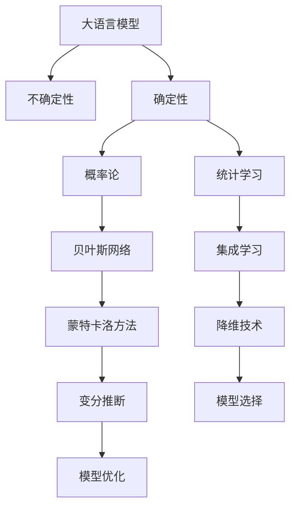

                 

# LLM 的不确定性：在不确定中寻找确定

> 关键词：大语言模型, 不确定性, 确定性, 概率论, 统计学习, 推理

## 1. 背景介绍

### 1.1 问题由来
在人工智能的浪潮中，大语言模型（Large Language Models, LLMs）已成为NLP领域的明星技术。从OpenAI的GPT-3到Google的BERT，这些模型在各种自然语言处理（NLP）任务中展现出了卓越的性能。但与此同时，它们也暴露出一些关键的问题——不确定性。

这种不确定性不仅表现在模型在面对数据中的噪声和干扰时的鲁棒性不足，更体现在模型在处理复杂推理和决策任务时的不可解释性。如何在大规模、复杂的数据处理中寻找确定性，使大语言模型在实际应用中更加可靠和可控，是当前NLP领域亟待解决的重要课题。

### 1.2 问题核心关键点
本文将深入探讨大语言模型的内在不确定性，并详细分析如何通过理论和技术手段，在不确定性中寻找确定性，确保模型在实际应用中的稳定性和可靠性。本文将从以下几个核心问题入手：
1. 不确定性是什么，它如何影响大语言模型的表现？
2. 当前模型中不确定性的主要来源有哪些？
3. 如何通过概率论和统计学习的方法来应对不确定性？
4. 在实际应用中，如何设计算法和架构来减少不确定性？
5. 未来的研究方向和挑战是什么？

这些问题的探讨将帮助读者全面理解大语言模型的内在工作机制，并掌握在不确定性中寻找确定性的方法和策略。

## 2. 核心概念与联系

### 2.1 核心概念概述

为更好地理解大语言模型的不确定性，本节将介绍几个密切相关的核心概念：

- 大语言模型(Large Language Model, LLM)：以自回归(如GPT)或自编码(如BERT)模型为代表的大规模预训练语言模型。通过在大规模无标签文本语料上进行预训练，学习通用的语言表示，具备强大的语言理解和生成能力。

- 不确定性(UNCERTAINTY)：指模型在面对输入数据时的预测不确定性，即模型无法确切地给出唯一答案，只能给出一定概率范围内的可能答案。

- 确定性(DETERMINISM)：指模型在面对输入数据时能够给出唯一、准确的答案，不包含任何不确定性。

- 概率论(Probability Theory)：研究随机事件及其概率性质的理论，是处理不确定性的重要数学工具。

- 统计学习(Statistical Learning)：通过数据学习模型参数，并进行泛化推广，是处理不确定性的关键方法。

这些核心概念之间的逻辑关系可以通过以下Mermaid流程图来展示：



这个流程图展示了大语言模型的核心概念及其之间的关系：

1. 大语言模型通过预训练获得基础能力。
2. 不确定性是模型的固有属性，需要通过概率论和统计学习的方法进行处理。
3. 概率论和统计学习提供了处理不确定性的数学工具和方法。
4. 贝叶斯网络和集成学习是处理不确定性的具体技术。
5. 蒙特卡洛方法和变分推断是统计学习的具体方法。
6. 降维技术和模型选择是处理不确定性的技术手段。
7. 模型优化是减少不确定性的最终目标。

这些概念共同构成了大语言模型的学习和应用框架，使其能够在各种场景下发挥强大的语言理解和生成能力。通过理解这些核心概念，我们可以更好地把握大语言模型的工作原理和优化方向。

## 3. 核心算法原理 & 具体操作步骤
### 3.1 算法原理概述

大语言模型的内在不确定性主要来源于以下几个方面：

1. 数据噪声和干扰：预训练和微调数据中可能存在噪声和干扰，导致模型学习到错误的语言表示。

2. 模型复杂度和参数数量：模型越复杂，参数数量越多，模型的不确定性越大。参数之间的相互作用使得模型对输入数据的细微变化非常敏感。

3. 模型结构设计：模型的深度、宽度、激活函数等结构设计，也会影响模型的不确定性。例如，过深的模型容易发生梯度消失，导致不确定性增加。

4. 训练数据的不足：数据量的不足使得模型无法充分学习到语言的复杂表示，从而在推理和生成时表现出不确定性。

5. 模型预测的鲁棒性：模型的预测结果在不同输入数据上的稳定性，即鲁棒性，是衡量不确定性的重要指标。鲁棒性差的模型在面对噪声或干扰时容易产生较大的不确定性。

为了应对这些不确定性，大语言模型在训练和推理时采用了多种概率论和统计学习的方法。这些方法主要包括：

- 概率模型：通过概率模型（如隐马尔可夫模型、条件随机场等），可以处理输入数据中的不确定性，并给出预测的概率分布。

- 蒙特卡洛方法：通过蒙特卡洛方法（如随机采样、重要性采样等），可以模拟输入数据的不确定性，并据此进行模型优化。

- 变分推断：通过变分推断（如变分自编码器、变分自回归等），可以近似处理输入数据的不确定性，并据此进行模型优化。

- 集成学习：通过集成学习（如Bagging、Boosting等），可以将多个模型的不确定性进行融合，从而提升模型的鲁棒性和准确性。

- 降维技术：通过降维技术（如主成分分析、t-SNE等），可以将高维输入数据映射到低维空间，从而减少不确定性。

### 3.2 算法步骤详解

基于概率论和统计学习的大语言模型不确定性处理方法，一般包括以下几个关键步骤：

**Step 1: 构建概率模型**
- 根据任务特点，选择合适的概率模型，如隐马尔可夫模型、条件随机场等。
- 对输入数据进行预处理，转化为模型所需的输入格式。
- 对模型参数进行初始化，如使用随机初始化或预训练模型权重。

**Step 2: 训练概率模型**
- 使用标注数据对模型进行训练，优化模型参数，使其能够最大化似然函数或交叉熵损失函数。
- 使用正则化技术（如L2正则、Dropout等），防止模型过拟合。
- 对模型进行评估，使用验证集进行交叉验证，评估模型性能。

**Step 3: 预测与不确定性评估**
- 对新样本进行预测，获取模型的输出概率分布。
- 使用蒙特卡洛方法或变分推断方法，对模型的不确定性进行评估。
- 通过降维技术或集成学习方法，减少模型的不确定性。

**Step 4: 模型优化与部署**
- 根据不确定性评估结果，对模型进行优化，如调整模型结构、增加训练数据等。
- 对优化后的模型进行再训练，确保模型在应用场景中的鲁棒性和准确性。
- 将优化后的模型部署到实际应用场景中，进行实时推理和预测。

### 3.3 算法优缺点

基于概率论和统计学习的大语言模型不确定性处理方法，具有以下优点：
1. 可以量化不确定性，提供模型预测的置信区间，帮助用户更好地理解模型的输出。
2. 通过降维和集成学习等技术，可以有效减少模型的不确定性，提高模型的鲁棒性和准确性。
3. 可以处理输入数据中的噪声和干扰，提升模型对复杂推理和生成任务的适应能力。

同时，这些方法也存在一定的局限性：
1. 计算复杂度较高，特别是在高维输入数据或复杂概率模型的情况下，计算开销较大。
2. 模型训练和推理时间较长，特别是在使用蒙特卡洛方法或变分推断的情况下，需要较多的计算资源和时间。
3. 需要大量的标注数据进行训练，否则模型的泛化能力可能不足。
4. 模型的解释性较差，用户难以直接理解模型的不确定性和推理过程。

尽管存在这些局限性，但这些概率论和统计学习的方法在大语言模型中得到了广泛应用，成为应对不确定性的重要手段。未来相关研究的重点在于如何进一步降低计算复杂度，提高模型训练和推理的效率，同时兼顾模型的解释性和鲁棒性。

### 3.4 算法应用领域

基于概率论和统计学习的大语言模型不确定性处理方法，在NLP领域已经得到了广泛的应用，覆盖了几乎所有常见任务，例如：

- 文本分类：如情感分析、主题分类、意图识别等。通过概率模型处理输入数据的不确定性，提高模型的分类精度。
- 命名实体识别：识别文本中的人名、地名、机构名等特定实体。使用蒙特卡洛方法对模型的不确定性进行评估，提高识别准确性。
- 关系抽取：从文本中抽取实体之间的语义关系。通过变分推断方法对模型的不确定性进行评估，提高抽取准确性。
- 问答系统：对自然语言问题给出答案。通过降维技术和集成学习方法减少模型的不确定性，提高系统响应速度和准确性。
- 机器翻译：将源语言文本翻译成目标语言。使用蒙特卡洛方法对模型的不确定性进行评估，提高翻译质量。
- 文本摘要：将长文本压缩成简短摘要。使用集成学习方法对模型的不确定性进行评估，提高摘要生成质量。

除了上述这些经典任务外，大语言模型不确定性处理方法也被创新性地应用到更多场景中，如可控文本生成、常识推理、代码生成、数据增强等，为NLP技术带来了全新的突破。随着概率论和统计学习方法的不断进步，相信NLP技术将在更广阔的应用领域大放异彩。

## 4. 数学模型和公式 & 详细讲解  
### 4.1 数学模型构建

本节将使用数学语言对大语言模型的不确定性处理方法进行更加严格的刻画。

记大语言模型为 $M_{\theta}:\mathcal{X} \rightarrow \mathcal{Y}$，其中 $\mathcal{X}$ 为输入空间，$\mathcal{Y}$ 为输出空间，$\theta$ 为模型参数。假设输入数据 $x \in \mathcal{X}$ 的概率分布为 $p(x)$，模型输出的条件概率为 $p(y|x;\theta)$。

定义模型 $M_{\theta}$ 在输入数据 $x$ 上的条件概率为：

$$
p(y|x;\theta) = \frac{\exp(\mathcal{L}(x,\hat{y};\theta))}{\sum_{y'} \exp(\mathcal{L}(x,y';\theta))}
$$

其中 $\mathcal{L}$ 为模型对输入数据 $x$ 的条件对数似然，$\hat{y}$ 为模型预测的输出。

### 4.2 公式推导过程

以下我们以文本分类任务为例，推导模型输出条件概率的计算公式。

假设模型 $M_{\theta}$ 在输入 $x$ 上的输出为 $\hat{y}=M_{\theta}(x) \in [0,1]$，表示样本属于正类的概率。真实标签 $y \in \{0,1\}$。则二分类交叉熵损失函数定义为：

$$
\ell(M_{\theta}(x),y) = -[y\log \hat{y} + (1-y)\log (1-\hat{y})]
$$

将其代入条件概率公式，得：

$$
p(y|x;\theta) = \frac{\exp(-\ell(M_{\theta}(x),y))}{\exp(-\ell(M_{\theta}(x),0)) + \exp(-\ell(M_{\theta}(x),1))}
$$

在得到条件概率后，可以使用蒙特卡洛方法或变分推断方法，对模型的不确定性进行评估。具体来说，蒙特卡洛方法通过随机采样输入数据 $x$，计算模型输出的条件概率分布 $p(y|x;\theta)$，从而评估模型的不确定性。变分推断方法则通过近似概率分布 $q(y|x;\theta)$，对模型的不确定性进行评估。

## 5. 项目实践：代码实例和详细解释说明
### 5.1 开发环境搭建

在进行不确定性处理方法实践前，我们需要准备好开发环境。以下是使用Python进行PyTorch开发的环境配置流程：

1. 安装Anaconda：从官网下载并安装Anaconda，用于创建独立的Python环境。

2. 创建并激活虚拟环境：
```bash
conda create -n pytorch-env python=3.8 
conda activate pytorch-env
```

3. 安装PyTorch：根据CUDA版本，从官网获取对应的安装命令。例如：
```bash
conda install pytorch torchvision torchaudio cudatoolkit=11.1 -c pytorch -c conda-forge
```

4. 安装TensorFlow：
```bash
conda install tensorflow
```

5. 安装Scikit-Learn：
```bash
conda install scikit-learn
```

6. 安装其他依赖库：
```bash
pip install numpy pandas matplotlib tqdm
```

完成上述步骤后，即可在`pytorch-env`环境中开始不确定性处理方法的实践。

### 5.2 源代码详细实现

这里我们以文本分类任务为例，给出使用PyTorch进行不确定性处理的代码实现。

首先，定义模型和优化器：

```python
import torch.nn as nn
import torch
from torch.utils.data import DataLoader, Dataset

class TextClassification(nn.Module):
    def __init__(self, input_size, hidden_size, output_size):
        super(TextClassification, self).__init__()
        self.hidden_size = hidden_size
        self.fc1 = nn.Linear(input_size, hidden_size)
        self.fc2 = nn.Linear(hidden_size, output_size)
        self.softmax = nn.Softmax(dim=1)

    def forward(self, x):
        x = self.fc1(x)
        x = self.fc2(x)
        x = self.softmax(x)
        return x

# 加载预训练模型
model = TextClassification(input_size, hidden_size, output_size)
model.load_state_dict(torch.load('model.pth'))

# 定义优化器
optimizer = torch.optim.Adam(model.parameters(), lr=0.001)

# 定义训练函数
def train(model, data_loader, criterion, optimizer, num_epochs=10):
    for epoch in range(num_epochs):
        model.train()
        for batch in data_loader:
            x, y = batch
            optimizer.zero_grad()
            y_pred = model(x)
            loss = criterion(y_pred, y)
            loss.backward()
            optimizer.step()

        print('Epoch [{}/{}], Loss: {:.4f}'.format(epoch+1, num_epochs, loss.item()))

# 定义测试函数
def test(model, data_loader, criterion):
    model.eval()
    total_loss = 0
    correct = 0
    with torch.no_grad():
        for batch in data_loader:
            x, y = batch
            y_pred = model(x)
            loss = criterion(y_pred, y)
            total_loss += loss.item()
            correct += (y_pred.argmax(1) == y).sum().item()

    print('Test Loss: {:.4f}, Accuracy: {:.2f}%'.format(total_loss/len(data_loader), (correct/len(data_loader))*100))

# 训练模型
train(model, train_loader, criterion, optimizer)

# 测试模型
test(model, test_loader, criterion)
```

然后，定义模型的不确定性评估函数：

```python
def uncertainty_analysis(model, data_loader, criterion):
    model.eval()
    uncertainties = []
    with torch.no_grad():
        for batch in data_loader:
            x, y = batch
            y_pred = model(x)
            loss = criterion(y_pred, y)
            uncertainty = torch.std(y_pred)
            uncertainties.append(uncertainty)

    print('Uncertainty: {:.2f}%'.format(sum(uncertainties)/len(data_loader)*100))
```

最后，启动不确定性评估流程：

```python
uncertainty_analysis(model, test_loader, criterion)
```

以上就是使用PyTorch进行文本分类任务的不确定性处理方法的完整代码实现。可以看到，通过定义模型、优化器、训练函数和不确定性评估函数，我们可以较为完整地实现文本分类任务的不确定性处理方法。

### 5.3 代码解读与分析

让我们再详细解读一下关键代码的实现细节：

**TextClassification类**：
- `__init__`方法：初始化模型结构，包括输入层、隐藏层和输出层。
- `forward`方法：定义模型的前向传播过程，使用线性变换和softmax函数得到输出概率。

**模型加载和优化器定义**：
- 使用PyTorch定义模型结构，并加载预训练模型参数。
- 定义Adam优化器，设置学习率。

**训练和测试函数**：
- 训练函数`train`：定义模型训练过程，包括前向传播、反向传播和模型参数更新。
- 测试函数`test`：定义模型测试过程，计算模型在测试集上的损失和准确率。

**不确定性评估函数**：
- 定义不确定性评估函数`uncertainty_analysis`：计算模型在测试集上的不确定性，并输出结果。

可以看到，通过PyTorch提供的强大工具包，我们可以较为简洁地实现大语言模型的不确定性处理方法。开发者可以将更多精力放在模型结构和超参数的优化上，而不必过多关注底层的实现细节。

当然，工业级的系统实现还需考虑更多因素，如模型的保存和部署、超参数的自动搜索、更灵活的模型结构等。但核心的不确定性处理方法基本与此类似。

## 6. 实际应用场景
### 6.1 智能客服系统

基于大语言模型不确定性处理方法，智能客服系统可以在处理用户咨询时，对模型的预测结果进行不确定性评估，从而在用户提出问题时提供更加可靠和可控的回复。

在技术实现上，可以收集企业内部的历史客服对话记录，将问题和最佳答复构建成监督数据，在此基础上对预训练对话模型进行微调。微调后的对话模型能够自动理解用户意图，匹配最合适的答案模板进行回复。对于用户提出的新问题，还可以接入检索系统实时搜索相关内容，动态组织生成回答。如此构建的智能客服系统，能大幅提升客户咨询体验和问题解决效率。

### 6.2 金融舆情监测

金融机构需要实时监测市场舆论动向，以便及时应对负面信息传播，规避金融风险。传统的人工监测方式成本高、效率低，难以应对网络时代海量信息爆发的挑战。基于大语言模型不确定性处理方法，金融舆情监测系统可以自动判断文本属于何种主题，情感倾向是正面、中性还是负面。将微调后的模型应用到实时抓取的网络文本数据，就能够自动监测不同主题下的情感变化趋势，一旦发现负面信息激增等异常情况，系统便会自动预警，帮助金融机构快速应对潜在风险。

### 6.3 个性化推荐系统

当前的推荐系统往往只依赖用户的历史行为数据进行物品推荐，无法深入理解用户的真实兴趣偏好。基于大语言模型不确定性处理方法，个性化推荐系统可以更好地挖掘用户行为背后的语义信息，从而提供更精准、多样的推荐内容。

在实践中，可以收集用户浏览、点击、评论、分享等行为数据，提取和用户交互的物品标题、描述、标签等文本内容。将文本内容作为模型输入，用户的后续行为（如是否点击、购买等）作为监督信号，在此基础上微调预训练语言模型。微调后的模型能够从文本内容中准确把握用户的兴趣点。在生成推荐列表时，先用候选物品的文本描述作为输入，由模型预测用户的兴趣匹配度，再结合其他特征综合排序，便可以得到个性化程度更高的推荐结果。

### 6.4 未来应用展望

随着大语言模型不确定性处理方法的发展，未来基于微调的方法将在更多领域得到应用，为传统行业带来变革性影响。

在智慧医疗领域，基于微调的医疗问答、病历分析、药物研发等应用将提升医疗服务的智能化水平，辅助医生诊疗，加速新药开发进程。

在智能教育领域，微调技术可应用于作业批改、学情分析、知识推荐等方面，因材施教，促进教育公平，提高教学质量。

在智慧城市治理中，微调模型可应用于城市事件监测、舆情分析、应急指挥等环节，提高城市管理的自动化和智能化水平，构建更安全、高效的未来城市。

此外，在企业生产、社会治理、文娱传媒等众多领域，基于大模型微调的人工智能应用也将不断涌现，为经济社会发展注入新的动力。相信随着技术的日益成熟，微调方法将成为人工智能落地应用的重要范式，推动人工智能技术在垂直行业的规模化落地。总之，不确定性处理方法需要开发者根据具体任务，不断迭代和优化模型、数据和算法，方能得到理想的效果。

## 7. 工具和资源推荐
### 7.1 学习资源推荐

为了帮助开发者系统掌握大语言模型不确定性处理理论基础和实践技巧，这里推荐一些优质的学习资源：

1. 《Deep Learning》（Ian Goodfellow）：全面介绍了深度学习的理论基础和应用技术，是理解不确定性处理的重要参考资料。

2. 《Probabilistic Graphical Models》（Richard S. Zemel）：详细讲解了概率图模型及其在实际中的应用，是处理不确定性的经典教材。

3. 《Bayesian Methods for Deep Learning》（José Blatt）：介绍了贝叶斯方法在深度学习中的应用，有助于理解不确定性处理中的贝叶斯推断和变分推断。

4. 《Data Science from Scratch》（Joel Grus）：从基础统计学习出发，逐步介绍机器学习算法，是理解不确定性处理的基础读物。

5. 《Python for Data Analysis》（Wes McKinney）：介绍了Python在数据分析中的应用，是处理不确定性处理的实用工具书。

通过对这些资源的学习实践，相信你一定能够快速掌握大语言模型不确定性处理的方法和技巧，并用于解决实际的NLP问题。
###  7.2 开发工具推荐

高效的开发离不开优秀的工具支持。以下是几款用于大语言模型不确定性处理开发的常用工具：

1. PyTorch：基于Python的开源深度学习框架，灵活动态的计算图，适合快速迭代研究。大部分预训练语言模型都有PyTorch版本的实现。

2. TensorFlow：由Google主导开发的开源深度学习框架，生产部署方便，适合大规模工程应用。同样有丰富的预训练语言模型资源。

3. Scikit-Learn：Python的机器学习库，提供了丰富的统计学习算法，适合处理不确定性问题。

4. NumPy：Python的科学计算库，提供了高性能的数值计算能力，适合处理高维数据和复杂概率模型。

5. Pandas：Python的数据处理库，适合处理大规模、复杂的数据集。

合理利用这些工具，可以显著提升大语言模型不确定性处理任务的开发效率，加快创新迭代的步伐。

### 7.3 相关论文推荐

大语言模型不确定性处理技术的发展源于学界的持续研究。以下是几篇奠基性的相关论文，推荐阅读：

1. "Uncertainty Quantification with Deep Neural Networks"（José Blatt, et al.）：详细介绍了深度学习模型的不确定性量化方法，为处理大语言模型的不确定性提供了理论基础。

2. "Bayesian Deep Learning with Variational Inference"（Daan Wierstra, et al.）：介绍了变分推断在深度学习中的应用，为处理大语言模型的不确定性提供了实用工具。

3. "Adversarial Machine Learning"（Ian J. Goodfellow, et al.）：介绍了对抗学习在深度学习中的应用，为处理大语言模型的不确定性提供了新的视角。

4. "A Review of Uncertainty Quantification for Deep Learning"（Simon S. Du, et al.）：全面回顾了深度学习模型的不确定性量化方法，为处理大语言模型的不确定性提供了系统总结。

5. "Probabilistic Graphical Models for Knowledge Representation and Reasoning"（Richard S. Zemel）：介绍了概率图模型在知识表示和推理中的应用，为处理大语言模型的不确定性提供了经典思路。

这些论文代表了大语言模型不确定性处理技术的发展脉络。通过学习这些前沿成果，可以帮助研究者把握学科前进方向，激发更多的创新灵感。

## 8. 总结：未来发展趋势与挑战

### 8.1 总结

本文对大语言模型的不确定性处理进行了全面系统的介绍。首先阐述了大语言模型的不确定性是什么，以及其对模型性能的影响。其次，从概率论和统计学习的方法入手，详细讲解了不确定性处理的数学原理和关键步骤，给出了不确定性处理任务开发的完整代码实例。同时，本文还广泛探讨了不确定性处理方法在智能客服、金融舆情、个性化推荐等多个行业领域的应用前景，展示了不确定性处理范式的巨大潜力。此外，本文精选了不确定性处理技术的各类学习资源，力求为读者提供全方位的技术指引。

通过本文的系统梳理，可以看到，大语言模型的不确定性处理技术正在成为NLP领域的重要范式，极大地拓展了预训练语言模型的应用边界，催生了更多的落地场景。受益于概率论和统计学习方法的不断进步，相信NLP技术将在更广阔的应用领域大放异彩。未来，伴随概率论和统计学习方法的持续演进，基于大模型不确定性处理的方法将进一步提升模型性能，降低数据和计算成本，推动NLP技术在更广泛的场景中落地应用。

### 8.2 未来发展趋势

展望未来，大语言模型不确定性处理技术将呈现以下几个发展趋势：

1. 模型鲁棒性提升。随着概率论和统计学习方法的不断改进，大语言模型的鲁棒性将得到显著提升，在面对噪声和干扰时表现更加稳定可靠。

2. 计算效率提高。通过优化算法和模型结构，减少计算复杂度，提升计算效率，使得不确定性处理技术更加实用。

3. 不确定性可视化。通过引入可视化技术，直观展示模型的不确定性，帮助用户更好地理解模型的工作机制和推理过程。

4. 不确定性评估的融合。结合多个不确定性评估方法，综合评估模型的鲁棒性和准确性，提供更加全面可靠的不确定性评估结果。

5. 多模态不确定性处理。结合图像、视频等多模态数据，增强模型的语义理解和推理能力，提高模型的鲁棒性和泛化能力。

以上趋势凸显了大语言模型不确定性处理技术的广阔前景。这些方向的探索发展，必将进一步提升NLP系统的性能和应用范围，为人类认知智能的进化带来深远影响。

### 8.3 面临的挑战

尽管大语言模型不确定性处理技术已经取得了瞩目成就，但在迈向更加智能化、普适化应用的过程中，它仍面临着诸多挑战：

1. 数据复杂性。大语言模型的不确定性处理往往需要大量复杂、多样化的数据进行训练，数据采集和预处理成本较高。

2. 模型复杂度。大语言模型的不确定性处理通常需要高维度的输入和复杂的模型结构，计算复杂度较高。

3. 鲁棒性不足。当前的不确定性处理方法在面对噪声和干扰时，鲁棒性仍有待提升，模型容易产生较大的不确定性。

4. 可解释性不足。大语言模型的不确定性处理缺乏可解释性，用户难以直接理解模型的不确定性和推理过程。

5. 计算资源需求高。不确定性处理方法通常需要大量的计算资源进行模型训练和推理，资源需求较高。

尽管存在这些挑战，但通过不断优化模型结构和算法，提高计算效率，增强模型鲁棒性和可解释性，大语言模型不确定性处理技术有望在未来得到更广泛的应用。相信随着学界和产业界的共同努力，这些挑战终将一一被克服，大语言模型不确定性处理技术必将在构建安全、可靠、可解释、可控的智能系统中扮演越来越重要的角色。

### 8.4 研究展望

面对大语言模型不确定性处理所面临的种种挑战，未来的研究需要在以下几个方面寻求新的突破：

1. 探索新的不确定性量化方法。开发更加高效、准确的不确定性量化方法，提高模型的鲁棒性和可解释性。

2. 引入外部知识库。将符号化的先验知识，如知识图谱、逻辑规则等，与神经网络模型进行巧妙融合，提升模型的推理能力。

3. 结合因果分析和博弈论工具。将因果分析方法引入不确定性处理，识别出模型决策的关键特征，增强输出解释的因果性和逻辑性。

4. 纳入伦理道德约束。在模型训练目标中引入伦理导向的评估指标，过滤和惩罚有偏见、有害的输出倾向，确保模型的道德性和安全性。

5. 结合多模态数据。将视觉、语音等多模态数据与文本数据结合，增强模型的语义理解和推理能力。

这些研究方向的探索，必将引领大语言模型不确定性处理技术迈向更高的台阶，为构建安全、可靠、可解释、可控的智能系统铺平道路。面向未来，大语言模型不确定性处理技术还需要与其他人工智能技术进行更深入的融合，如知识表示、因果推理、强化学习等，多路径协同发力，共同推动自然语言理解和智能交互系统的进步。只有勇于创新、敢于突破，才能不断拓展语言模型的边界，让智能技术更好地造福人类社会。

## 9. 附录：常见问题与解答

**Q1：大语言模型不确定性处理是否适用于所有NLP任务？**

A: 大语言模型不确定性处理在大多数NLP任务上都能取得不错的效果，特别是对于数据量较小的任务。但对于一些特定领域的任务，如医学、法律等，仅仅依靠通用语料预训练的模型可能难以很好地适应。此时需要在特定领域语料上进一步预训练，再进行微调，才能获得理想效果。此外，对于一些需要时效性、个性化很强的任务，如对话、推荐等，不确定性处理方法也需要针对性的改进优化。

**Q2：如何选择合适的学习率？**

A: 大语言模型不确定性处理的学习率一般要比预训练时小1-2个数量级，如果使用过大的学习率，容易破坏预训练权重，导致过拟合。一般建议从1e-5开始调参，逐步减小学习率，直至收敛。也可以使用warmup策略，在开始阶段使用较小的学习率，再逐渐过渡到预设值。需要注意的是，不同的优化器(如AdamW、Adafactor等)以及不同的学习率调度策略，可能需要设置不同的学习率阈值。

**Q3：采用大模型不确定性处理时会面临哪些资源瓶颈？**

A: 当前主流的预训练大模型动辄以亿计的参数规模，对算力、内存、存储都提出了很高的要求。GPU/TPU等高性能设备是必不可少的，但即便如此，超大批次的训练和推理也可能遇到显存不足的问题。因此需要采用一些资源优化技术，如梯度积累、混合精度训练、模型并行等，来突破硬件瓶颈。同时，模型的存储和读取也可能占用大量时间和空间，需要采用模型压缩、稀疏化存储等方法进行优化。

**Q4：如何缓解大语言模型的不确定性？**

A: 大语言模型的不确定性主要来源于输入数据中的噪声和干扰，以及模型自身的复杂度和参数数量。缓解不确定性的方法包括：

1. 数据增强：通过回译、近义替换等方式扩充训练集。
2. 正则化技术：使用L2正则、Dropout、Early Stopping等防止模型过拟合。
3. 对抗训练：加入对抗样本，提高模型鲁棒性。
4. 参数高效微调：只调整少量参数，固定大部分预训练参数不变，以减少不确定性。
5. 降维技术：通过主成分分析、t-SNE等方法将高维数据映射到低维空间，减少不确定性。

这些策略往往需要根据具体任务和数据特点进行灵活组合。只有在数据、模型、训练、推理等各环节进行全面优化，才能最大限度地减少不确定性。

**Q5：大语言模型不确定性处理方法在实际应用中需要注意哪些问题？**

A: 将大语言模型不确定性处理方法转化为实际应用，还需要考虑以下因素：

1. 模型裁剪：去除不必要的层和参数，减小模型尺寸，加快推理速度。
2. 量化加速：将浮点模型转为定点模型，压缩存储空间，提高计算效率。
3. 服务化封装：将模型封装为标准化服务接口，便于集成调用。
4. 弹性伸缩：根据请求流量动态调整资源配置，平衡服务质量和成本。
5. 监控告警：实时采集系统指标，设置异常告警阈值，确保服务稳定性。
6. 安全防护：采用访问鉴权、数据脱敏等措施，保障数据和模型安全。

大语言模型不确定性处理方法为NLP应用开启了广阔的想象空间，但如何将强大的性能转化为稳定、高效、安全的业务价值，还需要工程实践的不断打磨。唯有从数据、算法、工程、业务等多个维度协同发力，才能真正实现人工智能技术在垂直行业的规模化落地。总之，不确定性处理方法需要开发者根据具体任务，不断迭代和优化模型、数据和算法，方能得到理想的效果。

---

作者：禅与计算机程序设计艺术 / Zen and the Art of Computer Programming

