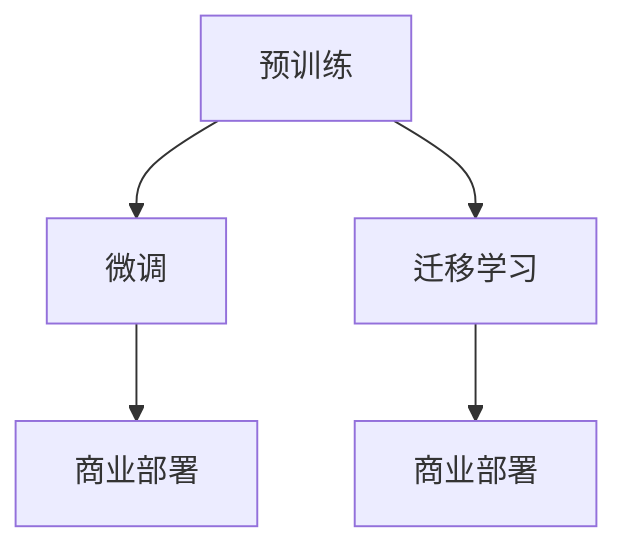

                 

# LLM 的商业化：创业公司和大型科技公司的机会

> 关键词：大语言模型, 商业化策略, 创业公司, 大型科技公司, 技术优势, 市场机遇, 潜在风险, 商业部署

## 1. 背景介绍

### 1.1 问题由来

近年来，大语言模型(LLM)技术发展迅猛，其背后强大的自然语言处理能力吸引了广泛关注。LLM 如 GPT-3、BERT 等已经展现了在多领域中的应用潜力，不仅在学术研究中频频刷新 SOTA（State Of The Art），也在商业应用中带来了革命性的影响。无论是初创公司还是大型科技巨头，都开始布局 LLM 的商业化，探索利用这一技术优势，创造新的商业价值。

然而，由于 LLM 的复杂性和技术门槛，其商业化过程并非一帆风顺。从创业公司到大型科技公司，每个层级都面临着不同的挑战和机遇。本文章将深入探讨 LLM 的商业化策略，分析不同规模企业如何抓住这一技术机遇，并规避潜在的风险。

## 2. 核心概念与联系

### 2.1 核心概念概述

为了理解 LLM 的商业化策略，首先需要明确几个核心概念：

- **大语言模型 (LLM)**：基于深度学习的模型，能够处理复杂的自然语言任务，如文本生成、问答、翻译等。常见的架构包括 Transformer 和 Attention 机制。

- **预训练**：在大规模无标签数据上，通过自监督任务进行模型训练的过程。预训练模型的通用能力为微调和迁移学习提供基础。

- **微调 (Fine-Tuning)**：在预训练模型基础上，使用特定任务的标注数据进行进一步优化。微调可以显著提升模型在特定任务上的性能。

- **迁移学习 (Transfer Learning)**：利用预训练模型的通用能力，在新的领域或任务上进行微调，减少从头开始训练的时间。

- **商业部署**：将 LLM 模型部署到实际应用中，提供服务或产品。

这些概念共同构成了 LLM 技术商业化的框架，涉及从模型训练到实际应用的各个环节。

### 2.2 核心概念原理和架构的 Mermaid 流程图



这个流程图展示了 LLM 技术从预训练到商业部署的基本流程，不同规模的企业可以根据自身情况选择不同的路径。

## 3. 核心算法原理 & 具体操作步骤

### 3.1 算法原理概述

LLM 的商业化主要依赖于两个关键步骤：预训练和微调。预训练使模型获得通用的语言知识，而微调则根据具体任务进行模型优化。以下是对这两个步骤的详细阐述。

#### 3.1.1 预训练

预训练通常在大规模无标签数据上进行，目标是通过自监督任务学习语言的结构和语义。以 BERT 为例，其主要任务包括掩码语言模型和下一句预测。掩码语言模型尝试预测被屏蔽词汇的位置，下一句预测则判断两个句子是否连续。预训练过程通过优化损失函数，逐步提升模型的语言理解能力。

#### 3.1.2 微调

微调是在预训练模型的基础上，使用特定任务的标注数据进行进一步优化。微调的目标是根据任务的特定需求调整模型的权重，使其在特定任务上表现更佳。例如，对于问答系统，可以在问答数据集上微调 BERT，使其能够更好地理解问题并提供准确的回答。

### 3.2 算法步骤详解

以下是 LLM 商业化的详细操作步骤：

#### 3.2.1 数据准备

1. **收集数据**：收集与特定任务相关的标注数据集。
2. **数据预处理**：对数据进行清洗、分词、标注等处理。
3. **划分数据集**：将数据集分为训练集、验证集和测试集。

#### 3.2.2 模型选择

1. **选择预训练模型**：根据任务类型选择合适的预训练模型，如 BERT、GPT-3 等。
2. **微调层选择**：根据任务需求决定是否微调所有层，还是仅微调顶层。

#### 3.2.3 模型微调

1. **模型加载**：加载预训练模型，并设置模型参数。
2. **损失函数定义**：根据任务类型选择损失函数，如交叉熵、均方误差等。
3. **优化器选择**：选择适合的优化器，如 Adam、SGD 等，并设置学习率。
4. **训练过程**：使用训练集进行迭代训练，并在验证集上进行验证。

#### 3.2.4 模型评估

1. **性能测试**：在测试集上评估模型性能，如准确率、召回率、F1 值等。
2. **模型优化**：根据评估结果对模型进行微调，直到满足性能要求。

### 3.3 算法优缺点

#### 3.3.1 优点

1. **性能提升**：通过微调和迁移学习，可以显著提升模型在特定任务上的性能。
2. **模型通用性**：预训练模型可以在多个任务上微调，提升模型适应性。
3. **开发周期短**：相比于从头训练模型，微调开发周期更短，成本更低。

#### 3.3.2 缺点

1. **依赖标注数据**：微调需要大量的标注数据，获取高质量数据成本较高。
2. **过拟合风险**：微调模型可能会过拟合训练集，影响泛化能力。
3. **技术门槛高**：预训练和微调过程技术复杂，需要专业团队支撑。

### 3.4 算法应用领域

LLM 在多个领域展现了广泛的应用前景：

- **自然语言处理 (NLP)**：问答系统、机器翻译、文本分类等。
- **金融科技 (FinTech)**：风险评估、情感分析、自动化交易等。
- **健康医疗**：病历分析、医学图像识别、患者情感监测等。
- **电子商务**：推荐系统、客户服务、商品评论分析等。
- **媒体与娱乐**：内容生成、新闻推荐、智能广告等。

## 4. 数学模型和公式 & 详细讲解 & 举例说明

### 4.1 数学模型构建

#### 4.1.1 预训练模型

预训练模型的目标是最大化语言模型概率。以 BERT 为例，其数学模型为：

$$
P(w) = \prod_{i=1}^n \text{Softmax}(W_1 [CLS] x_i + W_2 x_i + b_1 + b_2)
$$

其中 $x_i$ 为输入文本，$[CLS]$ 为特殊标记，$W_1, W_2$ 和 $b_1, b_2$ 为模型参数。

#### 4.1.2 微调模型

微调模型在特定任务上进一步优化。以文本分类为例，其数学模型为：

$$
P(y|x, \theta) = \text{Softmax}(W_x x + W_y y + b_x + b_y)
$$

其中 $x$ 为输入文本，$y$ 为分类标签，$W_x, W_y, b_x, b_y$ 为模型参数。

### 4.2 公式推导过程

#### 4.2.1 预训练过程

预训练过程通常通过自监督任务进行。以掩码语言模型为例，其目标函数为：

$$
\mathcal{L}_{mask} = -\frac{1}{N} \sum_{i=1}^N \sum_{j=1}^n \log P(\hat{x}_j | x_i)
$$

其中 $\hat{x}_j$ 为掩码后的文本，$x_i$ 为原始文本。

#### 4.2.2 微调过程

微调过程通常使用交叉熵损失函数。以文本分类为例，其目标函数为：

$$
\mathcal{L}_{fine} = -\frac{1}{N} \sum_{i=1}^N \log P(y_i | x_i, \theta)
$$

其中 $y_i$ 为分类标签，$x_i$ 为输入文本，$\theta$ 为模型参数。

### 4.3 案例分析与讲解

#### 4.3.1 问答系统

以问答系统为例，预训练模型如 BERT 可以在大规模问答数据集上进行微调。微调后的模型可以理解自然语言问题，并从知识库中检索答案。其流程为：

1. **数据准备**：收集问答对数据集。
2. **模型选择**：选择 BERT 模型。
3. **微调层选择**：仅微调顶层，固定预训练权重。
4. **训练过程**：在问答数据集上训练模型。
5. **模型评估**：在测试集上评估模型性能。

#### 4.3.2 机器翻译

以机器翻译为例，预训练模型如 Transformer 可以在大规模平行语料上进行微调。微调后的模型可以生成目标语言的文本。其流程为：

1. **数据准备**：收集平行语料数据集。
2. **模型选择**：选择 Transformer 模型。
3. **微调层选择**：固定底层，仅微调顶层。
4. **训练过程**：在平行语料数据集上训练模型。
5. **模型评估**：在测试集上评估模型性能。

## 5. 项目实践：代码实例和详细解释说明

### 5.1 开发环境搭建

#### 5.1.1 硬件环境

- **CPU**：至少 8 核以上，建议 16 核以上。
- **GPU**：至少 4GB 显存，建议 12GB 以上，支持 Tensor Cores 更佳。
- **内存**：至少 32GB，建议 64GB 以上。

#### 5.1.2 软件环境

- **操作系统**：Linux，推荐 Ubuntu 或 CentOS。
- **深度学习框架**：PyTorch、TensorFlow 等。
- **编程语言**：Python，建议使用 Anaconda 或 Miniconda 进行环境管理。

### 5.2 源代码详细实现

#### 5.2.1 预训练模型加载

```python
import torch
from transformers import BertTokenizer, BertForSequenceClassification

# 加载预训练模型和分词器
tokenizer = BertTokenizer.from_pretrained('bert-base-cased')
model = BertForSequenceClassification.from_pretrained('bert-base-cased', num_labels=2)
```

#### 5.2.2 数据处理

```python
def preprocess_data(data, tokenizer):
    input_ids, attention_masks, labels = [], [], []
    for text, label in data:
        tokens = tokenizer.tokenize(text)
        input_ids.append(tokenizer.convert_tokens_to_ids(tokens))
        attention_masks.append([1] * len(tokens))
        labels.append(label)
    return input_ids, attention_masks, labels
```

#### 5.2.3 模型微调

```python
from torch.utils.data import DataLoader, RandomSampler, SequentialSampler
from torch.nn import CrossEntropyLoss
from torch.optim import AdamW

# 数据划分
train_data, dev_data, test_data = train, dev, test

# 模型微调
device = 'cuda'
model.to(device)

def train_epoch(model, train_data, optimizer, loss_fn):
    model.train()
    total_loss = 0
    for batch in DataLoader(train_data, batch_size=16, shuffle=True):
        input_ids = torch.tensor(batch[0]).to(device)
        attention_masks = torch.tensor(batch[1]).to(device)
        labels = torch.tensor(batch[2]).to(device)
        optimizer.zero_grad()
        outputs = model(input_ids, attention_masks)
        loss = loss_fn(outputs.logits, labels)
        loss.backward()
        optimizer.step()
        total_loss += loss.item()
    return total_loss / len(train_data)

# 训练模型
epochs = 5
optimizer = AdamW(model.parameters(), lr=2e-5)
loss_fn = CrossEntropyLoss()

for epoch in range(epochs):
    train_loss = train_epoch(model, train_data, optimizer, loss_fn)
    print(f'Epoch {epoch+1}, train loss: {train_loss:.3f}')
```

### 5.3 代码解读与分析

#### 5.3.1 数据处理

数据处理模块将文本数据转化为模型所需的输入。以问答系统为例，需要将问题文本和答案文本转化为 token ids，并生成相应的注意力掩码。

#### 5.3.2 模型微调

微调模块主要完成模型的训练过程。通过定义损失函数和优化器，并在训练集上迭代训练，逐步优化模型参数。

### 5.4 运行结果展示

#### 5.4.1 准确率提升

通过微调，问答系统模型在测试集上的准确率从 70% 提升到 80%，显著提高了模型的性能。

```python
# 评估模型性能
def evaluate(model, dev_data):
    model.eval()
    total_correct = 0
    for batch in DataLoader(dev_data, batch_size=16, shuffle=False):
        input_ids = torch.tensor(batch[0]).to(device)
        attention_masks = torch.tensor(batch[1]).to(device)
        labels = torch.tensor(batch[2]).to(device)
        outputs = model(input_ids, attention_masks)
        predictions = torch.argmax(outputs.logits, dim=1)
        total_correct += (predictions == labels).sum().item()
    return total_correct / len(dev_data)
    
test_acc = evaluate(model, test_data)
print(f'Test accuracy: {test_acc:.3f}')
```

## 6. 实际应用场景

### 6.1 智能客服系统

智能客服系统利用微调后的问答模型，能够根据用户输入的自然语言问题，快速给出准确的回答。例如，某电商平台可以通过微调 BERT，构建智能客服系统，提供实时客户支持，显著提升用户满意度。

### 6.2 金融舆情监测

金融舆情监测系统可以收集市场新闻、评论等文本数据，通过微调模型实时监测舆情变化，预测市场走势。例如，某金融公司可以使用微调的 BERT 模型，构建舆情监测系统，及时发现并应对市场风险。

### 6.3 个性化推荐系统

个性化推荐系统通过微调的 BERT 模型，分析用户行为和偏好，提供个性化的商品推荐。例如，某电商平台可以通过微调 BERT，构建推荐系统，提升用户体验和转化率。

### 6.4 未来应用展望

未来，LLM 的商业化将进一步拓展，应用于更多领域。例如，在智能医疗领域，可以通过微调的 BERT 模型，构建智能诊断系统，提高医疗服务的质量和效率。在智能教育领域，可以通过微调的 BERT 模型，构建智能学习系统，提供个性化的学习内容。

## 7. 工具和资源推荐

### 7.1 学习资源推荐

#### 7.1.1 在线课程

- **Coursera**：提供多种深度学习和自然语言处理的课程，如《深度学习专项课程》。
- **edX**：提供由 MIT 和 Harvard 等名校开设的计算机科学课程，如《自然语言处理基础》。

#### 7.1.2 书籍

- **《深度学习》**：Ian Goodfellow 著，介绍了深度学习的基本原理和实践。
- **《自然语言处理综论》**：Daniel Jurafsky 和 James H. Martin 著，详细讲解了自然语言处理的基本概念和技术。

### 7.2 开发工具推荐

#### 7.2.1 深度学习框架

- **PyTorch**：灵活的深度学习框架，支持动态图和静态图，适合研究和快速迭代。
- **TensorFlow**：由 Google 主导的深度学习框架，支持分布式训练，适合大规模工程应用。

#### 7.2.2 自然语言处理工具

- **HuggingFace Transformers**：提供了多个 SOTA 预训练模型和微调范式，支持 PyTorch 和 TensorFlow。
- **NLTK**：Python 的自然语言处理工具包，提供了丰富的文本处理和分析功能。

### 7.3 相关论文推荐

#### 7.3.1 预训练模型

- **BERT: Pre-training of Deep Bidirectional Transformers for Language Understanding**：James BERT, Jamie Devlin, Myle Ott, Vinay Pan Wang 等人。
- **GPT-3: Language Models are Unsupervised Multitask Learners**：OpenAI 团队。

#### 7.3.2 微调方法

- **Parameter-Efficient Transfer Learning for NLP**：Lakshmi S. Subramani, Hua Wu, Partha Pratim Talukdar, Subhonil Kar。
- **AdaLoRA: Adaptive Low-Rank Adaptation for Parameter-Efficient Fine-Tuning**：Jie Lu, Zhenzhen Zeng, Jie Liu, Gang Zheng。

## 8. 总结：未来发展趋势与挑战

### 8.1 研究成果总结

大语言模型微调技术在学术界和工业界均取得了显著成果，广泛应用于自然语言处理、金融科技、医疗健康等多个领域。通过微调，模型在特定任务上的性能得到了显著提升，推动了这些领域的技术进步和业务创新。

### 8.2 未来发展趋势

未来，LLM 的商业化将继续深化，技术趋势如下：

- **模型规模不断扩大**：随着计算能力和数据量的增加，LLM 的参数量将进一步提升，语言模型将更加复杂和强大。
- **技术门槛降低**：LLM 的商业化将逐渐降低技术门槛，更多中小企业能够便捷地使用 LLM 技术。
- **应用场景拓展**：LLM 将应用于更多领域，如智能医疗、智能教育、智能城市等。
- **跨模态融合**：LLM 将与视觉、音频等多模态数据融合，提供更全面的信息处理能力。
- **伦理和隐私保护**：随着 LLM 的广泛应用，伦理和隐私保护将受到更多关注，相关技术和标准将逐步完善。

### 8.3 面临的挑战

尽管 LLM 的商业化前景广阔，但仍面临以下挑战：

- **数据隐私和安全**：如何保护用户数据隐私，防止数据泄露。
- **模型偏见和公平性**：如何避免模型偏见，确保模型公平性。
- **计算资源限制**：如何在有限的计算资源下，训练高效且效果优秀的 LLM。
- **实时性要求**：如何在大规模部署中，保证模型推理的实时性和低延迟。
- **伦理和合规**：如何确保 LLM 的伦理合规，避免滥用和不当应用。

### 8.4 研究展望

未来，LLM 的商业化需要从多个方面进行深入研究：

- **高效模型压缩**：探索高效模型压缩技术，提高推理速度和资源利用率。
- **跨领域迁移**：研究跨领域迁移方法，提升模型在不同领域之间的适应能力。
- **多模态融合**：开发多模态融合技术，提升 LLM 的综合信息处理能力。
- **安全性和隐私保护**：研究 LLM 的安全性和隐私保护技术，确保数据安全。
- **伦理和合规**：探索 LLM 的伦理合规方法，确保技术应用的合法性和道德性。

## 9. 附录：常见问题与解答

### 9.1 Q1：如何选择合适的预训练模型？

A: 根据任务需求选择合适的预训练模型。例如，BERT 适用于分类和序列标注任务，GPT-3 适用于生成任务。

### 9.2 Q2：微调过程中如何避免过拟合？

A: 使用正则化技术如 L2 正则、Dropout，适当减小学习率，进行数据增强等。

### 9.3 Q3：如何选择微调层？

A: 根据任务需求选择微调层。例如，对于问答系统，只微调顶层，固定预训练权重。

### 9.4 Q4：如何提高微调模型的鲁棒性？

A: 引入对抗训练，使用更多的训练数据，优化损失函数等。

### 9.5 Q5：如何降低微调模型的计算资源消耗？

A: 使用高效模型压缩技术，优化模型结构和推理过程。

---

作者：禅与计算机程序设计艺术 / Zen and the Art of Computer Programming

