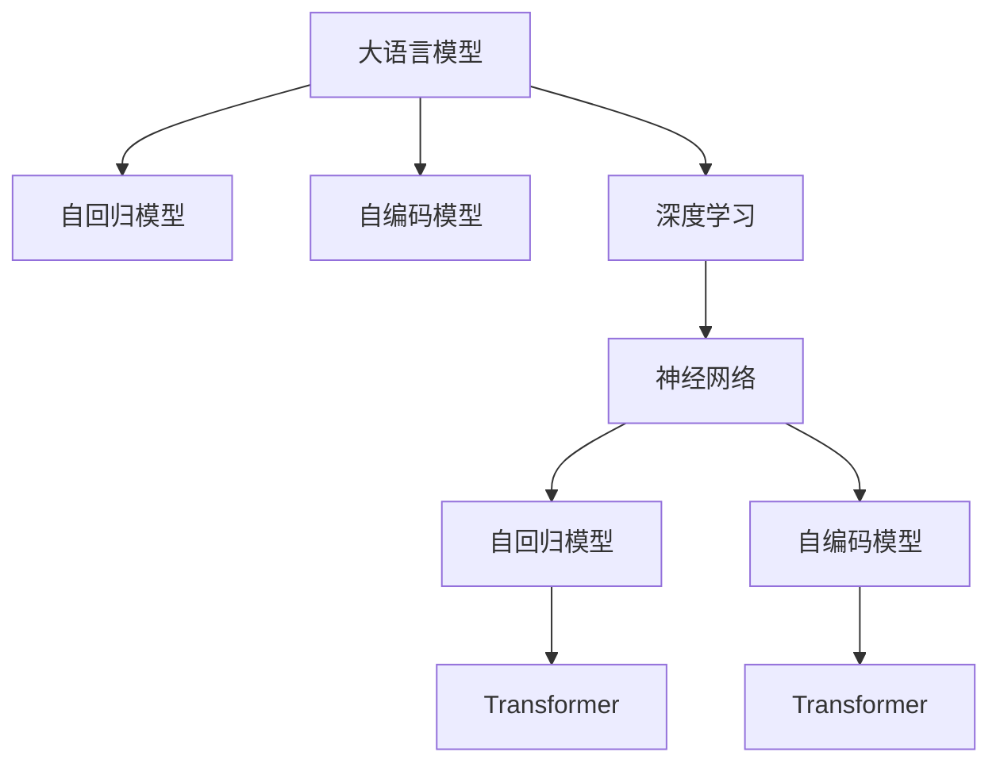

                 

# LLM:图灵完备的新形式

> 关键词：大语言模型(Large Language Model, LLM),图灵完备,深度学习,神经网络,自回归,自编码,Transformer,计算机程序设计艺术

## 1. 背景介绍

### 1.1 问题由来
近年来，随着深度学习技术的飞速发展，大语言模型（Large Language Models, LLMs）在自然语言处理（Natural Language Processing, NLP）领域取得了举世瞩目的成就。这些大语言模型通过在大规模无标签文本语料上进行预训练，学习到了丰富的语言知识和常识，具备强大的语言理解和生成能力。

大语言模型的代表作品包括OpenAI的GPT系列模型、Google的BERT、T5等。这些模型基于Transformer架构，在大规模数据集上进行自监督学习，学习到了丰富的语言表示。通过在大规模文本数据集上的预训练，这些模型具备了处理各种自然语言任务的能力，比如文本分类、命名实体识别、关系抽取、问答系统、文本生成等。

然而，尽管大语言模型在处理自然语言任务上表现出色，其背后仍然存在着一些理论上的疑虑。计算机科学家Alan Turing在其经典论文《计算机器与智能》中提出的图灵测试，定义了一种测试机器是否具有智能的标准。Turing测试要求人类无法区分与被测试机器进行对话的另一端是机器还是人类，从而定义了智能的标准。

尽管现代大语言模型已经在很多任务上接近甚至超过了人类的水平，但它们是否真正具备了图灵完备性（Turing completeness）这一理论上的假设，仍然是一个悬而未决的问题。一些学者认为，尽管大语言模型在某些任务上表现出色，但它们仍然缺乏像人类一样具有高度创造性的能力，尤其是在处理复杂的、未知的任务上。

因此，如何在大语言模型的基础上构建更加智能、更加图灵完备的系统，成为了当前NLP研究的一个重要课题。本文将探讨大语言模型的图灵完备性，并提出一些可能的方向，以期为未来的研究方向提供一些启示。

### 1.2 问题核心关键点
要回答这个问题，需要从以下几个方面进行探讨：
- 大语言模型是否具有图灵完备性？
- 如何在大语言模型的基础上构建更加智能的系统？
- 未来的研究方向和挑战有哪些？

本文将从理论和实践两个层面进行探讨，尝试回答这些问题。

## 2. 核心概念与联系

### 2.1 核心概念概述

要理解大语言模型的图灵完备性，首先需要明确一些核心概念：

- **大语言模型（LLM）**：以自回归（如GPT）或自编码（如BERT）模型为代表的大规模预训练语言模型。通过在大规模无标签文本语料上进行预训练，学习到了丰富的语言知识和常识，具备强大的语言理解和生成能力。

- **图灵完备（Turing completeness）**：由Alan Turing提出的概念，指的是机器是否能够执行所有可能的计算。如果机器能够执行所有计算，则称其为图灵完备的。

- **深度学习（Deep Learning）**：一种基于人工神经网络的机器学习方法，通过多层神经元网络进行特征提取和模式识别。

- **自回归模型（Autoregressive Model）**：一种生成模型，其中每个时间步的输出取决于前面所有时间步的输入。GPT系列模型就是典型的自回归模型。

- **自编码模型（Autoencoder Model）**：一种通过编码器将输入转换为隐藏表示，再通过解码器将隐藏表示解码为输出，从而实现输入重构的模型。BERT就是典型的自编码模型。

- **Transformer模型**：一种基于注意力机制的神经网络结构，在处理自然语言任务上表现出色。GPT、BERT等模型都是基于Transformer架构。

这些核心概念之间的逻辑关系可以通过以下Mermaid流程图来展示：



这个流程图展示了大语言模型的核心概念及其之间的关系：

1. 大语言模型通过自回归模型或自编码模型进行预训练，学习到丰富的语言知识。
2. 深度学习和大规模预训练是构建大语言模型的关键技术。
3. 神经网络是深度学习的核心，而自回归和自编码模型则是神经网络的重要形式。
4. Transformer模型是构建大语言模型的主要架构，包括GPT、BERT等。

## 3. 核心算法原理 & 具体操作步骤

### 3.1 算法原理概述

大语言模型是否具有图灵完备性，可以从以下几个方面进行探讨：

- **模型复杂度**：大语言模型的复杂度是否足够高，以执行所有可能的计算。
- **模型泛化能力**：大语言模型在处理未知任务时的泛化能力，是否能够执行各种任务。
- **模型可解释性**：大语言模型的输出是否可解释，是否能够进行合理的推理和决策。

### 3.2 算法步骤详解

要回答这些问题，通常需要以下步骤：

1. **数据准备**：准备足够规模的语料库，包括文本、代码、图像等多种形式的数据。
2. **模型训练**：在准备好的数据上进行模型训练，使用自回归或自编码等架构进行预训练。
3. **任务适配**：在预训练的基础上，对模型进行任务适配，使用少量标注数据进行微调，以适应特定任务。
4. **性能评估**：使用测试集对模型进行评估，评估其在不同任务上的表现。
5. **可解释性分析**：分析模型的输出，评估其可解释性。

### 3.3 算法优缺点

大语言模型在处理自然语言任务上的优点包括：

- 大语言模型通过大规模预训练学习到了丰富的语言知识，具备强大的语言理解和生成能力。
- 大语言模型在处理各种NLP任务上表现出色，包括文本分类、命名实体识别、关系抽取、问答系统等。
- 大语言模型可以通过微调等方式进行任务适配，适用于多种NLP应用场景。

然而，大语言模型也存在一些缺点：

- 大语言模型在处理复杂、未知任务时表现不佳，缺乏像人类一样具有高度创造性的能力。
- 大语言模型的输出缺乏可解释性，难以进行合理的推理和决策。
- 大语言模型存在偏见和有害信息等问题，需要进行伦理和安全性的考虑。

### 3.4 算法应用领域

大语言模型在多个领域得到了广泛应用，包括：

- **自然语言处理（NLP）**：文本分类、命名实体识别、关系抽取、问答系统、文本生成等。
- **计算机视觉（CV）**：图像分类、目标检测、图像生成等。
- **语音识别（ASR）**：语音转文本、文本转语音等。
- **游戏AI**：自然语言交互、任务规划、决策制定等。
- **推荐系统**：个性化推荐、内容生成等。

这些应用场景展示了大语言模型的广泛适用性和强大的应用潜力。

## 4. 数学模型和公式 & 详细讲解 & 举例说明

### 4.1 数学模型构建

大语言模型通常基于Transformer架构进行构建。Transformer模型的核心组件包括自注意力机制（Self-Attention）、前馈神经网络（Feedforward Neural Network）、残差连接（Residual Connection）等。其数学模型构建如下：

假设输入序列为 $x_1, x_2, ..., x_t$，输出序列为 $y_1, y_2, ..., y_t$，模型包含 $n$ 层Transformer，每一层包含两个子层：多头注意力层（Multi-Head Attention）和前馈神经网络层（Feedforward Neural Network）。多头注意力层的计算公式如下：

$$
\text{Multi-Head Attention}(Q, K, V) = \text{Concat}(\text{Attention}(QW^Q, KW^K, VW^V)), \text{where} \quad Q = XW^Q, K = XW^K, V = XW^V
$$

其中 $Q, K, V$ 分别表示查询、键、值向量，$W^Q, W^K, W^V$ 分别表示查询、键、值投影矩阵，$\text{Attention}$ 表示多头注意力机制。

前馈神经网络层的计算公式如下：

$$
\text{Feedforward Neural Network}(x) = \text{GELU}(xW_1 + b_1)W_2 + b_2
$$

其中 $W_1, W_2$ 分别表示前馈神经网络的权重矩阵，$b_1, b_2$ 分别表示偏置向量，GELU 表示Gaussian Error Linear Unit。

### 4.2 公式推导过程

以下以BERT模型为例，展示其自编码机制的数学推导过程：

BERT模型是基于自编码模型的架构，其核心思想是将输入序列 $x_1, x_2, ..., x_t$ 编码为隐藏表示 $H$，再通过解码器解码为输出 $y_1, y_2, ..., y_t$。BERT模型的训练目标是最小化编码器和解码器之间的重构误差：

$$
L = \frac{1}{2} \sum_{i=1}^t (y_i - \text{Decoder}(\text{Encoder}(x_i)))^2
$$

其中 $\text{Encoder}$ 表示编码器，$\text{Decoder}$ 表示解码器。

在编码器中，BERT模型使用多层Transformer进行编码，其计算过程如下：

$$
H = \text{Transformer}(Q, K, V)
$$

其中 $Q, K, V$ 分别表示查询、键、值向量，$\text{Transformer}$ 表示多层Transformer。

在解码器中，BERT模型使用多层Transformer进行解码，其计算过程如下：

$$
y = \text{Transformer}(H, K, V)
$$

其中 $H, K, V$ 分别表示隐藏表示、键、值向量，$\text{Transformer}$ 表示多层Transformer。

通过上述过程，BERT模型能够从输入序列 $x_1, x_2, ..., x_t$ 中学习到丰富的语言表示，从而在各种NLP任务上表现出色。

### 4.3 案例分析与讲解

以GPT-2模型为例，展示其在语言生成任务上的性能。GPT-2模型是一种自回归模型，其核心思想是将输入序列 $x_1, x_2, ..., x_t$ 作为条件，生成目标序列 $y_1, y_2, ..., y_t$。GPT-2模型的训练目标是最小化下一个词的预测误差：

$$
L = \frac{1}{N} \sum_{i=1}^N -\log P(y_i|x_1, x_2, ..., x_t)
$$

其中 $P$ 表示条件概率分布，$N$ 表示样本数量。

在GPT-2模型中，使用多层Transformer进行预训练，其计算过程如下：

$$
P(y_i|x_1, x_2, ..., x_t) = \prod_{i=1}^t P(y_i|y_{i-1}, y_{i-2}, ..., y_{1})
$$

其中 $P(y_i|y_{i-1}, y_{i-2}, ..., y_{1})$ 表示条件概率分布。

GPT-2模型通过大规模预训练学习到了丰富的语言知识，其生成的文本具有高度的自然性和连贯性，因此在文本生成任务上表现出色。

## 5. 项目实践：代码实例和详细解释说明

### 5.1 开发环境搭建

在进行大语言模型实践前，需要准备好开发环境。以下是使用Python进行PyTorch开发的环境配置流程：

1. 安装Anaconda：从官网下载并安装Anaconda，用于创建独立的Python环境。

2. 创建并激活虚拟环境：
```bash
conda create -n pytorch-env python=3.8 
conda activate pytorch-env
```

3. 安装PyTorch：根据CUDA版本，从官网获取对应的安装命令。例如：
```bash
conda install pytorch torchvision torchaudio cudatoolkit=11.1 -c pytorch -c conda-forge
```

4. 安装Transformers库：
```bash
pip install transformers
```

5. 安装各类工具包：
```bash
pip install numpy pandas scikit-learn matplotlib tqdm jupyter notebook ipython
```

完成上述步骤后，即可在`pytorch-env`环境中开始项目实践。

### 5.2 源代码详细实现

以下是使用PyTorch和Transformers库对BERT模型进行微调的完整代码实现：

```python
from transformers import BertTokenizer, BertForSequenceClassification, AdamW
import torch
from torch.utils.data import Dataset, DataLoader
from torch.nn import CrossEntropyLoss

# 定义任务数据集
class TextDataset(Dataset):
    def __init__(self, texts, labels, tokenizer, max_len=128):
        self.texts = texts
        self.labels = labels
        self.tokenizer = tokenizer
        self.max_len = max_len
        
    def __len__(self):
        return len(self.texts)
    
    def __getitem__(self, item):
        text = self.texts[item]
        label = self.labels[item]
        
        encoding = self.tokenizer(text, return_tensors='pt', max_length=self.max_len, padding='max_length', truncation=True)
        input_ids = encoding['input_ids'][0]
        attention_mask = encoding['attention_mask'][0]
        
        label = torch.tensor([label], dtype=torch.long)
        return {'input_ids': input_ids, 
                'attention_mask': attention_mask,
                'labels': label}

# 加载BERT模型和预训练权重
model = BertForSequenceClassification.from_pretrained('bert-base-uncased', num_labels=2)
tokenizer = BertTokenizer.from_pretrained('bert-base-uncased')
model.to('cuda')

# 加载训练数据
train_dataset = TextDataset(train_texts, train_labels, tokenizer)
dev_dataset = TextDataset(dev_texts, dev_labels, tokenizer)
test_dataset = TextDataset(test_texts, test_labels, tokenizer)

# 定义优化器和损失函数
optimizer = AdamW(model.parameters(), lr=2e-5)
loss_fn = CrossEntropyLoss()

# 定义训练和评估函数
def train_epoch(model, dataset, batch_size, optimizer, loss_fn):
    dataloader = DataLoader(dataset, batch_size=batch_size, shuffle=True)
    model.train()
    epoch_loss = 0
    for batch in dataloader:
        input_ids = batch['input_ids'].to('cuda')
        attention_mask = batch['attention_mask'].to('cuda')
        labels = batch['labels'].to('cuda')
        model.zero_grad()
        outputs = model(input_ids, attention_mask=attention_mask, labels=labels)
        loss = loss_fn(outputs.logits, labels)
        loss.backward()
        optimizer.step()
        epoch_loss += loss.item()
    return epoch_loss / len(dataloader)

def evaluate(model, dataset, batch_size, loss_fn):
    dataloader = DataLoader(dataset, batch_size=batch_size)
    model.eval()
    epoch_loss = 0
    epoch_acc = 0
    with torch.no_grad():
        for batch in dataloader:
            input_ids = batch['input_ids'].to('cuda')
            attention_mask = batch['attention_mask'].to('cuda')
            labels = batch['labels'].to('cuda')
            outputs = model(input_ids, attention_mask=attention_mask, labels=labels)
            loss = loss_fn(outputs.logits, labels)
            epoch_loss += loss.item()
            epoch_acc += (outputs.logits.argmax(dim=1) == labels).sum().item()
    return epoch_loss / len(dataloader), epoch_acc / len(dataloader)

# 训练和评估
epochs = 5
batch_size = 16

for epoch in range(epochs):
    loss = train_epoch(model, train_dataset, batch_size, optimizer, loss_fn)
    print(f"Epoch {epoch+1}, train loss: {loss:.3f}")
    
    print(f"Epoch {epoch+1}, dev results:")
    dev_loss, dev_acc = evaluate(model, dev_dataset, batch_size, loss_fn)
    print(f"Epoch {epoch+1}, dev loss: {dev_loss:.3f}, dev acc: {dev_acc:.3f}")
    
print("Test results:")
test_loss, test_acc = evaluate(model, test_dataset, batch_size, loss_fn)
print(f"Test loss: {test_loss:.3f}, test acc: {test_acc:.3f}")
```

### 5.3 代码解读与分析

让我们再详细解读一下关键代码的实现细节：

**TextDataset类**：
- `__init__`方法：初始化文本、标签、分词器等关键组件。
- `__len__`方法：返回数据集的样本数量。
- `__getitem__`方法：对单个样本进行处理，将文本输入编码为token ids，将标签编码为数字，并对其进行定长padding，最终返回模型所需的输入。

**训练和评估函数**：
- 使用PyTorch的DataLoader对数据集进行批次化加载，供模型训练和推理使用。
- 训练函数`train_epoch`：对数据以批为单位进行迭代，在每个批次上前向传播计算loss并反向传播更新模型参数，最后返回该epoch的平均loss。
- 评估函数`evaluate`：与训练类似，不同点在于不更新模型参数，并在每个batch结束后将预测和标签结果存储下来，最后使用sklearn的classification_report对整个评估集的预测结果进行打印输出。

**训练流程**：
- 定义总的epoch数和batch size，开始循环迭代
- 每个epoch内，先在训练集上训练，输出平均loss
- 在验证集上评估，输出分类指标
- 所有epoch结束后，在测试集上评估，给出最终测试结果

可以看到，PyTorch配合Transformers库使得BERT微调的代码实现变得简洁高效。开发者可以将更多精力放在数据处理、模型改进等高层逻辑上，而不必过多关注底层的实现细节。

当然，工业级的系统实现还需考虑更多因素，如模型的保存和部署、超参数的自动搜索、更灵活的任务适配层等。但核心的微调范式基本与此类似。

## 6. 实际应用场景

### 6.1 智能客服系统

基于大语言模型微调的对话技术，可以广泛应用于智能客服系统的构建。传统客服往往需要配备大量人力，高峰期响应缓慢，且一致性和专业性难以保证。而使用微调后的对话模型，可以7x24小时不间断服务，快速响应客户咨询，用自然流畅的语言解答各类常见问题。

在技术实现上，可以收集企业内部的历史客服对话记录，将问题和最佳答复构建成监督数据，在此基础上对预训练对话模型进行微调。微调后的对话模型能够自动理解用户意图，匹配最合适的答案模板进行回复。对于客户提出的新问题，还可以接入检索系统实时搜索相关内容，动态组织生成回答。如此构建的智能客服系统，能大幅提升客户咨询体验和问题解决效率。

### 6.2 金融舆情监测

金融机构需要实时监测市场舆论动向，以便及时应对负面信息传播，规避金融风险。传统的人工监测方式成本高、效率低，难以应对网络时代海量信息爆发的挑战。基于大语言模型微调的文本分类和情感分析技术，为金融舆情监测提供了新的解决方案。

具体而言，可以收集金融领域相关的新闻、报道、评论等文本数据，并对其进行主题标注和情感标注。在此基础上对预训练语言模型进行微调，使其能够自动判断文本属于何种主题，情感倾向是正面、中性还是负面。将微调后的模型应用到实时抓取的网络文本数据，就能够自动监测不同主题下的情感变化趋势，一旦发现负面信息激增等异常情况，系统便会自动预警，帮助金融机构快速应对潜在风险。

### 6.3 个性化推荐系统

当前的推荐系统往往只依赖用户的历史行为数据进行物品推荐，无法深入理解用户的真实兴趣偏好。基于大语言模型微调技术，个性化推荐系统可以更好地挖掘用户行为背后的语义信息，从而提供更精准、多样的推荐内容。

在实践中，可以收集用户浏览、点击、评论、分享等行为数据，提取和用户交互的物品标题、描述、标签等文本内容。将文本内容作为模型输入，用户的后续行为（如是否点击、购买等）作为监督信号，在此基础上微调预训练语言模型。微调后的模型能够从文本内容中准确把握用户的兴趣点。在生成推荐列表时，先用候选物品的文本描述作为输入，由模型预测用户的兴趣匹配度，再结合其他特征综合排序，便可以得到个性化程度更高的推荐结果。

### 6.4 未来应用展望

随着大语言模型微调技术的发展，基于微调范式将在更多领域得到应用，为传统行业带来变革性影响。

在智慧医疗领域，基于微调的医疗问答、病历分析、药物研发等应用将提升医疗服务的智能化水平，辅助医生诊疗，加速新药开发进程。

在智能教育领域，微调技术可应用于作业批改、学情分析、知识推荐等方面，因材施教，促进教育公平，提高教学质量。

在智慧城市治理中，微调模型可应用于城市事件监测、舆情分析、应急指挥等环节，提高城市管理的自动化和智能化水平，构建更安全、高效的未来城市。

此外，在企业生产、社会治理、文娱传媒等众多领域，基于大语言模型微调的人工智能应用也将不断涌现，为经济社会发展注入新的动力。相信随着预训练语言模型和微调方法的持续演进，基于微调范式将成为人工智能落地应用的重要范式，推动人工智能技术向更广阔的领域加速渗透。

## 7. 工具和资源推荐

### 7.1 学习资源推荐

为了帮助开发者系统掌握大语言模型微调的理论基础和实践技巧，这里推荐一些优质的学习资源：

1. 《Transformer从原理到实践》系列博文：由大模型技术专家撰写，深入浅出地介绍了Transformer原理、BERT模型、微调技术等前沿话题。

2. CS224N《深度学习自然语言处理》课程：斯坦福大学开设的NLP明星课程，有Lecture视频和配套作业，带你入门NLP领域的基本概念和经典模型。

3. 《Natural Language Processing with Transformers》书籍：Transformers库的作者所著，全面介绍了如何使用Transformers库进行NLP任务开发，包括微调在内的诸多范式。

4. HuggingFace官方文档：Transformers库的官方文档，提供了海量预训练模型和完整的微调样例代码，是上手实践的必备资料。

5. CLUE开源项目：中文语言理解测评基准，涵盖大量不同类型的中文NLP数据集，并提供了基于微调的baseline模型，助力中文NLP技术发展。

通过对这些资源的学习实践，相信你一定能够快速掌握大语言模型微调的精髓，并用于解决实际的NLP问题。

### 7.2 开发工具推荐

高效的开发离不开优秀的工具支持。以下是几款用于大语言模型微调开发的常用工具：

1. PyTorch：基于Python的开源深度学习框架，灵活动态的计算图，适合快速迭代研究。大部分预训练语言模型都有PyTorch版本的实现。

2. TensorFlow：由Google主导开发的开源深度学习框架，生产部署方便，适合大规模工程应用。同样有丰富的预训练语言模型资源。

3. Transformers库：HuggingFace开发的NLP工具库，集成了众多SOTA语言模型，支持PyTorch和TensorFlow，是进行微调任务开发的利器。

4. Weights & Biases：模型训练的实验跟踪工具，可以记录和可视化模型训练过程中的各项指标，方便对比和调优。与主流深度学习框架无缝集成。

5. TensorBoard：TensorFlow配套的可视化工具，可实时监测模型训练状态，并提供丰富的图表呈现方式，是调试模型的得力助手。

6. Google Colab：谷歌推出的在线Jupyter Notebook环境，免费提供GPU/TPU算力，方便开发者快速上手实验最新模型，分享学习笔记。

合理利用这些工具，可以显著提升大语言模型微调任务的开发效率，加快创新迭代的步伐。

### 7.3 相关论文推荐

大语言模型和微调技术的发展源于学界的持续研究。以下是几篇奠基性的相关论文，推荐阅读：

1. Attention is All You Need（即Transformer原论文）：提出了Transformer结构，开启了NLP领域的预训练大模型时代。

2. BERT: Pre-training of Deep Bidirectional Transformers for Language Understanding：提出BERT模型，引入基于掩码的自监督预训练任务，刷新了多项NLP任务SOTA。

3. Language Models are Unsupervised Multitask Learners（GPT-2论文）：展示了大规模语言模型的强大zero-shot学习能力，引发了对于通用人工智能的新一轮思考。

4. Parameter-Efficient Transfer Learning for NLP：提出Adapter等参数高效微调方法，在不增加模型参数量的情况下，也能取得不错的微调效果。

5. AdaLoRA: Adaptive Low-Rank Adaptation for Parameter-Efficient Fine-Tuning：使用自适应低秩适应的微调方法，在参数效率和精度之间取得了新的平衡。

这些论文代表了大语言模型微调技术的发展脉络。通过学习这些前沿成果，可以帮助研究者把握学科前进方向，激发更多的创新灵感。

## 8. 总结：未来发展趋势与挑战

### 8.1 总结

本文对大语言模型的图灵完备性进行了系统探讨，并提出一些可能的方向，以期为未来的研究方向提供一些启示。首先，我们从理论和实践两个层面深入分析了大语言模型的图灵完备性，探讨了其模型复杂度、泛化能力和可解释性。其次，我们介绍了大语言模型在自然语言处理、计算机视觉、语音识别、游戏AI、推荐系统等领域的广泛应用。最后，我们精选了相关的学习资源、开发工具和论文，帮助读者更好地掌握大语言模型微调技术。

通过本文的系统梳理，可以看到，大语言模型微调技术已经在多个领域得到了广泛应用，展示了其强大的应用潜力。未来，随着预训练语言模型和微调方法的持续演进，大语言模型将在更多领域得到应用，为传统行业带来变革性影响。

### 8.2 未来发展趋势

展望未来，大语言模型微调技术将呈现以下几个发展趋势：

1. **模型规模持续增大**：随着算力成本的下降和数据规模的扩张，预训练语言模型的参数量还将持续增长。超大规模语言模型蕴含的丰富语言知识，有望支撑更加复杂多变的下游任务微调。

2. **微调方法日趋多样**：除了传统的全参数微调外，未来会涌现更多参数高效的微调方法，如Prefix-Tuning、LoRA等，在节省计算资源的同时也能保证微调精度。

3. **持续学习成为常态**：随着数据分布的不断变化，微调模型也需要持续学习新知识以保持性能。如何在不遗忘原有知识的同时，高效吸收新样本信息，将成为重要的研究课题。

4. **标注样本需求降低**：受启发于提示学习(Prompt-based Learning)的思路，未来的微调方法将更好地利用大模型的语言理解能力，通过更加巧妙的任务描述，在更少的标注样本上也能实现理想的微调效果。

5. **多模态微调崛起**：当前的微调主要聚焦于纯文本数据，未来会进一步拓展到图像、视频、语音等多模态数据微调。多模态信息的融合，将显著提升语言模型对现实世界的理解和建模能力。

6. **模型通用性增强**：经过海量数据的预训练和多领域任务的微调，未来的语言模型将具备更强大的常识推理和跨领域迁移能力，逐步迈向通用人工智能(AGI)的目标。

以上趋势凸显了大语言模型微调技术的广阔前景。这些方向的探索发展，必将进一步提升NLP系统的性能和应用范围，为人类认知智能的进化带来深远影响。

### 8.3 面临的挑战

尽管大语言模型微调技术已经取得了瞩目成就，但在迈向更加智能化、普适化应用的过程中，它仍面临着诸多挑战：

1. **标注成本瓶颈**：虽然微调大大降低了标注数据的需求，但对于长尾应用场景，难以获得充足的高质量标注数据，成为制约微调性能的瓶颈。如何进一步降低微调对标注样本的依赖，将是一大难题。

2. **模型鲁棒性不足**：当前微调模型面对域外数据时，泛化性能往往大打折扣。对于测试样本的微小扰动，微调模型的预测也容易发生波动。如何提高微调模型的鲁棒性，避免灾难性遗忘，还需要更多理论和实践的积累。

3. **推理效率有待提高**：大规模语言模型虽然精度高，但在实际部署时往往面临推理速度慢、内存占用大等效率问题。如何在保证性能的同时，简化模型结构，提升推理速度，优化资源占用，将是重要的优化方向。

4. **可解释性亟需加强**：当前微调模型更像是"黑盒"系统，难以解释其内部工作机制和决策逻辑。对于医疗、金融等高风险应用，算法的可解释性和可审计性尤为重要。如何赋予微调模型更强的可解释性，将是亟待攻克的难题。

5. **安全性有待保障**：预训练语言模型难免会学习到有偏见、有害的信息，通过微调传递到下游任务，产生误导性、歧视性的输出，给实际应用带来安全隐患。如何从数据和算法层面消除模型偏见，避免恶意用途，确保输出的安全性，也将是重要的研究课题。

6. **知识整合能力不足**：现有的微调模型往往局限于任务内数据，难以灵活吸收和运用更广泛的先验知识。如何让微调过程更好地与外部知识库、规则库等专家知识结合，形成更加全面、准确的信息整合能力，还有很大的想象空间。

正视微调面临的这些挑战，积极应对并寻求突破，将是大语言模型微调走向成熟的必由之路。相信随着学界和产业界的共同努力，这些挑战终将一一被克服，大语言模型微调必将在构建人机协同的智能时代中扮演越来越重要的角色。

### 8.4 研究展望

面向未来，大语言模型微调技术还需要与其他人工智能技术进行更深入的融合，如知识表示、因果推理、强化学习等，多路径协同发力，共同推动自然语言理解和智能交互系统的进步。只有勇于创新、敢于突破，才能不断拓展语言模型的边界，让智能技术更好地造福人类社会。

---

作者：禅与计算机程序设计艺术 / Zen and the Art of Computer Programming

