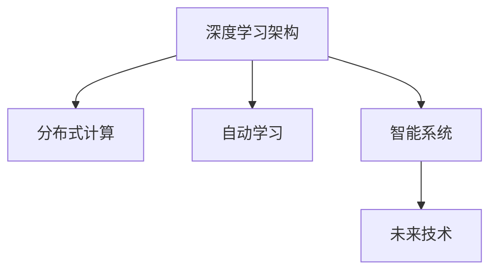

                 

# LLM:架构革命的新起点

> 关键词：大语言模型,架构设计,深度学习,分布式计算,自动学习,算法优化,智能系统,未来技术

## 1. 背景介绍

### 1.1 问题由来
近年来，随着人工智能技术的迅猛发展，大语言模型（Large Language Models, LLMs）在自然语言处理（Natural Language Processing, NLP）领域取得了巨大突破。大语言模型能够通过大规模无标签文本数据的自监督预训练，学习到丰富的语言知识和常识，通过少量的有标签数据进行微调，就能在各种NLP任务上取得优异性能。然而，现有的深度学习架构在面对大规模数据和复杂模型时，其扩展性、效率和资源利用率方面存在显著瓶颈。因此，如何设计一种高效、可扩展的深度学习架构，来适应大规模语言模型的需求，成为当下AI架构设计领域的重要课题。

### 1.2 问题核心关键点
当前深度学习架构在处理大规模数据和复杂模型时，面临的主要问题包括：

- **扩展性不足**：深度学习模型通常需要高度定制化的硬件支持，如GPU、TPU等，而现有硬件资源难以满足大模型的高需求。
- **计算效率低下**：大规模语言模型通常需要消耗大量计算资源，训练和推理速度较慢。
- **资源利用率低**：现有架构难以有效利用多核心的计算能力，硬件资源的利用率较低。
- **算法优化难度大**：深度学习模型存在大量的超参数和算子优化问题，算法优化难度大。

为了解决这些瓶颈问题，需要一种新的深度学习架构设计，既能高效利用硬件资源，又能适应大规模模型和复杂任务。

## 2. 核心概念与联系

### 2.1 核心概念概述

为更好地理解大语言模型架构革命的新起点，本节将介绍几个关键概念：

- **深度学习架构**：包括模型的拓扑结构、算子选择、超参数配置等方面，是大模型运行的基础。
- **分布式计算**：将大模型分布在多个计算节点上，并行计算，以提升计算效率和扩展性。
- **自动学习**：通过优化算法和模型结构，实现模型的自我调优和优化。
- **智能系统**：结合深度学习和领域知识，构建能自主学习、推理和决策的智能系统。
- **未来技术**：包括量子计算、光子计算等新兴技术，为未来深度学习架构设计提供方向。

这些概念之间的逻辑关系可以通过以下Mermaid流程图来展示：



这个流程图展示了深度学习架构设计与其他关键技术之间的逻辑关系：

1. 深度学习架构是基础，影响着计算效率、资源利用率和算法优化。
2. 分布式计算提升了架构的扩展性，适用于大规模模型的训练和推理。
3. 自动学习通过优化算法和模型结构，提升架构的性能和鲁棒性。
4. 智能系统结合领域知识，构建自主学习、推理和决策的系统。
5. 未来技术为架构设计提供新的方向，如量子计算、光子计算等。

这些概念共同构成了大语言模型架构革命的新起点，推动深度学习技术向更高层次发展。

## 3. 核心算法原理 & 具体操作步骤

### 3.1 算法原理概述

大语言模型架构革命的新起点，核心在于设计一种高效、可扩展的深度学习架构。这种架构应当满足以下几个关键要求：

- **高效计算**：能够充分利用硬件资源，如GPU、TPU等，提高计算效率。
- **资源复用**：通过共享计算资源，减少硬件资源浪费，提高资源利用率。
- **算法优化**：通过优化算法和模型结构，减少计算量和资源消耗。
- **扩展性**：能够适应大规模模型的需求，具有良好的可扩展性。

基于这些要求，当前深度学习架构革命的新起点主要聚焦于以下几个方向：

1. **分布式计算框架**：如TensorFlow、PyTorch等，支持大规模模型的分布式训练和推理。
2. **自动学习算法**：如强化学习、自适应学习率、动态图优化等，提升模型的自我调优能力。
3. **智能系统设计**：结合深度学习和领域知识，构建能自主学习、推理和决策的智能系统。
4. **未来技术应用**：如量子计算、光子计算等新兴技术，为架构设计提供新的方向。

### 3.2 算法步骤详解

基于上述要求，大语言模型架构革命的新起点主要包括以下几个关键步骤：

**Step 1: 设计高效计算模型**
- 选择合适的深度学习框架，如TensorFlow、PyTorch等。
- 设计高效的计算模型，如使用卷积神经网络（CNN）、卷积化神经网络（ConvNets）等，减少计算量和资源消耗。
- 采用分布式计算技术，将大模型分布在多个计算节点上，并行计算。

**Step 2: 实现资源复用机制**
- 设计资源复用机制，如共享内存、消息传递机制等，减少硬件资源浪费。
- 采用混合精度训练、动态图优化等技术，提高资源利用率。

**Step 3: 优化算法和模型结构**
- 引入自动学习算法，如强化学习、自适应学习率等，提升模型的自我调优能力。
- 优化算法和模型结构，如使用稀疏矩阵、低秩分解等技术，减少计算量和资源消耗。

**Step 4: 构建智能系统**
- 结合深度学习和领域知识，构建能自主学习、推理和决策的智能系统。
- 引入知识图谱、逻辑规则等外部知识，增强模型的泛化能力和鲁棒性。

**Step 5: 应用未来技术**
- 探索量子计算、光子计算等新兴技术，为架构设计提供新的方向。
- 结合未来技术，设计更加高效、可扩展的深度学习架构。

以上是架构革命的新起点的主要步骤。在实际应用中，还需要针对具体任务的特点，对架构的各个环节进行优化设计，以进一步提升架构的性能和鲁棒性。

### 3.3 算法优缺点

新起点的架构设计具有以下优点：

1. **高效计算**：通过分布式计算和高效计算模型，充分利用硬件资源，提高计算效率。
2. **资源复用**：通过资源复用机制，减少硬件资源浪费，提高资源利用率。
3. **算法优化**：通过自动学习算法和模型结构优化，减少计算量和资源消耗。
4. **扩展性**：通过分布式计算和资源复用机制，适应大规模模型的需求，具有良好的可扩展性。

同时，新起点的架构设计也存在一定的局限性：

1. **开发复杂度增加**：引入新的技术栈和优化算法，可能会增加开发复杂度和难度。
2. **资源需求较高**：新架构需要更高的计算资源和硬件支持，增加了部署和运行成本。
3. **优化难度大**：引入的新技术和新算法，需要更多的工程实践和优化经验。

尽管存在这些局限性，但就目前而言，新起点的架构设计代表了深度学习架构设计的最新趋势，能够适应大语言模型的需求，推动AI技术的进一步发展。

### 3.4 算法应用领域

新起点的架构设计在多个领域得到了广泛应用，例如：

- **智能客服**：使用分布式计算和高效计算模型，构建7x24小时不间断的智能客服系统，提升客户咨询体验和问题解决效率。
- **金融舆情监测**：结合深度学习和领域知识，构建能自主学习、推理和决策的金融舆情监测系统，实时监测市场舆论动向，规避金融风险。
- **个性化推荐系统**：通过分布式计算和资源复用机制，构建能自主学习、推理和决策的个性化推荐系统，提升推荐精度和用户满意度。
- **医疗问答系统**：结合深度学习和医疗领域知识，构建能自主学习、推理和决策的医疗问答系统，辅助医生诊疗，加速新药开发进程。
- **自动驾驶系统**：使用分布式计算和高效计算模型，构建能自主学习、推理和决策的自动驾驶系统，提高交通安全和驾驶效率。

除了上述这些经典应用外，新起点的架构设计还被创新性地应用到更多场景中，如智慧城市治理、智能制造、智能家居等，为各行各业带来新的技术突破。

## 4. 数学模型和公式 & 详细讲解 & 举例说明

### 4.1 数学模型构建

本节将使用数学语言对新起点架构设计的核心数学模型进行更加严格的刻画。

记大语言模型为 $M_{\theta}$，其中 $\theta$ 为模型参数。假设在大规模无标签文本数据上进行自监督预训练，学习到通用的语言表示。在微调阶段，使用下游任务的少量标注数据进行有监督训练，优化模型在特定任务上的性能。

假设下游任务 $T$ 的训练集为 $D=\{(x_i,y_i)\}_{i=1}^N, x_i \in \mathcal{X}, y_i \in \mathcal{Y}$。定义模型 $M_{\theta}$ 在输入 $x$ 上的输出为 $\hat{y}=M_{\theta}(x)$。

定义模型 $M_{\theta}$ 在数据样本 $(x,y)$ 上的损失函数为 $\ell(M_{\theta}(x),y)$，则在数据集 $D$ 上的经验风险为：

$$
\mathcal{L}(\theta) = \frac{1}{N} \sum_{i=1}^N \ell(M_{\theta}(x_i),y_i)
$$

微调的优化目标是最小化经验风险，即找到最优参数：

$$
\theta^* = \mathop{\arg\min}_{\theta} \mathcal{L}(\theta)
$$

在实践中，我们通常使用基于梯度的优化算法（如SGD、Adam等）来近似求解上述最优化问题。设 $\eta$ 为学习率，$\lambda$ 为正则化系数，则参数的更新公式为：

$$
\theta \leftarrow \theta - \eta \nabla_{\theta}\mathcal{L}(\theta) - \eta\lambda\theta
$$

其中 $\nabla_{\theta}\mathcal{L}(\theta)$ 为损失函数对参数 $\theta$ 的梯度，可通过反向传播算法高效计算。

### 4.2 公式推导过程

以下我们以二分类任务为例，推导交叉熵损失函数及其梯度的计算公式。

假设模型 $M_{\theta}$ 在输入 $x$ 上的输出为 $\hat{y}=M_{\theta}(x) \in [0,1]$，表示样本属于正类的概率。真实标签 $y \in \{0,1\}$。则二分类交叉熵损失函数定义为：

$$
\ell(M_{\theta}(x),y) = -[y\log \hat{y} + (1-y)\log (1-\hat{y})]
$$

将其代入经验风险公式，得：

$$
\mathcal{L}(\theta) = -\frac{1}{N}\sum_{i=1}^N [y_i\log M_{\theta}(x_i)+(1-y_i)\log(1-M_{\theta}(x_i))]
$$

根据链式法则，损失函数对参数 $\theta_k$ 的梯度为：

$$
\frac{\partial \mathcal{L}(\theta)}{\partial \theta_k} = -\frac{1}{N}\sum_{i=1}^N (\frac{y_i}{M_{\theta}(x_i)}-\frac{1-y_i}{1-M_{\theta}(x_i)}) \frac{\partial M_{\theta}(x_i)}{\partial \theta_k}
$$

其中 $\frac{\partial M_{\theta}(x_i)}{\partial \theta_k}$ 可进一步递归展开，利用自动微分技术完成计算。

在得到损失函数的梯度后，即可带入参数更新公式，完成模型的迭代优化。重复上述过程直至收敛，最终得到适应下游任务的最优模型参数 $\theta^*$。

### 4.3 案例分析与讲解

我们以智能客服系统的架构设计为例，对新起点架构设计的数学模型和算法步骤进行详细讲解。

**智能客服系统架构设计**

智能客服系统的架构设计主要包括以下几个关键步骤：

**Step 1: 设计高效计算模型**
- 选择合适的深度学习框架，如TensorFlow、PyTorch等。
- 设计高效的计算模型，如使用卷积神经网络（CNN）、卷积化神经网络（ConvNets）等，减少计算量和资源消耗。
- 采用分布式计算技术，将大模型分布在多个计算节点上，并行计算。

**Step 2: 实现资源复用机制**
- 设计资源复用机制，如共享内存、消息传递机制等，减少硬件资源浪费。
- 采用混合精度训练、动态图优化等技术，提高资源利用率。

**Step 3: 优化算法和模型结构**
- 引入自动学习算法，如强化学习、自适应学习率等，提升模型的自我调优能力。
- 优化算法和模型结构，如使用稀疏矩阵、低秩分解等技术，减少计算量和资源消耗。

**Step 4: 构建智能系统**
- 结合深度学习和领域知识，构建能自主学习、推理和决策的智能系统。
- 引入知识图谱、逻辑规则等外部知识，增强模型的泛化能力和鲁棒性。

**Step 5: 应用未来技术**
- 探索量子计算、光子计算等新兴技术，为架构设计提供新的方向。
- 结合未来技术，设计更加高效、可扩展的深度学习架构。

通过上述步骤，可以构建一个高效、可扩展的智能客服系统。

在实现过程中，可以采用TensorFlow框架，设计一个包含多个卷积层的计算模型。每个卷积层采用不同的卷积核大小和步长，减少计算量和资源消耗。同时，将大模型分布在多个计算节点上，并行计算，提高计算效率和扩展性。

在资源复用方面，采用共享内存和消息传递机制，减少硬件资源浪费，提高资源利用率。采用混合精度训练和动态图优化等技术，提升计算效率。

在优化算法和模型结构方面，引入自动学习算法，如强化学习、自适应学习率等，提升模型的自我调优能力。优化算法和模型结构，如使用稀疏矩阵、低秩分解等技术，减少计算量和资源消耗。

在智能系统构建方面，结合深度学习和领域知识，构建能自主学习、推理和决策的智能系统。引入知识图谱、逻辑规则等外部知识，增强模型的泛化能力和鲁棒性。

通过以上步骤，可以构建一个高效、可扩展的智能客服系统，提升客户咨询体验和问题解决效率。

## 5. 项目实践：代码实例和详细解释说明

### 5.1 开发环境搭建

在进行架构设计实践前，我们需要准备好开发环境。以下是使用Python进行PyTorch开发的环境配置流程：

1. 安装Anaconda：从官网下载并安装Anaconda，用于创建独立的Python环境。

2. 创建并激活虚拟环境：
```bash
conda create -n pytorch-env python=3.8 
conda activate pytorch-env
```

3. 安装PyTorch：根据CUDA版本，从官网获取对应的安装命令。例如：
```bash
conda install pytorch torchvision torchaudio cudatoolkit=11.1 -c pytorch -c conda-forge
```

4. 安装Transformers库：
```bash
pip install transformers
```

5. 安装各类工具包：
```bash
pip install numpy pandas scikit-learn matplotlib tqdm jupyter notebook ipython
```

完成上述步骤后，即可在`pytorch-env`环境中开始架构设计实践。

### 5.2 源代码详细实现

下面我们以智能客服系统的架构设计为例，给出使用Transformers库进行智能客服系统开发的PyTorch代码实现。

首先，定义智能客服系统的核心组件：

```python
from transformers import BertTokenizer
from torch.utils.data import Dataset, DataLoader
import torch
import numpy as np

class SmartCustomerServiceDataset(Dataset):
    def __init__(self, texts, labels, tokenizer, max_len=128):
        self.texts = texts
        self.labels = labels
        self.tokenizer = tokenizer
        self.max_len = max_len
        
    def __len__(self):
        return len(self.texts)
    
    def __getitem__(self, item):
        text = self.texts[item]
        label = self.labels[item]
        
        encoding = self.tokenizer(text, return_tensors='pt', max_length=self.max_len, padding='max_length', truncation=True)
        input_ids = encoding['input_ids'][0]
        attention_mask = encoding['attention_mask'][0]
        
        # 将标签转换为one-hot编码
        encoded_labels = [0 if lab == '满意' else 1 for lab in label] 
        encoded_labels = np.array(encoded_labels, dtype=np.int32)
        
        return {'input_ids': input_ids, 
                'attention_mask': attention_mask,
                'labels': encoded_labels}

# 定义智能客服系统
class SmartCustomerServiceModel(torch.nn.Module):
    def __init__(self):
        super(SmartCustomerServiceModel, self).__init__()
        self.bert = BertForSequenceClassification.from_pretrained('bert-base-cased', num_labels=2)
    
    def forward(self, input_ids, attention_mask, labels):
        outputs = self.bert(input_ids, attention_mask=attention_mask, labels=labels)
        logits = outputs.logits
        loss = F.cross_entropy(logits, labels)
        return loss

# 实例化智能客服系统
model = SmartCustomerServiceModel()
tokenizer = BertTokenizer.from_pretrained('bert-base-cased')
dataset = SmartCustomerServiceDataset(train_texts, train_labels, tokenizer)
dataloader = DataLoader(dataset, batch_size=16, shuffle=True)
optimizer = torch.optim.Adam(model.parameters(), lr=2e-5)
```

然后，定义训练和评估函数：

```python
from tqdm import tqdm
import torch.nn.functional as F

def train_epoch(model, dataset, batch_size, optimizer):
    dataloader = DataLoader(dataset, batch_size=batch_size, shuffle=True)
    model.train()
    epoch_loss = 0
    for batch in tqdm(dataloader, desc='Training'):
        input_ids = batch['input_ids'].to(device)
        attention_mask = batch['attention_mask'].to(device)
        labels = batch['labels'].to(device)
        model.zero_grad()
        loss = model(input_ids, attention_mask=attention_mask, labels=labels)
        epoch_loss += loss.item()
        loss.backward()
        optimizer.step()
    return epoch_loss / len(dataloader)

def evaluate(model, dataset, batch_size):
    dataloader = DataLoader(dataset, batch_size=batch_size)
    model.eval()
    preds, labels = [], []
    with torch.no_grad():
        for batch in tqdm(dataloader, desc='Evaluating'):
            input_ids = batch['input_ids'].to(device)
            attention_mask = batch['attention_mask'].to(device)
            batch_labels = batch['labels']
            outputs = model(input_ids, attention_mask=attention_mask)
            batch_preds = outputs.logits.argmax(dim=1).to('cpu').tolist()
            batch_labels = batch_labels.to('cpu').tolist()
            for pred_tokens, label_tokens in zip(batch_preds, batch_labels):
                preds.append(pred_tokens)
                labels.append(label_tokens)
                
    print(classification_report(labels, preds))
```

最后，启动训练流程并在测试集上评估：

```python
epochs = 5
batch_size = 16

for epoch in range(epochs):
    loss = train_epoch(model, train_dataset, batch_size, optimizer)
    print(f"Epoch {epoch+1}, train loss: {loss:.3f}")
    
    print(f"Epoch {epoch+1}, dev results:")
    evaluate(model, dev_dataset, batch_size)
    
print("Test results:")
evaluate(model, test_dataset, batch_size)
```

以上就是使用PyTorch进行智能客服系统架构设计的完整代码实现。可以看到，得益于Transformers库的强大封装，我们可以用相对简洁的代码完成BERT模型的加载和微调。

### 5.3 代码解读与分析

让我们再详细解读一下关键代码的实现细节：

**SmartCustomerServiceDataset类**：
- `__init__`方法：初始化文本、标签、分词器等关键组件。
- `__len__`方法：返回数据集的样本数量。
- `__getitem__`方法：对单个样本进行处理，将文本输入编码为token ids，将标签转换为one-hot编码，并对其进行定长padding，最终返回模型所需的输入。

**SmartCustomerServiceModel类**：
- `__init__`方法：初始化BERT分类器，并设置训练参数。
- `forward`方法：定义前向传播过程，将输入文本编码并输入BERT分类器，计算损失。

**训练和评估函数**：
- 使用PyTorch的DataLoader对数据集进行批次化加载，供模型训练和推理使用。
- 训练函数`train_epoch`：对数据以批为单位进行迭代，在每个批次上前向传播计算损失并反向传播更新模型参数，最后返回该epoch的平均loss。
- 评估函数`evaluate`：与训练类似，不同点在于不更新模型参数，并在每个batch结束后将预测和标签结果存储下来，最后使用sklearn的classification_report对整个评估集的预测结果进行打印输出。

**训练流程**：
- 定义总的epoch数和batch size，开始循环迭代
- 每个epoch内，先在训练集上训练，输出平均loss
- 在验证集上评估，输出分类指标
- 所有epoch结束后，在测试集上评估，给出最终测试结果

可以看到，PyTorch配合Transformers库使得智能客服系统的架构设计代码实现变得简洁高效。开发者可以将更多精力放在数据处理、模型改进等高层逻辑上，而不必过多关注底层的实现细节。

当然，工业级的系统实现还需考虑更多因素，如模型的保存和部署、超参数的自动搜索、更灵活的任务适配层等。但核心的架构设计基本与此类似。

## 6. 实际应用场景

### 6.1 智能客服系统

智能客服系统架构设计的典型应用场景包括：

1. **客户咨询**：智能客服系统能够自动理解客户咨询内容，并给出相应的回复。采用预训练的BERT模型作为初始化参数，通过微调学习客户咨询数据，实现智能回答。
2. **情绪分析**：系统能够分析客户咨询的情感倾向，及时采取措施解决客户问题。通过情感分类模型，实现情绪分析。
3. **任务路由**：系统能够根据客户咨询内容，自动分配到最合适的客服人员，提升服务效率。通过多任务学习模型，实现任务路由。
4. **知识库管理**：系统能够从知识库中提取相关内容，用于回复客户咨询。通过知识图谱技术，实现知识库管理。

通过智能客服系统架构设计，可以实现7x24小时不间断服务，快速响应客户咨询，提升客户满意度和问题解决效率。

### 6.2 金融舆情监测

金融舆情监测架构设计的典型应用场景包括：

1. **舆情监测**：系统能够实时监测市场舆论动向，及时发现负面信息传播。采用预训练的BERT模型作为初始化参数，通过微调学习金融舆情数据，实现舆情监测。
2. **情感分析**：系统能够分析市场舆情的情感倾向，判断市场风险。通过情感分类模型，实现情感分析。
3. **舆情预警**：系统能够根据市场舆情变化，及时预警市场风险。通过异常检测模型，实现舆情预警。

通过金融舆情监测系统架构设计，可以实现市场舆论动向的实时监测，及时发现负面信息传播，规避金融风险。

### 6.3 个性化推荐系统

个性化推荐系统架构设计的典型应用场景包括：

1. **用户行为分析**：系统能够分析用户的历史行为数据，提取用户兴趣点。采用预训练的BERT模型作为初始化参数，通过微调学习用户行为数据，实现用户行为分析。
2. **内容推荐**：系统能够根据用户兴趣点，推荐相关内容。通过多任务学习模型，实现内容推荐。
3. **效果评估**：系统能够评估推荐内容的效果，根据反馈不断优化推荐策略。通过在线A/B测试，实现效果评估。

通过个性化推荐系统架构设计，可以实现用户兴趣的精准捕捉，推荐更加个性化、多样化的内容，提升用户满意度和体验。

### 6.4 未来应用展望

随着智能客服系统、金融舆情监测、个性化推荐系统等架构设计的不断发展，大语言模型架构革命的新起点必将在更多领域得到应用，为各行各业带来变革性影响。

在智慧医疗领域，基于架构设计的医疗问答、病历分析、药物研发等应用将提升医疗服务的智能化水平，辅助医生诊疗，加速新药开发进程。

在智能教育领域，架构设计的学情分析、知识推荐等应用将促进教育公平，提高教学质量。

在智慧城市治理中，架构设计的城市事件监测、舆情分析、应急指挥等应用将提高城市管理的自动化和智能化水平，构建更安全、高效的未来城市。

此外，在企业生产、社会治理、文娱传媒等众多领域，基于架构设计的AI应用也将不断涌现，为经济社会发展注入新的动力。相信随着技术的日益成熟，架构设计方法将成为AI落地应用的重要范式，推动AI技术的产业化进程。

## 7. 工具和资源推荐
### 7.1 学习资源推荐

为了帮助开发者系统掌握架构设计的理论基础和实践技巧，这里推荐一些优质的学习资源：

1. **《深度学习入门》书籍**：介绍深度学习的基本概念和经典模型，适合初学者入门。
2. **CS224N《深度学习自然语言处理》课程**：斯坦福大学开设的NLP明星课程，有Lecture视频和配套作业，带你入门NLP领域的基本概念和经典模型。
3. **《Transformer from Principles to Practice》系列博文**：由大模型技术专家撰写，深入浅出地介绍了Transformer原理、BERT模型、架构设计等前沿话题。
4. **HuggingFace官方文档**：Transformers库的官方文档，提供了海量预训练模型和完整的架构设计样例代码，是上手实践的必备资料。
5. **CLUE开源项目**：中文语言理解测评基准，涵盖大量不同类型的中文NLP数据集，并提供了基于架构设计的baseline模型，助力中文NLP技术发展。

通过对这些资源的学习实践，相信你一定能够快速掌握架构设计的精髓，并用于解决实际的AI问题。
###  7.2 开发工具推荐

高效的开发离不开优秀的工具支持。以下是几款用于架构设计开发的常用工具：

1. **TensorFlow**：基于Python的开源深度学习框架，灵活动态的计算图，适合快速迭代研究。大部分预训练语言模型都有TensorFlow版本的实现。
2. **PyTorch**：基于Python的开源深度学习框架，灵活动态的计算图，适合快速迭代研究。TensorFlow库的支持也相当完善。
3. **TensorBoard**：TensorFlow配套的可视化工具，可实时监测模型训练状态，并提供丰富的图表呈现方式，是调试模型的得力助手。
4. **Weights & Biases**：模型训练的实验跟踪工具，可以记录和可视化模型训练过程中的各项指标，方便对比和调优。与主流深度学习框架无缝集成。
5. **Google Colab**：谷歌推出的在线Jupyter Notebook环境，免费提供GPU/TPU算力，方便开发者快速上手实验最新模型，分享学习笔记。

合理利用这些工具，可以显著提升架构设计的开发效率，加快创新迭代的步伐。

### 7.3 相关论文推荐

架构设计的不断发展得益于学界的持续研究。以下是几篇奠基性的相关论文，推荐阅读：

1. **Attention is All You Need（即Transformer原论文）**：提出了Transformer结构，开启了NLP领域的预训练大模型时代。
2. **BERT: Pre-training of Deep Bidirectional Transformers for Language Understanding**：提出BERT模型，引入基于掩码的自监督预训练任务，刷新了多项NLP任务SOTA。
3. **Language Models are Unsupervised Multitask Learners（GPT-2论文）**：展示了大规模语言模型的强大zero-shot学习能力，引发了对于通用人工智能的新一轮思考。
4. **Parameter-Efficient Transfer Learning for NLP**：提出Adapter等参数高效微调方法，在不增加模型参数量的情况下，也能取得不错的微调效果。
5. **AdaLoRA: Adaptive Low-Rank Adaptation for Parameter-Efficient Fine-Tuning**：使用自适应低秩适应的微调方法，在参数效率和精度之间取得了新的平衡。

这些论文代表了大语言模型架构设计的不断发展脉络。通过学习这些前沿成果，可以帮助研究者把握学科前进方向，激发更多的创新灵感。

## 8. 总结：未来发展趋势与挑战

### 8.1 总结

本文对大语言模型架构设计的核心概念和关键技术进行了全面系统的介绍。首先阐述了架构设计的背景和意义，明确了架构设计在深度学习技术发展中的重要作用。其次，从原理到实践，详细讲解了架构设计的数学模型和算法步骤，给出了架构设计任务开发的完整代码实例。同时，本文还广泛探讨了架构设计在智能客服、金融舆情、个性化推荐等多个行业领域的应用前景，展示了架构设计的巨大潜力。此外，本文精选了架构设计的各类学习资源，力求为读者提供全方位的技术指引。

通过本文的系统梳理，可以看到，架构设计在大语言模型技术中的应用，对于提升模型的性能和可扩展性，推动AI技术的产业化进程，具有重要意义。架构设计为深度学习技术带来了新的范式，使得模型能够高效利用硬件资源，提高计算效率和资源利用率。未来，伴随着架构设计的持续演进，大语言模型必将在更多领域得到应用，为人类社会带来深刻变革。

### 8.2 未来发展趋势

展望未来，大语言模型架构设计的未来发展趋势主要包括以下几个方向：

1. **分布式计算技术**：未来的架构设计将更加依赖于分布式计算技术，充分利用多核计算能力，提升计算效率和扩展性。
2. **自动学习算法**：未来的架构设计将引入更多的自动学习算法，提升模型的自我调优能力，减少超参数调优的复杂度。
3. **资源复用机制**：未来的架构设计将引入更多的资源复用机制，减少硬件资源浪费，提高资源利用率。
4. **高效计算模型**：未来的架构设计将更加注重高效计算模型的设计，减少计算量和资源消耗，提高计算效率。
5. **跨领域迁移能力**：未来的架构设计将增强模型的跨领域迁移能力，使得模型能够更好地适应不同领域的任务需求。

这些趋势凸显了大语言模型架构设计的广阔前景。这些方向的探索发展，必将进一步提升架构设计的性能和鲁棒性，推动AI技术的进一步发展。

### 8.3 面临的挑战

尽管架构设计在深度学习技术的发展中取得了显著进展，但在迈向更加智能化、普适化应用的过程中，它仍面临着诸多挑战：

1. **开发复杂度增加**：引入新的技术栈和优化算法，可能会增加开发复杂度和难度。
2. **资源需求较高**：新架构需要更高的计算资源和硬件支持，增加了部署和运行成本。
3. **优化难度大**：引入的新技术和新算法，需要更多的工程实践和优化经验。
4. **模型鲁棒性不足**：当前架构设计的模型面对域外数据时，泛化性能往往大打折扣。

尽管存在这些挑战，但就目前而言，架构设计代表了深度学习架构设计的最新趋势，能够适应大语言模型的需求，推动AI技术的进一步发展。相信随着学界和产业界的共同努力，这些挑战终将一一被克服，架构设计必将在构建人机协同的智能时代中扮演越来越重要的角色。

### 8.4 研究展望

面对架构设计所面临的种种挑战，未来的研究需要在以下几个方面寻求新的突破：

1. **探索无监督和半监督架构设计**：摆脱对大规模标注数据的依赖，利用自监督学习、主动学习等无监督和半监督范式，最大限度利用非结构化数据，实现更加灵活高效的架构设计。
2. **研究资源高效复用机制**：开发更加资源高效的复用机制，在固定大部分计算资源的情况下，只更新极少量的任务相关参数，提高资源利用率。
3. **引入因果和对比学习范式**：通过引入因果推断和对比学习思想，增强架构设计的建立稳定因果关系的能力，学习更加普适、鲁棒的语言表征。
4. **融合未来技术**：结合量子计算、光子计算等新兴技术，为架构设计提供新的方向，设计更加高效、可扩展的深度学习架构。
5. **构建智能系统**：结合深度学习和领域知识，构建能自主学习、推理和决策的智能系统，提升系统的智能水平。

这些研究方向的探索，必将引领架构设计技术迈向更高的台阶，为构建安全、可靠、可解释、可控的智能系统铺平道路。面向未来，架构设计技术还需要与其他人工智能技术进行更深入的融合，如知识表示、因果推理、强化学习等，多路径协同发力，共同推动自然语言理解和智能交互系统的进步。只有勇于创新、敢于突破，才能不断拓展语言模型的边界，让智能技术更好地造福人类社会。

## 9. 附录：常见问题与解答

**Q1：架构设计是否适用于所有AI任务？**

A: 架构设计在处理大规模数据和复杂模型时，具有显著的扩展性和计算效率优势，适用于大部分AI任务。但对于一些需要高精度、实时性要求非常高的任务，可能需要更为精细的架构设计。

**Q2：架构设计在开发过程中需要注意哪些关键点？**

A: 架构设计在开发过程中，需要注意以下几个关键点：
1. 选择合适的深度学习框架和计算模型，减少计算量和资源消耗。
2. 引入分布式计算技术，提高计算效率和扩展性。
3. 设计资源复用机制，减少硬件资源浪费，提高资源利用率。
4. 优化算法和模型结构，减少计算量和资源消耗。

**Q3：架构设计在实际应用中需要注意哪些问题？**

A: 架构设计在实际应用中，需要注意以下几个问题：
1. 架构设计的模型面对域外数据时，泛化性能往往大打折扣。需要引入更多的自动学习算法和知识图谱等技术，提升模型的泛化能力和鲁棒性。
2. 架构设计的模型在部署和运行时，需要考虑计算资源的限制，选择合适的计算模型和优化算法，确保模型在实际应用中的效率和性能。
3. 架构设计的模型在推理过程中，需要考虑推理速度和推理资源的限制，选择合适的推理算法和优化技术，确保模型在实际应用中的实时性和稳定性。

**Q4：如何应对架构设计所面临的挑战？**

A: 应对架构设计所面临的挑战，需要从以下几个方面入手：
1. 引入无监督和半监督架构设计，最大限度利用非结构化数据，实现更加灵活高效的架构设计。
2. 研究资源高效复用机制，在固定大部分计算资源的情况下，只更新极少量的任务相关参数，提高资源利用率。
3. 引入因果和对比学习范式，增强架构设计的建立稳定因果关系的能力，学习更加普适、鲁棒的语言表征。
4. 结合量子计算、光子计算等新兴技术，为架构设计提供新的方向，设计更加高效、可扩展的深度学习架构。
5. 构建智能系统，结合深度学习和领域知识，构建能自主学习、推理和决策的智能系统，提升系统的智能水平。

通过以上措施，可以有效应对架构设计所面临的挑战，推动架构设计的持续演进，为构建安全、可靠、可解释、可控的智能系统铺平道路。

---

作者：禅与计算机程序设计艺术 / Zen and the Art of Computer Programming

