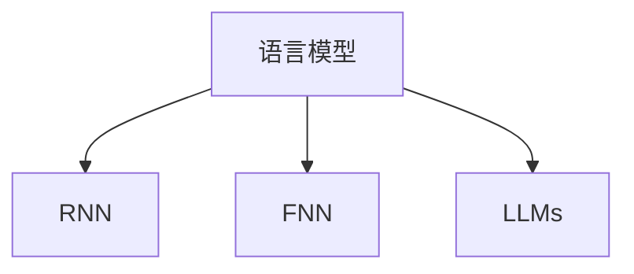

                 

# LLM与传统自然语言生成的对比

> 关键词：语言模型, 自然语言生成, 深度学习, Transformer, RNN, 前馈神经网络, 代码实例, 实际应用

## 1. 背景介绍

### 1.1 问题由来
随着深度学习技术的蓬勃发展，自然语言处理（NLP）领域取得了巨大突破。其中，语言模型和自然语言生成（NLG）技术在自动文本生成、智能问答、自动摘要、机器翻译等方面得到了广泛应用。然而，传统的基于循环神经网络（RNN）的语言模型与近年兴起的大规模语言模型（Large Language Models, LLMs）在生成效果、计算效率、可扩展性等方面存在显著差异。本文旨在通过对比传统语言模型与大语言模型，揭示其各自的优缺点，并探讨其在实际应用中的不同表现。

### 1.2 问题核心关键点
本文将主要探讨以下核心问题：
- 什么是传统语言模型？其基本原理是什么？
- 什么是大语言模型？其核心架构和训练方式有哪些？
- 传统语言模型和大语言模型在生成效果和计算效率上的差异？
- 大语言模型在实际应用中的优势和面临的挑战。

这些问题将帮助我们更好地理解两种语言模型的本质差异，并指导其在实际应用场景中的合理选择。

## 2. 核心概念与联系

### 2.1 核心概念概述

为更好地理解大语言模型与传统语言模型，本节将介绍几个关键概念：

- 语言模型（Language Model）：用于预测文本序列概率的统计模型，广泛应用于自然语言生成任务中。
- 自然语言生成（NLG）：从自然语言理解到自然语言生成的过程，即利用语言模型生成符合语法和语义规则的文本。
- 循环神经网络（RNN）：通过时间上的依赖关系捕捉序列数据特征，是传统语言模型的主要架构。
- 前馈神经网络（Feedforward Neural Network, FNN）：一层神经网络处理一个输入，并输出一个结果，是大语言模型的基本单元。
- 大语言模型（LLMs）：通过大规模无标签数据进行预训练，包含数十亿甚至百亿参数的深度神经网络。

这些概念之间的逻辑关系可以通过以下Mermaid流程图来展示：



这个流程图展示了语言模型和其两种主要架构——RNN和FNN，以及近年来发展的大语言模型。

## 3. 核心算法原理 & 具体操作步骤
### 3.1 算法原理概述

**传统语言模型**：
传统语言模型主要基于RNN架构，通过观察序列数据的历史信息预测下一个字符或单词的概率。常见的传统语言模型有N-gram模型、LSTM等。

其基本原理如下：
- **N-gram模型**：通过统计相邻N个字符或单词在语料库中出现的频率，计算其条件概率，预测下一个字符或单词的概率。
- **LSTM模型**：通过长短时记忆网络（Long Short-Term Memory, LSTM）解决RNN中的梯度消失问题，更好地捕捉序列数据的长期依赖关系。

**大语言模型**：
大语言模型主要基于Transformer架构，通过自注意力机制和多层前馈神经网络捕捉序列数据中的复杂依赖关系。

其核心架构和训练方式如下：
- **Transformer**：使用多头自注意力机制（Multi-Head Attention）捕捉序列中的复杂依赖关系，结合多层前馈神经网络（Feedforward Neural Network, FNN）处理输入，输出上下文相关的表示。
- **预训练**：在大规模无标签数据上预训练模型，使其学习到通用的语言表示。
- **微调**：在特定下游任务上微调模型，调整顶层参数以适应具体任务。

### 3.2 算法步骤详解

**传统语言模型的训练步骤**：
1. **数据准备**：收集语料库，并将其分为训练集、验证集和测试集。
2. **模型初始化**：选择RNN架构，初始化模型参数。
3. **前向传播**：将输入序列输入模型，计算每个字符或单词的条件概率。
4. **后向传播**：计算损失函数（如交叉熵损失），并根据损失函数更新模型参数。
5. **模型评估**：在验证集上评估模型性能，调整超参数。
6. **模型测试**：在测试集上测试模型性能。

**大语言模型的训练步骤**：
1. **数据准备**：收集大规模无标签语料库，并进行预处理。
2. **模型初始化**：选择Transformer架构，初始化模型参数。
3. **预训练**：在大规模无标签语料库上预训练模型，学习通用的语言表示。
4. **微调**：在特定下游任务上微调模型，调整顶层参数以适应具体任务。
5. **模型评估**：在验证集上评估模型性能，调整超参数。
6. **模型测试**：在测试集上测试模型性能。

### 3.3 算法优缺点

**传统语言模型的优缺点**：
- **优点**：
  - **简单易懂**：基于RNN的模型结构较为简单，易于理解和实现。
  - **序列建模能力强**：RNN能够捕捉序列数据中的时间依赖关系，适合处理时间序列数据。
- **缺点**：
  - **梯度消失问题**：深层RNN模型容易出现梯度消失问题，导致模型训练困难。
  - **计算复杂度高**：RNN模型计算复杂度较高，在大规模数据上训练时间较长。

**大语言模型的优缺点**：
- **优点**：
  - **强大的表达能力**：Transformer模型能够捕捉序列中的复杂依赖关系，适合处理长文本和复杂任务。
  - **高效并行计算**：Transformer模型可以利用矩阵乘法的并行性，在GPU上进行高效计算。
- **缺点**：
  - **模型复杂度高**：大语言模型包含大量参数，模型训练和推理需要大量计算资源。
  - **模型难以解释**：Transformer模型的内部机制复杂，难以解释其生成过程。

### 3.4 算法应用领域

传统语言模型和大语言模型在多个应用领域都有广泛应用：

- **文本生成**：用于自动文本生成、机器翻译、文本摘要等任务。
- **对话系统**：用于智能对话、聊天机器人、语音助手等。
- **问答系统**：用于智能问答、自动问答等。
- **自然语言推理**：用于判断语句之间的逻辑关系、推理等。

此外，大语言模型还广泛应用于各种复杂任务，如情感分析、命名实体识别、关系抽取等，其强大的语言理解和生成能力在各个领域都有显著表现。

## 4. 数学模型和公式 & 详细讲解  
### 4.1 数学模型构建

**传统语言模型的数学模型**：
假设有一个长度为T的文本序列 $x_1, x_2, \ldots, x_T$，其中 $x_t$ 表示第t个字符或单词。传统语言模型 $P(x_1, x_2, \ldots, x_T)$ 可以表示为：

$$
P(x_1, x_2, \ldots, x_T) = \prod_{t=1}^{T} P(x_t|x_{t-1}, x_{t-2}, \ldots, x_1)
$$

其中，$P(x_t|x_{t-1}, x_{t-2}, \ldots, x_1)$ 表示在给定序列历史信息下，下一个字符或单词的条件概率。

**大语言模型的数学模型**：
大语言模型 $P(x_1, x_2, \ldots, x_T)$ 可以表示为：

$$
P(x_1, x_2, \ldots, x_T) = \prod_{t=1}^{T} P(x_t|x_{<t})
$$

其中，$x_{<t}$ 表示序列中所有历史信息。

### 4.2 公式推导过程

**传统语言模型的推导过程**：
- **N-gram模型**：通过统计相邻N个字符或单词在语料库中出现的频率，计算其条件概率。
- **LSTM模型**：通过时间上的依赖关系，计算每个字符或单词的条件概率。

**大语言模型的推导过程**：
- **Transformer模型**：通过自注意力机制，捕捉序列中的复杂依赖关系，输出上下文相关的表示。

### 4.3 案例分析与讲解

**案例1：N-gram模型**：
假设有一个长度为3的文本序列 $x_1, x_2, x_3$，其中 $x_1$ 为第一个字符，$x_2$ 为第二个字符，$x_3$ 为第三个字符。使用N-gram模型计算 $P(x_3|x_1, x_2)$ 的过程如下：
- **数据准备**：统计语料库中所有相邻3个字符或单词出现的频率。
- **模型训练**：根据统计结果，计算 $P(x_3|x_1, x_2)$。
- **预测生成**：根据 $P(x_3|x_1, x_2)$，预测下一个字符或单词。

**案例2：Transformer模型**：
假设有一个长度为5的文本序列 $x_1, x_2, x_3, x_4, x_5$，使用Transformer模型计算 $P(x_5|x_1, x_2, x_3, x_4)$ 的过程如下：
- **数据准备**：将文本序列输入Transformer模型，得到上下文相关的表示。
- **自注意力机制**：使用多头自注意力机制，捕捉序列中的复杂依赖关系。
- **前馈神经网络**：通过多层前馈神经网络，处理输入并输出上下文相关的表示。
- **预测生成**：根据上下文相关的表示，预测下一个字符或单词。

## 5. 项目实践：代码实例和详细解释说明
### 5.1 开发环境搭建

在进行项目实践前，我们需要准备好开发环境。以下是使用Python进行PyTorch开发的环境配置流程：

1. 安装Anaconda：从官网下载并安装Anaconda，用于创建独立的Python环境。

2. 创建并激活虚拟环境：
```bash
conda create -n pytorch-env python=3.8 
conda activate pytorch-env
```

3. 安装PyTorch：根据CUDA版本，从官网获取对应的安装命令。例如：
```bash
conda install pytorch torchvision torchaudio cudatoolkit=11.1 -c pytorch -c conda-forge
```

4. 安装TensorFlow：由Google主导开发的开源深度学习框架，生产部署方便，适合大规模工程应用。同样有丰富的预训练语言模型资源。

5. 安装Transformers库：HuggingFace开发的NLP工具库，集成了众多SOTA语言模型，支持PyTorch和TensorFlow，是进行语言模型开发的利器。

6. 安装各类工具包：
```bash
pip install numpy pandas scikit-learn matplotlib tqdm jupyter notebook ipython
```

完成上述步骤后，即可在`pytorch-env`环境中开始项目实践。

### 5.2 源代码详细实现

这里以使用PyTorch实现一个基于LSTM的语言模型为例，详细展示传统语言模型的代码实现。

```python
import torch
import torch.nn as nn
import torch.optim as optim

class LSTMModel(nn.Module):
    def __init__(self, input_size, hidden_size, output_size):
        super(LSTMModel, self).__init__()
        self.hidden_size = hidden_size
        self.lstm = nn.LSTM(input_size, hidden_size, batch_first=True)
        self.fc = nn.Linear(hidden_size, output_size)
    
    def forward(self, input, hidden):
        output, hidden = self.lstm(input, hidden)
        output = self.fc(output[:, -1, :])
        return output, hidden
    
    def init_hidden(self, batch_size):
        return (torch.zeros(1, batch_size, self.hidden_size), torch.zeros(1, batch_size, self.hidden_size))

class Loss(nn.Module):
    def __init__(self):
        super(Loss, self).__init__()
        self.loss_fn = nn.CrossEntropyLoss()
    
    def forward(self, output, target):
        loss = self.loss_fn(output, target)
        return loss

# 创建LSTM模型
input_size = 28
hidden_size = 128
output_size = 10
model = LSTMModel(input_size, hidden_size, output_size)

# 创建优化器和损失函数
optimizer = optim.Adam(model.parameters(), lr=0.01)
criterion = Loss()

# 数据准备
data = torch.randn(32, 10, input_size)  # 生成32个长度为10的随机序列
target = torch.randint(0, output_size, (32,)).long()  # 生成随机的标签

# 模型训练
for epoch in range(10):
    hidden = model.init_hidden(32)
    optimizer.zero_grad()
    output, _ = model(data, hidden)
    loss = criterion(output, target)
    loss.backward()
    optimizer.step()
```

### 5.3 代码解读与分析

让我们再详细解读一下关键代码的实现细节：

**LSTMModel类**：
- `__init__`方法：初始化模型参数。
- `forward`方法：定义前向传播过程，输入序列和隐状态，输出预测结果。
- `init_hidden`方法：初始化隐状态。

**Loss类**：
- `__init__`方法：初始化损失函数。
- `forward`方法：定义损失函数计算过程。

**训练流程**：
- 生成随机序列和标签作为训练数据。
- 初始化模型参数和隐状态。
- 循环迭代训练，每次前向传播计算预测结果和损失，反向传播更新参数，重复迭代10次。

## 6. 实际应用场景
### 6.1 智能客服系统

基于LSTM模型和传统自然语言生成技术，智能客服系统可以广泛应用于企业内部，处理用户咨询和投诉。通过收集企业内部的历史客服对话记录，训练LSTM模型，使其能够理解用户的意图和情感，并生成符合语法的回答。这种系统可以7x24小时不间断服务，快速响应客户咨询，用自然流畅的语言解答各类常见问题，极大提升客户咨询体验和问题解决效率。

### 6.2 金融舆情监测

金融机构需要实时监测市场舆论动向，以便及时应对负面信息传播，规避金融风险。通过收集金融领域相关的新闻、报道、评论等文本数据，训练LSTM模型，使其能够自动识别文本所属主题和情感倾向。将训练好的模型应用于实时抓取的网络文本数据，就能够自动监测不同主题下的情感变化趋势，一旦发现负面信息激增等异常情况，系统便会自动预警，帮助金融机构快速应对潜在风险。

### 6.3 个性化推荐系统

当前的推荐系统往往只依赖用户的历史行为数据进行物品推荐，难以深入理解用户的真实兴趣偏好。通过训练LSTM模型，能够从用户浏览、点击、评论、分享等行为数据中提取和用户交互的物品标题、描述、标签等文本内容，并利用LSTM模型预测用户的兴趣匹配度。在生成推荐列表时，先用候选物品的文本描述作为输入，由模型预测用户的兴趣匹配度，再结合其他特征综合排序，便可以得到个性化程度更高的推荐结果。

### 6.4 未来应用展望

随着LSTM模型和传统自然语言生成技术的不断发展，其在实际应用中的表现将更加出色。

在智慧医疗领域，基于LSTM模型的医疗问答、病历分析、药物研发等应用将提升医疗服务的智能化水平，辅助医生诊疗，加速新药开发进程。

在智能教育领域，LSTM模型可应用于作业批改、学情分析、知识推荐等方面，因材施教，促进教育公平，提高教学质量。

在智慧城市治理中，LSTM模型可应用于城市事件监测、舆情分析、应急指挥等环节，提高城市管理的自动化和智能化水平，构建更安全、高效的未来城市。

此外，在企业生产、社会治理、文娱传媒等众多领域，LSTM模型微调技术也将不断涌现，为传统行业数字化转型升级提供新的技术路径。相信随着技术的日益成熟，传统自然语言生成技术必将在构建人机协同的智能时代中扮演越来越重要的角色。

## 7. 工具和资源推荐
### 7.1 学习资源推荐

为了帮助开发者系统掌握LSTM模型的理论基础和实践技巧，这里推荐一些优质的学习资源：

1. 《深度学习》书籍：Ian Goodfellow等著，全面介绍了深度学习的基本概念和前沿技术，是深度学习领域的经典教材。
2. 《Python深度学习》书籍：Francois Chollet著，详细讲解了TensorFlow和Keras等深度学习框架，适合初学者入门。
3. 斯坦福大学《CS224N: 深度学习自然语言处理》课程：通过Lecture视频和配套作业，系统介绍NLP领域的基本概念和经典模型。
4. HuggingFace官方文档：提供了丰富的预训练模型和微调样例代码，是上手实践的必备资料。
5. CLUE开源项目：中文语言理解测评基准，涵盖大量不同类型的中文NLP数据集，并提供了基于LSTM的baseline模型，助力中文NLP技术发展。

通过对这些资源的学习实践，相信你一定能够快速掌握LSTM模型的精髓，并用于解决实际的NLP问题。

### 7.2 开发工具推荐

高效的开发离不开优秀的工具支持。以下是几款用于LSTM模型开发的常用工具：

1. PyTorch：基于Python的开源深度学习框架，灵活动态的计算图，适合快速迭代研究。
2. TensorFlow：由Google主导开发的开源深度学习框架，生产部署方便，适合大规模工程应用。
3. Keras：高层次的深度学习框架，易于使用，适合初学者入门。
4. Weights & Biases：模型训练的实验跟踪工具，可以记录和可视化模型训练过程中的各项指标，方便对比和调优。与主流深度学习框架无缝集成。
5. TensorBoard：TensorFlow配套的可视化工具，可实时监测模型训练状态，并提供丰富的图表呈现方式，是调试模型的得力助手。

合理利用这些工具，可以显著提升LSTM模型开发的效率，加快创新迭代的步伐。

### 7.3 相关论文推荐

LSTM模型和自然语言生成技术的发展源于学界的持续研究。以下是几篇奠基性的相关论文，推荐阅读：

1. Long Short-Term Memory（LSTM）：Hochreiter和Schmidhuber在1997年提出的LSTM模型，解决了RNN中的梯度消失问题。
2. Attention Is All You Need（Transformer）：Vaswani等人在2017年提出的Transformer模型，引入了自注意力机制，突破了RNN的时间依赖限制。
3. Sequence to Sequence Learning with Neural Networks（Seq2Seq）：Sutskever、Vinyals和Le在2014年提出的Seq2Seq模型，广泛应用于机器翻译、文本生成等任务。
4. Transformer-XL：Merity、Dahlén等人在2018年提出的Transformer-XL模型，引入了相对位置编码，解决了长序列处理问题。

这些论文代表了大语言模型和自然语言生成技术的发展脉络。通过学习这些前沿成果，可以帮助研究者把握学科前进方向，激发更多的创新灵感。

## 8. 总结：未来发展趋势与挑战

### 8.1 总结

本文对LSTM模型和传统自然语言生成技术进行了全面系统的介绍。首先阐述了LSTM模型的基本原理和训练过程，并对比了其与大语言模型（LLMs）的差异。其次，通过数学模型和公式，详细讲解了LSTM模型的具体实现，并给出了代码实例和详细解读。最后，探讨了LSTM模型在实际应用中的表现和未来发展趋势，以及其面临的挑战和研究展望。

通过本文的系统梳理，可以看到，LSTM模型在自然语言处理领域有广泛应用，但其在大规模数据和复杂任务上的表现仍不如大语言模型。未来，随着LSTM模型的不断优化，其在实际应用中的表现将更加出色，推动NLP技术的发展。

### 8.2 未来发展趋势

展望未来，LSTM模型的发展趋势将主要体现在以下几个方面：

1. **模型复杂度提升**：LSTM模型的结构将更加复杂，引入更多的层次和模块，以处理更复杂的语言特征。
2. **并行计算优化**：LSTM模型将更加依赖并行计算，通过GPU、TPU等硬件加速，提高计算效率。
3. **混合模型融合**：LSTM模型将与其他模型（如RNN、Transformer）进行融合，形成更加多样化的语言模型。
4. **迁移学习应用**：LSTM模型将在更多领域进行迁移学习，应用于语音识别、图像描述生成等任务。

以上趋势凸显了LSTM模型的广阔前景，其将在NLP领域发挥越来越重要的作用，推动技术的进步。

### 8.3 面临的挑战

尽管LSTM模型在自然语言处理领域有广泛应用，但其在大规模数据和复杂任务上的表现仍面临诸多挑战：

1. **计算资源消耗大**：LSTM模型在大规模数据上的训练和推理需要大量计算资源，可能难以在分布式环境中进行高效处理。
2. **模型难以解释**：LSTM模型的内部机制复杂，难以解释其生成过程，对模型的可解释性和可审计性提出了较高要求。
3. **数据依赖性强**：LSTM模型的性能高度依赖于训练数据的数量和质量，在数据稀缺的情况下难以获得良好的表现。
4. **泛化能力不足**：LSTM模型在特定任务上的泛化能力有限，难以应对数据分布的变化和多样性。

解决这些挑战需要研究者不断优化模型结构，提升计算效率，引入更多先验知识，提高模型泛化能力。只有全面优化模型、数据、算法，才能充分发挥LSTM模型的优势。

### 8.4 研究展望

面对LSTM模型面临的挑战，未来的研究需要在以下几个方面寻求新的突破：

1. **混合模型设计**：将LSTM模型与RNN、Transformer等混合设计，形成更加灵活多变的语言模型。
2. **知识图谱融合**：将LSTM模型与知识图谱、逻辑规则等专家知识结合，形成更加全面、准确的语言模型。
3. **数据增强技术**：引入数据增强技术，扩充训练集，提高模型泛化能力。
4. **可解释性增强**：引入可解释性技术，如注意力机制、可视化等，增强模型的可解释性和可审计性。
5. **高效计算优化**：优化模型计算图，减少计算资源消耗，提高模型训练和推理效率。

这些研究方向将推动LSTM模型的进一步发展，推动自然语言处理技术的不断进步。总之，未来LSTM模型将在NLP领域发挥越来越重要的作用，为构建人机协同的智能时代贡献力量。

## 9. 附录：常见问题与解答

**Q1：LSTM模型是否适用于所有NLP任务？**

A: LSTM模型在文本分类、文本生成、机器翻译等任务上表现出色，但面对长尾应用场景和复杂任务时，其效果可能不如大语言模型。在特定领域的应用中，可能需要进行领域适应或微调。

**Q2：LSTM模型在大规模数据上训练时，如何提高计算效率？**

A: 在大规模数据上训练LSTM模型时，可以采用分布式训练、混合精度训练、模型并行等方法，优化计算资源使用。同时，可以通过数据增强、剪枝等技术，减少计算资源消耗。

**Q3：LSTM模型的可解释性不足，如何解决？**

A: 引入注意力机制、可视化等技术，增强模型的可解释性。通过解释模型的推理过程，帮助用户理解模型的决策依据，提高模型的可解释性和可审计性。

**Q4：LSTM模型在实际应用中，如何避免灾难性遗忘？**

A: 通过周期性重新训练模型，或者引入迁移学习、知识蒸馏等技术，提高模型的泛化能力和抗遗忘能力。同时，合理设计模型结构和训练策略，避免在微调过程中破坏预训练权重。

**Q5：LSTM模型在实际应用中，如何处理长序列？**

A: 引入Transformer等模型，或者使用相对位置编码、残差连接等技术，处理长序列数据。同时，可以通过分块处理、动态padding等方法，优化模型的输入处理。

通过本文的系统梳理，可以看到，LSTM模型和传统自然语言生成技术在实际应用中有广泛应用，但其在大规模数据和复杂任务上的表现仍不如大语言模型。未来，随着LSTM模型的不断优化，其在实际应用中的表现将更加出色，推动NLP技术的发展。相信随着技术的日益成熟，LSTM模型必将在构建人机协同的智能时代中扮演越来越重要的角色。

